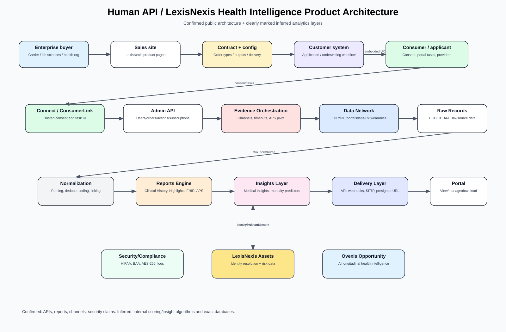
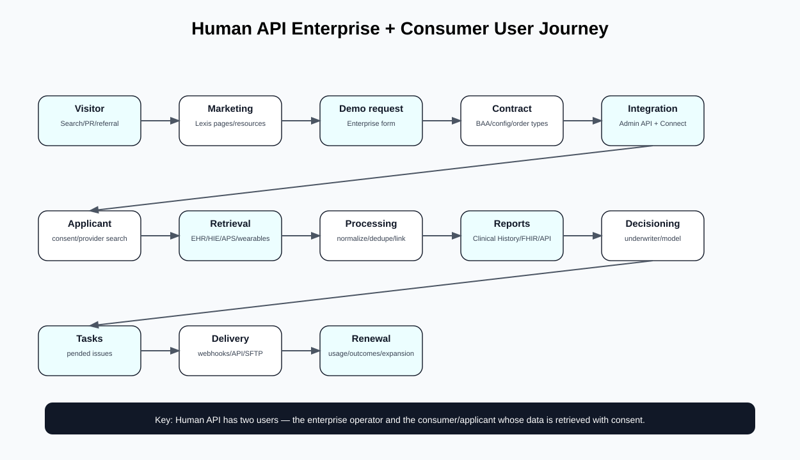
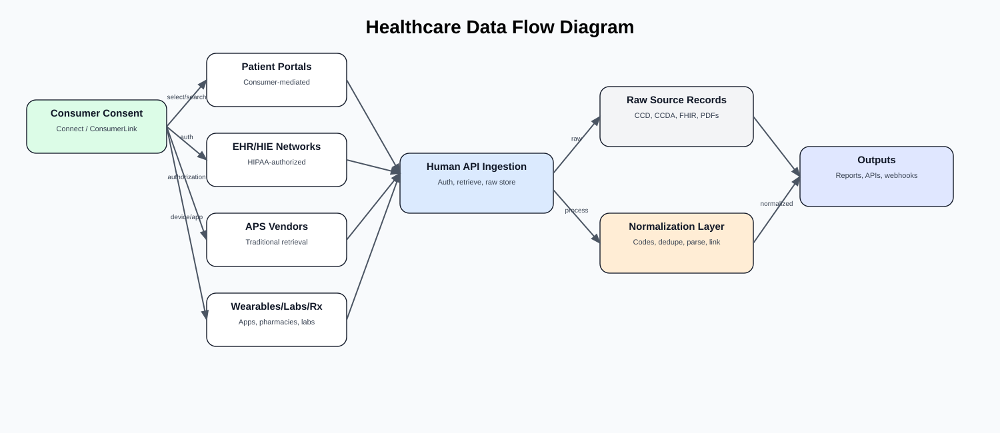
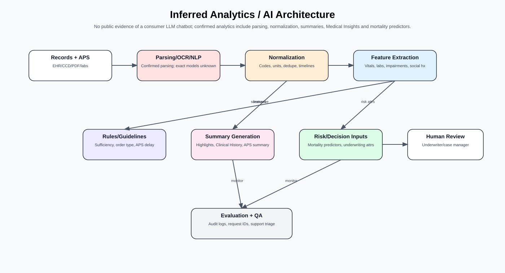
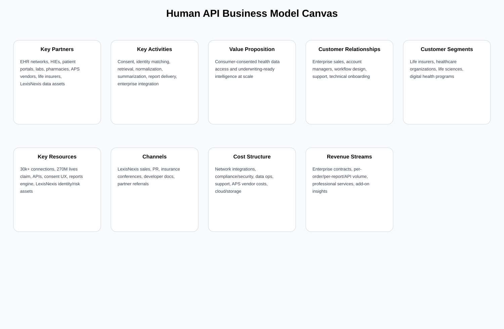

# Human API / LexisNexis Health Intelligence — Competitive Intelligence & Reverse Engineering Report

**Target:** Human API — https://www.humanapi.co/  
**Current public destination:** `https://www.humanapi.co/` redirects to LexisNexis® Health Intelligence EHR (`https://risk.lexisnexis.com/products/health-intelligence-ehr`).  
**Prepared for:** Ovexis  
**Research date:** 2026-07-25, Asia/Calcutta  
**Method:** Public websites, public developer documentation, public press releases, public web search, passive browser/network observation, screenshots, public API reference review. No credentialed access, no API calls requiring credentials, no scraping of restricted systems, no attempt to bypass access controls.

## Evidence notation

- 🟢 **Confirmed** — directly observed in public pages, docs, screenshots, headers, or official/public source.
- 🟡 **Strong inference** — high-confidence inference from observed evidence.
- 🔴 **Speculation** — plausible but not verifiable from public evidence.

Supporting files in this folder:

- `feature_inventory.xlsx` / `feature_inventory.csv`
- `product_architecture.svg`
- `user_journey_diagram.svg`
- `healthcare_data_flow.svg`
- `ai_architecture_inferred.svg`
- `business_model_canvas.svg`
- `screenshot_catalog.xlsx` / `screenshot_catalog.csv`
- `screenshots/`
- `capture_inventory.json`

---

# PART 1 — Executive Summary

## What exactly is Human API?

🟢 **Confirmed:** Human API is now part of LexisNexis Risk Solutions. The original Human API brand has been absorbed into two visible offerings:

1. **LexisNexis® Human API™** — a consumer-consented health data platform for healthcare and life sciences. Its public product page says it connects health data to advance clinical research and healthcare, using a consumer-permission health data network, standardized/normalized data, a consumer access wizard, an enterprise portal, and flexible data delivery.
2. **LexisNexis® Health Intelligence** — formerly Human API Health Intelligence, positioned for life insurance carriers. It delivers EHR access, clinical-history reports, highlights summaries, medical insights, data normalization, APS fallback, and underwriting workflow acceleration.

🟢 **Confirmed:** The official acquisition press release says LexisNexis Risk Solutions acquired Human API in April 2023, calling it a proprietary consumer-driven data platform that supports consumer consent management, healthcare data access, care coordination, and automated life insurance underwriting.

🟡 **Strong inference:** Human API is no longer primarily a standalone startup selling generic developer APIs. It is now a specialized enterprise health-data infrastructure and underwriting intelligence layer inside LexisNexis Risk Solutions.

## Why was it created?

🟢 **Confirmed:** Older Human API documentation states the goal was to create a patient-centric platform that allows users to transfer medical data from anywhere to anywhere, and to power healthcare applications by letting users share medical history with trusted apps and organizations.

🟢 **Confirmed:** v2.3 docs describe Human API as a consumer-controlled health data platform giving users a simple way to connect and share health data with health businesses, platforms, and applications.

🟡 **Strong inference:** Human API was created to solve healthcare data fragmentation: medical records, labs, medications, wearable data, and patient-portal data are scattered across systems that enterprises cannot easily access, normalize, or operationalize.

## What category is it creating?

🟢 **Confirmed:** Public copy uses categories such as consumer-consented health data, health intelligence platform, EHRs for life insurance, consumer consent management, real-world data, whole person data, and digital health data.

🟡 **Strong inference:** The category is **consumer-consented longitudinal health data infrastructure** plus **health-intelligence workflow automation**. In life insurance, the narrower category is **EHR-powered underwriting evidence orchestration**.

## What customer problem does it solve?

🟢 **Confirmed:** Human API/LexisNexis says carriers struggle to adopt EHRs at scale because underwriters do not use them enough and integrating EHRs into workflows is hard. The product claims to help carriers make faster, more informed underwriting decisions, mitigate mortality slippage, improve customer experience, and transform underwriting.

🟢 **Confirmed:** The Human API page says healthcare and life science organizations need secure, user-friendly methods for patients to share data to optimize care, advance clinical research, and improve outcomes.

🟡 **Strong inference:** Human API removes the burden of building integrations to thousands of health data sources, maintaining consent flows, normalizing messy clinical data, and delivering it into enterprise workflows.

## What pain points does it remove?

🟢 **Confirmed pain points addressed by public docs:**

- Fragmented healthcare data across portals, EHRs, HIEs, labs, pharmacies, wearables, and APS vendors.
- Manual APS ordering and long cycle times.
- Underwriter fatigue from long, duplicative EHR records.
- Pended cases requiring missing information, fee approvals, special authorization forms, or responses.
- Need for report delivery via API, webhook, SFTP, HTTP, or pre-signed URLs.
- Need for consumer consent and data deletion/revocation controls.

🟡 **Strong inference:** It also removes integration risk, vendor sprawl, data quality uncertainty, and internal build-vs-buy complexity for carriers and healthcare organizations.

## What job is the customer hiring it for?

🟢 **Confirmed:** Life insurers hire it to obtain applicant health data quickly, with consumer consent, in formats useful for underwriting. Healthcare/life sciences organizations hire it to get consumer-level longitudinal data and standardized digital outputs for programs, patient screening, and research.

🟡 **Strong inference:** The deeper job is: **“Give me the health record evidence I need, in a trusted, consented, normalized, workflow-ready form, without forcing my organization to build/operate a national health-data network.”**

## What business are they REALLY in?

🟢 **Confirmed:** The product monetizes enterprise access to consumer-consented health data, normalized reports, delivery infrastructure, and health intelligence outputs.

🟡 **Strong inference:** Human API is really in the **health-data liquidity, consent, identity matching, evidence orchestration, and decision-support infrastructure business**. It is not just an API; it is a data-network and workflow-orchestration business.

## What business are they NOT in?

🟢 **Confirmed:** Human API documentation and product pages do not position it as a direct patient-care provider, diagnostics lab, consumer wellness coach, or standalone EHR.

🟡 **Strong inference:** Human API is not primarily a B2C app company today, not a provider practice, not a consumer longevity membership, and not a clinician medical-answer chatbot like OpenEvidence.

---

# PART 2 — Company Analysis

## Ownership and corporate status

🟢 **Confirmed:** LexisNexis Risk Solutions announced it acquired Human API on 2023-04-25. The official press release identifies Human API as part of LexisNexis Risk Solutions after the acquisition.

🟢 **Confirmed:** The current `humanapi.co` URL redirects to a LexisNexis product page.

🟡 **Strong inference:** Human API’s standalone brand equity is being retained only where useful for healthcare/life sciences and insurance-market recognition, while product commercialization is now via LexisNexis.

## Founders and leadership

🟢 **Confirmed:** The official acquisition press release identifies **Andrei Pop** as CEO of Human API at acquisition.

🟢 **Confirmed from public company directories/search snippets:** Public directories list founders as Andrei Pop and Ola Wiberg; Crunchbase snippets additionally list Michael DePalma. Because these are third-party sources and conflict slightly, treat exact founder roster beyond Andrei/Ola as not fully verified by official source.

🟡 **Strong inference:** After acquisition, leadership and roadmap are governed by LexisNexis Risk Solutions insurance/healthcare leadership rather than an independent startup board.

## History and timeline

| Year/date | Classification | Event | Evidence |
|---|---|---|---|
| 2013/2014 | 🟢 Confirmed by public directories | Human API founded around 2013/2014 | Tracxn/Dealroom/Crunchbase snippets |
| 2015 | 🟢 Confirmed by Dealroom search snippet | Series A about $6.6M | Dealroom snippet |
| 2019 | 🟢 Confirmed by Life Insurance International | Raised nearly $10M from Guardian Life, SCOR, BlueRun, SciFi VC | Public article |
| 2020 | 🟢 Confirmed by public snippets | Series C around $20M; investors include Samsung Ventures, CNO, Allianz Life Ventures, Moneta, BlueRun, SCOR, Guardian | Dealroom/Athletech snippets |
| 2021 | 🟢 Confirmed by PR | Health Intelligence Platform launched for life insurance underwriting | PRNewswire article |
| 2021 | 🟢 Confirmed by PR | CLEAR partnership for COVID test/vaccine data | PR/public articles |
| 2022 | 🟢 Confirmed by PR/public articles | Partnerships with USAA, Pacific Life, Nationwide, New York Life mentioned in public sources | BusinessWire/PRNewswire/search results |
| 2023-04-25 | 🟢 Confirmed official | LexisNexis Risk Solutions acquired Human API | Official LexisNexis press release |
| 2025-02-20 | 🟢 Confirmed official | LexisNexis Health Intelligence innovation announcement | Official LexisNexis press release |

## Mission, vision, philosophy

🟢 **Confirmed:** Older docs say Human API’s goal is to power healthcare applications by allowing patients/users to share medical history and context with trusted applications and organizations of their choice.

🟢 **Confirmed:** LinkedIn snippet quotes Andrei Pop saying Human API started with a vision of creating “health data liquidity, valued by customers, and controlled by consumers.”

🟡 **Strong inference:** The philosophy is consumer-permissioned data liquidity: consumers remain the consent anchor, while enterprises receive normalized, usable health intelligence.

## Funding, investors, valuation

🟢 **Confirmed from public directories/search snippets:** Human API raised roughly **$36–37M** total across multiple rounds. Dealroom snippet lists Series A ~$6.6M, Series B ~$10M, Series C ~$20M, plus undisclosed rounds.

🟢 **Confirmed from public snippets:** Investors included BlueRun Ventures, Andreessen Horowitz, Innovation Endeavors, Guardian Life, SCOR, Allianz Life Ventures, Samsung Ventures, CNO Financial Group, Moneta VC, and others.

🔴 **Speculation:** Acquisition price and valuation are not publicly verified in the sources observed.

## Partnerships

🟢 **Confirmed public partnerships/customers:** Prudential, Guardian, John Hancock, AAA Life, Principal, Ladder, USAA Life, Pacific Life, Nationwide, CLEAR, and CLEARED4 appear in public announcements or snippets.

🟡 **Strong inference:** Human API’s best distribution before acquisition was through life-insurance carrier partnerships and insurtech workflow adoption, not self-serve developer virality.

## Hiring/offices/geography

🟢 **Confirmed:** Public directories list San Mateo, CA as Human API location historically. LexisNexis Risk Solutions is headquartered in metro Atlanta and RELX operates globally.

🟢 **Confirmed:** LexisNexis contact forms include global country options, but Health Intelligence is explicitly for U.S. life insurance in 2025 press material.

🟡 **Strong inference:** Primary commercial focus for Health Intelligence is U.S. life insurance; Human API healthcare/life sciences page has broader global contact routing but U.S. data network claims dominate.

---

# PART 3 — Product Reverse Engineering

## Product surfaces

### 1. Marketing/sales site

🟢 **Confirmed:** Public LexisNexis product pages for Human API and Health Intelligence describe capabilities, benefits, resources, and contact forms.

### 2. Developer documentation

🟢 **Confirmed:** `reference.humanapi.co` is a ReadMe-powered docs portal exposing guides and OpenAPI snippets for Admin API, Auth, Connect, order types, reports, webhooks, and legacy v2.3 Medical/Wellness APIs.

### 3. Connect / Consumer Access Wizard

🟢 **Confirmed:** Product page lists “Consumer Access Wizard” with 30K+ unique data connections, 270M+ people, medical records, labs, and 300+ wearables/apps. v2.3 docs show Connect as an authentication widget for users to share health data.

### 4. Enterprise Portal

🟢 **Confirmed:** Product page lists an Enterprise Portal as a hosted web portal to view and manage consumer data. v2.3 docs describe Human API Portal for inviting people, viewing profiles, connection status, interactive timeline, and downloading data.

### 5. Admin API / Health Intelligence API

🟢 **Confirmed:** APIs include token generation, create user/order, list users, get user details, providers, subscriptions, actions, order types, resources/consumer-link, user reports, and report by ID.

### 6. Report engine

🟢 **Confirmed:** Report types include Clinical History, Highlights Summary, Health Check Summary, APS, FHIR report, Complete Medical Record/CCDraw, API Data JSON, combined reports, PDF/HTML/JSON/ZIP outputs.

### 7. Webhooks/delivery

🟢 **Confirmed:** Order Summary Notification and APS Status Notes Notification are documented. Report delivery supports HTTP multipart, SFTP, and pre-signed URLs.

### 8. Data sources/network

🟢 **Confirmed:** Public pages and docs mention EHR networks, HIEs, patient portals, hospitals, clinics, pharmacies, labs, wearables/apps, direct EMR, APS vendors, QHINs, and traditional retrieval partners.

## Every feature observed or inferable

See `feature_inventory.xlsx` for 76 features. Major product categories:

- Consent and patient/applicant access.
- Enterprise lead capture and account management.
- Order creation and retrieval workflow.
- Order types and retrieval-channel configuration.
- Provider search and suggested sources.
- Pended tasks and task manager.
- Report generation and delivery.
- Medical/Wellness API endpoints.
- Normalization, parsing, linking, and Medical Insights.
- Security, logging, deletion, BAAs, Epic/ONC transparency documentation.

## Screens and workflows

### Marketing page screens

🟢 **Confirmed:** Human API page includes hero, use-case sections for clinical trial screening and digital health programs, flow graphic, contact form, wearable network CTA, insurance cross-link, feature grid, and demo form.

🟢 **Confirmed:** Health Intelligence page includes hero, problem framing, value stats, Human API cross-link, differentiator bullets, product tabs, resources, contact form.

### Developer docs screens

🟢 **Confirmed:** ReadMe docs include left navigation, API explorer elements, code samples, OpenAPI definitions, authentication inputs, response schemas, and “Try It” request history UI.

### End-consumer screens

🟢 **Confirmed from docs/screenshots:** Connect popup lets users search healthcare providers or wellness sources. MyHumanAPI lets patients aggregate, view, download, and manage data connections.

🟡 **Strong inference:** Current production consumer screens likely include provider search, portal credentials/OAuth, consent language, task resolution, special authorization signing, and progress states.

### Enterprise operator screens

🟢 **Confirmed from docs:** Enterprise Portal can view/manage consumer data; order types appear in UI; portal supports downloads and timeline. Public docs mention underwriters/case managers should see statuses and tasks.

🟡 **Strong inference:** Enterprise portal includes case list, order detail, status, task links, report downloads, subscriptions/producers, provider info, and support escalation.

## CTAs

🟢 **Confirmed CTAs:** Contact Us, Download brochure, Click Here for Human API/Health Intelligence cross-links, View wearable network coverage, Talk to expert, Submit form, Download, Watch webinar, Read press release, API “Try It”.

## User roles

🟢 **Confirmed / explicit roles:** Consumer/patient/applicant, customer/developer, underwriter, case manager, agent/producer/subscriber, account manager/customer service representative, Human API support.

🟡 **Strong inference:** Additional internal roles likely include data operations, APS vendor coordinator, customer success, security/compliance, and clinical/content analysts.

## Hidden product assumptions

🟡 **Strong inference:**

- Applicant consent is acceptable in high-stakes underwriting when framed as faster/less invasive.
- A hybrid retrieval network beats any single EHR network.
- Underwriters will not adopt raw EHRs unless reports are shortened and summarized.
- Enterprise customers require custom order types rather than one-size-fits-all APIs.
- Data completeness/hit rate is the real KPI, not just API availability.

---

# PART 4 — User Journey

## Visitor → Marketing

🟢 **Confirmed:** Public visitors arrive via LexisNexis product pages, press releases, resources, webinars, or docs.

## Marketing → Signup / Contact

🟢 **Confirmed:** There is no self-serve credit-card signup visible for the enterprise product. The primary conversion is a contact/demo form.

🟡 **Strong inference:** Sales-assisted procurement is required due to PHI, BAAs, custom order types, data delivery configuration, and enterprise workflow integration.

## Contract → Integration

🟢 **Confirmed:** v2.3 docs state paid subscription/active contract is required. Developers need clientId/clientSecret, Connect integration, and Admin API tokens.

## Verification and permissions

🟢 **Confirmed:** Connect uses session tokens and user authorization. Epic docs say Human API leverages OAuth 2.0 when available and all transactions are initiated by the patient/user.

## Health data connection

🟢 **Confirmed:** Users search for healthcare providers or wellness sources, connect accounts, and may sign special authorization forms or resolve tasks.

## Dashboard / portal

🟢 **Confirmed:** Enterprise Portal and MyHumanAPI are documented. Portal supports invite/manage/view/timeline/download. MyHumanAPI lets patients aggregate/view/download data.

## Reports

🟢 **Confirmed:** Reports are generated shortly after authorization and retrieval, then made available manually in portal, via API, or via automated push.

## Recommendations / AI

🟢 **Confirmed:** No consumer-facing AI recommendation journey was observed. Health Intelligence claims Medical Insights, mortality predictors, parsing, normalization, and APS summarization.

🟡 **Strong inference:** Recommendations in this context are underwriting/business decisions made by carrier systems or underwriters, not Human API giving medical advice to consumers.

## Retention, renewal, referral

🟢 **Confirmed:** No consumer subscription/renewal/referral flow is visible. Enterprise retention is driven by order volume, hit rates, cycle-time reduction, report adoption, and integration depth.

---

# PART 5 — UX Audit

## Typography and design system

🟢 **Confirmed:** LexisNexis product pages use corporate typography, breadcrumb navigation, large hero image, tiles/cards, icon bullets, large numeric proof points, resource cards, and long lead forms. Docs use ReadMe’s developer-doc layout.

🟡 **Strong inference:** Design optimizes for enterprise trust and procurement, not consumer delight.

## Navigation

🟢 **Confirmed:** Risk site navigation is broad and corporate, spanning Products, Industries, Resources, regions, search, and global language/country links. Docs portal has left-nav/reference sections.

## Accessibility

🟢 **Confirmed:** Docs include skip links; product pages contain semantic headings, but screenshots show long forms and dense global nav.

🟡 **Strong inference:** Corporate page accessibility is likely acceptable but not optimized for a modern PLG developer experience.

## Forms and friction

🟢 **Confirmed:** Product lead forms request first name, last name, work phone, work email, company, country, zip, industry, subsector, solution of interest, job title, timing, referral source, free-text need, and reCAPTCHA.

🟡 **Strong inference:** High form friction is intentional qualification. It filters for enterprise buyers but blocks developer-led exploration.

## Trust signals

🟢 **Confirmed:** Trust signals include LexisNexis brand, RELX ownership, HIPAA compliance statements, AES-256 encryption, HTTPS, audit logging, BAAs, Epic/ONC transparency page, QHIN/QHIO language in broader interoperability market, customer logos/press, ROI stats, and official press releases.

## Color psychology

🟢 **Confirmed:** LexisNexis uses corporate blue/white/gray with red accents and healthcare imagery. ReadMe docs use developer-neutral white/gray.

🟡 **Strong inference:** The palette conveys institutional trust and risk/compliance seriousness rather than consumer warmth.

## Conversion optimization

🟢 **Confirmed:** The sales pages use proof metrics: up to 79% EHR-only decisions without extra evidence, 2x data versus other vendors, 9 days cycle-time reduction, 10% placement-rate improvement, all labeled LexisNexis internal study 2024.

🟡 **Strong inference:** These proof points are targeted at carrier executives and underwriting leaders, not developers.

## Friction points

🟢 **Confirmed:** Docs contain several outdated or broken links (e.g., v2.3 pages and current llms references with 404 pages for Apple Health/wellness sources/data network). Some docs show “Updated 5 months ago” while linking to old `humanapi.co` paths.

🟡 **Strong inference:** Documentation migration after acquisition is incomplete, creating developer trust/friction risk.

---

# PART 6 — Technical Stack Reverse Engineering

## Public website stack

🟢 **Confirmed by headers and HTML:**

- `risk.lexisnexis.com` is behind Cloudflare.
- Server header: Cloudflare.
- HSTS present (`max-age=31536000`).
- CSP present, broad and includes reCAPTCHA, tracking.risk.lexisnexis.com, jQuery, gstatic, Vimeo, OneTrust, 6sense, nrich.ai, VWO, Adobe/marketing tooling, etc.
- `ASP.NET_SessionId` and `SC_ANALYTICS_GLOBAL_COOKIE` cookies observed.
- Sitecore strings observed in HTML.
- OneTrust/CookieLaw, Eloqua/Oracle marketing, Adobe DTM/Launch, Google Tag Manager, 6sense, ZoomInfo, VWO, LinkedIn, Bing, Facebook/Meta, and Vimeo hosts observed.

🟡 **Strong inference:** The LexisNexis marketing site is a Sitecore/ASP.NET enterprise CMS behind Cloudflare with heavy B2B marketing/ABM instrumentation.

## Documentation stack

🟢 **Confirmed:** `reference.humanapi.co` is ReadMe-powered and behind Cloudflare. Headers include HSTS, `x-frame-options: Deny`, `x-content-type-options: nosniff`, and ReadMe-style docs with React/Next-like assets.

## API stack

🟢 **Confirmed:** API documentation references:

- `https://auth.humanapi.co` for token endpoints.
- `https://admin.humanapi.co` for Admin API.
- `https://api.humanapi.co/v1/human/...` for legacy normalized health data APIs.
- `https://cdn.humanapi.co/humanapi-connect-client@...js` for Connect client.

🟢 **Confirmed:** Auth uses bearer tokens/JWT format in OpenAPI. Token endpoints use `client_id`, `client_secret`, `client_user_id`, `type`, and optional scopes/email.

## Backend/databases/cloud

🟢 **Confirmed:** Human API docs say database servers encrypt data with AES-256 and key management is separated from database/application servers.

🔴 **Speculation:** Exact cloud provider and database are not public in official docs. Older public job/technology snippets mention AWS/Redshift in third-party data, but this is not sufficient to confirm current infrastructure.

## Caching/CDN

🟢 **Confirmed:** Cloudflare fronts both risk.lexisnexis.com and reference.humanapi.co. Docs use CDN assets. Connect uses `cdn.humanapi.co`.

## Authentication

🟢 **Confirmed:** Admin and Connect APIs use bearer tokens. Epic docs say OAuth 2.0 is used when available for EHR/FHIR connections. Connect uses a session token in `data-hapi-token`.

## Analytics/marketing SDKs

🟢 **Confirmed via network:** Google Tag Manager, Google Analytics, Adobe/DTM, OneTrust, 6sense, nrich.ai, ZoomInfo, LinkedIn, Bing, VWO, Facebook, Vimeo.

## Payment gateway

🟢 **Confirmed:** No payment gateway was observed for Human API/LexisNexis enterprise product. It is sales/contract-driven.

---

# PART 7 — API Investigation

## Public APIs

🟢 **Confirmed:** Public documentation exposes OpenAPI definitions for Admin API and Auth endpoints, plus legacy Medical/Wellness API pages.

## Authentication

🟢 **Confirmed endpoints:**

- `POST https://auth.humanapi.co/v1/admin/token`
- `POST https://auth.humanapi.co/v1/connect/token`

🟢 **Confirmed security model:** Bearer tokens/JWT for Admin API; client credentials for token exchange; Connect session token for browser widget.

## Core Admin API endpoints

| Endpoint | Method | Purpose | Evidence |
|---|---:|---|---|
| `/api/v1/order-types` | GET | List configured order types | Docs |
| `/api/v1/users` | GET | List active users | Docs |
| `/api/v1/users` | POST | Create user/order | Docs |
| `/api/v1/users/{humanId}` | GET | Get user/order details | Docs |
| `/api/v1/users/actions` | POST | `resync` or `abort` | Docs |
| `/api/v1/users/providers` | GET | Retrieve user providers | Docs |
| `/api/v1/subscriptions` | GET/POST | Manage producer/agent subscriptions | Docs |
| `/api/v1/subscriptions/{subscriptionId}` | GET/DELETE | Manage subscription details | Docs |
| `/api/v1/resources/consumer-link` | POST | Generate link to task manager | Docs |
| `/api/v1/user/reports` | GET | List reports | Docs |
| `/api/v1/user/reports/{reportId}` | GET | Fetch report content | Docs |

## Webhooks/events

🟢 **Confirmed:**

- Order Summary Notification: order terminal state, timedOut, reportsAvailable, reports, dataAvailable, fcraSuppressed.
- APS Status Notes Notification: vendor progress notes, provider names/ids, clientProviderId.

## Reports and formats

🟢 **Confirmed:** PDF, HTML, JSON, ZIP, XML CCD/CCDA, FHIR R4 ndjson zip, APS PDF, combined reports.

## Rate limits

🔴 **Speculation:** Public docs observed do not specify rate limits. Must be contract-defined or hidden.

## GraphQL

🟢 **Confirmed:** No GraphQL endpoint was observed in public docs.

## FHIR / HL7 / CCD

🟢 **Confirmed:** FHIR R4 report output exists as zip of ndjson files. CCD endpoint/report exists. Human API says Medical API modeled after FHIR data types and was working on exporting exactly according to FHIR spec in Epic docs.

---

# PART 8 — Healthcare Data Architecture

## Data sources

🟢 **Confirmed sources:**

- Medical records from hospitals and patient portals.
- EHR networks.
- HIEs.
- Direct EMR networks.
- QHINs/patient portals.
- Hospitals and clinics.
- Pharmacies.
- Labs.
- Wearables and fitness apps.
- APS retrieval vendors.
- Attachments such as HIPAA authorization PDFs.

## Scale claims

🟢 **Confirmed:** Product pages claim over **30,000 data connections/sources**, access for **over 270 million lives**, and **300+ wearables and apps**.

## Retrieval channels

🟢 **Confirmed:** Order Type docs list Consumer Mediated, Digital HIPAA Auth, and Traditional HIPAA Auth. Order Guidelines distinguish Patient Portals, Direct EMR, HIEs, and APS vendors.

## Identity and matching

🟢 **Confirmed:** Order guidelines show required fields for different channels: name, DOB, gender, SSN, address, providers, attachments, conditions. 2025 Lexis press says Health Intelligence leverages LexID®, an advanced proprietary linking technology, to ingest, sort, cleanse, and link information.

🟡 **Strong inference:** Identity resolution is a major post-acquisition moat because LexisNexis can combine Human API health retrieval with consumer/provider identity matching.

## Normalization

🟢 **Confirmed:** Product page lists Data Normalization and Transformation. Docs say Human API retrieves/stores raw medical data and provides standard APIs/normalization services. Reports include codes and standardized fields.

## Deduplication

🟢 **Confirmed:** Health Intelligence page says Clinical History Report is up to 30% shorter while retaining clinical information; 2025 press says normalization/parsing eliminates noise and duplication.

## Longitudinal record model

🟢 **Confirmed:** Clinical History Report includes a Clinical Timeline and Summary Records. APIs expose createdAt/updatedAt, source, encounter/test/medication/problem records, date ranges, sync status, and connected sources.

---

# PART 9 — AI Reverse Engineering

## Which AI features exist?

🟢 **Confirmed:** No public evidence was found for a consumer LLM chatbot, conversational AI, diagnosis agent, or RAG assistant in Human API.

🟢 **Confirmed:** Public LexisNexis pages mention “advanced analytics platforms and integrated AI solutions” at corporate level, and Health Intelligence product materials mention Medical Insights, parsing, normalization, summaries, mortality predictors, and predictive modeling/high-value insights.

🟢 **Confirmed:** Order Type docs mention APS summarization and conditional summarization.

🟡 **Strong inference:** Human API/LexisNexis uses rules, deterministic parsing, NLP/ML extraction, identity linking, and summarization pipelines rather than a visible LLM-based user agent.

🔴 **Speculation:** APS summarization could involve LLMs in future/current internal systems, but public docs do not verify model type or provider.

## Possible LLM / RAG / memory

🟢 **Confirmed:** No LLM provider, RAG architecture, prompt design, context window, or vector database is disclosed.

🟡 **Strong inference:** If AI is used, the retrieval context is the normalized record/report corpus and underwriting configuration, not open-ended chat history.

## Guardrails and human oversight

🟢 **Confirmed:** Outputs are consumed by underwriters/case managers and enterprise systems. The product is not presented as autonomous diagnosis/treatment.

🟡 **Strong inference:** Human oversight is the underwriter or clinical/business reviewer; Human API supplies evidence and insights, not final underwriting decisions.

## Clinical validation

🟢 **Confirmed:** Health Intelligence claims internal studies and mortality-experience correlation, but public pages do not expose detailed validation methodology.

🔴 **Speculation:** Models likely require actuarial/underwriting validation rather than FDA-style clinical validation unless used in clinical decision-making.

---

# PART 10 — Security Investigation

## HIPAA

🟢 **Confirmed:** Docs state all Human API data systems are HIPAA compliant. Security docs state Human API will enter into BAAs with covered entities/subcontractors as appropriate.

## Encryption

🟢 **Confirmed:** Docs state database servers encrypt data using AES-256. Keys are rotated and managed separately from database/application servers, with master key in a secure vault.

🟢 **Confirmed:** Docs state REST API data uses HTTPS and HTTPS is forced. Browser headers show HSTS on public sites.

## Access control and authorization

🟢 **Confirmed:** Admin API uses bearer JWT. Connect uses session tokens. EHR/FHIR connections use OAuth 2.0 when available.

## Audit logs

🟢 **Confirmed:** Docs state all API calls and Human API interactions are logged; Epic docs state logs include user access/activity, system/network events, and employee activity.

## Consent

🟢 **Confirmed:** Human API’s model is patient/consumer initiated. Users authorize data sharing in context of a specific application and may request deletion.

## Compliance gaps / not verified

🟢 **Confirmed not found:** SOC 2, HITRUST, ISO 27001, and GDPR compliance claims were not observed in the Human API docs/pages reviewed. Absence from reviewed public pages does not prove absence internally.

## Threat model

🟡 **Strong inference major threats:**

- Account takeover or token leakage.
- OAuth/portal credential handling risk.
- Misidentification/mismatching of patient records.
- Unauthorized disclosure through wrong consumer/app/customer linkage.
- Webhook/SFTP/pre-signed URL misdelivery.
- APS/PDF PHI leakage.
- Insider access to sensitive records.
- Vendor/API dependency outages.
- Data completeness errors causing underwriting misclassification.

---

# PART 11 — Business Model

## Pricing and packaging

🟢 **Confirmed:** Public docs state an active paid subscription/contract is required for Connect. Product pages use Contact Us/demo forms rather than public self-serve pricing.

🟡 **Strong inference:** Pricing is enterprise/contract-based and likely includes some combination of platform fees, per-order fees, per-report fees, delivery configuration, and professional services.

🔴 **Speculation:** Human API/LexisNexis may price differently for life insurance, life sciences, and healthcare programs based on retrieval channels, APS usage, report outputs, and volume commitments.

## Revenue streams

🟢 **Confirmed/visible:** Enterprise sales of Human API/Health Intelligence, report outputs, data delivery, Medical Insights, and Health Intelligence underwriting platform.

🟡 **Strong inference:** Additional revenue includes implementation/workflow design, custom order type configuration, custom outputs, data enrichment, and advanced analytics.

## CAC/LTV

🟡 **Strong inference:** CAC is enterprise-sales heavy. LTV is high where the product is embedded in underwriting or clinical research workflows because switching requires re-integration, workflow retraining, and vendor risk reapproval.

## Gross margins

🟡 **Strong inference:** Software/report delivery has high potential gross margin, but retrieval costs, APS vendor costs, data network fees, manual support, compliance, and customer success lower margins. The product tries to preserve margin by delaying APS and using digital channels first.

## Sales strategy

🟢 **Confirmed:** Public pages rely on lead forms, brochures, webinars, white papers, press releases, proof metrics, and cross-links between insurance and healthcare products.

🟡 **Strong inference:** Sales motion is consultative, verticalized, and account-based. The strongest buyer is an executive/operations owner responsible for underwriting transformation, medical evidence procurement, or clinical trial screening.

---

# PART 12 — Growth Strategy

## SEO and content

🟢 **Confirmed:** LexisNexis publishes product pages, press releases, webinars, white papers, blog posts, brochures, and documentation.

🟡 **Strong inference:** Growth is not PLG-first. It is enterprise thought leadership + account-based marketing + industry partnerships.

## Developer relations

🟢 **Confirmed:** Docs are public, have OpenAPI definitions, code samples, and Connect installation guides. However, some old pages return 404 and docs reference older `humanapi.co` paths.

🟡 **Strong inference:** Developer docs exist to support enterprise customers post-sale more than to drive open self-serve adoption.

## Partnerships and PR

🟢 **Confirmed:** Public partnerships with major carriers and CLEAR created credibility. Acquisition by LexisNexis adds distribution, enterprise trust, and analytics assets.

## Conferences

🟢 **Confirmed from LinkedIn snippet:** Human API promoted attendance at AHOU, an underwriting conference.

🟡 **Strong inference:** Insurance conferences and underwriting associations are important channels.

---

# PART 13 — Hiring Intelligence

## Current hiring

🟢 **Confirmed:** No active standalone Human API jobs were verified in the research. The brand is now part of LexisNexis.

🟢 **Confirmed:** LexisNexis/RELX job postings exist for data/software and AI roles, but observed examples were not specifically tied to Human API Health Intelligence.

## Historical hiring signals

🟢 **Confirmed from historical job snippets:** Human API previously advertised engineering/support roles such as Support Analyst and QA Engineer, consistent with a platform that needs integration support and quality assurance.

## Roadmap inference

🟡 **Strong inference:** Current priorities likely sit inside LexisNexis product/engineering orgs: EHR hit rate, identity linking, report simplification, underwriting insights, APS automation, delivery reliability, and customer implementation support.

🔴 **Speculation:** Given LexisNexis corporate AI positioning, future hiring may focus on NLP/LLM summarization and structured extraction, but no Human API-specific AI role was verified.

---

# PART 14 — Customer Intelligence

## Public praise

🟢 **Confirmed:** Public customer/partner quotes describe faster, smoother underwriting, less invasive experiences, and large-scale transformation. Examples include Ladder, USAA, Pacific Life, and Nationwide public statements.

## Public complaints

🟢 **Confirmed:** No substantive G2/Capterra/Trustpilot review corpus for Human API was found in public search results during this research.

## Inferred complaints from docs

🟡 **Strong inference:** The docs reveal operational pain points customers likely experience:

- Pended cases require better visibility.
- Tasks require reminders and clear routing.
- There is no manual cancellation in portal; API cancellation is recommended.
- Customers need both PDF and JSON outputs.
- Retrieval can take minutes to days and may time out.
- Provider/source information materially affects hit rate.
- Large file delivery requires SFTP/pre-signed URL patterns.
- Docs migration/404s create developer friction.

## Feature requests likely from customers

🟡 **Strong inference:** Better order-status UX, stronger dashboards, granular sufficiency rules, better provider search, explainable summaries, direct decision-engine integrations, model-ready JSON/FHIR, and more transparent source coverage.

---

# PART 15 — Competitive Landscape

## Competitive matrix

| Company | Category | Where it wins | Where Human API wins | Ovexis lesson |
|---|---|---|---|---|
| Human API / LexisNexis | Consumer-consented health data + underwriting intelligence | Insurance-specific workflows, consent, reports, Lexis identity assets | N/A | Deep workflow specialization beats generic API |
| Health Gorilla | QHIN/QHIO, EHR/lab/ADT network | Regulatory network position; TEFCA/QHIN; lab ordering | Human API stronger in life-insurance APS/orchestration | Network designation is a moat |
| Particle Health | Medical record API/insights | Developer-friendly API, 320M patient claim, product-ready insights | Human API stronger in underwriting-specific reports | Developer UX can beat enterprise heaviness |
| Apple Health | Consumer device/health records platform | User trust, device distribution, privacy | Human API stronger in enterprise delivery + EHR/APS workflows | Consumer trust matters |
| Google Health | AI/research/search/Fitbit/cloud | AI research, distribution, cloud | Human API stronger in consented underwriting data pipeline | AI alone is not data access |
| Function Health | Consumer lab membership | B2C biomarker product, $365/year, doctor board | Human API has enterprise data infrastructure | B2C experiences can sit atop data networks |
| Regacore | AI longevity membership MVP | Ambitious AI/digital twin UX | Human API has real enterprise data network | Ovexis can combine both worlds |
| Superpower | B2C health membership | Low price, AI protocols, care team | Human API has back-end records infrastructure | End-user UX is weak point of enterprise APIs |
| OpenEvidence | Clinician medical AI | Evidence-grounded clinical answers | Human API has patient records/data access | AI + data access is the future combo |
| Apollo 24/7 / Practo / Tata 1mg | India healthcare marketplaces | Distribution, consumer healthcare reach | Human API has standardized consented data architecture | India opportunity: data network + consumer funnel |
| Healthify | Consumer AI/nutrition coaching | Behavior change, AI engagement | Human API has hard clinical data pipes | Coaching needs verified data backbone |

## Health Gorilla comparison

🟢 **Confirmed:** Health Gorilla public page says it provides national network, infrastructure, and APIs to access patient data securely and comply with CalHHS DxF and TEFCA; it claims QHIN/QHIO positioning, EHR Data, Lab Data, and ADT Data.

🟡 **Strong inference:** Health Gorilla is a stronger regulatory/interoperability infrastructure competitor. Human API is more specialized in consumer-mediated life-insurance evidence workflows.

## Particle Health comparison

🟢 **Confirmed:** Particle Health public page claims 320M+ patients’ medical records, live pipelines from large healthcare networks, and API products for clinical insights.

🟡 **Strong inference:** Particle is more developer/product-led; Human API is more enterprise workflow/order/report-led.

## B2C health comparison

🟢 **Confirmed:** Function and Superpower sell biomarker memberships. Human API does not.

🟡 **Strong inference:** B2C players could use Human API-like infrastructure, but they compete for consumer trust/data ownership rather than carrier underwriting budgets.

---

# PART 16 — Moat Analysis

## Real moats

| Moat | Classification | Why |
|---|---|---|
| Data network breadth | 🟢 Confirmed / real | 30K+ connections and 270M lives claim create coverage advantage if operationally true |
| LexisNexis identity/risk assets | 🟢 Confirmed / real | 2025 release names LexID and linking; Lexis owns broader risk data |
| Insurance workflow specialization | 🟢 Confirmed / real | Order types, APS pivot, reports, producer subscriptions, underwriting outputs |
| Compliance trust | 🟢 Confirmed / real | HIPAA, BAAs, audit logs, Epic/ONC documentation, RELX/LexisNexis brand |
| Switching costs | 🟡 Strong inference / real | Enterprise integrations, BAAs, order configs, data delivery, workflow training |

## Weak or temporary moats

| Moat | Classification | Why |
|---|---|---|
| Basic REST API | 🟡 Weak | Easy for competitors to expose endpoints |
| Consent widget | 🟡 Weak alone | UX is copyable, but network behind it is not |
| Static reports | 🟡 Temporary | Summaries can be reproduced by AI/report-generation competitors |
| Developer docs | 🟡 Weak | Current docs have 404/migration issues |

## Future moats

🟡 **Strong inference:** Best future moats are underwriting-labeled datasets, outcomes correlation, mortality-experience feedback loops, AI-validated extraction, and source-level quality/hit-rate benchmarking.

---

# PART 17 — Engineering Backlog Reconstruction

## Likely MVP

🟡 **Strong inference:** Original MVP likely included Connect consent widget, source account connection, raw data retrieval, normalized API, user tokens, portal, and basic medical/wellness endpoints.

## Version 2

🟡 **Strong inference:** Expanded to medical records, labs, pharmacies, wearables, patient portal search, admin portal, more endpoints, and enterprise contracts.

## Version 3 / Health Intelligence

🟢 **Confirmed:** Health Intelligence added order types, retrieval channels, APS pivot, report engine, task management, subscriptions, webhooks, delivery mechanisms, Clinical History/Highlights/FHIR outputs.

## Current architecture challenges

🟡 **Strong inference:**

- Maintaining 30K+ data-source connectors.
- Handling identity matching and duplicates.
- Normalizing messy clinical data.
- Summarizing long EHR/APS records without losing risk material.
- Managing pended tasks and vendor notes.
- Guaranteeing secure delivery across enterprise endpoints.
- Proving data sufficiency for underwriting decisions.
- Migrating old docs/legacy APIs into LexisNexis architecture.

## Team size

🟢 **Confirmed from public directories:** Human API had 51–100 employees before/around acquisition; one directory snippet says 92 as of 2024 while another says 16 by 2026. These are inconsistent and not official.

🟡 **Strong inference:** Current team is embedded into LexisNexis. A credible platform of this complexity needs dozens of engineers/data engineers/support/security/customer-success people plus vendor operations.

---

# PART 18 — Founder Psychology

## Founder beliefs

🟢 **Confirmed:** Public statements emphasize health data liquidity controlled by consumers.

🟡 **Strong inference:** Founders believed healthcare innovation is blocked by inaccessible data, and that consumer-mediated permissions could unlock data across applications, insurance, care, research, and wellness.

## Product philosophy

🟡 **Strong inference:** Start with user consent and APIs; expand toward workflow-specific intelligence. Human API evolved from generic data access into verticalized underwriting intelligence because generic interoperability alone did not capture enough enterprise value.

## Risk tolerance

🟡 **Strong inference:** High early risk tolerance: health data, HIPAA, EHR integrations, consumer authorization, insurance workflows, and COVID credentials are all regulated/high-trust domains.

## Likely 10-year vision

🔴 **Speculation:** Human API’s 10-year vision inside LexisNexis is to become a default consented health-data and evidence-intelligence layer for insurance, healthcare, life sciences, and potentially consumer financial/benefits journeys.

---

# PART 19 — Hidden Assumptions

## Assumptions that must be true

🟡 **Strong inference:**

1. Consumers will consent to share health records if it reduces friction.
2. Digital EHRs can replace exams/labs/APS often enough to justify cost.
3. Enterprises prefer a vendor network over building integrations.
4. Normalized summaries can preserve clinically/materially relevant information.
5. Underwriters trust derived insights if raw records remain available.
6. Hit rate and cycle-time improvements create measurable ROI.
7. Regulators and partners accept consumer-mediated data flows.
8. Identity matching can be accurate enough for high-stakes workflows.
9. Source coverage remains defensible as TEFCA/FHIR access expands.
10. LexisNexis data assets can amplify Human API beyond standalone API access.

## Risky assumptions

- Consumer trust in insurance health-data sharing remains stable.
- Competitors cannot match network coverage through TEFCA/QHIN access.
- Summarization does not omit underwriting-relevant details.
- Enterprise workflow complexity does not slow sales cycles excessively.
- AI does not commoditize report summarization.

---

# PART 20 — Weaknesses

## Technical weaknesses

🟢 **Confirmed:** Public docs contain broken/legacy links and 404 pages. Some docs reference old Human API pages and mixed v2.3/current paths.

🟡 **Strong inference:** Connector maintenance burden is high. Large file delivery, pended tasks, and source-specific requirements imply operational complexity.

## Business weaknesses

🟡 **Strong inference:** Heavy enterprise sales motion, long implementation cycles, reliance on life-insurance use cases, and customer-specific configurations limit self-serve scale.

## UX weaknesses

🟢 **Confirmed:** Sales forms are long. Developer docs are functional but partially stale. Corporate navigation is broad and can dilute product clarity.

## Clinical/security weaknesses

🟡 **Strong inference:** False matches, incomplete retrieval, dedupe errors, and summary omissions are high-impact risks. Public pages do not expose detailed clinical validation or model QA methodology.

## AI weaknesses

🟢 **Confirmed:** No visible modern LLM/AI assistant layer for consumers or developers. AI positioning is mostly analytics/summarization, not interactive intelligence.

---

# PART 21 — Opportunities for Ovexis

## What to copy

- Consumer consent as the source of truth.
- Unified normalized health record model.
- Source-status and sync-status transparency.
- Webhook-first data delivery.
- Multiple delivery modes.
- Report + API dual output.
- Task model for pended issues.
- Human-readable summaries plus machine-readable JSON/FHIR.
- Enterprise portal.
- BAAs, audit logs, encryption, clear deletion/revocation.

## What to improve

- Developer experience and self-serve sandbox.
- Documentation quality and no broken links.
- Modern FHIR-native architecture.
- AI explanations and confidence scoring.
- Consumer-facing consent UX and trust language.
- Longitudinal health intelligence beyond underwriting.
- India/APAC localized data networks and regulations.

## What to ignore

- COVID-pass use cases unless strategically relevant.
- Overly long enterprise forms for early startup GTM.
- Legacy CCD-first patterns except as compatibility layer.
- Generic marketing claims without API demos.

## What to reinvent

- AI-native longitudinal record understanding.
- Patient identity resolution with explicit consent and verifiable audit trail.
- Clinical evidence graph over records/labs/wearables.
- Consumer data vault with programmable permissions.
- Real-time health intelligence for preventive care, not only insurance evidence.

---

# PART 22 — Destroy This Company

## How a competitor beats Human API

### Distribution

🟡 Build around developer self-serve first, then enterprise trust. Offer a free sandbox with synthetic patients, FHIR bundles, webhooks, and SDKs in one hour.

### Pricing

🟡 Use transparent tiered pricing: sandbox free, startup tier, per-connected-patient pricing, enterprise volume, and add-on AI extraction. Human API’s opaque enterprise pricing is a wedge.

### Technology

🟡 Be FHIR-native and TEFCA/QHIN-aware from day one. Provide clean APIs, OpenAPI/SDKs, event replay, source confidence, and deterministic audit trails.

### AI

🟡 Build a clinically safe, evidence-cited record intelligence layer: “why this matters,” confidence, provenance, contradictions, missing data, suggested next record request.

### UX

🟡 Make consent radically clearer for patients and debugging radically easier for developers. Human API’s enterprise workflow is powerful but not modern PLG.

### Brand

🟡 Position as “the AI-native longitudinal health intelligence layer,” not merely “records access.” Human API’s brand is now subsumed under LexisNexis and tied to underwriting.

---

# PART 23 — If I Had ₹100 Crore

## Team

- 8 backend/platform engineers.
- 5 healthcare data/FHIR engineers.
- 4 AI/ML/NLP engineers.
- 3 security/compliance engineers.
- 3 product/design researchers.
- 4 integration/customer engineers.
- 2 clinical informaticists.
- 2 legal/regulatory leads.
- 4 GTM/partnership hires.

## Architecture

- FHIR-native data lakehouse.
- Consent ledger and policy engine.
- Patient identity resolution with deterministic + probabilistic matching.
- Connector framework for EHR/HIE/labs/wearables/claims.
- Event bus for record updates.
- AI extraction and summary service with provenance.
- Customer-facing APIs, SDKs, sandbox, webhooks.
- Enterprise admin portal and consumer data vault.

## Product

- Start with India + US-compatible data model.
- Build upload/OCR + lab ingestion first if real-time network access is slow.
- Add wearable integrations and longitudinal timeline.
- Add AI-generated record summary with citations/provenance.
- Add APIs for digital health apps, insurers, preventive clinics, research.

## Distribution

- India: labs, insurers, TPAs, healthtech apps, employer wellness.
- US: digital health apps and smaller insurers underserved by LexisNexis/Health Gorilla/Particle.
- Developer-led growth with synthetic sandbox and transparent pricing.

## Moats

- Consent ledger + consumer trust.
- Longitudinal normalized data.
- AI evaluation datasets.
- Local data-source integrations.
- Clinical evidence graph.
- Developer ecosystem.

---

# PART 24 — Ovexis Strategy Memo

## Top 25 ideas Ovexis should copy

1. Consumer-controlled consent flow.
2. Embedded Connect-like widget.
3. Enterprise portal.
4. Developer API docs.
5. Bearer-token API model.
6. Webhooks for lifecycle events.
7. Report list/download APIs.
8. Multiple delivery mechanisms.
9. Pre-signed URL delivery.
10. Task manager for blocking issues.
11. Order lifecycle states.
12. Order type configuration.
13. Retrieval-channel abstraction.
14. Provider search.
15. Suggested sources.
16. Demographic validation.
17. Raw + normalized data availability.
18. Human-readable report + JSON output.
19. FHIR output.
20. Audit logs.
21. Encryption at rest/in transit.
22. BAA/compliance readiness.
23. Patient deletion/revocation rights.
24. Status transparency.
25. Enterprise proof metrics.

## Top 25 ideas Ovexis should improve

1. Documentation quality.
2. Self-serve sandbox.
3. SDKs.
4. API versioning clarity.
5. FHIR-native resource model.
6. AI summaries with citations.
7. Confidence scoring.
8. Source quality metadata.
9. Consent UX language.
10. Mobile-first consumer flow.
11. Data gap detection.
12. Duplicate/conflict handling UX.
13. Clinical validation transparency.
14. Privacy dashboard.
15. Consumer data vault.
16. India-specific integrations.
17. Local regulatory compliance.
18. Transparent pricing.
19. Developer onboarding.
20. Event replay/debugging.
21. Webhook signing docs.
22. Synthetic test patients.
23. Patient identity matching explainability.
24. Longitudinal trend intelligence.
25. AI safety documentation.

## Top 25 ideas Ovexis should ignore

1. Opaque enterprise-only pricing at MVP.
2. Long lead forms for all prospects.
3. Stale doc navigation.
4. COVID pass as core wedge.
5. Legacy portal-first design.
6. Carrier-only positioning.
7. APS-only workflows outside insurance.
8. Generic “data everywhere” copy.
9. Broad region forms before focus.
10. Heavy ABM tooling before PMF.
11. Corporate CMS complexity.
12. PDF-only reports.
13. Non-specific AI claims.
14. Overcustomized one-off configs too early.
15. Manual support-driven cancellations.
16. Hidden rate limits.
17. No public changelog.
18. Broken doc pages.
19. Documentation without working sandbox.
20. Device/wellness pages that 404.
21. Hard-to-verify ROI claims.
22. Closed developer signup.
23. Enterprise sales as only growth motion.
24. Consumer app as afterthought.
25. Underwriting-only data ontology.

## Top 25 ideas Ovexis should reinvent

1. AI-native longitudinal record graph.
2. Consumer-controlled health data wallet.
3. Consent policy engine.
4. Explainable source confidence.
5. Medical record contradiction detection.
6. Personal health timeline.
7. Preventive care recommendations with citations.
8. Lab/wearable/claims unification.
9. India health ID/ABHA interoperability.
10. WhatsApp/SMS consent and reminders.
11. Provider/lab source marketplace.
12. Clinical evidence graph.
13. AI evaluation harness.
14. Privacy-preserving analytics.
15. Real-time eventing.
16. FHIR bulk export.
17. Upload-to-FHIR conversion.
18. Human-in-the-loop validation.
19. Customer-configurable data sufficiency rules.
20. Multi-tenant data governance console.
21. No-code workflow builder.
22. Longitudinal risk score API.
23. Developer-friendly pricing.
24. Consumer trust branding.
25. Outcome-feedback loops.

## Top 25 missed opportunities by Human API

1. Modern public sandbox.
2. Clean current docs without 404s.
3. Transparent API pricing.
4. Public status page surfaced in docs.
5. AI-first positioning.
6. Consumer trust app relaunch.
7. Developer community.
8. SDK ecosystem.
9. Public FHIR examples.
10. India/APAC expansion story.
11. Open-source connectors.
12. Synthetic patient test packs.
13. Consent UX benchmark.
14. Healthcare app marketplace.
15. Real-world evidence analytics beyond life insurance.
16. Patient-facing longitudinal insights.
17. Data-quality score per source.
18. Public validation methodology.
19. Clinical safety documentation.
20. Transparent connector coverage search.
21. Data provenance viewer.
22. HIPAA/SOC2/HITRUST public trust center.
23. API changelog reliability.
24. AI extraction confidence scores.
25. Provider/source quality analytics.

## Biggest strategic mistake Human API could make

🟡 **Strong inference:** Remaining an underwriting evidence vendor while AI-native, FHIR-native, QHIN-native competitors turn health records into real-time longitudinal intelligence platforms.

## Biggest Ovexis opportunity

🟡 Build the AI-native, consumer-trusted, FHIR-first longitudinal health intelligence platform for India and global digital health, combining Human API’s consent/data infrastructure pattern with OpenEvidence-like evidence grounding and modern developer UX.

## Recommended MVP for Ovexis

1. Health data upload + OCR + normalization.
2. Lab/wearable integrations.
3. Consent ledger.
4. FHIR-ish internal model.
5. AI summary with citations/provenance.
6. Consumer portal.
7. Developer API + sandbox.
8. Admin portal.
9. Webhooks.
10. Basic risk/insight API.

---

# PART 25 — Master Feature Inventory

Full spreadsheet delivered: `feature_inventory.xlsx`.

Columns included exactly as requested:

Feature, Purpose, Evidence, User Value, Business Value, Engineering Complexity, Estimated Build Time, AI Dependency, Clinical Dependency, Strategic Importance, Copy, Improve, Ignore, Reinvent, Priority, Confidence.

The inventory contains **76 features** covering marketing, consent, APIs, order orchestration, reports, webhooks, data normalization, medical/wellness endpoints, security, compliance, and analytics.

---

# PART 26 — Evidence Register

| ID | Claim | Source URL / artifact | Evidence | Confidence | Observed vs inferred |
|---|---|---|---|---|---|
| E1 | HumanAPI.co redirects to LexisNexis Health Intelligence EHR | `https://www.humanapi.co/`, screenshot `humanapi_redirect_desktop.jpg` | Browser final URL | High | Observed |
| E2 | LexisNexis acquired Human API in 2023 | `https://risk.lexisnexis.com/about-us/press-room/press-release/20230425-humanapi-acquisition` | Official press release | High | Observed |
| E3 | Human API is consumer-driven data platform | Same official press release | Press release wording | High | Observed |
| E4 | Health Intelligence formerly Human API Health Intelligence | `https://risk.lexisnexis.com/products/health-intelligence-ehr` | Page says formerly Human API Health Intelligence | High | Observed |
| E5 | Human API for healthcare/life sciences offers consumer-consented health data | `https://risk.lexisnexis.com/products/humanapi` | Product page copy | High | Observed |
| E6 | 30K+ data connections, 270M+ people, 300+ wearables/apps | `https://risk.lexisnexis.com/products/humanapi` | Consumer Access Wizard section | High | Observed |
| E7 | EHR page claims 30K sources and 270M lives | `https://risk.lexisnexis.com/products/health-intelligence-ehr` | Data network section | High | Observed |
| E8 | EHR hit rates up to 76% | Health Intelligence page | Internal analysis copy | Medium | Observed claim |
| E9 | 79% decisions, 2x data, 9 days, 10% placement | Health Intelligence page | Internal study 2024 proof points | Medium | Observed claim |
| E10 | Connect widget exists | `https://reference.humanapi.co/v2.3/docs/web-guide` | CDN/npm/lifecycle docs | High | Observed |
| E11 | Admin API endpoints exist | `https://reference.humanapi.co/llms.txt` and reference pages | OpenAPI docs | High | Observed |
| E12 | Create user/order request schema | `https://reference.humanapi.co/docs/submitting-orders.md`, `.../reference/createuser.md` | JSON examples/schema | High | Observed |
| E13 | Order types/custom configs | `https://reference.humanapi.co/docs/configuring-order-types.md` | Order type options | High | Observed |
| E14 | Retrieval channels include Consumer Mediated, Digital HIPAA Auth, Traditional HIPAA Auth | Order types docs | Retrieval Channels section | High | Observed |
| E15 | Order lifecycle states | `https://reference.humanapi.co/docs/order-fulfillment-lifecycle.md` | Created/In Progress/Pended/Completed/Cancelled | High | Observed |
| E16 | Reports include clinicalhistory, highlights, healthcheck, aps, fhir | `https://reference.humanapi.co/docs/reports.md` | Report types table | High | Observed |
| E17 | Automated delivery supports HTTP multipart/SFTP/pre-signed URL | `https://reference.humanapi.co/docs/reports-delivery.md` | Supported mechanisms | High | Observed |
| E18 | Pre-signed URL flow with retries | `https://reference.humanapi.co/docs/shipment-to-pre-signed-urls.md` | Request/response schema and retry notes | High | Observed |
| E19 | Webhook order summary | `https://reference.humanapi.co/docs/order-summary-notification.md` | Payload schema | High | Observed |
| E20 | APS status notes webhook | `https://reference.humanapi.co/docs/aps-status-notes.md` | Payload schema | High | Observed |
| E21 | AES-256 encryption and HTTPS | `https://reference.humanapi.co/v2.3/docs/security` and Epic docs | Security sections | High | Observed |
| E22 | HIPAA compliance and BAAs | Security docs/Epic docs | HIPAA/BAA sections | High | Observed claim |
| E23 | Audit logs | Security docs/Epic docs | Logging sections | High | Observed |
| E24 | No ONC certification | Epic docs | “not formally certified by ONC” | High | Observed |
| E25 | Medical API endpoints for allergies/problems/test results/medications | v2.3 reference pages | Endpoint docs and schemas | High | Observed |
| E26 | Sitecore/ASP.NET/Cloudflare stack | Raw headers/HTML in `raw/`, `capture_inventory.json` | Cookies, headers, strings | High | Observed |
| E27 | ReadMe docs stack | `reference.humanapi.co`, headers/screenshots | ReadMe UI and llms.txt | High | Observed |
| E28 | Public docs have 404/stale pages | `apple-health-data.md`, `wellness-sources.md`, `data-network.md` | 404 pages | High | Observed |
| E29 | USAA, Pacific Life, Nationwide partnerships | Public press/search sources listed in research | Partner announcements | Medium-High | Observed external |
| E30 | No public LLM chatbot evidence | Product/docs/network review | No visible LLM endpoints/claims | Medium | Observed absence + inference |

---

# SWOT Analysis

## Strengths

- Large claimed health-data network.
- Consumer-consented data model.
- Deep life-insurance workflow specialization.
- Enterprise-grade reporting/delivery options.
- LexisNexis identity/risk assets.
- Strong compliance/trust posture.
- Real customer/partner proof.

## Weaknesses

- Enterprise-heavy, not self-serve.
- Documentation migration/staleness.
- Opaque pricing.
- Potentially high integration complexity.
- Limited visible modern AI product layer.
- Brand subsumed under LexisNexis.
- U.S.-centric data network.

## Opportunities

- AI-native EHR summarization.
- Source-quality and confidence scores.
- FHIR-native developer platform.
- Consumer health data vault.
- Longitudinal care intelligence beyond insurance.
- India/APAC consented health-data infrastructure.
- Real-world evidence/clinical trial screening.

## Threats

- TEFCA/QHIN-driven commoditization.
- Health Gorilla/Particle/developer-friendly competitors.
- Apple/Google consumer data ecosystems.
- AI summarization commoditization.
- Regulatory scrutiny of health-data use in insurance.
- Consumer distrust of insurance health-data sharing.

---

# Porter Five Forces

| Force | Intensity | Rationale |
|---|---|---|
| Competitive rivalry | High | Health Gorilla, Particle, EHR networks, retrieval vendors, QHINs, internal builds |
| Supplier power | High | EHRs, HIEs, portals, APS vendors, labs control source access |
| Buyer power | High | Large carriers/health enterprises negotiate heavily |
| Threat of substitutes | Medium-High | Direct TEFCA access, internal integrations, raw APS, exams/labs, Apple/Google records |
| Threat of new entrants | Medium | APIs are easy; trust/network/compliance are hard |

---

# Value Chain Analysis

1. Lead generation and enterprise sales.
2. Contracting, BAA/security review.
3. Workflow design and order-type configuration.
4. API/Connect integration.
5. Consumer consent and provider/source discovery.
6. Retrieval through digital and traditional channels.
7. Raw record storage and security controls.
8. Normalization, parsing, dedupe, identity linking.
9. Report/insight generation.
10. Delivery by portal/API/webhook/SFTP/pre-signed URL.
11. Underwriter/case manager/customer system action.
12. Support, task resolution, monitoring, account expansion.

---

# Risk Register

| Risk | Type | Likelihood | Impact | Mitigation for Ovexis |
|---|---|---:|---:|---|
| Wrong-patient match | Clinical/security | Medium | Very high | Deterministic identifiers, human review, provenance |
| Incomplete data | Product | High | High | Source confidence/gap detection |
| Summary omission | AI/clinical | Medium | High | Citation/provenance, raw record access, QA |
| Consent ambiguity | Regulatory | Medium | Very high | Explicit consent ledger, revocation, audit |
| Webhook misdelivery | Security | Medium | High | Signed webhooks, mTLS, allowlists |
| Connector breakage | Operational | High | Medium | Monitoring, SLAs, fallback paths |
| Enterprise sales drag | Business | High | Medium | Self-serve sandbox and transparent tiers |
| Data-source commoditization | Strategic | Medium | High | AI/intelligence layer and local network moat |
| Regulatory scrutiny of insurance data | Regulatory | Medium | High | Purpose limitation, fair-use policies |
| Stale docs | Developer | High | Medium | Docs-as-code, CI checks, changelog |

---

# Final Strategic Recommendations for Ovexis

1. Do not build “another Human API.” Build the **AI-native longitudinal health intelligence layer**.
2. Use Human API’s best pattern: consumer consent + normalized data + enterprise delivery.
3. Avoid Human API’s weakness: stale docs, opaque pricing, enterprise-only friction.
4. Win with self-serve developer UX, India-first healthcare integrations, ABHA/Health ID strategy, lab/wearable upload, and evidence-cited AI.
5. Treat compliance as product: consent ledger, audit logs, source provenance, deletion, BAAs/DPDP, and signed webhooks.
6. Start with upload/OCR/labs/wearables if EHR network access is slow; add live integrations over time.
7. Make every AI output cite the exact record, date, source, and confidence.
8. Build dashboards for missing data and source quality, not just “records fetched.”
9. Sell to digital health, insurers, preventive clinics, employer health, and clinical research — but sequence one wedge at a time.
10. The strongest moat is longitudinal, permissioned, normalized, clinically interpreted data with outcome feedback.

---

# Appendix A — Screenshot Inventory

See `screenshot_catalog.xlsx` and `screenshots/`.

Captured pages include:

- `lexis_humanapi_desktop.jpg`
- `health_intelligence_ehr_desktop.jpg`
- `acquisition_press_desktop.jpg`
- `health_intelligence_2025_desktop.jpg`
- `docs_getting_started_desktop.jpg`
- `docs_overview_desktop.jpg`
- `docs_order_types_desktop.jpg`
- `docs_submitting_orders_desktop.jpg`
- `docs_lifecycle_desktop.jpg`
- `docs_reports_desktop.jpg`
- `docs_epic_desktop.jpg`
- mobile screenshots for main product/docs pages.

# Appendix B — Network and Metadata Observations

🟢 **Confirmed hosts observed:** Cloudflare, risk.lexisnexis.com, reference.humanapi.co, cdn.readme.io, files.readme.io, Google Tag Manager, Google Analytics, Adobe DTM, OneTrust/CookieLaw, Eloqua/tracking.risk.lexisnexis.com, 6sense, nrich.ai, ZoomInfo, VWO, LinkedIn, Bing, Facebook, Vimeo.

🟢 **Confirmed headers:** Cloudflare server, HSTS, CSP on LexisNexis pages, x-frame-options, x-content-type-options. Documentation pages use x-frame-options Deny.

# Appendix C — Report Limitations

- No private APIs were called.
- No credentials were used.
- No restricted pages were accessed.
- Public docs may contain stale information.
- Third-party company/funding databases sometimes conflict; official sources were prioritized.
- Absence of public evidence is not proof of absence internally.
