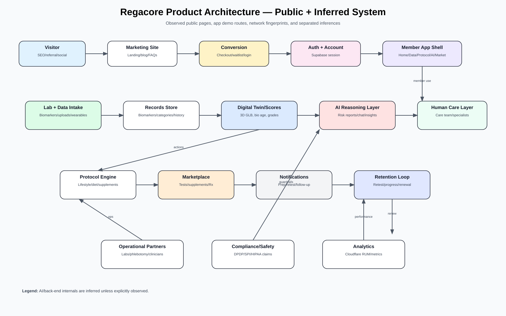
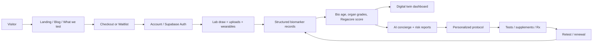
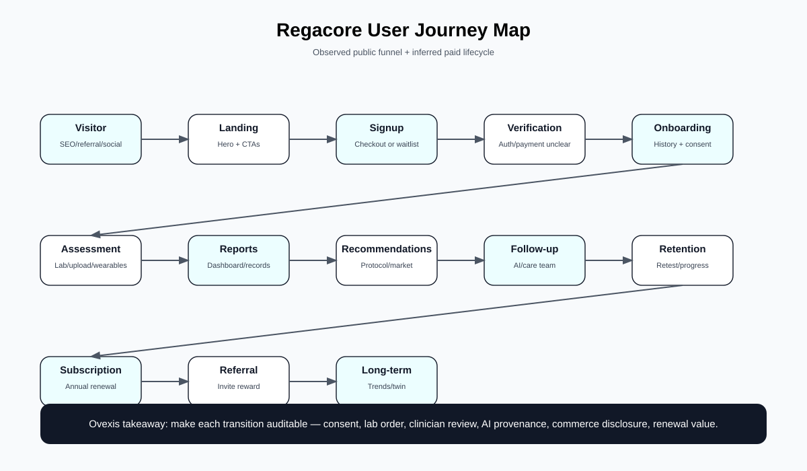
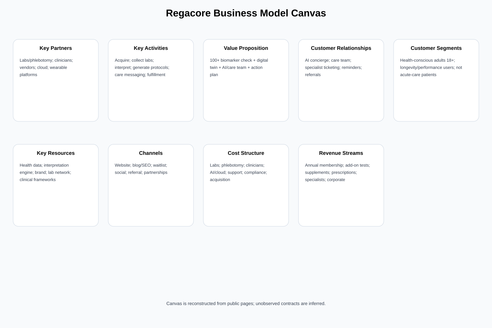

# Regacore Competitive Intelligence Teardown

**Target:** https://www.regacore.com  
**Prepared for:** Ovexis  
**Research date:** 2026-07-25, Asia/Calcutta  
**Scope:** Public website, public app/demo routes, public client-side assets, passive browser/network observation, and non-invasive interaction testing. No credentialed account was used, no private member portal was accessed, no payment was completed, and no attempt was made to bypass access controls.

---

## Reading rules

- **Confirmed** = directly observed on public pages, legal pages, screenshots, DOM, headers, network logs, or client bundle.
- **Strong inference** = highly likely from observed evidence, but not explicitly verified by Regacore.
- **Speculation** = plausible hypothesis only.
- **Confidence** = High / Medium / Low.

Supporting deliverables in this folder:

- `feature_inventory.xlsx` / `feature_inventory.csv`
- `product_architecture.svg`
- `user_journey_map.svg`
- `business_model_canvas.svg`
- `screenshot_catalog.xlsx` / `screenshot_catalog.csv`
- `screenshots/` full visual evidence
- `capture_inventory.json` and `interactions/` raw research artifacts

---

# SECTION 1 — Executive Summary

## What exactly are they building?

### Confirmed

Regacore presents itself as an annual proactive-health/longevity membership. The public offer combines:

- A yearly **100+ biomarker blood panel**.
- A dashboard/data product called a **digital twin**.
- **Biological age**, organ/system grades, and a composite Regacore score.
- A **personalized health protocol** covering lifestyle, diet, supplements, and related actions.
- An **AI companion / AI concierge** with health-context-aware chat.
- **24/7 access to a care team** and specialist-review workflows.
- A **marketplace** for add-on diagnostic tests, supplements, prescriptions, peptides, and related interventions.
- A public price of **₹10,800/year** on the membership card and checkout page.

Observed sources: homepage (`https://www.regacore.com/`), checkout (`/checkout`), app demo routes (`/home`, `/data`, `/protocol`, `/concierge`, `/marketplace`), privacy policy (`/privacy`), and terms (`/termsandconditions`).

### Strong inference

Regacore is attempting to localize the US “longevity lab membership” model for an India-facing price point, but the site still contains many US-market assumptions: Quest Diagnostics, HSA/FSA eligibility, US-style prescription/peptide positioning, and copy/structure extremely similar to Superpower’s public website.

### Speculation

Regacore may be in an MVP/prototype stage rather than full commercial operations. Reasons: app routes are publicly accessible, checkout does not visibly load a payment provider before account-step completion, the biomarker directory under-lists the claimed 100+ markers, and some legal/navigation links are inconsistent.

## Why does it exist?

### Confirmed

The website frames the problem as: standard physicals and conventional care are reactive, incomplete, and confusing. Regacore’s claimed solution is a loop: quantify biomarkers, analyze results, generate a protocol, provide AI/care team support, and retest over time.

### Strong inference

The company exists to turn preventive bloodwork from a one-off PDF into a subscription operating system: data capture → interpretation → protocol → commerce → retesting → renewal.

## What user problem are they solving?

### Confirmed

Regacore claims to solve these user pains:

- “What do my lab numbers mean?”
- “Which biomarkers should I test?”
- “How do I turn lab results into actions?”
- “How do I track improvement over time?”
- “Can someone/AI answer questions about my personal health data?”
- “Can I buy add-on tests, supplements, or prescriptions from one place?”

### Strong inference

The real product thesis is not “blood testing.” Blood testing is the wedge. The recurring value is interpretation, behavior change, retesting, and monetization of next-step actions.

## What business are they actually in?

### Confirmed

Regacore states in its terms that it is a **digital health and wellness company**, not a medical provider, hospital, clinical establishment, or diagnostic lab. Its services are positioned as informational/preventive screening, not diagnosis/treatment.

### Strong inference

The business is a hybrid of:

1. Preventive diagnostics membership.
2. Health data dashboard / consumer health OS.
3. AI health interpretation layer.
4. Care navigation / concierge support.
5. Marketplace / affiliate / margin revenue from add-on tests, supplements, prescriptions, and possibly specialist reviews.

### Speculation

If executed at scale, Regacore could become a commerce-led health optimization platform rather than a pure diagnostics business. The highest-margin revenue would likely come from repeated marketplace purchases, prescriptions, supplements, specialist reviews, and corporate/family plans.

## Who are they NOT building for?

### Confirmed

Regacore excludes or limits:

- Users under 18.
- Medical emergencies.
- Users seeking diagnosis, treatment, prescriptions as medical advice, or a licensed medical professional/patient relationship with Regacore itself.
- Users who do not consent to health-data processing.

### Strong inference

They are not building for low-intent annual-checkup bargain shoppers, insurance-led primary-care patients, acute/chronic disease patients needing continuous clinical management, or users uncomfortable sharing labs/demographics/wearables/medical history with a software layer.

---

# SECTION 2 — Product Architecture

## Core architecture in plain English

### Confirmed

The public product is organized into five visible member modules:

1. **Home** — dashboard, digital twin summary, daily focus, appointment/check-in, insights, referral/Rx upsell.
2. **Data** — digital twin, health categories, biological age, organ grid, biomarker table, search/filter controls.
3. **Protocol** — review recommended actions and confirm a protocol.
4. **Concierge** — AI chat, specialist directory, clinical review ticketing, conversation history.
5. **Marketplace** — tests, supplements, prescriptions, subscriptions/orders, filters/search.

### Strong inference

The intended product loop is:

### Speculation

The current site may be more demo than production. Product routes display sample data without auth gates, and browser logs show public fetching of app modules even when no session is established.

## Page inventory

| Page | URL | Confirmed components | Primary CTAs | Confidence |
|---|---|---|---|---|
| Landing | `/` | Hero, video, nav, how-it-works cards, FAQ/accordions, pricing, footer | Become a member, See what we test, Join waitlist | High |
| What we test | `/whatwetest` | Hero, 12-system claim, category chips, biomarker tables | Category filters | High |
| How it works | `/how-it-works` | Quantify/Analyze/Optimize, appointment card, comparison | Biomarker directory, sign in, waitlist | High |
| Checkout | `/checkout` | Email step, locked payment, order summary | Continue, Log in | High |
| Login | `/login` | Email/password form, create account, privacy/terms | Login | High |
| Waitlist | `/waitlist` | Name/email/phone/age wizard | Continue / Submit | High |
| Blog | `/blog` | Journal, category filters, article cards | Read Article/Post | High |
| Privacy | `/privacy` | DPDP/SPI privacy, AI section | None | High |
| Terms | `/termsandconditions` | Disclaimers, liability, arbitration | None | High |
| Broken route | `/terms` | 404; login links here | None | High |
| Home app | `/home` | Digital twin, focus, appointment, insights, referral | Expand Twin Data, Concierge | High |
| Data app | `/data` | Twin/records, 3D model, scores, biomarker table | Ask Regacore AI | High |
| Protocol app | `/protocol` | Protocol review and action cards | Confirm Selection | High |
| Concierge app | `/concierge` | AI chat, specialist directory, tickets, history, context | New AI Chat, Specialist Directory | High |
| Marketplace app | `/marketplace` | Tests, supplements, Rx, filters, search | Book now, Buy now | High |

## Marketing layer

### Confirmed

- Fixed desktop navigation: What we test, FAQs, logo, Log in, Become a member.
- Mobile menu with Explore and Company sections.
- Footer newsletter form with email input.
- Blog content hub.
- Social links in client bundle/footer: Instagram, LinkedIn, Twitter/X.
- Next.js route prefetching via RSC requests.

### Strong inference

The marketing site pushes three psychologies:

1. **Aspirational identity** — premium dark hero, proactive health, “health is your superpower”-style language.
2. **Rational breadth** — 100+ biomarkers, 1,000+ conditions, organ systems.
3. **Actionability** — protocol, AI, care team, marketplace.

## Conversion layer

### Confirmed

- Checkout starts with email only.
- Payment step is locked until step 1: “Complete step 1 to continue.”
- Price shown: ₹10,800/year.
- Checkout includes “Trusted by thousands of members” using avatar placeholders from `i.pravatar.cc`.
- One fetched checkout version showed a discount line `regacore100 -₹10,800` while total still showed ₹10,800; browser text later did not show that line. Treat as inconsistent/conditional.

### Strong inference

Email-first checkout is used to capture abandoners before payment. Payment provider may load only after account creation, but no Stripe/Razorpay/PayU/Cashfree SDK was observed during passive loading.

## Waitlist layer

### Confirmed

Waitlist steps observed via interaction testing:

1. Name.
2. Email.
3. Phone Number.
4. Age.
5. Submit.

Submissions are sent to a public Google Apps Script endpoint in client code / network behavior.

### Risk

A health-adjacent waitlist collecting age/phone/email should present explicit consent, privacy policy, and purpose disclosure at collection. The visible waitlist screen was minimal.

## Member app layer

### Confirmed — Home

- “YOUR DIGITAL TWIN” connection status.
- “Good morning, Dev.” greeting.
- Today’s focus: reduce physiological stress.
- Biological age: 23.8 yrs; “8.6 years younger than expected.”
- Upcoming check-in with hydration/fasting instructions, calendar and directions.
- Key insights with contributing biomarkers.
- Rx upsell: “Manage your medications with Regacore.”
- Referral program: “Refer your friends and earn ₹50.”
- Concierge entry card.

### Confirmed — Data

- Twin/Records switch.
- Health-category grades.
- 3D digital twin area and WebGL error simulation button.
- Current focus: hormonal recovery.
- Profile: “Anuj Tiwari”; last updated Feb 24/25, 2026 depending capture.
- Regacore score: 81.
- Biological age: 30.4 / 36 years.
- Organ health grid: digestive, respiratory, systemic, nervous, cardiovascular, musculoskeletal, cognitive.
- Biomarker counts: 144 total, 95 optimal, 37 normal, 12 out-of-range.
- Table markers include Health Score, ApoB, LDL-C, Triglycerides, HDL, Glucose, HbA1c, Insulin, Testosterone, TSH, hs-CRP, ALT, AST, GGT, Creatinine, eGFR, Vitamin D, B12, Cortisol, DHEA-S, WBC, RBC, ApoE, MTHFR, BDNF.
- Search input and category/status filters.

### Confirmed — Protocol

- Protocol image, title, “Review Your Protocol.”
- Protocol 1: “Optimize Your Gut for Peak Performance.”
- Action cards: G.I. Integrity Supplement, Gut Microbiome Test, Mediterranean/Fermented/Fiber dietary pattern, Poly-Prebiotic Powder Supplement.
- Protocol 2: “Understand Your White Blood Cell Pattern.”
- Confirm selection CTA.

### Confirmed — Concierge

- Sidebar: Pinned, Clinical Reviews, Health Analyses, Conversations.
- “New AI Chat” and “Specialist Directory.”
- AI Concierge card: biomarkers, biological age, nutrition, exercise, longevity.
- Specialist Review card: cardiovascular, hormones, nutrition, longevity.
- New chat view includes prompt chips: Explain ApoB, Review biological age, Explain cortisol, Nutrition strategy, Exercise guidance.
- Health context panel includes health score, biological age, current focus, recent biomarkers, recent changes, recent uploads.
- Specialist directory includes MD, RD, Exercise Physiologist, Nurse Practitioner and categories: Cardiovascular, Hormones, Nutrition, Exercise Physiology, Biomarker Interpretation, General Longevity, Care Coordinator.
- Expert request history shows pending/replied states and a sample cardiologist response.

### Confirmed — Marketplace

- Search input: “Search anything.”
- Tabs: All Products, Tests, Supplements, Prescriptions.
- Buttons: Manage Subscriptions, View Orders.
- Filters: Total Health, Metabolic Health, Gut Health, Heart Health.
- Tests: Regacore Blood Panel, Advanced Blood Panel, Specialty Blood Panel, Gut Microbiome Analysis, Environmental Toxin, Mycotoxins.
- Supplements: Vitamin D + K2 Liquid, O.N.E. Omega, CoQ10, Magnesium Glycinate.
- Prescriptions: Semaglutide, Enclomiphene, NAD+ Intranasal, Sermorelin Injection, NAD+ Injection.

---

# SECTION 3 — User Journey

## Visitor → Landing Page

### Confirmed

Visitors land on a premium dark hero with claims: 100+ biomarkers, plan built around user, everything needed to act, HSA/FSA eligible, accessible price, and CTAs to become a member or see tests.

### Strong inference

The objective is to convert high-intent health optimizers immediately while giving skeptical users a biomarker directory as a research path.

## Landing Page → Signup

### Confirmed

Primary CTAs route to `/checkout`; secondary CTAs route to `/whatwetest`, `/waitlist`, `/how-it-works`, or `/login`.

### Strong inference

The funnel offers both hard conversion (checkout) and soft conversion (waitlist/newsletter/blog).

## Signup → Verification

### Confirmed

Checkout asks for email. Login uses email/password. Supabase auth client is present, and session-aware navigation uses Supabase session checks.

### Strong inference

Verification/session management likely uses Supabase Auth with email/password and PKCE session handling.

### Speculation

Email verification, OTP, and password-creation flows may exist behind account creation, but were not visible without completing signup.

## Verification → Onboarding

### Confirmed

The waitlist asks for name, email, phone, and age. Privacy policy states Regacore may collect contact data, demographic data, appointment history, and data from healthcare/lab providers.

### Strong inference

A paid onboarding flow should collect demographics, goals, health history, medications, consent, location/pincode, lab appointment preference, and wearable permissions.

## Onboarding → Health Assessment

### Confirmed

Public copy says the membership starts with a full-body 100+ biomarker blood draw and mentions Quest locations/at-home collection. The how-it-works page says users can visit 2,000+ Quest partner labs or book a clinical phlebotomist.

### Strong inference

Operationally, this requires lab partner ordering, phlebotomy scheduling, sample logistics, and result ingestion. These systems were not visible.

## Health Assessment → Reports

### Confirmed

The Data dashboard displays structured results, categories, biological age, organ health, and biomarker status/value/history columns.

### Strong inference

Regacore normalizes raw lab data into categorized biomarkers and compares them against “optimal” ranges, not just standard reference ranges.

## Reports → Recommendations

### Confirmed

The Protocol page shows recommended actions. Landing page says protocols include lifestyle, diet, supplements. Terms state recommendations are informational suggestions, not prescriptions or medical advice.

### Strong inference

Recommendations are a rules/AI/human-reviewed plan that can convert into marketplace orders.

## Recommendations → Follow-up → Retention

### Confirmed

Home shows next check-in, prep reminders, and key insights. Concierge offers AI and specialist review. Regacore emphasizes yearly membership, retesting, trend tracking, AI chat, care team, and referral.

### Strong inference

Retention is driven by biomarker trend improvements, biological age movement, ongoing care-team access, and marketplace subscriptions.

## Subscription → Referral → Renewal → Long-term engagement

### Confirmed

Home includes a referral program: “Refer your friends and earn ₹50.” Pricing is annual.

### Strong inference

Renewal depends on whether the user sees measurable progress and receives timely follow-up before annual billing.

---

# SECTION 4 — UX Audit

## Typography

### Confirmed

The HTML contains font classes for Inter, Geist, and Geist Mono. The UI uses modern sans-serif typography, low-to-medium weights, tight tracking, and large headings.

### Analysis

Regacore adopts premium minimalism common to longevity and AI startups: large whitespace, thin lines, black/white/gray palette, rounded cards, and restrained typography.

### Ovexis implication

Use premium cleanliness, but make clinical trust the hero. Health typography should communicate sophistication and safety; avoid overly faint gray text for medical explanations.

## Spacing and hierarchy

### Confirmed

- Large hero sections with ample whitespace.
- Rounded cards and soft shadows.
- Compact top nav and dense dashboard cards in app routes.
- Long-scroll marketing pages.

### UX interpretation

The marketing site prioritizes emotion first, details second. App dashboards prioritize “one number / one focus” before detailed biomarkers.

## Navigation

### Confirmed

Two navigation systems exist:

1. Public nav: What we test, FAQs, login, member CTA.
2. App nav: Home, Data, Protocol, Concierge, Marketplace.

### Issues

- `/terms` linked from login is a 404; correct route is `/termsandconditions`.
- “About” links to `#`, not a meaningful page.
- Public app routes are accessible without login, creating ambiguity between demo and actual app.

## Color psychology

### Confirmed

Dominant colors: black, white, gray, muted warm overlays, occasional status colors.

### Interpretation

- Black/dark = premium, serious, frontier-tech, longevity/luxury.
- White pricing cards = clarity and trust at purchase.
- Gray text = calm, non-alarmist health tone.
- Green/check icons = reassurance/completion.
- Letter grades = school-like gamification.

### Risk

Clinical risk should not be over-simplified into gamified grades unless methodology is transparent.

## Animations and visuals

### Confirmed

- Hero and waitlist pages use video assets.
- Landing uses hover cards, scrolling sections, carousels, and accordions.
- App/data pages load a 3D GLB digital twin and external HDR environment assets.
- Data page has a WebGL error simulation button.

### UX interpretation

The 3D twin is a strong engagement hook but may be brand theater unless organ highlighting is clinically meaningful.

## Forms

### Confirmed

- Checkout: required email; no rich custom validation observed.
- Login: required email/password; no visible password reset.
- Waitlist: name → email → phone → age → submit.
- Newsletter: email input.

### Issues

- Minimal consent language on waitlist/newsletter.
- No password reset link observed.
- Waitlist accepted an unrealistic age value during testing, suggesting weak validation.
- Google Apps Script no-cors submissions obscure success/failure.

## Empty states and error states

### Confirmed

- 404 page at `/terms`.
- WebGL error simulation exists.
- Payment step locked until account step completion.

### Missing / weak

- No rich checkout validation state observed.
- No clear final waitlist/newsletter confirmation captured.
- No visible AI safety error state because no live AI request was sent.

## Responsiveness

### Confirmed

Screenshots were captured at desktop and mobile widths. The site has mobile menus and responsive layouts.

### Observed risk

The `/data` dashboard is information-dense on mobile; lab tables require specialized mobile design.

## Accessibility

### Concerns

- Several captured buttons had empty text, likely icon-only controls without labels.
- Many generic `button type=submit` elements are used outside form contexts.
- Gray text may have low contrast.
- Motion/video-heavy pages need reduced-motion handling.
- 3D twin needs non-WebGL alternatives.

### Ovexis recommendation

Design for WCAG 2.2 AA from day one: semantic controls, labels, keyboard navigation, focus states, color-independent status, alt text, reduced motion, and accessible tables.

## Trust signals

### Confirmed

Regacore uses: HSA/FSA eligible, HIPAA secure/encrypted, DPDP/SPI privacy policy, 24/7 care team, Medical Advisory Board byline, “Trusted by thousands,” and Quest references.

### Weakness

Several trust signals are unverified, inconsistent with Indian pricing, or generic. No named Regacore clinicians were visible.

---

# SECTION 5 — AI Capabilities

## AI feature inventory

| AI capability | Confirmed evidence | Inputs | Outputs | Confidence |
|---|---|---|---|---|
| AI Concierge chat | `/concierge` and membership list | Biomarkers, bio age, nutrition/exercise questions, health context | Educational answers/next steps | High UI; Low live implementation |
| Context-aware chat | Context panel; FAQ language | Health score, bio age, biomarkers, uploads, protocol | Personalized responses | High intended design |
| Structured risk reports | Privacy AI section | Personal data, labs | Preventive screening report | High claim |
| Biological age | Dashboards and terms | Biomarkers/algorithm | Bio age and delta | High UI/claim |
| Organ scores | Data dashboard and terms | System biomarkers | Organ grades/ages | High UI/claim |
| Digital twin simulation | Blog and terms | Labs, wearables, history | Predictive simulations | High claim; Medium implementation |
| Report interpretation | How-it-works | Lab values | Plain-English ranges | High claim |
| Recommendation engine | Protocol page | Labs/goals/protocol state | Lifestyle/diet/supplement/test actions | High UI/claim |
| Specialist triage | Concierge directory/tickets | Concern + records | Human review | High UI; Medium operational |

## Inputs

### Confirmed

Regacore states or shows these inputs:

- Contact data: email, phone.
- Demographics: gender, date of birth, pincode in privacy policy; age in waitlist.
- Appointment history/service usage.
- Health records/lab results from providers.
- External bloodwork upload.
- Wearables: Oura, Whoop, Apple Health and more; some marked coming soon.
- Goals/history implied in protocol FAQ and AI context.
- Conversations and specialist requests.

## Outputs

### Confirmed

Outputs include Regacore score, biological age, organ/system grades, current focus, biomarker interpretations, protocol recommendations, AI chat responses, specialist review tickets/responses, marketplace recommendations, and structured risk reports.

## Context window

### Confirmed

No context-window size is visible.

### Strong inference

The effective context is likely a curated structured health context: selected biomarkers, recent changes, uploads, current protocol, and member profile.

### Speculation

Production would likely retrieve relevant facts into a prompt/RAG context rather than include full lab history every time.

## Personalization and memory

### Confirmed

The UI shows persistent conversation history, recent uploads, recent changes, and a member-specific health context panel.

### Strong inference

Memory is intended at two levels: structured health memory and conversation/specialist-ticket memory.

## RAG / knowledge retrieval

### Confirmed

No RAG endpoint, vector database, or citation mechanism was observed.

### Strong inference

To safely answer biomarker questions, Regacore would need retrieval over lab reports, clinical content, and protocol history.

### Speculation

If Supabase is the main backend, Supabase Postgres + pgvector could be used. No evidence observed.

## Health reasoning

### Confirmed

The UI reasons about cortisol/stress, ApoB/LDL ratio, WBC pattern/infection risk, gut protocol, biological age deltas, and metabolic/hormone/thyroid/inflammation/nutrient categories.

### Safety concern

The product blends wellness advice, biomarkers, supplements, prescriptions, and AI. Without guideline citations and clinician review thresholds, this can drift into de facto medical advice despite disclaimers.

## Safety mechanisms

### Confirmed

- Privacy policy: consent, no diagnosis/prescription/clinical decisions, human oversight, data minimization.
- Terms: emergency disclaimer, AI-score disclaimer, digital-twin simulation disclaimer, recommendation disclaimer, structured-risk-report preventive-only disclaimer.
- Liability cap: ₹10,000.

### Missing from public evidence

Model provider, safety benchmarks, red-team results, hallucination rate, citation policy, escalation thresholds, adverse-event process, and clinician credential verification.

## Possible LLM provider

### Confirmed

No LLM provider was visible in network traffic or client code.

### Strong inference

If live, LLM calls are likely server-side.

### Speculation

Possible providers: OpenAI, Anthropic, Google Gemini, or an AI gateway through serverless/Supabase. Confidence: Low.

---

# SECTION 6 — Technical Reverse Engineering

## Method

Evidence came from public page fetches, browser screenshots, DOM extraction, network request host inventory, header inspection, client-bundle string inspection, and non-invasive UI interactions.

## Frontend stack

### Confirmed

- **Next.js App Router / React Server Components**: `x-nextjs-*`, `x-matched-path`, `?_rsc=` route fetches, `_next/static/chunks` assets.
- **React**: client bundles and one React hydration error on privacy capture.
- **Turbopack-style chunks**: chunk names include `turbopack-...`.
- **Tailwind-like utility classes**: e.g. `bg-[#0b0b0c]`, `rounded-full`, responsive utilities.
- **next/image** URLs via `/_next/image?...`.
- **Fonts**: Inter/Geist/Geist Mono WOFF2 preloads/classes.

### Strong inference

The frontend is a Next.js app deployed behind Cloudflare, using Tailwind CSS and custom React components.

## Backend / database / auth

### Confirmed

- Client bundle contains a Supabase project URL and publishable key.
- Supabase libraries are bundled, including `@supabase/ssr` and `supabase-js` behavior.
- Navigation code calls `auth.getSession`, `auth.getUser`, `auth.onAuthStateChange`, and `auth.signOut`.
- Concierge page makes a Supabase REST request to `rest/v1/expert_requests?select=*&order=created_at.desc`.

### Strong inference

Supabase is used for auth and at least some data persistence, likely Postgres tables for expert requests and perhaps user profiles.

### Security note

A Supabase publishable key in a browser app is normal. The critical control is Row Level Security. Because a public page fetched `expert_requests`, Ovexis should treat this as a warning pattern: verify every table’s RLS before launch.

## Hosting / CDN

### Confirmed headers

- `server: cloudflare`
- `cf-cache-status: DYNAMIC`
- `cf-ray`
- `Report-To` / `NEL`
- `Access-Control-Allow-Origin: *`
- `x-nextjs-prerender: 1`
- `x-next-cache-tags`
- `x-matched-path`
- `referrer-policy: strict-origin-when-cross-origin`
- `x-content-type-options: nosniff`

### Strong inference

Cloudflare sits in front of the application and provides RUM/Browser Insights.

### Speculation

Origin hosting could be Vercel, Cloudflare Pages, or custom Node/Next hosting. No `x-vercel-id` was observed, so Vercel is not confirmed.

## Analytics and monitoring

### Confirmed

Browser requests loaded `static.cloudflareinsights.com/beacon.min.js` and sent `POST /cdn-cgi/rum?`.

### Not observed

Google Analytics, Segment, PostHog, Mixpanel, Sentry.

## Payments

### Confirmed

Checkout has a Payment step, locked until account step completion. No Stripe/Razorpay/PayU/Cashfree SDK was observed during passive load.

### Strong inference

Payment is either not implemented, delayed until account creation, or server-side/embedded after signup.

## Email / CRM / waitlist

### Confirmed

Footer/newsletter and waitlist client code reference a Google Apps Script endpoint and submit `no-cors` JSON.

### Risk

`no-cors` submissions limit error handling and auditability. Health-adjacent lead capture should be server-validated, consented, logged, and protected.

## 3D / visualization stack

### Confirmed

- App pages request `/3DModels/twin.glb`.
- App pages request HDR assets from `raw.githack.com` and `raw.githubusercontent.com` under `pmndrs/drei-assets`.
- Data page includes “Simulate WebGL Error.”

### Strong inference

The digital twin likely uses Three.js / React Three Fiber / drei-style environment assets.

## Security and compliance observations

| Area | Observation | Risk | Confidence |
|---|---|---|---|
| Route protection | `/home`, `/data`, `/protocol`, `/concierge`, `/marketplace` public | Dangerous if real data ever appears | High |
| Legal link | Login links `/terms`, which 404s | Consent/legal UX gap | High |
| Headers | `nosniff` and referrer policy present | Good baseline | High |
| CSP | No CSP observed in tested headers | XSS/data exfiltration risk if absent | Medium |
| HSTS | No HSTS observed in tested headers | Weaker transport hardening | Medium |
| CORS | `Access-Control-Allow-Origin: *` on pages | Should be deliberate | Medium |
| Supabase | Public REST call to `expert_requests` | RLS must be airtight | High |
| Waitlist | Age/phone/email with minimal visible consent | DPDP consent risk | High |
| AI | No public benchmark/citation policy | Hallucination/medical-liability risk | High |

---

# SECTION 7 — Business Model

## Pricing

### Confirmed

- Homepage says starts at **₹10,799/year**.
- Pricing card and checkout show **₹10,800/year** billed annually.
- Membership includes 100+ panel, dashboard/digital twin, uploads/wearables, personalized protocol, 24/7 care team, AI companion, marketplace.

### Issue

Price inconsistency is minor but avoidable. In health, small inconsistencies undermine trust.

## Revenue streams

### Confirmed

Annual membership, add-on tests, supplements, prescriptions, peptides “coming soon,” and marketplace product prices.

### Strong inference

Likely monetization stack:

1. Base membership margin.
2. Add-on lab panels.
3. At-home phlebotomy fees.
4. Supplements retail/affiliate margin.
5. Prescription/peptide program margin.
6. Specialist review fees or premium tier.
7. Corporate wellness/employer plans.
8. Retesting packages.
9. Family plans.
10. Aggregated anonymized research/business intelligence, as permitted by privacy policy.

## CAC

### Confirmed acquisition assets

SEO/blog hub, waitlist, newsletter, referral program, social links, landing-page CTAs.

### Strong inference

CAC is likely founder/social/paid/community-driven rather than SEO-driven because blog content is thin and no sitemap was found. Superpower-like positioning suggests Regacore is borrowing a proven funnel rather than creating a deeply localized category narrative.

## LTV

### Strong inference

LTV depends on renewal after first annual test, marketplace attach rate, retest frequency, specialist review usage, family/corporate expansion, and perceived score improvement.

If the base plan is ₹10,800/year and lab costs are meaningful, the product needs additional revenue or strong renewals to be attractive.

## Gross margin structure

### Strong inference

Cost drivers: lab tests, sample collection, clinician review/care team, AI inference, infrastructure, support, compliance, supplements/Rx fulfillment, acquisition.

Base diagnostic memberships often have constrained margins unless lab procurement is cheap, panels are optimized, and high-margin add-ons attach.

---

# SECTION 8 — Growth Strategy

## SEO

### Confirmed

- Meta title on many pages: “Regacore.”
- Home meta description: “Humanity's next evolution.”
- Blog categories: Science, Longevity, Nutrition, Hormones, Technology.
- `/sitemap.xml` returned 404.
- Robots.txt allows general crawling but disallows several AI crawlers and sets content signals.

### Weakness

SEO is underdeveloped. Titles are generic, metadata is weak, and blog posts are thin for health/YMYL.

## Content

### Confirmed

Blog topics: biological aging, ApoB, hormonal optimization, longevity protocol, Quest labs vs at-home draws, metabolic health, digital twin architecture.

### Analysis

Content is category-aligned but lacks visible citations, guideline links, named reviewers, and author credentials beyond “Regacore Medical Advisory Board.”

## Social and founder positioning

### Confirmed

Footer/client bundle includes Instagram, LinkedIn, Twitter/X links.

### Not confirmed

No founder identity, founder story, or founder social proof was visible on the public site.

### Opportunity

In health, founder and clinician credibility are major acquisition assets. Regacore underuses this.

## Referral

### Confirmed

Home dashboard: “Refer your friends and earn ₹50.”

### Analysis

₹50 is low relative to a ₹10,800 membership; likely symbolic rather than motivating.

## Partnerships

### Confirmed / claimed

Quest Diagnostics, at-home phlebotomy, wearables (Oura, Whoop, Apple Health), marketplace supplement/Rx brands in demo.

### Concern

For an India-priced product, US lab and HSA/FSA language creates credibility issues unless Regacore explicitly serves US users.

## Brand positioning

### Confirmed

Themes: “absolute core of proactive health,” “get better at being healthy,” “Longevity OS,” “digital twin,” “private care team,” “AI companion.”

### Competitive note

Large portions of positioning and page structure are very similar to Superpower’s site. This reduces brand originality and may create legal/reputational risk if copied too closely.

---

# SECTION 9 — Moats

## Real moat

### Confirmed

No durable moat is directly observable from public evidence.

### Strong inference

Regacore currently has more of a **bundle/story** than a moat. The visible implementation can be copied by a capable team.

## Weak moats

| Moat type | Evidence | Why weak |
|---|---|---|
| UI/brand | Premium design and digital twin | Aesthetic can be copied |
| Biomarker panel | 100+ claim | Competitors already offer 100+ or 160+ |
| AI chat | Claimed concierge | LLM wrappers are commoditized without data/evaluation |
| Marketplace | Products listed | Vendor marketplaces are replicable |
| Care team | Claimed 24/7 | Operationally hard, but not proven publicly |

## Fake moats / moat theater

- 3D digital twin if it does not drive medically validated insight.
- Biological age if methodology is opaque or generic.
- “AI companion” if not evidence-grounded and clinically governed.
- “Detect 1,000+ conditions” if not backed by transparent screening logic.

## Potential future moats

| Potential moat | What would make it real |
|---|---|
| Longitudinal biomarker data | Repeated panels, clean histories, outcome tracking |
| Clinical protocol engine | Validated rules tied to Indian guidelines and outcomes |
| Trust/brand | Named doctors, transparent methods, governance, case studies |
| Distribution | Corporate wellness, insurer/TPA partnerships, lab-chain exclusivity |
| AI safety/evidence | Citations, RAG, evaluations, hallucination monitoring, escalation |
| Marketplace supply | Exclusive pricing, quality fulfillment, supervised programs |
| Regulatory | Proper DPDP/telemedicine/lab/Rx compliance becomes a barrier |

---

# SECTION 10 — Medical Analysis

## Clinical workflow

### Confirmed

Baseline blood draw → results mapped to digital twin → scores/biological age/organ grades → personalized protocol → AI/care-team questions → specialist review → retest/follow-up → marketplace interventions.

### Strong inference

This is a preventive screening and wellness optimization workflow, not a diagnosis/treatment workflow.

## Evidence base

### Confirmed

Regacore blog posts discuss biomarkers such as ApoB, HbA1c, insulin, cortisol, hormones, methylation clocks, cytokines, wearables, and digital twins.

### Weakness

Observed articles do not show references, guideline citations, journal links, author credentials, or named reviewers. This is a major trust gap for a YMYL health product.

## Doctor involvement

### Confirmed

- Public copy says “physician-led longevity protocols” and “medical advisory board.”
- Concierge UI shows specialist review categories and a sample doctor response.
- Privacy policy says human review layer exists for significant automated decisions.

### Not confirmed

No named Regacore physician, registration number, medical board page, or credential verification was visible.

## Guideline adherence

### Confirmed

Regacore uses “optimal longevity ranges” rather than average reference ranges.

### Risk

Optimal ranges can be useful but can over-medicalize healthy users. Claims around thyroid, hormones, testosterone, cortisol, ApoB, supplements, peptides, and biological age require careful guideline alignment.

## Liability reduction

### Confirmed

Terms include: not a medical provider/hospital/clinical establishment/diagnostic lab; no diagnosis/medical advice/treatment; emergency disclaimer; AI scores informational only; digital twin simulations not real-time factual representations; recommendations general informational suggestions; structured risk report preventive-only; consult a Registered Medical Practitioner; liability cap ₹10,000; arbitration in Bengaluru.

## Regulatory implications

### India

Privacy policy cites IT Act, SPI Rules, and DPDP Act. Health data requires strong consent, security, and grievance processes. If Regacore facilitates prescriptions, doctor reviews, lab bookings, or telemedicine, additional medical/legal obligations apply.

### US

Site claims HIPAA secure/encrypted and HSA/FSA eligible; also references Quest. If US users are served, HIPAA/CLIA/state lab ordering and telehealth rules may apply.

### GDPR

GDPR is not clearly addressed in observed legal pages.

## Health-claim risks

High-risk claims requiring substantiation: “Detect 1,000+ conditions,” biological age reversal/slow aging, organ-specific ages/grades, AI-generated risk reports, hormonal optimization, peptides/prescriptions, cancer screening add-ons.

---

# SECTION 11 — Competitor Comparison

## Regacore vs Function Health

### Function Health confirmed from official public site

Function offers 160+ lab tests each year, testing 2x per year, $365/year, Quest locations, clinician review, named medical/scientific board, and add-ons such as MRI/CT and Galleri. Source: `https://www.functionhealth.com/`.

| Dimension | Regacore | Function Health | Winner |
|---|---|---|---|
| Price | ₹10,800/year | $365/year | Regacore cheaper if real |
| Biomarkers | Claims 100+; directory under-lists | 160+ annually | Function |
| Clinical credibility | Generic advisory board | Named high-profile doctors | Function |
| UX | Strong AI/digital-twin demo | Polished testing funnel | Mixed |
| AI | AI heavily positioned | More doctor/research explanations | Regacore if real |
| Localization | Indian pricing with US copy/labs | US-native | Depends market |

## Regacore vs Superpower

### Superpower confirmed from official public site

Superpower offers a health membership starting with 100+ lab tests, $199/year, 2,000+ Quest locations/at-home, uploaded labs, wearable sync, AI protocols, 24/7 care team, add-on tests, supplements, prescriptions, and named doctor experts. Source: `https://superpower.com/`.

### Key finding

Regacore’s public site structure and copy are extremely similar to Superpower’s. Examples include:

- “Every membership starts with 100+ biomarkers.”
- “Test at 2,000+ Quest locations or at-home.”
- “Upload past labs and sync your wearables (Oura, Whoop, Apple Health and more).”
- “Get a personalized health protocol.”
- “Message your private care team 24/7.”
- Feature list: health data upload, biological age, wearable connection, advanced AI chat, add-on tests, peptides, supplements, prescriptions.

| Dimension | Regacore | Superpower | Winner |
|---|---|---|---|
| Originality | Very similar public funnel | Appears source/inspiration | Superpower |
| Price | ₹10,800/year | $199/year | Regacore if India operational |
| Trust proof | Limited | Named doctors/logos/1M biomarkers claim | Superpower |
| Product demo | Public dashboards visible | Public marketing mature | Mixed |
| India opportunity | Potentially yes | US-oriented | Regacore/Ovexis opportunity |

## Regacore vs Levels Health

### Levels confirmed from official support/site

Levels focuses on metabolic health, CGM, food logging, AI food/macros, Apple Health/wearables, lab uploads, optional Stelo sensors, optional lab panels, and legacy comprehensive plans. Sources: `https://www.levels.com/`, `https://support.levels.com/article/720-levels-pricing-and-plans`.

| Dimension | Regacore | Levels | Winner |
|---|---|---|---|
| Scope | Broad biomarker/longevity | Deep metabolic/CGM | Depends user need |
| Continuous data | Wearables claimed/coming | CGM core | Levels |
| Lab breadth | 100+ claimed | Optional comprehensive labs | Regacore if real |
| Behavior loop | Protocol + chat | Meal/glucose feedback loops | Levels |
| Evidence/data moat | Not visible | Metabolic dataset/research claims | Levels |

## Regacore vs Apple Health

Apple is infrastructure rather than a direct diagnostics membership competitor. Apple’s healthcare page emphasizes connected care, Apple Watch, Health app, privacy/security, ResearchKit/CareKit, and healthcare workflows. Source: `https://www.apple.com/healthcare/`.

Regacore wins on interpretation/protocols if it ingests data. Apple wins on device distribution, privacy brand, and ecosystem trust.

## Regacore vs Google Health

Google Health emphasizes helping billions be healthier, high-quality health information, AI capabilities, Google Health Labs, Search/Fitbit, health AI research, and startup resources. Source: `https://health.google/`.

Google is not a direct membership competitor but is a platform threat.

## Regacore vs OpenEvidence

OpenEvidence positions itself as a HIPAA-compliant medical knowledge platform for clinicians, with official AI partnerships/collaborations involving NEJM, JAMA, NCCN, Cochrane, and medical societies. Source: `https://www.openevidence.com/`.

Regacore is consumer/personal-health focused. OpenEvidence is clinician/evidence focused. Regacore loses on evidence provenance and medical credibility.

## Regacore vs OpenAI health initiatives

Public reporting in 2026 describes OpenAI health features enabling users to connect Apple Health/medical records and receive health-context-aware assistance, with privacy controls and physician evaluation frameworks. Search result source examples: [2](https://propakistani.pk/2026/07/24/openai-launches-chatgpt-health-again/amp/) and [4](https://www.healthcaredive.com/news/openai-launches-chatgpt-health/809094/).

Regacore’s AI layer could be commoditized if general AI platforms connect health records, labs, and wearables. Regacore must win on operations, local labs, clinician workflows, and proprietary longitudinal outcomes.

## Regacore vs WHO digital health recommendations

WHO guidance stresses that digital health is not a silver bullet; digital tools should complement health systems, protect privacy, ensure provider credentials, maintain traceability/accountability/security, and operate within defined scopes. Sources: WHO page [3](https://www.who.int/news/item/17-04-2019-who-releases-first-guideline-on-digital-health-interventions), NCBI guideline summary [1](https://www.ncbi.nlm.nih.gov/books/NBK541888/).

Regacore aligns with “digital tracking + decision support + communication” direction but needs stronger evidence of clinical governance, privacy controls, and qualified provider workflows.

## Regacore vs Indian health startups

Indian diagnostics/preventive options include Healthians, Redcliffe, Thyrocare, Dr. Lal PathLabs, Metropolis, Apollo Diagnostics, Tata 1mg, PharmEasy/Thyrocare ecosystem, Orange Health, Ultrahuman, and others.

Search results indicate Healthians provides at-home health tests, smart reports, free doctor consultation, app booking/tracking, and NABL-compliant lab claims via its app listing [3](https://play.google.com/store/apps/details?id=com.healthians.main.healthians&hl=en_IN). Fortune India reported Redcliffe provides smart AI reports and report consultations, while Healthians is a preventive healthcare player [2](https://www.fortuneindia.com/long-reads/healthtech-startups-are-revolutionising-indias-ayushman-future-with-innovation-and-disruption/121117).

| Dimension | Regacore | Indian diagnostics incumbents | Winner |
|---|---|---|---|
| Lab network | Not proven in India public pages | Large home collection/lab networks | Incumbents |
| Interpretation | Stronger ambition | Often basic reports/consults | Regacore/Ovexis opportunity |
| Price | ₹10,800 premium | Many packages ₹1k-4k | Incumbents |
| Trust | Early/unclear | Established accreditation/brand | Incumbents |
| Retention | Subscription + dashboard | Mostly transactional | Regacore/Ovexis opportunity |

---

# SECTION 12 — Hidden Assumptions

## Company philosophy

### Strong inference

Regacore believes health should be proactive, quantified, optimized, and continuously managed like software.

## Product philosophy

### Strong inference

The product collapses diagnostics, analytics, care support, and commerce into one loop. It assumes users do not just want results; they want a prioritized plan and a place to buy the plan.

## Design philosophy

### Strong inference

The design borrows from luxury AI/health brands: black/white minimalism, futuristic 3D twin, compressed copy, and “OS” language.

## Assumptions that must be true

1. Users trust a software company with sensitive health data.
2. Broad lab panels can be sourced cheaply enough for ₹10,800/year.
3. Users value “optimal” ranges more than standard lab PDFs.
4. AI can safely answer health questions with context.
5. A care team can scale without destroying margins.
6. Users will buy recommended supplements/tests/Rx.
7. Annual retesting creates habit and renewal.
8. Regulatory disclaimers sufficiently reduce liability.
9. Indian users will accept a US-inspired longevity membership.
10. The digital twin improves comprehension enough to justify complexity.

---

# SECTION 13 — Weaknesses

## Product/feature weaknesses

- Claimed 100+ biomarkers, but public directory shows a much smaller visible set.
- Wearable connection is partly coming soon.
- Marketplace search did not visibly filter results in interaction testing.
- No real sample report download.
- No visible named medical board.
- No visible payment provider before account creation.
- App routes are public without login.
- Dashboard data appears sample-like/inconsistent (“Dev” on home, “Anuj” on data/concierge).

## UX weaknesses

- Broken Terms link from login.
- “About” link goes to `#`.
- Minimal waitlist consent.
- Minimal checkout validation feedback.
- No visible password reset.
- Mobile data dashboard is dense.
- Some icon buttons have empty text.
- HSA/FSA/Quest claims conflict with India price/company context.

## Technical risks

- Public app routes could become a data exposure risk.
- Supabase RLS must be perfect.
- No visible CSP/HSTS in tested headers.
- Google Apps Script lead capture is brittle.
- External 3D HDR assets from raw GitHub/Githack create dependency/performance risk.
- WebGL can fail on low-end devices.

## Business risks

- Low base price may not cover lab + care + AI + support.
- Imported Superpower-like positioning reduces differentiation.
- Marketplace/Rx monetization can damage trust if recommendations look commerce-driven.
- Weak referral reward.
- Thin SEO moat.
- Hard to operationalize 24/7 care in India at the price point.

## Clinical/regulatory risks

- “Detect 1,000+ conditions” claim is high risk.
- Hormonal optimization and peptide/Rx content can trigger regulatory and clinical safety issues.
- Biological age and organ scores need validation.
- AI hallucinations can lead to harm.
- Disclaimers may not protect against unsafe product design.
- Privacy page still has placeholder “Designated Grievance Officer Name.”

---

# SECTION 14 — Opportunities for Ovexis

## What to keep

- Four-step mental model: test → explain → protocol → support.
- Clear biomarker directory.
- Dashboard with one prioritized focus.
- AI chat with visible health context.
- Specialist escalation path.
- Marketplace only after trust is established.
- Annual retesting loop.

## What to improve

- Make it India-native: NABL labs, local phlebotomy, UPI, DPDP-first consent, Indian clinical guidelines, local biomarkers/risk framing.
- Publish the full biomarker panel with a sample report.
- Add named medical board and credential verification.
- Build evidence-cited AI from day one.
- Protect all app routes and separate demo mode.
- Add real onboarding and consent flows.
- Use WhatsApp/SMS reminders for India.
- Make recommendations auditable: why, evidence, risk, contraindications, alternatives.

## What to delete / avoid

- HSA/FSA unless genuinely serving US users.
- Quest references unless real partnership exists.
- Vague “1,000+ conditions” without substantiation.
- Cosmetic 3D twin if it does not improve decisions.
- Peptides/Rx marketplace before clinical governance is mature.
- Generic “medical advisory board” without names.
- Copy/paste positioning from US competitors.

## What to redesign

- Biomarker directory into an evidence library.
- Checkout into a trust-first medical purchase flow.
- AI chat into a citation-based co-pilot with clear escalation.
- Dashboard into a longitudinal behavior-change product, not just scores.
- Marketplace into “care plan fulfillment” with conflict-of-interest disclosure.

## New category Ovexis could create

**India’s evidence-backed preventive health operating system**: a clinically governed, DPDP-safe, longitudinal health record + action + follow-up platform tailored to Indian disease risk, diet, labs, and care pathways.

---

# SECTION 15 — Feature Inventory

Full spreadsheet:

- `feature_inventory.xlsx`
- `feature_inventory.csv`

Summary:

- **80 features** inventoried.
- Columns: Feature, Purpose, User value, Business value, Difficulty, Estimated engineering effort, Priority, whether Ovexis should Copy/Improve/Ignore/Reinvent, and Why.

Preview:

| Feature | Ovexis should | Priority | Why |
|---|---|---|---|
| Hero CTA pair | Copy | High | Effective split between purchase and research intent |
| 100+ biomarkers claim | Improve | High | Must be backed by full panel and accreditation |
| Digital twin | Improve | Medium | Useful only if clinically meaningful |
| Biological age | Improve | High | Needs validated algorithm and uncertainty |
| AI Concierge | Improve | High | Needs guardrails, citations, escalation |
| Specialist Directory | Improve | High | Strong if real clinicians/SLA exist |
| Google Apps Script submissions | Ignore | Low | Too brittle for health-adjacent data |
| Rx/peptide marketplace | Ignore initially | Low | Regulatory/trust risk |
| Named medical board | Reinvent | High | Major Regacore trust gap |
| Sample report | Reinvent | High | Critical pre-purchase trust asset |

---

# SECTION 16 — Screenshots & Visual Inventory

Full visual catalog:

- `screenshot_catalog.xlsx`
- `screenshot_catalog.csv`
- `screenshots/`

## Captured screenshots

| Screenshot | URL | Layout/components | Purpose |
|---|---|---|---|
| `screenshots/landing_desktop.jpg` | `/` | Hero, nav, cards, accordions, pricing | Acquisition/conversion |
| `screenshots/landing_mobile.jpg` | `/` | Mobile hero/stacked sections | Mobile acquisition |
| `screenshots/whatwetest_desktop.jpg` | `/whatwetest` | Category chips, biomarker tables | Transparency/SEO |
| `screenshots/how-it-works_desktop.jpg` | `/how-it-works` | Quantify/Analyze/Optimize, comparison | Product education |
| `screenshots/checkout_desktop.jpg` | `/checkout` | Email step, locked payment, order summary | Conversion |
| `screenshots/login_desktop.jpg` | `/login` | Email/password form | Member access |
| `screenshots/waitlist_desktop.jpg` | `/waitlist` | Minimal wizard | Lead capture |
| `screenshots/privacy_desktop.jpg` | `/privacy` | Legal text | Compliance/trust |
| `screenshots/termsandconditions_desktop.jpg` | `/termsandconditions` | Legal disclaimers | Liability |
| `screenshots/blog_desktop.jpg` | `/blog` | Article grid/category filters | SEO/content |
| `screenshots/blog_*.jpg` | Blog articles | Article/TLDR/AI CTA | Content-to-login |
| `screenshots/app_home_desktop.jpg` | `/home` | Digital twin, focus, appointment, referral | Member dashboard |
| `screenshots/app_data_desktop.jpg` | `/data` | 3D model, scores, biomarkers | Reports/data exploration |
| `screenshots/app_protocol_desktop.jpg` | `/protocol` | Protocol review/action cards | Recommendation activation |
| `screenshots/app_concierge_desktop.jpg` | `/concierge` | AI/specialist interface | Support/retention |
| `screenshots/app_marketplace_desktop.jpg` | `/marketplace` | Product grids/search/filters | Commerce |

## Visual patterns

### Confirmed

Rounded cards, soft shadows, monochrome premium palette, app-like dashboards, 3D body visualization, product grids, dense biomarker tables, pills/chips, letter grades/status cards.

### Likely purpose

Regacore sells confidence and actionability, not just tests. The UI makes complex medical data feel manageable and premium.

---

# SECTION 17 — Evidence Log

| ID | Claim / evidence | Source URL / artifact | Screenshot | Observed/inferred | Confidence |
|---|---|---|---|---|---|
| E1 | Landing claims 100+ biomarkers, plan, care team, AI, ₹10,800 membership | `https://www.regacore.com/` | `screenshots/landing_desktop.jpg` | Observed | High |
| E2 | Biomarker directory and visible marker/category set | `https://www.regacore.com/whatwetest` | `screenshots/whatwetest_desktop.jpg` | Observed | High |
| E3 | How-it-works loop; Quest/at-home; HIPAA/HSA claims | `https://www.regacore.com/how-it-works` | `screenshots/how-it-works_desktop.jpg` | Observed | High |
| E4 | Checkout email step, locked payment, ₹10,800/year | `https://www.regacore.com/checkout` | `screenshots/checkout_desktop.jpg` | Observed | High |
| E5 | Login and broken `/terms` link | `https://www.regacore.com/login`, `https://www.regacore.com/terms` | `screenshots/login_desktop.jpg`, `screenshots/notfound_terms_desktop.jpg` | Observed | High |
| E6 | Waitlist name/email/phone/age | `https://www.regacore.com/waitlist`; interaction inventory | `screenshots/waitlist_desktop.jpg` | Observed | High |
| E7 | Privacy policy: company name, DPDP/SPI, AI section | `https://www.regacore.com/privacy` | `screenshots/privacy_desktop.jpg` | Observed | High |
| E8 | Terms: not medical provider, AI disclaimers, liability | `https://www.regacore.com/termsandconditions` | `screenshots/termsandconditions_desktop.jpg` | Observed | High |
| E9 | Blog content topics and Medical Advisory Board byline | `https://www.regacore.com/blog` and article URLs | `screenshots/blog_desktop.jpg` | Observed | High |
| E10 | Home dashboard and referral ₹50 | `https://www.regacore.com/home` | `screenshots/app_home_desktop.jpg` | Observed | High |
| E11 | Data dashboard, biological age, scores, biomarker table | `https://www.regacore.com/data` | `screenshots/app_data_desktop.jpg` | Observed | High |
| E12 | Protocol page and action cards | `https://www.regacore.com/protocol` | `screenshots/app_protocol_desktop.jpg` | Observed | High |
| E13 | Concierge AI, specialist directory, context panel | `https://www.regacore.com/concierge`; interaction screenshots | `screenshots/app_concierge_desktop.jpg` | Observed | High |
| E14 | Marketplace categories/products/buttons | `https://www.regacore.com/marketplace` | `screenshots/app_marketplace_desktop.jpg` | Observed | High |
| E15 | Next.js/Cloudflare headers | HTTP headers, `capture_inventory.json` | N/A | Observed | High |
| E16 | Supabase auth and REST call to `expert_requests` | Client bundle/network inventory | N/A | Observed | High |
| E17 | Cloudflare RUM | `static.cloudflareinsights.com`, `/cdn-cgi/rum` | N/A | Observed | High |
| E18 | Google Apps Script submissions | Client bundle/interaction network | N/A | Observed | High |
| E19 | 3D twin GLB and pmndrs/drei HDR assets | Browser network requests | N/A | Observed | High |
| E20 | Superpower similarity and competitor set | `https://superpower.com/` | External fetch | Observed comparison | High |
| E21 | Function benchmark | `https://www.functionhealth.com/` | External fetch | Observed comparison | High |
| E22 | Levels benchmark | `https://www.levels.com/`, `https://support.levels.com/article/720-levels-pricing-and-plans` | External fetch | Observed comparison | High |
| E23 | OpenEvidence positioning | `https://www.openevidence.com/` | External fetch | Observed comparison | High |
| E24 | WHO digital-health guidance | [3](https://www.who.int/news/item/17-04-2019-who-releases-first-guideline-on-digital-health-interventions), [1](https://www.ncbi.nlm.nih.gov/books/NBK541888/) | Web evidence | External guidance | High |
| E25 | OpenAI health reporting | [2](https://propakistani.pk/2026/07/24/openai-launches-chatgpt-health-again/amp/), [4](https://www.healthcaredive.com/news/openai-launches-chatgpt-health/809094/) | Web evidence | External report | Medium |
| E26 | Indian diagnostics examples | [3](https://play.google.com/store/apps/details?id=com.healthians.main.healthians&hl=en_IN), [2](https://www.fortuneindia.com/long-reads/healthtech-startups-are-revolutionising-indias-ayushman-future-with-innovation-and-disruption/121117) | Web evidence | External report/listing | Medium |

---

# SWOT Analysis

## Strengths

- Clear, modern, premium UX.
- Strong category narrative: proactive health + digital twin + AI + protocol.
- Public app demo makes product tangible.
- Simple annual membership.
- Marketplace expansion path.
- Legal pages include DPDP/SPI and AI disclaimers.
- Supabase/Next stack supports fast MVP iteration.

## Weaknesses

- Apparent heavy similarity to Superpower.
- US/India contradictions: HSA/FSA, Quest, ₹ pricing.
- No named medical board visible.
- Public app routes accessible without auth.
- Biomarker directory does not visibly support 100+ claim.
- Thin blog evidence/citations.
- Payment implementation not visible.
- Broken legal link from login.
- Placeholder grievance officer name.

## Opportunities

- Build India’s trusted preventive health OS with real labs and doctors.
- Own evidence-backed AI interpretation in Indian context.
- Partner with NABL labs and employers.
- Add report upload/OCR as low-friction activation.
- Add WhatsApp-based reminders and concierge.
- Create transparent biomarker evidence library.
- Build family/corporate plans.
- Build outcome dataset from repeated panels.

## Threats

- Function/Superpower can enter/partner internationally.
- Indian diagnostics incumbents can add AI reports cheaply.
- General AI platforms can connect health records/wearables.
- Regulatory scrutiny of AI health claims, prescriptions, and supplements.
- Low trust if users see copied copy or broken production details.
- Data breach or hallucination incident could destroy the brand.

---

# Prioritized actionable insights for Ovexis

| Priority | Insight | Impact | Effort | Action |
|---|---|---:|---:|---|
| 1 | Build India-first trust stack: named doctors, NABL labs, DPDP consent, grievance officer, sample report | Very high | Medium | Do before launch |
| 2 | Remove US-copy contradictions: HSA/FSA/Quest unless true | Very high | Low | Immediate |
| 3 | Publish full 100+ biomarker directory with methodology/sample report | Very high | Medium | Immediate |
| 4 | Make AI evidence-cited, context-transparent, escalation-aware | Very high | High | Core differentiator |
| 5 | Protect app routes and create deliberate demo mode | Very high | Low | Immediate security hygiene |
| 6 | Build report-upload/OCR and historical trend import | High | High | Activation wedge |
| 7 | Add notification loops via WhatsApp/SMS/email | High | Medium | Retention engine |
| 8 | Start with labs + interpretation + protocol; delay Rx/peptides | High | Medium | Reduce regulatory risk |
| 9 | Make marketplace recommendations conflict-of-interest transparent | High | Medium | Trust moat |
| 10 | Use clinician-reviewed protocols with why/evidence/contraindication/alternative cards | High | High | Clinical differentiation |
| 11 | Create founder/medical-board-led content | Medium-high | Medium | SEO/trust |
| 12 | Build corporate/family distribution early | Medium-high | Medium | CAC reduction |
| 13 | Use Levels-style continuous behavior loops where possible | Medium | High | Retention |
| 14 | Add outcomes tracking: did ApoB/HbA1c/VitD improve? | High | High | Data moat |
| 15 | Make pricing transparent with lab costs, tax, cancellation/refund | Medium-high | Low | Conversion/trust |

---

# Final strategic judgment

Regacore is best understood as an early-stage, Superpower-inspired preventive health membership with an ambitious AI/digital-twin wrapper. The visible product is compelling as a story and UX prototype, but many execution details are unproven or inconsistent: public app routes, weak clinical proof, generic legal placeholders, thin content, possible payment incompleteness, and US-market copy inside an India-priced product.

For Ovexis, the opportunity is not to copy Regacore blindly. The opportunity is to build the **credible, localized, clinically governed version** of this category: transparent biomarkers, real lab operations, named clinicians, evidence-cited AI, safe escalation, and measurable longitudinal outcomes.

If Ovexis executes those trust and operations layers first, Regacore’s visible product becomes less a moat and more a roadmap of what to improve.

---

# Appendix A — Detailed screen, workflow, and CTA teardown

This appendix expands the product architecture into screen-level components. It is intentionally granular so Ovexis can convert it into product requirements.

## A1. Landing page (`/`)

### Confirmed layout

- Fixed navigation with left-side educational links, center logo, right-side login/member CTAs.
- Mobile 9-dot menu icon.
- Hero with dark background/video, HSA/FSA chip, headline, subheadline, primary CTA, secondary CTA.
- Two summary proof/value chips: “Whole body check / Detect 1,000+ conditions” and “Accessible / Starts at ₹10,799/year.”
- “How it works” four-card grid: Test your baseline, Results explained, Build your protocol, Access everything.
- Scroll/section module with four states: A new health check, All your health data, Your action plan, 24/7 care team.
- Each state has an image, heading, body copy, and FAQ-style expandable questions.
- Membership-includes table with alternating rows.
- Product visual carousel with four images: AI, Wellness, Health, records.
- Pricing card with bullet inclusions and annual price.
- Above-footer hero image with “regacore / The absolute core of proactive health.”
- Footer newsletter, platform links, company links, social links.

### Confirmed CTAs

- Become a member → `/checkout`
- See what we test → `/whatwetest`
- Join waitlist → `/waitlist`
- How-it-works cards → `/how-it-works`
- Get started → `/checkout`
- Subscribe → newsletter endpoint

### Hidden interactions inferred

- FAQ accordions reveal explanatory content.
- Section tabs switch images/content.
- Carousel arrows/indicators switch membership visuals.
- Mobile menu locks body scroll when opened.
- Next.js prefetch loads linked RSC routes before click.

### Ovexis action

Keep the flow, but rewrite it with original positioning. Put trust proof above the fold: named doctors, local lab partners, sample report, privacy badges that are actually relevant to India.

## A2. What we test (`/whatwetest`)

### Confirmed layout

- Hero image and headline: every system in one blood draw.
- Copy claims 100+ biomarkers across 12 organ systems.
- Category chips visible: All Panel, Brain health, DNA health, Energy, Gut health, Heart & Vascular, Immune System, Kidney Health, Liver Health.
- Tables list biomarker and included panels.
- Derived markers marked with `ƒ(x)`.

### Confirmed visible marker examples

Vitamin D, Cortisol, hs-CRP, Estradiol, Free Testosterone, Testosterone Bioavailable, Testosterone Total, Ferritin, Iron, AST, Carbon Dioxide Total, DHEA-S, Testosterone-to-Estradiol Ratio, Albumin/Globulin Ratio, Albumin, Bilirubin-to-Albumin Ratio, Globulin, Protein Total, ApoB, Atherogenic Coefficient, HDL, LDL, Triglycerides, Basophils, Lymphocytes, WBC, Creatinine, eGFR, Sodium, ALT, Bilirubin Total.

### Weakness

The visible page does not substantiate 100+ biomarkers. Either the page is incomplete or the claim is ahead of implementation.

### Ovexis action

Turn this page into a source of truth: full panel, sample ranges, sample report, why the marker matters, whether it is baseline/add-on, lab methodology, and clinical caveats.

## A3. How it works (`/how-it-works`)

### Confirmed workflow

1. Quantify: 100+ biomarkers in 1 blood draw, Quest lab or home/office phlebotomist.
2. Analyze: results map to Digital Twin, parsed into clear optimal longevity ranges.
3. Optimize: physician-designed action plan with supplements, sleep habits, diet, care concierge.

### Confirmed CTAs

- Explore Biomarker Directory → `/whatwetest`
- Sign In To View Reports → `/login`
- Sign In To Check Protocols → `/login`
- Manage Appointment → `/login`
- Join the waitlist → `/waitlist`
- Sign In to Account → `/login`

### UX psychology

This page makes the intangible service concrete: draw appointment, report, protocol, concierge. It also contrasts conventional care against Regacore to create urgency.

### Ovexis action

Use this structure but localize operations: actual lab brands, appointment booking geography, home collection coverage, turnaround times, escalation path if critical results appear.

## A4. Checkout (`/checkout`)

### Confirmed layout

- Logo link to home.
- Left pitch: “A health check like never before.”
- Avatar social proof: “Trusted by thousands of members.”
- Product image.
- Step 1 Create your account: email input and Continue button.
- Step 2 Payment: locked until step 1.
- Order summary: product images, membership description, annual price and total.

### Confirmed CTAs and fields

- Email input, placeholder “Your email,” required.
- Continue button.
- Log in link.

### Missing

- No visible payment provider during passive capture.
- No displayed tax/GST/refund/cancellation terms.
- No visible consent to terms/privacy before account creation.
- No passwordless OTP, password creation, or email verification visible before completion.

### Ovexis action

Use a medical-commerce checkout with explicit consent, refund/cancellation, what happens after purchase, lab scheduling step, medical disclaimers, payment options, and support contact.

## A5. Login (`/login`)

### Confirmed layout

- Background image.
- “Welcome back.”
- Email Address and Password fields.
- Login button.
- Link to create an account.
- Privacy Policy link works; Terms of Service link points to `/terms`, which 404s.

### Missing

- Password reset.
- OTP/magic link.
- MFA.
- Clear error states without submitting credentials.

### Ovexis action

Use passwordless OTP/email magic link for consumer health, add recovery, MFA for sensitive data, and verify legal links.

## A6. Waitlist (`/waitlist`)

### Confirmed steps

- Step 1: Name.
- Step 2: Email.
- Step 3: Phone Number.
- Step 4: Age.
- Submit.
- Back button shown as `<`.
- Video background asset.

### Technical note

The form submits to Google Apps Script. Interaction testing showed weak validation on age.

### Ovexis action

Use a real backend/CRM, explicit consent, age guardrails, SMS/WhatsApp opt-in, privacy text, and double opt-in email.

## A7. Blog and articles

### Confirmed content strategy

The blog is called “Longevity Journal” and includes article categories: Science, Longevity, Nutrition, Hormones, Technology. Articles have future 2026 dates, read times, and “Regacore Medical Advisory Board” byline.

### Confirmed article mechanics

- Back to Longevity Journal.
- Category badge.
- Title/date/read time/byline.
- Article body.
- Save Article / Share controls.
- Key Highlights TL;DR.
- AI Concierge sign-in CTA.
- HIPAA/encryption reassurance.

### Weakness

No citations or named medical reviewers were visible. For health SEO and trust, this is underpowered.

### Ovexis action

Publish medically reviewed, citation-rich articles with reviewer name, qualifications, publication/update date, guideline references, and local epidemiology.

## A8. Home app (`/home`)

### Confirmed modules

- Digital twin connection status.
- Greeting.
- Today’s focus.
- Biological age card.
- Next check-in appointment.
- Preparation carousel.
- Key insights since previous assessment.
- Contributing biomarkers.
- Medication/Rx upsell.
- Referral program.
- Concierge shortcut.

### Retention mechanics

Home is designed as a daily/weekly “what matters now” page, not a static report. It nudges appointment adherence, care plan adherence, referral, and medication management.

### Ovexis action

Make Home truly dynamic: next action, risk alerts, care tasks, adherence, symptom check-ins, and “what changed since last time.”

## A9. Data app (`/data`)

### Confirmed modules

- Twin/Records switch.
- Health category selector/list.
- 3D digital twin.
- Current focus.
- Profile summary.
- Regacore score.
- Biological age.
- Organ health grid.
- Biomarker counts.
- Biomarker table.
- Search and filters.
- Ask Regacore AI.

### Hidden interactions inferred

- Clicking organ/system cards likely highlights corresponding anatomical region.
- Category buttons/filter select change table and twin focus.
- Search filters biomarkers.
- Status filter switches All/Optimal/Normal/Out-of-range.
- WebGL error simulation tests fallback.

### Ovexis action

Use the Data page as the core trust surface: every score should be explainable down to biomarkers, ranges, source lab, date, trend, and guideline.

## A10. Protocol app (`/protocol`)

### Confirmed modules

- Review page framing.
- Protocol card: Optimize Your Gut for Peak Performance.
- Action cards mixing supplement, test, diet pattern, and prebiotic supplement.
- Second protocol: Understand Your White Blood Cell Pattern.
- Confirm selection CTA.

### Risk

The protocol mixes clinical interpretation, commerce, and lifestyle. This requires conflict-of-interest handling and evidence.

### Ovexis action

Design protocol cards with: reason, evidence, expected impact, safety/contraindications, clinician review status, cost, alternatives, and whether Ovexis earns margin.

## A11. Concierge app (`/concierge`)

### Confirmed modules

- Conversation search.
- New AI Chat.
- Specialist Directory.
- Pinned conversations.
- Clinical Reviews with statuses.
- Health Analyses.
- Conversation history.
- AI Concierge welcome panel.
- Specialist Review card.
- New chat prompt chips and chat input.
- Health context sidebar in new chat.
- Specialist directory by specialty.
- Request history with pending/replied counts.

### Strong inference

Regacore’s best strategic product idea is not the 3D twin; it is the hybrid AI + specialist escalation workflow. If real, it solves the key user problem: “I got a report, now what?”

### Ovexis action

Build AI support around safety classes: informational answer, suggest PCP consult, urgent escalation, specialist ticket, or “cannot answer.” Add citations and audit logs.

## A12. Marketplace app (`/marketplace`)

### Confirmed modules

- Search.
- Product tabs.
- Subscription/orders buttons.
- Health filters.
- Recommended tests.
- Recommended supplements.
- Recommended prescriptions.
- Ask AI button.

### Risk

Marketplace monetization can reduce trust if recommendations appear driven by margin. Prescription/peptide commerce adds regulatory risk.

### Ovexis action

Start marketplace with low-risk fulfillment: lab add-ons and evidence-backed supplement alternatives. Delay Rx until clinical and legal rails are mature.

---

# Appendix B — Inference Register

| Area | Confirmed | Strong inference | Speculation |
|---|---|---|---|
| Product maturity | Public app routes and checkout exist | MVP/prototype elements are visible | Not all services are operational |
| Backend | Supabase code and REST call observed | Supabase Auth/Postgres used | Supabase Edge Functions/pgvector may be used later |
| AI | AI UI and legal AI claims exist | AI should be server-side if live | Provider could be OpenAI/Anthropic/Gemini |
| Payments | Locked payment step visible | Provider loads after account step or not implemented | Razorpay/Stripe/Cashfree could be intended |
| Labs | Quest/at-home claims visible | US-market copy imported | India lab ops may not yet be wired |
| Care team | 24/7 care team and specialist UI visible | Hybrid AI/human model intended | Clinician network may be mocked/demo |
| Marketplace | Product cards and prices visible | Commerce is a future LTV lever | Fulfillment may be non-functional today |
| Digital twin | 3D model asset and scores visible | Three.js/R3F-style rendering | Clinical mapping may be cosmetic |
