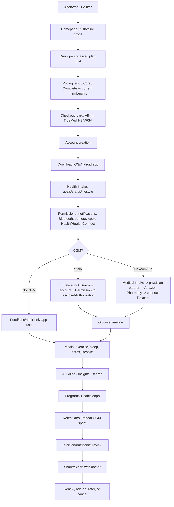
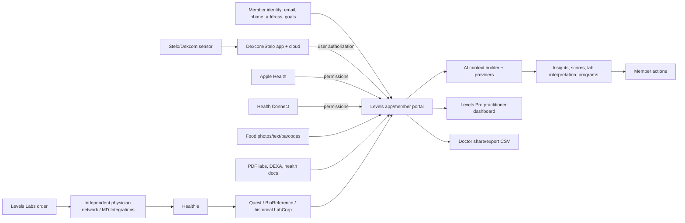
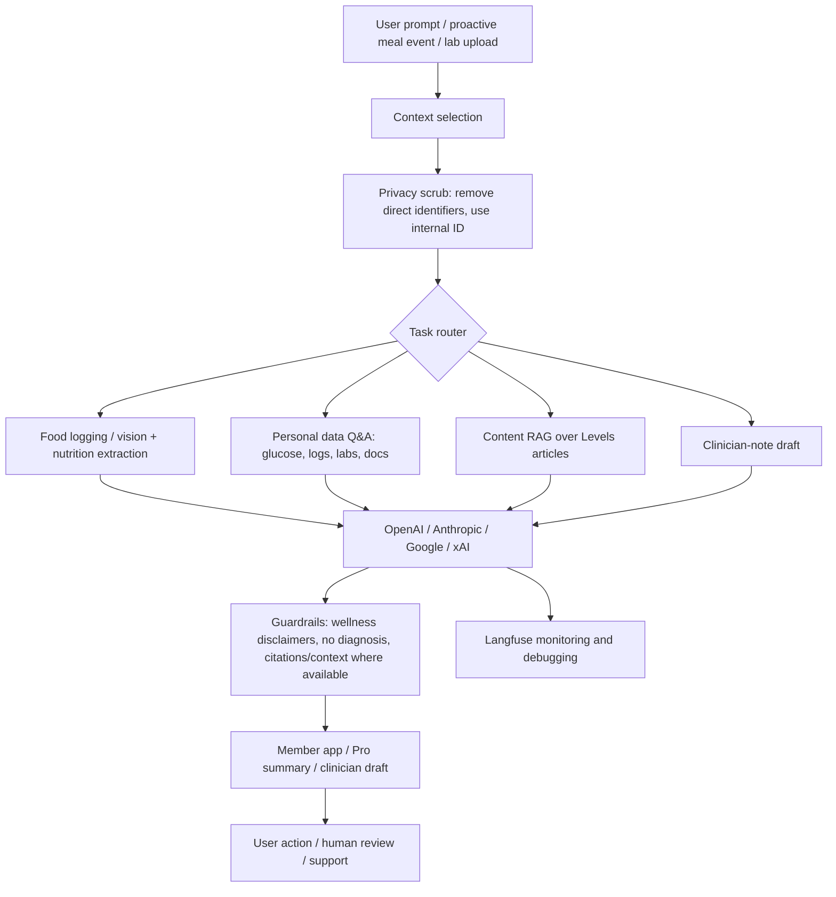
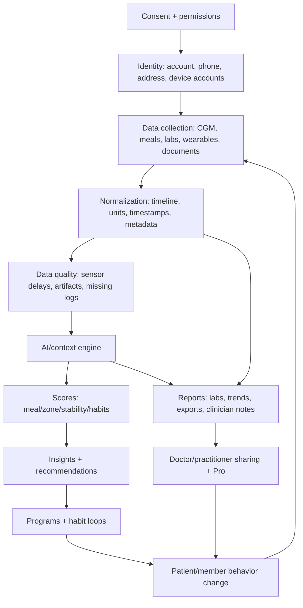
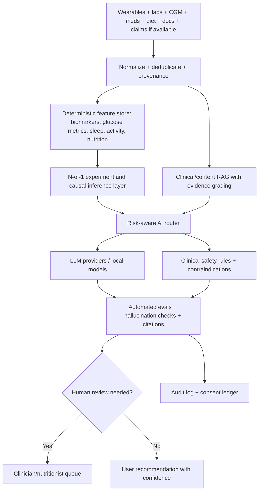
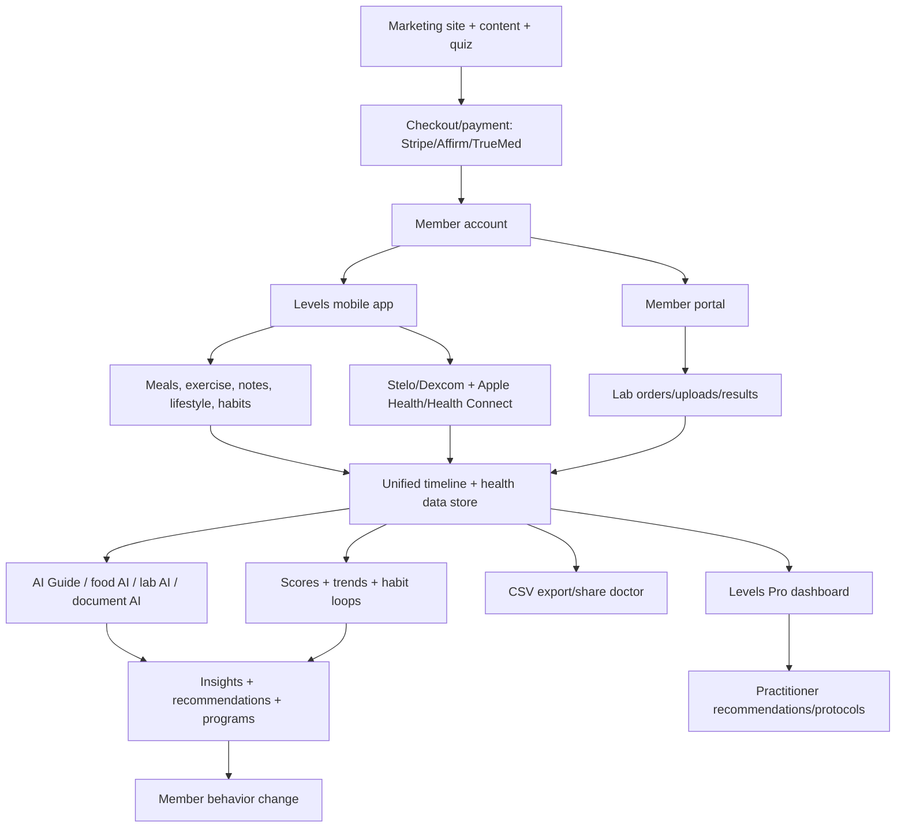

# Levels Health Competitive Intelligence Report
**Target:** Levels Health / Levels Health, Inc.  
**Website:** https://www.levelshealth.com/  
**Category:** Metabolic Health | Continuous Glucose Monitoring | Consumer AI Health  
**Prepared for:** Ovexis board-level strategy discussions  
**Date:** 2026-07-25 (Asia/Calcutta)
## Evidence Labels and Investigation Boundaries
- 🟢 Confirmed = directly visible in public sources listed in the Evidence Register.
- 🟡 Strong Inference = reasoned from multiple public observations; not explicitly confirmed by Levels.
- 🔴 Speculation = strategic possibility or prediction; not verified.
- 🟢 Confirmed: This report uses only public information and does not attempt login-gated access, private APIs, vulnerability probing, credentialed views, or unauthorized collection.
- 🟢 Confirmed: Public Terms of Service state that Levels is not a healthcare provider and that Services are for general wellness/non-medical use; therefore clinical conclusions in this report are limited to public claims and strategy analysis, not medical advice. [S18]
- 🟢 Confirmed: Authenticated screens, hidden workflows, exact database schemas, and internal KPIs cannot be verified from public information; where discussed they are labelled inference or speculation.
## 1. Executive Summary
- 🟢 Confirmed: Levels is building a metabolic health platform that combines a consumer app, optional continuous glucose monitoring, lab testing, AI-powered food/lab insights, habit loops, adaptive programs, clinician review, nutritionist support, and a professional dashboard for practices. **Evidence:** S01,S02,S03,S19
- 🟢 Confirmed: The consumer-facing promise is to help people understand how diet and lifestyle affect their body so they can improve energy, appetite, and long-term metabolic health. **Evidence:** S01
- 🟢 Confirmed: The company frames the customer problem as generic nutrition advice plus lack of feedback: users cannot tell whether advice fits their own physiology. **Evidence:** S01,S23,S24
- 🟡 Strong Inference: The emotional problem is uncertainty and loss of agency: users want to stop guessing, feel in control, and see proof that everyday choices matter. **Evidence:** S01,S04,S20,S21
- 🟡 Strong Inference: The operational problem is data fragmentation: CGM data, meals, labs, sleep, activity, documents, and expert guidance historically live in separate tools and require manual synthesis. **Evidence:** S01,S11,S12,S13,S14,S19
- 🟢 Confirmed: Current consumer customers are U.S.-based adults with a U.S. phone number, U.S. app-store access, and U.S. shipping address; Levels Labs is for members age 18+. **Evidence:** S09,S13
- 🟢 Confirmed: Levels is not for people seeking diagnosis, treatment, cure, disease prevention, emergency support, or a substitute for professional medical care; the app’s own disclaimers state it is for general wellness. **Evidence:** S04,S15,S18
- 🟡 Strong Inference: Levels is creating or reinforcing the category of a metabolic health operating system: real-time metabolic feedback + longitudinal labs + AI + behavior-change workflows. **Evidence:** S01,S19,S21,S28
- 🟡 Strong Inference: Levels replaces raw CGM apps, generic food trackers, one-off annual lab panels, static education, and disconnected nutrition coaching with a more integrated feedback system. **Evidence:** S01,S04,S10,S13,S14,S19
- 🟢 Confirmed: The core philosophy is prevention over reaction, personal data over generic advice, and behavior change driven by feedback loops. **Evidence:** S20,S21,S23,S24,S28
- 🟡 Strong Inference: Levels’ biggest strategic strength is not the sensor itself; it is the interpretation layer that turns commodity CGM/lab inputs into habit loops, programs, and trust-building education. **Evidence:** S01,S03,S10,S11,S13,S14
- 🟡 Strong Inference: Levels’ biggest vulnerability is retention after the novelty/learning value of CGM fades, especially as OTC sensors make raw glucose access cheap and competitors bundle labs, wearables, or coaching. **Evidence:** S03,S43,S45,S46,S47,S48

### Jobs-To-Be-Done
- 🟢 Confirmed: When I am trying to understand why I feel tired, hungry, unfocused, or stuck with weight, I want real-time feedback on food, sleep, activity, and glucose so I can make better choices. **Evidence:** S01,S04,S10,S12
- 🟢 Confirmed: When my labs are confusing, I want a plain-English analysis and a plan so I know what to work on. **Evidence:** S13,S14,S26
- 🟢 Confirmed: When I want professional help, I want a clinician/nutritionist/practitioner to see my data in context rather than starting from a blank visit. **Evidence:** S03,S19,S32
- 🟡 Strong Inference: When I have learned my CGM triggers, I still need a lightweight, non-sensor habit system to maintain gains and justify subscription renewal. **Evidence:** S03,S11,S26,S45

### Value Proposition
- 🟢 Confirmed: Measure: CGM, labs, imported health data, uploaded documents, and user logs. **Evidence:** S01,S02,S07,S12,S13,S14,S17
- 🟢 Confirmed: Understand: AI food logging, macro breakdowns, lab interpretation, AI Guide, LevelsAI content search, clinician review, and Pro AI summaries. **Evidence:** S03,S10,S14,S17,S19,S27
- 🟢 Confirmed: Act: habit loops, guided programs, recommendations, targets, protocols, dietitian sessions, and follow-through workflows. **Evidence:** S03,S11,S19,S26
- 🟡 Strong Inference: Retain: repeated logs, streak-like habit loops, periodic labs, add-on CGM sprints, programs, content/newsletters, and Pro care workflows create recurring reasons to return. **Evidence:** S03,S11,S13,S19,S26,S42

## 2. Company Intelligence
### Timeline
| Date | Label | Event | Evidence |
|---|---:|---|---|
| 2019-06 | 🟢 Confirmed | Levels was formed/founded by Josh Clemente, Sam Corcos, Casey Means, David Flinner, and Andrew Conner to address metabolic health. | S20,S21 |
| 2019-11/12 | 🟡 Strong Inference | First product shipped around November/December 2019 according to founder-interview coverage; official support pages do not independently verify this shipment date. | External interview coverage from search; not used as primary evidence |
| 2020-11 | 🟢 Confirmed | Levels announced a $12M seed round led by a16z and positioned CGM + intelligent software as a category-defining biowearable system. | S20 |
| 2020-11 | 🟢 Confirmed | The seed announcement said Levels was in closed beta with a 50,000+ person waitlist and a month-long program including two 14-day CGM sensors and app access. | S20 |
| 2021 | 🟢 Confirmed | Press described Levels as a late-stage beta wellness product for athletes/health-conscious users at roughly $400 for a one-month program. | The Verge search result; see source register note in references |
| 2022-04 | 🟢 Confirmed | Levels announced a $38M Series A at a $300M valuation and stated it had 25,000 paying beta members. | S21 |
| 2022-04 | 🟢 Confirmed | The Series A included $5M from more than 1,400 members through crowdfunding in under six hours. | S21 |
| 2023-01 | 🟢 Confirmed | Levels announced a $7M Series A extension and more than $55M raised to date. | BusinessWire/AP search result and S21 context |
| 2024-08 | 🟢 Confirmed | Levels announced/was covered for a $10M Series A extension including $3M crowdfunding, Long Journey, a16z, and others. | S22 |
| 2024-08 | 🟢 Confirmed | Coverage stated 60,000+ members, 700M+ glucose data points, hundreds of thousands of food logs, 18M+ YouTube views, and 2M+ annual blog visitors. | S22 |
| 2025-2026 | 🟢 Confirmed | Levels shifted toward an app-first system with optional CGM/labs and $15/month or $80/year membership pricing. | S01,S03 |
| 2026 | 🟢 Confirmed | Levels Pro markets a metabolic-health operating system for modern practices with AI-prepared review workflows, programs, and practitioner plans. | S19 |
| 2026-02 | 🟢 Confirmed | Support states the Levels IRB-approved CGM research study has concluded and study services have been discontinued. | S25 |

### Founders and Leadership Signals
- 🟢 Confirmed: Founders publicly listed across Levels announcements are Casey Means MD, Josh Clemente, Sam Corcos, David Flinner, and Andrew Conner. **Evidence:** S20,S21
- 🟢 Confirmed: Casey Means served as Levels CMO until late 2023 according to her official Levels author page. **Evidence:** S30
- 🟢 Confirmed: Josh Clemente’s official author page describes him as founder and president, while the site also publishes recurring 'From the CEO' newsletters under his name. **Evidence:** S28,S29
- 🟢 Confirmed: 2024 coverage quoted Sam Corcos as Levels CEO and Josh Clemente as co-founder. **Evidence:** S22
- 🟡 Strong Inference: Public leadership titles appear to have evolved or are inconsistent across official and third-party pages; a board-level user should verify current officer titles via LinkedIn, Delaware filings, or direct company confirmation before relying on a CEO title. **Evidence:** S22,S28,S29,S30
- 🟢 Confirmed: Levels has used a high-profile advisor strategy including metabolic-health physicians/researchers listed in seed/Series A materials and App Store copy. **Evidence:** S04,S20,S21

### Funding and Valuation
- 🟢 Confirmed: $12M seed led by a16z in November 2020. **Evidence:** S20
- 🟢 Confirmed: $38M Series A at $300M valuation in April 2022. **Evidence:** S21
- 🟢 Confirmed: $5M of the Series A was crowdfunded from members/community. **Evidence:** S21
- 🟢 Confirmed: $7M Series A extension in January 2023 and more than $55M raised to date at that time. **Evidence:** BusinessWire/AP search result; S21 for prior total
- 🟢 Confirmed: $10M Series A extension in August 2024 according to coverage, including $3M crowdfunding and Long Journey/a16z participation. **Evidence:** S22
- 🟡 Strong Inference: Total funding is likely above $65M after the 2024 extension; third-party databases list approximately $67M, but the exact total should be verified from primary filings. **Evidence:** S20,S21,S22
- 🟢 Confirmed: Wefunder lists the company as a Tier 1 VC-backed B2C subscription company and claims $20M+ revenue over the last 12 months; this is a crowdfunding listing claim, not audited financials in this report. **Evidence:** S42

### Partnerships and Operating Network
| Partner/system | Label | Role | Evidence |
|---|---:|---|---|
| Dexcom/Stelo | 🟢 Confirmed | Stelo/Dexcom account connection; Stelo data every 5 minutes and Levels refresh about every 15 minutes. | S07 |
| Amazon Pharmacy | 🟢 Confirmed | Dexcom G7 prescription pathway sends prescriptions to Amazon Pharmacy for sensor purchase. | S08 |
| Quest/BioReference/LabCorp | 🟢 Confirmed | Quest for most lab orders, BioReference for NY/NJ, LabCorp for certain historical orders. | S16 |
| MD Integrations/Healthie | 🟢 Confirmed | Labs orders created by independent physician network facilitated by MD Integrations and routed via Healthie to Quest. | S15 |
| TrueMed | 🟢 Confirmed | HSA/FSA checkout option and LMN flow. | S03,S17 |
| Affirm | 🟢 Confirmed | Pay-over-time option at checkout. | S03 |
| The Lyons Share | 🟢 Confirmed | Nutritionist partner referenced in current support article. | S51 |
| OpenAI/Anthropic/Google/xAI | 🟢 Confirmed | AI service providers for Levels Guide AI and similar features. | S17 |
| Langfuse | 🟢 Confirmed | AI prompt/response logging and reliability support. | S17 |
| PostHog/Sentry/Stripe/Cloudflare/etc. | 🟡 Strong Inference | Observed in public headers/HTML; confirms public site integrations but not full production architecture. | S44 |

### Acquisitions, Patents, Open Source, Geography, Awards
- 🟢 Confirmed: No acquisition was verified from the public sources reviewed for this report. **Evidence:** Public search; absence is not proof
- 🟢 Confirmed: No Levels Health patent assignment was verified from the public searches performed; this should be treated as a negative search result, not definitive legal advice. **Evidence:** Public patent searches
- 🟢 Confirmed: The GitHub organization 'levelshealth' publicly shows 17 repositories, including forks of react-native-help-scout and react-native-health-connect; no proprietary core app repository was identified as public. **Evidence:** S41
- 🟢 Confirmed: Current availability is U.S.-only, with an international waitlist and no recommended workaround for non-U.S. users. **Evidence:** S09
- 🟢 Confirmed: Levels was named to Fast Company's Next Big Things in Tech list according to press/search snippets; this report did not fetch the primary award page. **Evidence:** BusinessWire search snippet

## 3. Founder Psychology and Strategic Mental Models
- 🟢 Confirmed: Josh Clemente publicly ties the origin story to personal fatigue/metabolic discovery and the insight that raw CGM data needs interpretation and behavior-change software. **Evidence:** S20 and founder podcast/search evidence
- 🟢 Confirmed: Levels’ public mission language emphasizes prevention rather than reaction and making health information accessible to the individual in real time. **Evidence:** S21
- 🟢 Confirmed: Privacy principles state that user health data belongs to users, not Levels, and that data should be exportable/deletable and not sold. **Evidence:** S17
- 🟡 Strong Inference: The founders believe behavior change is more likely when feedback is objective, immediate, personalized, and tied to daily actions rather than abstract annual advice. **Evidence:** S01,S20,S21,S23,S26
- 🟡 Strong Inference: Levels’ decision framework appears to favor wedges: start with high-salience CGM, then expand into labs, habits, AI, and practice workflows. **Evidence:** S20,S21,S03,S13,S19
- 🟡 Strong Inference: Risk tolerance is high on category creation and AI adoption but cautious on regulatory claims; the company pushes new consumer/pro workflows while repeatedly using general-wellness disclaimers. **Evidence:** S04,S17,S18,S28
- 🟡 Strong Inference: The 10-year ambition is likely to become a trusted metabolic-health operating layer for consumers and care teams, not merely a CGM reseller. **Evidence:** S01,S19,S21,S28
- 🔴 Speculation: If successful, Levels could pursue payer/employer coverage, acquisition by a device/wearable/lab platform, or expansion into a broader personal health record/AI coach category. **Evidence:** Strategic prediction based on market trajectory

## 4. Product Reverse Engineering
### Master Feature Map (summary; full spreadsheet contains detailed complexity and decision ledger)
| Feature | Label | Purpose | Evidence | Strategic read |
|---|---:|---|---|---|
| Homepage value proposition | 🟢 Confirmed | Explain metabolic health and drive quiz/start conversion | S01 | Improve; moat=Brand; priority=High |
| Personalized plan quiz | 🟡 Strong Inference | Route users to plan/package | S01,S06 | Copy; moat=Distribution; priority=High |
| App-only membership | 🟢 Confirmed | Separate software from hardware | S03 | Copy; moat=Pricing; priority=High |
| Stelo add-on/subscription | 🟢 Confirmed | Provide OTC CGM access | S03,S07,S43 | Copy; moat=Data; priority=High |
| Dexcom G7 prescription pathway | 🟢 Confirmed | Support users who prefer prescription G7 | S08 | Improve; moat=Regulatory; priority=Medium |
| Bring your own CGM | 🟢 Confirmed | Let members use external sensors | S03,S07,S08 | Copy; moat=Switching; priority=High |
| Stelo direct connection | 🟢 Confirmed | Pull Stelo data into Levels | S07 | Improve; moat=Data; priority=High |
| Glucose timeline | 🟢 Confirmed | Show CGM trace alongside logs | S01,S06,S10 | Copy; moat=Data; priority=High |
| Current glucose home card | 🟢 Confirmed | Show recent/current glucose | S06 | Copy; moat=Engagement; priority=High |
| Meal logging by text/voice | 🟢 Confirmed | Fast natural-language input | S10 | Copy; moat=Data; priority=High |
| Meal logging by photo | 🟢 Confirmed | AI recognizes plate contents | S10 | Improve; moat=Data; priority=High |
| Barcode scanner | 🟢 Confirmed | Log packaged foods | S10 | Copy; moat=Data; priority=High |
| Food search | 🟢 Confirmed | Find foods/brands/history | S10 | Copy; moat=Data; priority=High |
| Custom foods | 🟢 Confirmed | Allow unknown/local foods | S10 | Copy; moat=Data; priority=Medium |
| Recents/re-log | 🟢 Confirmed | Speed repeated meals | S10 | Copy; moat=Engagement; priority=High |
| Retroactive logging from graph | 🟢 Confirmed | Timestamp events on glucose curve | S10 | Copy; moat=Data quality; priority=Medium |
| Meal macro breakdown | 🟢 Confirmed | Display protein/fat/carbs/fiber/sugar | S01,S10 | Copy; moat=Data; priority=High |
| Food quality feedback | 🟢 Confirmed | Score/assess meal quality | S01,S10 | Improve; moat=Clinical; priority=High |
| Meal/Zone score | 🟢 Confirmed | Rate glucose response to meal/event | S04,S31 | Copy; moat=Brand; priority=High |
| Daily Stability/Metabolic score | 🟢 Confirmed | Summarize day glucose stability | S04,S35 | Improve; moat=Behavior; priority=High |
| Ignore glucose for strenuous exercise | 🟢 Confirmed | Avoid penalizing exercise glucose rise | S35 | Improve; moat=Personalization; priority=High |
| Automatic strenuous detection | 🟢 Confirmed | Detect HR >150 from Apple/Health Connect | S35 | Improve; moat=Data quality; priority=Medium |
| Exercise logging | 🟢 Confirmed | Add exercise context | S34 | Copy; moat=Data; priority=High |
| Sleep import | 🟢 Confirmed | Add sleep context | S36 | Copy; moat=Data; priority=High |
| Weight import/manual update | 🟢 Confirmed | Track body-weight trend | S37 | Copy; moat=Data; priority=Medium |
| Mindful time import | 🟡 Strong Inference | Track mindfulness behavior | S11,S12 | Improve; moat=Data; priority=Low |
| Notes | 🟢 Confirmed | Capture user context | S38 | Copy; moat=Data; priority=Medium |
| Lifestyle events | 🟢 Confirmed | Log sauna/cold plunge/etc | S39 | Improve; moat=Community; priority=Medium |
| Habit loops | 🟢 Confirmed | Convert goals into daily actions | S11 | Copy; moat=Behavior; priority=High |
| Custom habit targets | 🟢 Confirmed | Personalize loop goals | S11 | Improve; moat=Personalization; priority=High |
| Programs | 🟢 Confirmed | Structured paths for heart/weight/glucose/metabolic goals | S03,S06 | Copy; moat=Clinical; priority=High |
| AI Guide chat bubble | 🟢 Confirmed | Conversational support and proactive feedback | S05,S17 | Improve; moat=AI; priority=High |
| AI food deconstruction | 🟢 Confirmed | Break meal text/photo into items | S10 | Improve; moat=Data; priority=High |
| AI health insights | 🟢 Confirmed | Surface personalized patterns | S01,S03,S17,S28 | Reinvent; moat=AI+Data; priority=High |
| LevelsAI blog search | 🟢 Confirmed | RAG over content library | S27 | Copy; moat=Content; priority=Medium |
| Document Center | 🟡 Strong Inference | Store health-related documents | S17,S28 | Reinvent; moat=Data; priority=High |
| AI lab upload extraction | 🟢 Confirmed | Extract lab values from PDFs | S14 | Copy; moat=Data; priority=High |
| AI lab interpretation | 🟢 Confirmed | Plain-English summary/actions | S14 | Improve; moat=Clinical; priority=High |
| Basic Labs | 🟢 Confirmed | 28-marker metabolic/cardiovascular panel | S13 | Copy; moat=Clinical; priority=High |
| Comprehensive Labs | 🟢 Confirmed | 100+ marker panel | S13 | Copy; moat=Clinical; priority=High |
| Clinician review written note | 🟢 Confirmed | Review data 2x annually in Core/Complete | S03 | Improve; moat=Clinical; priority=High |
| Functional nutritionist session | 🟢 Confirmed | 50-min 1:1 guidance | S03 | Improve; moat=Clinical; priority=Medium |
| Concierge support | 🟢 Confirmed | SMS/email support on Complete | S03 | Copy; moat=Service; priority=Medium |
| CSV data export | 🟢 Confirmed | Download data | S31 | Copy; moat=Trust; priority=High |
| Share data with doctor | 🟢 Confirmed | Grant access by email | S32 | Improve; moat=Trust; priority=High |
| Delete data request | 🟢 Confirmed | Privacy deletion workflow | S33 | Copy; moat=Trust; priority=High |
| Privacy opt-out for research/product improvement | 🟢 Confirmed | Let users control data contribution | S17 | Copy; moat=Trust; priority=High |
| No data sale principle | 🟢 Confirmed | Assure users on monetization | S01,S17 | Copy; moat=Trust; priority=High |
| AI provider pseudonymization | 🟢 Confirmed | Remove direct identifiers before model calls | S17 | Improve; moat=Trust; priority=High |
| Langfuse monitoring | 🟢 Confirmed | Trace/debug AI prompts/responses | S17 | Copy; moat=AI; priority=Medium |
| Levels Pro roster | 🟢 Confirmed | Manage clients in practices | S19 | Reinvent; moat=Distribution; priority=High |
| Pro AI summaries | 🟢 Confirmed | Prepare client reviews | S19 | Improve; moat=AI+Workflow; priority=High |
| Pro recommendations/targets | 🟢 Confirmed | Turn review into plan | S19 | Reinvent; moat=Workflow; priority=High |
| Pro cohorts/challenges | 🟢 Confirmed | Group programs | S19 | Copy; moat=Network; priority=Medium |
| International waitlist | 🟢 Confirmed | Capture non-U.S. demand | S09 | Improve; moat=Distribution; priority=Low |
| Research study | 🟢 Confirmed | Build glucose reference dataset | S23,S24,S25 | Copy; moat=Data; priority=Medium |
| Biomarker outcome report | 🟢 Confirmed | Show member improvements | S26 | Improve; moat=Clinical; priority=High |
| Content library | 🟢 Confirmed | Educate on metabolism/nutrition | S01,S27,S42 | Copy; moat=Brand; priority=High |
| YouTube/podcast ecosystem | 🟡 Strong Inference | Founder/advisor-led education | S20,S42 | Copy; moat=Brand; priority=High |
| HSA/FSA TrueMed checkout | 🟢 Confirmed | Use pre-tax dollars | S03,S17 | Copy; moat=Pricing; priority=High |
| Affirm financing | 🟢 Confirmed | Pay over time | S03 | Copy; moat=Pricing; priority=Medium |
| Member portal Shop | 🟢 Confirmed | Buy add-ons from portal | S03,S08,S14 | Copy; moat=Revenue; priority=High |
| Support/help center | 🟢 Confirmed | Answer setup/product questions | S05,S06,S07 | Copy; moat=Service; priority=High |

### Visible Workflows
| Journey/workflow | Label | Steps | Evidence |
|---|---:|---|---|
| Anonymous visitor | 🟢 Confirmed | Homepage -> value proposition -> proof points -> quiz/plan CTA -> pricing cards -> checkout/start. | S01 |
| Signup/onboarding | 🟢 Confirmed | Purchase membership -> app login with same email/password -> health intake -> permissions -> sensor setup if applicable. | S05,S06 |
| Sensor setup | 🟢 Confirmed | Stelo app -> Dexcom account -> apply sensor -> Levels More > Devices > Manage -> choose Stelo -> connect Dexcom -> consent forms -> data arrives in ~15 minutes. | S07 |
| Dexcom G7 purchase | 🟢 Confirmed | Shop -> medical intake -> independent physician review -> prescription to Amazon Pharmacy -> user buys sensors -> connects Dexcom account -> ~1-hour delay in Levels. | S08 |
| Food logging | 🟢 Confirmed | Timeline + -> Describe/Photo/Recents/Barcode/Search/Custom -> AI processing/review -> save -> glucose response/score. | S10 |
| Exercise/lifestyle | 🟢 Confirmed | Timeline + -> Exercise/Note/Lifestyle -> optional strenuous or ignore glucose -> timeline context and scoring impact. | S34,S35,S38,S39 |
| Wearable imports | 🟢 Confirmed | Settings -> Connect Apple Health/Health Connect -> grant categories -> timeline gets workouts/sleep/weight/heart rate/other supported signals. | S12,S36,S37 |
| Labs | 🟢 Confirmed | Order Labs or upload PDF -> AI extraction -> review/edit/confirm -> lab results visible in app/portal -> clinician note/AI interpretation depending feature/plan. | S13,S14,S15 |
| Doctor sharing | 🟢 Confirmed | Portal -> Data/Health Data -> Glucose -> Share Your Data -> enter email -> Grant Access. | S32 |
| Export/delete | 🟢 Confirmed | Portal CSV export; deletion by privacy email and verification with exceptions for payments/official records/third parties. | S31,S33 |
| Pro practice | 🟢 Confirmed | Invite -> connect data -> AI prep -> practitioner review -> recommendations/targets/protocols/program steps -> follow-through. | S19 |

### Retention Loops
| Loop | Label | Mechanism | Evidence |
|---|---:|---|---|
| CGM discovery loop | 🟢 Confirmed | Eat/log -> observe glucose -> score -> change meal -> compare result -> reinforce behavior. | S04,S10,S31 |
| Habit loop | 🟢 Confirmed | Choose up to three habit loops -> daily progress/limit rings -> targets -> weekly/streak views. | S11 |
| Lab progress loop | 🟢 Confirmed | Baseline labs -> recommendations -> behavior changes -> retest -> biomarker improvement proof. | S13,S14,S26 |
| AI loop | 🟢 Confirmed | Ask AI Guide or receive proactive meal feedback -> combine prompts with account data -> response -> monitoring/debugging. | S05,S17 |
| Content loop | 🟢 Confirmed | SEO/article/video/podcast -> LevelsAI/content -> CTA -> app or quiz -> newsletter. | S01,S27,S42 |
| Pro loop | 🟢 Confirmed | Client data -> AI prep -> practitioner action -> program/protocol -> progress monitoring -> next review. | S19 |
| Community/investor loop | 🟢 Confirmed | Members invest/promote -> brand alignment -> growth -> stronger community narrative. | S21,S22,S42 |

## 5. Complete User Journey Diagram

## 6. UX Research
- 🟢 Confirmed: Trust signals include '100,000+ lives changed', 'first and most trusted', HIPAA/SOC2 compliant, encrypted, data not sold, member testimonials, and retrospective biomarker improvements caveated as not a clinical trial. **Evidence:** S01,S26
- 🟢 Confirmed: Primary marketing hierarchy is problem-first: generic nutrition advice vs personal physiology, followed by app/data/labs/expert support modules. **Evidence:** S01
- 🟢 Confirmed: App setup explicitly asks for notifications, Bluetooth, and optional camera permissions; Apple Health/Health Connect permissions are separate. **Evidence:** S06,S12
- 🟢 Confirmed: The core mobile interaction pattern is a timeline with a green plus button for logging and graph-based retroactive logging. **Evidence:** S10
- 🟢 Confirmed: Habit loops use rings/dots and distinguish habits to increase from habits to limit, which is a clear behavior-design pattern. **Evidence:** S11
- 🟡 Strong Inference: Levels’ UX prioritizes clarity and coaching over medical-chart density; however, users who want raw/precise clinical data may perceive score simplification as reductive. **Evidence:** S01,S04,S45,S46
- 🟢 Confirmed: Observed user complaints include hidden sync controls, lost/removed education tabs, sync failures, tedious food logging, limited searchability, and AI coach inaccuracies. **Evidence:** S04,S45,S46
- 🟡 Strong Inference: Design friction is concentrated in three places: dual sensor apps, manual logging burden, and interpretation trust when scores/AI advice conflict with user context. **Evidence:** S04,S07,S08,S10,S45,S46
- 🟡 Strong Inference: Dark mode, detailed accessibility compliance, exact typography tokens, button states, animations, and authenticated dashboard screens cannot be verified from public sources. **Evidence:** Public unauthenticated boundary
- 🟢 Confirmed: Public HTML references acsbapp.com, suggesting an accessibility overlay or related script on the public site; this is not an accessibility audit. **Evidence:** S44

## 7. Healthcare Workflow
- 🟢 Confirmed: Levels states it is not a healthcare provider and does not provide diagnosis, clinical interpretation, or treatment recommendations through Labs. **Evidence:** S15,S18
- 🟢 Confirmed: Lab orders are created by licensed physicians from an independent physician network facilitated by MD Integrations, routed through Healthie, and transmitted to Quest. **Evidence:** S15
- 🟢 Confirmed: Quest returns lab results, which Levels makes available in the app/portal at user request for personal use. **Evidence:** S15
- 🟢 Confirmed: If Quest or the ordering physician flags critical/life-threatening values, a healthcare professional may contact the user; Levels does not provide emergency support. **Evidence:** S15
- 🟢 Confirmed: Core and Complete legacy plans include clinician review of health data twice annually as a written note. **Evidence:** S03
- 🟢 Confirmed: Complete includes a 50-minute functional nutritionist session and dedicated concierge support. **Evidence:** S03
- 🟢 Confirmed: Levels Pro is positioned for practices to unify glucose, labs, nutrition, sleep, activity, AI summaries, recommendations, programs, and follow-through. **Evidence:** S19
- 🟡 Strong Inference: Levels is building toward a hybrid wellness-clinical collaboration layer while avoiding direct provider status and shifting licensed decisions to independent networks. **Evidence:** S15,S17,S18,S19
- 🟢 Confirmed: Insurance is not processed or accepted for Levels products; users pay cash, while HSA/FSA via TrueMed may be available. **Evidence:** S03,S18

## 8. Healthcare Data Architecture
### Data Source Map
- 🟢 Confirmed: CGM data comes from a glucose biosensor account/manufacturer platform after user permission, then Levels creates insights, zone scores, and metabolic scores. **Evidence:** S17
- 🟢 Confirmed: Stelo records every 5 minutes and Levels refreshes approximately every 15 minutes. **Evidence:** S07
- 🟢 Confirmed: Dexcom G7 via Levels/Amazon Pharmacy has approximately a one-hour delay in Levels; Dexcom via Apple Health/Health Connect historically can involve longer delays. **Evidence:** S08
- 🟢 Confirmed: Apple Health/Health Connect imports include steps/workouts, sleep, weight, heart rate, and other supported phone health signals. **Evidence:** S12,S36,S37
- 🟢 Confirmed: Lab data can come from Levels Labs, outside PDF uploads, or documents uploaded through Document Center. **Evidence:** S13,S14,S17
- 🟢 Confirmed: Food logs include photos, titles, notes, activities, and nutritional metadata; export includes nutrition logs and metadata. **Evidence:** S10,S17,S31
- 🟢 Confirmed: Members can export biometric/activity/nutrition/zone data in CSV format. **Evidence:** S31
- 🟢 Confirmed: Members can grant doctor/care-team data access via email in the member portal. **Evidence:** S32
- 🟢 Confirmed: Health documents may include lab reports, visit summaries, imaging reports, DEXA scans, and health records according to homepage/privacy language. **Evidence:** S01,S17
- 🟡 Strong Inference: Levels likely normalizes heterogeneous data into a unified timeline/entity model because the app shows food, sleep, activity, glucose, labs, and habits in one system; internal schema is not public. **Evidence:** S01,S10,S11,S12,S13
- 🟢 Confirmed: No public evidence was found that Levels exposes FHIR/HL7/CCDA APIs; Apple Health and Google Health Connect themselves support clinical/FHIR capabilities, but Levels public docs only confirm Apple/Health Connect wellness-signal sync and document upload. **Evidence:** S12,S17,S31
- 🟢 Confirmed: No verified integrations with hospitals, insurance claims, pharmacy histories beyond Amazon Pharmacy G7 flow, medical imaging archives, or genomics were found in public Levels docs. **Evidence:** S08,S17

### Healthcare Data Flow Diagram

## 9. AI Reverse Engineering
- 🟢 Confirmed: Levels Guide AI collects prompts, responses, and usage-related information. **Evidence:** S17
- 🟢 Confirmed: Levels Guide AI may combine prompts with selected account data such as glucose data, logs, program information, lab results, and uploaded health-related documents. **Evidence:** S17
- 🟢 Confirmed: Direct identifiers such as name, email, phone, and street address are not included in data sent to AI service providers; an internal user ID is used instead. **Evidence:** S17
- 🟢 Confirmed: AI providers currently listed are OpenAI, Anthropic, Google, and xAI; Langfuse is used for reliability/support monitoring. **Evidence:** S17
- 🟢 Confirmed: AI providers do not use Levels data to train their own models according to Levels’ privacy policy. **Evidence:** S17
- 🟢 Confirmed: Levels may review de-identified or pseudonymized transcripts to troubleshoot issues, improve prompts, and monitor abuse. **Evidence:** S17
- 🟢 Confirmed: Levels Guide AI is described as a beta feature that may change or be discontinued. **Evidence:** S17
- 🟢 Confirmed: Levels uses AI service providers for AI-assisted clinician note drafts based on selected lab results/documents/account data. **Evidence:** S17
- 🟢 Confirmed: LevelsAI searches 700+ reported/fact-checked Levels articles. **Evidence:** S27
- 🟢 Confirmed: Josh Clemente stated Levels is using AI to improve CGM insights and meal plans and to build Document Center as an intelligent health record users can converse with and control. **Evidence:** S28
- 🟡 Strong Inference: The architecture is likely multi-provider LLM routing plus RAG over proprietary content and user context, with prompt observability via Langfuse; exact prompts, eval sets, embeddings, and routing rules are not public. **Evidence:** S17,S27,S28
- 🟢 Confirmed: App Store reviews include a user complaint that the AI coach gave wrong or temporally confused advice; this is anecdotal but important product-risk evidence. **Evidence:** S04,S46
- 🟡 Strong Inference: AI safety should be a board-level risk because user-specific lab/glucose advice sits near the boundary of wellness guidance and clinical decision support. **Evidence:** S04,S14,S17,S18,S46

### AI Architecture Diagram

## 10. Technical Reverse Engineering
- 🟢 Confirmed: Public website and app pages expose Next.js static assets and Next.js headers; public pages are served behind Cloudflare. **Evidence:** S44
- 🟢 Confirmed: Support center headers include Caddy/istio-envoy and Help Scout-style session naming; support tooling is not fully confirmed beyond public response headers. **Evidence:** S44
- 🟢 Confirmed: Public HTML references PostHog, Sentry, Stripe, Truemed, CookiePro, Apollo, Leadfeeder, Typeform, acsbapp, and static.levels.com assets. **Evidence:** S44
- 🟢 Confirmed: Terms and privacy state payments are processed by Stripe and HSA/FSA option by Truemed. **Evidence:** S17,S18
- 🟢 Confirmed: Privacy policy states data is stored in one or more secure databases hosted by third parties, but it does not name the cloud/database vendors. **Evidence:** S17
- 🟢 Confirmed: Security practices listed publicly include internal MFA, IP whitelists, encryption at rest, code reviews, and ability to revoke access. **Evidence:** S17
- 🟡 Strong Inference: Mobile app may be React Native or partly React Native because the public GitHub org contains React Native integration forks and co-founder technical history emphasizes React/React Native; this is not proof of current app stack. **Evidence:** S41
- 🟢 Confirmed: No verified public information was found for backend language, database, queueing, caching, feature flags, CI/CD, or observability beyond Sentry/PostHog/Langfuse references. **Evidence:** S17,S44
- 🟡 Strong Inference: Levels’ backend must maintain a time-series/event architecture because it combines CGM readings, logs, zones, nutrition logs, lab results, programs, and habit loops; internal implementation is unknown. **Evidence:** S10,S11,S13,S31

## 11. API Investigation
- 🟢 Confirmed: No official public REST/GraphQL/FHIR/OpenAPI developer documentation for Levels was found in the public searches performed. **Evidence:** Public search
- 🟢 Confirmed: The verified user-facing data export is CSV for glucose/CGM, activity logs, zones, and nutrition logs. **Evidence:** S31
- 🟢 Confirmed: The verified integrations are consumer-permissioned connections to Dexcom/Stelo, Apple Health, Health Connect, labs/physician/pharmacy partners, and payments/AI providers. **Evidence:** S07,S08,S12,S15,S17
- 🟢 Confirmed: An unofficial GitHub project named levelshealth-api exists, but it is not an official API and was not used to probe Levels services. **Evidence:** S41 and GitHub search
- 🟡 Strong Inference: Levels likely has internal authenticated APIs powering the app/member portal; endpoints, schemas, rate limits, auth flows, webhooks, and versioning cannot be verified without unauthorized probing or credentialed access. **Evidence:** Public boundary

## 12. Security, Privacy, Compliance
- 🟢 Confirmed: Homepage states HIPAA compliant and SOC 2 compliant. **Evidence:** S01
- 🟢 Confirmed: Privacy policy clarifies Levels is not a HIPAA Covered Entity, but may act as a business associate for clinician-note features or integrated telemedicine under BAAs. **Evidence:** S17
- 🟢 Confirmed: Security practices publicly listed include MFA for internal member-data access, IP whitelists, encryption at rest, code reviews, and quick access revocation. **Evidence:** S17
- 🟢 Confirmed: Users may export data and request deletion; deletion excludes payment records, official medical records, and third-party-held data. **Evidence:** S31,S33
- 🟢 Confirmed: Levels says it does not sell or sell access to personally identifiable data and does not use user data for advertising third-party products. **Evidence:** S17
- 🟢 Confirmed: App analytics can collect app usage and device details for quality/performance; Levels says this aggregate information does not personally identify users and is not used/sold/traded for advertising/marketing/other commercial purposes. **Evidence:** S40
- 🟢 Confirmed: AI service provider sharing is pseudonymized but includes selected health data needed for AI features; providers may retain data for limited monitoring/abuse/debugging/reliability purposes. **Evidence:** S17
- 🟡 Strong Inference: Top security risks are third-party data sharing, AI output safety, internal privileged access, sensor/lab partner dependencies, and user confusion over what is medical vs wellness. **Evidence:** S15,S17,S18,S46
- 🟢 Confirmed: Public CSP includes frame-ancestors 'self'; this is a narrow clickjacking-related header observation, not a full security assessment. **Evidence:** S44

## 13. Business Model
- 🟢 Confirmed: Current membership is $15/month billed monthly or $80/year billed annually. **Evidence:** S03
- 🟢 Confirmed: Optional add-ons include Stelo subscription $89/shipment, Stelo one-time two-pack $99, Basic Lab Panel $99, Comprehensive Lab Panel $399, and functional nutritionist session $250. **Evidence:** S03
- 🟢 Confirmed: Legacy Core is $499/year and legacy Complete is $1,999/year with labs/CGM/review differences. **Evidence:** S03
- 🟢 Confirmed: Levels Pro is listed at $99/month for one practitioner seat with $1,000/month recurring credit purchase; Plus is $299/month for up to five practitioners with $1,000/month recurring credit purchase. **Evidence:** S19
- 🟢 Confirmed: Levels is cash-pay and does not process insurance payments, but HSA/FSA via TrueMed and Affirm financing are available. **Evidence:** S03,S18
- 🟡 Strong Inference: Revenue streams include consumer subscription, CGM fulfillment or facilitation economics, lab panel margin, nutritionist sessions, legacy high-touch bundles, Pro seat/credit revenue, and partner commerce. **Evidence:** S03,S08,S13,S19,S28
- 🟡 Strong Inference: App-only pricing is a strategic response to OTC CGM commoditization and CGM novelty decay: the app must become useful without continuous sensors. **Evidence:** S03,S43,S45,S46
- 🟡 Strong Inference: Unit economics likely improved when moving from included hardware bundles to low-cost software plus optional add-ons, because CGMs/labs carry operational and vendor costs. **Evidence:** S03,S08,S13
- 🟡 Strong Inference: Retention challenge is high because many users learn their glucose patterns in 1-3 months; habit loops, labs, AI, and Pro workflows are retention countermeasures. **Evidence:** S03,S11,S13,S14,S19,S45,S46

## 14. Growth Strategy
- 🟢 Confirmed: Levels operates a large public content engine with blog categories, videos, podcasts, newsletter CTAs, and AI Search. **Evidence:** S01,S20,S27
- 🟢 Confirmed: 2024 coverage claimed 18M+ YouTube views and 2M+ annual visitors to the metabolic health blog. **Evidence:** S22
- 🟢 Confirmed: Wefunder claimed 468k+ email subscribers, 10M+ YouTube views, 1.5M+ podcast listens, and 500+ blog articles; these are crowdfunding listing claims. **Evidence:** S42
- 🟢 Confirmed: Levels uses high-credibility advisors, medical reviewers, and expert bylines to build trust. **Evidence:** S04,S20,S21,S26,S30
- 🟢 Confirmed: Partner pages such as Andrew Huberman x Levels are publicly visible in search results and align with influencer-led distribution. **Evidence:** public search
- 🟢 Confirmed: Community funding is a growth/brand loop: $5M member crowdfund in 2022 and $3M in 2024 coverage. **Evidence:** S21,S22
- 🟡 Strong Inference: SEO is a central CAC strategy because Levels has deep educational content around glucose, biomarkers, nutrition, and metabolic health with repeated product CTAs. **Evidence:** S01,S20,S27,S42
- 🟡 Strong Inference: Levels Pro is a distribution expansion into practitioner-led acquisition, where clinicians/nutritionists bring cohorts of clients into the app. **Evidence:** S19

## 15. Hiring Intelligence
- 🟢 Confirmed: No current official Levels careers page was found at /careers on levels.com/levelshealth.com; those URLs returned page-not-found during public fetch. **Evidence:** Public fetch
- 🟢 Confirmed: Third-party job pages produced noisy/non-definitive results and were not treated as verified Levels hiring signals. **Evidence:** Public search
- 🟡 Strong Inference: Current roadmap likely requires AI engineering, mobile/data engineering, lab operations, clinical operations, Pro/B2B product, security/privacy, and content/growth roles. **Evidence:** S03,S10,S11,S13,S14,S17,S19,S28
- 🟡 Strong Inference: The lack of an obvious official careers funnel may indicate low active hiring, a hidden/referral-heavy process, outsourced recruiting, or simply a moved URL; cannot be verified publicly. **Evidence:** Public fetch

## 16. Customer Intelligence
- 🟢 Confirmed: iOS App Store rating observed at 4.7 with about 6.6K ratings. **Evidence:** S04
- 🟢 Confirmed: Positive reviews praise real-time food/exercise/sleep awareness, CGM access, meal photos, Apple Watch/Apple Health import, and behavior change. **Evidence:** S04,S46
- 🟢 Confirmed: Negative reviews complain about sync failures, hidden sync controls, reduced education access, unhelpful insights, AI coach wrong/confident advice, and limited/tedious food tracking. **Evidence:** S04,S46
- 🟢 Confirmed: Reddit reviews complain about dual-app dependency, poor connectivity, calibration errors, missing sleep/exercise sync, food database/logging limitations, narrow glucose ranges, and weak value for endurance athletes. **Evidence:** S45
- 🟢 Confirmed: Reddit users also praise the app as better than native CGM apps for trends and behavior coaching when it works. **Evidence:** S45
- 🟡 Strong Inference: The strongest churn trigger is 'I learned the patterns already,' followed by price, sync issues, and mistrust in scoring/AI. **Evidence:** S45,S46
- 🟡 Strong Inference: Unexpected use cases include cancer-treatment monitoring, prediabetes prevention, hypoglycemia investigation, athlete fueling experiments, and quantified-self experimentation. **Evidence:** S45,S46

## 17. Decision Ledger
| Feature | Why built | Pain solved | KPI improved | Trade-offs | Alternative architecture | Evidence | Confidence |
|---|---|---|---|---|---|---|---|
| Homepage value proposition | Built to explain metabolic health and drive quiz/start conversion | Clear problem framing and trust cues | visitor-to-quiz conversion | Complexity, privacy, and interpretation risk increase as the feature touches health data. | Alternative: raw data export/basic dashboards; Levels chose integrated feedback loops and guided interpretation. | S01 | High |
| Personalized plan quiz | Built to route users to plan/package | Reduces plan ambiguity | activation | Complexity, privacy, and interpretation risk increase as the feature touches health data. | Alternative: raw data export/basic dashboards; Levels chose integrated feedback loops and guided interpretation. | S01,S06 | Med |
| App-only membership | Built to separate software from hardware | Low entry price and non-CGM use | conversion and ARPU | Complexity, privacy, and interpretation risk increase as the feature touches health data. | Alternative: raw data export/basic dashboards; Levels chose integrated feedback loops and guided interpretation. | S03 | High |
| Stelo add-on/subscription | Built to provide otc cgm access | Easy glucose monitoring without prescription | data acquisition and subscription | Complexity, privacy, and interpretation risk increase as the feature touches health data. | Alternative: raw data export/basic dashboards; Levels chose integrated feedback loops and guided interpretation. | S03,S07,S43 | High |
| Dexcom G7 prescription pathway | Built to support users who prefer prescription g7 | More sensor choice | data acquisition and subscription | Complexity, privacy, and interpretation risk increase as the feature touches health data. | Alternative: raw data export/basic dashboards; Levels chose integrated feedback loops and guided interpretation. | S08 | High |
| Bring your own CGM | Built to let members use external sensors | Reduces lock-in and cost | successful sensor connection | Complexity, privacy, and interpretation risk increase as the feature touches health data. | Alternative: raw data export/basic dashboards; Levels chose integrated feedback loops and guided interpretation. | S03,S07,S08 | High |
| Stelo direct connection | Built to pull stelo data into levels | Simpler direct data flow | successful sensor connection | Complexity, privacy, and interpretation risk increase as the feature touches health data. | Alternative: raw data export/basic dashboards; Levels chose integrated feedback loops and guided interpretation. | S07 | High |
| Glucose timeline | Built to show cgm trace alongside logs | Causal understanding | daily active use | Complexity, privacy, and interpretation risk increase as the feature touches health data. | Alternative: raw data export/basic dashboards; Levels chose integrated feedback loops and guided interpretation. | S01,S06,S10 | High |
| Current glucose home card | Built to show recent/current glucose | Immediate feedback | daily active use | Complexity, privacy, and interpretation risk increase as the feature touches health data. | Alternative: raw data export/basic dashboards; Levels chose integrated feedback loops and guided interpretation. | S06 | High |
| Meal logging by text/voice | Built to fast natural-language input | Lower logging friction | food-log completion | Complexity, privacy, and interpretation risk increase as the feature touches health data. | Alternative: raw data export/basic dashboards; Levels chose integrated feedback loops and guided interpretation. | S10 | High |
| Meal logging by photo | Built to ai recognizes plate contents | Lower cognitive burden | food-log completion | Complexity, privacy, and interpretation risk increase as the feature touches health data. | Alternative: raw data export/basic dashboards; Levels chose integrated feedback loops and guided interpretation. | S10 | High |
| Barcode scanner | Built to log packaged foods | Accuracy for labeled items | logging frequency | Complexity, privacy, and interpretation risk increase as the feature touches health data. | Alternative: raw data export/basic dashboards; Levels chose integrated feedback loops and guided interpretation. | S10 | High |
| Food search | Built to find foods/brands/history | Completes meal logging | logging frequency | Complexity, privacy, and interpretation risk increase as the feature touches health data. | Alternative: raw data export/basic dashboards; Levels chose integrated feedback loops and guided interpretation. | S10 | High |
| Custom foods | Built to allow unknown/local foods | Coverage for real-world diets | logging frequency | Complexity, privacy, and interpretation risk increase as the feature touches health data. | Alternative: raw data export/basic dashboards; Levels chose integrated feedback loops and guided interpretation. | S10 | High |
| Recents/re-log | Built to speed repeated meals | Less repetitive input | logging frequency | Complexity, privacy, and interpretation risk increase as the feature touches health data. | Alternative: raw data export/basic dashboards; Levels chose integrated feedback loops and guided interpretation. | S10 | High |
| Retroactive logging from graph | Built to timestamp events on glucose curve | Corrects missed logs | retention | Complexity, privacy, and interpretation risk increase as the feature touches health data. | Alternative: raw data export/basic dashboards; Levels chose integrated feedback loops and guided interpretation. | S10 | High |
| Meal macro breakdown | Built to display protein/fat/carbs/fiber/sugar | Turns meals into actionable nutrition | retention | Complexity, privacy, and interpretation risk increase as the feature touches health data. | Alternative: raw data export/basic dashboards; Levels chose integrated feedback loops and guided interpretation. | S01,S10 | High |
| Food quality feedback | Built to score/assess meal quality | Simple decision cue | habit adherence | Complexity, privacy, and interpretation risk increase as the feature touches health data. | Alternative: raw data export/basic dashboards; Levels chose integrated feedback loops and guided interpretation. | S01,S10 | High |
| Meal/Zone score | Built to rate glucose response to meal/event | Easy interpretation | retention and insight comprehension | Complexity, privacy, and interpretation risk increase as the feature touches health data. | Alternative: raw data export/basic dashboards; Levels chose integrated feedback loops and guided interpretation. | S04,S31 | High |
| Daily Stability/Metabolic score | Built to summarize day glucose stability | At-a-glance score | retention and insight comprehension | Complexity, privacy, and interpretation risk increase as the feature touches health data. | Alternative: raw data export/basic dashboards; Levels chose integrated feedback loops and guided interpretation. | S04,S35 | High |
| Ignore glucose for strenuous exercise | Built to avoid penalizing exercise glucose rise | More fair scores for athletes | retention and insight comprehension | Complexity, privacy, and interpretation risk increase as the feature touches health data. | Alternative: raw data export/basic dashboards; Levels chose integrated feedback loops and guided interpretation. | S35 | High |
| Automatic strenuous detection | Built to detect hr >150 from apple/health connect | Less manual correction | context completeness | Complexity, privacy, and interpretation risk increase as the feature touches health data. | Alternative: raw data export/basic dashboards; Levels chose integrated feedback loops and guided interpretation. | S35 | High |
| Exercise logging | Built to add exercise context | Explains glucose movement | context density | Complexity, privacy, and interpretation risk increase as the feature touches health data. | Alternative: raw data export/basic dashboards; Levels chose integrated feedback loops and guided interpretation. | S34 | High |
| Sleep import | Built to add sleep context | See sleep-glucose relation | context completeness | Complexity, privacy, and interpretation risk increase as the feature touches health data. | Alternative: raw data export/basic dashboards; Levels chose integrated feedback loops and guided interpretation. | S36 | High |
| Weight import/manual update | Built to track body-weight trend | Progress monitoring | context completeness | Complexity, privacy, and interpretation risk increase as the feature touches health data. | Alternative: raw data export/basic dashboards; Levels chose integrated feedback loops and guided interpretation. | S37 | High |
| Mindful time import | Built to track mindfulness behavior | Stress context | context density | Complexity, privacy, and interpretation risk increase as the feature touches health data. | Alternative: raw data export/basic dashboards; Levels chose integrated feedback loops and guided interpretation. | S11,S12 | Med |
| Notes | Built to capture user context | Explain anomalies | context density | Complexity, privacy, and interpretation risk increase as the feature touches health data. | Alternative: raw data export/basic dashboards; Levels chose integrated feedback loops and guided interpretation. | S38 | High |
| Lifestyle events | Built to log sauna/cold plunge/etc | Context beyond food/exercise | context density | Complexity, privacy, and interpretation risk increase as the feature touches health data. | Alternative: raw data export/basic dashboards; Levels chose integrated feedback loops and guided interpretation. | S39 | High |
| Habit loops | Built to convert goals into daily actions | Daily accountability | weekly active use/streaks | Complexity, privacy, and interpretation risk increase as the feature touches health data. | Alternative: raw data export/basic dashboards; Levels chose integrated feedback loops and guided interpretation. | S11 | High |
| Custom habit targets | Built to personalize loop goals | Fits starting point | weekly active use/streaks | Complexity, privacy, and interpretation risk increase as the feature touches health data. | Alternative: raw data export/basic dashboards; Levels chose integrated feedback loops and guided interpretation. | S11 | High |
| Programs | Built to structured paths for heart/weight/glucose/metabolic goals | Guided next steps | program adherence | Complexity, privacy, and interpretation risk increase as the feature touches health data. | Alternative: raw data export/basic dashboards; Levels chose integrated feedback loops and guided interpretation. | S03,S06 | High |
| AI Guide chat bubble | Built to conversational support and proactive feedback | Ask about own data | AI sessions/member/week | Complexity, privacy, and interpretation risk increase as the feature touches health data. | Alternative: raw data export/basic dashboards; Levels chose integrated feedback loops and guided interpretation. | S05,S17 | High |
| AI food deconstruction | Built to break meal text/photo into items | Saves logging effort | AI sessions/member/week | Complexity, privacy, and interpretation risk increase as the feature touches health data. | Alternative: raw data export/basic dashboards; Levels chose integrated feedback loops and guided interpretation. | S10 | High |
| AI health insights | Built to surface personalized patterns | Personalized guidance | AI sessions/member/week | Complexity, privacy, and interpretation risk increase as the feature touches health data. | Alternative: raw data export/basic dashboards; Levels chose integrated feedback loops and guided interpretation. | S01,S03,S17,S28 | High |
| LevelsAI blog search | Built to rag over content library | Instant education | content conversion | Complexity, privacy, and interpretation risk increase as the feature touches health data. | Alternative: raw data export/basic dashboards; Levels chose integrated feedback loops and guided interpretation. | S27 | High |
| Document Center | Built to store health-related documents | Central health record | document uploads | Complexity, privacy, and interpretation risk increase as the feature touches health data. | Alternative: raw data export/basic dashboards; Levels chose integrated feedback loops and guided interpretation. | S17,S28 | Med |
| AI lab upload extraction | Built to extract lab values from pdfs | Reduces manual entry | lab attach rate | Complexity, privacy, and interpretation risk increase as the feature touches health data. | Alternative: raw data export/basic dashboards; Levels chose integrated feedback loops and guided interpretation. | S14 | High |
| AI lab interpretation | Built to plain-english summary/actions | Makes labs understandable | lab attach rate | Complexity, privacy, and interpretation risk increase as the feature touches health data. | Alternative: raw data export/basic dashboards; Levels chose integrated feedback loops and guided interpretation. | S14 | High |
| Basic Labs | Built to 28-marker metabolic/cardiovascular panel | Objective health baseline | lab attach rate | Complexity, privacy, and interpretation risk increase as the feature touches health data. | Alternative: raw data export/basic dashboards; Levels chose integrated feedback loops and guided interpretation. | S13 | High |
| Comprehensive Labs | Built to 100+ marker panel | Broad health optimization | lab attach rate | Complexity, privacy, and interpretation risk increase as the feature touches health data. | Alternative: raw data export/basic dashboards; Levels chose integrated feedback loops and guided interpretation. | S13 | High |
| Clinician review written note | Built to review data 2x annually in core/complete | Professional guidance | plan upgrade and trust | Complexity, privacy, and interpretation risk increase as the feature touches health data. | Alternative: raw data export/basic dashboards; Levels chose integrated feedback loops and guided interpretation. | S03 | High |
| Functional nutritionist session | Built to 50-min 1:1 guidance | Human accountability | premium retention | Complexity, privacy, and interpretation risk increase as the feature touches health data. | Alternative: raw data export/basic dashboards; Levels chose integrated feedback loops and guided interpretation. | S03 | High |
| Concierge support | Built to sms/email support on complete | Reduced friction | support CSAT | Complexity, privacy, and interpretation risk increase as the feature touches health data. | Alternative: raw data export/basic dashboards; Levels chose integrated feedback loops and guided interpretation. | S03 | High |
| CSV data export | Built to download data | User control and portability | trust and compliance | Complexity, privacy, and interpretation risk increase as the feature touches health data. | Alternative: raw data export/basic dashboards; Levels chose integrated feedback loops and guided interpretation. | S31 | High |
| Share data with doctor | Built to grant access by email | Clinical conversations | retention | Complexity, privacy, and interpretation risk increase as the feature touches health data. | Alternative: raw data export/basic dashboards; Levels chose integrated feedback loops and guided interpretation. | S32 | High |
| Delete data request | Built to privacy deletion workflow | Control and trust | trust and compliance | Complexity, privacy, and interpretation risk increase as the feature touches health data. | Alternative: raw data export/basic dashboards; Levels chose integrated feedback loops and guided interpretation. | S33 | High |
| Privacy opt-out for research/product improvement | Built to let users control data contribution | Trust | trust and compliance | Complexity, privacy, and interpretation risk increase as the feature touches health data. | Alternative: raw data export/basic dashboards; Levels chose integrated feedback loops and guided interpretation. | S17 | High |
| No data sale principle | Built to assure users on monetization | Trust | retention | Complexity, privacy, and interpretation risk increase as the feature touches health data. | Alternative: raw data export/basic dashboards; Levels chose integrated feedback loops and guided interpretation. | S01,S17 | High |
| AI provider pseudonymization | Built to remove direct identifiers before model calls | AI privacy assurance | AI risk reduction | Complexity, privacy, and interpretation risk increase as the feature touches health data. | Alternative: raw data export/basic dashboards; Levels chose integrated feedback loops and guided interpretation. | S17 | High |
| Langfuse monitoring | Built to trace/debug ai prompts/responses | More reliable AI | AI defect rate | Complexity, privacy, and interpretation risk increase as the feature touches health data. | Alternative: raw data export/basic dashboards; Levels chose integrated feedback loops and guided interpretation. | S17 | High |
| Levels Pro roster | Built to manage clients in practices | Practitioner scale | practice activation | Complexity, privacy, and interpretation risk increase as the feature touches health data. | Alternative: raw data export/basic dashboards; Levels chose integrated feedback loops and guided interpretation. | S19 | High |
| Pro AI summaries | Built to prepare client reviews | Less manual prep | clinician time saved | Complexity, privacy, and interpretation risk increase as the feature touches health data. | Alternative: raw data export/basic dashboards; Levels chose integrated feedback loops and guided interpretation. | S19 | High |
| Pro recommendations/targets | Built to turn review into plan | Care follow-through | practice activation | Complexity, privacy, and interpretation risk increase as the feature touches health data. | Alternative: raw data export/basic dashboards; Levels chose integrated feedback loops and guided interpretation. | S19 | High |
| Pro cohorts/challenges | Built to group programs | Accountability | practice activation | Complexity, privacy, and interpretation risk increase as the feature touches health data. | Alternative: raw data export/basic dashboards; Levels chose integrated feedback loops and guided interpretation. | S19 | High |
| International waitlist | Built to capture non-u.s. demand | Future access | waitlist | Complexity, privacy, and interpretation risk increase as the feature touches health data. | Alternative: raw data export/basic dashboards; Levels chose integrated feedback loops and guided interpretation. | S09 | High |
| Research study | Built to build glucose reference dataset | Citizen-science participation | data depth | Complexity, privacy, and interpretation risk increase as the feature touches health data. | Alternative: raw data export/basic dashboards; Levels chose integrated feedback loops and guided interpretation. | S23,S24,S25 | High |
| Biomarker outcome report | Built to show member improvements | Social proof | conversion | Complexity, privacy, and interpretation risk increase as the feature touches health data. | Alternative: raw data export/basic dashboards; Levels chose integrated feedback loops and guided interpretation. | S26 | High |
| Content library | Built to educate on metabolism/nutrition | Self-service learning | organic acquisition | Complexity, privacy, and interpretation risk increase as the feature touches health data. | Alternative: raw data export/basic dashboards; Levels chose integrated feedback loops and guided interpretation. | S01,S27,S42 | High |
| YouTube/podcast ecosystem | Built to founder/advisor-led education | Trust and motivation | organic acquisition | Complexity, privacy, and interpretation risk increase as the feature touches health data. | Alternative: raw data export/basic dashboards; Levels chose integrated feedback loops and guided interpretation. | S20,S42 | Med |
| HSA/FSA TrueMed checkout | Built to use pre-tax dollars | Effective price reduction | checkout conversion | Complexity, privacy, and interpretation risk increase as the feature touches health data. | Alternative: raw data export/basic dashboards; Levels chose integrated feedback loops and guided interpretation. | S03,S17 | High |
| Affirm financing | Built to pay over time | Lower upfront friction | checkout conversion | Complexity, privacy, and interpretation risk increase as the feature touches health data. | Alternative: raw data export/basic dashboards; Levels chose integrated feedback loops and guided interpretation. | S03 | High |
| Member portal Shop | Built to buy add-ons from portal | Self-serve expansion | add-on purchases | Complexity, privacy, and interpretation risk increase as the feature touches health data. | Alternative: raw data export/basic dashboards; Levels chose integrated feedback loops and guided interpretation. | S03,S08,S14 | High |
| Support/help center | Built to answer setup/product questions | Reduces confusion | support CSAT | Complexity, privacy, and interpretation risk increase as the feature touches health data. | Alternative: raw data export/basic dashboards; Levels chose integrated feedback loops and guided interpretation. | S05,S06,S07 | High |

## 18. Feature Dependency Graph

## 19. Engineering Backlog Reconstruction
| Stage | Label | Reconstructed scope | Evidence |
|---|---:|---|---|
| MVP | 🟡 Strong Inference | CGM access, app login, sensor onboarding, glucose timeline, meal photo/text logging, basic meal/daily scoring, educational content, support. | S20,S04,S10 |
| V2 | 🟡 Strong Inference | Apple Health/imports, daily/weekly/monthly reports, food comparisons, community/content loops, member waitlist and referral mechanics. | S04,S20,S42 |
| V3 | 🟢 Confirmed | Lab testing, bloodwork uploads, nutritionist/clinician support, member portal export/share, BYOD sensors, lower-cost software membership. | S03,S13,S14,S31,S32 |
| Current | 🟢 Confirmed | App-only membership, Stelo integration, Dexcom G7 Amazon Pharmacy path, AI Guide, AI food logging, habit loops, programs, Pro dashboard, Document Center. | S03,S07,S08,S10,S11,S17,S19,S28 |
| Future | 🔴 Speculation | FHIR-native health record, safer AI coach, richer Pro workflows, personalized ranges, direct wearable integrations, international expansion, payer/employer evidence. | Strategic prediction |

## 20. Competitive Landscape
| Competitor | Label | Category | Evidence | Strategic implication for Ovexis |
|---|---:|---|---|---|
| Regacore | 🟢 Confirmed | Unknown / insufficient public data | Search did not verify a relevant public company; may be typo for Regene/Regacore. | Treat as unverified until user supplies URL. |
| Superpower | 🟢 Confirmed | Preventive biomarker platform | S48 | Competes on low-cost labs + AI/care team; weaker CGM focus than Levels. |
| Function Health | 🟢 Confirmed | Preventive lab membership | S47 | Competes on breadth/frequency of biomarkers; weaker real-time behavior loop. |
| PreventiveHealth.ai | 🟢 Confirmed | AI preventive health/longevity platform | S56 | India-adjacent personalized health/wearable/genomic/microbiome angle; verify before deep use. |
| OpenEvidence | 🟢 Confirmed | Clinician AI evidence assistant | S49 | Not consumer metabolic; sets bar for clinically grounded AI and physician distribution. |
| Glass Health | 🟢 Confirmed | AI clinical reasoning/scribing | S57 | Physician workflow competitor for AI clinical reasoning, not consumer metabolic. |
| Atropos | 🟢 Confirmed | Real-world evidence platform | S58 | Clinical/RWE moat via healthcare datasets; not consumer behavior. |
| AMBOSS | 🟢 Confirmed | Medical knowledge and Qbank | S59 | Education/CDS competitor for evidence content. |
| UpToDate | 🟢 Confirmed | Enterprise clinical decision support | S60 | Gold-standard CDS; relevant for Ovexis evidence layer. |
| Apollo 24/7 | 🟢 Confirmed | India omnichannel healthcare | S61 | India-scale doctor/pharmacy/diagnostics distribution. |
| Practo | 🟢 Confirmed | India doctor consult/appointments/tests | S62 | Provider marketplace and telemedicine distribution. |
| Tata 1mg | 🟢 Confirmed | India pharmacy/labs/eConsult | S63 | Diagnostics + pharmacy logistics; potential distribution benchmark. |
| Healthify | 🟢 Confirmed | Nutrition/fitness coaching + AI + CGM | S64 | Strong India food database and coach network; direct behavior-change competitor. |
| Apple Health | 🟢 Confirmed | Consumer health data OS | S65 | HealthKit/FHIR records; platform threat and integration substrate. |
| Google Health/Health Connect | 🟢 Confirmed | Android health data layer | S66 | Health Connect + FHIR medical records; Android substrate. |
| Human API | 🟢 Confirmed | Consumer-permissioned health data API | S50 | Data aggregation competitor/partner for longitudinal record. |
| WHOOP | 🟢 Confirmed | Wearable recovery/strain subscription | S67 | Retention via daily scores/coaching; weak glucose/labs. |
| Oura | 🟢 Confirmed | Smart ring sleep/readiness/stress | S68 | Strong wearable UX and integrations; entering metabolic via Stelo partnerships/add-ons. |
| Ultrahuman | 🟢 Confirmed | Ring + CGM metabolic platform | S69 | Closest hardware+metabolic competitor; strong India/global wearable bundle. |

### Common Features
- 🟢 Confirmed: Levels, Function, and Superpower all use labs/biomarkers as a preventive-health engagement layer, but Levels uniquely keeps CGM and food-response feedback central. **Evidence:** S03,S13,S47,S48
- 🟢 Confirmed: Whoop/Oura/Ultrahuman use daily wearable scores and habit coaching; Levels can learn retention design from them while adding labs/CGM context. **Evidence:** Public search, S01
- 🟢 Confirmed: OpenEvidence/UpToDate/AMBOSS/Glass/Atropos compete more on clinical evidence and physician workflow than consumer metabolic behavior. **Evidence:** S49 and public search
- 🟡 Strong Inference: Ovexis should avoid competing only on 'more biomarkers'; the strategic white space is cross-modal causal interpretation plus safe actions. **Evidence:** S03,S13,S47,S48

## 21. Moat Analysis
| Moat | Classification | Label/evidence | Sources |
|---|---:|---|---|
| Data moat | Medium / Future Strong | 🟢 Confirmed data scale claims include 700M+ glucose points and 7M+ food logs in crowdfunding/coverage; 🟡 data becomes stronger if tied to outcomes and context quality. | S22,S42 |
| AI moat | Weak-to-Medium | 🟢 confirmed use of frontier model providers; 🟡 proprietary context/data/evals can create moat but model access itself is not unique. | S17,S28 |
| Clinical moat | Medium | 🟢 advisors, labs, clinician notes, Pro workflows; 🟡 limited by wellness posture and lack of public RCT outcomes. | S03,S13,S15,S19,S26 |
| Brand moat | Strong in metabolic/biohacker niche | 🟢 content, advisors, funding, member stories, community funding; 🟡 still narrower than Apple/Whoop/Oura. | S01,S20,S21,S22,S42 |
| Distribution moat | Medium | 🟢 SEO/content/influencers/crowdfunding/Pro; 🟡 U.S.-only and no insurer/enterprise scale verified. | S09,S19,S22,S42 |
| Developer moat | Weak | 🟢 no official public API/docs found; CSV export only verified. | S31 |
| Marketplace moat | Weak/Future | 🟡 Add-ons and shop exist; robust clinical marketplace not verified. | S03,S28 |
| Regulatory moat | Weak-to-Medium | 🟢 HIPAA/SOC2 claims and BAAs in specific workflows; 🟡 wellness boundary avoids regulation but also limits clinical defensibility. | S01,S17,S18 |
| Network effects | Weak-to-Medium | 🟢 community funding/content; 🟡 user data improves insights, but direct user-to-user network effects are limited. | S21,S22,S42 |
| Switching costs | Medium-low | 🟢 data export exists; 🟡 users may churn after learning patterns unless labs/programs/Pro create continuity. | S31,S45,S46 |
| Trust moat | Medium | 🟢 privacy principles, no data sale, HIPAA/SOC2 statements; 🟡 AI complaints can erode trust. | S01,S17,S46 |

## 22. Failure Analysis
| Failure vector | Label | How it could fail | Evidence |
|---|---:|---|---|
| Technical | 🟡 Strong Inference | Sync delays, sensor artifacts, dual-app complexity, AI temporal/context errors, food-recognition errors, data normalization defects. | S04,S07,S08,S10,S45,S46 |
| Business | 🟡 Strong Inference | Users treat CGM as a 30-90 day learning tool and churn; OTC CGM reduces access moat; lab competitors undercut price; high support burden. | S03,S43,S45,S46,S47,S48 |
| Clinical | 🟡 Strong Inference | Narrow ranges or weak evidence create anxiety, athlete misfit, or questionable recommendations; retrospective outcomes are not clinical trials. | S26,S45,S46 |
| Regulatory | 🟡 Strong Inference | Medical-claim drift or AI recommendations could invite FDA/FTC/OCR scrutiny; Levels’ own ToS keeps wellness boundary. | S04,S17,S18 |
| Operational | 🟡 Strong Inference | Lab partner failures, critical value handling, support misalignment, CGM shipping/replacement issues. | S05,S15,S16,S46 |
| Distribution | 🟡 Strong Inference | Content/influencer CAC saturates; Pro motion may require enterprise sales maturity; U.S.-only limits growth. | S09,S19,S22 |
| AI | 🟡 Strong Inference | Hallucinated or wrong user-specific advice damages trust and creates safety risk. | S17,S46 |
| Economic | 🟡 Strong Inference | Sensors/labs have lower margin and users resist monthly hardware cost; app-only must prove standalone value. | S03,S43,S45 |

## 23. Competitive Attack Plan for Ovexis
- 🟡 Strong Inference **Technology:** Build a longitudinal health intelligence graph that natively models provenance, timestamps, uncertainty, phenotype, and interventions. **Why:** Reinvent Levels’ timeline into a true causal record.
- 🟡 Strong Inference **Pricing:** Offer free/low-cost app + paid metabolic sprints + lab bundles + family/pro tiers; avoid forcing permanent CGM subscription. **Why:** Exploit retention/value concerns.
- 🟡 Strong Inference **Distribution:** Start India/South Asia with local foods, labs, doctors, pharmacies, and WhatsApp/voice workflows rather than U.S.-only premium biohacking. **Why:** Levels is U.S.-only.
- 🟡 Strong Inference **AI:** Use deterministic analytics for calculations and LLMs only for explanation/planning; every recommendation carries evidence, confidence, and safety class. **Why:** Exploit AI coach trust gap.
- 🟡 Strong Inference **Brand:** Position as 'doctor-ready longitudinal health intelligence' rather than 'glucose curiosity'. **Why:** Move beyond CGM novelty.
- 🟡 Strong Inference **Clinical:** Publish prospective outcomes and build physician-review pathways by condition: prediabetes, ApoB/triglycerides, PCOS/PMOS, GLP-1 support. **Why:** Build stronger evidence moat.
- 🟡 Strong Inference **Enterprise:** Provider workspace with roles, audit logs, FHIR export, and reimbursable care-program templates. **Why:** Levels Pro is promising but public evidence of deep EHR integration is absent.
- 🟡 Strong Inference **Consumer:** Add direct integrations with Oura/Whoop/Garmin/Fitbit plus culturally localized meal AI. **Why:** Exploit integration complaints.

## 24. Future Prediction
| Horizon | Label | Prediction | Evidence basis |
|---|---:|---|---|
| Next 12 months | 🟡 Strong Inference | Levels will continue shifting from CGM-first to app/labs/AI-first, expand Stelo/G7 flows, improve AI Guide, and push Pro practice adoption. | S03,S07,S08,S14,S19,S28 |
| Next 3 years | 🔴 Speculation | Levels may become a hybrid consumer + provider metabolic workflow platform with periodic labs, CGM sprints, AI health record, and practice cohorts. | Strategic prediction |
| Next 5 years | 🔴 Speculation | Likely paths include broader health-record/AI coach expansion, payer/employer outcomes attempts, international partnerships, or acquisition by a device/wearable/lab platform. | Strategic prediction |
| Likely AI investments | 🟡 Strong Inference | Document Center, meal plan personalization, CGM insight generation, Pro pre-visit summaries, clinician-note drafting, model eval/observability. | S17,S19,S28 |
| Likely partnerships | 🔴 Speculation | More CGM vendors, labs, dietitian networks, wearable platforms, functional-medicine practices, HSA/FSA/payment partners. | Strategic prediction |

## 25. Ovexis Strategy Memo

### Top 50 ideas to copy
1. 🟢 Confirmed: Metabolic-health-first positioning
2. 🟢 Confirmed: Real-time feedback loop
3. 🟢 Confirmed: App-only entry tier
4. 🟢 Confirmed: Optional CGM instead of mandatory CGM
5. 🟢 Confirmed: BYOD sensor support
6. 🟡 Strong Inference: AI text food logging
7. 🟡 Strong Inference: AI photo meal logging
8. 🟡 Strong Inference: Barcode scanning
9. 🟡 Strong Inference: Recents-based meal re-log
10. 🟡 Strong Inference: Custom foods
11. 🟡 Strong Inference: Meal scores
12. 🟡 Strong Inference: Daily glucose/stability score
13. 🟡 Strong Inference: Exercise spike exclusions
14. 🟡 Strong Inference: Habit loops
15. 🟡 Strong Inference: Progress vs limit habit rings
16. 🟡 Strong Inference: Programs by goal
17. 🟡 Strong Inference: Lab upload with AI extraction
18. 🟡 Strong Inference: Plain-English lab interpretation
19. 🟡 Strong Inference: Two-tier lab panels
20. 🟡 Strong Inference: Clinician review tier
21. 🟡 Strong Inference: Dietitian/nutritionist upsell
22. 🟡 Strong Inference: Member portal shop
23. 🟡 Strong Inference: HSA/FSA checkout
24. 🟡 Strong Inference: CSV export
25. 🟡 Strong Inference: Doctor-share flow
26. 🟡 Strong Inference: No-data-sale trust language
27. 🟡 Strong Inference: AI provider pseudonymization
28. 🟡 Strong Inference: Content library
29. 🟡 Strong Inference: AI search over content
30. 🟡 Strong Inference: Founder-led education
31. 🟡 Strong Inference: Advisory board halo
32. 🟡 Strong Inference: Public biomarker-improvement report
33. 🟡 Strong Inference: Retrospective results caveat
34. 🟡 Strong Inference: Community/crowdfunding alignment
35. 🟡 Strong Inference: Referral/partner pages
36. 🟡 Strong Inference: Stelo OTC integration
37. 🟡 Strong Inference: Dexcom G7 path
38. 🟡 Strong Inference: Apple Health sync
39. 🟡 Strong Inference: Health Connect sync
40. 🟡 Strong Inference: Timeline-centered UX
41. 🟡 Strong Inference: Notes/context logging
42. 🟡 Strong Inference: Lifestyle events
43. 🟡 Strong Inference: Water/protein/fiber targets
44. 🟡 Strong Inference: Trend windows 30/60/90
45. 🟡 Strong Inference: Pro dashboard concept
46. 🟡 Strong Inference: AI-prepared clinician summaries
47. 🟡 Strong Inference: Programs/protocols for practitioners
48. 🟡 Strong Inference: Cohorts/challenges
49. 🟡 Strong Inference: U.S. support/help-center depth
50. 🟡 Strong Inference: Privacy DPO/contact workflow

### Top 50 ideas to improve
1. 🟡 Strong Inference: Personalize glucose ranges by phenotype and goal
2. 🟡 Strong Inference: Athlete mode for training spikes
3. 🟡 Strong Inference: Explain uncertainty on every score
4. 🟡 Strong Inference: Cite evidence behind AI advice
5. 🟡 Strong Inference: Hard-separate wellness vs medical suggestions
6. 🟡 Strong Inference: Better temporal reasoning for AI coach
7. 🟡 Strong Inference: AI self-check before recommendations
8. 🟡 Strong Inference: Integrate Whoop/Oura/Garmin/Fitbit directly
9. 🟡 Strong Inference: Single unified sensor flow
10. 🟡 Strong Inference: Sensor artifact detection
11. 🟡 Strong Inference: Compression-low detection
12. 🟡 Strong Inference: Manual sync button in main view
13. 🟡 Strong Inference: Food database quality
14. 🟡 Strong Inference: Indian/regional food support
15. 🟡 Strong Inference: Portion estimation confidence
16. 🟡 Strong Inference: Calorie and macro precision
17. 🟡 Strong Inference: Meal-order experimentation mode
18. 🟡 Strong Inference: N-of-1 experiment templates
19. 🟡 Strong Inference: Post-meal walk recommendations personalized
20. 🟡 Strong Inference: Trigger-specific habit prescriptions
21. 🟡 Strong Inference: Streak recovery design
22. 🟡 Strong Inference: Gamification without anxiety
23. 🟡 Strong Inference: Clinician-ready PDF reports
24. 🟡 Strong Inference: FHIR export
25. 🟡 Strong Inference: Doctor portal with scoped permissions
26. 🟡 Strong Inference: Family account
27. 🟡 Strong Inference: Caregiver sharing
28. 🟡 Strong Inference: Insurance/primary-care handoff
29. 🟡 Strong Inference: Continuous lab trend alerts
30. 🟡 Strong Inference: At-home phlebotomy logistics
31. 🟡 Strong Inference: Genomics/microbiome only where actionable
32. 🟡 Strong Inference: DEXA/body composition normalization
33. 🟡 Strong Inference: Medication/supplement interaction context
34. 🟡 Strong Inference: Mental-health/stress context
35. 🟡 Strong Inference: Data provenance on every insight
36. 🟡 Strong Inference: Model evaluation dashboard
37. 🟡 Strong Inference: Human review escalation
38. 🟡 Strong Inference: Red-team AI health outputs
39. 🟡 Strong Inference: Consent UX clarity
40. 🟡 Strong Inference: Privacy-by-design settings
41. 🟡 Strong Inference: Transparent third-party processor list
42. 🟡 Strong Inference: Lower-friction cancellation/winback
43. 🟡 Strong Inference: Cohort challenges by goal
44. 🟡 Strong Inference: Provider workflow audit trails
45. 🟡 Strong Inference: Admin/role permissions
46. 🟡 Strong Inference: Enterprise analytics
47. 🟡 Strong Inference: Employer/insurer outcomes dashboards
48. 🟡 Strong Inference: API/webhooks for member-approved data
49. 🟡 Strong Inference: International regulatory playbook
50. 🟡 Strong Inference: Localized nutrition ontology

### Top 50 ideas to ignore
1. 🟡 Strong Inference: Overly narrow universal glucose thresholds
2. 🟡 Strong Inference: CGM as permanent daily dependency for healthy users
3. 🟡 Strong Inference: Black-box scores
4. 🟡 Strong Inference: Generic AI coach tone
5. 🟡 Strong Inference: Advice without causal uncertainty
6. 🟡 Strong Inference: Two-app friction as acceptable
7. 🟡 Strong Inference: High sensor markup
8. 🟡 Strong Inference: US-only assumption for global strategy
9. 🟡 Strong Inference: Content quantity over clinical outcomes
10. 🟡 Strong Inference: Wellness claims drifting into diagnosis
11. 🟡 Strong Inference: Keto bias
12. 🟡 Strong Inference: One-size-fits-all meal scoring
13. 🟡 Strong Inference: Manual logging as main loop forever
14. 🟡 Strong Inference: Relying on reviews to find bugs
15. 🟡 Strong Inference: Marketing before validation
16. 🟡 Strong Inference: Opaque billing/legacy plan complexity
17. 🟡 Strong Inference: Dependence on one CGM vendor
18. 🟡 Strong Inference: Ignoring serious athletes
19. 🟡 Strong Inference: Ignoring anxiety/gluco-obsession
20. 🟡 Strong Inference: No public developer layer
21. 🟡 Strong Inference: Static PDF reports only
22. 🟡 Strong Inference: No EHR interoperability
23. 🟡 Strong Inference: No physician workflow audit logs
24. 🟡 Strong Inference: No model/provider transparency
25. 🟡 Strong Inference: No confidence bands
26. 🟡 Strong Inference: Unverified biomarker claims
27. 🟡 Strong Inference: Non-actionable long lab panels
28. 🟡 Strong Inference: Supplements marketplace without evidence thresholds
29. 🟡 Strong Inference: No escalation for alarming values beyond lab criticals
30. 🟡 Strong Inference: Hard-to-find sync controls
31. 🟡 Strong Inference: No app widgets if users want glanceability
32. 🟡 Strong Inference: Weak integration breadth
33. 🟡 Strong Inference: Requiring users to interpret raw trends
34. 🟡 Strong Inference: No data quality score
35. 🟡 Strong Inference: No context-aware fasting analysis
36. 🟡 Strong Inference: Delayed glucose without clear UX
37. 🟡 Strong Inference: Research not translated into guidelines
38. 🟡 Strong Inference: Community as moat without network utility
39. 🟡 Strong Inference: Feature flags confusing support
40. 🟡 Strong Inference: Removal of useful content tabs without replacements
41. 🟡 Strong Inference: AI beta in high-stakes context without guardrails
42. 🟡 Strong Inference: App-only value under-communicated
43. 🟡 Strong Inference: Clinician review too infrequent
44. 🟡 Strong Inference: Portal/mobile feature inconsistency
45. 🟡 Strong Inference: Open-ended behavior goals
46. 🟡 Strong Inference: Over-indexing on glucose over insulin/lipids
47. 🟡 Strong Inference: Lab results without care coordination
48. 🟡 Strong Inference: No local cultural diet models
49. 🟡 Strong Inference: No direct primary-care loop
50. 🟡 Strong Inference: No automated experiment readouts

### Top 50 ideas to reinvent
1. 🟡 Strong Inference: Longitudinal health intelligence graph
2. 🟡 Strong Inference: Personal digital-twin with uncertainty
3. 🟡 Strong Inference: Causal N-of-1 experiment engine
4. 🟡 Strong Inference: Adaptive CGM sprint scheduling
5. 🟡 Strong Inference: Dynamic metabolic phenotype model
6. 🟡 Strong Inference: AI copilot that is evidence-cited and source grounded
7. 🟡 Strong Inference: Clinician-reviewed AI pathways
8. 🟡 Strong Inference: FHIR-native member record
9. 🟡 Strong Inference: Consent ledger
10. 🟡 Strong Inference: Data provenance ledger
11. 🟡 Strong Inference: Behavior-change protocol marketplace
12. 🟡 Strong Inference: Lab-to-habit compiler
13. 🟡 Strong Inference: Wearable signal fusion
14. 🟡 Strong Inference: Context-aware athlete glucose model
15. 🟡 Strong Inference: Meal-context ontology
16. 🟡 Strong Inference: Indian/South Asian metabolic risk module
17. 🟡 Strong Inference: Family cardiometabolic risk dashboard
18. 🟡 Strong Inference: Primary-care collaboration workspace
19. 🟡 Strong Inference: Outcome-backed programs
20. 🟡 Strong Inference: Micro-cohort peer loops
21. 🟡 Strong Inference: GLP-1 support mode
22. 🟡 Strong Inference: PCOS/PMOS program
23. 🟡 Strong Inference: Menopause metabolic program
24. 🟡 Strong Inference: Hypertension/lipid program
25. 🟡 Strong Inference: Sleep apnea risk program
26. 🟡 Strong Inference: Pharmacy and medication data import
27. 🟡 Strong Inference: Claims-aware affordability insights
28. 🟡 Strong Inference: Food environment recommendations
29. 🟡 Strong Inference: Restaurant/menu personalization
30. 🟡 Strong Inference: Grocery cart scoring
31. 🟡 Strong Inference: Voice-first health journal
32. 🟡 Strong Inference: Ambient meal capture with correction
33. 🟡 Strong Inference: AI lab-document parser with validation
34. 🟡 Strong Inference: Automated red-flag triage
35. 🟡 Strong Inference: Human-in-loop audit trail
36. 🟡 Strong Inference: Evaluation suite for health AI
37. 🟡 Strong Inference: Model router by task/risk
38. 🟡 Strong Inference: Privacy-preserving personalization
39. 🟡 Strong Inference: Federated learning or on-device summaries
40. 🟡 Strong Inference: Clinical evidence RAG with graded recommendations
41. 🟡 Strong Inference: Provider admin with roles
42. 🟡 Strong Inference: Employer outcomes analytics
43. 🟡 Strong Inference: Insurer prevention ROI dashboard
44. 🟡 Strong Inference: API-first ecosystem
45. 🟡 Strong Inference: Developer sandbox with synthetic data
46. 🟡 Strong Inference: International compliance modules
47. 🟡 Strong Inference: Local lab network abstraction
48. 🟡 Strong Inference: Care team marketplace
49. 🟡 Strong Inference: Personal health operating system
50. 🟡 Strong Inference: Outcome-guaranteed metabolic program

### Top 50 market gaps
1. 🟡 Strong Inference: Validated outcomes for non-diabetic CGM users
2. 🟡 Strong Inference: Personalized healthy glucose ranges
3. 🟡 Strong Inference: Athlete-safe interpretation
4. 🟡 Strong Inference: AI hallucination controls
5. 🟡 Strong Inference: Robust data-quality scoring
6. 🟡 Strong Inference: Direct wearable integrations beyond Apple/Health Connect
7. 🟡 Strong Inference: FHIR/EHR interoperability
8. 🟡 Strong Inference: Clinician workflow adoption
9. 🟡 Strong Inference: Global CGM regulatory access
10. 🟡 Strong Inference: Affordable India pricing
11. 🟡 Strong Inference: South Asian food ontology
12. 🟡 Strong Inference: Family/caregiver metabolic health
13. 🟡 Strong Inference: Longitudinal lab + wearable causal inference
14. 🟡 Strong Inference: Medication and supplement context
15. 🟡 Strong Inference: Genetics actionability
16. 🟡 Strong Inference: Mental stress quantification
17. 🟡 Strong Inference: Sleep apnea/metabolic link
18. 🟡 Strong Inference: Women's hormone-metabolism programs
19. 🟡 Strong Inference: GLP-1 nutrition support
20. 🟡 Strong Inference: Retention after CGM novelty
21. 🟡 Strong Inference: Behavior-change personalization
22. 🟡 Strong Inference: Provider reimbursement model
23. 🟡 Strong Inference: Employer ROI proof
24. 🟡 Strong Inference: Food industry transparency
25. 🟡 Strong Inference: Privacy-preserving AI memory
26. 🟡 Strong Inference: Data portability beyond CSV
27. 🟡 Strong Inference: Open APIs/webhooks
28. 🟡 Strong Inference: Structured doctor reports
29. 🟡 Strong Inference: Data deduplication across wearables
30. 🟡 Strong Inference: Sensor artifact handling
31. 🟡 Strong Inference: Meal portion accuracy
32. 🟡 Strong Inference: Cultural dietary guidance
33. 🟡 Strong Inference: Low-cost labs
34. 🟡 Strong Inference: Continuous care coordination
35. 🟡 Strong Inference: Medical-grade disclaimers without fear
36. 🟡 Strong Inference: AI explainability
37. 🟡 Strong Inference: Human review routing
38. 🟡 Strong Inference: Clinical safety incident process
39. 🟡 Strong Inference: Evidence grading UX
40. 🟡 Strong Inference: Regulatory boundary management
41. 🟡 Strong Inference: Trustworthy supplement marketplace
42. 🟡 Strong Inference: Insurer/primary-care partnership
43. 🟡 Strong Inference: Pharmacy data integration
44. 🟡 Strong Inference: Nutritionist scalability
45. 🟡 Strong Inference: Community that changes behavior
46. 🟡 Strong Inference: Blue-collar/low-income access
47. 🟡 Strong Inference: Non-English support
48. 🟡 Strong Inference: Rural healthcare integration
49. 🟡 Strong Inference: Longitudinal health score accepted by doctors
50. 🟡 Strong Inference: Preventive health operating system category

### Top 20 blue-ocean opportunities
1. 🔴 Speculation: India-first metabolic intelligence with CGM/labs/food ontology
2. 🔴 Speculation: Clinician-ready longitudinal health OS
3. 🔴 Speculation: AI metabolic coach with audited citations
4. 🔴 Speculation: Outcome-backed 90-day cardiometabolic reversal programs
5. 🔴 Speculation: Adaptive CGM sprint subscription
6. 🔴 Speculation: FHIR-native consumer-controlled record
7. 🔴 Speculation: Provider Pro for nutritionists and diabetologists
8. 🔴 Speculation: Family cardiometabolic risk management
9. 🔴 Speculation: GLP-1 metabolic support companion
10. 🔴 Speculation: South Asian prediabetes prevention platform
11. 🔴 Speculation: Athlete metabolic performance mode
12. 🔴 Speculation: Women's metabolic-hormone intelligence
13. 🔴 Speculation: Food-order and meal-composition experiment lab
14. 🔴 Speculation: Employer prevention ROI platform
15. 🔴 Speculation: Insurer-sponsored metabolic risk reduction
16. 🔴 Speculation: Restaurant/grocery personalization layer
17. 🔴 Speculation: Privacy-preserving health AI memory
18. 🔴 Speculation: Data-quality layer for wearables
19. 🔴 Speculation: Clinical-grade AI evaluation suite
20. 🔴 Speculation: Open health-data developer platform

### Recommended Ovexis MVP
- 🟡 Strong Inference: MVP should be an AI-powered longitudinal health record with labs + wearables + optional CGM sprint, not a CGM reseller.
- 🟡 Strong Inference: Core screens: onboarding/consent, data connections, unified timeline, lab upload, meal logging, habit experiments, AI copilot with citations/confidence, doctor-ready report.
- 🟡 Strong Inference: Initial programs: prediabetes/metabolic syndrome, ApoB/triglycerides/heart health, weight-loss/GLP-1 support, PCOS/PMOS, athlete fueling mode.
- 🟡 Strong Inference: Differentiate with India/South Asia food ontology, local labs, local clinicians, WhatsApp/voice, family accounts, and affordability.

### Recommended GTM
- 🟡 Strong Inference: Start with 90-day metabolic intelligence sprints sold through doctors/nutritionists and employer wellness pilots.
- 🟡 Strong Inference: Use content and calculators, but anchor acquisition in measurable outcomes and clinician-ready reports.
- 🟡 Strong Inference: Build referral loops around family metabolic risk and cohort challenges, not just biohacker curiosity.

### Recommended Moat
- 🟡 Strong Inference: Data moat: provenance-rich longitudinal graph tied to outcomes and interventions.
- 🟡 Strong Inference: AI moat: audited, evidence-cited, context-aware health reasoning with evaluation datasets and human escalation.
- 🟡 Strong Inference: Clinical moat: prospective outcomes, clinician workflows, local lab network, and condition-specific protocols.
- 🟡 Strong Inference: Distribution moat: India healthcare/pharmacy/lab partnerships and practitioner network.

### Recommended AI Architecture

### Recommended healthcare integrations
- 🟡 Strong Inference: Apple Health, Health Connect, Oura, Whoop, Garmin, Fitbit, Ultrahuman, Dexcom/Stelo/Libre/Lingo where legal.
- 🟡 Strong Inference: FHIR R4/SMART for provider records, ABHA/NDHM for India if applicable, lab networks, pharmacy data, and PDF parsing fallback.
- 🟡 Strong Inference: Doctor report export: FHIR Bundle, PDF, CSV, and share portal with scoped permissions and audit logs.

### Recommended pricing
- 🟡 Strong Inference: Free record + AI-limited tier; ₹/US$ affordable monthly app; paid 90-day metabolic sprint; annual labs bundle; Pro practice tier.
- 🟡 Strong Inference: Pass through CGM/lab costs transparently; avoid hiding hardware costs in subscription.
- 🟡 Strong Inference: Offer family plan and practitioner bulk credits.

### Recommended roadmap
1. 🟡 Strong Inference: MVP: lab upload + wearables + AI copilot + doctor report
2. 🟡 Strong Inference: V1: optional CGM sprint + meal AI + habit experiments
3. 🟡 Strong Inference: V2: clinician portal + programs + South Asian modules
4. 🟡 Strong Inference: V3: FHIR/ABHA + pharmacy/claims + family risk
5. 🟡 Strong Inference: V4: outcomes-backed employer/insurer programs

## 26. Master Feature Inventory
🟢 Confirmed: The full spreadsheet is saved as `levels_feature_inventory.xlsx` with FeatureInventory, EvidenceRegister, DecisionLedger, Competitors, Roadmap, and OvexisIdeas sheets.

## Product Architecture Diagram

## Business Model Canvas
| Canvas block | Label | Content |
|---|---:|---|
| Customer segments | 🟢/🟡 Mixed | U.S. adults 18+ seeking metabolic insight; high-intent health optimizers; people focused on heart health, weight loss, glucose control, metabolic health; practitioners/practices via Pro. |
| Value propositions | 🟢/🟡 Mixed | Stop guessing; see food/lifestyle effects; combine CGM, labs, AI, programs, and expert support. |
| Channels | 🟢/🟡 Mixed | SEO/blog, YouTube, podcast, newsletter, advisors/influencers, quiz, partner pages, practitioner Pro. |
| Customer relationships | 🟢/🟡 Mixed | Self-guided app, AI Guide, support team, clinician review, nutritionist session, concierge, Pro practitioner relationship. |
| Revenue streams | 🟢/🟡 Mixed | Membership, CGM add-ons, labs, nutritionist sessions, legacy bundles, Pro seats/credits, possible partner shop. |
| Key resources | 🟢/🟡 Mixed | Brand, content library, member data, app, AI stack, lab/sensor/physician network, advisor credibility. |
| Key activities | 🟢/🟡 Mixed | Data ingestion, scoring, AI insights, lab operations, content, growth, support, privacy/security, Pro workflows. |
| Key partners | 🟢/🟡 Mixed | Dexcom/Stelo, Amazon Pharmacy, Quest/BioReference, MD Integrations, Healthie, TrueMed, Affirm, AI providers, Langfuse, nutritionist partners. |
| Cost structure | 🟢/🟡 Mixed | Engineering, AI inference/observability, CGM/lab operations, clinical/reviewer ops, support, content/growth, compliance/security. |

## SWOT
### Strengths
- 🟡 Strong Inference: Brand leadership in consumer metabolic health
- 🟡 Strong Inference: Integrated app+CGM+labs+AI+habits
- 🟡 Strong Inference: Strong content/advisor halo
- 🟡 Strong Inference: Privacy trust language
- 🟡 Strong Inference: Emerging Pro workflow
### Weaknesses
- 🟡 Strong Inference: U.S.-only
- 🟡 Strong Inference: CGM commodity dependence
- 🟡 Strong Inference: AI trust complaints
- 🟡 Strong Inference: Manual logging burden
- 🟡 Strong Inference: Retention after CGM learning curve
### Opportunities
- 🟡 Strong Inference: Pro provider OS
- 🟡 Strong Inference: App-only retention
- 🟡 Strong Inference: Document Center/health record AI
- 🟡 Strong Inference: Personalized ranges/outcomes evidence
- 🟡 Strong Inference: International localized expansion
### Threats
- 🟡 Strong Inference: Dexcom/Abbott/Apple/Oura/Ultrahuman commoditization
- 🟡 Strong Inference: Function/Superpower labs race
- 🟡 Strong Inference: Regulatory/AI safety
- 🟡 Strong Inference: Consumer anxiety backlash
- 🟡 Strong Inference: Lower-cost raw CGM alternatives

## Porter's Five Forces
| Force | Level | Label | Rationale |
|---|---:|---:|---|
| Rivalry | High | 🟡 Strong Inference | Many CGM, lab, wearable, nutrition, and AI-health entrants compete for preventive-health budgets. |
| Threat of substitutes | High | 🟡 Strong Inference | Raw OTC CGM apps, primary-care labs, food trackers, wearables, and doctor/nutritionist visits can substitute parts. |
| Supplier power | Medium-High | 🟡 Strong Inference | CGM vendors, labs, AI providers, physician networks, and app stores are critical suppliers. |
| Buyer power | High | 🟡 Strong Inference | Consumers can churn after short learning period; practitioners can choose other dashboards. |
| New entrants | High | 🟡 Strong Inference | OTC CGM, LLM APIs, and lab networks lower entry barriers, though trust/regulatory/data moats matter. |

## Value Chain
1. 🟢/🟡 Mixed: Acquire via content/partners/quiz
2. 🟢/🟡 Mixed: Convert via pricing/checkout/HSA
3. 🟢/🟡 Mixed: Onboard identity/intake/permissions
4. 🟢/🟡 Mixed: Collect CGM/labs/wearables/logs/docs
5. 🟢/🟡 Mixed: Normalize timeline
6. 🟢/🟡 Mixed: Score and visualize
7. 🟢/🟡 Mixed: AI/clinician interpretation
8. 🟢/🟡 Mixed: Programs/habit loops
9. 🟢/🟡 Mixed: Retest/share/export
10. 🟢/🟡 Mixed: Renew/expand/Pro

## Risk Register
| Risk | Likelihood | Impact | Label | Mitigation |
|---|---:|---:|---:|---|
| AI incorrect advice | High | High | 🟡 Strong Inference | Implement risk classes, citations, evals, human escalation, disclaimers. |
| CGM commoditization | High | Medium | 🟡 Strong Inference | Shift to longitudinal intelligence and labs/habits/pro workflows. |
| Retention decay | High | High | 🟡 Strong Inference | Periodic sprints, programs, labs, social accountability, clinician workflows. |
| Regulatory claim drift | Medium | High | 🟡 Strong Inference | Strict medical-review and claims governance. |
| Data privacy incident | Medium | High | 🟡 Strong Inference | Least privilege, audit logs, encryption, vendor review, incident response. |
| Sensor artifacts | High | Medium | 🟡 Strong Inference | Data-quality scoring and artifact detection. |
| Food logging fatigue | High | Medium | 🟡 Strong Inference | Passive/AI/voice/photo improvements and lower-frequency experiments. |
| Provider workflow failure | Medium | Medium | 🟡 Strong Inference | Design with clinicians, integrate into EHR/FHIR, prove time saved. |

## Evidence Register
| Source ID | Source | URL | Evidence note |
|---|---|---|---|
| S01 | Levels homepage | https://www.levelshealth.com/ | Homepage copy: app, CGM, labs, AI insights, adaptive programs, pricing, trust signals, HIPAA/SOC2, no data sale, 100,000+ lives changed. |
| S02 | What Levels is - Support | https://support.levels.com/article/719-what-levels-is | Support article: continuous glucose monitoring, lab testing, support/guidance, three-step workflow, health goals, U.S. shipping, no prescription required for Levels in current offering. |
| S03 | Levels pricing and plans - Support | https://support.levels.com/article/720-levels-pricing-and-plans | Membership: $15/month or $80/year; add-ons: Stelo $89/$99, Basic labs $99, Comprehensive labs $399, nutritionist $250; legacy Core/Complete; TrueMed/Affirm. |
| S04 | iOS App Store listing | https://apps.apple.com/us/app/levels-metabolic-health/id1481511675 | App features, rating, disclaimers, Apple Health integration, user reviews including praise/complaints and AI coach complaints. |
| S05 | Getting Started with Levels - Support | https://support.levels.com/article/726-getting-started-with-levels | Kit ships 1-2 business days; app download; health intake; logging; Stelo setup; AI Guide bubble; first-week tips. |
| S06 | How to Download and Set Up the Levels App - Support | https://support.levels.com/article/723-how-to-download-and-set-up-the-levels-app | Account creation, practitioner invitation, health intake, notification/Bluetooth/camera permissions, app home/logging/insights/trends/programs. |
| S07 | How to Apply and Connect Stelo to Levels | https://support.levels.com/article/680-how-to-apply-and-connect-stelo-to-the-levels-app | Stelo app, Dexcom account, application, performance cover, Levels More > Devices > Manage, Permission to Disclose/Authorization, 5-minute readings and 15-minute Levels refresh. |
| S08 | How to Get Dexcom G7 Through Levels | https://support.levels.com/article/763-how-to-get-dexcom-g7-through-levels | Medical intake, physician partner review, prescription sent to Amazon Pharmacy, cash price approx. $177/month, ~1-hour data delay. |
| S09 | Where Levels is Available | https://support.levels.com/article/21-where-levels-is-available | Available in U.S. only; all 50 states and some territories with constraints; requirements include U.S. shipping address, U.S. phone, U.S. app store/play store, physical presence for Stelo. |
| S10 | Food logging - Support | https://support.levels.com/article/463-how-to-log-food-in-the-levels-app | Describe/voice/text+AI, photo+AI, recents, barcode, search, custom foods, long-press editing, retroactive logging from glucose graph. |
| S11 | Habit Loops - Support | https://support.levels.com/article/477-how-to-use-habit-loops | 11 habit loops, progress vs limit loops, up to three active habits, targets customizable, updated July 24 2026. |
| S12 | Health data sync - Support | https://support.levels.com/article/727-how-to-sync-your-health-data-with-levels | Apple Health/Health Connect sync for steps, workouts, sleep, weight, heart rate and other supported health signals. |
| S13 | Labs biomarkers - Support | https://support.levels.com/article/561-biomarkers-levels-labs-tests | Basic panel 28 biomarkers; Comprehensive panel 100+ biomarkers; categories and pricing. |
| S14 | Lab upload - Support | https://support.levels.com/article/489-how-to-upload-lab-results-to-levels | PDF upload, AI extraction, review/edit, confirm, free AI-powered lab interpretation informed by biomarker expertise and 1.5B+ health data points. |
| S15 | Labs policies - Support | https://support.levels.com/article/467-levels-labs-policies | Lab ordering partners: MD Integrations, Healthie, Quest; Levels not provider; no diagnosis; critical values process; results in app/portal. |
| S16 | Labs availability | https://support.levels.com/article/601-where-levels-labs-is-available | Labs purchasable in all 50 U.S. states; Quest most orders, BioReference NY/NJ, LabCorp historical, travel requirements in some states/territories. |
| S17 | Privacy Policy | https://levels.link/privacy | Privacy principles, data categories, AI provider list, Langfuse, pseudonymization, security practices, HIPAA business associate posture, deletion/export. |
| S18 | Terms of Service | https://www.levels.com/terms-of-service | Levels is not a healthcare provider; general wellness/non-medical use; cash-pay/no insurance; telemedicine consent; prohibited uses; pharmacy services. |
| S19 | Levels Pro | https://www.levels.com/pro | Professional dashboard, AI-prepared review workflow, client roster, labs/CGM, recommendations, programs/protocols, pricing $99/$299 with monthly credits. |
| S20 | Seed round announcement | https://www.levels.com/blog/levels-raises-12m-investment-round-improve-metabolic-health-wearables | $12M seed led by a16z; founders; 50k+ waitlist; two 14-day CGM beta program; performance/athletic market entry. |
| S21 | Series A announcement | https://www.levels.com/blog/levels-38m-series-a-driven-by-member-and-community-alignment-to-solve-metabolic-health-crisis | $38M Series A at $300M valuation; $5M member crowdfunding; 25k paying beta members; $50M total raised; mission statements. |
| S22 | 2024 $10M extension coverage | https://pulse2.com/levels-10-million-series-a-extension-closed-to-show-how-food-affects-health/ | $10M Series A extension; $3M crowdfunding; Long Journey/a16z; 60k+ members; 700M+ glucose data points; 18M YouTube views; 2M+ annual blog visitors. |
| S23 | Research background | https://support.levels.com/article/373-levels-study-background | Study rationale: CGM in free-living non-diabetic populations; few studies >10k; CGM at 5-minute resolution; study goals. |
| S24 | Research article | https://www.levels.com/blog/why-levels-does-research-and-what-we-hope-to-learn | IRB-approved observational study; 10k+ members in 2022; anonymized and aggregated data; consent and opt-out. |
| S25 | Research concluded | https://support.levels.com/article/683-the-levels-research-study-has-concluded | IRB-approved CGM study completed and study services discontinued. |
| S26 | Biomarker improvement report | https://www.levels.com/blog/levels-improves-biomarkers | Retrospective non-clinical-trial member analysis: HbA1c, fasting insulin, triglyceride improvements; tools tied to behavior change. |
| S27 | AI Search page | https://www.levels.com/blog/ai-search | LevelsAI searches 700+ reported/fact-checked articles. |
| S28 | CEO Jan 2026 AI note | https://www.levels.com/blog/from-the-ceo-jan26 | Josh Clemente on AI, in-app AI, data/knowledge-base query, Document Center as intelligent health record, reliable guidance and privacy. |
| S29 | Josh Clemente author page | https://www.levels.com/blog/author/joshclemente | Official author page: founder and president; 'From the CEO' newsletters authored by Josh. |
| S30 | Casey Means author page | https://www.levels.com/blog/author/caseymeans | Casey co-founder, served as CMO until late 2023, Stanford-trained physician, author. |
| S31 | Data export - Support | https://support.levels.com/article/105-how-to-export-your-data | CSV export of CGM, activity logs, zones/zone scores/glucose response, nutrition logs. |
| S32 | Share data with doctor - Support | https://support.levels.com/article/501-how-to-share-levels-data-with-your-doctor | Member portal flow: Data > Glucose > Share Your Data > grant email access. |
| S33 | Delete data - Support | https://support.levels.com/article/239-how-to-delete-your-data | Deletion request via privacy@levels.com; verification; one-month response; exceptions for payments, official medical records, third parties. |
| S34 | Exercise logging | https://support.levels.com/article/173-how-to-log-notes-exercise | Manual exercise logging and automatic exercise sync via Apple Health/Health Connect. |
| S35 | Exercise spikes | https://support.levels.com/article/47-about-exercise-glucose-spikes | Strenuous activities can be ignored for score; Apple Health/Health Connect import auto-strenuous when HR >150 BPM. |
| S36 | Sleep data | https://support.levels.com/article/382-how-to-add-sleep-data-to-the-levels-app | Sleep imported from Apple Health/Health Connect; no direct sleep logging in Levels. |
| S37 | Weight data | https://support.levels.com/article/485-how-to-add-weight-data | Weight imported from Apple Health/Health Connect or manually updated in profile. |
| S38 | Notes | https://support.levels.com/article/646-how-to-log-notes | Timeline notes for context: stress, illness, new food, routine change. |
| S39 | Lifestyle events | https://support.levels.com/article/647-how-to-log-a-lifestyle-event | Lifestyle event logging; ignore glucose box for event-related spikes. |
| S40 | Privacy and app analytics | https://support.levels.com/article/136-privacy-and-app-analytics | Aggregate app analytics; not used/sold/traded for advertising/marketing/other commercial purposes; app analytics opt-out. |
| S41 | GitHub org search result | https://github.com/levelshealth | Levels GitHub org: 17 repositories, including react-native-help-scout and react-native-health-connect forks; no major public proprietary OSS found. |
| S42 | Wefunder listing | https://wefunder.com/levels | Crowdfunding listing claims 60k+ members, 700M+ glucose points, 7M+ food logs, 468k email subscribers, $20M+ last-12-month revenue; third-party/crowdfunding context. |
| S43 | Dexcom Stelo FDA coverage | https://investors.dexcom.com/news/news-details/2024/Stelo-by-Dexcom-First-Glucose-Biosensor-to-be-Cleared-by-FDA-as-Over-the-Counter/default.aspx | Dexcom announced FDA clearance of Stelo as first OTC glucose biosensor for adults 18+ not using insulin therapy. |
| S44 | HTTP observations captured | local: curl headers 2026-07-25 | Observed Cloudflare, Next.js static assets, CSP frame-ancestors self, PostHog/Sentry/Stripe/Truemed/Typeform/CookiePro/Apollo/Leadfeeder/acsbapp references in public HTML. |
| S45 | Reddit user review | https://www.reddit.com/r/levelshealth/comments/16cscpn/worth_it_or_not_a_users_review/ | Customer complaints around dual apps, sync, calibration, food entry, narrow ranges, endurance athlete fit, perceived poor value. |
| S46 | App Store reviews | https://apps.apple.com/us/app/levels-metabolic-health/id1481511675?see-all=reviews&platform=iphone | User praise and complaints: sync failures, AI coach wrong information, limited food tracker, behavior change, cancellation. |
| S47 | Function Health pricing | https://www.functionhealth.com/pricing | Function membership starts at $365/year and includes 160+ lab tests, clinician review, personalized action plan. |
| S48 | Superpower blood test | https://superpower.com/welcome-cms/best-blood-test-service | Superpower: $199/year, 100+ biomarkers, Quest labs, AI health analysis, personalized action plan, care team. |
| S49 | OpenEvidence funding/usage | https://www.fiercehealthcare.com/ai-and-machine-learning/openevidence-clinches-250m-series-d-rapidly-growing-its-reach-doctors | OpenEvidence $250M Series D, medical search/generative chatbot for doctors, large physician usage claims. |
| S50 | Human API | https://risk.lexisnexis.com/products/humanapi | LexisNexis Human API: consumer-permissioned data network, 30k+ connections, medical records/labs/wearables, data normalization. |

### Supplemental Evidence Sources Added After Initial Register

| Source ID | Source | URL | Evidence note |
|---|---|---|---|
| S51 | What Makes Levels Labs Different | https://support.levels.com/article/565-what-makes-levels-labs-different | Levels Labs connects lab results with daily choices; 110+ biomarkers; AI-powered food logging, habit loops, CGM; The Lyons Share RDN partnership. |
| S56 | PreventiveHealth.ai | https://preventivehealth.ai/ | Preventive health platform with personalized lifestyle modifications, cardiovascular risk profile, healthspan membership. |
| S57 | Glass Health AI for doctors | https://glass.health/resources/ai-for-doctors | Glass positions itself around ambient scribing, clinical decision support, differential diagnosis, and assessment/plan workflows. |
| S58 | Atropos Geneva OS / ChatRWD | https://businesswire.com/news/home/20231005534961/en | Atropos describes Geneva OS and ChatRWD for generative-AI real-world evidence generation from deidentified records. |
| S59 | AMBOSS official site | https://www.amboss.com/us | AMBOSS is a medical knowledge platform for students/clinicians with Qbanks, clinical reference, AI Mode, and educator tools. |
| S60 | UpToDate Expert AI | https://www.wolterskluwer.com/en/news/uptodate-expert-ai-genai-clinical-decision-support | Wolters Kluwer announced UpToDate Expert AI, GenAI answers grounded in UpToDate expert-authored peer-reviewed content. |
| S61 | Apollo 24/7 official | https://www.apollo247.com/ | Apollo 24/7 offers online pharmacy, doctor consultations, diagnostics/lab tests at home, and digital health vault in India. |
| S62 | Practo official | https://www.practo.com/ | Practo offers doctor appointments, video consultations, medicines, lab tests, and healthcare provider tools. |
| S63 | Tata 1mg App Store | https://apps.apple.com/us/app/tata-1mg-healthcare-app/id554578419 | Tata 1mg app offers medicines, lab tests, doctor consultations, health tips, medicine information, and delivery across Indian cities. |
| S64 | Healthify official | https://www.healthifyme.com/us/ | Healthify offers AI nutrition tracking, Ria AI assistant/chat, AI photo logging, Apple Health sync, and dietitian guidance. |
| S65 | Apple Developer Health & Fitness | https://developer.apple.com/health-fitness/ | Apple HealthKit provides a central repository for health/fitness data with user permission and privacy controls. |
| S66 | Android Health Connect | https://developer.android.com/health-and-fitness/health-connect | Health Connect provides Android health data APIs and Medical Records support using FHIR format with permissions. |
| S67 | WHOOP official | https://www.whoop.com/us/en/ | WHOOP offers 24/7 health insights, personalized coaching, sleep/strain/stress/heart-health metrics, and tiered annual memberships. |
| S68 | Oura official | https://ouraring.com/ | Oura smart ring tracks sleep, wellness/longevity, activity/fitness, heart health, women’s health, stress, and 50+ metrics. |
| S69 | Ultrahuman official | https://www.ultrahuman.com/us/ | Ultrahuman offers Ring, continuous glucose tracking with M2 Live/Lingo, Blood Vision 100+ biomarkers, and a universal report interpreter. |

## References
- S01: Levels homepage — https://www.levelshealth.com/
- S02: What Levels is - Support — https://support.levels.com/article/719-what-levels-is
- S03: Levels pricing and plans - Support — https://support.levels.com/article/720-levels-pricing-and-plans
- S04: iOS App Store listing — https://apps.apple.com/us/app/levels-metabolic-health/id1481511675
- S05: Getting Started with Levels - Support — https://support.levels.com/article/726-getting-started-with-levels
- S06: How to Download and Set Up the Levels App - Support — https://support.levels.com/article/723-how-to-download-and-set-up-the-levels-app
- S07: How to Apply and Connect Stelo to Levels — https://support.levels.com/article/680-how-to-apply-and-connect-stelo-to-the-levels-app
- S08: How to Get Dexcom G7 Through Levels — https://support.levels.com/article/763-how-to-get-dexcom-g7-through-levels
- S09: Where Levels is Available — https://support.levels.com/article/21-where-levels-is-available
- S10: Food logging - Support — https://support.levels.com/article/463-how-to-log-food-in-the-levels-app
- S11: Habit Loops - Support — https://support.levels.com/article/477-how-to-use-habit-loops
- S12: Health data sync - Support — https://support.levels.com/article/727-how-to-sync-your-health-data-with-levels
- S13: Labs biomarkers - Support — https://support.levels.com/article/561-biomarkers-levels-labs-tests
- S14: Lab upload - Support — https://support.levels.com/article/489-how-to-upload-lab-results-to-levels
- S15: Labs policies - Support — https://support.levels.com/article/467-levels-labs-policies
- S16: Labs availability — https://support.levels.com/article/601-where-levels-labs-is-available
- S17: Privacy Policy — https://levels.link/privacy
- S18: Terms of Service — https://www.levels.com/terms-of-service
- S19: Levels Pro — https://www.levels.com/pro
- S20: Seed round announcement — https://www.levels.com/blog/levels-raises-12m-investment-round-improve-metabolic-health-wearables
- S21: Series A announcement — https://www.levels.com/blog/levels-38m-series-a-driven-by-member-and-community-alignment-to-solve-metabolic-health-crisis
- S22: 2024 $10M extension coverage — https://pulse2.com/levels-10-million-series-a-extension-closed-to-show-how-food-affects-health/
- S23: Research background — https://support.levels.com/article/373-levels-study-background
- S24: Research article — https://www.levels.com/blog/why-levels-does-research-and-what-we-hope-to-learn
- S25: Research concluded — https://support.levels.com/article/683-the-levels-research-study-has-concluded
- S26: Biomarker improvement report — https://www.levels.com/blog/levels-improves-biomarkers
- S27: AI Search page — https://www.levels.com/blog/ai-search
- S28: CEO Jan 2026 AI note — https://www.levels.com/blog/from-the-ceo-jan26
- S29: Josh Clemente author page — https://www.levels.com/blog/author/joshclemente
- S30: Casey Means author page — https://www.levels.com/blog/author/caseymeans
- S31: Data export - Support — https://support.levels.com/article/105-how-to-export-your-data
- S32: Share data with doctor - Support — https://support.levels.com/article/501-how-to-share-levels-data-with-your-doctor
- S33: Delete data - Support — https://support.levels.com/article/239-how-to-delete-your-data
- S34: Exercise logging — https://support.levels.com/article/173-how-to-log-notes-exercise
- S35: Exercise spikes — https://support.levels.com/article/47-about-exercise-glucose-spikes
- S36: Sleep data — https://support.levels.com/article/382-how-to-add-sleep-data-to-the-levels-app
- S37: Weight data — https://support.levels.com/article/485-how-to-add-weight-data
- S38: Notes — https://support.levels.com/article/646-how-to-log-notes
- S39: Lifestyle events — https://support.levels.com/article/647-how-to-log-a-lifestyle-event
- S40: Privacy and app analytics — https://support.levels.com/article/136-privacy-and-app-analytics
- S41: GitHub org search result — https://github.com/levelshealth
- S42: Wefunder listing — https://wefunder.com/levels
- S43: Dexcom Stelo FDA coverage — https://investors.dexcom.com/news/news-details/2024/Stelo-by-Dexcom-First-Glucose-Biosensor-to-be-Cleared-by-FDA-as-Over-the-Counter/default.aspx
- S44: HTTP observations captured — local: curl headers 2026-07-25
- S45: Reddit user review — https://www.reddit.com/r/levelshealth/comments/16cscpn/worth_it_or_not_a_users_review/
- S46: App Store reviews — https://apps.apple.com/us/app/levels-metabolic-health/id1481511675?see-all=reviews&platform=iphone
- S47: Function Health pricing — https://www.functionhealth.com/pricing
- S48: Superpower blood test — https://superpower.com/welcome-cms/best-blood-test-service
- S49: OpenEvidence funding/usage — https://www.fiercehealthcare.com/ai-and-machine-learning/openevidence-clinches-250m-series-d-rapidly-growing-its-reach-doctors
- S50: Human API — https://risk.lexisnexis.com/products/humanapi

### Supplemental References
- S51: What Makes Levels Labs Different — https://support.levels.com/article/565-what-makes-levels-labs-different
- S56: PreventiveHealth.ai — https://preventivehealth.ai/
- S57: Glass Health AI for doctors — https://glass.health/resources/ai-for-doctors
- S58: Atropos Geneva OS / ChatRWD — https://businesswire.com/news/home/20231005534961/en
- S59: AMBOSS official site — https://www.amboss.com/us
- S60: UpToDate Expert AI — https://www.wolterskluwer.com/en/news/uptodate-expert-ai-genai-clinical-decision-support
- S61: Apollo 24/7 official — https://www.apollo247.com/
- S62: Practo official — https://www.practo.com/
- S63: Tata 1mg App Store — https://apps.apple.com/us/app/tata-1mg-healthcare-app/id554578419
- S64: Healthify official — https://www.healthifyme.com/us/
- S65: Apple Developer Health & Fitness — https://developer.apple.com/health-fitness/
- S66: Android Health Connect — https://developer.android.com/health-and-fitness/health-connect
- S67: WHOOP official — https://www.whoop.com/us/en/
- S68: Oura official — https://ouraring.com/
- S69: Ultrahuman official — https://www.ultrahuman.com/us/
