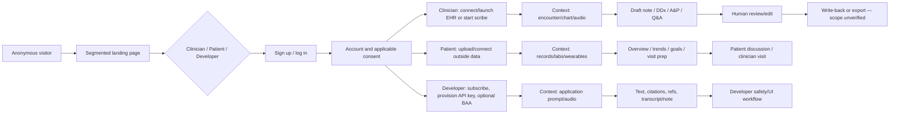
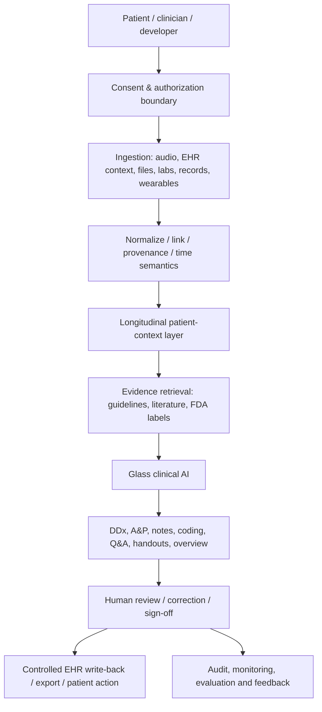
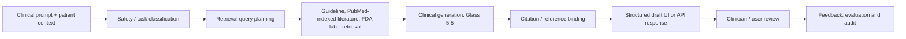
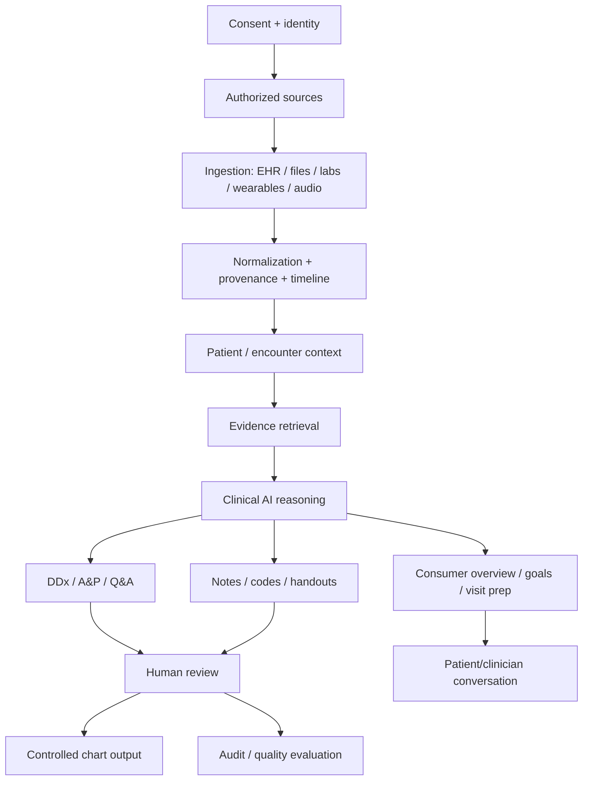
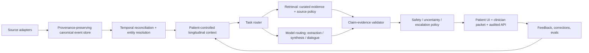

# Glass Health — Board-Level Competitive Intelligence Dossier
## Implications for Ovexis | Public-information cut: 25 July 2026

> **Research boundary.** This dossier uses only public pages, public company material and public third-party reporting. It does **not** involve account creation, authenticated-product inspection, scraping behind access controls, security probing, or attempts to bypass technical restrictions. “Not public” means *not verified in the reviewed public evidence*, not that the capability does not exist.
>
> **Claim discipline.** Every substantive point is marked: **🟢 Confirmed** = directly public and cited; **🟡 Strong Inference** = conclusion anchored in visible evidence; **🔴 Speculation** = a conditional scenario, never a factual assertion. Evidence IDs map to the companion spreadsheet’s Evidence Register.

---

# 1. Executive Summary

## Board thesis

- **🟢 Confirmed — Glass is building a clinical-intelligence platform with three public surfaces:** clinician point-of-care software; a consumer “AI agent for your health”; and a developer API. The current site names clinician, patient, practice, and developer audiences. [E03–E09]
- **🟢 Confirmed — Its clinician workflow spans ambient capture, differential diagnosis, evidence-grounded assessment/planning, documentation, coding claims, EHR context, and cited Q&A.** The clinician page markets capture through “finished note and billed claim,” while the API documentation exposes clinical Q&A, DDx, treatment planning, summarization, documents, scribing and triage. [E04, E09]
- **🟡 Strong Inference — The strategic move is from a single-purpose diagnostic copilot to a clinical-intelligence control plane.** The common substrate is a patient/encounter context plus evidence retrieval, reused across clinician workflow, consumer longitudinal intelligence, and API products. [E04, E07, E09, E11]
- **🟢 Confirmed — Glass’s core commercial distinction is not merely “medical LLM.”** It claims agentic evidence search, citations, structured clinical outputs, HIPAA/BAA paths, ambient transcription, and EHR integration—operational layers a generic model API does not provide by default. [E03–E06, E09]
- **🟡 Strong Inference — The near-term vulnerability is breadth versus operational proof.** Its public positioning now spans very high-risk clinician recommendations, consumer data aggregation, EHR workflows and developer infrastructure. Public pages do not substantiate underlying model provider, formal peer-reviewed validation, FDA status, SOC 2 status, exact integrations/write-back, or a granular security architecture. [E10]

## Why it exists — problem stack

| Layer | Diagnosis |
|---|---|
| Clinical cognitive problem | **🟢 Confirmed:** clinicians face accelerating literature/guideline volume and fragmented patient signals; Glass positions cited, patient-contextualized reasoning as the response. [E09] |
| Emotional problem | **🟡 Strong Inference:** clinicians want less fear of omission, less blank-page burden and less context switching, while retaining professional agency. Glass explicitly insists that clinicians review and decide. [E04] |
| Operational problem | **🟢 Confirmed:** the advertised workflow is designed to turn a single encounter/data context into note, DDx, plan, coding and evidence answers rather than separate tools. [E04, E09] |
| Consumer problem | **🟢 Confirmed:** Glass says records, labs and wearable data are scattered and hard to interpret; it offers a longitudinal overview, trends, goals, visit prep and doctor-message drafts. [E07, E11] |
| Category created | **🟡 Strong Inference:** “longitudinal clinical intelligence”—a shared reasoning layer that interprets patient data in context, rather than a passive record vault, generic chatbot or standalone scribe. |
| Categories displaced | **🟡 Strong Inference:** separate ambient scribe + clinical reference + diagnostic assistant + patient health dashboard + developer LLM stack. It will coexist with EHR systems of record and authoritative references rather than fully replace them. |

## Customer / non-customer

- **🟢 Confirmed — Current target audiences include clinicians, patients, practices and developers.** [E03, E07]
- **🟡 Strong Inference — Best early clinician customer:** independent or small-group, English-speaking clinicians with high documentation load and complex diagnostic/care-planning work, who can tolerate a review-first workflow.
- **🟡 Strong Inference — Best consumer customer:** a data-rich, health-literate adult with multiple portals/wearables and recurring care decisions; the patient policy is for adults and says it does not provide medical care. [E07, E08]
- **🟡 Strong Inference — Poor fit:** a patient expecting diagnosis, prescription, emergency response, a substitute clinician, pediatric self-service, or complete worldwide record aggregation. The public policy disclaims clinician-patient relationship and the service is 18+. [E08]
- **🟡 Strong Inference — Poor enterprise fit until validated:** an acute-care system requiring independently demonstrated reliability, robust governance, source traceability, exact write-back evidence, uptime commitments, and deployment/security artifacts.

## Jobs-to-be-done

1. **🟢 Confirmed:** “During a visit, capture the conversation and draft a document” — ambient scribing/documentation. [E04]
2. **🟢 Confirmed:** “Given this case, broaden and prioritize a differential, including dangerous misses.” [E09]
3. **🟢 Confirmed:** “Produce a problem-oriented, evidence-grounded plan and verify the sources.” [E09]
4. **🟢 Confirmed:** “Ask an evidence question against current literature/guidelines with citations.” [E09]
5. **🟢 Confirmed:** “Embed clinical AI capabilities in a product via API.” [E03–E05]
6. **🟢 Confirmed:** “Understand longitudinal records, labs, medicines and wearables; prepare for a clinician discussion.” [E07, E11]

## Value proposition and philosophy

- **🟢 Confirmed:** Glass says it is “grounded in leading medical evidence,” returns citations, and keeps clinician output reviewable; its API documentation positions answer text, reference objects, progress events and usage metadata as production components. [E04, E09]
- **🟡 Strong Inference:** Its product philosophy is *augmentation, not automation*: make the clinically responsible person faster and better informed while preserving review, edits and sign-off.
- **🟡 Strong Inference:** Its economic proposition is “one context ingestion, many high-value outputs,” which potentially lowers tool sprawl and marginal cognitive cost per encounter.

---

# 2. Company Intelligence

## Timeline, people and capital

| Date | Intelligence | Classification |
|---|---|---|
| 2021 | Dereck Paul, MD and Graham Ramsey state that they founded Glass. | **🟢 Confirmed** [E01] |
| March 2022 | Founders’ 2023 post says Glass launched in March 2022. | **🟢 Confirmed** [E01] |
| Late 2022 / announced Feb 2023 | Company announced investment from Breyer Capital and Y Combinator. | **🟢 Confirmed** [E01] |
| Sept 2023 | Glass announced a **$5m seed led by Initialized Capital**; announced participants included Breyer Capital, YC and named health-tech/operator angels. | **🟢 Confirmed** [E02] |
| 2023 | Public positioning: clinician-facing generative AI for DDx and clinical-plan drafting, using RAG and clinician oversight. | **🟢 Confirmed** [E02, E09] |
| 2026 | Public platform has clinician, patient and developer positions; API documentation calls current model Glass 5.5. | **🟢 Confirmed** [E03–E09] |

- **🟢 Confirmed — Named founders:** Dereck Paul, MD (co-founder/CEO in public company databases and announcements) and Graham Ramsey (co-founder/product role in public company databases). Primary founder-authored source confirms both names. [E01]
- **🟡 Strong Inference — Founder complementarity:** a physician founder + product cofounder plausibly explains the early clinical-notebook/medical-reasoning wedge and clinician-first safety language.
- **🟢 Confirmed — Funding beyond the publicly announced $5m seed is not reliably reconcilable from public databases.** PitchBook/CB Insights-style profiles contain estimates inconsistent with the company announcement. For board purposes, treat $5m as confirmed announced capital and all totals/valuation as **unverified**. [E02]
- **🟢 Confirmed — No public valuation was verified in reviewed authoritative material.** [E10]
- **🟢 Confirmed — No acquisition, patent portfolio, peer-reviewed company research paper, clinical trial, FDA clearance/authorization, or SOC 2 report was verified in reviewed public material.** [E10]
- **🟢 Confirmed — No public job listings or hiring roadmap was verified during this research cut.** This is absence of observed evidence, not a claim of no hiring. [E10]

## Partnerships / expansion

- **🟢 Confirmed:** Glass publicly lists Epic, eClinicalWorks, athenahealth and Elation integrations for Max workflows; the company explicitly tells buyers to confirm read, write-back and implementation scope. [E06]
- **🟢 Confirmed:** Its marketing patient mockups name Stanford Health Care, One Medical, Quest Diagnostics, Apple Watch, Oura Ring and a BP cuff as connected-source examples. This confirms presentation/design intent—not necessarily a production connector or partnership. [E07]
- **🟡 Strong Inference:** The patient product creates a potential B2C2B flywheel: consumer prepares a better clinician interaction; the clinician side legitimizes and potentially completes that loop. Interoperability and consent are the gating constraints.

---

# 3. Founder Psychology and Internal Strategy (explicit inference)

- **🟡 Strong Inference — Foundational belief:** clinical software should make reasoning visible and usable during real work, rather than ask clinicians to search a library or type into a generic chatbot.
- **🟡 Strong Inference — Assumption:** evidence retrieval + clinician evaluation + citations can make LLM assistance sufficiently trustworthy to enter the care workflow; pure pretraining is not adequate.
- **🟡 Strong Inference — Decision frame:** “make every patient context reusable.” Encounter audio, chart data, documents, labs and wearables are raw context; notes, DDx, plans, codes, education and summaries are rendered views.
- **🟡 Strong Inference — Risk tolerance:** high product ambition (consumer + provider + API) paired with explicit legal/clinical disclaimers and review-first guardrails.
- **🟡 Strong Inference — Ten-year vision:** Glass aims to become an intelligence layer across the care continuum, not a feature in an EHR. The public headline “frontier clinical intelligence for everyone” and three-sided products support this reading. [E03, E07]
- **🔴 Speculation — Likely internal north-star metric:** clinically useful, source-traceable actions per active longitudinal patient/encounter, adjusted for review and safety—not just tokens, transcripts or chat sessions.

---

# 4. Product Reverse Engineering

## Observed capability inventory

| Surface / action | Evidence-based observation | Strategic implication |
|---|---|---|
| Public IA | **🟢 Confirmed:** Home / For Clinicians / For Patients / For Practices / For Developers, Sign up and Log in. [E03, E07] | **🟡 Strong Inference:** segment-specific landing pages enable separate acquisition funnels. |
| Clinician capture | **🟢 Confirmed:** Glass markets ambient listening/capture during encounters. [E04] | **🟡 Strong Inference:** audio becomes the lowest-friction live context feed. |
| Reasoning | **🟢 Confirmed:** DDx includes most-likely, expanded, and can’t-miss sections with supporting/opposing arguments and next steps in API docs. [E09] | **🟡 Strong Inference:** tiering intentionally fights premature closure and makes review scannable. |
| Treatment | **🟢 Confirmed:** problem-based plan includes diagnostic and treatment/management next steps. [E09] | **🟡 Strong Inference:** plan is positioned as a clinician-editable draft, not automated order execution. |
| Evidence | **🟢 Confirmed:** company says it searches PubMed-indexed literature and guidelines; ranking uses recency/impact/citation strength and guidelines are prioritized when available. This is a vendor technical claim. [E09] | **🟡 Strong Inference:** citations are a trust UX and liability-control feature, not merely a research feature. |
| Notes | **🟢 Confirmed:** public clinician page says 60+ document types; API lists H&P, HPI, clinic/progress notes, discharge summaries, prior authorization, handoff and handouts. [E04, E09] | **🟡 Strong Inference:** document breadth supports specialty expansion and a paid workflow wedge. |
| Revenue cycle | **🟢 Confirmed:** clinician page advertises E/M, ICD-10-CM and CPT suggestions with justification. [E04] | **🟡 Strong Inference:** Glass is attempting to attach to revenue, not just productivity. |
| Longitudinal consumer | **🟢 Confirmed:** visible patient concepts include overview, records summary, visit prep, doctor message, trends, goals, medicine/conditions and timeline. [E07] | **🟡 Strong Inference:** this is the emerging Ovexis-adjacent threat surface. |
| API | **🟢 Confirmed:** API provides Messages and Scribing surfaces, OpenAPI, JSON/SSE, API keys, token accounting, citation/reference objects and BAA click-through path. [E03–E05] | **🟡 Strong Inference:** Glass is trying to become infrastructure, increasing distribution but multiplying safety/developer-support obligations. |

## What is *not* observable

- **🟢 Confirmed unknown:** actual authenticated screens, dashboard tabs, every button, notification behavior, onboarding sequence, admin/permission pages, user roles, retention schedules, storage topology, audit-log UX, exact EHR write-back fields, feature flags, model provider, model weights, knowledge graph, cloud provider, database, analytics SDKs, payment provider, security operations, or internal workflows. [E10]
- **🟢 Confirmed:** Glass’s own EHR guide cautions that SMART-on-FHIR does not automatically establish complete context or write-back; exact scope depends on deployment. [E06]

## Complete user journey — observed and bounded inference

- **🟢 Confirmed:** public landing pages, sign up/log in, API subscription/key path, external data ingestion, and clinician/developer output types exist as public pathways. [E03–E09]
- **🟡 Strong Inference:** verification, consent, review and billing gates must exist in some form, but their screen-by-screen implementation is not public.
- **🟢 Confirmed unknown:** referral, referral rewards, support routing, renewal mechanics, user-level notification design, subscription cancellation, and full mobile flows were not publicly verified. [E10]

---

# 5. UX / Growth / Customer Intelligence

## UX reading of public marketing surfaces

- **🟢 Confirmed:** public pages use a sparse, editorial black/white visual system with large photography, product-like narrative screenshots, source-oriented messages, and clear audience segmentation. [E03, E07]
- **🟡 Strong Inference:** this aesthetic is deliberately “calm clinical premium,” avoiding a gadget/chatbot feeling in a trust-sensitive category.
- **🟢 Confirmed:** patient and clinician pages lead with a visual narrative of inputs → analysis → actionable output, rather than technical architecture. [E04, E07]
- **🟡 Strong Inference:** the highest conversion friction is not UI—it is data authorization, reliability trust, clinician liability, EHR readiness, and willingness to pay.
- **🟢 Confirmed unknown:** accessibility conformance, dark mode, mobile interaction quality, loading state behavior, keyboard navigation, design tokens, and account-product microinteractions cannot be concluded from public marketing pages. [E10]

## Growth system

- **🟢 Confirmed:** Glass publishes a large SEO-oriented resource and competitor-comparison library; it has pages targeting AI documentation, doctors, APIs, EHR integrations, HIPAA, AI diagnosis, clinical decision support, and competitors. [E09]
- **🟡 Strong Inference:** this is programmatic/category-education SEO serving both clinician demand generation and developer/product-evaluation demand.
- **🟢 Confirmed:** free Lite clinician tier, low-priced Starter, paid Pro/Max and $250/month API minimum create product-led acquisition across audiences. Current public price must be rechecked at purchase. [E04, E05]
- **🟡 Strong Inference:** the free tier is a data-less adoption wedge; paid upgrades monetize volume, depth, customization and EHR access.

## Public sentiment signal (low confidence)

- **🟢 Confirmed:** a small Reddit thread frames Glass as useful for differentials/evidence-based A&P in IM, neurology and rheumatology, while stressing mandatory clinician vetting. It is an anecdote, not market truth. [R1]
- **🟡 Strong Inference:** the key customer fear is omission/overconfidence, rather than only overt hallucination. Ovexis must measure and surface provenance, missingness, stale data and uncertainty.
- **🟢 Confirmed unknown:** no representative NPS, churn, retention, cohort usage, customer count, paid conversion, enterprise logos, G2/Capterra distribution, or revenue was verified. [E10]

---

# 6. Healthcare Data, AI, Technical and Security Investigation

## Data architecture — known versus required

- **🟢 Confirmed:** Glass publicly describes SMART on FHIR authorization/context, external data inputs, longitudinal patient-context use, and evidence retrieval. [E06–E09]
- **🟡 Strong Inference:** any safe implementation requires canonical patient identity, data-source provenance, time anchoring, unit normalization, duplicate resolution, authorization scopes, and separate consumer/covered-entity data boundaries.
- **🟢 Confirmed unknown:** exact support for FHIR resources, HL7 v2, CCD/C-CDA, DICOM, Apple HealthKit, Google Health Connect, claims, pharmacy networks, genomics, wearable APIs, MPI, deduplication logic, or consent ledger is not disclosed. [E10]

## AI reverse engineering

- **🟢 Confirmed:** Glass calls its current API model “Glass 5.5,” retains 5.0 for continuity, and exposes version strings. [E03]
- **🟢 Confirmed:** its documentation claims agentic search across medical literature/guidelines, patient-context analysis, structured responses, citations, clinician evaluation, 900-question benchmark suite, anti-bias testing, red-teaming and retrieval-recall evaluation. These are **vendor claims**, not independently audited results. [E09]
- **🟢 Confirmed:** the underlying foundation model(s), fine-tuning approach, model hosting, prompt system, embedding/vector store, retrieval index implementation, reranker, knowledge graph, tool orchestration, patient-memory policy and confidence-calibration algorithm are not publicly disclosed. [E10]
- **🟡 Strong Inference:** a plausible public-architecture minimum is: ingestion → context packaging → query/retrieval planning → guideline/literature/FDA retrieval and ranking → generation → citations/reference assembly → structured output → review. It is not appropriate to assert a proprietary knowledge graph.
- **🔴 Speculation:** the model may use a multi-model routing stack for transcription, retrieval, synthesis and safety. No public evidence supports the specific providers or routing logic.

## API investigation

- **🟢 Confirmed:** `POST https://glass.health/api/external/v2/messages`; auth is `X-Api-Key`; messages and a version are required; JSON or SSE streaming is supported. [E04]
- **🟢 Confirmed:** public docs link an OpenAPI specification and interactive reference; direct API settings provision keys; a `metadata` field is echoed for correlation; nested metadata is not accepted. [E04]
- **🟢 Confirmed:** scribing supports diarization, >50 languages, resumable upload up to 1 GB, short synchronous or longer background jobs, and optional note generation. [E09]
- **🟢 Confirmed:** API price is publicly described as $250/month minimum plus token rates ($3/$16 per million input/output for 5.5 at research cut) and $0.85 per transcription hour; pricing is mutable. [E04]
- **🟢 Confirmed unknown:** OAuth, webhooks, rate limits, SLA, tenant isolation, SDKs, deprecation policy, data residency, idempotency, audit endpoints, API availability and precise error contract beyond examples. [E10]

## Security / privacy / regulatory posture

- **🟢 Confirmed:** API documentation says production PHI requires acceptance of a click-through BAA in API settings; EHR guide advocates minimum FHIR scopes, encryption in transit/at rest, avoiding PHI in logs, retention/deletion/backup planning, access/write-back logging, and human review. [E04, E06]
- **🟢 Confirmed:** Glass’s consumer privacy policy says Glass is not necessarily a HIPAA covered entity/business associate in direct-to-consumer use, and user-submitted health information is not HIPAA PHI in Glass’s hands absent a relevant BAA/relationship; agreements/law can supersede. [E08]
- **🟡 Strong Inference:** this distinction is commercially and ethically material. Consumer health information may have different legal protections and user expectations than EHR PHI; Ovexis should architect two explicit data governance planes rather than blur them.
- **🟢 Confirmed unknown:** SOC 2 Type II, ISO 27001, penetration-test report, encryption algorithms, key-management system, SSO/SCIM, RBAC/ABAC, incident history, subprocessors, GDPR legal basis/DPA, audit-log retention, BAA template, FDA determination, ONC certification and cybersecurity controls were not verified publicly. [E10]

---

# 7. Business Model, Moat, Competitive Landscape

## Model

- **🟢 Confirmed:** clinician pricing publicly shows Lite $0, Starter $18/month and Pro $81/month at the July 25 cut, with a Max plan and plan differentiation (limits/depth/customization/EHR). Pricing cards should be rechecked. [E05]
- **🟢 Confirmed:** Developer API has a $250 monthly minimum plus usage pricing; consumer pricing was not fully verified in this review. [E04]
- **🟡 Strong Inference:** revenue architecture is tri-modal: PLG clinician subscription; enterprise/practice integration; developer infrastructure usage. Consumer subscription can become a fourth stream.
- **🟢 Confirmed unknown:** ARR, gross margin, CAC, LTV, conversion, retention, sales cycle, enterprise contracting, payment processor and unit economics. [E10]

## Moat scorecard

| Moat | Now | Reason |
|---|---:|---|
| Clinical workflow / UX | Medium | **🟢 Confirmed:** broad encounter workflow; **🟡 Strong Inference:** easily copied at surface level but difficult to validate/deploy. |
| Evidence retrieval/citation system | Medium | **🟢 Confirmed:** it is productized; **🟡 Strong Inference:** content licensing, freshness and claim-level citation quality are defensible execution moats. |
| Longitudinal patient data | Future | **🟡 Strong Inference:** only compounds if consented, normalized, longitudinally used and trusted; marketing examples do not prove connector depth. |
| Clinical validation | Weak–Medium | **🟢 Confirmed:** internal benchmark claims; **🟢 Confirmed unknown:** independent validation/real-world outcomes. |
| Regulatory / trust | Weak–Medium | **🟢 Confirmed:** BAA pathway and review-first language; **🟢 Confirmed unknown:** independent compliance artifacts. |
| EHR distribution | Medium | **🟢 Confirmed:** four named EHR workflows; exact depth uncertain. |
| Developer ecosystem | Emerging | **🟢 Confirmed:** API/OpenAPI/self-serve pricing; **🟢 Confirmed unknown:** customers, SDK adoption, partners. |
| Brand | Medium | **🟡 Strong Inference:** differentiated, credible clinical-intelligence story; much smaller than legacy reference/EHR brands. |
| Network effect | Weak / Future | **🟡 Strong Inference:** individual data and clinical corrections could compound internally, but public evidence does not establish cross-user learning/network effects. |

## Competitive positioning

| Competitor set | Glass edge | Glass exposure | Ovexis implication |
|---|---|---|---|
| OpenEvidence / UpToDate / AMBOSS | **🟡 Strong Inference:** encounter-native output, scribe and plans rather than reference-only lookup. | **🟡 Strong Inference:** incumbents have authoritative content, brand and institutional distribution. | Own a longitudinal decision record and source-level evidence—not a generic search answer. |
| Abridge / Nabla / Suki / Freed / Heidi / DeepScribe | **🟢 Confirmed:** Glass markets DDx/A&P/cited Q&A alongside scribing. | **🟡 Strong Inference:** transcription/documentation vendors may close the CDS gap; some have deeper enterprise integrations. | Avoid scribe-only wedge; prove decision-quality and correction-time delta. |
| Atropos / evidence-generation platforms | **🟡 Strong Inference:** Glass operates in point-of-care workflow rather than RWE study question answering. | Different product surfaces can converge through evidence APIs. | Build care-delivery intelligence, not retrospective evidence alone. |
| Function / Levels / Superpower / preventive-health apps | **🟡 Strong Inference:** Glass consumer layer aspires to longitudinal context across records/labs/wearables, not a single testing program. | Consumer trust, data integration and clinical escalation are difficult. | Build vendor-neutral records-first insight with explicit care loop. |
| Apple Health / Google Health Connect / Oura / Whoop / Ultrahuman | **🟡 Strong Inference:** Glass interprets rather than merely aggregates personal signals. | Platform owners control data access and consumer distribution. | Treat device ecosystems as ingestion partners, never a durable monopoly. |
| Practo / Apollo 24/7 / Tata 1mg / Healthify (India) | **🟡 Strong Inference:** Glass is US/English/clinical-AI oriented; these win care access, pharmacy and local trust. | Glass public material does not establish Indian clinical workflow/regulatory localization. | Ovexis can create a local-data, care-navigation and clinician-collaboration moat. |
| Regacore / PreventiveHealth.ai / Human API | **🟢 Confirmed unknown:** scope was not sufficiently public/verified in this cut for factual feature comparison. | N/A | Do not use unsupported competitor claims in board decisions. |

## SWOT

| Strengths | Weaknesses |
|---|---|
| **🟢 Confirmed:** unified clinical AI surface, citations, API, scribing, FHIR language, consumer longitudinal narrative. | **🟢 Confirmed unknown:** public proof of validation, security certification, connector depth and operations is incomplete. |
| **🟡 Strong Inference:** one-context/many-output workflow has compelling clinician ROI. | **🟡 Strong Inference:** breadth risks uneven quality, unclear positioning, governance burden and support load. |

| Opportunities | Threats |
|---|---|
| **🟡 Strong Inference:** patient–clinician shared intelligence, evidence API infrastructure and longitudinal prevention. | **🟡 Strong Inference:** EHR and ambient incumbents can bundle; clinical harm, privacy failures, content-rights constraints and regulatory shifts are existential. |

## Porter’s Five Forces

- **🟡 Strong Inference — Rivalry: High.** LLM interfaces are copyable and adjacent vendors converge.
- **🟡 Strong Inference — Buyer power: High for systems, medium for individual clinicians.** EHR workflow, safety and procurement create high expectations.
- **🟡 Strong Inference — Supplier power: Medium–high.** Model, cloud, transcription, evidence/content and EHR access suppliers can constrain unit economics/product quality.
- **🟡 Strong Inference — New entrants: Medium.** Basic chat/scribe is easy; trusted integration, evaluation and data governance are hard.
- **🟡 Strong Inference — Substitutes: High.** Existing EHR, human workflow, reference products, general LLMs and patient portals are “good enough” alternatives.

---

# 8. Decision Ledger and Dependency Graph

## Decision ledger (representative major features)

| Feature | Why built / pain | KPI improved | Trade-off / alternative |
|---|---|---|---|
| Ambient scribing | **🟡 Strong Inference:** remove encounter documentation burden and capture rich context. | Note completion time; adoption; retained encounters. | Audio/privacy/noise risk; could rely on typed context. |
| Tiered DDx | **🟡 Strong Inference:** counter omission and cognitive narrowing. | Perceived clinical value; safety review rate. | More output can overwhelm; could use simple ranked list. |
| Citations | **🟡 Strong Inference:** make claims inspectable and build trust. | Trust, clinician review, enterprise conversion. | Retrieval latency/cost and citation–claim mismatch risk. |
| A&P | **🟡 Strong Inference:** move from information to usable work product. | Documentation time; plan completeness. | Greater clinical/regulatory risk than Q&A. |
| FHIR context | **🟡 Strong Inference:** eliminate manual re-entry and personalize output. | Activation, workflow stickiness, enterprise ACV. | Integration/consent/security complexity. |
| Patient overview | **🟡 Strong Inference:** create longitudinal consumer retention and a data moat. | WAU, data coverage, subscription retention. | Fragmented data, consumer safety and privacy obligations. |
| API | **🟡 Strong Inference:** distribute model capability through other products. | Usage revenue; ecosystem reach. | Support, abuse and safety governance become platform-scale. |

---

# 9. Failure Analysis and Risk Register

| Risk | Why it matters | Early indicator | Mitigation for Ovexis |
|---|---|---|---|
| Clinical omission / erroneous recommendation | **🟡 Strong Inference:** fluent, cited output can induce automation bias. | Correction patterns; adverse-event reports; citation mismatch. | Evidence-to-claim verifier, uncertainty/missing-data panel, clinician review and safety escalation. |
| Stale/wrong patient context | **🟡 Strong Inference:** longitudinal systems amplify identity/time errors. | Contradictory meds/labs; context freshness failure. | Source provenance, timestamp labels, reconciliation workflow and patient match checks. |
| Privacy boundary confusion | **🟢 Confirmed:** consumer and HIPAA contexts differ in policy. [E08] | Consent complaints; data-use misunderstanding. | Separate consumer/covered workflows, granular consent and clear data-purpose UX. |
| EHR integration overclaim | **🟢 Confirmed:** exact scope must be confirmed. [E06] | Pilot write-back defects; support tickets. | Publish resource/field matrix; test each tenant; no silent mutation. |
| Evidence quality / licensing | **🟡 Strong Inference:** citations can be irrelevant/outdated or unavailable. | Low citation entailment; source gaps. | Claim-level entailment, evidence recency rules, licensed sources and explicit evidence grades. |
| Unit-economics pressure | **🟡 Strong Inference:** audio + retrieval + model generation + support can consume margin. | Cost/encounter; long context usage. | Tiered context budgets, caching, event-driven summaries and model routing. |
| Platform disintermediation | **🟡 Strong Inference:** EHR/model vendors can bundle. | Loss of API/connector access. | Own longitudinal data/provenance and care-loop UX; multi-provider architecture. |
| Regulatory change | **🟡 Strong Inference:** patient-specific triage/treatment can shift risk classification. | Legal/regulatory notices. | Intended-use discipline, review gates, QMS-ready evidence, staged launches. |

---

# 10. Future Prediction

- **🟡 Strong Inference — Next 12 months:** expect deeper patient data connectivity, better longitudinal summaries, additional clinician workflow completion (coding, patient communication, write-back), and tighter API productization. These are direct complements to public pages.
- **🟡 Strong Inference — Next 3 years:** if execution succeeds, Glass will seek enterprise clinical-intelligence deployments and embedded OEM/API distribution; if not, it risks being categorized as a commodity scribe/CDS bundle.
- **🟡 Strong Inference — Next 5 years:** the strategic fork is a trusted patient–provider intelligence graph or a specialized clinical AI infrastructure provider. Both require more governance and outcomes evidence than marketing claims.
- **🔴 Speculation:** Glass could acquire/connectors, a patient-record aggregation asset, clinical content rights or a transcription specialist. No public acquisition signal was identified.

---

# 11. Ovexis Strategy Memo

## The strategic answer

- **🟡 Strong Inference — Do not compete as “another medical chatbot” or “another ambient scribe.”** Glass and much larger incumbents already occupy those visible wedges.
- **🟡 Strong Inference — Build Ovexis as the *verifiable longitudinal health intelligence layer*: every conclusion should show data provenance, freshness, uncertainty, missingness, source-grade evidence and a safe next action.**
- **🟡 Strong Inference — Win in India-first / globally portable care reality:** multi-provider, multi-lab, pharmacy, payer and device fragmentation; multilingual/codeswitched input; family/caregiver workflows; clinician-shareable but patient-owned longitudinal narrative.

## Recommended MVP (90–120 days)

1. **🟡 Strong Inference:** patient-controlled record ingestion (PDF/C-CDA/FHIR where available), labs and manual medicine capture.
2. **🟡 Strong Inference:** provenance-first longitudinal timeline with source, date, normal range/unit, confidence and conflict flag.
3. **🟡 Strong Inference:** three safe intelligence outputs: “what changed,” “what requires confirmation,” and “visit prep questions”—not diagnosis/prescribing.
4. **🟡 Strong Inference:** clinician-shareable one-page packet with cited evidence links and explicit “patient-reported vs source-verified” distinctions.
5. **🟡 Strong Inference:** human-in-the-loop escalation rules for danger signs; never disguise triage uncertainty.

## AI architecture recommendation

- **🟡 Strong Inference:** do not treat an LLM conversation history as clinical memory. Persist normalized, attributable events; separately persist user corrections and consent state.
- **🟡 Strong Inference:** use a multi-model abstraction with task-specific evaluation, but maintain a hard clinical policy layer independent of model provider.
- **🟡 Strong Inference:** build retrieval around claim-level evidence and applicability (population, country, date, contraindications), rather than citation decoration.

## GTM / pricing / moat

- **🟡 Strong Inference — Wedge:** employer/concierge clinic / chronic-care program / family physician network pilot where records fragmentation has measurable cost.
- **🟡 Strong Inference — GTM proof:** recruit 5–10 clinical design partners; measure medication-list reconciliation, time-to-visit-prep, missing-record recovery, clinician acceptance and unsafe-output rate.
- **🟡 Strong Inference — Pricing:** free individual timeline/limited imports; paid household plan; B2B per enrolled life plus verified-action fees; clinical API only after governance maturity. Avoid charging consumers for opaque “AI answers.”
- **🟡 Strong Inference — Moat:** portable consented longitudinal graph + reconciliation corrections + clinician-patient collaboration artifacts + local pathway/evidence localization + transparent quality telemetry.

## Top 50 ideas to copy

1. Cited answers; 2. review-first drafts; 3. tiered DDx; 4. problem-oriented plans; 5. ambient capture; 6. patient summaries; 7. visit prep; 8. clinician message drafts; 9. timeline; 10. medication list; 11. active-condition list; 12. lab trend view; 13. health goals; 14. patient-friendly handouts; 15. source references; 16. structured templates; 17. API progress events; 18. SSE; 19. OpenAPI; 20. key rotation; 21. BAA workflow; 22. minimum data guidance; 23. FHIR launch; 24. scoped authorization; 25. draft-only write-back; 26. evidence search; 27. guidelines-first ranking; 28. FDA label source; 29. speaker diarization; 30. specialty documentation; 31. billing rationale; 32. free adoption tier; 33. self-serve API; 34. segmented landing pages; 35. comparison SEO; 36. educational SEO; 37. clinician/patient/developer positioning; 38. deep-reasoning tier; 39. customization tier; 40. usage metering; 41. versioned models; 42. production metadata; 43. source-linked output; 44. human-readable safety framing; 45. live encounter insights; 46. longitudinal context; 47. patient data analysis; 48. triage guardrail concept; 49. clear integration caveats; 50. clinical evaluation narrative.

## Top 50 ideas to improve

1. Claim-level citations; 2. source freshness; 3. evidence applicability; 4. uncertainty labels; 5. missing-data detection; 6. conflicting-data resolution; 7. provenance UX; 8. medication reconciliation; 9. patient identity matching; 10. source consent; 11. data deletion; 12. caregiver permissions; 13. clinician delegation; 14. audit exports; 15. correction learning; 16. EHR field mapping; 17. write-back confirmation; 18. order safety; 19. escalation workflow; 20. safety incident process; 21. independent validation; 22. specialty calibration; 23. multilingual reasoning; 24. codeswitch transcription; 25. local guidelines; 26. regional units/ranges; 27. longitudinal temporal reasoning; 28. wearable signal quality; 29. lab normalization; 30. document extraction confidence; 31. data-quality dashboard; 32. patient explanation; 33. clinician handoff; 34. referral packets; 35. care plan adherence; 36. outcome tracking; 37. API schemas; 38. webhooks; 39. SDKs; 40. rate-limit transparency; 41. tenant governance; 42. RBAC; 43. SSO/SCIM; 44. security evidence; 45. pricing transparency; 46. enterprise rollout playbook; 47. support SLAs; 48. accessibility; 49. mobile offline behavior; 50. retention nudges tied to verified changes.

## Top 50 ideas to ignore

1. Unsupported superiority claims; 2. autonomous diagnosis; 3. autonomous prescribing; 4. silent chart mutation; 5. generic wellness platitudes; 6. opaque risk scores; 7. citation theater; 8. vanity model benchmarks; 9. unbounded chat memory; 10. data hoarding; 11. default broad consent; 12. providerless care promises; 13. direct-to-consumer PHI ambiguity; 14. copy-paste as integration strategy; 15. empty EHR logo walls; 16. feature-count marketing; 17. every-specialty-at-once launch; 18. diagnosis ranking without rationale; 19. user blame for messy data; 20. unsupported drug dosing; 21. unverified wearable claims; 22. alerts without action path; 23. gamified anxiety; 24. dark patterns in consent; 25. ads next to sensitive conclusions; 26. selling identifiable data; 27. unsupported emergency triage; 28. black-box evidence ranking; 29. hidden model changes; 30. no rollback; 31. no correction workflow; 32. no data expiration; 33. transcripts as permanent truth; 34. no source timestamps; 35. one-language assumption; 36. US-only care pathways as global default; 37. building an EHR; 38. competing on lowest token price; 39. overcustomization before core reliability; 40. raw PDF dump UX; 41. chart-summary without provenance; 42. unmeasured clinical benefit; 43. relying solely on foundation provider safety; 44. legal disclaimers as product safety; 45. generic retention email; 46. invasive notifications; 47. referral rewards for clinical advice; 48. unsupported claims-processing; 49. fake clinician endorsement; 50. treating patient and clinician needs as identical.

## Top 50 ideas to reinvent

1. Timeline→decision timeline; 2. overview→health narrative; 3. records import→reconciliation queue; 4. chat→evidence workbench; 5. DDx→uncertainty map; 6. A&P→shared care contract; 7. goals→measurable care milestones; 8. reminders→source-aware follow-ups; 9. summaries→clinician-ready packets; 10. citations→claim verification cards; 11. wearables→signal-quality-aware trends; 12. notes→structured event extraction; 13. scribe→consent-aware encounter capture; 14. EHR integration→bidirectional safety contract; 15. consent→living permission graph; 16. identity→family/caregiver graph; 17. patient profile→longitudinal phenotype; 18. risk score→actionability band; 19. dashboard→exception inbox; 20. alerts→closed-loop care tasks; 21. lab chart→trend plus causality hypotheses; 22. medication list→adherence/reconciliation graph; 23. referral→context-rich specialist handoff; 24. triage→safety net with local access; 25. evidence corpus→jurisdiction-aware evidence fabric; 26. model version→reproducible clinical run; 27. API log→clinical provenance ledger; 28. QA→continuous clinical evaluation; 29. feedback→adjudicated correction data; 30. privacy→user-readable data map; 31. security→verifiable controls center; 32. import→data-quality score; 33. patient instructions→teach-back workflow; 34. visit prep→shared agenda; 35. doctor message→structured asynchronous consultation; 36. chart context→freshness-filtered context; 37. “normal” lab→individual baseline; 38. preventive plan→opportunity-cost-ranked plan; 39. subscription→family health workspace; 40. app→portable health passport; 41. FHIR→semantic compatibility layer; 42. coding→care-completeness check; 43. documentation→care coordination asset; 44. referrals→outcome feedback loop; 45. UI personalization→role/purpose-specific views; 46. health score→evidence/calculation inspection; 47. engagement→trusted action completion; 48. database→patient-owned event store; 49. integration→connector trust score; 50. “AI copilot”→accountable intelligence system.

## Top 50 market gaps

1. Trusted longitudinal reconciliation; 2. Indian multi-provider records; 3. family consent; 4. caregiver collaboration; 5. local lab normalization; 6. pharmacy history; 7. claims context; 8. multilingual visit prep; 9. Hindi/English code-switch; 10. clinician source provenance; 11. data freshness; 12. missingness analysis; 13. patient-safe uncertainty; 14. outcome-linked plans; 15. low-bandwidth health access; 16. offline documents; 17. affordable chronic care; 18. local escalation navigation; 19. evidence localization; 20. guideline conflict display; 21. source-quality scoring; 22. medication reconciliation; 23. care-team handoff; 24. referral closure; 25. tests-to-action tracking; 26. preventive care gaps; 27. chronic disease trajectory; 28. wearable validity; 29. menstrual/reproductive longitudinal context; 30. elder-care delegation; 31. pediatric guardian workflows; 32. mental-health data boundaries; 33. imaging report normalization; 34. genomics consent; 35. health-plan integration; 36. safety auditability; 37. evaluation datasets; 38. clinical correction capture; 39. longitudinal benchmark; 40. patient-reported outcome integration; 41. provider time ROI; 42. decision accountability; 43. adverse-event feedback; 44. AI change management; 45. API guardrail kits; 46. granular BAA/DPA; 47. cross-border governance; 48. secure data portability; 49. consent revocation; 50. explainable pricing/value.

## Top 20 blue-ocean opportunities

1. Patient-owned verified event graph; 2. family health intelligence workspace; 3. longitudinal “what changed and why” engine; 4. care-gap closure marketplace-free workflow; 5. evidence-to-action packet for a specific visit; 6. clinician correction network with adjudication; 7. multilingual health-document interpreter with provenance; 8. local-lab normalization network; 9. trusted medical-document vault with expiring consent; 10. medication reconciliation copilot; 11. specialist handoff intelligence; 12. chronic-care trajectory simulator with explicit assumptions; 13. consumer-to-clinician shared agenda; 14. payer-neutral care journey; 15. source-aware wearable interpretation; 16. safety-net access navigator; 17. transparent health-insight ledger; 18. longitudinal clinical-AI evaluation platform; 19. consented research participation matching; 20. portable care narrative across countries.

---

# 12. Engineering Backlog Reconstruction

| Stage | Reconstruction | Confidence |
|---|---|---|
| MVP | **🟢 Confirmed:** original medical knowledge-management/clinician learning platform, launched 2022; early experimental clinical AI. [E01] | High |
| V2 | **🟢 Confirmed:** LLM DDx/plan drafting with retrieval and doctor-supervised positioning by 2023. [E02, E09] | High |
| Current | **🟢 Confirmed:** evidence API, transcription/scribing, clinician workflow, FHIR-facing EHR material, patient longitudinal product. [E03–E09] | High |
| Engineering debt candidates | **🟡 Strong Inference:** connector heterogeneity, document extraction, patient matching, data quality, evaluation drift, privacy segmentation, citation entailment and workflow-specific safety. | Medium |
| Future backlog | **🟡 Strong Inference:** enterprise governance, structured write-back, patient–clinician sharing, more connectors, evaluation reporting and localization. | Medium |
| Team size / stack | **🟢 Confirmed unknown:** cannot responsibly estimate from public evidence. [E10] | High |

---

# 13. References / Evidence Register

**Primary sources**

- **[E01]** Glass Health founders, “Glass Health Raises Investment from Breyer Capital and Y Combinator for a New Generation of Clinical Software” (14 Feb 2023): https://blog.glass.health/yc/
- **[E02]** Finsmes, “Glass Health Raises $5M in Funding” (14 Sep 2023): https://www.finsmes.com/2023/09/glass-health-raises-5m-in-funding.html ; company announcement surfaced on LinkedIn: https://www.linkedin.com/company/glass-health-inc
- **[E03]** Glass Developer API Documentation: https://glass.health/api-documentation
- **[E04]** Glass Clinician page: https://glass.health/for-clinicians ; clinician pricing: https://glass.health/pricing/clinicians
- **[E05]** Glass Developer API pricing/auth specification: https://glass.health/api-documentation
- **[E06]** Glass Clinical AI EHR Integration / SMART on FHIR guide: https://glass.health/resources/clinical-ai-api-ehr-integration ; EHR overview: https://glass.health/ehr-integration
- **[E07]** Glass for Patients: https://glass.health/for-patients ; homepage: https://glass.health/
- **[E08]** Glass privacy policy (updated 5 Jul 2026): https://glass.health/privacy
- **[E09]** Glass API capabilities/retrieval/model documentation: https://glass.health/api-documentation ; resources: https://glass.health/resources
- **[E10]** Public-evidence absence register: review of above official pages on 25 Jul 2026. Absence of evidence is not evidence of absence.

**Secondary / sentiment (not relied on for factual product claims)**

- **[R1]** Reddit anecdote, “AI Medical Scribes in 2026”: https://www.reddit.com/r/MedicalAIScribe/comments/1sxvjsv/ai_medical_scribes_in_2026_what_actually_works/

---

## Deliverables index

1. **This report:** executive strategy, product/AI/data architecture, UX, business, risks, decision ledger, roadmap, competition and Ovexis strategy.
2. **`glass_health_feature_inventory.xlsx`:** master feature inventory, evidence register and roadmap reconstruction; includes complexity, priority, copy/improve/reinvent action and confidence.

**Board caution:** the most material due-diligence gap is not feature availability. It is independently verifiable clinical quality, safety behavior, data governance, integration depth, outcomes, and commercial traction. Require those artifacts before treating public positioning as enterprise-ready fact.
