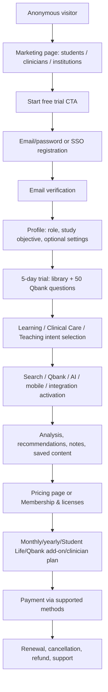
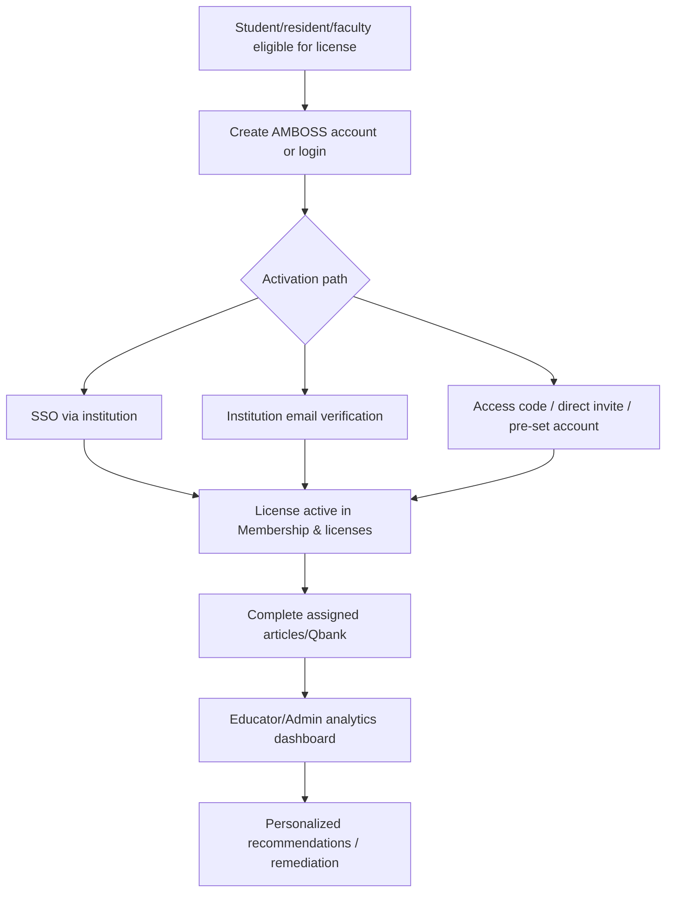
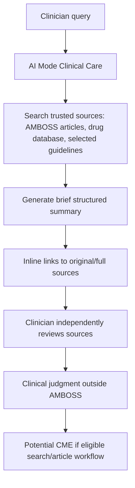
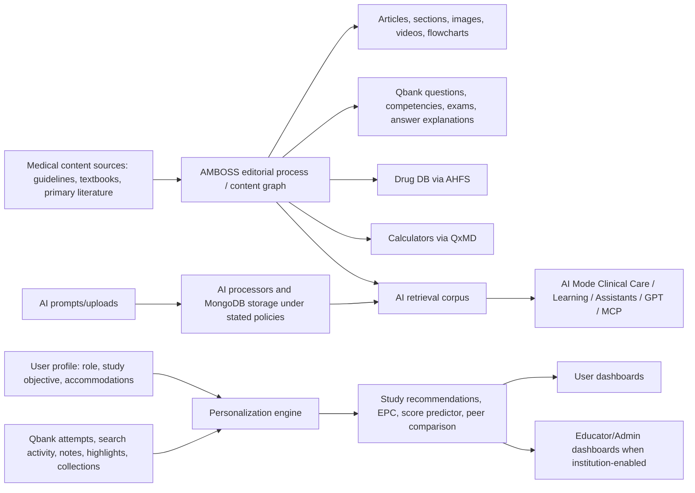
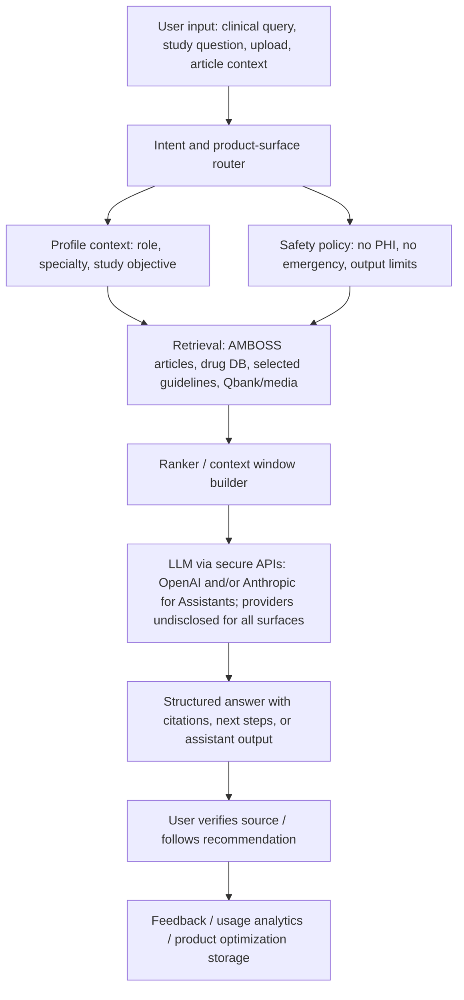
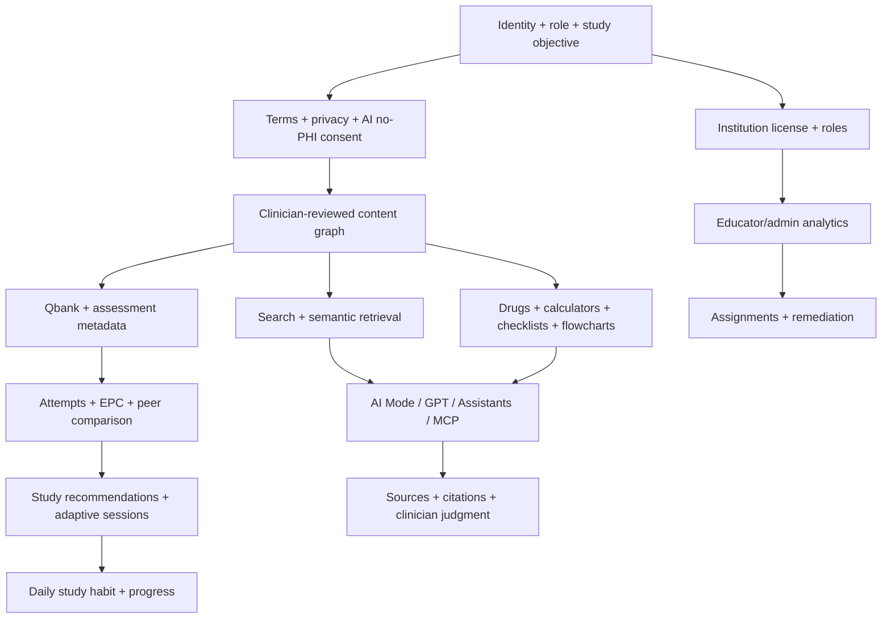
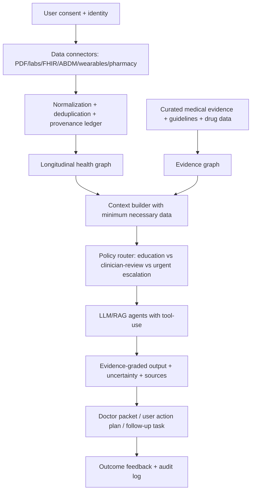
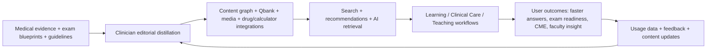

# AMBOSS Competitive Intelligence Report for Ovexis

**Target:** AMBOSS — Clinical Decision Support | Medical Education  
**Official website:** https://www.amboss.com/  
**Prepared:** 2026-07-25  
**Evidence standard:** 🟢 Confirmed = directly observed in public sources; 🟡 Strong Inference = evidence-backed inference; 🔴 Speculation = future-looking or unverifiable hypothesis.  
**Method constraint:** 🟢 Confirmed — This report uses public webpages, support docs, legal pages, public career pages, public search snippets, and publicly indexed third-party material only.  
**Screenshot constraint:** 🟢 Confirmed — This environment has no browser screenshot capture. The evidence register includes URLs, quoted evidence, confidence, and observed/inferred status; screenshot cells state “not captured; source URL available.”  
**Robots/ToS constraint:** 🟢 Confirmed — The investigation avoided disallowed/private account/API paths and did not attempt unauthorized access.

---

## 1. Executive Summary

### What they are building

- 🟢 Confirmed — AMBOSS is a global medical knowledge, medical education, Qbank, clinical decision support, educator, and AI medical intelligence platform for medical students, residents, clinicians, educators, PAs/NPs, and institutions. Evidence: https://www.amboss.com/int/about; https://www.amboss.com/us/features; https://www.amboss.com/us/newsroom/new-navigation.
- 🟢 Confirmed — The company explicitly frames the platform as a connected continuum across Learning, Clinical Care, and Teaching rather than as separate products. Evidence: https://www.amboss.com/us/newsroom/new-navigation.
- 🟢 Confirmed — Core product assets include a Knowledge Library, Qbank, study plans, analytics, mobile apps, Anki/Chrome/ChatGPT integrations, clinical tools, AI Mode Clinical Care, AI Mode Learning, AMBOSS Assistants, educator analytics, and institutional licensing. Evidence: https://www.amboss.com/us/features; https://www.amboss.com/us/ai-innovation; https://support.amboss.com/hc/en-us/articles/360034825692-Platform-overview.
- 🟢 Confirmed — The core clinical AI strategy is not open-web answer generation; AMBOSS says AI Mode draws from AMBOSS content, a drug database, and selected external guidelines/sources and links users back to sources. Evidence: https://www.amboss.com/us/clinical-ai-mode; https://support.amboss.com/hc/en-us/articles/43829822392721-AI-Mode-Clinical-Care-FAQs.

### Why it exists

- 🟢 Confirmed — AMBOSS says it was founded by doctors in 2012 after young residents became frustrated with disconnected resources that caused more time spent researching topics than mastering them. Evidence: https://www.amboss.com/int/about.
- 🟢 Confirmed — AMBOSS’s stated mission is to “empower all doctors to provide the best possible care.” Evidence: https://www.amboss.com/int/about.
- 🟡 Strong Inference — AMBOSS exists to compress the time and cognitive effort required to acquire, retrieve, apply, and teach medical knowledge across a clinician’s lifecycle; this inference follows from the official story, navigation redesign, clinician messaging, and product architecture. Evidence: https://www.amboss.com/int/about; https://www.amboss.com/us/clinicians; https://www.amboss.com/us/newsroom/new-navigation.

### Customer problems solved

- 🟢 Confirmed — For students, AMBOSS addresses exam preparation, knowledge review, Qbank practice, Anki integration, score prediction, clinical rotations, and avoiding tool-switching. Evidence: https://www.amboss.com/us/students.
- 🟢 Confirmed — For clinicians, AMBOSS addresses time-to-answer, clinical reference, drug lookup, differential diagnosis, diagnostic algorithms, checklists, offline mobile access, CME, and board/recertification prep. Evidence: https://www.amboss.com/us/clinicians; https://www.amboss.com/us/clinicians/attendings-apps.
- 🟢 Confirmed — For institutions, AMBOSS addresses assignments, assessments, learner progress, cohort analytics, at-risk learner identification, curriculum integration, and institutional licensing. Evidence: https://www.amboss.com/us/medical-schools; https://support.amboss.com/hc/en-us/articles/30006381173009-Educator-Tool-Overview; https://support.amboss.com/hc/en-us/articles/30034537472657-Educator-Feature-Data-and-Analytics.
- 🟢 Confirmed — AMBOSS explicitly says clinical tools are not intended for patients or laypeople. Evidence: https://www.amboss.com/us/clinicians/attendings-apps; https://www.amboss.com/us/legal/terms.

### Emotional problem

- 🟡 Strong Inference — AMBOSS reduces anxiety from uncertainty: “What should I study?”, “Am I ready?”, “What am I missing?”, and “Can I defend this clinical answer?” This follows from score predictor, study recommendations, source links, and clinical AI disclaimers. Evidence: https://support.amboss.com/hc/en-us/articles/25051203159313-USMLE-Score-Predictor; https://support.amboss.com/hc/en-us/articles/360047938152-Study-Recommendations; https://www.amboss.com/us/clinical-ai-mode.
- 🟡 Strong Inference — AMBOSS offers identity reinforcement for medical learners and clinicians by making them feel faster, safer, more prepared, and less likely to look uninformed on wards. Evidence includes official reviews and clinician testimonials. Evidence: https://www.amboss.com/us/reviews; https://www.amboss.com/us/mobile-app; https://www.amboss.com/us/residency-programs.

### Operational problem

- 🟢 Confirmed — AMBOSS claims its integrated system reduces switching between resources and combines Qbank, library, Anki, content review, board prep, and clinical tools. Evidence: https://www.amboss.com/us/students.
- 🟢 Confirmed — AMBOSS claims residents can save time by finding answers quickly and that unified resources reduce redundant tools. Evidence: https://www.amboss.com/us/residency-programs.
- 🟡 Strong Inference — Its operational win is not merely content; it is the conversion of content into workflow primitives: search, snippets, checklists, split view, highlighted knowledge gaps, Qbank sessions, and educator assignments. Evidence: https://www.amboss.com/us/features; https://support.amboss.com/hc/en-us/articles/360035199871-Feature-Overview; https://support.amboss.com/hc/en-us/articles/6203585104276-Management-Checklists.

### Who is the customer

- 🟢 Confirmed — Primary individual customers are medical students, residents, attending physicians, physician associates/assistants, nurse practitioners, PA/NP students, and other healthcare professionals. Evidence: https://www.amboss.com/us/students; https://www.amboss.com/us/clinicians/attendings-apps; https://www.amboss.com/us/pa; https://www.amboss.com/us/np.
- 🟢 Confirmed — Institutional customers include medical schools, PA programs, NP programs, residency programs, universities, clinics, and hospitals. Evidence: https://www.amboss.com/us/medical-schools; https://www.amboss.com/us/residency-programs; https://www.amboss.com/us/legal/terms-clinics.
- 🟢 Confirmed — AMBOSS also targets AI development teams through its MCP access program. Evidence: https://www.amboss.com/us/newsroom/amboss-mcp.

### Who is NOT the customer

- 🟢 Confirmed — Patients and laypeople are not intended users of the clinical decision support tools. Evidence: https://www.amboss.com/us/clinicians/attendings-apps; https://www.amboss.com/us/legal/terms.
- 🟢 Confirmed — AMBOSS legal terms state AI Mode Clinical Care is only for physicians and other healthcare professionals in the U.S., Canada, Australia, or Qatar, with different medical-research-only constraints elsewhere. Evidence: https://www.amboss.com/us/legal/terms.
- 🟢 Confirmed — AMBOSS clinics terms state the AMBOSS Program is not intended for storage, processing, or transmission of PHI. Evidence: https://www.amboss.com/us/legal/terms-clinics.

### Market category created / replaced

- 🟡 Strong Inference — AMBOSS is attempting to create the “medical intelligence platform” category: one longitudinal platform for medical learning, clinical reference, teaching, and AI evidence navigation. Evidence: https://www.amboss.com/us/newsroom/new-navigation; https://www.amboss.com/us/ai-innovation.
- 🟡 Strong Inference — It replaces or absorbs parts of textbook/reference search, Qbank-only subscriptions, point-of-care clinical reference, flashcard add-ons, board analytics, faculty assignment tools, and generic AI prompts. Evidence: https://www.amboss.com/us/features; https://support.amboss.com/hc/en-us/articles/360034825692-Platform-overview; https://www.amboss.com/us/ai-mode-learning.
- 🟡 Strong Inference — Its strongest category wedge is “education-to-practice continuity,” not patient longitudinal health intelligence. Evidence: https://www.amboss.com/us/newsroom/new-navigation; https://www.amboss.com/us/legal/terms-clinics.

### Jobs-To-Be-Done

| Status | User | Job | AMBOSS mechanism | Evidence |
|---|---|---|---|---|
| 🟢 Confirmed | Student | Prepare for boards and in-house exams | Qbank, study plans, self-assessments, score predictor, analytics | https://www.amboss.com/us/students |
| 🟢 Confirmed | Clerkship student | Look up clinical topics quickly on wards | mobile app, clinician mode, treatment plans, flowcharts, drug dosages | https://www.amboss.com/us/students; https://www.amboss.com/us/mobile-app |
| 🟢 Confirmed | Resident | Confirm workup/treatment while learning for boards | Clinical Care, Qbank, board review, CME | https://www.amboss.com/us/residency-programs; https://www.amboss.com/us/clinicians/attendings-apps |
| 🟢 Confirmed | Attending/NP/PA | Find evidence-based answers and earn CME | AI Mode Clinical Care, drug database, POC CME, guidelines | https://www.amboss.com/us/clinicians/attendings-apps; https://support.amboss.com/hc/en-us/articles/23670339860369-CME-MOC-FAQs |
| 🟢 Confirmed | Educator/Admin | Assign and track learner progress | Educator Tool, assignments, analytics, institution groups | https://support.amboss.com/hc/en-us/articles/30006381173009-Educator-Tool-Overview |
| 🟢 Confirmed | AI team | Ground agents in medical knowledge | AMBOSS MCP | https://www.amboss.com/us/newsroom/amboss-mcp |

### Value proposition

- 🟢 Confirmed — AMBOSS’s core value proposition is an all-in-one system combining knowledge, Qbank, analytics, clinical support, mobile/offline access, integrations, and AI, with source-linked and clinician-reviewed content. Evidence: https://www.amboss.com/us/features; https://support.amboss.com/hc/en-us/articles/6365572887188-AMBOSS-Content-Policy.
- 🟡 Strong Inference — The board-level value proposition is “familiarity + trust + speed + continuity”: a tool learned in medical school becomes a trusted reference in residency and clinical care. Evidence: https://www.amboss.com/us/newsroom/new-navigation; https://www.amboss.com/int/about.

### Core philosophy

- 🟢 Confirmed — AMBOSS states that any separation between learning, clinical care, and teaching is artificial. Evidence: https://www.amboss.com/us/newsroom/new-navigation.
- 🟢 Confirmed — AMBOSS states technology will not replace healthcare professionals, but those who embrace it will lead the way. Evidence: https://www.amboss.com/us/newsroom/financing-round-and-se-transition.
- 🟢 Confirmed — AMBOSS’s AI principles emphasize medical-professional + technology-expert collaboration and rigorous validation. Evidence: https://www.amboss.com/us/ai-principles.
- 🟡 Strong Inference — Their philosophy is clinician-centered augmentation, not autonomous diagnosis. Evidence: https://www.amboss.com/us/legal/terms; https://www.amboss.com/us/clinical-ai-mode.

---

## 2. Company Intelligence

### Timeline

| Status | Year | Event | Evidence |
|---|---:|---|---|
| 🟢 Confirmed | 2012 | Founded by doctors, for doctors | https://www.amboss.com/int/about |
| 🟢 Confirmed | 2017 | US launch and New York headquarters opening | https://www.amboss.com/int/about |
| 🟢 Confirmed | 2019 | €30M Series B led by Partech and Target Global per public press reporting | https://www.einnews.com/pr_news/497270609/medtech-company-amboss-raises-30m-in-series-b |
| 🟢 Confirmed | 2020 | Global Education Fund launched during COVID period; $2M initial budget later exceeded | https://www.amboss.com/us/scholarships-program |
| 🟢 Confirmed | 2024 | NEJM Knowledge+ acquired | https://www.amboss.com/us/newsroom/nejm-knowledge-plus-acquisition |
| 🟢 Confirmed | 2024 | Novaheal acquired | https://www.prnewswire.com/news-releases/amboss-acquires-novaheal-to-strengthen-its-position-in-the-german-nursing-market-and-as-a-hub-for-healthcare-talent-and-knowledge-302265824.html |
| 🟢 Confirmed | 2025 | AMBOSS converted to SE and closed €240M financing round | https://www.amboss.com/us/newsroom/financing-round-and-se-transition |
| 🟢 Confirmed | 2025 | AMBOSS MCP announced | https://www.amboss.com/us/newsroom/amboss-mcp |
| 🟢 Confirmed | 2025 | AMBOSS Assistants beta announced | https://www.amboss.com/us/newsroom/amboss-assistants |
| 🟢 Confirmed | 2025 | AMBOSS and NEJM Group launched Master Classes in Medicine | https://www.amboss.com/us/newsroom/amboss-and-nejm-group-launch-master-classes-in-medicine |
| 🟢 Confirmed | 2026 | Redesigned navigation announced as AMBOSS evolves as a medical intelligence platform | https://www.amboss.com/us/newsroom/new-navigation |

### Founders and leadership

- 🟢 Confirmed — Legal/privacy pages list AMBOSS SE managing directors as Dr. med. Madjid Salimi, Dr. med. Nawid Salimi, and Benedikt Hochkirchen. Evidence: https://www.amboss.com/us/legal/privacy.
- 🟢 Confirmed — Official 2025 financing release quotes Benedikt Hochkirchen as Co-Founder and Co-CEO and Dr. Madjid Salimi as Co-Founder and Co-CEO. Evidence: https://www.amboss.com/us/newsroom/financing-round-and-se-transition.
- 🟢 Confirmed — Official pages and public company profiles consistently indicate AMBOSS was founded by a team of physicians; public third-party sources vary on exact founder roster, so exact complete founder list should be treated carefully unless sourced directly from AMBOSS. Evidence: https://www.amboss.com/int/about; https://cherry.vc/founders/amboss.
- 🟡 Strong Inference — The leadership operating model is physician-founder led with a substantial internal medical team and product/engineering leadership for AI/search/knowledge retrieval. Evidence: https://www.amboss.com/us/newsroom/financing-round-and-se-transition; https://careers.amboss.com/departments/engineering-product/.

### Funding / investors / valuation

- 🟢 Confirmed — AMBOSS closed €240M with KIRKBI, M&G Investments, Lightrock, and existing shareholders. Evidence: https://www.amboss.com/us/newsroom/financing-round-and-se-transition.
- 🟢 Confirmed — AMBOSS’s 2025 financing release says many new investors manage evergreen funds and plan to accompany AMBOSS until a possible IPO and beyond. Evidence: https://www.amboss.com/us/newsroom/financing-round-and-se-transition.
- 🟢 Confirmed — AMBOSS says additional funds will go to technology, new market segments, international expansion, and selective acquisitions. Evidence: https://www.amboss.com/us/newsroom/financing-round-and-se-transition.
- 🟢 Confirmed — Earlier public reports stated AMBOSS raised €30M Series B led by Partech Growth with Target Global as co-investor and Cherry Ventures, Wellington Partners, and Holtzbrinck Digital participating. Evidence: https://www.einnews.com/pr_news/497270609/medtech-company-amboss-raises-30m-in-series-b.
- 🟡 Strong Inference — AMBOSS is positioning for eventual public-market optionality, because the official release references possible IPO and SE conversion. Evidence: https://www.amboss.com/us/newsroom/financing-round-and-se-transition.
- 🔴 Speculation — Exact current valuation is not publicly confirmed by AMBOSS in the sources reviewed; third-party estimates should not be treated as verified.

### Acquisitions and partnerships

- 🟢 Confirmed — AMBOSS acquired NEJM Knowledge+ from NEJM Group in April 2024. Evidence: https://www.amboss.com/us/newsroom/nejm-knowledge-plus-acquisition.
- 🟢 Confirmed — NEJM Knowledge+ integration supports AMBOSS’s goal of convergence between board prep and clinical practice. Evidence: https://www.amboss.com/us/newsroom/nejm-knowledge-plus-acquisition.
- 🟢 Confirmed — AMBOSS acquired Novaheal to strengthen German nursing-market presence and become a digital partner for physicians and nurses. Evidence: https://www.prnewswire.com/news-releases/amboss-acquires-novaheal-to-strengthen-its-position-in-the-german-nursing-market-and-as-a-hub-for-healthcare-talent-and-knowledge-302265824.html.
- 🟢 Confirmed — AMBOSS integrates AHFS clinical drug information. Evidence: https://support.amboss.com/hc/en-us/articles/4410493072660-Clinical-Drug-Database; https://www.amboss.com/us/clinicians.
- 🟢 Confirmed — AMBOSS uses QxMD for clinical calculators. Evidence: https://support.amboss.com/hc/en-us/articles/6204057842836-Clinical-Calculators.
- 🟢 Confirmed — AMBOSS and NEJM Group launched two initial Master Classes in Medicine courses: From Evidence to Impact and Core Concepts in Clinical Research. Evidence: https://www.amboss.com/us/newsroom/amboss-and-nejm-group-launch-master-classes-in-medicine.

### Patents, research, open source

- 🟡 Strong Inference — No public patent filings clearly attributable to AMBOSS medical education/CDS were identified in the searches run for this report; absence of evidence is not proof of absence.
- 🟢 Confirmed — AMBOSS publishes or references outcome/score reports and white papers, including Step 2 score association claims and score predictor modeling. Evidence: https://www.amboss.com/us/usmle/scores; https://support.amboss.com/hc/en-us/articles/25051203159313-USMLE-Score-Predictor.
- 🟢 Confirmed — AMBOSS’s careers blog describes internal search evaluation work using ChatGPT-generated judgment lists and compares GPT-generated judgments to medically trained raters. Evidence: https://careers.amboss.com/blog/enhancing-amboss-search-evaluation-with-chatgpt-generated-judgment-lists/.
- 🟢 Confirmed — The Stanford–Harvard/ARISE NOHARM preprint evaluates AMBOSS LiSA 1.0 among clinical AI systems; AMBOSS cites a #1 clinical-care safety ranking on multiple official pages. Evidence: https://arxiv.org/abs/2512.01241; https://www.amboss.com/us/ai-innovation.
- 🟡 Strong Inference — AMBOSS has not made a broad public open-source portfolio visible under an obvious official AMBOSS medical GitHub identity; search results with “AmbossTech” refer to a separate Bitcoin Lightning company and should not be confused with medical AMBOSS.

### Geographic expansion

- 🟢 Confirmed — AMBOSS has offices/hubs in Berlin, Cologne, Cagliari, and New York. Evidence: https://careers.amboss.com/.
- 🟢 Confirmed — AMBOSS supports US/English, DE/Deutsch, INT/English, PL/Polish, and PT/Portuguese web localizations in its site footer. Evidence: https://www.amboss.com/us/newsroom/financing-round-and-se-transition.
- 🟢 Confirmed — 2025 financing is intended to support additional international market exploration. Evidence: https://www.amboss.com/us/newsroom/financing-round-and-se-transition.
- 🟡 Strong Inference — LATAM expansion is active or planned because public LinkedIn/job snippets include LATAM partnership/marketing roles; this should be validated with current job pages at the time of decision.

### Regulatory filings / legal identity

- 🟢 Confirmed — AMBOSS SE is listed as data controller at Torstrasse 19, 10119 Berlin, with Local Court Berlin (Charlottenburg), HRB 270315 B. Evidence: https://www.amboss.com/us/legal/privacy.
- 🟢 Confirmed — AMBOSS MD Inc. is listed as a subsidiary at 234 5th Avenue, 2nd Floor, New York, NY. Evidence: https://www.amboss.com/us/legal/privacy.
- 🟢 Confirmed — AMBOSS’s terms state Delaware law for user terms and New York law/forum for clinic terms where permissible. Evidence: https://www.amboss.com/us/legal/terms; https://www.amboss.com/us/legal/terms-clinics.

---

## 3. Founder Psychology Report

- 🟡 Strong Inference — Founder belief #1: medical professionals drown in fragmented knowledge, and the winning product is an integrated system that distills, connects, and operationalizes knowledge. Evidence: https://www.amboss.com/int/about; https://www.amboss.com/us/newsroom/new-navigation.
- 🟡 Strong Inference — Founder belief #2: physicians must remain at the center; technology and AI should augment, not replace, clinical judgment. Evidence: https://www.amboss.com/us/newsroom/financing-round-and-se-transition; https://www.amboss.com/us/ai-principles; https://www.amboss.com/us/legal/terms.
- 🟡 Strong Inference — Founder belief #3: trust is built by clinician-authored content, editorial independence, source linkage, and workflow fit. Evidence: https://support.amboss.com/hc/en-us/articles/6365572887188-AMBOSS-Content-Policy; https://www.amboss.com/us/clinical-ai-mode.
- 🟡 Strong Inference — Founder decision framework appears mission-first but commercially disciplined: prove wedge in medical education, expand to US, expand to clinicians/residents, add CME, acquire NEJM Knowledge+ and Novaheal, then raise long-duration capital. Evidence: https://www.amboss.com/int/about; https://www.amboss.com/us/newsroom/nejm-knowledge-plus-acquisition; https://www.prnewswire.com/news-releases/amboss-acquires-novaheal-to-strengthen-its-position-in-the-german-nursing-market-and-as-a-hub-for-healthcare-talent-and-knowledge-302265824.html; https://www.amboss.com/us/newsroom/financing-round-and-se-transition.
- 🟡 Strong Inference — Risk tolerance is moderate-to-high in product/category expansion but conservative in clinical claims; they launch AI but heavily constrain it as evidence navigation, exclude PHI, and require human judgment. Evidence: https://www.amboss.com/us/clinical-ai-mode; https://www.amboss.com/us/legal/terms.
- 🔴 Speculation — 10-year ambition is to become the default medical intelligence infrastructure layer for every healthcare professional from school through practice and, via MCP, for AI agents that require grounded medical knowledge.
- 🔴 Speculation — Likely internal strategy is to convert medical-student familiarity into resident/clinician/institutional contracts, then use AI/search to attack point-of-care reference incumbents while expanding into nurses and allied health.

---

## 4. Product Reverse Engineering

### Publicly visible product map

| Status | Surface | Key visible pages / actions | Evidence |
|---|---|---|---|
| 🟢 Confirmed | Marketing site | Students, clinicians, institutions, pricing, features, AI, careers, legal, help center | https://www.amboss.com/us/features |
| 🟢 Confirmed | Registration | Email/password, SSO options, email verification, profile completion, 5-day free trial | https://support.amboss.com/hc/en-us/articles/360044684571-Set-up-your-AMBOSS-account |
| 🟢 Confirmed | Learning tab | Qbank, study plans & courses, Analysis, Library, AI Mode Learning | https://support.amboss.com/hc/en-us/articles/360034825692-Platform-overview; https://www.amboss.com/us/ai-mode-learning |
| 🟢 Confirmed | Clinical Care tab | Drugs, Clinical Resources, Quick Guides, Flowcharts, Calculators, Library, AI Mode entry points | https://support.amboss.com/hc/en-us/articles/360034825692-Platform-overview; https://support.amboss.com/hc/en-us/articles/360046945892-Clinical-Care-Features-Overview |
| 🟢 Confirmed | Teaching tab | Assignments, analytics, groups, admin roles | https://support.amboss.com/hc/en-us/articles/30006381173009-Educator-Tool-Overview |
| 🟢 Confirmed | Account settings | Career/study profile, contact details, membership/licenses, payment, notes/network/settings, reset stats/password, deletion | https://support.amboss.com/hc/en-us/articles/360032858551-Edit-your-AMBOSS-profile |
| 🟢 Confirmed | Mobile apps | Knowledge app and Qbank app, offline access, cross-device workflows | https://www.amboss.com/us/mobile-app; https://www.amboss.com/us/legal/accessibility |
| 🟢 Confirmed | Integrations | Anki add-on, Chrome extension, AMBOSS GPT, MCP partner interface | https://www.amboss.com/us/anki; https://www.amboss.com/us/chrome; https://support.amboss.com/hc/en-us/articles/33872741080081-AMBOSS-GPT; https://www.amboss.com/us/newsroom/amboss-mcp |

### Feature-level reverse engineering summary

- 🟢 Confirmed — AMBOSS’s integrated retention loop is: search/read article → encounter highlighted concepts → start Qbank session from article → answer questions → get session analysis/study recommendations → return to relevant articles/questions → score predictor/peer comparison reinforces readiness. Evidence: https://support.amboss.com/hc/en-us/articles/360035199871-Feature-Overview; https://support.amboss.com/hc/en-us/articles/360034825692-Platform-overview; https://support.amboss.com/hc/en-us/articles/42885439769233-How-does-the-Analysis-work.
- 🟢 Confirmed — AMBOSS’s clinical workflow loop is: open Clinical Care/search → identify article/drug/algorithm/checklist/calculator → review sources/doses/guidelines → optionally earn CME → save notes/continue via mobile/offline. Evidence: https://support.amboss.com/hc/en-us/articles/360046945892-Clinical-Care-Features-Overview; https://support.amboss.com/hc/en-us/articles/23670009661713-Internet-Point-of-Care.
- 🟢 Confirmed — AMBOSS’s institution loop is: admin/educator creates groups → creates assignments → learners complete → educator views performance → recommendations/remediation → renewal/expansion. Evidence: https://support.amboss.com/hc/en-us/articles/30007809419665-Creating-Assignments; https://support.amboss.com/hc/en-us/articles/30034537472657-Educator-Feature-Data-and-Analytics.
- 🟢 Confirmed — AMBOSS’s AI learning loop is: ask/upload → AI explanation → links to articles/Qbank/Anki → use recommended resources → activity counts toward progress. Evidence: https://www.amboss.com/us/ai-mode-learning; https://support.amboss.com/hc/en-us/articles/43601233276689-AI-Mode-Learning-FAQs.
- 🟢 Confirmed — AMBOSS’s AI clinical loop is: natural-language query → trusted-source retrieval → short AI-generated summary → links to full source review → user remains responsible for judgment. Evidence: https://www.amboss.com/us/clinical-ai-mode; https://support.amboss.com/hc/en-us/articles/43829822392721-AI-Mode-Clinical-Care-FAQs.
- 🟡 Strong Inference — The hidden product dependency is a medical content graph joining articles, sections, terms, questions, answer choices, media, drugs, guidelines, calculators, competencies, exams, specialties, and user performance data. Evidence: feature behavior across search, split view, Qbank article links, study recommendations, AI retrieval. Evidence: https://support.amboss.com/hc/en-us/articles/360035199871-Feature-Overview; https://support.amboss.com/hc/en-us/articles/360047938152-Study-Recommendations; https://support.amboss.com/hc/en-us/articles/33872741080081-AMBOSS-GPT.

### Publicly visible “buttons / actions” inventory

- 🟢 Confirmed — Marketing CTAs include Start Free Trial, See Pricing, Buy Now, Full Access Bundle, Get Student Life, Book a Demo, Request Report, Request Consultation/Quote, Download apps, Install Chrome Extension, Download Anki add-on. Evidence: https://www.amboss.com/us/pricing; https://www.amboss.com/us/medical-schools; https://www.amboss.com/us/residency-programs; https://www.amboss.com/us/chrome; https://www.amboss.com/us/anki.
- 🟢 Confirmed — Learning actions include Create Qbank Session, Create study plan, Start session, Review session, Show Stats, Show Answer, Reset Question, Mark, Rule Out, Notes, Lab Values, Refine, Qbank from article, High-Yield toggle, Key Exam Info toggle, Add to Collections. Evidence: https://support.amboss.com/hc/en-us/articles/360032477132-Creating-a-Qbank-session; https://support.amboss.com/hc/en-us/articles/360036038991-Using-Study-Mode-Exam-Mode; https://support.amboss.com/hc/en-us/articles/360035199871-Feature-Overview.
- 🟢 Confirmed — Clinical actions include search condition/drug, jump to checklist/treatment, click DOSAGE, open QxMD calculator, cross out differential items, check management steps, open AI Mode entry point with prefilled prompt. Evidence: https://support.amboss.com/hc/en-us/articles/6203585104276-Management-Checklists; https://support.amboss.com/hc/en-us/articles/6203840407956-Drug-Dosing; https://support.amboss.com/hc/en-us/articles/6204057842836-Clinical-Calculators; https://support.amboss.com/hc/en-us/articles/4542048524308-Differential-Diagnoses; https://support.amboss.com/hc/en-us/articles/360046945892-Clinical-Care-Features-Overview.
- 🟢 Confirmed — Educator actions include Create Assignment, choose title/type/question pool, filter questions, assign to groups/learners, add articles, view analytics, manage groups/users/roles. Evidence: https://support.amboss.com/hc/en-us/articles/30007809419665-Creating-Assignments; https://support.amboss.com/hc/en-us/articles/30006381173009-Educator-Tool-Overview; https://support.amboss.com/hc/en-us/articles/30034537472657-Educator-Feature-Data-and-Analytics.
- 🟢 Confirmed — Account/security actions include Manage Account, verify email, activate institutional license, connect/remove SSO, compare memberships, update payment, reset password, reset statistics, delete account. Evidence: https://support.amboss.com/hc/en-us/articles/360044684571-Set-up-your-AMBOSS-account; https://support.amboss.com/hc/en-us/articles/360032858551-Edit-your-AMBOSS-profile; https://support.amboss.com/hc/en-us/articles/30228751806097-Activating-your-Institutional-License-Trial-Single-Sign-On; https://support.amboss.com/hc/en-us/articles/360032508792-Deleting-your-AMBOSS-account-and-profile.

---

## 5. Complete User Journeys

### Anonymous visitor → trial → subscription

- 🟢 Confirmed — Free registration uses email/password or SSO options and requires email verification to keep using AMBOSS. Evidence: https://support.amboss.com/hc/en-us/articles/360044684571-Set-up-your-AMBOSS-account.
- 🟢 Confirmed — Free trial is 5 days, requires no payment info, and includes the platform plus 50 Qbank questions. Evidence: https://support.amboss.com/hc/en-us/articles/360045124131-Can-I-try-AMBOSS-for-free.
- 🟢 Confirmed — Standard membership gives unlimited library plus 50 Qbank questions/month; unlimited Qbank requires add-on. Evidence: https://support.amboss.com/hc/en-us/articles/360044237212-AMBOSS-Membership.
- 🟢 Confirmed — Memberships auto-renew and can be canceled in Membership & Licenses. Evidence: https://support.amboss.com/hc/en-us/articles/360044237212-AMBOSS-Membership.
- 🟢 Confirmed — Direct purchases have a 30-day no-questions-asked refund policy. Evidence: https://www.amboss.com/us/pricing.

### Institutional learner journey

- 🟢 Confirmed — AMBOSS supports institutional license activation through SSO, email verification, access codes, direct invites, and pre-set accounts. Evidence: https://support.amboss.com/hc/en-us/articles/30228751806097-Activating-your-Institutional-License-Trial-Single-Sign-On; https://support.amboss.com/hc/en-us/articles/4407238872084-Activating-your-Institutional-License-Trial-Email-Verification.
- 🟢 Confirmed — SSO institutional license access must be refreshed every 12 months. Evidence: https://support.amboss.com/hc/en-us/articles/30228751806097-Activating-your-Institutional-License-Trial-Single-Sign-On.
- 🟢 Confirmed — Authorized educators/admins can view assignment performance data according to roles and groups. Evidence: https://support.amboss.com/hc/en-us/articles/30034537472657-Educator-Feature-Data-and-Analytics.

### Clinical AI journey

- 🟢 Confirmed — AI Mode is a search/research aid that supports but does not replace professional judgment. Evidence: https://www.amboss.com/us/clinical-ai-mode; https://www.amboss.com/us/legal/terms.
- 🟢 Confirmed — AI Mode refuses/indicates when it cannot find relevant information according to AMBOSS. Evidence: https://www.amboss.com/us/clinical-ai-mode.
- 🟢 Confirmed — AI Mode Clinical Care must not be used in emergencies/time-sensitive situations without time to review information. Evidence: https://www.amboss.com/us/legal/terms.

---

## 6. UX Research

- 🟢 Confirmed — AMBOSS’s redesigned navigation is explicitly based on role/current intent and allows switching among Learning, Clinical Care, and Teaching. Evidence: https://www.amboss.com/us/newsroom/new-navigation.
- 🟢 Confirmed — The interface supports split view, article-section notes, collections, high-yield filtering, key-exam highlighting, personal highlighting, and search cards. Evidence: https://support.amboss.com/hc/en-us/articles/360035199871-Feature-Overview; https://support.amboss.com/hc/en-us/articles/4505593712148-Search-Function.
- 🟢 Confirmed — Exam Mode includes reverse color and text zoom, while accessibility pages list broader WCAG efforts and known exceptions. Evidence: https://support.amboss.com/hc/en-us/articles/360036038991-Using-Study-Mode-Exam-Mode; https://www.amboss.com/us/legal/accessibility.
- 🟢 Confirmed — The Chrome extension supports light/dark/system themes and site-level toggling. Evidence: https://www.amboss.com/us/chrome.
- 🟢 Confirmed — AMBOSS’s accessibility statement says it strives to meet WCAG 2.1 AA for in-scope digital services and lists known issues in contrast, iFrames, signup/login, navigation, keyboard focus, form errors, and legacy purchase flows. Evidence: https://www.amboss.com/us/legal/accessibility.
- 🟡 Strong Inference — The UX philosophy is “progressive compression”: show enough for quick action, but let users drill into evidence, details, or full articles when needed. Evidence: AI Shortcuts, High-Yield mode, split view, references, source links. Evidence: https://www.amboss.com/us/features; https://www.amboss.com/us/clinical-ai-mode.
- 🟡 Strong Inference — The primary UX risk is perceived density/text-heaviness for visual learners; this is inferred from product breadth and third-party/user feedback. Evidence: public review snippets and feature pages.
- 🟡 Strong Inference — A key conversion optimization pattern is risk removal: no-card 5-day trial, 30-day refund, student plans, institutional licenses, group discounts, and free utility integrations. Evidence: https://support.amboss.com/hc/en-us/articles/360045124131-Can-I-try-AMBOSS-for-free; https://www.amboss.com/us/pricing; https://www.amboss.com/us/group-discounts.

---

## 7. Healthcare Workflow Reverse Engineering

| Workflow | Status | AMBOSS coverage | Evidence |
|---|---|---|---|
| Clinical reference | 🟢 Confirmed | Search, articles, guidelines, AI Mode, drug DB, calculators, checklists, flowcharts | https://www.amboss.com/us/clinicians; https://support.amboss.com/hc/en-us/articles/360046945892-Clinical-Care-Features-Overview |
| Patient workflow | 🟢 Confirmed | Not intended for patients or laypeople | https://www.amboss.com/us/clinicians/attendings-apps; https://www.amboss.com/us/legal/terms |
| Provider workflow | 🟢 Confirmed | Supports physicians/NPs/PAs with evidence lookup and CME | https://www.amboss.com/us/clinicians/attendings-apps |
| Hospital workflow | 🟢 Confirmed | Supports management checklists, drug dosing, differential diagnosis, calculators and offline app; no PHI workflow | https://support.amboss.com/hc/en-us/articles/360046945892-Clinical-Care-Features-Overview; https://www.amboss.com/us/legal/terms-clinics |
| Insurance workflow | 🟢 Confirmed | No public AMBOSS insurance workflow found | Public source review |
| Lab workflow | 🟢 Confirmed | Lab values in Qbank and clinical calculators; no lab data ingestion found | https://support.amboss.com/hc/en-us/articles/360036038991-Using-Study-Mode-Exam-Mode; https://support.amboss.com/hc/en-us/articles/6204057842836-Clinical-Calculators |
| Pharmacy workflow | 🟢 Confirmed | Drug database/dosing reference; no pharmacy transaction integration found | https://support.amboss.com/hc/en-us/articles/4410493072660-Clinical-Drug-Database |
| Referral/consult workflow | 🟢 Confirmed | Prep for Consult assistant beta and consult guidance features; no referral network found | https://www.amboss.com/us/newsroom/amboss-assistants; https://www.amboss.com/us/features |
| Medical records | 🟢 Confirmed | AMBOSS terms say not for PHI storage/processing/transmission | https://www.amboss.com/us/legal/terms-clinics |
| Clinical documentation | 🟢 Confirmed | Dot Phrase Generator beta and dot phrases feature; no confirmed EHR writeback | https://www.amboss.com/us/newsroom/amboss-assistants; https://www.amboss.com/us/features |
| Care coordination | 🟡 Strong Inference | Supports knowledge coordination for learners/faculty; not care-team coordination over patients | https://support.amboss.com/hc/en-us/articles/30006381173009-Educator-Tool-Overview; https://www.amboss.com/us/legal/terms-clinics |

---

## 8. Healthcare Data Architecture

### AMBOSS actual public data architecture

- 🟢 Confirmed — AMBOSS processes user account data, optional profile data, login/IP data, usage statistics, institutional usage data, AI inputs, score-predictor data, comments, and cookies according to privacy policy. Evidence: https://www.amboss.com/us/legal/privacy.
- 🟢 Confirmed — AMBOSS stores AI Feature input data for product optimization and does not allow users to delete individual interactions during beta. Evidence: https://www.amboss.com/us/legal/privacy; https://www.amboss.com/us/legal/assistants.
- 🟢 Confirmed — AMBOSS prohibits patient data/PHI in AI features and states clinics product is not intended to process PHI. Evidence: https://www.amboss.com/us/legal/terms; https://www.amboss.com/us/legal/terms-clinics.
- 🟡 Strong Inference — AMBOSS likely maintains a structured medical knowledge graph because semantic search, split view, term underlining, Qbank-to-article mapping, Anki matching, AI retrieval, and recommendations require entity/relationship metadata. Evidence: https://support.amboss.com/hc/en-us/articles/360035199871-Feature-Overview; https://www.amboss.com/us/anki; https://support.amboss.com/hc/en-us/articles/33872741080081-AMBOSS-GPT.

### FHIR / HL7 / CCD / Apple Health / wearables / labs / genomics

- 🟢 Confirmed — No public source reviewed confirms AMBOSS medical product support for FHIR, HL7, CCD/CCDA, Apple Health, Google Health Connect, wearables, labs ingestion, imaging ingestion, genomics ingestion, insurance claims, pharmacy transaction data, or patient identity matching.
- 🟢 Confirmed — AMBOSS is explicitly not positioned as a patient longitudinal record or PHI-processing system in the reviewed legal/product materials. Evidence: https://www.amboss.com/us/legal/terms-clinics.
- 🟡 Strong Inference — This is AMBOSS’s largest gap relative to Ovexis: AMBOSS owns clinician knowledge workflows, not longitudinal personal health data workflows.

---

## 9. AI Reverse Engineering

### Confirmed AI surfaces

| Status | AI surface | What it does | Evidence |
|---|---|---|---|
| 🟢 Confirmed | AI Mode Clinical Care / LiSA | Natural-language clinical search over trusted sources with brief summary and source links | https://www.amboss.com/us/clinical-ai-mode |
| 🟢 Confirmed | AI Mode Learning | Study copilot for explanations, uploads, Qbank/Anki recommendations, progress | https://www.amboss.com/us/ai-mode-learning |
| 🟢 Confirmed | AMBOSS Assistants beta | Article-embedded tools for Learn, Practice, Teach use cases | https://www.amboss.com/us/newsroom/amboss-assistants |
| 🟢 Confirmed | AI Shortcuts / Related Questions | AI snippets and generated related questions in search results | https://www.amboss.com/us/features; https://support.amboss.com/hc/en-us/articles/4505593712148-Search-Function |
| 🟢 Confirmed | Study Recommendations | AI/ML-supported recommendations based on performance | https://www.amboss.com/us/features; https://support.amboss.com/hc/en-us/articles/360047938152-Study-Recommendations |
| 🟢 Confirmed | AMBOSS GPT | Custom GPT queries AMBOSS library and returns links | https://support.amboss.com/hc/en-us/articles/33872741080081-AMBOSS-GPT |
| 🟢 Confirmed | MCP | Agent interface to AMBOSS content | https://www.amboss.com/us/newsroom/amboss-mcp |

### Inferred architecture

- 🟢 Confirmed — AMBOSS uses OpenAI and Anthropic for AMBOSS Assistants and MongoDB Cloud Services for storage/management of databases necessary for AMBOSS Assistants. Evidence: https://www.amboss.com/us/legal/assistants.
- 🟢 Confirmed — AI Mode Learning FAQ says requests are sent to large language models through secure APIs and are not used to train those models. Evidence: https://support.amboss.com/hc/en-us/articles/43601233276689-AI-Mode-Learning-FAQs.
- 🟢 Confirmed — AI Mode Clinical Care FAQ says requests are sent to LLMs through secure APIs and are not used to train the models. Evidence: https://support.amboss.com/hc/en-us/articles/43829822392721-AI-Mode-Clinical-Care-FAQs.
- 🟡 Strong Inference — AMBOSS AI is RAG-like because it searches trusted sources, identifies relevant content, builds summaries, and links to source material. Evidence: https://www.amboss.com/us/clinical-ai-mode; https://support.amboss.com/hc/en-us/articles/33872741080081-AMBOSS-GPT.
- 🟡 Strong Inference — AMBOSS appears to use separate system prompts/policies per surface: Learning, Clinical Care, Teaching, Assistants, and GPT, because each surface has distinct roles, allowed inputs, and output formats. Evidence: https://www.amboss.com/us/ai-mode-learning; https://www.amboss.com/us/legal/terms.
- 🟢 Confirmed — AMBOSS says it regularly assesses output quality against curated questions using defined scoring criteria. Evidence: https://www.amboss.com/us/clinical-ai-mode.
- 🟢 Confirmed — AMBOSS AI principles say AMBOSS Intelligence-labeled content has medical professional review, clinical grounding, rigorous quality control, and continuous feedback/testing. Evidence: https://www.amboss.com/us/ai-principles.
- 🔴 Speculation — AMBOSS likely maintains a retrieval evaluation harness with human-labeled queries, judgment lists, ranking metrics, and LLM-assisted evaluation due to its search evaluation blog and AI product claims, but exact production evaluation stack is not public.

### AI guardrails and safety

- 🟢 Confirmed — AMBOSS requires users to verify outputs and not substitute AMBOSS AI for professional judgment. Evidence: https://www.amboss.com/us/legal/terms.
- 🟢 Confirmed — AMBOSS AI Mode Clinical Care is not for emergencies/time-sensitive situations without time to independently review information. Evidence: https://www.amboss.com/us/legal/terms.
- 🟢 Confirmed — AMBOSS instructs users not to enter patient data/PHI into AI features. Evidence: https://www.amboss.com/us/legal/terms.
- 🟢 Confirmed — AMBOSS highlights differing recommendations when sources differ. Evidence: https://www.amboss.com/us/clinical-ai-mode.
- 🟢 Confirmed — AMBOSS says AI Mode indicates when it cannot find relevant information. Evidence: https://www.amboss.com/us/clinical-ai-mode.

---

## 10. Technical Reverse Engineering

| Layer | Status | Evidence-backed assessment | Evidence |
|---|---|---|---|
| Marketing frontend | 🟢 Confirmed | Webflow-hosted/served marketing pages with CloudFront/Cloudflare/CDN headers observed; Webflow asset URLs visible | HTTP header capture; https://www.amboss.com/us/newsroom/financing-round-and-se-transition |
| Careers site | 🟢 Confirmed | Careers site returns nginx/PHP/Plesk headers; this applies to careers subdomain, not necessarily core app | HTTP header capture; https://careers.amboss.com/ |
| Core app | 🟡 Strong Inference | likely SPA/web app on next.amboss.com with React/TypeScript front-end and backend APIs | Careers job requiring React/TypeScript and GraphQL/REST: https://careers.amboss.com/jobs/job-09b09075-f834-4935-a4ec-8f5a878493f7/ |
| Backend | 🟡 Strong Inference | Go and Python are used in production teams; backend services likely include Go/Python | https://careers.amboss.com/jobs/job-09b09075-f834-4935-a4ec-8f5a878493f7/ plus Data Engineer search snippets |
| APIs | 🟡 Strong Inference | Internal GraphQL and/or REST APIs are used; no public API docs found | https://careers.amboss.com/jobs/job-09b09075-f834-4935-a4ec-8f5a878493f7/ |
| Cloud/hosting | 🟢 Confirmed | AWS for website/registered area; CloudFront, Cloudflare, Cloudinary CDNs | https://www.amboss.com/us/legal/privacy |
| Identity | 🟢 Confirmed | Auth0 IAM; institutional SSO supported | https://www.amboss.com/us/legal/privacy; https://support.amboss.com/hc/en-us/articles/30228751806097-Activating-your-Institutional-License-Trial-Single-Sign-On |
| Data warehouse/analytics | 🟡 Strong Inference | BigQuery/Snowflake, Airflow, Airbyte, dbt, Looker, Mixpanel appear in public job snippets | Public career search snippets |
| Monitoring | 🟢 Confirmed | Datadog and Sentry used | https://www.amboss.com/us/legal/privacy |
| Product analytics | 🟢 Confirmed | Segment and Amplitude listed; Bunchbox also listed | https://www.amboss.com/us/legal/privacy |
| Messaging/CRM | 🟢 Confirmed | Braze for contract messages/notifications; HubSpot for forms/CRM/email marketing; Zendesk for support | https://www.amboss.com/us/legal/privacy |
| Payments | 🟢 Confirmed | Stripe Payments Europe and Shopify Shop Pay are listed; membership page mentions credit/debit cards, ApplePay, PayPal | https://www.amboss.com/us/legal/privacy; https://support.amboss.com/hc/en-us/articles/360044237212-AMBOSS-Membership |
| AI storage/providers | 🟢 Confirmed | OpenAI, Anthropic, MongoDB Cloud Services for Assistants; Zendesk AI Agent uses OpenAI via Zendesk | https://www.amboss.com/us/legal/assistants; https://www.amboss.com/us/legal/privacy |
| CI/CD/IaC | 🟡 Strong Inference | Docker, CI/CD pipelines, AWS/Kubernetes are required in engineering job; Terraform/GitHub Actions appear in data platform snippets | https://careers.amboss.com/jobs/job-09b09075-f834-4935-a4ec-8f5a878493f7/ |
| Security headers | 🟢 Confirmed | HSTS, CSP, X-Frame-Options, X-Content-Type-Options observed on public pages | HEAD capture |
| Feature flags | 🔴 Speculation | Likely used due to beta/limited-access AI and experiments, but no public explicit provider confirmed | product behavior only |

---

## 11. API Investigation

- 🟢 Confirmed — AMBOSS publicly announced an MCP server for AI agents, with access granted to a limited number of AI development teams. Evidence: https://www.amboss.com/us/newsroom/amboss-mcp.
- 🟢 Confirmed — MCP is described as a standardized open-source interface developed by Anthropic and adopted by OpenAI and others; AMBOSS’s MCP lets agents browse/interact with AMBOSS articles, drug monographs, flowcharts, calculators, clinical scores, patient cases and more. Evidence: https://www.amboss.com/us/newsroom/amboss-mcp.
- 🟡 Strong Inference — AMBOSS likely has internal APIs for web/mobile/platform functions; public job descriptions mention GraphQL and/or REST experience. Evidence: https://careers.amboss.com/jobs/job-09b09075-f834-4935-a4ec-8f5a878493f7/.
- 🟢 Confirmed — No public OpenAPI specification, REST API docs, GraphQL schema, webhooks documentation, FHIR API, HL7 integration, SDK, or public rate-limit documentation for the AMBOSS medical platform was found in reviewed sources.
- 🟢 Confirmed — AMBOSS GPT has a quota detail: non-AMBOSS email users are limited to 50 prompts every 3 months, AMBOSS-email quota is lifted, and OpenAI rate limits still apply. Evidence: https://support.amboss.com/hc/en-us/articles/33872741080081-AMBOSS-GPT.
- 🟡 Strong Inference — AMBOSS is cautiously moving from closed SaaS to controlled developer ecosystem via MCP, not a fully open developer platform.

---

## 12. Security / Privacy / Compliance Investigation

| Topic | Status | Finding | Evidence |
|---|---|---|---|
| GDPR | 🟢 Confirmed | Privacy policy is GDPR-based with Art. 6 legal bases, DPO contact, SCC transfers, data subject rights context | https://www.amboss.com/us/legal/privacy |
| Data controller | 🟢 Confirmed | AMBOSS SE, Torstrasse 19, Berlin; privacy contact listed | https://www.amboss.com/us/legal/privacy |
| PHI/HIPAA posture | 🟢 Confirmed | Clinics terms state AMBOSS does not process PHI and program is not intended for PHI storage/processing/transmission | https://www.amboss.com/us/legal/terms-clinics |
| BAA | 🟢 Confirmed | No public evidence of a BAA offering found in reviewed sources; PHI is prohibited | https://www.amboss.com/us/legal/terms-clinics |
| SOC 2 / ISO 27001 | 🟢 Confirmed | No public AMBOSS SOC 2/ISO certification evidence found; AWS certifications are cited for AWS, not AMBOSS itself | https://www.amboss.com/us/legal/joint-data-processing |
| Encryption | 🟢 Confirmed | Joint data processing measures list HTTPS/SFTP, encrypted connections, encrypted notebooks/tablets/data carriers | https://www.amboss.com/us/legal/joint-data-processing |
| Access control | 🟢 Confirmed | Measures include user/password auth, firewalls, VPN, central password rules, 2FA, authorization concept and low admin count | https://www.amboss.com/us/legal/joint-data-processing |
| Audit logs | 🟢 Confirmed | Measures include logging access and data entry/modification/deletion | https://www.amboss.com/us/legal/joint-data-processing |
| Incident response | 🟢 Confirmed | Measures include breach reporting/notification processes and DPO involvement | https://www.amboss.com/us/legal/joint-data-processing |
| AI data training | 🟢 Confirmed | Terms state AMBOSS does not include Input in datasets for LLM training | https://www.amboss.com/us/legal/terms |
| AI data deletion | 🟢 Confirmed | AI input stored for product optimization; individual interaction deletion unavailable during beta | https://www.amboss.com/us/legal/privacy |
| FDA / medical device | 🟢 Confirmed | AMBOSS terms repeatedly disclaim diagnostic/treatment tool status and responsibility remains with clinician | https://www.amboss.com/us/legal/terms |
| ONC/FHIR | 🟢 Confirmed | No public evidence found; AMBOSS is not a patient record/EHR tool in reviewed sources | public source review |

### Threat model

- 🟡 Strong Inference — Major risks are medical misinformation, hallucination/misinterpretation, stale guidelines, overreliance by trainees, institutional data privacy leakage, account sharing, AI prompt data exposure, content scraping, and extension/plugin attack surface.
- 🟢 Confirmed — AMBOSS mitigates some risks through no-PHI rules, source grounding, medical review, legal disclaimers, privacy policies, access controls, and content-scraping prohibitions. Evidence: https://support.amboss.com/hc/en-us/articles/6365572887188-AMBOSS-Content-Policy; https://www.amboss.com/us/legal/terms; https://www.amboss.com/us/legal/joint-data-processing.
- 🔴 Speculation — Enterprise procurement may increasingly demand SOC 2 Type II, BAA, pen-test summaries, model cards, and safety evaluations if AMBOSS moves deeper into EHR/patient-context workflows.

---

## 13. Business Model

### Pricing and revenue streams

- 🟢 Confirmed — US student Monthly Access is $19.99/month billed monthly and Yearly Access is $12.50/month billed yearly. Evidence: https://www.amboss.com/us/pricing.
- 🟢 Confirmed — US student 12-month Qbank Bundle is listed at $448 and Student Life at $1199. Evidence: https://www.amboss.com/us/pricing; https://www.amboss.com/us/students.
- 🟢 Confirmed — Clinician Monthly Access is $29.99/month and Yearly Access is $21.58/month billed yearly. Evidence: https://www.amboss.com/us/pricing.
- 🟢 Confirmed — AMBOSS sells institutional licenses with flexible coverage plans and implementation solutions; pricing is not public. Evidence: https://www.amboss.com/us/pricing; https://www.amboss.com/us/medical-schools; https://www.amboss.com/us/residency-programs.
- 🟢 Confirmed — AMBOSS sells/activates AMBOSS Courses separately from membership according to terms. Evidence: https://www.amboss.com/us/legal/terms.
- 🟢 Confirmed — Self-Assessments are included in Student Life; otherwise official page lists $49.99. Evidence: https://www.amboss.com/us/usmle/self-assessment.

### Unit economics and sales motion

- 🟡 Strong Inference — Gross margins are likely software-like but lower than pure SaaS due to large medical editorial team, content licensing, AI inference costs, mobile/offline infrastructure, and support. Evidence: https://support.amboss.com/hc/en-us/articles/6365572887188-AMBOSS-Content-Policy; https://www.amboss.com/us/newsroom/financing-round-and-se-transition; https://www.amboss.com/us/legal/privacy.
- 🟡 Strong Inference — B2C CAC is reduced by SEO, free trial, group discounts, Anki/Chrome integrations, self-assessments, institutional familiarity, and word-of-mouth. Evidence: https://www.amboss.com/us/chrome; https://www.amboss.com/us/anki; https://www.amboss.com/us/group-discounts; https://www.amboss.com/us/usmle/self-assessment.
- 🟡 Strong Inference — B2B motion is consultative sales to medical schools/residency programs/clinics with demos, quotes, implementation, usage reports, and renewals. Evidence: https://www.amboss.com/us/medical-schools; https://www.amboss.com/us/residency-programs.
- 🟡 Strong Inference — LTV is lifted by career-stage continuity: preclinical → clerkships → boards → residency → attending CME/recertification. Evidence: https://www.amboss.com/us/newsroom/new-navigation; https://www.amboss.com/us/students; https://www.amboss.com/us/residency-programs.
- 🔴 Speculation — AI Mode may become a premium subscription layer later; AMBOSS explicitly reserves the right to offer AI Mode in a Premium subscription. Evidence: https://www.amboss.com/us/clinical-ai-mode; https://www.amboss.com/us/ai-mode-learning.

---

## 14. Growth Strategy

- 🟢 Confirmed — AMBOSS uses a 5-day no-card free trial. Evidence: https://support.amboss.com/hc/en-us/articles/360045124131-Can-I-try-AMBOSS-for-free.
- 🟢 Confirmed — AMBOSS uses group discounts where larger groups get higher discounts. Evidence: https://www.amboss.com/us/group-discounts.
- 🟢 Confirmed — AMBOSS runs or has run scholarship/global education initiatives. Evidence: https://www.amboss.com/us/scholarships-program.
- 🟢 Confirmed — AMBOSS has free/low-friction tools and integrations including Chrome extension, Anki add-on, AMBOSS GPT, score predictor pages, self-assessment events, and content pages. Evidence: https://www.amboss.com/us/chrome; https://www.amboss.com/us/anki; https://support.amboss.com/hc/en-us/articles/33872741080081-AMBOSS-GPT; https://support.amboss.com/hc/en-us/articles/25051203159313-USMLE-Score-Predictor.
- 🟢 Confirmed — AMBOSS uses institutional logos/social proof and testimonials across student, clinician, residency and reviews pages. Evidence: https://www.amboss.com/us/students; https://www.amboss.com/us/clinicians; https://www.amboss.com/us/residency-programs; https://www.amboss.com/us/reviews.
- 🟢 Confirmed — AMBOSS has official social channels linked in footers: YouTube, Facebook, Instagram, X, LinkedIn, TikTok. Evidence: https://www.amboss.com/us/newsroom/financing-round-and-se-transition.
- 🟢 Confirmed — AMBOSS participates in conferences for residency/GME audiences. Evidence: https://www.amboss.com/us/residency-programs.
- 🟢 Confirmed — AMBOSS highlights NOHARM ranking for AI Mode in clinician/residency/AI pages. Evidence: https://www.amboss.com/us/ai-innovation; https://www.amboss.com/us/residency-programs.
- 🟡 Strong Inference — AMBOSS’s best growth loop is “student familiarity becomes institutional clinician adoption,” because 2/3 US med students claim and resident/clinic products build on existing use. Evidence: https://www.amboss.com/us/medical-schools; https://www.amboss.com/us/residency-programs.

---

## 15. Hiring Intelligence

- 🟢 Confirmed — AMBOSS careers site says offices are Berlin, Cologne, Cagliari, New York, and remote. Evidence: https://careers.amboss.com/.
- 🟢 Confirmed — Careers site organizes departments into Medical, Product & Engineering, Commercial, General & Administration. Evidence: https://careers.amboss.com/.
- 🟢 Confirmed — Product & Engineering page lists leadership roles including Director of AI & Knowledge Retrieval, Director of Research, Director of Medical Product, Director of User Experience Design. Evidence: https://careers.amboss.com/departments/engineering-product/.
- 🟢 Confirmed — An open Senior Backend Engineer, Shop & Payments role requires Go, React willingness, GraphQL/REST API design, Docker, CI/CD, AWS/Kubernetes, monitoring, database management, and payment/subscription domain expertise. Evidence: https://careers.amboss.com/jobs/job-09b09075-f834-4935-a4ec-8f5a878493f7/.
- 🟡 Strong Inference — Hiring implies active work on commerce, localization, subscriptions, international tax compliance, payment reliability, and global access funnels. Evidence: https://careers.amboss.com/jobs/job-09b09075-f834-4935-a4ec-8f5a878493f7/.
- 🟡 Strong Inference — Search/AI/data roles and blog posts imply continued investment in AI retrieval, evaluation, data platforms, personalization, and product analytics. Evidence: https://careers.amboss.com/departments/engineering-product/; https://careers.amboss.com/blog/enhancing-amboss-search-evaluation-with-chatgpt-generated-judgment-lists/.
- 🟡 Strong Inference — Medical Project Manager / course role snippets imply ongoing CME/course content expansion, particularly in German-speaking markets.

---

## 16. Customer Intelligence

### Praise themes

- 🟢 Confirmed — Official reviews and public snippets praise AMBOSS as organized, efficient, useful for clinical rotations, and integrated with library/Qbank/Anki. Evidence: https://www.amboss.com/us/reviews; public Reddit search results.
- 🟡 Strong Inference — Users value AMBOSS most when they need foundations, context, and integrated explanations rather than only a final answer.
- 🟡 Strong Inference — Anki and Chrome integrations create disproportionate love because they fit existing study workflows rather than asking users to change habits.
- 🟡 Strong Inference — Clinician/resident praise centers on speed, confidence, and not breaking workflow on wards/rounds. Evidence: https://www.amboss.com/us/residency-programs.

### Complaint themes

- 🟡 Strong Inference — Recurrent public complaints include AMBOSS Qbank being hard, picky, low-yield, or 4–5 hammer questions causing overthinking compared with UWorld/NBME style.
- 🟡 Strong Inference — Some users view UWorld as the stronger or gold-standard pure Qbank, while AMBOSS is often praised as better integrated learning/reference.
- 🟡 Strong Inference — Mobile/extension pain points include inability to highlight passages on mobile, iPad/Anki limitations, Chrome extension sidebar preferences, bugs, and desire for Edge support.
- 🟡 Strong Inference — Student price sensitivity appears in Reddit discussions about whether Student Life is worth it, especially when schools provide UWorld.

### Churn / expansion signals

- 🟡 Strong Inference — Churn risk is highest where schools provide UWorld/free alternatives and users frame AMBOSS as optional supplement.
- 🟡 Strong Inference — Expansion potential is highest in residency programs, clinicians, PA/NP students, nurses, CME, and AI-enabled point-of-care search.

---

## 17. Decision Ledger

| Status | Feature | Why built | Pain solved | KPI improved | Trade-off |
|---|---|---|---|---|---|
| 🟡 Strong Inference | Integrated Library+Qbank | Link passive learning to active recall | Fragmented study resources | Retention, exam outcomes, LTV | Large editorial/assessment cost |
| 🟡 Strong Inference | High-Yield mode | Reduce curriculum overload | Too much information near exams | Session duration, completion | Risk of oversimplifying |
| 🟡 Strong Inference | Key Exam Info/Learning Radar | Convert mistakes to remediation | Learners do not know what to revisit | Qbank reuse, mastery | Requires precise mapping |
| 🟡 Strong Inference | Adaptive sessions | Save time and target weak areas | Manual planning fatigue | Qbank completion, EPC improvement | Opaque algorithm frustration |
| 🟡 Strong Inference | Score Predictor | Reduce exam uncertainty | Anxiety and poor readiness estimation | Trial conversion, retention | Prediction liability/perception |
| 🟡 Strong Inference | Anki add-on | Meet students in dominant workflow | Flashcards lack context | Acquisition, engagement | Dependency on external app/deck |
| 🟡 Strong Inference | Chrome extension | Ambient knowledge outside AMBOSS | Constant Googling/tab switching | Top-of-funnel, daily active use | Extension bugs/privacy perception |
| 🟡 Strong Inference | Clinical Mode | Extend beyond exams into wards | Residents need fast clinical answers | Career-stage retention | Higher clinical risk |
| 🟡 Strong Inference | AHFS drug DB | Avoid separate drug app | Dosing/drug lookup fragmentation | Clinician conversion | Licensing cost |
| 🟡 Strong Inference | Management Checklists | Prevent missed urgent-care steps | Cognitive load in admissions | Clinical usage frequency | Must keep current and safe |
| 🟡 Strong Inference | CME | Turn search into required credit | Clinicians need CME anyway | Clinician retention | Accreditation overhead |
| 🟡 Strong Inference | Educator Tool | Sell to institutions and improve learning oversight | Faculty need assignments/analytics | B2B ACV, renewals | Privacy/RBAC complexity |
| 🟡 Strong Inference | AI Mode Clinical Care | Defend against generic AI and attack clinical reference | Natural-language evidence search | Clinician adoption, AI brand | AI safety/regulatory risk |
| 🟡 Strong Inference | AI Mode Learning | Convert generic AI usage into AMBOSS-native study flow | Students ask ChatGPT but lack trusted next steps | Engagement, retention | LLM cost and reliability |
| 🟡 Strong Inference | MCP | Become infrastructure for medical AI agents | AI teams need grounded medical sources | Platform partnerships | Content licensing/safety exposure |

---

## 18. Feature Dependency Graph

- 🟢 Confirmed — AMBOSS dependencies begin with identity/profile/study objective and membership/license state. Evidence: https://support.amboss.com/hc/en-us/articles/360032858551-Edit-your-AMBOSS-profile; https://support.amboss.com/hc/en-us/articles/360044237212-AMBOSS-Membership.
- 🟢 Confirmed — Content graph and Qbank drive search, study recommendations, AI Mode Learning, Anki, and GPT. Evidence: https://support.amboss.com/hc/en-us/articles/360035199871-Feature-Overview; https://www.amboss.com/us/ai-mode-learning; https://support.amboss.com/hc/en-us/articles/33872741080081-AMBOSS-GPT.
- 🟢 Confirmed — Institution dashboards depend on institutional license activation, user roles, groups, assignments, and usage data. Evidence: https://support.amboss.com/hc/en-us/articles/30034537472657-Educator-Feature-Data-and-Analytics.

---

## 19. Engineering Roadmap Reconstruction

| Status | Phase | Likely scope | Evidence / rationale |
|---|---|---|---|
| 🟡 Strong Inference | MVP | German medical exam Qbank + library + high-yield content | Founding story and early German exam frustration |
| 🟡 Strong Inference | V2 | USMLE/NBME localization, English library/Qbank, New York launch | Official 2017 US launch and USMLE/NBME materials |
| 🟡 Strong Inference | V3 | Mobile apps, Anki, Chrome, analytics, score predictor, study plans | Current support/product docs show mature learning ecosystem |
| 🟡 Strong Inference | V4 | Clinical Care: drug DB, calculators, differential, checklists, CME, resident/clinician expansion | Clinician/residency pages and CME docs |
| 🟡 Strong Inference | V5 | Institutional educator suite: assignments, analytics, group/RBAC, usage reports | Medical school/residency and support docs |
| 🟢 Confirmed | Current | AI Mode Clinical Care, AI Mode Learning, Assistants beta, MCP, redesigned navigation | 2025/2026 official product updates |
| 🔴 Speculation | Next | deeper AI assistants, nursing/allied health, international markets, controlled agent/API ecosystem, possible EHR-context experiments only if legal posture changes | Financing release and product direction |

### Technical debt hypotheses

- 🟡 Strong Inference — Accessibility statement reveals legacy purchase flows, legacy pages, iOS login/paywall issues, navigation inconsistencies, and commerce redesign/migration work. Evidence: https://www.amboss.com/us/legal/accessibility.
- 🟡 Strong Inference — Payment/shop job indicates commerce stack complexity around subscriptions, international tax, global payment processing, and potential monolith decomposition. Evidence: https://careers.amboss.com/jobs/job-09b09075-f834-4935-a4ec-8f5a878493f7/.
- 🟡 Strong Inference — Multiple product surfaces and acquisitions likely create content model, identity, permission, and taxonomy integration debt.

---

## 20. Competitive Landscape

| Status | Company | Category | Compared with AMBOSS | Evidence |
|---|---|---|---|---|
| 🟢 Confirmed | UpToDate | Incumbent clinical reference/CDS | Stronger hospital enterprise penetration and expert-authored reference; AMBOSS stronger learner/Qbank lifecycle | https://www.wolterskluwer.com/en/news/uptodate-expert-ai-genai-clinical-decision-support |
| 🟢 Confirmed | OpenEvidence | AI medical search for verified clinicians | Stronger free AI search adoption claims; AMBOSS stronger education/Qbank/institution learning stack | https://www.prnewswire.com/news-releases/openevidence-achieves-historic-milestone-1-million-clinical-consultations-between-verified-doctors-and-an-artificial-intelligence-system-in-a-single-day-302712459.html |
| 🟡 Strong Inference | Glass Health | AI clinical workflow/DDx/docs | Glass closer to encounter workflow; AMBOSS closer to evidence/reference/education | https://glass.health/compare/uptodate |
| 🟢 Confirmed | Atropos Health | Real-world evidence generation | Atropos uses deidentified patient/RWD evidence; AMBOSS uses curated medical knowledge | https://www.atroposhealth.com/atropos-health-launches-new-geneva-os-and-chatrwd-application-for-rapid-real-world-evidence-with-generative-ai/ |
| 🟢 Confirmed | Function Health | Consumer biomarker testing | Function owns longitudinal consumer labs; AMBOSS owns clinician education/reference | https://www.functionhealth.com/article/function365 |
| 🟢 Confirmed | Superpower | Preventive health super-app | Superpower owns consumer lab/AI concierge; AMBOSS excludes patients/PHI | https://www.forbes.com.au/news/innovation/superpower-raises-30-million-to-launch-worlds-first-health-super-app/ |
| 🟢 Confirmed | Levels | CGM/metabolic health | Levels owns glucose/lifestyle data; AMBOSS owns medical knowledge workflows | https://apps.apple.com/us/app/levels-metabolic-health/id1481511675 |
| 🟢 Confirmed | Apple Health | Consumer health records/wearables | Apple owns device/record aggregation; AMBOSS has no public patient-data integration | https://www.healthcareitnews.com/news/apple-launch-health-records-app-hl7s-fhir-specifications-12-hospitals |
| 🟢 Confirmed | Google Health Connect | Android health-data API | Google provides on-device health data exchange; AMBOSS not in this data layer | https://developer.android.com/health-and-fitness/health-services/health-platform |
| 🟢 Confirmed | Human API | Health-data connectivity | Human API normalizes EHR/lab/wearable data for insurance/health workflows; AMBOSS is content/CDS | https://www.prnewswire.com/news-releases/human-api-launches-health-intelligence-platform-to-modernize-life-insurance-underwriting-and-customer-experience-301320064.html |
| 🟢 Confirmed | Practo / Apollo 24/7 / Tata 1mg | India consumer digital health | These own consultation/pharmacy/lab commerce; AMBOSS owns professional education/reference | https://www.apollo247.com/; https://apps.apple.com/us/app/tata-1mg-healthcare-app/id554578419 |
| 🟢 Confirmed | Healthify | AI nutrition/fitness coaching | Healthify owns consumer coaching; AMBOSS owns professional knowledge | https://www.business-standard.com/companies/news/ai-powered-fitness-app-healthify-secures-45-mn-to-drive-us-expansion-124102500232_1.html |
| 🟢 Confirmed | WHOOP / Oura / Ultrahuman | Wearable biometrics | Wearables own continuous biometric data; AMBOSS does not process user biometrics publicly | https://athletechnews.com/oura-whoop-push-deeper-into-healthcare/ |
| 🟢 Confirmed | PreventiveHealth.ai | Preventive personalized health | PreventiveHealth.ai appears consumer personalized wellness; AMBOSS is medical professional education/CDS | https://preventivehealth.ai/pages/about-us |
| 🟢 Confirmed | RegCore.AI | Regulatory intelligence, not health | Search found RegCore.AI as financial regulatory intelligence, not healthcare competitor; user may mean another Regacore | https://regcore.ai/ |

### Competitive advantages

- 🟢 Confirmed — AMBOSS’s unique advantage is integration across Qbank, library, clinical tools, mobile/offline, educators, and AI. Evidence: https://www.amboss.com/us/newsroom/new-navigation; https://www.amboss.com/us/features.
- 🟡 Strong Inference — AMBOSS’s main weakness versus Ovexis-like platforms is lack of longitudinal personal health data ingestion and patient-facing workflows.
- 🟡 Strong Inference — AMBOSS’s main weakness versus OpenEvidence is potential friction/paywall and lower “free physician AI search” virality, though AMBOSS has deeper education/learning loops.
- 🟡 Strong Inference — AMBOSS’s main weakness versus UpToDate is incumbent hospital procurement and enterprise trust; its strength is modern UX and education-to-practice continuity.

---

## 21. Moat Analysis

| Moat | Status | Strength | Rationale |
|---|---|---|---|
| Content/data moat | 🟢 Confirmed | Strong | Clinician-reviewed library, Qbank, questions, analytics, sources, updates |
| AI moat | 🟡 Strong Inference | Medium → Future Strong | RAG over proprietary content + LiSA/NOHARM + MCP, but model providers are not unique |
| Clinical moat | 🟢 Confirmed | Strong | 150+ physicians in 2025 release; editorial policy; ACCME; AHFS/NEJM |
| Brand moat | 🟢 Confirmed | Strong in students, medium in attendings | 2/3 US med student claim; 1M+ users; clinician expansion ongoing |
| Distribution moat | 🟢 Confirmed | Strong | Schools/residencies, apps, Anki, Chrome, GPT, group discounts |
| Developer moat | 🟡 Strong Inference | Future | MCP limited access, not yet broad public platform |
| Marketplace moat | 🟢 Confirmed | Weak | No visible marketplace business beyond courses and content partnerships |
| Regulatory moat | 🟢 Confirmed | Medium | ACCME, GDPR posture, no-PHI constraints; not a PHI/EHR regulated moat |
| Network effects | 🟡 Strong Inference | Medium | Peer stats, institutional cohorts, educator assignments, Anki/community loops |
| Switching costs | 🟡 Strong Inference | Medium | Notes, progress, analytics, institution license, study plans; content can be substituted by UWorld/UpToDate |
| Trust moat | 🟢 Confirmed | Strong | No ads/pharma sponsorship, content policy, source citations, clinician review |

---

## 22. Failure Analysis

- 🟡 Strong Inference — Technical failure mode: AI answers can miss/misinterpret rare/new evidence, increasing clinician distrust or legal risk. Evidence: AMBOSS itself acknowledges AI limitations. https://www.amboss.com/us/clinical-ai-mode.
- 🟡 Strong Inference — Business failure mode: UWorld remains dominant in high-stakes Qbank prep while OpenEvidence/UpToDate Expert AI erode clinician AI search adoption.
- 🟡 Strong Inference — Clinical failure mode: a widely publicized AI or content error could damage trust because clinical accuracy is existential.
- 🟡 Strong Inference — Regulatory failure mode: if AMBOSS moves into patient-specific recommendations or EHR integration without changing legal/compliance posture, it may trigger HIPAA/FDA/medical device obligations.
- 🟡 Strong Inference — Operational failure mode: content maintenance, AI evaluation, multiple professions, multiple countries, acquisitions, and institutional dashboards create complexity and cost.
- 🟡 Strong Inference — Distribution failure mode: institutions may prefer one incumbent enterprise tool; students may get UWorld/other resources free through schools.
- 🟡 Strong Inference — AI economics failure mode: included AI features may pressure gross margins if usage grows faster than monetization.
- 🔴 Speculation — IPO ambition may force margin discipline that slows editorial depth or free/included AI access.

---

## 23. Competitive Attack Plan

- 🟡 Recommendation — Do not attack AMBOSS as “another Qbank”; attack the category boundary by building the longitudinal patient-data intelligence layer AMBOSS intentionally does not cover.
- 🟡 Recommendation — Build PHI-compliant, consent-native FHIR/ABDM/wearable/lab/pharmacy ingestion first, then add evidence-grounded AI; AMBOSS built content first and excludes PHI.
- 🟡 Recommendation — Use clinicians for review, but let users own the data graph; AMBOSS owns professional content and user learning data.
- 🟡 Recommendation — Differentiate on personal longitudinal records, trends, medication safety, lab interpretation, screening gaps, and doctor-ready packets.
- 🟡 Recommendation — Match AMBOSS trust primitives: sources, evidence grades, provenance, human review, disclaimers, no ads/pharma influence.
- 🟡 Recommendation — Beat AMBOSS in India by integrating ABDM, WhatsApp, local labs, multilingual UX, family/caregiver roles, low-cost pricing, and doctor export workflows.
- 🟡 Recommendation — Use free utility wedges: lab report explainer, medication interaction checker, doctor visit summary, health vault import, screening checklist.
- 🟡 Recommendation — Build an Ovexis MCP/API around consented health data and evidence, but with strict scopes, audit logs, and de-identification.
- 🟡 Recommendation — Avoid competing on medical-school exam prep unless it is a GTM wedge; AMBOSS’s entrenched Qbank/content ecosystem is expensive to replicate.

---

## 24. Future Prediction

- 🔴 Speculation — Next 12 months: AMBOSS expands AI Mode availability, refines Assistants, uses NOHARM ranking in clinician/institutional sales, and continues navigation/purchase-flow/accessibility modernization.
- 🔴 Speculation — Next 12 months: AMBOSS pushes nursing/PA/NP and residency segments using Novaheal/NEJM Knowledge+ assets and the €240M financing.
- 🔴 Speculation — Next 3 years: AMBOSS becomes a broader medical intelligence platform with controlled agent access, more courses/CME, more AI assistant templates, and more institutional analytics.
- 🔴 Speculation — Next 3 years: AMBOSS may partner with ambient documentation/EHR vendors only if it can preserve no-PHI/search-aid posture or create separate compliant product lines.
- 🔴 Speculation — Next 5 years: AMBOSS’s likely strategic paths are IPO, acquisition by a major health information company, or durable private compounding through evergreen investors.
- 🔴 Speculation — Likely acquisitions include nursing/allied health content tools, specialty-board assets, guideline localization assets, workflow/AI evaluation tools, and institutional analytics products.

---

## 25. Ovexis Strategy Memo

### Top 50 ideas to copy
1. 🟡 Role-based navigation around user intent, not feature silos.
2. 🟡 A trusted content core before AI features.
3. 🟡 Human expert review labels on every clinical output.
4. 🟡 Source links and inline citations everywhere.
5. 🟡 A single knowledge graph connecting education, search, AI, and workflows.
6. 🟡 High-yield mode for reducing cognitive load.
7. 🟡 Learning radar tied to mistakes and remediation.
8. 🟡 Adaptive sessions based on modeled weaknesses.
9. 🟡 Exam/performance predictors with uncertainty ranges.
10. 🟡 Peer benchmarking with privacy constraints.
11. 🟡 Side-by-side split view to avoid tab hopping.
12. 🟡 Browser extension that inserts knowledge into external workflows.
13. 🟡 Anki-like integration for spaced repetition.
14. 🟡 Mobile offline mode for unreliable clinical environments.
15. 🟡 Integrated drug database rather than standalone drug app.
16. 🟡 Checklists for high-risk workflows.
17. 🟡 Differential diagnosis aids with transparent uncertainty.
18. 🟡 Clinical calculators inside relevant content.
19. 🟡 CME/credit loops from everyday usage.
20. 🟡 Institution dashboards with role-based visibility.
21. 🟡 Faculty assignment authoring and analytics.
22. 🟡 Group discounts / cohort acquisition.
23. 🟡 Long-duration Student Life-type membership.
24. 🟡 30-day refund to lower purchase risk.
25. 🟡 Clear AI principles and safety page.
26. 🟡 No-open-web retrieval claim for clinical AI.
27. 🟡 AI output with transparent limits and refusal behavior.
28. 🟡 Separate learning AI from clinical-care AI.
29. 🟡 Assistant templates for common jobs-to-be-done.
30. 🟡 MCP/API strategy for trusted knowledge distribution.
31. 🟡 Human-generated content policy and evidence hierarchy.
32. 🟡 Content update changelog.
33. 🟡 Use of user profile/study goals for personalization.
34. 🟡 Specialty-aware responses.
35. 🟡 Highlighting conflicting recommendations.
36. 🟡 Explicit “support not replace judgment” stance.
37. 🟡 Trust badges from partnerships and accreditations.
38. 🟡 Search as the central daily habit.
39. 🟡 Free utility tools as top-of-funnel.
40. 🟡 Community testimonials and love notes.
41. 🟡 Institutional usage reports as a B2B wedge.
42. 🟡 Self-assessment weeks/events as acquisition moments.
43. 🟡 AI study copilot that converts answers into practice.
44. 🟡 Tooltips/popups instead of page-level help only.
45. 🟡 Embedded support channels (WhatsApp/contact/callback).
46. 🟡 Data protection overview written for users.
47. 🟡 Accessibility roadmap with known gaps.
48. 🟡 Content-independent editorial stance/no pharma sponsorship.
49. 🟡 Use acquisitions to enter adjacent professions.
50. 🟡 Separate consumer/enterprise packaging without fragmenting core product.

### Top 50 ideas to improve
1. 🟡 Make evidence grading explicit, not just source-linked.
2. 🟡 Publish external validation, not only vendor claims.
3. 🟡 Convert every AI answer into an audit trail.
4. 🟡 Add regional guideline localization controls.
5. 🟡 Offer an explainer for why recommendations were made.
6. 🟡 Expose AI confidence and evidence sufficiency.
7. 🟡 Let users delete individual AI interactions.
8. 🟡 Make mobile feature parity a first-class requirement.
9. 🟡 Make browser extension sidebar behavior configurable.
10. 🟡 Add multi-provider health-data connections where allowed.
11. 🟡 Integrate wearable/lab/record timelines for Ovexis.
12. 🟡 Build a consent center richer than standard settings.
13. 🟡 Make institution dashboards privacy-preserving by default.
14. 🟡 Add patient-friendly translation with clinician review mode.
15. 🟡 Use structured clinical ontologies for all content objects.
16. 🟡 Support longitudinal goals beyond exams.
17. 🟡 Add outcome tracking after recommendations.
18. 🟡 Provide calibrated “unknown/needs clinician” states.
19. 🟡 Offer API tiers with sandbox data and compliance docs.
20. 🟡 Add developer documentation and schema governance.
21. 🟡 Add FHIR-native interfaces for Ovexis, unlike AMBOSS.
22. 🟡 Add family/caregiver/team roles.
23. 🟡 Add payer/lab/pharmacy workflows if building longitudinal care.
24. 🟡 Use retrieval over patient data and evidence simultaneously.
25. 🟡 Separate PHI and non-PHI AI infrastructure.
26. 🟡 Support multimodal records: labs, imaging, genomics, wearables.
27. 🟡 Support explainable normalization/deduplication.
28. 🟡 Publish security certifications and audit summaries.
29. 🟡 Offer BAA and HIPAA program if handling PHI.
30. 🟡 Build continuous safety evaluation set before launch.
31. 🟡 Add red-team output categories and model card.
32. 🟡 Support India localization for guidelines, drugs, labs.
33. 🟡 Make pricing transparent for institutions where possible.
34. 🟡 Instrument churn reasons by learner stage.
35. 🟡 Make learning content dynamic with micro-assessments.
36. 🟡 Add care-plan adherence loops.
37. 🟡 Add structured patient-reported outcomes.
38. 🟡 Integrate with provider EHR workflow via SMART on FHIR.
39. 🟡 Create “doctor review packet” exports.
40. 🟡 Build a marketplace of vetted clinical services carefully.
41. 🟡 Add data portability exports for users.
42. 🟡 Add explainable risk trajectories.
43. 🟡 Use physician+AI review for high-stakes insights.
44. 🟡 Build network effects around longitudinal records.
45. 🟡 Provide offline encrypted health vault.
46. 🟡 Add personalized screening guideline engine.
47. 🟡 Use local language support with medical QA.
48. 🟡 Add accessibility testing into CI/CD from day one.
49. 🟡 Make every recommendation actionable with next steps.
50. 🟡 Use a transparent evidence register in product UI.

### Top 50 ideas to ignore
1. 🟡 Do not copy “no PHI” if Ovexis wants longitudinal intelligence.
2. 🟡 Do not build only an education Qbank as the core wedge.
3. 🟡 Do not rely on static articles without user data loops.
4. 🟡 Do not make AI a chatbot bolted onto content.
5. 🟡 Do not hide evidence provenance behind generic citations.
6. 🟡 Do not overclaim hallucination-free guarantees.
7. 🟡 Do not make institutional dashboards invasive.
8. 🟡 Do not use exam anxiety as the only retention loop.
9. 🟡 Do not build hard/picky questions that create overthinking.
10. 🟡 Do not make mobile second-class.
11. 🟡 Do not design only for doctors and students.
12. 🟡 Do not ignore patients and caregivers.
13. 🟡 Do not use one-size-fits-all US guidelines globally.
14. 🟡 Do not bury deletion/export controls.
15. 🟡 Do not block all third-party workflows if ecosystem matters.
16. 🟡 Do not rely solely on Webflow-style marketing architecture for app scale.
17. 🟡 Do not use vague “AI-powered” labels without details.
18. 🟡 Do not expose output without confidence/uncertainty.
19. 🟡 Do not build hidden model memory without consent.
20. 🟡 Do not treat content licensing as a substitute for clinical workflow.
21. 🟡 Do not make paid AI premium before proving daily value.
22. 🟡 Do not overload users with dashboards.
23. 🟡 Do not use generic wellness recommendations without data.
24. 🟡 Do not skip FDA/HIPAA analysis if patient-specific.
25. 🟡 Do not make enterprise pricing a complete black box.
26. 🟡 Do not ignore India-specific affordability.
27. 🟡 Do not sell supplement/pharmacy marketplace too early.
28. 🟡 Do not let partners drive clinical bias.
29. 🟡 Do not create closed data silos.
30. 🟡 Do not require manual data entry as primary data source.
31. 🟡 Do not let PDFs become dead-end uploads.
32. 🟡 Do not use unstructured notes without ontology.
33. 🟡 Do not assume doctors will use another login.
34. 🟡 Do not ignore EHR context if clinical users are target.
35. 🟡 Do not build a tool that cannot explain conflicts.
36. 🟡 Do not use social proof without audited outcomes.
37. 🟡 Do not treat security page as afterthought.
38. 🟡 Do not ignore Chrome/Anki-like external workflow hooks.
39. 🟡 Do not build every profession at once without role UX.
40. 🟡 Do not use unvalidated biological-age gimmicks as core trust.
41. 🟡 Do not over-index on biohacker audience if mass health is goal.
42. 🟡 Do not promise diagnosis replacement.
43. 🟡 Do not bypass clinician review for high-risk insights.
44. 🟡 Do not store PHI with generic AI vendors without agreements.
45. 🟡 Do not train on user data by default.
46. 🟡 Do not make refund/cancellation difficult.
47. 🟡 Do not let accessibility exceptions remain undefined.
48. 🟡 Do not fragment user progress across products.
49. 🟡 Do not ignore support as part of trust.
50. 🟡 Do not make evidence static; freshness matters.

### Top 50 ideas to reinvent
1. 🟡 Reinvent AMBOSS content graph as a personal health knowledge graph.
2. 🟡 Reinvent Qbank as longitudinal health literacy and decision rehearsal.
3. 🟡 Reinvent Study Recommendations as health-action recommendations.
4. 🟡 Reinvent Score Predictor as risk trajectory predictor with uncertainty.
5. 🟡 Reinvent CME loop as patient/clinician co-learning loop.
6. 🟡 Reinvent browser extension as health-context copilot for lab portals and EHR portals.
7. 🟡 Reinvent checklists as personalized care orchestration plans.
8. 🟡 Reinvent differential diagnosis as “questions to ask your clinician” for consumers.
9. 🟡 Reinvent guidelines as patient-specific eligibility rules.
10. 🟡 Reinvent institution dashboards as clinician-patient-shared insight boards.
11. 🟡 Reinvent AI Mode Clinical Care as PHI-compliant, FHIR-grounded agent.
12. 🟡 Reinvent AI Mode Learning as a family/caregiver tutor.
13. 🟡 Reinvent Assistants as audited workflows with versioned prompts/tools.
14. 🟡 Reinvent MCP as consented health-data and evidence API.
15. 🟡 Reinvent role navigation into patient/doctor/caregiver/coach/payer roles.
16. 🟡 Reinvent mobile offline as encrypted longitudinal health vault.
17. 🟡 Reinvent AHFS-style drug data as medication safety graph with real meds.
18. 🟡 Reinvent Anki integration as habit formation/spaced action reminders.
19. 🟡 Reinvent self-assessment as annual preventive intelligence assessment.
20. 🟡 Reinvent group discounts as community preventive programs.
21. 🟡 Reinvent evidence register as in-product evidence ledger.
22. 🟡 Reinvent content updates as personalized guideline-diff notifications.
23. 🟡 Reinvent notes/highlights as clinician-reviewed memory objects.
24. 🟡 Reinvent search as multimodal search across labs, notes, imaging, wearables.
25. 🟡 Reinvent clinical calculators as auto-filled calculators with provenance.
26. 🟡 Reinvent educator assignments as remote care tasks and learning journeys.
27. 🟡 Reinvent board readiness as health readiness/goal readiness.
28. 🟡 Reinvent subscription as longitudinal membership spanning data custody.
29. 🟡 Reinvent review pages as after-visit intelligence summaries.
30. 🟡 Reinvent peer stats as privacy-safe population baselines.
31. 🟡 Reinvent Terms/Privacy into plain-language consent UX.
32. 🟡 Reinvent support chatbot as privacy-aware health-data navigator.
33. 🟡 Reinvent clinical safety benchmark as continuous product eval suite.
34. 🟡 Reinvent no-open-web as curated multimodal evidence garden.
35. 🟡 Reinvent specialty-aware into care-team-aware.
36. 🟡 Reinvent conflicting recommendations into shared-decision aids.
37. 🟡 Reinvent US-first content into India+global localization layer.
38. 🟡 Reinvent AI refusals into escalation pathways.
39. 🟡 Reinvent dots phrases as patient-friendly summaries and doctor packets.
40. 🟡 Reinvent institutional licenses as employer/preventive health programs.
41. 🟡 Reinvent cohort reports as public-health intelligence.
42. 🟡 Reinvent knowledge library as generated-but-reviewed microchapters.
43. 🟡 Reinvent patient cases as synthetic digital twin simulations.
44. 🟡 Reinvent retention loop around improvements in real biomarkers/outcomes.
45. 🟡 Reinvent marketplace only after trust layer is proven.
46. 🟡 Reinvent payment as insurance/HSA/employer hybrid.
47. 🟡 Reinvent data import as consented FHIR+wearable+lab ingestion.
48. 🟡 Reinvent article sections into computable recommendations.
49. 🟡 Reinvent user network as consented expert community.
50. 🟡 Reinvent content QA as human-in-the-loop governance operating system.

### Top 50 market gaps
1. 🟡 Consumer-owned longitudinal health record with clinical-grade interpretation.
2. 🟡 PHI-compliant medical AI that can use patient data safely.
3. 🟡 India-localized longitudinal preventive health intelligence.
4. 🟡 FHIR/ABDM integration layer for consumer-controlled records.
5. 🟡 Wearable + lab + EHR + pharmacy + imaging normalization.
6. 🟡 Explainable deduplication and identity resolution for health data.
7. 🟡 Evidence-graded recommendations with source freshness.
8. 🟡 Doctor-ready exports that reduce appointment friction.
9. 🟡 Caregiver/family health intelligence roles.
10. 🟡 Clinician review marketplace separated from supplement bias.
11. 🟡 Affordable annual preventive assessment for emerging markets.
12. 🟡 Lab trend interpretation over years, not one-off panels.
13. 🟡 Medication interaction context using actual patient meds.
14. 🟡 Guideline-diff alerts personalized to patient risks.
15. 🟡 Patient-facing education that adapts to health literacy.
16. 🟡 Risk trajectory models with uncertainty and next-best-action.
17. 🟡 Trust ledger for every AI recommendation.
18. 🟡 Consent and data portability as product differentiator.
19. 🟡 Interoperability APIs for third-party health apps.
20. 🟡 Safety evaluation benchmark for patient-specific AI.
21. 🟡 Longitudinal retention loop beyond reminders.
22. 🟡 Offline encrypted mobile health vault.
23. 🟡 Doctor collaboration without EHR integration burden.
24. 🟡 Automated records acquisition and summarization.
25. 🟡 Multilingual medical UX with verified translation.
26. 🟡 Outcome tracking after interventions.
27. 🟡 Insurance/lab/pharmacy workflows under user control.
28. 🟡 Personalized screening and vaccination tracker.
29. 🟡 Genomics/microbiome integration with conservative guardrails.
30. 🟡 Mental-health and lifestyle context merged with medical data.
31. 🟡 Clinical-grade wearable interpretation beyond wellness scores.
32. 🟡 Human review escalation for critical results.
33. 🟡 Low-cost physician second opinion packets.
34. 🟡 Data-quality score for every imported source.
35. 🟡 Patient identity and household graph.
36. 🟡 No-ad, no-pharma-sponsored trust position.
37. 🟡 Developer ecosystem for consented health applications.
38. 🟡 Evidence marketplace for vetted protocols.
39. 🟡 Community cohorts for preventive health programs.
40. 🟡 Intervention ROI tracking.
41. 🟡 Adherence intelligence with context-aware coaching.
42. 🟡 Continuity across life stages, not school-to-residency.
43. 🟡 Patient-clinician shared planning workspace.
44. 🟡 Privacy-preserving population analytics.
45. 🟡 Regulatory-ready audit logs for AI actions.
46. 🟡 Secure upload and redaction pipeline for records.
47. 🟡 Personalized lab reference ranges and trends.
48. 🟡 Clinical trial eligibility intelligence.
49. 🟡 Health coach + physician + AI triage routing.
50. 🟡 Cross-border medical record translation and normalization.

### Top 20 blue-ocean opportunities
1. 🔴 PHI-compliant personal medical intelligence layer.
2. 🔴 India-first ABDM + FHIR health vault.
3. 🔴 Doctor-ready longitudinal summary generator.
4. 🔴 Evidence-graded personal guideline engine.
5. 🔴 AI + human review preventive health plan.
6. 🔴 Family/caregiver health intelligence workspace.
7. 🔴 Longitudinal medication safety graph.
8. 🔴 Wearable-to-clinical signal interpreter.
9. 🔴 Personal health MCP for consented agents.
10. 🔴 Clinic-light second-opinion workflow.
11. 🔴 Insurance-neutral preventive care membership.
12. 🔴 Lab trend and root-cause intelligence.
13. 🔴 Clinical-grade health literacy tutor.
14. 🔴 Population cohort insights with privacy.
15. 🔴 Post-visit plan adherence copilot.
16. 🔴 Critical-result escalation network.
17. 🔴 Chronic-condition digital twin with audit.
18. 🔴 Pharmacy/lab marketplace separated by trust rules.
19. 🔴 Low-bandwidth offline health vault for India.
20. 🔴 Regulatory-grade AI evaluation suite.

### Recommended Ovexis MVP

- 🟡 Recommendation — MVP should be a consented longitudinal health vault plus AI explainer, not a medical-school Qbank.
- 🟡 Recommendation — MVP data ingestion should support PDF lab uploads, manual medications, conditions, family history, wearable imports, and at least one standards path such as FHIR/ABDM where feasible.
- 🟡 Recommendation — MVP outputs should be doctor-ready summaries, lab trend explanations, medication safety checks, screening/prevention gaps, and questions-to-ask-your-doctor.
- 🟡 Recommendation — MVP guardrails should classify every output as education, suggestion for clinician discussion, or urgent escalation.
- 🟡 Recommendation — MVP trust layer should include evidence grade, source links, confidence/uncertainty, freshness, and human review option.

### Recommended GTM

- 🟡 Recommendation — Start with high-anxiety, high-data users: chronic-condition families, executives/biohackers, health-conscious Indian urban consumers, and caregivers managing parents.
- 🟡 Recommendation — Use free tools as wedges: lab report parser, medication list checker, vaccination/screening gap checker, and doctor-visit summary generator.
- 🟡 Recommendation — Build clinician partnership channels with independent doctors and clinics, not hospitals first.
- 🟡 Recommendation — Price India differently from US/EU and avoid luxury-only positioning.

### Recommended moat

- 🟡 Recommendation — Build a data moat around normalized, consented longitudinal health records, not around generic medical content.
- 🟡 Recommendation — Build a trust moat with human review, evidence ledger, no-ad/no-supplement-bias policy, and explicit clinical escalation.
- 🟡 Recommendation — Build an integration moat with labs, ABDM/FHIR, wearables, pharmacy, and clinician export workflows.

### Recommended AI architecture

- 🟡 Recommendation — Use separate environments for PHI and non-PHI content; AMBOSS’s no-PHI stance is not sufficient for Ovexis.
- 🟡 Recommendation — Implement data minimization, encryption, audit logs, user-controlled memory, deletion/export, and BAA-ready infrastructure from day one.
- 🟡 Recommendation — Use RAG over both personal data and curated evidence, with a policy layer that blocks diagnosis claims and escalates critical findings.

### Recommended pricing

- 🟡 Recommendation — Offer a freemium vault/import tier, a low-cost annual personal intelligence tier, a family plan, and a clinician-reviewed premium tier.
- 🟡 Recommendation — Avoid tying core safety features to upsells; monetize convenience, review, integrations, and advanced longitudinal insights.

### Recommended roadmap

| Status | Period | Roadmap |
|---|---|---|
| 🟡 Recommendation | 0-3 months | PDF lab parser, health profile, meds, conditions, evidence-based explainer, doctor packet |
| 🟡 Recommendation | 3-6 months | Longitudinal trends, wearable import, screening gaps, family/caregiver roles, consent center |
| 🟡 Recommendation | 6-12 months | FHIR/ABDM, clinician review network, medication safety graph, multilingual India UX |
| 🟡 Recommendation | 12-24 months | Health MCP/API, employer/family plans, provider integrations, outcomes tracking |
| 🟡 Recommendation | 24+ months | Digital twin simulations, personalized guideline engine, population insights, regulated clinical pathways if chosen |

---

## 26. Master Feature Inventory

- 🟢 Confirmed — The complete feature inventory spreadsheet is provided as `AMBOSS_Feature_Inventory.xlsx` with requested columns.
- 🟢 Confirmed — Spreadsheet rows include feature, purpose, evidence, user/business value, engineering/clinical/infrastructure/regulatory complexity, estimated team/months, priority, category, copy/improve/ignore/reinvent guidance, moat, and confidence.

---

## 27. Evidence Register

- 🟢 Confirmed — The evidence register is provided as `AMBOSS_Evidence_Register.xlsx`.
- 🟢 Confirmed — Each row contains claim, evidence quote/summary, source URL, confidence, observed vs inferred, and screenshot status.
- 🟢 Confirmed — Screenshot status is “not captured; source URL available” because this environment lacks browser screenshot capture.

---

## SWOT

| Status | Strengths | Weaknesses |
|---|---|---|
| 🟢/🟡 | 🟢 Clinician-authored content; 🟢 integrated Qbank/library; 🟢 strong student distribution; 🟢 AI grounded in curated sources; 🟢 ACCME; 🟢 institutional tools; 🟢 NEJM/AHFS/QxMD assets; 🟡 emerging MCP platform | 🟢 Not patient-facing; 🟢 no PHI/longitudinal health data posture; 🟡 Qbank perceived as hard/picky by some; 🟡 clinician AI faces OpenEvidence/UpToDate; 🟡 broad scope creates complexity; 🟢 no public FHIR/EHR API found |

| Status | Opportunities | Threats |
|---|---|---|
| 🟡/🔴 | 🟡 Nurses/allied health expansion; 🟡 AI assistants; 🟡 institutional residency growth; 🟡 MCP/developer ecosystem; 🟡 CME/courses; 🔴 potential EHR/ambient partnerships | 🟡 OpenEvidence free clinician AI; 🟡 UpToDate enterprise AI; 🟡 UWorld exam prep incumbency; 🟡 AI safety incident; 🟡 regulatory changes; 🟡 content licensing cost; 🟡 generic AI improving |

---

## Porter’s Five Forces

- 🟡 Strong Inference — Rivalry is high because AMBOSS competes with UWorld, UpToDate, OpenEvidence, Glass, Lecturio/Osmosis, and institution-provided tools.
- 🟡 Strong Inference — Buyer power is medium-high for institutions because multiple education/CDS vendors exist and pricing is negotiated.
- 🟡 Strong Inference — Supplier power is medium because AMBOSS depends on clinical experts, licensed drug/content assets, AI providers, cloud providers, and guideline availability.
- 🟡 Strong Inference — Threat of substitutes is high because users can combine UWorld, UpToDate, PubMed, Google, ChatGPT, Anki, and institutional resources.
- 🟡 Strong Inference — Threat of new entrants is medium because AI lowers interface cost but trusted medical content, assessment data, institutional distribution, and clinical QA are difficult.

---

## Value Chain

- 🟢 Confirmed — AMBOSS’s value chain explicitly includes physician-authored content, sources/guidelines, platform features, AI, and user feedback. Evidence: https://support.amboss.com/hc/en-us/articles/6365572887188-AMBOSS-Content-Policy; https://www.amboss.com/us/ai-principles.

---

## Risk Register

| Status | Risk | Likelihood | Impact | Mitigation |
|---|---|---:|---:|---|
| 🟡 Strong Inference | AI hallucination/misinterpretation | Medium | Very High | RAG, citations, refusal, eval, human review |
| 🟡 Strong Inference | Stale clinical content | Medium | High | Editorial update process and changelog |
| 🟡 Strong Inference | PHI accidentally entered into AI | Medium | High | Terms, UI warnings, redaction, technical PHI detection |
| 🟡 Strong Inference | Student churn to UWorld/free school resources | Medium | Medium | Integrated value, pricing, institution licenses |
| 🟡 Strong Inference | OpenEvidence captures clinician AI search | High | High | Unique education+CDS continuity and source trust |
| 🟡 Strong Inference | Accessibility/legal issues in legacy flows | Medium | Medium | WCAG roadmap and redesign |
| 🟡 Strong Inference | AI cost pressure | Medium | Medium | Premium packaging, retrieval efficiency, caching |
| 🟡 Strong Inference | Content scraping/AI training misuse | High | Medium | Legal restrictions, MCP licensing, bot controls |
| 🟡 Strong Inference | Institution privacy concerns | Medium | High | RBAC, transparency, joint-controller agreements |
| 🔴 Speculation | IPO pressure | Medium | Medium | Long-term evergreen investors and margin discipline |

---

## References

- 🟢 Confirmed — Official AMBOSS About: https://www.amboss.com/int/about
- 🟢 Confirmed — Official Product Features: https://www.amboss.com/us/features
- 🟢 Confirmed — Official Students: https://www.amboss.com/us/students
- 🟢 Confirmed — Official Clinicians: https://www.amboss.com/us/clinicians
- 🟢 Confirmed — Official AI Mode Clinical Care: https://www.amboss.com/us/clinical-ai-mode
- 🟢 Confirmed — Official AI Mode Learning: https://www.amboss.com/us/ai-mode-learning
- 🟢 Confirmed — Official AI Innovation: https://www.amboss.com/us/ai-innovation
- 🟢 Confirmed — Official AI Principles: https://www.amboss.com/us/ai-principles
- 🟢 Confirmed — Official New Navigation: https://www.amboss.com/us/newsroom/new-navigation
- 🟢 Confirmed — Official Pricing: https://www.amboss.com/us/pricing
- 🟢 Confirmed — Official Financing: https://www.amboss.com/us/newsroom/financing-round-and-se-transition
- 🟢 Confirmed — Official NEJM Knowledge+ acquisition: https://www.amboss.com/us/newsroom/nejm-knowledge-plus-acquisition
- 🟢 Confirmed — Official MCP: https://www.amboss.com/us/newsroom/amboss-mcp
- 🟢 Confirmed — Official Assistants beta: https://www.amboss.com/us/newsroom/amboss-assistants
- 🟢 Confirmed — Support platform overview: https://support.amboss.com/hc/en-us/articles/360034825692-Platform-overview
- 🟢 Confirmed — Support Qbank: https://support.amboss.com/hc/en-us/articles/360032477132-Creating-a-Qbank-session
- 🟢 Confirmed — Support Study/Exam Mode: https://support.amboss.com/hc/en-us/articles/360036038991-Using-Study-Mode-Exam-Mode
- 🟢 Confirmed — Support Feature Overview: https://support.amboss.com/hc/en-us/articles/360035199871-Feature-Overview
- 🟢 Confirmed — Privacy: https://www.amboss.com/us/legal/privacy
- 🟢 Confirmed — Terms: https://www.amboss.com/us/legal/terms
- 🟢 Confirmed — Clinics terms: https://www.amboss.com/us/legal/terms-clinics
- 🟢 Confirmed — Joint Data Processing TOMs: https://www.amboss.com/us/legal/joint-data-processing
- 🟢 Confirmed — Careers: https://careers.amboss.com/
- 🟢 Confirmed — Product & Engineering careers: https://careers.amboss.com/departments/engineering-product/
- 🟢 Confirmed — NOHARM arXiv: https://arxiv.org/abs/2512.01241
