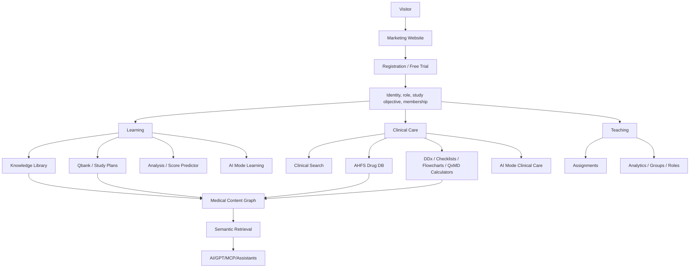
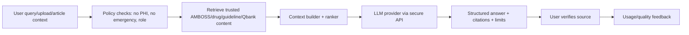
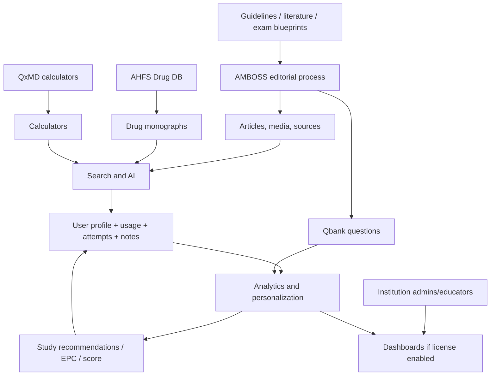
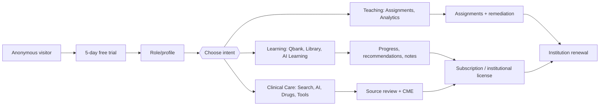
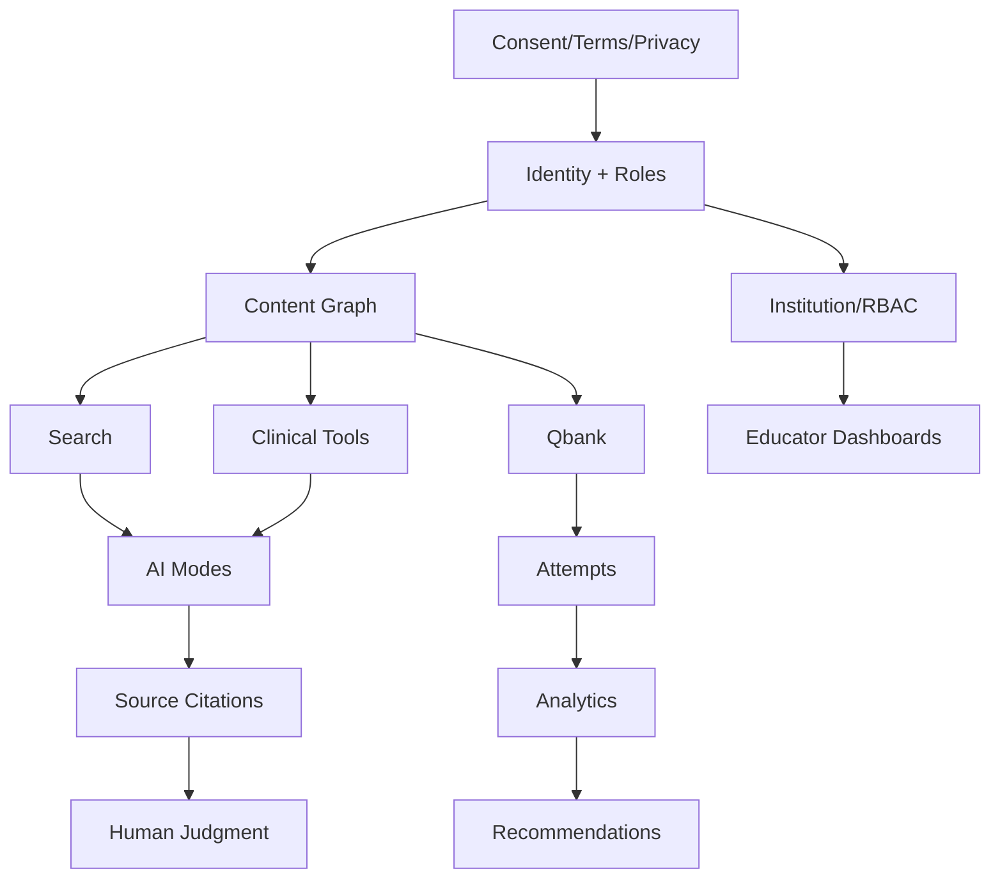

# AMBOSS Diagrams

## Product Architecture Diagram

```mermaid
flowchart TB
Visitor[Visitor] --> Marketing[Marketing Website]
Marketing --> Registration[Registration / Free Trial]
Registration --> Identity[Identity, role, study objective, membership]
Identity --> Learning[Learning]
Identity --> Clinical[Clinical Care]
Identity --> Teaching[Teaching]
Learning --> Library[Knowledge Library]
Learning --> Qbank[Qbank / Study Plans]
Learning --> Analysis[Analysis / Score Predictor]
Learning --> AILearning[AI Mode Learning]
Clinical --> Search[Clinical Search]
Clinical --> Drug[AHFS Drug DB]
Clinical --> Tools[DDx / Checklists / Flowcharts / QxMD Calculators]
Clinical --> AIClinical[AI Mode Clinical Care]
Teaching --> Assign[Assignments]
Teaching --> Dash[Analytics / Groups / Roles]
Library --> ContentGraph[Medical Content Graph]
Qbank --> ContentGraph
Drug --> ContentGraph
Tools --> ContentGraph
ContentGraph --> Retrieval[Semantic Retrieval]
Retrieval --> AI[AI/GPT/MCP/Assistants]
```

## AI Architecture Diagram

```mermaid
flowchart LR
Input[User query/upload/article context] --> Policy[Policy checks: no PHI, no emergency, role]
Policy --> Retrieval[Retrieve trusted AMBOSS/drug/guideline/Qbank content]
Retrieval --> Context[Context builder + ranker]
Context --> LLM[LLM provider via secure API]
LLM --> Output[Structured answer + citations + limits]
Output --> Verify[User verifies source]
Verify --> Feedback[Usage/quality feedback]
```

## Healthcare Data Flow Diagram

```mermaid
flowchart TD
Guidelines[Guidelines / literature / exam blueprints] --> Editorial[AMBOSS editorial process]
Editorial --> Knowledge[Articles, media, sources]
Editorial --> Questions[Qbank questions]
AHFS[AHFS Drug DB] --> Drug[Drug monographs]
QxMD[QxMD calculators] --> Calc[Calculators]
User[User profile + usage + attempts + notes] --> Analytics[Analytics and personalization]
Knowledge --> SearchAI[Search and AI]
Questions --> Analytics
Drug --> SearchAI
Calc --> SearchAI
Analytics --> Recs[Study recommendations / EPC / score]
Recs --> User
SearchAI --> User
Institution[Institution admins/educators] --> Dashboards[Dashboards if license enabled]
Analytics --> Dashboards
```

## User Journey Diagram

```mermaid
flowchart LR
Anon[Anonymous visitor] --> Trial[5-day free trial]
Trial --> Profile[Role/profile]
Profile --> Mode{{Choose intent}}
Mode --> Learn[Learning: Qbank, Library, AI Learning]
Mode --> Care[Clinical Care: Search, AI, Drugs, Tools]
Mode --> Teach[Teaching: Assignments, Analytics]
Learn --> Retain[Progress, recommendations, notes]
Care --> Verify[Source review + CME]
Teach --> Remediate[Assignments + remediation]
Retain --> Subscribe[Subscription / institutional license]
Verify --> Subscribe
Remediate --> Renew[Institution renewal]
Subscribe --> Renew
```

## Feature Dependency Graph

```mermaid
flowchart TD
Consent[Consent/Terms/Privacy] --> Identity[Identity + Roles]
Identity --> ContentGraph[Content Graph]
ContentGraph --> Search[Search]
ContentGraph --> Qbank[Qbank]
ContentGraph --> ClinicalTools[Clinical Tools]
Qbank --> Attempts[Attempts]
Attempts --> Analytics[Analytics]
Analytics --> Recommendations[Recommendations]
Search --> AI[AI Modes]
ClinicalTools --> AI
Identity --> Institution[Institution/RBAC]
Institution --> Dashboards[Educator Dashboards]
AI --> Citations[Source Citations]
Citations --> HumanJudgment[Human Judgment]
```
