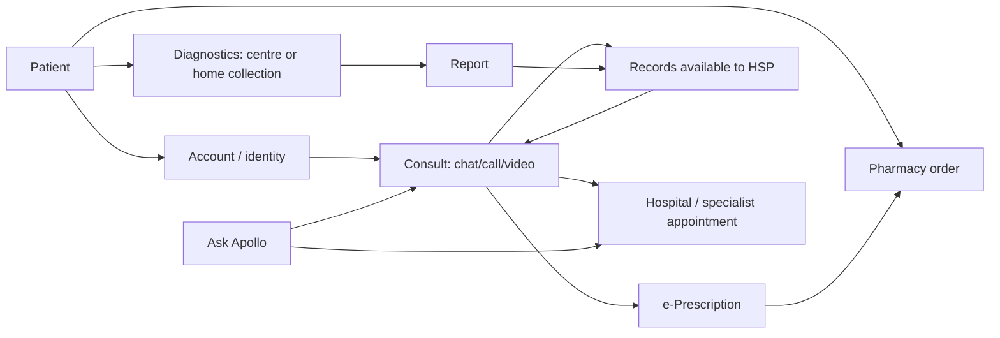
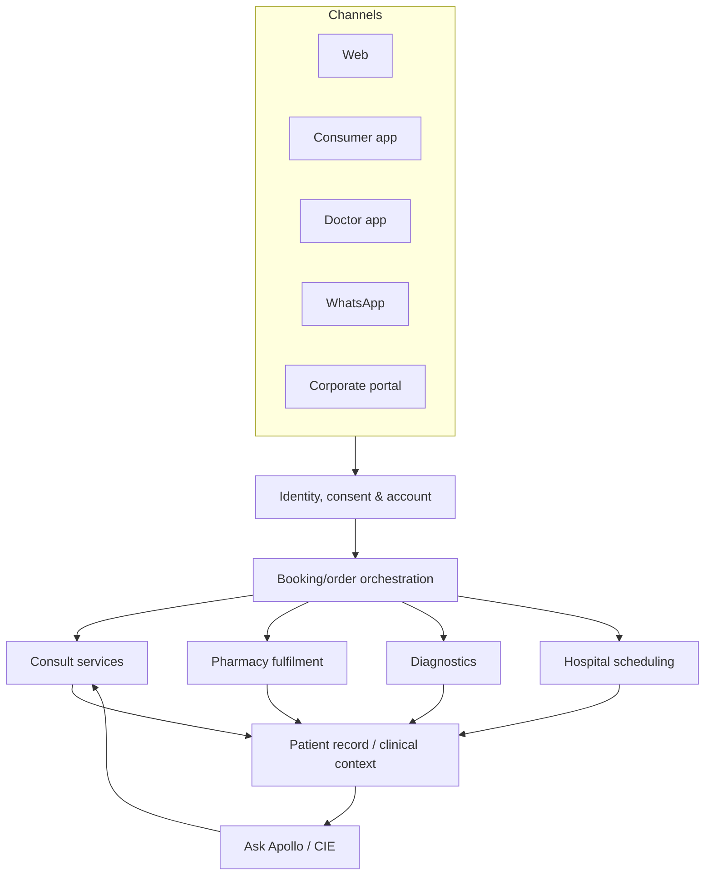
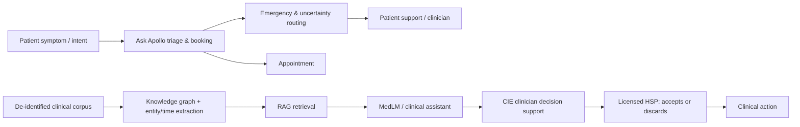
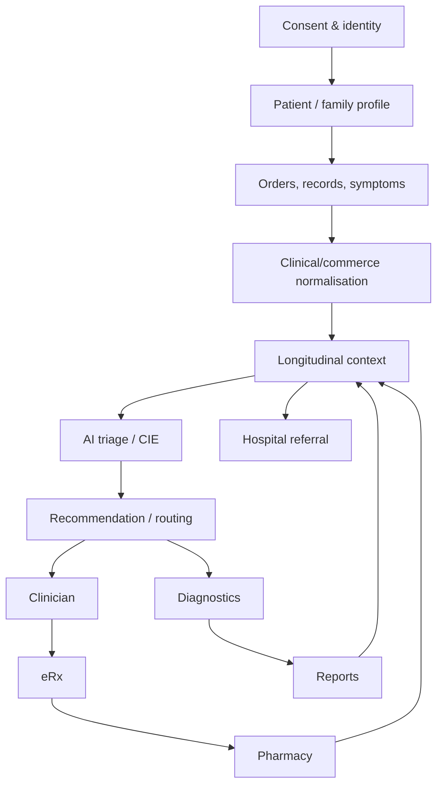
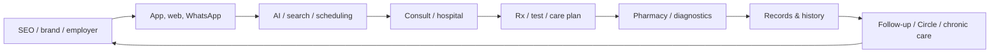

# Apollo 24|7 — Board-Level Competitive Intelligence Dossier
## Implications for Ovexis | Public-source research | 25 July 2026

> **Purpose.** This is a public-information competitive-intelligence assessment, not a company summary. It distinguishes observed facts, defensible conclusions, and hypotheses. It does not use credentials, private APIs, app-package decompilation, unauthorised testing, or data obtained behind a login/paywall.
>
> **Evidence key:** 🟢 **Confirmed** = directly supported by a cited public source. 🟡 **Strong inference** = conclusion from two or more observed facts. 🔴 **Speculation** = a testable hypothesis, not an asserted fact. “Not publicly verified” means exactly that—not that it is absent.
>
> **Important entity boundary:** Apollo 24|7 is a consumer platform/brand within Apollo HealthCo / the Apollo group, rather than a stand-alone venture-backed startup. Financial disclosures often combine online pharmacy, offline pharmacy/distribution, telehealth and digital platform activity. Do not attribute HealthCo-level economics mechanically to the app.

---

# 1. Executive decision brief

## What it is and why it wins

- 🟢 Apollo 24|7 offers online doctor consultations, pharmacy delivery, diagnostic-test booking/home collection, health records, hospital appointments, a Circle membership, corporate programmes, and an AI assistant branded **Ask Apollo**. [S1][S2][S3][S4]
- 🟢 The platform was launched in 2020; Apollo reported 5m registered users within just over six months in November 2020. [S5]
- 🟢 At FY25 close, Apollo reported ₹7,954m Q4 platform GMV (+11% YoY), digital-platform revenue of ₹2,919m in Q4, and 63k average daily cross-vertical orders excluding IP/OP referrals. [S6]
- 🟢 The core strategic asset is not an interface: it is the integrated Apollo care-delivery network, pharmacy fulfilment, diagnostics, clinician supply, hospital referrals, brand, and a patient record that can connect transactions. [S1][S6][S7]
- 🟡 Apollo is building an **omnichannel care-commerce and navigation layer**: low-acuity access and repeat pharmacy pull users in; diagnostics/records enrich context; hospital/specialist referrals monetize high-trust, high-value episodes; membership and chronic care seek repeat behaviour.

### Customer problem stack

| Problem | Apollo response | Assessment |
|---|---|---|
| 🟢 Access friction—travel, queues, specialty discovery, timing | Consult by chat/call/video; hospital booking; stated rapid access | Proven utility, subject to provider availability [S1][S3] |
| 🟢 Medicine authenticity/availability and last-mile friction | Apollo pharmacy network + online order/delivery | Powerful operational wedge [S2][S8] |
| 🟢 Fragmented tests, prescriptions, reports | Diagnostics booking and a digital vault/health records | Record capture is explicit; universal interoperability is not public [S1][S4] |
| 🟢 Uncertainty before choosing care | Symptom-led Ask Apollo; doctor access | Triage/navigation—not an emergency service [S4] |
| 🟡 Emotional problem: fear of choosing an unsafe clinician/medicine provider | Apollo hospital brand, named clinical network, “genuine” medicine positioning | Trust is a conversion mechanism, especially in a high-anxiety category |
| 🟡 Operational problem: patient handoffs destroy conversion and continuity | One branded account spans consultation → prescription → pharmacy → diagnostics → hospital | The vertical integration lowers coordination costs but can bias routing toward owned channels |

### Jobs-to-be-done

1. **“When a dependent needs a repeat medicine, get a trustworthy supply quickly without travelling.”** 🟢 Supported by pharmacy fulfilment, WhatsApp ordering, and app functionality. [S2][S8]
2. **“When symptoms are worrying but not clearly emergent, help me decide a credible next step now.”** 🟢 Ask Apollo is positioned for general recommendations and appointment booking; terms explicitly exclude emergency use. [S4]
3. **“When I need a doctor, lower the search and scheduling burden.”** 🟢 Consult and appointment workflows exist. [S3][S4]
4. **“When managing chronic disease, reduce repeated coordination across tests, medicines and follow-up.”** 🟢 Apollo publicly describes chronic-care cohorts with tests, medicines, monitoring and scheduled virtual follow-ups. [S9]
5. **“As an employer, give distributed employees a health benefit without building a clinic.”** 🟢 Corporate plans include teleconsults, diagnostics/pharmacy access and API/CSV enrolment. [S10]

### Category creation/replacement

- 🟡 **Creating:** “integrated, trusted Indian health operating layer” (care navigation + commerce + delivery + record + clinical escalation), rather than an isolated telemedicine product.
- 🟡 **Replacing:** a sequence of disjointed local pharmacy, call-centre booking, standalone lab, paper prescription/report, and hospital front-desk interactions.
- 🟡 **Not replacing:** emergency care, longitudinal primary care for every person, independent clinical judgment, or a neutral cross-provider health data exchange. The platform terms explicitly say it is not for emergencies and that AHL does not itself provide clinical/diagnostic services. [S4]

### Core philosophy (decision-relevant)

- 🟢 Apollo’s published positioning is to remove mobility barriers and make care accessible through one platform. [S1]
- 🟡 The operating philosophy appears **“use digital to orchestrate a physical healthcare franchise”**, not “disintermediate healthcare with software.” The evidence is the simultaneous investment in supply-chain integration, retail pharmacies, Apollo clinicians/hospitals, diagnostic collection, and digital platform. [S1][S6][S11]

### Board conclusion

🟡 Ovexis should **not** attempt to out-Apollo Apollo on Indian urgent medicine fulfilment, hospital-brand trust, or owned-network supply density. It should own the missing neutral layer: a portable, provenance-aware longitudinal record, patient-controlled data-sharing, cross-provider care-plan intelligence, and transparent AI explanations. Apollo’s apparent strength—vertical integration—creates a credible neutrality and portability opening.

---

# 2. Company intelligence

## Timeline, ownership, capital and leadership

| Date | Event | Label / evidence |
|---|---|---|
| 1983 | Apollo Hospitals was established by Dr Prathap C. Reddy. | 🟢 [S1] |
| Feb 2020 | Apollo 24|7 inception reported. | 🟢 [S12] |
| Nov 2020 | Apollo reported 5m registered users and 2,500+ daily teleconsults. | 🟢 [S5] |
| Feb 2023 | Apollo’s Clinical Intelligence Engine (CIE) was publicly described as a physician-assist tool. | 🟢 [S13] |
| Jan 2024 | Google Cloud described Apollo 24|7’s MedLM + RAG work for CIE. | 🟢 [S14] |
| Apr 2024 | Advent agreed to invest ₹2,475 crore for 12.1% of the combined entity; disclosed enterprise values: Apollo 24|7 ₹14,478 crore and Keimed ₹8,003 crore. | 🟢 [S11] |
| Jan 2024 (reported) | Antony Jacob stepped down as CEO; Madhivanan Balakrishnan succeeded him. | 🟢 Third-party report; verify against corporate filing before legal reliance [S12] |
| Jul 2025 | Board-approved restructuring: demerge HealthCo/digital and merge Keimed into a new listed entity, planned in 18–21 months. | 🟢 [S15] |
| Sep 2025 | Apollo stated CCI approval of restructuring in its Q2 FY26 release. | 🟢 [S16] |
| May 2026 | FY26 release reported digital GMV ₹2,037 crore and Q4 GMV ₹528 crore, +20% YoY. | 🟢 [S17] |

- 🟢 Apollo Healthco Limited’s registered-office identity/CIN appears on the platform contact page: U85110TN2020PLC135839. [S18]
- 🟢 Apollo stated planned FY27 revenue run-rate of ₹25,000 crore and ~7% EBITDA margin for the combined pharmacy/digital business; this is management target, **not** actual performance. [S15]
- 🟢 Apollo 24|7 has publicly named no acquisition by the platform in the sources reviewed. This is an absence-of-public-evidence finding, not proof of none.
- 🟢 No Apollo 24|7-specific patents, peer-reviewed clinical-validation publications, public developer programme, or open-source repository were confirmed in this research pass.

## Strategic partnerships and expansion

- 🟢 Google Cloud publicly names its partnership with Apollo 24|7 for MedLM/RAG and describes the CIE knowledge graph/entity extraction work. [S14]
- 🟢 Apollo has a corporate offering with API-based HRMS/payroll integration or secure CSV uploads. [S10]
- 🟢 Apollo announced a Centre for Digital Health and Precision Medicine with the University of Leicester in FY25 results. This is Apollo Group-level and should not be treated as a 24|7 product integration. [S6]
- 🟢 The platform claims reach across 19,000+ pincodes in later public materials; claims vary by date and source. Treat coverage/clinician/store figures as time-stamped marketing metrics, not stable facts. [S9][S15]

## Hiring signal

- 🟢 Current public careers listings include Clinical Product Manager—Symptom Checker, Principal Engineer, React Native roles, QA automation/manual, technical programme/project support and support engineering. [S19]
- 🟡 This signals active investment in symptom/triage product, mobile client quality, enterprise-scale delivery, test automation, and operational support—not merely a marketplace frontend.
- 🔴 The public jobs page does not disclose team size, cloud architecture, model-development headcount, or roadmap sequencing; estimating them precisely would be fabrication.

---

# 3. Founder/leadership psychology — constrained inference

**Method note:** Apollo 24|7 is a corporate venture/product inside a multi-generation healthcare group. “Founder psychology” cannot validly be reduced to one startup founder. The following is an organisational-strategy inference, not a diagnosis of individuals.

- 🟢 Dr Prathap C. Reddy founded Apollo Hospitals; public platform copy links 24|7 to his vision of removing mobility barriers. [S1]
- 🟢 Apollo’s leadership pursued a supply-chain merger/demerger designed to combine digital health, retail pharmacy, wholesale distribution and telehealth. [S11][S15]
- 🟡 **Belief:** trust, clinical quality and physical reach are strategic assets that can be digitised, rather than liabilities to be bypassed.
- 🟡 **Decision framework:** prefer adjacency expansion where each new surface increases traffic or conversion to another owned surface (consult → prescription → pharmacy; test → consult; digital → hospital).
- 🟡 **Risk tolerance:** high capital and organisational-complexity tolerance, evidenced by multi-year cash investment, PE funding, merger and separate-listing plan. [S11][S12][S15]
- 🟡 **10-year aspiration:** an independent, India-scale consumer-health infrastructure company, while retaining referral/brand connection to Apollo Hospitals.
- 🔴 **Potential blind spot:** a vertically integrated system may underinvest in patient-controlled portability or neutral recommendations where these reduce owned-channel conversion. This is a strategic risk to test, not a claim of intent.

---

# 4. Product reverse engineering: observed surface and bounded inferences

## Verified capability inventory

| Surface | Observed capability | Evidence / status |
|---|---|---|
| Consumer web/app | Account creation; personal details required | 🟢 [S4] |
| Consultation | Search/select or allocated HSP; chat/audio/video; booking, confirmation, reschedule/cancel; e-prescription; possible follow-up | 🟢 [S4] |
| Hospital | Hospital/doctor discovery and appointment booking | 🟢 [S3] |
| Pharmacy | Search OTC/FMCG, add cart, checkout; prescription medicine fulfilment; pharmacist interaction advertised | 🟢 [S8] |
| Diagnostics | Test/package booking, centre visit or home pickup, reports | 🟢 [S4] |
| Record | Access records; upload medical history/digital vault | 🟢 [S1][S4] |
| AI | Ask Apollo gives general health recommendations and can assist appointment booking based on symptoms/conditions/treatment sought | 🟢 [S4] |
| Membership | Circle offers priority doctor access, offers/cashback, delivery and consultation/diagnostic benefits | 🟢 [S20] |
| Support | in-product instant chat, email, escalation/grievance process | 🟢 [S18] |
| Alternate channel | WhatsApp ordering for pharmacy and diagnostics is publicly described | 🟢 [S2] |
| Provider | Separate Apollo Doctor app: appointments, virtual/in-clinic consults, digital records, notes, e-prescriptions; app listing mentions PIN-based 2FA and medication-interaction feature “Hi-par” | 🟢 [S21][S22] |
| Employer | Family Doctor Plan, consults, diagnostics/pharmacy, webinars; API or CSV enrolment | 🟢 [S10] |

## End-to-end consumer journeys

### A. Anonymous visitor → consult
1. 🟢 Landing/search content presents consultation, pharmacy, labs and health information. [S3]
2. 🟢 User creates/registers an account, providing details such as name, phone, email, DOB and gender. [S4]
3. 🟢 User selects a healthcare service professional or may be allocated one; chooses online consult slot/modality and pays. [S4]
4. 🟢 Confirmation is delivered on platform and/or SMS/email/messaging. [S4]
5. 🟢 Consultation takes place via chat/audio/video; uploaded records may be viewed by HSP. [S4]
6. 🟢 e-prescription is delivered on platform following consultation. [S4]
7. 🟡 Likely conversion handoff: prescription is a natural pharmacy conversion point, but an automatic in-flow cart cannot be verified from public sources.
8. 🟢 Free follow-up may be offered at clinician discretion; health-query page says text follow-up can be valid seven days. [S4][S23]

### B. Pharmacy journey
1. 🟢 User searches product/medicine, adds to cart, and proceeds to payment; prescription handling is necessary for prescription products under terms/product rules. [S8]
2. 🟢 Delivery promise varies by place/service; sources advertise 19-minute service in select cities and broader delivery via network. Treat ETA as conditional. [S8][S24]
3. 🟢 Support exists for order/payment/refund issues. [S18]
4. 🟡 Retention loop: repeat order/reorder, credits/discounts, membership, and condition management are designed to increase frequency.

### C. Diagnostics journey
1. 🟢 User chooses test/package, books online, selects centre or home collection. [S3][S4]
2. 🟢 Qualified phlebotomist home visit and report download are advertised. [S3]
3. 🟡 Retention loop: reports become reusable clinical context and prompt follow-up care; the mechanism is directionally supported but specific notification rules are unverified.

### D. AI-to-care escalation journey
1. 🟢 Ask Apollo accepts symptom/condition/treatment intent for general recommendations and appointment assistance. [S4]
2. 🟢 Its terms prohibit emergency/psychiatric emergency use and direct emergencies to 112/ED. [S4]
3. 🟢 Uncertain outcomes, scheduling changes, incomplete booking and other cases may route to patient support. [S4]
4. 🟢 Provider-facing AI is explicitly assistive; HSP may use or discard recommendations. [S4]

### E. Unverified surfaces (do not assume)

- 🔴 Exact screen inventory, button labels, notification triggers, feature flags, data-retention configuration, family profile relationships, coupon decisioning, and permission matrices require current authenticated product observation. They are **not** established by this dossier.
- 🟢 A compliant next step is a manually documented, consented test account journey with screenshots and no interference; do not intercept APIs or bypass controls.

## Conversion, retention and growth loops

- 🟡 **Commerce loop:** urgent need → trusted supply/discount → order history/reorder → repeat purchase → membership/credits → higher frequency.
- 🟡 **Clinical loop:** symptom/test → consult → prescription → pharmacy/diagnostic → record → easier next consult.
- 🟡 **Referral loop:** digital triage/consult → Apollo specialist/hospital appointment → brand/outcome trust → future platform entry.
- 🟡 **Employer loop:** employer enrolment → low-friction teleconsults → claims/absenteeism narrative → renewal/benefit expansion. Corporate data sharing scope is not public.

---

# 5. UX and service-design assessment

- 🟢 Official product copy foregrounds a unified service menu and speed/trust claims. [S1][S3]
- 🟡 The information architecture is likely intentionally task-led (consult, medicines, labs, records) rather than diagnosis-led, because immediate transactional intents are legible, monetisable and operationally routable.
- 🟡 The main UX advantage is **choice compression**: a recognisable brand avoids asking a sick user to judge a lab, pharmacy, specialist and delivery provider independently.
- 🟡 Primary friction risks: multi-step registration, prescription validation, availability/ETA variance, non-emergency clinical disclaimers, consultation timing variance, and switching between care contexts.
- 🟢 Terms allow appointment rescheduling/cancellation within stated cutoffs and acknowledge delays/cancellation due to technical/logistical circumstances. [S4]
- 🟢 A third-party historical 2021 review said no dark mode; this is stale and must not be treated as current-product fact. [S25]
- 🔴 Typography, precise spacing, responsive breakpoints, animation library, WCAG conformance, loading states, and current dark-mode availability cannot be responsibly asserted without dated visual inspection.

**Ovexis design counter-position:** 🟡 Make “why this recommendation?” and “what changed since last time?” the home-screen primitives. Apollo optimises access/transactions; Ovexis should optimise comprehension, continuity and informed patient agency.

---

# 6. Healthcare workflow and data architecture

## Observed workflow map

- 🟢 This map is limited to declared services and record use; it does **not** claim system-level real-time integration between every node. [S4]

## Interoperability/data boundaries

- 🟢 The platform says users can access medical records and upload history; HSPs may view records shared in consultation. [S1][S4]
- 🟢 Privacy policy states collection/use of identity/contact, health-related service information, search/appointment history, financial information other than specified payment details, browsing/device/IP information, and additional information users provide. [S26]
- 🟢 The corporate page claims API-based integration or secure CSV uploads for enrolment/payroll/reporting. [S10]
- 🟢 Google Cloud describes a Clinical Knowledge Graph, clinical entity extractor, timestamp relationship extractor, and de-identified clinical discharge-note knowledge base for CIE. [S14]
- 🔴 No public source reviewed confirms patient-facing FHIR APIs, HL7 interfaces, CDA/CCD support, ABHA/ABDM integration, Apple Health/Health Connect integration, DICOM ingestion, genomics ingestion, external payer claims ingestion, a master-patient-index algorithm, or an external developer API. **Do not assume any.**

### Inferred logical architecture (not implementation disclosure)

- 🟡 The architecture follows directly from observed channels/services; individual services, boundaries, vendors and message buses are unknown.

## Consent and identity concerns

- 🟢 Users consent to terms/privacy by access/use; records may be viewed by HSP during consultation. [S4][S26]
- 🟡 A single consumer identity across commerce and clinical data can create powerful personalisation—but also raises purpose-limitation, segmentation and sensitive-data governance stakes.
- 🔴 Granular consent receipt, revocation workflow, delegated/family access controls, data-export portability, and provenance/versioning are unverified publicly. These are high-priority due-diligence questions.

---

# 7. AI reverse engineering

## Confirmed architecture components

- 🟢 CIE is described by Apollo as an AI-based clinical decision support tool for healthcare experts. [S27]
- 🟢 Google Cloud states Apollo used MedLM with RAG over a preprocessed, de-identified clinical knowledge base built from CIE discharge notes, plus a clinical knowledge graph, clinical entity extractor and timestamp relationship extractor. [S14]
- 🟢 Apollo’s terms say Ask Apollo provides general health recommendations and appointment assistance; its provider-facing tools may offer diagnostic assistance, data analysis and treatment recommendations, which licensed HSPs control/use/discard. [S4]
- 🟢 The 2023 public description said CIE covered 1,200+ diseases and 800 symptoms at that time, based on de-identified/local data; treat this as historical and not a current performance metric. [S13]
- 🟢 A 2025 interview reports secure cloud across Google Cloud, Microsoft and Azure and medical-officer/ethics-committee review. This is a reported interview claim, not independently audited assurance. [S9]

## Bounded system model

- 🟡 “RAG + structured clinical extraction + clinician-in-loop” is the most defensible public reconstruction.
- 🔴 Model version, prompts, token/context limits, vector store, evaluation set, calibration method, hallucination metrics, retriever quality, red-team programme, latency stack, model routing, and patient-specific memory design are not public. Naming an LLM beyond MedLM would be unsupported.

## AI risk assessment

| Risk | Evidence | Ovexis lesson |
|---|---|---|
| Emergency misuse | 🟢 Terms prohibit emergency use and route to 112/ED [S4] | Hard-stop red flags, not a disclaimer alone |
| Automation bias | 🟢 HSP controls use/discard [S4] | Require source/evidence display and clinician acknowledgement |
| Context omission | 🟡 Digital history may be incomplete/nonportable | State missing-data confidence and request corroboration |
| Dataset bias/drift | 🟡 Local clinical data can improve relevance yet encode site/population bias | Monitor by language, region, sex, age, socioeconomic proxies |
| Privacy re-identification | 🟡 De-identification reduces but does not erase risk | Use separation, minimisation, audit and re-identification controls |

---

# 8. Technical/API/security investigation

## What public evidence establishes

- 🟢 Consumer platform offers web and mobile application access; doctor app is separately listed. [S3][S21]
- 🟢 Careers list React Native roles and backend/full-stack skills including Python, Node.js and Java in a third-party job listing; the former is a current hiring signal, the latter is an older/third-party listing. [S19][S28]
- 🟢 Provider iOS release notes mention PIN-based two-factor authentication. [S22]
- 🟢 Privacy policy names compliance intent under India’s IT Act 2000 and SPDI Rules (as amended). [S26]
- 🟢 The App Store privacy label says data may be linked to identity including health & fitness, location, contact information, user content, identifiers, usage data and diagnostics; Apple notes developer disclosure is not verified. [S24]

## What cannot be confirmed

- 🔴 No verified public evidence in this pass for the precise frontend framework on web, backend language/service topology, cloud account layout, API style (REST/GraphQL), API gateway, auth protocol, databases, cache, queues, observability vendors, CDN/WAF, CI/CD, feature-flag vendor, payment gateway, SMS/email/WhatsApp vendor, encryption key management, penetration tests, SOC 2, ISO 27001, HIPAA, GDPR DPA/BAA, audit-log immutability, or bug-bounty programme.
- 🟢 Absence from this report is not a security finding. It is an evidence-boundary finding.

## Security posture: board assessment

| Control area | Publicly confirmed | Gap / diligence ask |
|---|---|---|
| Legal notice/privacy | 🟢 IT Act/SPDI policy; grievance channels [S18][S26] | Obtain current DPDP Act implementation mapping and retention schedule |
| Provider authentication | 🟢 PIN-based 2FA mentioned [S22] | Ask for MFA coverage, session controls, device policy, break-glass logs |
| Sensitive data categories | 🟢 Broad collection disclosed [S26] | Map purpose, sharing, retention, deletion/export and consent by field |
| Clinical AI governance | 🟢 Human HSP control described; reported ethics review [S4][S9] | Obtain clinical safety case, incident process, model-change control, evaluation |
| Assurance | 🔴 No SOC2/HIPAA/ISO certification confirmed | Do not infer certifications from brand scale |

**Threat model priorities (🟡):** account takeover/OTP abuse; misdirected family records; prescription fraud; pharmacy-order fraud; clinician impersonation; insecure record links; third-party SDK overcollection; prompt injection into RAG; inference/re-identification; support-agent social engineering; supply-chain/last-mile leakage; and availability failure during urgent care.

---

# 9. Business model, distribution and economics

## Revenue architecture

- 🟢 Platform monetisation surfaces include consultations, pharmacy, diagnostics, Circle membership and corporate programmes. [S1][S10][S20]
- 🟢 FY25 Q4 digital platform revenue was ₹2,919m; Apollo HealthCo total Q4 revenue ₹23,763m, including ₹20,844m offline pharmacy distribution. [S6]
- 🟢 FY26 Q4 release reported HealthCo revenue ₹2,848 crore, offline pharmacy distribution ₹2,518 crore, digital platform ₹330 crore, and Apollo 24|7 GMV ₹528 crore. [S17]
- 🟡 Digital platform economics should be separated from wholesale/offline pharmacy economics. GMV is not revenue; revenue is not contribution profit; HealthCo profitability is not proof that each digital vertical is profitable.
- 🟢 Reuters reported Apollo expected 24/7 EBITDA break-even by FY26 end (February 2025 report). This was forward guidance, not a verified outcome in that article. [S29]

## Unit-economics logic

- 🟡 Pharmacy has frequent repeat potential but low commodity margins and delivery/discount costs.
- 🟡 Consultations can improve acquisition and clinical conversion but carry provider-supply, quality, cancellation and trust costs.
- 🟡 Diagnostics adds basket and data depth but involves collection/logistics/quality economics.
- 🟡 Hospital referrals have disproportionate lifetime value but must be governed against conflicts of interest.
- 🟡 Circle is a loyalty/subsidy architecture: modest subscription price can buy frequency, data continuity and lower effective CAC if benefits are funded by margin and partner economics.

## Distribution moat

- 🟢 Apollo publicly cites thousands of pharmacy outlets; count varies by date/source (e.g., 6,360 Q3 FY25 vs “7,500+” medicines page). [S8][S12]
- 🟢 The 2025 demerger plan explicitly seeks to unite online/offline pharmacy, Keimed distribution, telehealth and 24|7. [S15]
- 🟡 This materially lowers fulfilment density and availability risk relative to app-only challengers, although online experience can still fail on individual orders.

## Customer voice (qualitative, nonrepresentative)

- 🟢 App aggregator reviews praise convenience across appointments/labs/pharmacy and rapid delivery; the source is third-party and its statistics should not be treated as audited. [S30]
- 🟢 Reddit posts describe delayed/cancelled medicine orders, poor status communication, fee escalation, short/distracted consultations and weak resolution. These are individual anecdotes, not prevalence estimates. [S31][S32]
- 🟡 The central product tension is **promise precision versus operational variability**. In healthcare, an ETA or clinical appointment miss harms trust more than in ordinary commerce.

---

# 10. Competitive landscape and moat

## Competitor map

| Cluster | Examples requested | Apollo relative position |
|---|---|---|
| Indian integrated care/pharmacy | Practo, Tata 1mg, Healthify, PharmEasy | 🟡 Apollo’s differentiated combination is hospital brand + owned/affiliated clinical supply + physical pharmacy/distribution; competitors vary by strength |
| Preventive/biomarker membership | Function Health, Superpower, Levels, PreventiveHealth.ai | 🟡 Apollo is broader transactional care; weaker public evidence of a consumer-grade longitudinal biomarker-intelligence product |
| Clinical evidence/CDS | OpenEvidence, Glass Health, AMBOSS, UpToDate, Atropos | 🟡 Apollo has CIE and local clinical context, but these firms focus more narrowly on clinician knowledge/evidence/research workflows |
| Data / interoperability | Regacore, Human API, Apple Health, Google Health | 🟡 Apollo owns transactional data pathways; public proof of neutral external ingestion/export is limited |
| Wearables/behaviour | Whoop, Oura, Ultrahuman | 🟡 Apollo has access to care and clinical follow-through; public wearable integration evidence was not found |

## Moat scorecard

| Moat | Current | Why | Vulnerability |
|---|---|---|---|
| Brand/clinical trust | **Strong** 🟡 | Apollo hospital heritage + clinician network [S1] | Service failure at point of need erodes it |
| Offline fulfilment/distribution | **Strong** 🟢/🟡 | Retail network + Keimed integration plan [S8][S15] | Low-margin, operationally complex; quick commerce pressure |
| Data | **Medium / future** 🟡 | Multi-transaction record and clinical corpus | Fragmented outside-Apollo data; consent/quality; portability gap |
| AI | **Medium** 🟡 | CIE, RAG, clinical knowledge graph, clinician loop [S14] | Foundation models commoditise; validation and workflow fit decide value |
| Marketplace/network | **Medium** 🟡 | Patients + clinicians + pharmacies + hospitals | Supply quality and marketplace liquidity can vary geographically |
| Regulatory | **Medium** 🟡 | Incumbent clinical operations and governance experience | India’s evolving health-data/AI regime; compliance burden is not exclusive |
| Switching costs | **Medium** 🟡 | Records, orders, membership, care familiarity | Consumer data portability and price comparison reduce lock-in |
| Developer | **Weak** 🟢 | No public developer API/platform confirmed | Opportunity for Ovexis |

## SWOT

| Strengths | Weaknesses |
|---|---|
| 🟡 Integrated care + pharmacy + diagnostics + hospital ecosystem; brand; supply density; growing scale; clinical AI investment | 🟡 Complex entity/economic structure; platform-neutrality tension; potential fulfilment/consult quality variance; unproven public interoperability/developer layer |
| Opportunities | Threats |
| 🟡 Chronic care, employer benefits, insurance navigation, precision medicine, AI-assisted care coordination | 🟡 Price-led e-pharmacy/quick-commerce, regulatory scrutiny, clinical safety events, data trust failures, provider quality variability |

## Porter’s Five Forces

- 🟡 **Supplier power—medium/high:** clinicians, labs, pharmacies and logistics all matter; owned ecosystem moderates but does not eliminate it.
- 🟡 **Buyer power—high:** consumers can compare price/ETA and switch; health trust tempers pure price sensitivity.
- 🟡 **New entrants—medium:** software entry is easy; nationwide fulfilment, trust and clinical governance are hard.
- 🟡 **Substitutes—high:** local pharmacy, direct hospital, lab chain, insurer, quick-commerce, generic AI, and competing apps.
- 🟡 **Rivalry—high:** Indian health/pharmacy is crowded, promotional and service-sensitive.

---

# 11. Failure analysis and risk register

| Risk | Type | Leading indicator | Mitigation / competitive implication |
|---|---|---|---|
| Missed urgent order/ETA | Operational | ETA revisions, cancellations, support contacts | 🟡 Inventory truth + proactive alternatives matter more than headline speed |
| Variable consult quality | Clinical/service | low ratings, repeat complaints, no-shows | 🟡 Quality scoring, protected consult time, escalation and refund automation |
| AI unsafe triage | Clinical/regulatory | overrides, adverse-event reports, emergency false negatives | 🟡 risk-tiered workflows, red flags, clinician review, audit trail |
| Sensitive-data misuse/breach | Security/trust | SDK drift, access anomalies, complaints | 🟡 data minimisation, purpose ledger, patient audit log |
| Margin compression | Economic | rising discounts/delivery cost; GMV/revenue divergence | 🟡 build high-retention care programmes—not coupon addiction |
| Channel conflict | Strategic | provider pushback, hospital/referral allegations | 🟡 disclose incentives and preserve patient choice |
| Reorg distraction | Organisational | migration delays, leadership churn | 🟡 competitor should move during platform/brand transitions |
| Overclaiming AI | Trust/regulatory | complaints, regulator attention, clinician scepticism | 🟡 claim clinical support, show uncertainty/sources, measure outcomes |

---

# 12. Decision ledger: why key features exist

| Feature | Why built / pain | KPI likely improved | Trade-off / alternate |
|---|---|---|---|
| Teleconsult | 🟡 Access and triage at low travel cost | first consult conversion, supply utilisation | quality/time pressure; could use asynchronous-first model |
| E-prescription + pharmacy | 🟡 closes care-to-fulfilment gap | prescription conversion, repeat GMV | conflict/choice concerns; could link neutral pharmacies |
| Diagnostics booking | 🟡 reduces testing coordination | attach rate, clinical data depth | collection scheduling/quality complexity |
| Digital vault/records | 🟡 reduces missing context and return friction | retention, consult quality | sensitive-data liability; could be standards-based portable record |
| Ask Apollo | 🟡 reduces symptom-to-care decision friction | top-of-funnel activation, booking | safety/hallucination; rules + clinician triage alternative |
| CIE | 🟡 compresses clinician information work | clinician productivity/consistency | automation bias; evidence-first CDS alternative |
| Circle | 🟡 makes repeat care/commerce habitual | frequency, retention, CAC payback | benefit-cost and price complexity |
| WhatsApp ordering | 🟡 serves low-app-literacy/senior users | order conversion | conversational support and consent complexity |
| Corporate API/CSV | 🟡 lowers employer onboarding friction | B2B sales/renewal | employee-data governance burden |

---

# 13. Feature dependency graph and roadmap reconstruction

### Reconstructed evolution

- 🟢 **MVP (by 2020):** teleconsult and initial digital health access at scale; early proof of 5m users/2,500+ daily consults. [S5]
- 🟡 **V2:** pharmacy, diagnostics, records and broad omnichannel funnel deepened around the core.
- 🟢 **V3:** CIE became public in 2023; MedLM/RAG work described in 2024. [S13][S14]
- 🟢 **Current (2025–26):** profitability discipline, rapid delivery in select cities, corporate offerings, AI assistant, supply-chain/structural integration. [S4][S10][S15][S17]
- 🟡 **Likely next:** economics/retention optimisation, insurance and chronic-care attachment, operational integration, clinical AI embedded in provider workflow—not speculative “general AGI doctor.”

---

# 14. Competitive attack plan — ethical, lawful

## How Ovexis can be categorically better

1. 🟡 **Neutral longitudinal record, not a captive funnel.** Ingest patient-authorised data from any provider/lab/device; show source, date, author, provenance and conflicts.
2. 🟡 **Explainable care intelligence.** Every insight: evidence cited, confidence, missing context, contraindications, urgency level and “questions for your doctor.”
3. 🟡 **Care-plan execution layer.** Convert a doctor plan into tasks, reminders, lab trend monitoring, medication reconciliation and follow-up preparation—without steering pharmacy choice.
4. 🟡 **Portable patient consent control.** Permission dashboard: recipient, fields, purpose, expiry, revocation, download/export and access history.
5. 🟡 **Trusted referral marketplace.** Rank clinicians/providers using transparent patient needs, availability, quality and cost—not opaque owned-network yield.
6. 🟡 **Provider co-pilot that writes less, reasons visibly and never silently orders.** Human sign-off and source tracing.
7. 🟡 **Start with high-value chronic-care cohorts** (diabetes, CKD, cardiometabolic disease, oncology survivorship) rather than generic symptom chat.

## Top ideas to copy / improve / ignore / reinvent

### Copy (selectively)
1. 🟡 One-account cross-service experience
2. 🟡 Clear task-led entry points
3. 🟡 Human escalation on uncertain AI outcome
4. 🟡 Provider-facing companion app/workflow
5. 🟡 Care-to-test-to-follow-up loops
6. 🟡 Corporate distribution channel
7. 🟡 Low-literacy conversational channel
8. 🟡 Membership for continuity
9. 🟡 Safety emergency exclusion
10. 🟡 Clinical + engineering co-development

### Improve
1. 🟡 Provenance-first record
2. 🟡 Consent receipts and audit history
3. 🟡 Transparent referral conflicts
4. 🟡 Reliability-first fulfilment alternatives
5. 🟡 Explicit AI uncertainty
6. 🟡 Multilingual clinical comprehension
7. 🟡 Medication reconciliation across providers
8. 🟡 Lab-trend explanation and anomaly escalation
9. 🟡 caregiver/delegated access controls
10. 🟡 objective provider-quality loop

### Ignore
1. 🟡 Subsidy-led “fastest” claims before supply reliability
2. 🟡 Generic medical chatbot as product centre
3. 🟡 captive-commerce steering as a substitute for care coordination
4. 🟡 unmeasured AI novelty claims
5. 🟡 closed data silo as the moat
6. 🟡 feature sprawl prior to high-trust core
7. 🟡 vanity registered-user metrics
8. 🟡 opaque bundled pricing
9. 🟡 any attempt to displace emergency care
10. 🟡 unsupported compliance badges

### Reinvent (blue-ocean candidates)
1. 🟡 Patient-owned longitudinal health ledger
2. 🟡 “clinical change detection” across heterogeneous records
3. 🟡 pre-visit intelligence brief for patient and clinician
4. 🟡 evidence-linked, patient-specific medication safety layer
5. 🟡 consented family-care command centre
6. 🟡 neutral care-plan marketplace
7. 🟡 post-discharge continuity protocol
8. 🟡 outcome-verified preventive-care subscription
9. 🟡 clinician-to-clinician referral handoff packet
10. 🟡 payer/employer privacy-preserving population insights

## Recommended Ovexis MVP

- 🟡 **User:** adults managing cardiometabolic/chronic care and their caregivers, beginning in one clinical/enterprise partner network.
- 🟡 **Wedge:** upload/import records + lab timeline + medication list + AI-generated, source-linked “what changed / what to do / what to ask next.”
- 🟡 **Non-negotiables:** clinical safety taxonomy; emergency red flags; human escalation; provenance; patient consent; no autonomous diagnosis/prescribing; audit logs.
- 🟡 **GTM:** B2B2C via progressive hospitals, employer chronic-care programmes and specialist practices; sell time saved and missed-follow-up reduction before consumer subscription.
- 🟡 **Pricing:** employer/provider PMPM for active cohorts plus premium household subscription; avoid a transaction-tax business model initially.
- 🟡 **Architecture:** standards-first canonical model (FHIR-aligned internally), source-document store, entity resolution with human correction, retrieval with citations, task/workflow engine, consent policy service, clinician review queue, immutable audit events.

## 12/36/60-month prediction for Apollo (clearly speculative)

- 🔴 **12 months:** focus on structural/listing milestones, supply-chain integration, digital break-even discipline, and higher-margin/repeat cohorts.
- 🔴 **3 years:** broaden insurance/corporate/chronic-care attachment and embed CIE deeper in Apollo workflow; potentially consolidate consumer-health brands/operations.
- 🔴 **5 years:** likely resembles a listed omnichannel health-and-pharmacy infrastructure firm. Its key strategic question will be whether it becomes a neutral health platform or remains primarily a high-performing Apollo distribution engine.

---

# 15. Business Model Canvas and value chain

## Business Model Canvas (Apollo)

| Block | Assessment |
|---|---|
| Customers | 🟢 Consumers/patients, families/caregivers, clinicians, employers; indirectly Apollo hospitals/pharmacies/diagnostics [S1][S10] |
| Value proposition | 🟢 Convenient access to consults, medicines, tests and records under Apollo trust [S1] |
| Channels | 🟢 Web/app, provider app, WhatsApp, corporate portal/helpline [S2][S10][S21] |
| Relationships | 🟢 Membership, support, follow-up and records; 🟡 repeat transaction loop |
| Revenues | 🟢 Consult/pharmacy/diagnostics/membership/corporate; financial reporting aggregates some lines [S6][S20] |
| Key resources | 🟡 brand, clinical network, pharmacy/delivery/distribution, diagnostics, data, software |
| Key activities | 🟡 care routing, booking, fulfilment, clinical workflow, support, data/AI governance |
| Partners | 🟢 Google Cloud; HSPs; diagnostics; corporate clients [S10][S14] |
| Costs | 🟡 clinician, delivery, discounts, tech/cloud, support, acquisition, compliance, operations |

## Value chain

---

# 16. Evidence register and source list

## Evidence register rules

- Screenshot field: **Not captured** unless separately attached. Web search text is not a screenshot.
- Observation: cited text directly supports the statement. Inference: analytical conclusion derived from observations. 
- Confidence is about this report’s claim, not product quality.

| ID | Source | Claim(s) supported | Type | Confidence | Screenshot |
|---|---|---|---|---|---|
| S1 | Apollo About Us | services, mission, Apollo relationship, doctor/pharmacy claims | Observation | High | Not captured |
| S2 | Apollo WhatsApp ordering blog | WhatsApp pharmacy/diagnostics ordering | Observation | Medium (date unclear) | Not captured |
| S3 | Apollo homepage | consumer service surfaces | Observation | High | Not captured |
| S4 | Apollo Terms | account, consult, records, diagnostics, AI, safety, support workflows | Observation | High | Not captured |
| S5 | Apollo Q2 FY21 transcript | 2020 launch-scale metrics | Observation | High | Not captured |
| S6 | Apollo Q4 FY25 results | GMV/revenue/order metrics and precision centre announcement | Observation | High | Not captured |
| S7 | Apollo medicines page | pharmacy network/workflows | Observation | Medium—marketing copy changes | Not captured |
| S8 | Apollo medicines page | ordering, delivery/network claims | Observation | Medium | Not captured |
| S9 | BW Healthcare interview | chronic care, cloud/AI governance claims | Observation/report | Medium | Not captured |
| S10 | Apollo corporate partnerships | B2B offering/API/CSV claim | Observation | Medium | Not captured |
| S11 | The Hindu / Mint Advent deal | funding, EV, ownership/restructuring | Observation | High | Not captured |
| S12 | YourStory FY25 Q3 report | CEO change/reporting metrics | Third-party observation | Medium | Not captured |
| S13 | The Hindu CIE article | CIE historical description and data claims | Observation | High | Not captured |
| S14 | Google Cloud blog | MedLM/RAG, graph/entity/time extraction | Partner technical disclosure | High | Not captured |
| S15 | Mint / Business Standard listing report | 2025 demerger and targets | Observation | High | Not captured |
| S16 | Apollo Q2 FY26 results | CCI approval statement | Observation | High | Not captured |
| S17 | Apollo Q4 FY26 results | FY26 performance metrics | Observation | High | Not captured |
| S18 | Apollo contact | legal entity/support process | Observation | High | Not captured |
| S19 | Apollo careers | role/hiring signals | Observation | Medium—live board changes | Not captured |
| S20 | Apollo Circle blog | membership benefits/pricing claim | Observation | Medium—price/version may change | Not captured |
| S21 | Google Play doctor app | provider features | Observation | Medium | Not captured |
| S22 | App Store doctor app | 2FA/Hi-par release note | Observation | Medium | Not captured |
| S23 | Apollo health queries | basic consult/follow-up journey | Observation | Medium | Not captured |
| S24 | Apple App Store consumer app | privacy labels/19-minute claim | Observation | Medium—developer self-report | Not captured |
| S25 | Appedus 2021 review | historical dark-mode statement only | Third-party historical | Low/current UX | Not captured |
| S26 | Apollo privacy policy | collection/compliance notice | Observation | High | Not captured |
| S27 | CIE website | CIE positioning | Observation | Medium | Not captured |
| S28 | Instahyre listing | historic engineering skills signal | Third-party listing | Low/dated | Not captured |
| S29 | Reuters Feb 2025 | break-even guidance | Independent reporting | High | Not captured |
| S30 | AppBrain | qualitative app feedback/third-party stats | Third-party aggregation | Low-medium | Not captured |
| S31 | Reddit medicine-delivery post | anecdotal delivery complaint | User-generated anecdote | Low prevalence | Not captured |
| S32 | Reddit teleconsult post | anecdotal consult/fee/support complaint | User-generated anecdote | Low prevalence | Not captured |

## References

[S1] https://www.apollo247.com/AboutUs  
[S2] https://www.apollo247.com/blog/article/apollo-247-whatsapp-to-order  
[S3] https://www.apollo247.com/  
[S4] https://www.apollo247.com/terms  
[S5] https://www.apollohospitals.com/apollo_pdf/transcript-of-apollo-hospitals-q2-fy21-earnings-call-12-november-2020.pdf  
[S6] https://www.apollohospitals.com/sites/default/files/2025-05/ahel-q4fy25-results-release.pdf  
[S7] https://apollo247.com/medicines  
[S8] https://apollo247.com/medicines  
[S9] https://www.bwhealthcareworld.com/article/bold-moves-bigger-impact-apollo-s-growth-story-585211  
[S10] https://www.apollo247.com/corporate-partnerships  
[S11] https://www.thehindu.com/business/advent-international-to-invest-2475-cr-in-apollo-healthco/article68110720.ece  
[S12] https://yourstory.com/2025/02/apollo-healthco-reports-rs-32-crore-profit  
[S13] https://www.thehindu.com/news/national/tamil-nadu/at-the-intersection-of-medicine-and-technology-an-artificial-intelligence-tool-to-assist-doctors/article66471975.ece  
[S14] https://cloud.google.com/blog/products/ai-machine-learning/how-apollo-247-leverages-medlm-with-rag-to-revolutionize-healthcare  
[S15] https://www.livemint.com/companies/news/apollo-hospitals-list-pharmacy-digital-health-business-18-21-months-ahel-strategic-reorganization-11751301044338.html  
[S16] https://www.apollohospitals.com/sites/default/files/2025-11/ahel-q2fy26-results-release.pdf  
[S17] https://www.apollohospitals.com/sites/default/files/2026-05/ahel-q4fy26-resullts-release.pdf  
[S18] https://www.apollo247.com/contact  
[S19] https://careers.apollo247.com/jobs  
[S20] https://www.apollo247.com/blog/article/apollo-247-circle-membership-benefits  
[S21] https://play.google.com/store/apps/details?id=com.apollo.doctorapp&hl=en  
[S22] https://apps.apple.com/in/app/apollo-doctor-247/id1507758016  
[S23] https://www.apollo247.com/health-queries  
[S24] https://apps.apple.com/in/app/apollo-247-health-medicine/id1496740273  
[S25] https://appedus.com/apollo-24-7-app-review/  
[S26] https://www.apollo247.com/privacy  
[S27] https://ciengine.com/  
[S28] https://www.instahyre.com/job-185250-software-engineer-at-apollo-247-gurgaon/  
[S29] https://www.reuters.com/business/healthcare-pharmaceuticals/indias-apollo-hospitals-quarterly-profit-rises-higher-healthcare-services-demand-2025-02-10/  
[S30] https://www.appbrain.com/app/apollo-247-health-medicine/com.apollo.patientapp  
[S31] https://www.reddit.com/r/delhi/comments/1j1z6nj/apollo_online_medicine_order_no_delivery_after_4/  
[S32] https://www.reddit.com/r/AskIndia/comments/1p3wue4/apollo_247_other_teleconsult_apps_have_become_an/  

---

# 17. Diligence backlog (the difference between evidence and confidence)

1. Obtain a dated, consented screen inventory on iOS/Android/web, including guest, registered, caregiver, corporate, clinician and support paths.
2. Capture current pricing, ETA eligibility, prescription validation, cancellation/refund, Circle benefit exclusions, notifications and accessibility evidence.
3. Request security/compliance package: DPDP readiness, security architecture, independent tests, incident process, IAM matrix, vendor list, audit policy, record retention/deletion/export.
4. Request clinical AI safety case: intended use, clinician/patient separation, model cards, test/evaluation cohorts, fairness, red-team, clinical governance, monitoring, override/adverse-event process.
5. Verify external interoperability: ABDM/ABHA, FHIR/HL7, device data, external labs/hospitals/payers, export API, identity resolution and consent revocation.
6. Separate 24|7 financials from HealthCo/Keimed: take rate, contribution margin by vertical, delivery subsidy, CAC, repeat rate, cohort retention, Circle economics, hospital-referral economics.
7. Conduct statistically sound VoC research—not anecdote mining—by city, clinical category, order urgency and age/caregiver group.

**Bottom line:** 🟡 Apollo 24|7’s strategic centre of gravity is the integration of trusted clinical access and physical health-commerce infrastructure. Ovexis’s highest-leverage attack is not a better booking flow: it is a neutral, explainable longitudinal intelligence layer that works across Apollo and every other provider.
