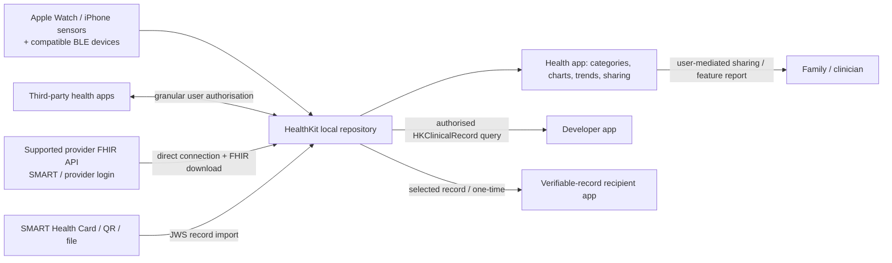
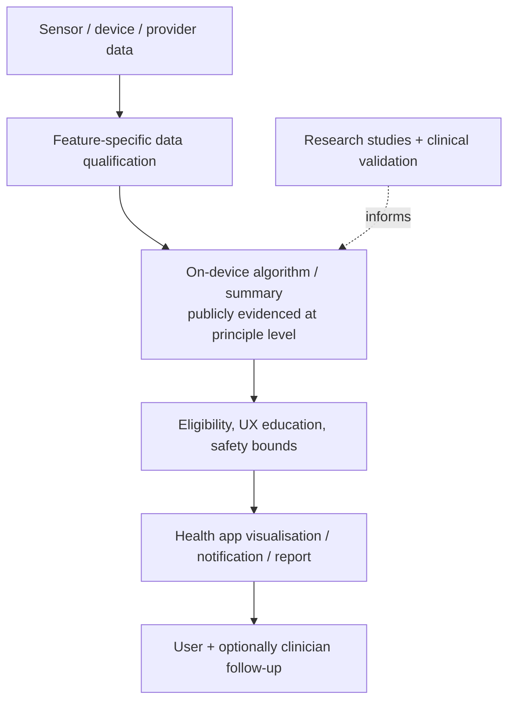
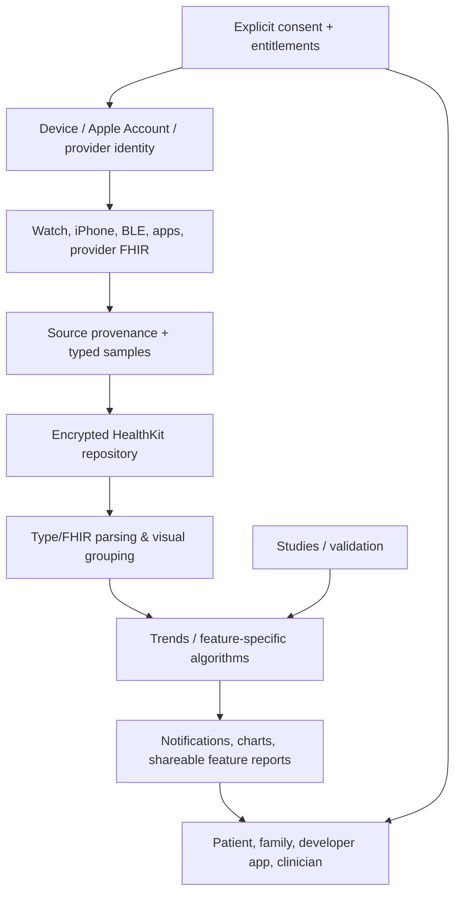
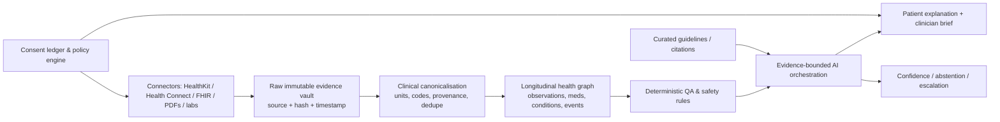

# Apple Health — Competitive Intelligence Dossier
## Board strategy edition for Ovexis | Public-information cut-off: 25 July 2026 | Prepared 25 July 2026

> **Scope and method.** “Apple Health” is not a separately incorporated company, priced SaaS product, or standalone P&L. It is an Apple platform spanning the Health app, HealthKit, Apple Watch, iPhone/iPad, selected AirPods health functions, Research app, clinical-record integrations, and developer frameworks. This dossier separates **🟢 Confirmed** public evidence, **🟡 Strong Inference** (explicitly reasoned from evidence), and **🔴 Speculation** (testable hypothesis). It does not use private, leaked, scraped, or unauthorised data. “Not publicly disclosed” is a finding, not a blank to fill. Evidence IDs resolve in Appendix A and the companion workbook.

---

# 1. Executive summary

## The strategic thesis
**🟢 Confirmed — What Apple is building.** Apple is building a consumer-controlled, device-native health data substrate: Health app is the personal health view; HealthKit is the permissioned iOS/watchOS data repository and API; Apple devices collect selected measurements; Health Records can download supported providers’ FHIR clinical data directly to the device; third parties can build against the platform. Apple describes Health as a central, secure location for medications, sleep, activity and other health information, with charts and trends. [E01][E02][E04]

**🟡 Strong Inference — The actual product is not the dashboard.** Apple’s strategic product is a *trusted health operating layer* that makes Apple hardware more valuable, reduces friction for health apps and healthcare organisations, and keeps sensitive longitudinal context in the user’s Apple ecosystem. Its product surface is deliberately modular rather than a vertically integrated clinic or AI diagnostician.

**🟢 Confirmed — Why it exists / customer problems.** Health information is fragmented across devices, apps and providers; Health Records was introduced to let patients see available data from multiple providers in one Health app. Apple says HealthKit lets users control which elements are shared with which apps, and its Health Records architecture connects directly to a provider API and downloads FHIR to device. [E03][E04][E11]

**🟡 Strong Inference — Emotional problem.** The emotional job is agency: “my body and records are understandable, available, and not being monetised behind my back.” Apple’s privacy campaign and technical posture make safety/control, not clinical optimisation alone, the core reassurance.

**🟡 Strong Inference — Operational problem.** For developers, HealthKit substitutes a permissioned canonical local interchange layer for one-off integrations with every wearable; for providers it offers an additional patient-facing distribution surface built on FHIR/SMART patterns. It does *not* remove semantic variation, provider coverage gaps, or clinical workflow integration.

### Customer / non-customer
| Segment | Assessment |
|---|---|
| iPhone/iPad users, especially Apple Watch owners | 🟢 Confirmed primary end users; Health is preinstalled and device-integrated. [E01] |
| Health/fitness/research app developers | 🟢 Confirmed platform customers; APIs, entitlements, open-source ResearchKit/CareKit/FHIRModels exist. [E02][E14] |
| Health systems / EHR-connected providers | 🟢 Confirmed integration participants for Health Records. [E03][E11] |
| Researchers | 🟢 Confirmed Research app and ResearchKit ecosystem target. [E12][E14] |
| Insurers/employers | 🟢 Confirmed ecosystem partners in wellness programmes, not the core Health-app buyer. [E12] |
| Android-only users, hardware-neutral enterprises, or customers wanting Apple to deliver care | 🟢 Confirmed **not** the direct target of the product as publicly documented; HealthKit is Apple-platform software and Apple’s materials position it as information/feature infrastructure, not care delivery. |

### Category creation and replacement
* **🟡 Strong Inference — Created:** consumer-controlled longitudinal health *operating system* (device + data vault + permissions + health feature distribution + developer APIs).
* **🟡 Strong Inference — Replaces:** disconnected app silos, paper/portal hopping, device-specific data stores, and a portion of personal health record (PHR) retrieval—not EHR, clinician judgment, diagnosis, care management, pharmacy, insurance, or a medical AI copilot.

### Jobs-to-be-done and value proposition
| Job | Apple mechanism | Strategic outcome |
|---|---|---|
| “Keep my health signals and important records together.” | Health app, categories, Trends/Highlights, Health Records | 🟢 Consolidated view; 🟡 increases device stickiness. [E01][E11] |
| “Know when something warrants attention without becoming a clinician.” | Notifications, on-device summaries, shareable reports / regulated features where available | 🟢 Selected functions are educational/non-diagnostic and feature/region dependent. [E19][E20] |
| “Share only the minimum information with an app, loved one, or clinician.” | per-type read/write permission, Sharing, FHIR/clinical and verifiable-record flows | 🟢 Explicit consent controls; 🟡 trust flywheel. [E04][E05][E06] |
| “Build a health app without recreating the device data layer.” | HealthKit, queries, background delivery, ResearchKit/CareKit | 🟢 APIs/frameworks; 🟡 lowers developer integration cost. [E02][E14] |

### Core philosophy
**🟢 Confirmed:** Apple articulates data minimisation, on-device processing, transparency/control, and security as health privacy principles. [E04][E05]

**🟡 Strong Inference:** “Own the sensitive substrate, expose controlled primitives, validate narrowly, and let partners supply specialised care.” This restraint is strategic: it avoids needing to become an insurer, provider, or always-on cloud PHI processor.

### Board conclusion
**🟡 Strong Inference:** Apple wins through a three-sided flywheel: hardware sensors → user data/engagement → developer and provider integrations → greater hardware utility. Its critical weakness is that a secure data vault is not automatically a clinically coherent, cross-platform, action-oriented longitudinal intelligence system. Ovexis should not try to out-Apple the iPhone integration; it should be the intelligence and care-coordination layer Apple intentionally does not provide.

---

# 2. Company intelligence

## Corporate reality, leadership, capital
* **🟢 Confirmed:** Apple Inc. was founded in 1976; Apple Health is an internal product/platform, not a separately funded startup. Therefore separate Apple Health founders, funding rounds, valuation, revenue, CAC/LTV, headcount and P&L are **not publicly disclosed**. Do not model them as a venture-backed competitor.
* **🟢 Confirmed:** Dr Sumbul Desai is publicly identified as Apple’s Vice President of Health; Apple says research/validation underpin health work. [E13][E16]
* **🟡 Strong Inference:** The relevant operating coalition spans Health, watch hardware/sensors, watchOS/iOS, privacy/security, services, regulatory, clinical science and developer relations. Apple’s hardware-careers page explicitly lists sensing hardware, algorithms, ML/DL, firmware, QA, user studies/human factors, and Health Technology. [E15]
* **🟢 Confirmed:** Apple’s 2025 Form 10-K is the authoritative corporate financial/risks document, but does not expose a Health segment P&L. [E18]

## Timeline (selected, evidenced)
| Date | Event | Label |
|---|---|---|
| 2014 | HealthKit/Health introduced with iOS 8 (historical platform origin). | 🟢 [E02] |
| 2015 | ResearchKit introduced; open-source research framework. | 🟢 [E14] |
| 2016 | Apple confirmed acquisition of Gliimpse (personal health-data aggregation); source reports this. | 🟢 acquisition reported; strategic integration **not disclosed**. [E17] |
| 2017 | Beddit acquisition reported; Lattice Data acquisition reported. | 🟢 reported; feature attribution **not proven**. [E17] |
| 2018 | Health Records launched in iOS 11.3; direct FHIR download design; Research app/clinical work expanded. | 🟢 [E02][E03] |
| 2018 | Apple Watch ECG/irregular-rhythm era begins with FDA pathways. | 🟢 [E19][E20] |
| 2019 | Health Records reported available in Europe/Hong Kong ECG availability; Tueo Health acquisition reported. | 🟢 [E17][E20] |
| 2020 | FHIRModels / CareKit FHIR documentation; Health privacy/security materials. | 🟢 [E02][E14] |
| 2021 | Verifiable Health Records (SMART Health Cards) introduced in HealthKit; per-record, one-time sharing. | 🟢 [E06] |
| 2022 | Apple reported >800 institutions / >12,000 locations for Health Records; studies and wellness programmes. | 🟢 as-of-2022 claim, not current coverage. [E12] |
| 2024 | FDA 510(k) record K240929 lists Apple Sleep Apnea Notification Feature, decision 13 Sep 2024. | 🟢 [E19] |
| 2025 | Apple announced Apple Health Study in Research app with Brigham and Women’s Hospital. | 🟢 [E13] |
| 2025 | Apple announced Watch Series 11 health functions, including region/eligibility limitations. | 🟢 [E20] |

## Partnerships, research, acquisitions, IP
* **🟢 Confirmed:** Apple named collaborations for Apple Women’s Health Study (Harvard T.H. Chan School of Public Health / NIEHS), Heart and Movement Study (Brigham and Women’s / AHA), Hearing Study (University of Michigan / WHO); its 2025 Apple Health Study is with Brigham and Women’s Hospital. [E12][E13]
* **🟢 Confirmed:** Apple said Health Records reached >800 institutions / >12,000 locations in 2022. That number is historical; no current verified count is asserted here. [E12]
* **🟢 Confirmed:** ResearchKit and CareKit are open source; FHIRModels is an open-source Swift package referenced by Apple’s developer materials. [E02][E14]
* **🟢 Confirmed:** Reported acquisitions relevant to health include Gliimpse, Beddit and Tueo Health. **🟡 Strong Inference:** these added talent/IP/optionality in aggregation, sleep and respiratory monitoring, respectively; assigning a present feature to any acquisition is unsupported. [E17]
* **🟢 Confirmed:** Apple holds extensive patents generally, but a complete patent landscape or ownership-to-feature mapping was not independently verified in this report. Treat patent moat magnitude as unquantified.

## Regulatory posture
**🟢 Confirmed:** Certain features have FDA/other regulatory clearances and are explicitly bounded; Apple describes ECG/irregular-rhythm experience as educational and non-diagnostic, and the FDA record identifies SANF as OTC sleep-apnea risk assessment. Availability varies by geography, device, age and eligibility. [E19][E20]

**🟡 Strong Inference:** Apple uses a portfolio strategy: keep broad wellness/data infrastructure outside device claims where possible; submit discrete, bounded algorithms/features where clinical claims create value.

---

# 3. “Founder psychology” reframed: institutional product psychology
Apple Health has no single publicly declared founder. A literal founder-psychology profile would be fabricated. The following is an evidence-anchored institutional inference.

| Question | Assessment |
|---|---|
| Beliefs | **🟢** Apple says privacy is a fundamental human right and specifies four health-data principles. **🟡** It believes trust, validation, and actionability are adoption prerequisites. [E04][E16] |
| Decision framework | **🟡** Ship an integrated experience only when sensor, algorithm, UX, privacy and regulatory evidence meet a high threshold; bound claims rather than overpromise. |
| Risk tolerance | **🟡** Low for unvalidated clinical claims, high for long-horizon hardware/software investment. FDA-bounded features and studies support this. [E13][E19] |
| 10-year ambition | **🔴** Make Apple devices the default private health interface and signal layer for a large share of their installed base; not necessarily become a primary-care provider. |
| Likely internal strategy | **🟡** Own collection, consent and user experience; create interoperable edges (FHIR/HealthKit); scale research; select regulated conditions where hardware creates differentiated value. |

---

# 4. Product reverse engineering: public surface and constraints

## Confirmed functional inventory
**Health app (consumer):** 🟢 central health information, categories, charts, Trends/Highlights, medications, sleep, activity, sharing, Health Records, Medical ID, and device/app data-management surfaces are described in Apple materials. Exact screen arrangement, locale, OS and entitlement availability vary. [E01][E04][E05]

**HealthKit (developer):** 🟢 typed health samples and correlations; read/write authorisation separated by data type; user controls data access; query families include long-running update monitoring; clinical records can be queried where authorised. HealthKit is a central repository on iPhone/Apple Watch and supports compatible BLE devices. [E02][E05]

**Clinical records:** 🟢 Health Records creates a secure connection directly to provider API, downloads FHIR to iPhone, stores it in HealthKit, aggregates multiple institutions; developers may query authorised clinical records and access validated FHIR resource data. A unique clinical record should use source, resource type and identifier. [E02]

**Verifiable records:** 🟢 SMART Health Cards/JSON Web Signatures, user-selected records, per-sample and one-time sharing; not a blanket persistent access grant. [E06]

**Research/care frameworks:** 🟢 ResearchKit offers consent, surveys and active tasks; CareKit is an open-source framework for care apps, task scheduling, secure persistence and charts, with FHIR mapping support. [E14]

## Publicly observable workflow map (not a claim of every button)
1. **🟢** User acquires/uses iPhone; Health exists as a system app. A Watch or compatible app/device can generate/import permitted data. [E01][E05]
2. **🟢** App presents purpose text / privacy policy and invokes HealthKit authorisation; user grants granular read/write types. Apple may review privacy policy. [E02][E04]
3. **🟢** Data is stored/managed in HealthKit and rendered in Health. Source provenance and access management are part of the model. [E05]
4. **🟢** User can connect a supported provider to download Health Records, or can share with a third party under explicit permissions. [E02][E06]
5. **🟢** Specific feature algorithms issue bounded insights/notifications; certain reports can support clinician discussion, not replace diagnosis. [E19][E20]

### Important negative findings
* **🟢 Confirmed:** Apple public materials do **not** document a general-purpose Health-app LLM chat, diagnosis agent, universal longitudinal clinical narrative, patient-provider inbox, clinician task queue, claims ingestion, pharmacy marketplace, insurer workflow, or public HealthKit REST/GraphQL cloud API.
* **🟢 Confirmed:** Apple does **not** publicly disclose each button/page/notification implementation or backend architecture. Any purported exhaustive UI map would be false precision.
* **🟡 Strong Inference:** The Health app’s intentionally conservative information architecture prioritises safe data review and permissions over complex clinical decision workflows.

## Retention, growth and conversion loops
| Loop | Assessment |
|---|---|
| Sensor → daily metric → notification/chart → continued device use | 🟢 sensor/metrics and notifications exist; 🟡 retention loop. [E01][E20] |
| App developers add HealthKit → utility of Health increases → user devices remain more valuable | 🟢 API exists; 🟡 ecosystem flywheel. [E02][E04] |
| Provider connection → records consolidated → Health app becomes persistent record destination | 🟢 connection/data aggregation; 🟡 retention inference. [E02][E11] |
| Feature-to-subscription conversion | 🟢 No standalone Apple Health subscription price is publicly advertised. **🟡** Health monetises principally through hardware/platform value, not Health-app subscription. |

---

# 5. Complete user journeys

## A. Consumer / passive-health journey
**🟢** iPhone owner → opens Health → sees categories / data availability → adds data source or grants permission → views trends/records → optionally shares data or exports feature-specific reports → continues using devices. [E01][E04]

**🟡** The “signup” is ordinarily Apple Account/device setup rather than a separate Apple Health account; subscription/renewal does not apply to Health app itself. Support occurs through Apple Support/device support. Referral is not a documented Health-app loop.

## B. Third-party app developer journey
**🟢** Developer enrolls in Apple Developer program → adds HealthKit capability/entitlements → writes purpose strings and privacy policy → requests *minimum necessary* types → user authorises → app queries/observes permitted local store → must meet App Review/data-use restrictions. Clinical/Verifiable features may require separate entitlements. [E02][E04][E05][E06]

## C. Health Records journey
**🟢** Health app → Health Records → add/connect supported institution → authenticate with institution → direct provider API connection → FHIR download to device → data rendered in Health; authorised developer app can query allowed clinical records. [E02][E11]

## D. Verifiable record journey
**🟢** User imports SMART Health Card by supported provider connection, file or QR code → chooses Add to Health → third-party app runs entitled query → user chooses individual matching record(s) → Share Once → app receives record/JWS and must verify it. [E06]

## E. Regulated alert journey (generic)
**🟢** Eligible user enables/completes feature education → device records signal under specified conditions → algorithm applies validated rules → user receives bounded notification → feature directs appropriate follow-up; it is not diagnosis. [E19][E20]

---

# 6. UX, accessibility and trust review

| Dimension | Finding |
|---|---|
| Navigation & hierarchy | 🟢 Health app is organised around health information/categories and data-sharing controls. 🟡 It follows Apple system UI conventions, reducing learnability cost. [E01][E04] |
| Typography/spacing/design system | 🟡 Likely Apple Human Interface Guidelines/system typography and Dynamic Type patterns; exact values are not asserted without a versioned UI audit. |
| Dark mode/accessibility | 🟡 Platform-level iOS accessibility likely benefits the app, but feature-by-feature conformance should be audited on devices; no blanket accessibility certification claim made. |
| Trust signals | 🟢 explicit consent, privacy explanation, encryption language, medical limitations/education, source-based data governance. [E04][E05][E19] |
| Microinteractions/loading | 🟢 permission sheets and import/connection flows are public. **Not publicly verified:** every animation/state/error copy. |
| Conversion | 🟡 Apple optimises feature discovery and hardware value, not a Health-app checkout. |
| Friction | 🟢 provider availability and authorisation are required; user feedback reports confusing UI, poor customisation, record printing gaps and data accuracy/sync issues. These are anecdotal, not representative prevalence estimates. [E21] |

**Ovexis UX implication — 🟡:** pair Apple-grade consent clarity with a “why this matters / what to do / what source supports it” longitudinal narrative. Never make the user hunt through a database to answer a care question.

---

# 7. Healthcare workflows

| Workflow | Apple’s documented role | Gap / Ovexis opening |
|---|---|---|
| Patient self-management | 🟢 View, log, share, and receive selected signals. [E01] | 🟡 Goal/care-plan adherence and longitudinal reasoning are thin. |
| Provider visit | 🟢 Feature reports/data can inform discussion; Health Records shows patient-accessible data. [E11][E20] | 🟢 No public evidence of a clinician inbox/task/clinical documentation workflow. |
| Hospital / EHR | 🟢 Patient-mediated provider API/FHIR download; FHIR resources aggregate on device. [E02] | 🟡 No public evidence Apple is EHR system of record or manages ADT/orders/notes workflow. |
| Insurance | 🟢 wellness programmes existed; no public Health-app claims workflow. [E12] | 🟡 opportunity: coverage-aware navigation. |
| Labs / pharmacy | 🟢 Clinical records can include labs/medications depending provider FHIR feed; Health tracks medications. [E01][E11] | 🟡 no universal lab/pharmacy network / reconciliation proven. |
| Referrals / care coordination | 🟢 sharing exists. | 🟢 no public referral loop, closed-loop handoff or care-team work queue. |

---

# 8. Healthcare data architecture

**🟢 Confirmed:** FHIR is used for Health Records; HealthKit models clinical data as `HKClinicalRecord` / `HKFHIRResource`, supports FHIR releases including DSTU2/R4 in Apple FHIRModels materials; only structurally valid FHIR resources are shared by this API. [E02]

**🟢 Confirmed:** records arrive directly from institution API to device; data are stored in HealthKit. [E02]

**🟢 Confirmed:** HealthKit permissions are granular by type and distinct for read/write. [E05]

**🟡 Strong Inference:** Normalisation is *syntactic/typed* at the HealthKit/FHIR boundary, not a full clinical truth layer. Cross-source semantic conflicts, temporality, duplicate episodes, units, provenance, and record reconciliation remain a difficult downstream problem. Apple itself cautions developers to use source/type/identifier and handle FHIR release differences. [E02]

**🟢 Confirmed negative:** No public documentation establishes native Apple Health ingestion for HL7 v2, CCD/C-CDA, DICOM imaging, genomics, payer claims, or a universal pharmacy network. A provider might transform data to FHIR before Apple sees it; that is not equivalent to native Apple ingestion.

### Consent architecture
* **🟢:** explicit per-type app permissions; defaults do not share data; revocation in Settings; purpose/privacy requirements. [E04][E05]
* **🟢:** clinical-verifiable flow is per-sample and one-time. [E06]
* **🟡:** Apple’s local-first model materially limits centralised exposure but complicates cloud-based continuous care coordination for third parties.

---

# 9. AI reverse engineering

## What is evidenced
* **🟢 Confirmed:** Apple uses algorithms/ML in health features and says metrics are generated on device; its 2025 Watch material refers to ML models developed using hundreds of thousands of study hours and thousands of participants. [E01][E04][E20]
* **🟢 Confirmed:** specific regulated algorithms are bounded, feature-specific and paired with education/limitations. [E19][E20]
* **🟢 Confirmed negative:** Apple has not publicly documented a Health-app LLM, agent architecture, RAG layer, clinical digital twin, foundation-model provider, prompt stack, confidence-calibration system, or clinician human-review system for general Health app advice.

## Architecture assessment

**🟡 Strong Inference:** Apple likely uses a distributed pipeline: prospective studies and labelled clinical references for feature development, stringent offline evaluation, on-device inference for many consumer summaries, and feature-specific regulatory/medical review. Do not infer model class, training data composition, cloud topology or performance thresholds absent disclosures.

**Ovexis recommendation:** Build AI as *evidence-bound longitudinal intelligence*, not a diagnosis chatbot: deterministic data QA → evidence graph → retrieval of guideline/source snippets → constrained reasoning tasks → calibrated confidence + abstention → clinician escalation. See Section 18.

---

# 10. Technical and API investigation

## Confirmed public technology
| Layer | Public evidence |
|---|---|
| Client/API | 🟢 Native Apple SDK framework HealthKit; Swift/Objective-C developer API, entitlements, queries. [E02][E05] |
| Clinical exchange | 🟢 FHIR; SMART on FHIR-style provider authentication flow is referenced in Apple architecture; FHIRModels supports DSTU2/R4. [E02] |
| Verifiable exchange | 🟢 SMART Health Cards and JWS. [E06] |
| BLE/device interoperability | 🟢 compatible BLE devices supported. [E05] |
| Open source | 🟢 ResearchKit, CareKit, FHIRModels. [E02][E14] |
| Authentication | 🟢 device passcode/Face ID/Touch ID protects local Health data; provider authentication occurs to provider in Health Records journey. [E02][E05] |

## Not public / do not invent
**🟢 Confirmed negative:** Apple has not publicly disclosed Health’s frontend framework internals, backend language(s), databases, cloud provider topology, caches, monitoring/APM, CI/CD, CDN, feature flags, analytics vendor list, email/messaging stack, or a standalone payments stack. iCloud/CloudKit is not proof of every Health backend component.

## API assessment
* **🟢:** HealthKit is not advertised as a public REST/GraphQL service; it is an on-device SDK/API, with entitlements and user authorisation. [E02][E05]
* **🟢:** Clinical query returns FHIR resource data after authorisation; developer must handle release/data complexity. [E02]
* **🟢:** Verifiable record query requires entitlement; selection is one-time/per-record. [E06]
* **🟢:** No public OpenAPI document, general webhook catalog, public rate-limit schedule or cloud SDK applies to HealthKit itself.
* **🟡:** Background queries/observer delivery are an event-like local integration mechanism, but not a reliable substitute for a third-party cloud webhook SLA; developers report platform-version issues. [E02][E21]

---

# 11. Security, privacy and compliance

## Confirmed controls
| Control | Evidence |
|---|---|
| Local encryption/protection | 🟢 Health data encrypted on device when passcode/biometric protection is configured; Apple security guide identifies data-protection classes and lock behaviour. [E05] |
| iCloud | 🟢 encrypted in transit/at rest; end-to-end encryption requires stated configuration (recent OS, passcode, 2FA). [E04][E05] |
| Access control | 🟢 per-app, per-type read/write permissions; revocable in Settings. [E04][E05] |
| Data minimisation/on-device processing | 🟢 Apple stated principles and on-device processing. [E04] |
| Third-party rules | 🟢 HealthKit data cannot be used for advertising/marketing or sold to data brokers; privacy policy/purpose requirements apply. [E04][E05] |
| Medical ID exception | 🟢 Medical ID can be lock-screen accessible; this is an intentional safety/privacy trade-off. [E05] |

## Compliance assessment
* **🟢:** Apple materials describe privacy/security controls; they do not, by themselves, establish that every HealthKit developer, health system or use case is HIPAA-compliant, SOC 2 certified, GDPR-compliant, or covered by an Apple BAA.
* **🟢:** BAA availability for Apple Health/HealthKit: **not publicly established in reviewed sources**. Do not claim it.
* **🟡:** Apple’s model reduces Apple’s exposure to user-content cloud processing, but downstream developers that export/store PHI may trigger HIPAA, GDPR, state consumer-health law and contractual obligations.

### Threat model / residual risk
**🟡:** principal residual risks include compromised unlocked device/account, overbroad third-party consent, inaccurate/late external source data, social engineering at provider login, shared-device privacy, and user over-reliance on a non-diagnostic notification. Apple mitigates some through encryption, granular access and education; clinical truth/recipient governance remains external.

---

# 12. Business model, growth, hiring and customer intelligence

## Business model
**🟢 Confirmed:** There is no public standalone Apple Health consumer price or Health subscription plan. HealthKit is a developer framework and Apple Health is part of supported Apple OS/device experiences. [E01][E02]

**🟡 Strong Inference:** Revenue logic is indirect: Apple hardware demand and retention (Watch, iPhone, potentially AirPods), platform differentiation, developer ecosystem health, and perhaps adjacent services. No standalone Apple Health CAC, LTV, gross margin or sales quota is disclosed.

## Growth strategy
* **🟢:** distribution is preinstallation and Apple device base; Apple markets privacy, health features, research, developers and healthcare partnerships. [E01][E04][E12]
* **🟢:** public developer relations include documentation/WWDC/open-source frameworks. [E02][E14]
* **🟡:** strongest channel is product-led hardware distribution, not SEO or paid referral mechanics.

## Hiring intelligence
**🟢:** Apple’s publicly stated Health Technology capability areas include sensing hardware, ASIC architecture, algorithm/ML/DL, firmware/software, QA, user studies and human factors. [E15]

**🟡:** roadmap signal: sustained investment across sensor-to-algorithm-to-human-factors indicates continued preventative/measurement features, not merely dashboard maintenance. **🟢:** we did not conduct an exhaustive timestamped scrape of all Apple job postings; do not use this as current requisition count.

## Voice of customer (directional, non-representative)
**🟢:** Reddit users praise central storage and Watch integration but report confusion, poor customisation, gaps in mental-health tracking, inability to print/share cleanly, manual-lab limitations, treadmill/distance inaccuracies and sync issues. [E21]

**🟡:** The repeated theme is structural: users want a coherent personal health story and action plan; Apple provides a secure heterogeneous store. Ovexis can win in “meaning,” but must not overinterpret anecdotal complaints as market-share data.

---

# 13. Decision ledger (representative)

| Decision / feature | Why built / pain | KPI likely improved | Trade-off / alternative | Label |
|---|---|---|---|---|
| HealthKit local repository | fragmented device/app data | integrations, app utility, device retention | cloud PHR could simplify cross-device coordination but worsens trust/exposure | 🟡 grounded by E02/E05 |
| Granular type-level permissions | sensitive data misuse fear | trust, authorisation quality | consent friction / partial datasets | 🟢 mechanism; 🟡 KPI [E04][E05] |
| Direct-to-provider FHIR download | portal fragmentation | record utility, provider partnerships | Apple does not centrally normalise all clinical data | 🟢 [E02] |
| On-device computation | minimise data exposure | trust / privacy differentiation | limited cloud-scale analytics | 🟢 principle; 🟡 trade-off [E04] |
| Narrow regulated notifications | early signal, credible consumer health | hardware differentiation / health outcomes | scope, validation cost, false positive/negative risk | 🟢 bounds [E19][E20] |
| Open source research/care frameworks | ecosystem participation | developer/research reach | less direct control/revenue | 🟢 [E14] |
| One-time VHR selection | high-sensitivity portable credentials | trust / interoperability | repeat interaction friction | 🟢 [E06] |

---

# 14. Feature dependency graph / value chain

**🟢:** consent, store, FHIR, algorithms and user sharing are documented. **🟡:** this graph expresses system dependency, not Apple’s internal microservice architecture.

### Value chain
Sensor hardware → OS data capture → HealthKit permissioned storage → Health app interpretation → developer/clinical interoperability → user/clinician action. **🟡:** Apple controls the high-leverage first four nodes, while care delivery and ongoing clinical accountability reside outside its controlled value chain.

---

# 15. Engineering roadmap reconstruction

| Stage | Reconstructed scope | Confidence |
|---|---|---|
| MVP (2014–15) | Health app + HealthKit data types/permissions; ResearchKit follows. | 🟢 historical platform evidence [E02][E14] |
| V2 (2016–20) | Watch health expansion, Research/Care frameworks, FHIR Health Records, early clinical features. | 🟢 [E02][E03][E14] |
| V3 (2021–24) | verifiable records, mature privacy articulation, broader longitudinal/regulated sensor insights, sleep apnea feature. | 🟢 [E04][E06][E19] |
| Current visible direction (2025–26) | studies, watch health/sleep/selected hypertension direction, HealthKit evolution. | 🟢 feature announcements; 🟡 roadmap continuity. [E13][E20] |
| Future | deeper sensor-derived risk flags, broader regional rollout, more developer primitives. | 🟡 likely; exact features/dates **not public** |

**🟡 Technical debt hypothesis:** FHIR version and source heterogeneity, provider onboarding, incomplete clinical coverage, consent-induced partial data and device/OS variation are inherent platform complexity. Developer forum reports indicate real integration regressions, but do not prove Apple internal technical debt. [E02][E21]

---

# 16. Competitive landscape, SWOT, Five Forces, moat and failure analysis

## Landscape: Apple’s position against named comparators
| Cluster / examples | Apple relative position | Ovexis implication |
|---|---|---|
| Device/wellness: WHOOP, Oura, Ultrahuman, Google Health/Health Connect | 🟡 Apple has unusually deep OS/hardware/privacy integration; rivals may offer sharper focused coaching or cross-platform reach. | Ingest all; do not require Apple-only life. |
| Consumer diagnostics: Function Health, Levels, Superpower, PreventiveHealth.ai | 🟡 These compete on tests, interpretation and concierge workflows; Apple is substrate, not a lab-first service. | Own lab/record reconciliation + evidence-based next steps. |
| Clinical intelligence: OpenEvidence, Glass Health, Atropos, AMBOSS, UpToDate | 🟡 They target clinician knowledge/evidence/workflow rather than personal sensor hub. | Build clinician-grade evidence/citation layer, not generic summaries. |
| Indian care platforms: Apollo 24/7, Practo, Tata 1mg, Healthify | 🟡 They have local care/pharmacy/service rails; Apple has device layer. | Partner/localise rather than recreate logistics early. |
| Data/API: Human API, Health Connect | 🟡 They offer aggregation/interoperability; Apple has privileged Apple-platform distribution. | Build multi-source connector and canonical provenance graph. |
| Regacore | 🔴 Public identity/product definition was not sufficiently verified in this research pass; no comparison asserted. |

## Moat scorecard
| Moat | Now | Why |
|---|---|---|
| Brand/trust | **Strong** | 🟢 privacy positioning, system distribution; 🟡 durable willingness to share data. [E04] |
| Hardware/sensor integration | **Strong** | 🟢 integrated Watch/iPhone and selected features. [E01][E20] |
| Distribution | **Strong** | 🟢 preinstalled system app; 🟡 installed-base leverage. |
| Developer | **Strong** | 🟢 HealthKit + frameworks; 🟡 platform lock-in. [E02][E14] |
| Regulatory/clinical | **Medium → Strong** | 🟢 discrete clearances/studies; 🟡 not a full clinical-care moat. [E13][E19] |
| Longitudinal data | **Medium** | 🟢 rich local data aggregation; 🟡 fragmented/incomplete sources, patient/region dependence. |
| Network effect / marketplace | **Weak–Medium** | 🟢 apps/providers participate; 🟡 no public care marketplace/network transaction loop. |
| AI | **Medium/Future** | 🟢 specific ML; 🟢 no disclosed general health AI stack. |
| Switching cost | **Medium** | 🟡 history/device integration creates friction, but user-controlled export/sharing and competing ecosystems limit lock-in. |

## SWOT
| Strengths | Weaknesses |
|---|---|
| 🟢 integrated hardware/software, privacy, developer APIs, consumer trust, clinical studies/clearances | 🟢 not cross-platform; incomplete provider feeds; no documented universal care workflow; consumer feedback reports opaque UI/actions [E01][E21] |
| Opportunities | Threats |
| 🟡 preventive longitudinal intelligence, regulated signals, provider-ready reporting, international interoperability | 🟡 regulatory scrutiny, false reassurance/alert burden, sensor commoditisation, platform policy risk, cross-platform competitors |

## Porter’s Five Forces
* **🟡 Supplier power — medium:** sensors, chip components and clinical partners matter, but Apple vertically controls much of experience.
* **🟡 Buyer power — medium:** consumers can switch devices slowly; providers can choose whether to integrate.
* **🟡 New entrants — medium:** apps can enter, but hardware, trust and regulatory validation are hard.
* **🟡 Substitutes — high:** Android wearables, specialist devices, EHR portals, lab services, clinician care.
* **🟡 Rivalry — high:** broad wellness and clinical-intelligence space is crowded; Apple’s category is differentiated but adjacent competitors are intense.

## Failure analysis
| Failure mode | Mechanism / mitigation |
|---|---|
| Clinical | 🟡 false positives/negatives, misuse, uneven populations; mitigate with boundaries, validation, education, escalation. |
| Data | 🟡 missing/conflicting FHIR/sensor data can yield misleading longitudinal picture; preserve provenance and uncertainty. |
| Regulatory | 🟡 expansion of claims makes device regulation, regional rollout and post-market surveillance more expensive. |
| Trust/security | 🟡 third-party consent or account/device compromise can undermine reputation despite strong base controls. |
| Business | 🟡 health value fails to translate to hardware preference or consumer engagement. |
| Distribution | 🟡 provider integration friction / geographic gaps constrain Health Records. |
| AI | 🟢 general-health LLM not disclosed; **🟡** if introduced, hallucination/accountability risk is high. |

---

# 17. Competitive attack plan — how Ovexis can beat Apple without trying to replace it

1. **🟡 Be cross-platform by design:** Apple HealthKit, Health Connect, wearables, labs, claims, pharmacy, EHR portals and patient documents under one provenance-aware record.
2. **🟡 Build the missing intelligence layer:** reconcile duplicates/conflicts and narrate meaningful change over time; never silently merge clinical truth.
3. **🟡 Make every insight auditable:** source, timestamp, units, data-quality grade, guideline citation, model version, confidence, and “what would change this conclusion.”
4. **🟡 Close the loop:** patient action → clinician-ready brief → referral/order/appointment/document capture → outcome, using local-market partners.
5. **🟡 Treat Apple as a privileged input, not an enemy:** use HealthKit with minimal permissions and transparent value exchange.
6. **🟡 Price for ongoing intelligence/care coordination, not raw data storage.** Apple’s free baseline makes a copycat dashboard nonviable.
7. **🟡 India-first differentiator:** consented ABDM/ABHA-compatible integrations only where authorised, local labs/pharmacies/provider navigation, multilingual clinically reviewed explanations—subject to applicable law and partner access.

---

# 18. Future prediction

| Horizon | Prediction | Label / falsifier |
|---|---|---|
| 12 months | Continued enhancement/availability expansion of existing sensor and health-summary surfaces; study-driven announcements. | 🟡 Falsified by material de-prioritisation/no updates. |
| 3 years | More device-derived risk/screening features and stronger clinical-data sharing primitives, region permitting. | 🟡 Exact conditions not inferable. |
| 5 years | Apple likely remains health substrate and selective regulated-feature company rather than broad direct care operator. | 🔴 Strategic projection; falsified by acquisition/launch of large care delivery/insurance business. |
| Acquisition | No specific target is evidentially predictable. | 🟢 Do not name targets. |
| General Health AI | Could appear as tightly scoped on-device summaries before autonomous clinical agent. | 🟡 Do not assume an LLM is currently deployed. |

---

# 19. Ovexis strategy memo

## Recommended MVP (90–120 days)
**🟡 Recommendation:** Launch a mobile-first, consent-first *Longitudinal Health Brief* for one high-value cohort (e.g., cardiometabolic risk or women’s health), not an all-condition “AI doctor.”

1. HealthKit + Health Connect read connectors, strictly minimum types.
2. PDF/CCD/FHIR patient-upload/import path; labs first, then records.
3. Canonical event/provenance model and deterministic unit/range/duplicate QA.
4. Timeline with source confidence, missingness and conflict visibility.
5. One clinician-reviewed “visit brief” PDF/share link with citations—not diagnostic instructions.
6. Retrieval-augmented explanation of *existing facts*, clinical safety rules and escalation routes.
7. B2B2C pilot through 2–5 clinician/lab partners; measure activation, successful data connection, brief use at visit, and 30/90-day return.

## Recommended architecture

**Guardrails:** source-ground every generated claim; no diagnosis/medication change; temporal sanity checks; role-based views; hard clinical red-flag routing; human review for clinical outputs; model/version/audit logging; offline evaluation stratified by demographic/source quality; explicit “insufficient data” state.

## Recommended GTM and pricing
* **🟡:** Start clinician/lab/health-program B2B2C rather than broad consumer paid acquisition. The first paid outcome is a better prepared visit and retained preventive program.
* **🟡:** Offer free encrypted data vault + paid longitudinal review/clinical programme (India-sensitive price points to be tested), and enterprise per-engaged-member or per-clinic-seat contracts. Do not charge for data export or use data for advertising.
* **🟡:** Moat sequence: provenance/normalisation accuracy → trusted clinical workflows → outcome-labelled longitudinal data under consent → partner distribution. Not “we have an LLM.”

## Fifty ideas to copy (principles, not trade dress)
1–10: granular consent; local-first minimisation; source attribution; simple trends; device integration; health categories; feature eligibility education; privacy policy at permission; immutable raw data; explicit revocation.  
11–20: FHIR-first records; verifiable credential support; per-record sharing; ResearchKit-like consent; structured surveys; active tasks; BLE interoperability; clinician-readable reports; clinical study partnerships; on-device pre-processing.  
21–30: region/device gating; safety limitation copy; HealthKit connector; background updates where permitted; data-type taxonomy; medication organisation; care sharing; emergency profile; user-controlled data access; open developer education.  
31–40: SDK-quality docs; typed schemas; FHIR release handling; provenance keys; developer sandbox/test data; accessibility-first controls; charts with time filters; privacy marketing; OS-native interactions; research recruitment.  
41–50: hardware-independent signal ingestion; scientifically validated claims; staged rollout; post-market monitoring; source-aware dedupe; change notifications; data export; transparent support; family-caregiver sharing; secure defaults.

## Fifty ideas to improve
1–10: cross-platform support; clearer home narrative; individualised dashboard; explain metric relevance; downloadable visit packet; manual lab/document import; data correction workflow; conflict resolution; source quality badges; data freshness.  
11–20: clinician inbox integration; closed-loop referrals; medication reconciliation; claims/pharmacy connections; imaging/genomics pointers; multilingual UX; accessibility audit; mental-health structured tracking; symptom timeline; caregiver roles.  
21–30: actionable prevention plans; goals linked to evidence; appointment preparation; proactive missing-data prompts; nuanced uncertainty; longitudinal anomaly review; data portability; transparent retention; privacy controls in-context; direct record-export controls.  
31–40: patient identity matching; semantic mapping; local reference ranges; cohort-specific performance; responsible AI citations; clinician override; feature feedback loop; workload-aware alerts; care-team collaboration; support for low-connectivity users.  
41–50: Android parity; India-local partner rails; consent receipts; secure document OCR review; audit trail visibility; patient-defined goals; social determinants capture; interoperable care plans; outcome measurement; scientific publishing.

## Fifty ideas to ignore
1–10: ad targeting from health data; selling data; black-box diagnosis; universal disease score; fabricated certainty; unconsented scraping; default broad permissions; endless biometric vanity charts; proprietary lock-in without export; replacing clinicians.  
11–20: raw FHIR dump as UX; designing around a single wearable; forcing subscription before value; gamifying serious alerts; noisy daily alerts; clinician tasks without reimbursement; fake “AI doctor” persona; unsupported medical claims; storing passwords/provider credentials; bypassing official APIs.  
21–30: duplicate EHR build; own lab/pharmacy logistics in MVP; generic wellness content farm; biometric leaderboards for sick users; punitive insurer scoring; opaque risk profiling; auto-changing medical records; treating HealthKit as complete truth; unreviewed document extraction as fact; homegrown cryptography.  
31–40: HIPAA certification claims without scope; assuming Apple BAA; indefinite retention by default; treating consent as one checkbox; demographic-blind models; unvalidated predictions; webhooks as medical-alert guarantees; developer-only jargon; unbounded chatbot memory; naked PDF upload.  
41–50: referral spam; dark-pattern sharing; false urgency; combining identity with research without consent; monetising crisis states; screen-only accessibility; feature parity theater; annual roadmap promises; copying Apple visual trade dress; competitor FUD.

## Fifty ideas to reinvent
1–10: longitudinal timeline; health score; Trends; Health Records; Sharing; Medical ID; medication list; sleep insight; lab display; activity goals.  
11–20: consent screen; clinician report; device connection; data source list; notification inbox; health categories; symptom tracking; research consent; wellness programme; care plan.  
21–30: FHIR parser; record identity; privacy dashboard; anomaly flag; chart; family collaboration; provider connection; document export; data deletion; support flow.  
31–40: preventive recommendation; risk alert; onboarding; source attribution; clinical escalation; wearable coaching; evidence library; provider directory; scheduling handoff; follow-up reminder.  
41–50: retention loop; referral loop; plan pricing; developer SDK; quality dashboard; clinical validation; interoperability partner model; trust marketing; international rollout; governance model.

## Fifty market gaps
1–10: cross-platform longitudinal graph; provenance-visible reconciliation; patient-controlled clinical narrative; multi-provider identity resolution; patient-friendly FHIR; true data-quality grade; lab-range normalisation; medication reconciliation; symptom-context capture; PDF-to-reviewed structured data.  
11–20: clinician-ready previsit synthesis; post-visit plan tracking; referral closure; claims-aware navigation; pharmacy adherence coordination; imaging/genomics indexing; local care availability; multilingual health literacy; caregiver permissions; adolescent-to-adult transition.  
21–30: equitable models; uncertainty UX; model audit trail; AI abstention; regional guidelines; evidence citations; shared decision tools; prevention ROI measurement; employer-safe programmes; privacy-preserving research matching.  
31–40: India interoperability playbook; low-bandwidth workflows; cash-pay cost transparency; rural care navigation; local lab integration; health-data consent receipts; personal emergency plan; chronic-condition workflow; pregnancy/postpartum longitudinal record; mental-health measurement with guardrails.  
41–50: clinician reimbursement workflow; device-independent coaching; behaviour/context data; cross-household care; outcome-led subscription; patient-reported outcomes; adverse-event handoff; data donation governance; research return-of-results; portable lifetime health archive.

## Twenty blue-ocean opportunities
1. Provenance-first health timeline. 2. “What changed since last visit?” brief. 3. Cross-platform sensor-to-lab reconciliation. 4. Consent receipt wallet. 5. Guideline-cited patient explanation. 6. AI that abstains visibly. 7. Clinician-approved prevention loops. 8. Family care with scoped roles. 9. India local care-routing layer. 10. Multilingual medical-document companion. 11. Longitudinal medication truth layer. 12. Data-quality insurance. 13. Patient-owned research matching. 14. Local reference-range intelligence. 15. Appointment-ready question generator. 16. Outcome-tracked care plan. 17. Post-discharge home signal layer. 18. Equity/audit dashboard. 19. Privacy-preserving cohort insights. 20. Portable individual health graph.

---

# 20. References and evidence register (abbreviated; full workbook register)
| ID | Source | Evidence used | Type |
|---|---|---|---|
| E01 | [Apple Health](https://www.apple.com/health/) | Health app purpose; privacy; research positioning | First-party |
| E02 | [Apple WWDC: Handling FHIR without getting burned](https://developer.apple.com/videos/play/wwdc2020/10669/) | direct provider FHIR flow, HealthKit clinical records, FHIRModels | First-party |
| E03 | [Apple: Health Records launch](https://www.apple.com/newsroom/2018/03/doctors-put-patients-in-charge-with-apples-health-records-feature/) | launch / participating institutions | First-party |
| E04 | [Apple Health Privacy Overview PDF](https://www.apple.com/privacy/docs/Health_Privacy_White_Paper_May_2023.pdf) | data principles, permissions, third-party limits | First-party |
| E05 | [Apple Platform Security: Health data](https://support.apple.com/guide/security/protecting-access-to-users-health-data-sec88be9900f/web) | data protection, encryption, access controls, BLE | First-party |
| E06 | [Apple WWDC: Verifiable Health Records](https://developer.apple.com/videos/play/wwdc2021/10089/) | SMART Health Cards/JWS/per-record sharing | First-party |
| E11 | [Apple 2022 health information update](https://www.apple.com/ca/newsroom/2022/07/how-apple-is-empowering-people-with-their-health-information/) | 2022 provider count, programs/studies | First-party |
| E12 | [Apple 2022 health report release](https://www.apple.com/newsroom/2022/07/how-apple-is-empowering-people-with-their-health-information/) | studies/wellness partners | First-party |
| E13 | [Apple Health Study](https://www.apple.com/newsroom/2025/02/new-holistic-apple-health-study-launches-today-in-the-research-app/) | Apple Health Study, Desai quote | First-party |
| E14 | [CareKit](https://github.com/carekit-apple/CareKit) and [ResearchKit](https://github.com/ResearchKit/ResearchKit) | open-source frameworks | Primary project repositories |
| E15 | [Apple Hardware Careers](https://www.apple.com/careers/us/hardware.html) | Health Technology disciplines | First-party |
| E16 | [Stanford Medicine: Sumbul Desai](https://med.stanford.edu/news/all-news/2025/09/sumbul-desai-mgr.html) | leadership and health product principles | Academic institution interview |
| E17 | [Becker’s acquisition timeline](https://www.beckershospitalreview.com/healthcare-information-technology/apple-s-health-it-acquisitions-a-timeline/) | reported acquisitions | Trade press; attribution limited |
| E18 | [Apple Investor Relations](https://investor.apple.com/) | corporate reporting source | First-party |
| E19 | [FDA K240929](https://www.accessdata.fda.gov/scripts/cdrh/cfdocs/cfpmn/pmn.cfm?ID=K240929) | sleep apnea notification clearance | Regulator |
| E20 | [Apple Watch Series 11 health insights](https://www.apple.com/newsroom/2025/09/apple-debuts-apple-watch-series-11-featuring-groundbreaking-health-insights/) | current features/eligibility language | First-party |
| E21 | [Reddit: Health UI feedback](https://www.reddit.com/r/apple/comments/146q482/bad_ui_in_apple_health/) / [Apple Watch fitness feedback](https://www.reddit.com/r/AppleWatchFitness/comments/1i6fqu8/what_is_your_biggest_problem_with_health_apps_for/) | anecdotal complaints | User-generated; nonrepresentative |

**Screenshot register:** No screenshots were captured or reproduced. Evidence is URL/text-source based. This avoids implying UI screenshots are current across OS versions. A device-based UX audit can add dated, consented screenshots later.

## Research limitations and next diligence
1. Use physical iPhone/Watch test devices in supported regions to capture versioned screens, accessibility behaviour and precise notification flows.
2. Download Apple developer SDK headers/docs and build a compliant test app to map current APIs/entitlements—never reverse engineer private APIs.
3. Validate hospital coverage with Apple’s in-app directory, provider SMART/FHIR endpoints and patient consent; do not infer coverage from 2022 counts.
4. Commission regulatory counsel for India DPDP/ABDM/telemedicine rules plus HIPAA/GDPR scope before Ovexis pilot.
5. Interview 20 patients, 15 clinicians and 10 health-IT leaders using a structured, consented protocol; distinguish sentiment from market frequency.

---

# Final board recommendation
**🟡 Strong Inference:** Apple Health is the benchmark for *trustworthy collection and consent*, not the finished product for longitudinal health intelligence. Ovexis should integrate with it respectfully and build what it does not: cross-platform clinical reconciliation, transparent evidence-backed longitudinal synthesis, local care workflow closure and accountable AI. Its defensibility must be trusted data quality plus clinical distribution—not merely a better dashboard or a conversational model.
