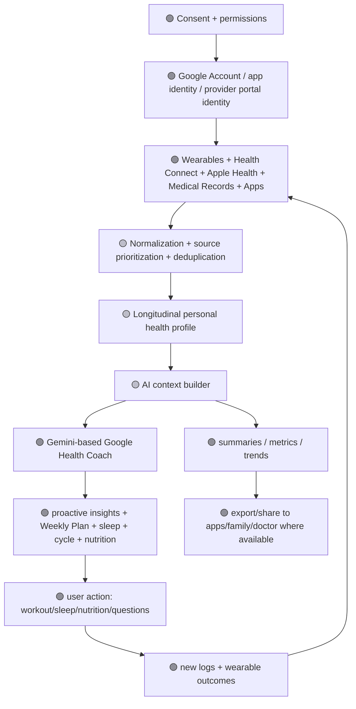
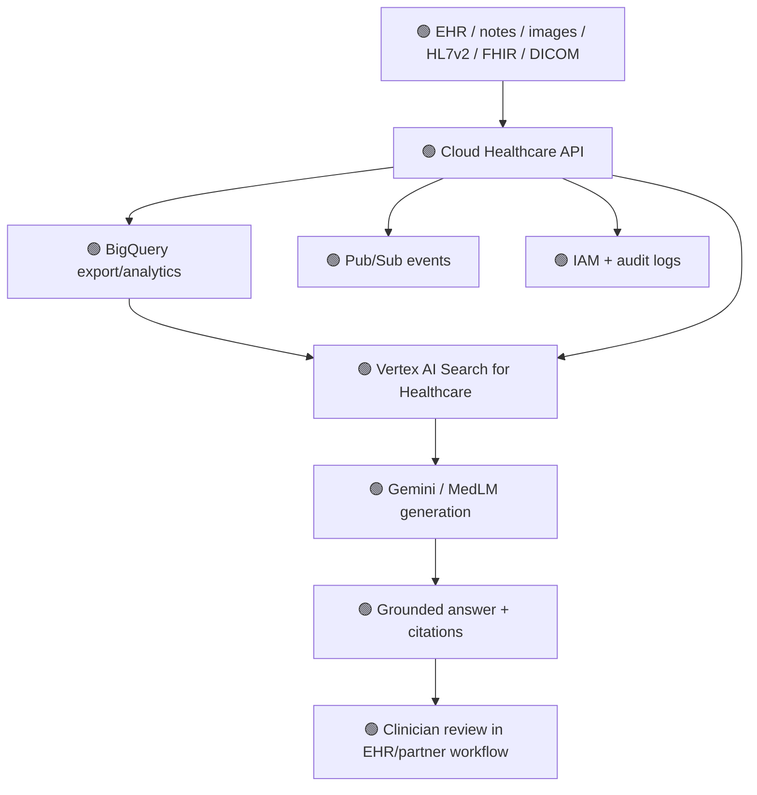
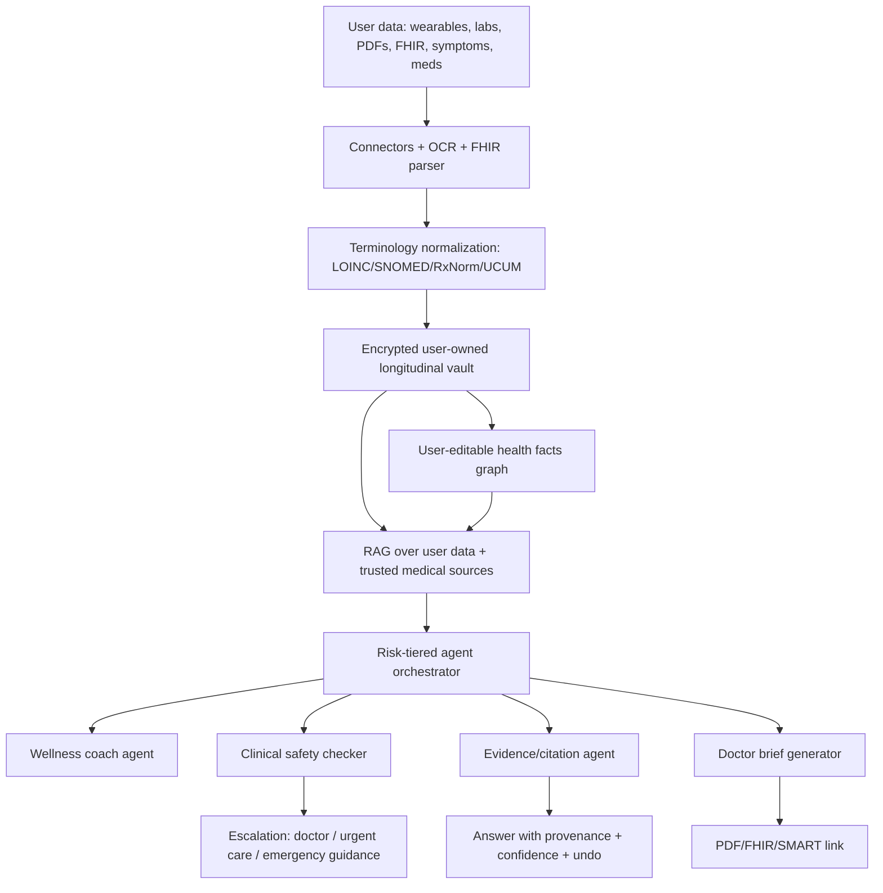
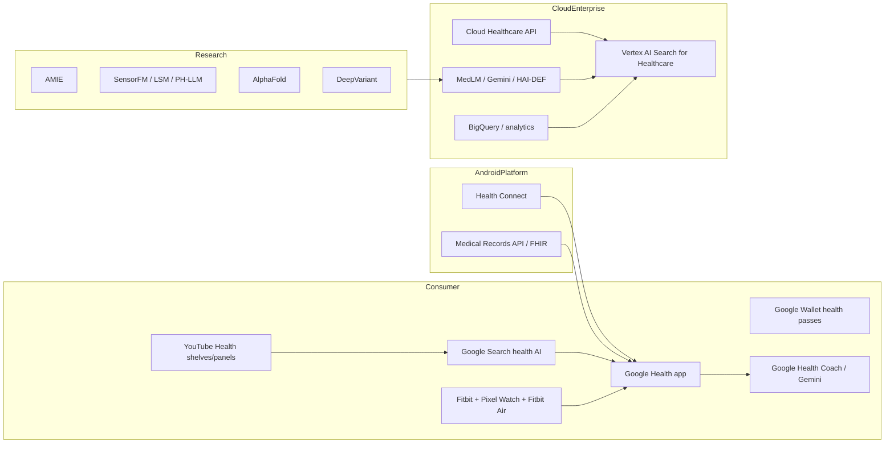
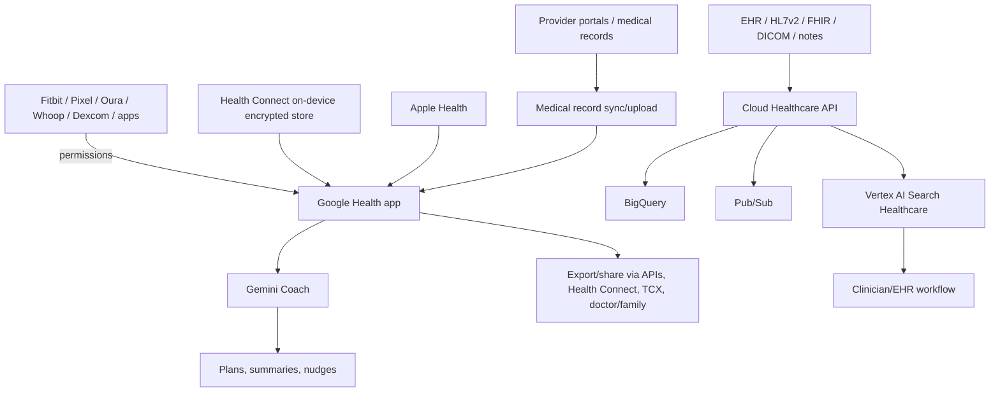
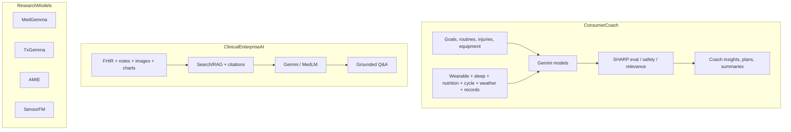

# Google Health Competitive Intelligence Report — Board-Level V1

**Target:** Google Health / Google for Health / Google Health app / Google Cloud healthcare AI ecosystem  
**Official websites inspected:** https://health.google/ and https://healthapp.google/  
**Date:** 2026-07-25  
**Prepared for:** Ovexis strategy discussion  

## Method, evidence labels, and hard limitations

- 🟢 **Confirmed:** Public source explicitly states the claim; source IDs in this report map to the Evidence Register spreadsheet.  
- 🟡 **Strong inference:** The claim follows from multiple public observations, product architecture constraints, or Google-published docs, but Google does not explicitly state it.  
- 🔴 **Speculation:** Strategic prediction or scenario; included only when useful for Ovexis planning and clearly marked.  
- 🟢 **Scope boundary:** This investigation used only public pages, public documentation, public app-store/search-result excerpts, public filings, public press/news, and public customer/developer discussions.  
- 🟢 **Compliance boundary:** No authenticated app screens, internal consoles, private APIs, private repositories, paid dashboards, customer-only enterprise environments, or non-public data were accessed.  
- 🟢 **Robots/ToS boundary:** Public content was retrieved through standard browsing/search/documentation surfaces; no unauthorized access or scraping behind authentication was attempted.  
- 🟡 **Reverse-engineering boundary:** “Reverse engineering” here means public-interface and public-documentation reconstruction, not binary decompilation, traffic interception, credentialed testing, or vulnerability probing.  
- 🟢 **Spreadsheet deliverables:** The companion workbook `google_health_feature_inventory.xlsx` contains the Master Feature Inventory, Evidence Register, Decision Ledger, Risk Register, Moat Matrix, and Competitive Landscape sheets.  

---

# 1. Executive Summary

## 1.1 What are they building?

- 🟢 **Google is building a multi-surface health ecosystem, not a single startup-style product.** Public surfaces include Google Search health experiences, YouTube Health information features, Pixel/Fitbit wearables, Health Connect on Android, Google Health app and Google Health Coach, Google Wallet health passes, Cloud Healthcare API, Vertex AI Search for Healthcare, MedLM/MedGemma/TxGemma/HAI-DEF models, Open Health Stack, and research systems such as AMIE, AlphaFold, SensorFM/LSM, and PH-LLM. **Sources:** E01, E02, E03, E04, E05, E07, E10, E16, E19, E21, E22.  
- 🟢 **The consumer Google Health app is the rebranded Fitbit app and is intended as a centralized wellness-data hub.** Google states the Fitbit app became the Google Health app, with four tabs — Today, Fitness, Sleep, and Health — plus app/device connections, medical records, and Google Health Coach. **Sources:** E03, E04, E05.  
- 🟢 **Google Health Coach is an AI coaching product built with Gemini and sold through Google Health Premium.** Google says the Coach acts as a fitness coach, sleep expert, and health/wellness advisor and is included in Google Health Premium at $9.99/month or $99/year. **Source:** E05.  
- 🟢 **Health Connect is the Android health data exchange layer, and its Medical Records APIs extend Health Connect into FHIR-based medical data.** Android docs state Health Connect stores health/fitness and medical-record data, supports Health Connect permissions, and Medical Records supports FHIR R4/R4B categories such as allergies, conditions, labs, medications, visits, and vitals. **Sources:** E07, E08, E09.  
- 🟢 **Cloud Healthcare API is the enterprise healthcare interoperability substrate for Google Cloud.** Google docs state it ingests, stores, analyzes, and integrates DICOM, FHIR DSTU2/STU3/R4, and HL7v2 data, supports datasets/data stores, BigQuery export, de-identification, auditability, IAM, and HIPAA BAA coverage with appropriate configuration. **Source:** E10.  
- 🟢 **Vertex AI Search for Healthcare is Google’s enterprise clinical search and Q&A layer over structured and unstructured clinical records.** Google’s health AI page describes it as medically tuned search and question answering over clinical records using Google-grade search and Gemini generative AI. **Sources:** E02, E17.  

## 1.2 Why does it exist?

- 🟢 **Google’s public rationale is to help people live healthier lives by meeting them where they already seek information and use devices.** Google’s product pages emphasize “the right information at the right time” through Search, YouTube, wearables, Health Connect, Wallet, and privacy/security. **Source:** E01.  
- 🟢 **Google’s enterprise rationale is to reduce fragmentation and administrative burden in healthcare data.** Cloud docs say Cloud Healthcare API simplifies integration so developers can focus on UX and intelligence, while Vertex AI Search for Healthcare is positioned to help clinicians find relevant data faster. **Sources:** E02, E10, E17.  
- 🟢 **Google’s AI rationale is that medicine is inherently multimodal and that models such as Gemini, MedGemma, AMIE, and SensorFM can reason across records, images, sensors, and text.** Google’s AI pages explicitly frame medicine as multimodal and highlight Gemini, MedGemma, TxGemma, AMIE, LSM, PH-LLM, and AlphaFold. **Source:** E02.  

## 1.3 What customer problem exists?

- 🟢 **Consumer data fragmentation:** Google states health information is spread across apps, devices, patient portals, and notes, and Google Health aims to bring data into one place. **Sources:** E03, E04.  
- 🟢 **Consumer interpretation gap:** Google states wearables have unlocked a wealth of insights, but many people do not know what to do with the information. **Source:** E05.  
- 🟢 **Developer interoperability friction:** Android docs state Health Connect lets apps share data without high-cost one-to-one API integrations. **Source:** E07.  
- 🟢 **Enterprise clinical-search burden:** Google Cloud and partner materials describe healthcare information as fragmented across structured and unstructured sources and position Vertex AI Search for Healthcare as a search/Q&A solution over clinical records. **Sources:** E02, E17.  
- 🟢 **Medical-data standardization burden:** Cloud Healthcare API docs state it provides standards-compliant data stores for DICOM, FHIR, and HL7v2. **Source:** E10.  

## 1.4 What emotional problem exists?

- 🟡 **Consumers feel overwhelmed by numbers and portals; Google is selling reassurance and “coach-like” interpretation.** This follows from Google’s “connect the dots,” “proactive guidance,” and “everyone should have a team of experts” messaging. **Sources:** E03, E05.  
- 🟡 **Clinicians feel cognitive overload from record review; Google is selling speed, familiarity, and confidence.** This follows from “Google-grade search,” “clinical records,” and “reduce administrative burden” positioning. **Sources:** E02, E17.  
- 🟡 **Developers feel friction from permissions, privacy, and fragmented device APIs; Google is selling standardized access plus platform governance.** This follows from Health Connect documentation and Play Health permissions policy. **Sources:** E07, E09, E34.  

## 1.5 What operational problem exists?

- 🟢 **Operationally, healthcare data is multimodal and split among EHRs, notes, images, HL7 messages, FHIR resources, sensors, apps, and medical records.** Google docs enumerate DICOM, HL7v2, FHIR, unstructured clinical notes, images, charts, and medical records as target data types. **Sources:** E02, E07, E08, E10, E17.  
- 🟢 **Operationally, access control and auditability are mandatory.** Cloud Healthcare API uses IAM, Cloud Logging audit logs, HIPAA BAA coverage, data location control, and optional CMEK; Health Connect uses user-granted permissions and on-device encrypted storage. **Sources:** E07, E10, E12, E13, E14.  

## 1.6 Who is the customer?

- 🟢 **Consumer customer:** Fitbit/Pixel Watch users, Google Health app users, Google Health Premium subscribers, and people searching health topics in Search/YouTube. **Sources:** E01, E03, E04, E05.  
- 🟢 **Developer customer:** Android health/fitness developers, medical-record app developers, Open Health Stack/FHIR developers, and Health AI Developer Foundations users. **Sources:** E07, E08, E09, E19, E20.  
- 🟢 **Enterprise customer:** health systems, EHR vendors, payers, life-sciences organizations, and healthcare developers using Google Cloud. **Sources:** E10, E16, E17, E18, E32.  
- 🟢 **Research customer:** clinicians, biomedical researchers, life-sciences teams, and academic collaborators using or evaluating models such as MedGemma, TxGemma, AlphaFold, AMIE, DeepVariant, and SensorFM. **Sources:** E02, E19, E21, E22, E27, E28.  

## 1.7 Who is NOT the customer?

- 🟢 **Google Health app is not positioned as a diagnostic or treatment product.** Google’s footnotes repeatedly state features are not intended for medical purposes, do not diagnose/treat, and users should consult healthcare professionals. **Sources:** E04, E05, E06.  
- 🟢 **Health Connect Medical Records is not a multi-patient clinical record system.** Android docs state Health Connect is intended to store medical records for a single individual at this time. **Source:** E08.  
- 🟢 **Cloud Healthcare API is not a turnkey HIPAA-compliant app by itself.** Google states it is covered by the Google Cloud HIPAA BAA and can be used with ePHI with appropriate configuration; customers still configure workloads. **Sources:** E10, E14.  
- 🟡 **Ovexis should not treat Google Health as a narrow direct-to-consumer competitor only.** Google competes simultaneously as operating-system layer, wearable layer, consumer app, AI model provider, clinical-search provider, cloud infrastructure vendor, and information-distribution platform. **Sources:** E01, E02, E03, E07, E10, E19.  

## 1.8 Category created and category replaced

- 🟡 **Category being created:** “AI-powered longitudinal health OS across consumer, developer, clinical, and research surfaces.” Google has not used this exact category, but its public portfolio matches this structure. **Sources:** E01, E02, E03, E04, E05, E07, E10, E19.  
- 🟢 **Category being replaced in consumer health:** Fitbit app/Premium is being replaced by Google Health app/Premium, while Google Fit APIs are supported until the end of 2026 with migration guidance to Health Connect/Google Health. **Sources:** E04, E07, E09.  
- 🟢 **Category being replaced in enterprise workflows:** bespoke EHR search, manual chart review, and point-to-point interface layers are being targeted by Cloud Healthcare API + Vertex AI Search for Healthcare. **Sources:** E02, E10, E17.  
- 🟡 **Category being attacked indirectly:** wearable dashboards that stop at metrics; Google’s Coach attempts to move from descriptive tracking to prescriptive interpretation. **Sources:** E05, E22.  

## 1.9 Jobs-To-Be-Done analysis

| Segment | JTBD | Evidence label | Why it matters to Ovexis |
|---|---|---:|---|
| Consumer | “When I have fragmented health data, help me see one coherent picture.” | 🟢 E03/E04 | Ovexis must win on longitudinal coherence, not dashboards alone. |
| Consumer | “When I see a metric, tell me what to do next safely.” | 🟢 E05 | Ovexis needs explainable, actionable coaching with explicit safety boundaries. |
| Consumer | “When I receive medical records/labs, simplify them without pretending to be my doctor.” | 🟢 E04/E05 | Ovexis can specialize in lab/record intelligence with clinician-grade disclaimers and sharing workflows. |
| Clinician | “When I open a chart, find the relevant facts fast.” | 🟢 E02/E17 | Ovexis can avoid direct EHR replacement and build summarized longitudinal context. |
| Developer | “When I need health data, give me standardized permissioned APIs.” | 🟢 E07/E08/E09 | Ovexis should abstract Health Connect/HealthKit/FHIR into a cross-platform data layer. |
| Enterprise | “When I manage PHI at scale, give me standards, IAM, audit logs, and analytics.” | 🟢 E10/E12/E13/E14 | Ovexis must design compliance and audit architecture from day one. |
| Researcher | “When I build medical AI, provide pretrained models and integration paths.” | 🟢 E19 | Ovexis can use open medical models but must differentiate on longitudinal user-owned data and clinical workflows. |

## 1.10 Value proposition and core philosophy

- 🟢 **Value proposition:** Google brings search, AI, cloud, Android, Fitbit/Pixel, and developer infrastructure together so people, clinicians, enterprises, and developers can access, understand, and act on health information. **Sources:** E01, E02, E03, E07, E10, E19.  
- 🟡 **Core philosophy:** Google Health’s visible philosophy is “help at scale through existing user moments,” rather than “replace doctors” or “own the full care delivery stack.” This is inferred from Search/YouTube/wearable/cloud/product framing and repeated non-medical disclaimers. **Sources:** E01, E04, E05, E10.  
- 🟡 **Strategic tension:** Google wants deep personalization from sensitive health data while preserving trust through privacy controls, ads-use commitments, disclaimers, and user consent. **Sources:** E04, E05, E06, E07, E24.  

---

# 2. Company Intelligence

## 2.1 Entity and structure

- 🟢 **Google Health is not currently just one independent company with standalone founders, investors, or a separate cap table.** Public reporting and Google statements describe health as a company-wide effort across Search, Cloud, YouTube, Fitbit, Devices, Research, Android, and other teams. **Sources:** E29, E30.  
- 🟢 **Alphabet/Google reports revenue by segments such as Google Services, Google Cloud, and Other Bets rather than a separate Google Health segment.** Alphabet Q2 2026 SEC materials report Google Services, Google Cloud, Other Bets, and total revenue, without a separate Google Health reporting line. **Source:** E31.  
- 🟡 **Google Health’s current strategic operating model is a horizontal mission with vertical product owners.** This follows from the post-2021 dissolution of a unified division, 2026 product launches under Google Health, and Cloud/Search/Android/Research product ownership. **Sources:** E04, E05, E29, E30, E32.  

## 2.2 Condensed history and timeline

| Year | Event | Label/source | Strategic interpretation |
|---:|---|---|---|
| 2008 | Google launched the original Google Health personal health record product. | 🟢 E33/E35 | Early PHR attempted before consumer adoption, mobile health, and FHIR rails were mature. |
| 2011–2012 | Google announced retirement of Google Health; service retired Jan 1, 2012; data export continued through Jan 2013; reason was lack of broad adoption. | 🟢 E33/E35 | First failure taught that consumer health records need native workflows, trusted distribution, and data supply. |
| 2018 | Google hired David Feinberg to coordinate fragmented health initiatives; DeepMind Health moved under Google Health. | 🟢 E36/E37 | Google tried a centralized health strategy led by a health-system operator. |
| 2019 | Google/Ascension Project Nightingale controversy triggered privacy scrutiny and HHS OCR inquiry. | 🟢 E38 | Trust and governance became existential to Google Health strategy. |
| 2021 | Google completed Fitbit acquisition for $2.1B with privacy/interoperability commitments. | 🟢 E24 | Google bought a major consumer wearable data and subscription foothold. |
| 2021 | Google dismantled the unified Google Health division and distributed teams across the company. | 🟢 E29/E30 | Google shifted from central division to embedded health efforts. |
| 2022 | Health Connect was introduced as Android health-data sharing API with Samsung collaboration. | 🟢 E25 | Google moved to platform-level interoperability. |
| 2023 | Med-PaLM/Med-PaLM 2 and MedLM became visible as medically tuned LLM initiatives. | 🟢 E16/E20 | Google moved from research papers into enterprise model offerings. |
| 2024 | Vertex AI Search for Healthcare reached broader availability/industry adoption in Google Cloud reporting. | 🟢 E17/E18 | Google productized clinical search as cloud platform capability. |
| 2025 | Health Connect Medical Records APIs were announced globally in FHIR format. | 🟢 E01/E07/E08 | Android moved from fitness exchange to personal medical-record exchange. |
| 2025 | HAI-DEF expanded open medical models such as MedGemma and TxGemma. | 🟢 E19/E20 | Google seeded developer ecosystem and model mindshare. |
| 2026 | Fitbit app became Google Health app; Google Health Coach became globally available via Google Health Premium. | 🟢 E04/E05 | Google re-entered consumer longitudinal health records/coaching at scale. |
| 2026 | Healthcare Data Engine was deprecated effective July 11, 2026. | 🟢 E15 | Google appears to consolidate around Cloud Healthcare API + Vertex AI/BigQuery/agent stack rather than a separate HDE product. |

## 2.3 Leadership and visible operators

- 🟢 **Michael Howell was reported as succeeding Karen DeSalvo as leader of Google healthcare initiatives after her planned retirement in 2025.** **Source:** E32.  
- 🟢 **Karen DeSalvo was Google’s first Chief Health Officer and was publicly associated with Google’s health work through 2025.** **Sources:** E32, E39.  
- 🟢 **Andy Abramson is named by Google as Head of Product, Google Health, on the Google Health Coach launch blog.** **Source:** E05.  
- 🟢 **Taylor Helgren is named by Google as Director, Product Management, on the Google Health app launch blog.** **Source:** E04.  
- 🟢 **Aashima Gupta is publicly visible as a Google Cloud healthcare strategy/solutions leader in Google Cloud healthcare AI partnerships.** **Sources:** E17, E18.  
- 🟢 **Rishi Chandra is publicly visible in wearables/health work and Google Health/Fitbit launch communications.** **Sources:** E03, E40.  
- 🟢 **Yossi Matias and Google Research/DeepMind teams are publicly tied to health AI research/productization.** **Sources:** E02, E21, E22.  

## 2.4 Funding, valuation, and investors

- 🟢 **Google Health has no disclosed standalone funding round or valuation in public sources found in this investigation.** **Source basis:** E31 plus absence of separate Google Health financing in reviewed public filings/search results.  
- 🟢 **Alphabet is the parent capital base.** Alphabet Q2 2026 SEC materials show consolidated revenues of $119.796B for Q2 2026 and Google Cloud revenue of $24.768B for Q2 2026. **Source:** E31.  
- 🟡 **Google Health’s “funding” advantage is effectively Alphabet’s ability to subsidize health products through Search, Cloud, Android, Devices, Research, and subscription bundles.** **Sources:** E31, E04, E05.  

## 2.5 Acquisitions and strategic assets

- 🟢 **Google completed the Fitbit acquisition in January 2021 for $2.1B.** **Source:** E24.  
- 🟢 **Google/Alphabet absorbed DeepMind Health into Google Health in 2018 as part of health reorganization.** **Source:** E37.  
- 🟡 **Fitbit is the most important health acquisition for Ovexis-relevant consumer data because it provides longitudinal wearable data, Premium subscription lineage, and device/app distribution.** **Sources:** E04, E05, E24.  

## 2.6 Research, patents, and open source

- 🟢 **Google has public healthcare AI research and productization across Med-PaLM/MedLM, AMIE, MedGemma, TxGemma, SensorFM/LSM, PH-LLM, AlphaFold, DeepVariant, mammography AI, and other models.** **Sources:** E02, E16, E19, E20, E21, E22, E27, E28.  
- 🟢 **Google Health-related open developer assets include Open Health Stack / Android FHIR SDK, Health AI Developer Foundations models, MedGemma repositories/model cards, TxGemma, MedSigLIP, MedASR, HeAR, Path Foundation, and DeepVariant.** **Sources:** E19, E20, E27, E28, E41.  
- 🟢 **A Google patent family titled “System and method for predicting and summarizing medical events from electronic health records” lists Google LLC as assignee and describes converting EHRs into standardized formats such as FHIR and using deep learning to predict and summarize future/past medical events.** **Source:** E42.  
- 🟡 **Google’s patent posture indicates a long-running interest in EHR timeline modeling, clinical event prediction, and provider-facing summarization, even if products have shifted names and organizations.** **Source:** E42.  

## 2.7 Strategic partnerships

- 🟢 **Enterprise/clinical partnerships observed include MEDITECH, HCA Healthcare, Highmark Health, Suki, Counterpart Health, Mayo Clinic, Beth Israel Deaconess Medical Center, Ascension, Apollo Hospitals, Imperial College London/NHS, Princess Máxima Center, and WHO/Open Health Stack collaborations.** **Sources:** E18, E21, E27, E37, E38, E43, E44, E45.  
- 🟢 **Open Health Stack / Android FHIR SDK is explicitly connected to WHO SMART Guidelines collaboration.** **Source:** E41.  
- 🟡 **Google’s partnership strategy is to embed in existing clinical ecosystems rather than replace EHRs or hospital workflows end-to-end.** **Sources:** E17, E18, E38, E43.  

---

# 3. Founder / Organization Psychology

> Google Health has no single startup founder psychology. This section therefore analyzes visible organizational psychology and leadership beliefs.

- 🟢 **Visible belief:** “AI will not replace doctors, but doctors who use AI will replace those who do not” was publicly attributed to Karen DeSalvo in health AI event coverage. **Source:** E39.  
- 🟢 **Visible belief:** Google frames health as human-centered and AI as assistive, with repeated “not intended for medical purposes” disclaimers in consumer products. **Sources:** E04, E05, E06.  
- 🟡 **Core assumption:** The winning health platform will be built from existing user moments — Search questions, YouTube videos, watch signals, Android permissions, cloud data stores, EHR integrations — not from a standalone “new portal.” **Sources:** E01, E03, E04, E05, E07, E10.  
- 🟡 **Product philosophy:** Google prefers horizontal infrastructure and ecosystem leverage: open models, APIs, cloud primitives, Android SDKs, and Search/YouTube distribution. **Sources:** E01, E02, E07, E10, E19.  
- 🟡 **Decision framework:** Google appears to productize when it can combine a large data surface, an AI capability, and a distribution surface; examples include Health Coach over Fitbit/Pixel data, Vertex AI Search over clinical records, Health Connect over Android, and HAI-DEF over Google models. **Sources:** E04, E05, E07, E17, E19.  
- 🟡 **Risk tolerance:** Google is willing to enter high-trust health domains but uses disclaimers, BAAs, permission flows, clinical panels, evaluation frameworks, and privacy commitments to limit regulatory and reputational exposure. **Sources:** E05, E06, E07, E10, E14, E24.  
- 🟡 **Long-term ambition:** Google’s visible ambition is to become the ambient health intelligence layer across consumer wellness, clinical search, healthcare data interoperability, biomedical research, and therapeutic discovery. **Sources:** E01, E02, E03, E10, E19, E22.  
- 🔴 **Speculation:** Over 10 years, Google may try to make Google Health a default cross-platform personal health cloud analogous to Google Photos/Gmail for health context, while letting clinicians and regulated entities remain the medical decision makers.  

---

# 4. Product Reverse Engineering — Public Surfaces

## 4.1 Product portfolio map

| Surface | Confirmed feature set | Label/source | Ovexis implication |
|---|---|---|---|
| Google Health app | Today, Fitness, Sleep, Health tabs; dashboards; medical records; apps/devices; trends; Fitbit migration. | 🟢 E03/E04 | Google owns consumer longitudinal front-end. |
| Google Health Coach | Gemini-built coaching; onboarding; goals; routines; injuries; proactive insights; Ask Coach; sleep/fitness/health tabs; medical record summaries; nutrition/cycle/mental wellbeing; voice/images/docs logging. | 🟢 E05 | AI coach is the core conversion lever. |
| Google Health Premium | $9.99/month or $99/year; bundled with Google AI Pro/Ultra; 3-month device trial terms. | 🟢 E05 | Bundled pricing can undercut independent apps. |
| Fitbit/Pixel Watch/Fitbit Air | Wearable data, sleep, HR/HRV, cardio load, health metrics, Fitbit Air, Pixel Watch. | 🟢 E03/E04/E05 | Hardware creates proprietary longitudinal signal. |
| Health Connect | Android API/data store; permissions; on-device encrypted data; >50 data types; medical records. | 🟢 E07/E08/E09 | Platform layer can commoditize wearable ingestion. |
| Medical Records API | FHIR R4/R4B; allergies, conditions, labs, meds, patient/practitioner, pregnancy, procedures, social history, vaccines, visits, vitals. | 🟢 E08 | Direct threat to basic PHR aggregation. |
| Cloud Healthcare API | DICOM/FHIR/HL7v2; datasets/stores; IAM; audit; BigQuery; de-ID; HIPAA BAA. | 🟢 E10 | Enterprise-grade backbone for Ovexis competitors. |
| Vertex AI Search for Healthcare | Clinical search and Q&A; structured/unstructured records; Gemini; multimodal Visual Q&A; MEDITECH/Suki/Counterpart. | 🟢 E02/E17/E18 | Threat in enterprise clinical summarization. |
| HAI-DEF | MedGemma, MedASR, MedSigLIP, TxGemma, HeAR, Path Foundation; Vertex/Cloud Healthcare integration. | 🟢 E19 | Google commoditizes medical model starting points. |
| Search/YouTube/Wallet | AI Overviews/AI Mode, Lens skin search, YouTube shelves/panels, Wallet health passes. | 🟢 E01 | Google controls top-of-funnel health intent. |

## 4.2 Public consumer app workflow reconstruction

- 🟢 **Acquisition screen:** `healthapp.google` displays hero message “A new relationship with your health,” CTA buttons for Google Play and App Store, and sections for Proactive/adaptive coaching, Holistic health, and Personalized answers. **Source:** E03.  
- 🟢 **Core data-unification page:** The “Your Health Connected” page says wearables, medical devices, favorite apps, and medical records work together in one holistic view. **Source:** E03.  
- 🟢 **Connected-app logos visible:** Official page shows integrations/logos including Abbott Lingo, Adidas Running, AllTrails, Amazfit, Apple, BetterSleep, b.well, Clear, Dexcom, FitOn, Flo, Headspace, Hevy, MyFitnessPal, Noom, Oura, Peloton, Strava, Whoop, and Withings. **Source:** E03.  
- 🟢 **Medical-record import workflow:** Google Health page says users can import medical records including lab results, medications, allergies, and clinical data, and can update/remove records from settings. **Source:** E03.  
- 🟢 **Coach onboarding:** Google says the Coach starts with a conversation to learn goals, daily routine, equipment, injuries, and lifestyle context. **Source:** E05.  
- 🟢 **Today tab:** Google says the redesigned Today tab is the home for proactive Coach insights and nudges. **Source:** E05.  
- 🟢 **Fitness tab:** Google says the Fitness tab houses Weekly Plan, tailored workout suggestions, and natural-language workout creation/saving. **Sources:** E04, E05.  
- 🟢 **Sleep tab:** Google says the Sleep tab focuses on weekly consistency and progress toward better rest. **Sources:** E04, E05.  
- 🟢 **Health tab:** Google says the Health tab shows key health metrics and can provide Coach summaries of personal health records. **Sources:** E04, E05.  
- 🟢 **Logging workflow:** Google says the Coach supports voice, images, or documents for logging complex workouts, gym whiteboards, meal photos, PDFs, and medical records. **Source:** E05.  
- 🟢 **Privacy workflow:** Google Health privacy page says users can turn optional features on/off, export/delete health data, delete the Google Health account/service, and use two-step authentication. **Source:** E06.  
- 🟢 **Subscription workflow:** Google says Coach is included with Google Health Premium and starts rolling out May 19 with $9.99/month or $99/year pricing. **Source:** E05.  

## 4.3 Health Connect workflow reconstruction

- 🟢 **Developer starts by declaring permissions in AndroidManifest and Play Console.** Android docs and Play policy require permission declarations and data-use declarations for Health Connect data types. **Sources:** E09, E34.  
- 🟢 **User grants granular app permissions.** Android docs show Health Connect app-permission flows and medical records permission screens. **Sources:** E07, E08.  
- 🟢 **Apps read/write standardized records.** Android docs state apps can securely read/write Health Connect using standardized schemas and Medical Records APIs. **Sources:** E07, E08.  
- 🟢 **User can browse medical records stored in Health Connect.** Android docs show a Medical Records data-browsing screen. **Source:** E07.  
- 🟢 **User can revoke/delete/prioritize data.** Health Connect docs state users can shut off access, delete data, and prioritize data sources. **Source:** E25.  

## 4.4 Enterprise workflow reconstruction

- 🟢 **Cloud Healthcare API control plane:** create Google Cloud project, dataset, and modality-specific FHIR/HL7v2/DICOM stores. **Source:** E10.  
- 🟢 **Cloud Healthcare API data plane:** ingest/store/read/write/search resources/messages/images; export to Cloud Storage/BigQuery; stream notifications via Pub/Sub; de-identify data; audit access. **Sources:** E10, E13.  
- 🟢 **Vertex AI Search for Healthcare workflow:** index structured/unstructured clinical sources, query natural language, generate grounded answers with citations/links, and integrate inside partner workflows such as MEDITECH Expanse and Suki Assistant. **Sources:** E17, E18.  
- 🟡 **Enterprise AI workflow likely includes RAG + source citation + model selection between Gemini/MedLM + customer-controlled data governance.** Google and partner materials explicitly mention grounding, citations, Gemini/MedLM integration, and customer control; the exact internal orchestration is not public. **Sources:** E16, E17, E18.  

---

# 5. Complete User Journey

## 5.1 Anonymous visitor → marketing → conversion

1. 🟢 **Visitor lands on health.google or healthapp.google.** The pages explain Search/YouTube/wearables/Health Connect/Google Health app/Coach and present “Download,” “Google Play,” “App Store,” “Get Google Health,” “Shop devices,” and “Get Google Health Premium” CTAs. **Sources:** E01, E03, E05.  
2. 🟢 **Visitor sees trust scaffolding.** Public pages show privacy/security messaging, Google Ads commitment, encryption, and control statements. **Sources:** E01, E03, E06.  
3. 🟢 **Visitor chooses app, device, or Premium.** App pages link to app stores; Premium CTA links to purchase/Google Store; device pages link to Fitbit Air/Pixel/Fitbit devices. **Sources:** E03, E04, E05.  
4. 🟡 **Conversion loop:** Google likely converts via app update to existing Fitbit users, hardware trials, AI Pro/Ultra bundling, and Premium paywall, rather than a pure cold-start download funnel. **Sources:** E04, E05.  

## 5.2 Signup → account → consent

- 🟢 **Existing Fitbit users receive an app update rather than downloading a separate app.** Google says the app will update automatically and data will transition. **Source:** E04.  
- 🟢 **Google Health app requires a Google Account for Fitbit Air and Google Health features.** Google’s footnotes specify Google Account and Google Health app requirements. **Sources:** E04, E05.  
- 🟢 **Optional features require additional data collection/processing and can be turned off.** Google Health privacy page states this. **Source:** E06.  
- 🟢 **Medical record use is controlled by the user and not intended for diagnosis/treatment.** Google Health app footnotes state PHR use can personalize coaching but does not diagnose/treat/cure/prevent/monitor disease. **Source:** E04.  

## 5.3 Data import → AI → recommendations

- 🟢 **Wearable data flows from Fitbit/Pixel Watch into Google Health app.** **Sources:** E03, E04.  
- 🟢 **Third-party data flows through Health Connect, Apple Health, or Google Health APIs.** **Sources:** E04, E46.  
- 🟢 **Medical records can be synced/uploaded in the U.S. and summarized by Coach.** **Sources:** E04, E05.  
- 🟢 **Coach uses shared ecosystem data including fitness/sleep metrics, nutrition/cycle tracking, environmental context, and personal medical records.** **Source:** E05.  
- 🟢 **Coach produces proactive insights, Weekly Plan, sleep consistency guidance, health record summaries, flexible fitness plans, step-by-step workout guidance, and cycle insights.** **Source:** E05.  

## 5.4 Retention → subscription → support → renewal → referral

- 🟢 **Retention loops include daily Today insights, proactive nudges, Weekly Plan, sleep progress, cardio load/readiness signals, cycle tracking, leaderboards/share progress, and connected-device/app continuity.** **Sources:** E04, E05.  
- 🟢 **Subscription loop is Google Health Premium with device trial and AI Pro/Ultra bundling.** **Source:** E05.  
- 🟡 **Support loop appears routed through Google/Fitbit Help Center and in-app privacy/settings; public backlash indicates Google also published a roadmap of fixes.** **Sources:** E06, E47, E48.  
- 🟡 **Referral loop is weaker than legacy Fitbit social loops because public complaints report removed/limited social features; Google retains leaderboards/share progress.** **Sources:** E04, E47, E48.  

---

# 6. UX Research

## 6.1 Visual language and trust

- 🟢 **Google Health public web uses large lifestyle imagery, wearable closeups, app mockups, pastel/Google-color visual motifs, and Google Shield privacy icons.** **Sources:** E01, E03, E05, E06.  
- 🟢 **Google Health uses safety/legal footnotes extensively.** Consumer pages repeat “not intended for medical purposes,” “check responses for accuracy,” and “consult your healthcare professional.” **Sources:** E04, E05.  
- 🟡 **The design system trades clinical seriousness for consumer wellness warmth.** This follows from lifestyle imagery, coach language, and soft consumer UI. **Sources:** E03, E05.  
- 🟡 **The trust pattern is “friendly consumer UX + explicit medical disclaimer + data-control claims.”** **Sources:** E03, E05, E06.  

## 6.2 Navigation and information architecture

- 🟢 **Google Health app’s public IA has four main tabs: Today, Fitness, Sleep, Health.** **Source:** E04.  
- 🟢 **Coach is integrated across tabs rather than isolated in one chatbot-only screen.** Google says the Coach elevates every corner of the app. **Source:** E05.  
- 🟡 **This IA intentionally maps to core consumer mental models: daily status, workouts, sleep, and medical/health metrics.** **Sources:** E04, E05.  

## 6.3 Friction and customer complaints

- 🟢 **Public customer reviews/press report backlash about forced migration, AI visibility, missing or moved legacy Fitbit features, food logging, tracking accuracy, UI changes, and hallucinations.** **Sources:** E47, E48, E49.  
- 🟢 **A public Lifehacker review reported the preview Coach hallucinated that a Google-made Pixel Watch 4 did not exist and later still had hallucination-like inconsistencies.** **Source:** E49.  
- 🟢 **Reddit/App Store/Play Store excerpts report complaints that AI coach is forced or hard to escape, nutrition logging is worse, custom food features are missing, and workout/save flows are buggy.** **Sources:** E47, E48, E49.  
- 🟡 **Key Ovexis UX lesson:** Do not force AI commentary above core metrics; make AI assistive, dismissible, source-grounded, and reversible. **Sources:** E47, E48, E49.  

## 6.4 Accessibility and platform reach

- 🟢 **Google Health app is offered through Google Play and App Store, and Fitbit Air works with Android 11+ and iOS 16.4+.** **Sources:** E03, E04.  
- 🟢 **Google public docs/pages support many languages on Android and Cloud docs.** **Sources:** E07, E10.  
- 🟡 **Global language support in the consumer app is feature-dependent; Google states Premium features may be unavailable in all countries and may be English only.** **Sources:** E01, E05.  

---

# 7. Healthcare Workflow Reverse Engineering

## 7.1 Clinical workflow

- 🟢 **Provider-facing Google workflow centers on search/summarization rather than EHR replacement.** Vertex AI Search for Healthcare and Care Studio lineage are designed to retrieve and summarize patient data inside/alongside EHR workflows. **Sources:** E02, E17, E18, E43.  
- 🟢 **MEDITECH integration places AI-powered search/summarization directly in Expanse EHR.** **Source:** E18.  
- 🟢 **Suki Assistant integrates patient summarization and clinical Q&A built on Google Cloud technology.** **Source:** E18.  
- 🟡 **Clinical workflow: clinician asks natural-language query → system retrieves across FHIR/notes/images/charts → generated answer is grounded/cited → clinician reviews → action remains clinician-owned.** **Sources:** E17, E18.  

## 7.2 Patient workflow

- 🟢 **Patient-facing workflow includes data aggregation, wearable metrics, medical-record import, AI explanation, coaching, and optional sharing/export.** **Sources:** E03, E04, E05, E46.  
- 🟡 **Patient workflow remains wellness-first, not medical-decision-first, because Google repeatedly disclaims diagnosis/treatment and relies on consultation with professionals.** **Sources:** E04, E05, E06.  

## 7.3 Hospital, payer, lab, pharmacy, and referral workflows

- 🟢 **Hospital workflow is supported through Cloud Healthcare API data stores, BigQuery export, Pub/Sub notifications, IAM/audit, and Vertex AI Search.** **Sources:** E10, E13, E17.  
- 🟢 **Payer/claims workflow appears in Google Cloud partnerships such as Highmark Health and Waystar references in 2024/2025 coverage, not in the consumer Google Health app.** **Sources:** E17, E18.  
- 🟢 **Lab workflow enters consumer Google Health through medical records/lab results and Health Connect FHIR categories; enterprise lab data enters via FHIR/HL7v2.** **Sources:** E04, E08, E10.  
- 🟢 **Pharmacy/medication data is supported in Health Connect Medical Records through Medication, MedicationRequest, and MedicationStatement resources.** **Source:** E08.  
- 🟡 **Referral workflow is not a visible first-class Google Health app feature in public materials; Search/Maps provider discovery and Google Cloud/EHR integrations are the more visible entry points.** **Sources:** E01, E50.  

---

# 8. Healthcare Data Architecture

## 8.1 Data source map

- 🟢 **FHIR:** Health Connect Medical Records uses FHIR R4/R4B; Cloud Healthcare API supports FHIR DSTU2/STU3/R4. **Sources:** E08, E10.  
- 🟢 **HL7v2:** Cloud Healthcare API supports HL7v2 clinical event messages. **Source:** E10.  
- 🟢 **DICOM:** Cloud Healthcare API supports DICOM and DICOMweb. **Source:** E10.  
- 🟢 **Apple Health / Health Connect:** Google Health app publicly states support for Health Connect, Apple Health, and Google Health APIs. **Source:** E46.  
- 🟢 **Wearables:** Google Health app supports Fitbit, Pixel Watch, and many app/device integrations; official page lists Oura, Whoop, Withings, Dexcom, Apple, and others. **Source:** E03.  
- 🟢 **Labs/medications/allergies/vitals/visits:** Health Connect Medical Records categories explicitly include these data types. **Source:** E08.  
- 🟢 **Genomics:** Google’s genomics page highlights DeepVariant for variant calling and genomic analysis. **Source:** E28.  
- 🟢 **Medical imaging:** Cloud Healthcare API supports DICOM; Google AI research and HAI-DEF include radiology/mammography/chest X-ray/image models. **Sources:** E02, E10, E19, E27.  

## 8.2 Normalization, deduplication, and identity

- 🟢 **Cloud Healthcare API normalizes storage by modality-specific data stores and standards; Health Connect normalizes Android records into standardized schemas.** **Sources:** E07, E08, E10.  
- 🟢 **Health Connect supports data-source prioritization when multiple apps provide the same type of data.** **Source:** E25.  
- 🟢 **Health Connect Medical Records expects records to belong to a single person and prefers reconciliation to a single Patient resource but does not enforce it.** **Source:** E08.  
- 🟡 **Consumer identity resolution likely combines Google Account, Fitbit account migration, device identity, app connectors, medical-record portal identities, and Health Connect/Apple Health authorization grants.** **Sources:** E03, E04, E06, E46.  
- 🟡 **Deduplication across Apple Health, Health Connect, Fitbit, Pixel, and third-party devices is a likely major hidden engineering challenge; public pages promise one view but do not expose algorithms.** **Sources:** E03, E04, E46.  

## 8.3 Consent architecture

- 🟢 **Consumer consent includes app/device connection permissions, optional feature toggles, medical-record sharing to Coach, export/delete controls, and Health Connect granular permissions.** **Sources:** E03, E04, E06, E07, E08.  
- 🟢 **Developer policy forbids using Android health-permission data for ads, sale/transfer to data brokers/ad platforms, credit-worthiness, insurance eligibility, employment suitability, or lending purposes.** **Source:** E34.  
- 🟢 **Enterprise consent/access includes Google Cloud IAM, audit logs, BAA, and Cloud Healthcare API FHIR access-control/consent capabilities.** **Sources:** E10, E13, E14, E51.  

---

# 9. AI Reverse Engineering

## 9.1 Confirmed AI assets

- 🟢 **Gemini:** Google says Gemini models are built for multimodality and can reason across medical images and lengthy patient histories. **Source:** E02.  
- 🟢 **Google Health Coach:** Google says the Coach is built with Gemini and uses data including fitness/sleep metrics, nutrition/cycle tracking, environmental context, and personal medical records. **Source:** E05.  
- 🟢 **SHARP evaluation:** Google says Coach is grounded in Gemini models, health research, health/wellness principles, and SHARP evaluation for safety, helpfulness, accuracy, relevance, and personalization. **Source:** E05.  
- 🟢 **MedLM:** Google Cloud introduced MedLM as healthcare-tuned foundation models based on Med-PaLM 2 and available through Vertex AI. **Source:** E16.  
- 🟢 **MedGemma/TxGemma/HAI-DEF:** Google offers open models for medical text/image comprehension and therapeutics. **Source:** E19.  
- 🟢 **AMIE:** Google describes AMIE as a research AI system for medical history-taking, differential diagnosis, investigations/treatments, and empathetic interaction. **Sources:** E02, E21.  
- 🟢 **SensorFM/LSM:** Google Research describes SensorFM as trained on over one trillion minutes of wearable data from five million consented participants. **Source:** E22.  
- 🟢 **PH-LLM:** Google says PH-LLM is a Gemini model fine-tuned for health that can interpret sensor data and generate sleep/fitness insights. **Source:** E02.  

## 9.2 Inferred architecture patterns

- 🟡 **Google Health Coach likely uses a hybrid agent architecture: user profile memory + connected health data retrieval + Gemini reasoning + tool calls for logging/planning + safety/evaluation filters + UI nudges.** This is inferred from onboarding, Ask Coach, natural-language workout creation, document/image/voice logging, proactive insights, SHARP, and privacy controls. **Sources:** E05, E06.  
- 🟡 **Vertex AI Search for Healthcare likely uses RAG over clinical data stores plus Gemini/MedLM generation and source citation.** This is inferred from public descriptions of grounded search/Q&A, citations, integration with Healthcare API/HDE/Care Studio lineage, and Gemini/MedLM integration. **Sources:** E17, E18.  
- 🟡 **AMIE research uses self-play/simulated dialogue training, chain-of-reasoning, state-aware dialogue, and guideline/drug-formulary retrieval in later versions.** The arXiv/Nature descriptions confirm these elements, while production architecture is not public. **Source:** E21.  
- 🟡 **Google’s “digital twin” posture is not explicit; SensorFM + PH-LLM + Health Coach can approximate a personal physiological model, but Google does not publicly market it as a medical digital twin.** **Sources:** E02, E05, E22.  

## 9.3 Safety, validation, and human review

- 🟢 **Google Health Coach is explicitly not intended for medical diagnosis/treatment and instructs users to check responses and consult professionals.** **Sources:** E04, E05.  
- 🟢 **Google says Coach development involved a Consumer Health Advisory Panel of medical experts/clinicians plus in-house clinical, research, and sports scientists.** **Source:** E05.  
- 🟢 **AMIE research includes simulated OSCE-style evaluations, specialist physician evaluations, patient actors, and in 2026 feasibility work with real-world workflows and human safety supervisors.** **Source:** E21.  
- 🟢 **Vertex AI Search for Healthcare emphasizes grounding, citation to original sources, and customer control over data in public coverage.** **Sources:** E17, E18.  
- 🟡 **Ovexis should treat Google’s safety stack as a baseline, not a differentiator: disclaimers, citations, expert panels, role constraints, audit trails, and model evals will become table stakes.** **Sources:** E05, E10, E17, E21.  

---

# 10. Technical Reverse Engineering

## 10.1 Confirmed technical components

- 🟢 **Android/Jetpack:** Health Connect integration uses Android APIs/Jetpack; Medical Records APIs are available through Health Connect Jetpack 1.1.0-beta02 and require compiling against Android 16 SDK. **Source:** E07.  
- 🟢 **FHIR versions:** Health Connect Medical Records supports FHIR R4/R4B; Cloud Healthcare API supports FHIR DSTU2/STU3/R4. **Sources:** E08, E10.  
- 🟢 **Cloud backend:** Cloud Healthcare API is a serverless Google Cloud service with REST APIs, datasets, FHIR/HL7v2/DICOM stores, BigQuery export, Cloud Storage import/export, Cloud Logging, Pub/Sub, IAM, and CMEK support. **Sources:** E10, E12, E13.  
- 🟢 **Consumer app package lineage:** Google Health app download links resolve to the Fitbit app package/id (`com.fitbit.FitbitMobile`) in public pages. **Sources:** E03, E04.  
- 🟢 **Google Health app connects to Health Connect, Apple Health, and Google Health APIs per official blog.** **Source:** E46.  

## 10.2 Strong inferences

- 🟡 **Frontend:** Google Health app is a native mobile app evolved from Fitbit’s mobile app rather than a greenfield standalone app, because Google says existing Fitbit users receive an app update and data transitions automatically. **Source:** E04.  
- 🟡 **Authentication:** Consumer Google Health likely uses Google Account OAuth/session infrastructure plus app-specific health consent controls, because Google Account is required and privacy settings live in Google Health/Google Account. **Sources:** E04, E06.  
- 🟡 **Storage:** Google Health app likely stores synchronized wearable/app/medical data in Google-controlled cloud services, while Health Connect itself stores Android health data on-device; Google confirms Google Health data is encrypted in transmission/storage and Health Connect stores data on-device encrypted. **Sources:** E06, E25.  
- 🟡 **Feature flags/experimentation:** Public Preview, staged rollout May 19–May 26, and feature availability by country/device imply feature flagging and staged release infrastructure. **Sources:** E04, E05, E49.  
- 🟡 **Monitoring/analytics:** Google likely uses internal telemetry, crash reporting, model evaluation, and user feedback loops; public proof includes the Public Preview, continuous improvements, and roadmap responses, but exact tooling is not public. **Sources:** E05, E47.  

## 10.3 Unknowns that cannot be verified publicly

- 🟢 **Unknown:** Exact mobile frameworks, backend service names, databases, cache layers, message queues, CI/CD pipelines, model-serving topology, prompt templates, internal feature-flag system, and internal data schemas for Google Health Coach were not publicly verifiable.  
- 🟢 **Unknown:** Exact security architecture for consumer medical-record sync partners such as b.well/Clear and provider portal ingestion was not fully public in the inspected official pages.  
- 🟢 **Unknown:** Exact LLM context-window strategy, memory representation, hallucination mitigations, and per-user model personalization logic for Coach are not publicly disclosed.  

---

# 11. API Investigation

## 11.1 Health Connect APIs

- 🟢 **Health Connect provides read/write APIs and permissions for health/fitness data categories and Medical Records.** **Sources:** E07, E08, E09.  
- 🟢 **Medical Records supports FHIR R4/R4B and categories mapped to permissions such as `READ_MEDICAL_DATA_LABORATORY_RESULTS`, `READ_MEDICAL_DATA_MEDICATIONS`, and `READ_MEDICAL_DATA_VITAL_SIGNS`.** **Source:** E08.  
- 🟢 **Medical Records APIs are marked `ExperimentalPersonalHealthRecordApi`, meaning under development and subject to change.** **Source:** E07.  
- 🟢 **Developers must declare data use and Health Connect access before publishing to Play Store.** **Sources:** E09, E34.  

## 11.2 Cloud Healthcare API

- 🟢 **Cloud Healthcare API is REST-based and supports FHIR, DICOMweb, and HL7v2 modalities.** **Source:** E10.  
- 🟢 **Resource hierarchy is project → location → dataset → data store.** **Source:** E10.  
- 🟢 **FHIR store operations include read/write/search and support advanced features such as FHIR bundles, import/export, BigQuery export/streaming, Pub/Sub notifications, profiles, and point-in-time recovery per docs/how-to guides.** **Sources:** E10, E13.  
- 🟢 **Authentication/authorization uses Google Cloud IAM and service accounts.** **Sources:** E10, E12.  

## 11.3 Google Health APIs

- 🟢 **Google publicly says the Google Health app lets users share data with other apps using Health Connect or the Google Health APIs.** **Source:** E46.  
- 🟢 **Public documentation for a broad third-party Google Health API was not fully identified in this investigation beyond the official blog statement.** **Source basis:** E46 plus public documentation search.  
- 🟡 **Ovexis should assume Google will expand first-party Google Health APIs selectively, likely with strong privacy review and ecosystem control, because it publicly says it opened its platform to third parties.** **Source:** E46.  

---

# 12. Security and Compliance Investigation

- 🟢 **Cloud Healthcare API is covered under Google Cloud HIPAA BAA with appropriate configuration and is aligned with Google Cloud certifications such as ISO 27001, ISO 27017, ISO 27018, and PCI DSS listed on the docs page.** **Source:** E10.  
- 🟢 **Cloud Healthcare API uses IAM for fine-grained permissions and Cloud Logging for auditability.** **Sources:** E10, E13.  
- 🟢 **Cloud Healthcare API supports customer-managed encryption keys for datasets, with Google-managed encryption by default.** **Source:** E12.  
- 🟢 **Google Health app states transmissions are encrypted, data is encrypted during transmission and storage, two-step authentication is available, and users can export/delete data.** **Source:** E06.  
- 🟢 **Google committed not to use Fitbit users’ health and wellness data for Google Ads and says this commitment continues after the Fitbit app became Google Health.** **Sources:** E04, E05, E06, E24.  
- 🟢 **Health Connect stores data on-device and encrypted, with granular user permissions.** **Source:** E25.  
- 🟢 **Play policy forbids using Android health permissions data for advertising, data-broker sale/transfer, credit, insurance eligibility, employment suitability, or lending.** **Source:** E34.  
- 🟡 **Threat model:** Google’s most important consumer risks are AI hallucination, incorrect log edits, medical-record misinterpretation, overreliance, privacy perception, account compromise, connector leakage, and forced-AI backlash. **Sources:** E04, E05, E06, E47, E48, E49.  
- 🟡 **Threat model:** Google Cloud’s most important enterprise risks are customer misconfiguration, excessive IAM, PHI exfiltration, inadequate audit retention, data-residency mismatch, and unsafe AI outputs if grounding/citations are weak. **Sources:** E10, E12, E13, E14, E17.  

---

# 13. Business Model

- 🟢 **Consumer subscription:** Google Health Premium is $9.99/month or $99/year and includes Google Health Coach; Google AI Pro/Ultra subscribers receive Google Health Premium at no extra cost per launch blog. **Source:** E05.  
- 🟢 **Hardware:** Google sells Fitbit/Pixel wearable hardware and Fitbit Air; public pages connect device purchase to Google Health Premium trials and Coach value. **Sources:** E03, E04, E05.  
- 🟢 **Enterprise cloud:** Cloud Healthcare API is usage-priced across structured/blob storage, requests, notifications, ETL/export, and de-identification; Vertex AI/MedLM/AI Search are Google Cloud monetization surfaces. **Sources:** E11, E16, E17.  
- 🟢 **Developer ecosystem:** Health Connect is a platform API, while HAI-DEF offers open models and GCP deployment paths; monetization is indirect through Google Cloud, Android ecosystem strength, and app/device engagement. **Sources:** E07, E19.  
- 🟢 **Search/YouTube:** Health information surfaces are part of Google’s broader advertising-supported consumer attention ecosystem, but Google says health/wellness data from Fitbit/Google Health is not used for Google Ads. **Sources:** E01, E06.  
- 🟡 **Unit economics:** Google’s consumer health economics likely depend on hardware margin + Premium subscription attach + Google One/AI bundle retention + Android/device ecosystem lock-in rather than standalone app ARPU alone. **Sources:** E04, E05, E31.  
- 🟡 **Enterprise sales motion:** Google Cloud healthcare AI likely sells through enterprise cloud sales, partner EHR integrations, executive demos, and regulated solution packaging. **Sources:** E17, E18, E32.  

---

# 14. Growth Strategy

- 🟢 **SEO/Search distribution:** Google owns the largest health-intent entry point through Search, AI Overviews, AI Mode, Lens/Circle to Search, and health panels. **Source:** E01.  
- 🟢 **YouTube distribution:** YouTube health source panels, health content shelves, personal stories shelves, and first aid shelves expand credible health content distribution. **Source:** E01.  
- 🟢 **Hardware distribution:** Fitbit/Pixel Watch/Fitbit Air distribute continuous wearable data and Premium trials. **Sources:** E03, E04, E05.  
- 🟢 **App migration distribution:** Existing Fitbit app users are automatically migrated to Google Health app. **Source:** E04.  
- 🟢 **Subscription bundling:** Google Health Premium is bundled into Google AI Pro/Ultra. **Source:** E05.  
- 🟢 **Developer relations:** Health Connect docs, Open Health Stack, HAI-DEF, developer forums/newsletters, and Cloud Healthcare API codelabs drive platform adoption. **Sources:** E07, E19, E41.  
- 🟢 **Enterprise partnerships:** MEDITECH, HCA, Suki, Counterpart, Highmark, and other examples show partner-led GTM. **Sources:** E17, E18.  
- 🟡 **Growth vulnerability:** Forced migration and forced-feeling AI can generate negative virality among legacy Fitbit users. **Sources:** E47, E48, E49.  

---

# 15. Hiring Intelligence

- 🟢 **Google posted/was mirrored as hiring for applied AI product management in Google Cloud with healthcare standards experience including FHIR, HL7, ICD-10, SNOMED, EHR systems, HIPAA, GxP, APIs, PRDs, GTM, and C-suite stakeholders.** **Source:** E52.  
- 🟢 **Google posted/was mirrored as hiring AI Research/Health Clinical Specialist roles requiring medical degree, clinical experience, AI health research, generative AI research, patient care experience, and cross-functional work with engineering/product/UX/legal/regulatory.** **Source:** E53.  
- 🟢 **Public hiring coverage cites roles in AI evaluations, women’s health sensing, product support for medically regulated Fitbit features, public-sector health solutions, and health/home infrastructure.** **Source:** E54.  
- 🟡 **Roadmap inference:** Hiring signals continued investment in clinical AI evaluation, consumer health AI, medically regulated device features, FHIR/HL7/EHR integration, women’s health sensing, and healthcare AI productization. **Sources:** E52, E53, E54.  
- 🟡 **Engineering maturity inference:** Google’s hiring asks combine clinical, regulatory, data-standard, AI evaluation, product, and enterprise GTM skills, suggesting mature cross-functional governance rather than pure research experimentation. **Sources:** E52, E53.  

---

# 16. Customer Intelligence

## 16.1 Praise

- 🟢 **Some public reviews/press note the Coach can create decent workouts, support logging, and improve some workflows.** Lifehacker reported the preview produced some decent workouts and allowed adjustment; The Verge noted some users found the AI bot helpful. **Sources:** E48, E49.  
- 🟢 **Google Cloud Healthcare API G2 excerpts praise standards support, integration with Google Cloud services, analytics/AI flexibility, and documentation/support.** **Source:** E55.  

## 16.2 Complaints

- 🟢 **Google Health app complaints include forced AI, missing legacy Fitbit data/features, worse food logging, UI clutter, inaccurate tracking, bugs, and subscription frustration.** **Sources:** E47, E48, E49.  
- 🟢 **AI Coach complaints include hallucinations, irrelevant links, forgetting routines, incorrect unit conversions, incorrect workout log edits, and condescending tone.** **Sources:** E47, E49.  
- 🟢 **Developer complaints include Health Connect permission approval friction, unclear Play Console process, long review cycles, and support frustration.** **Source:** E56.  
- 🟢 **Cloud complaints include complexity, cost, steep learning curve, dependency on Google Cloud, and support/pricing confusion.** **Source:** E55.  

## 16.3 Unexpected use cases and churn signals

- 🟡 **Unexpected use case:** Users want AI not just to advise but to edit structured workout/food logs accurately; Google’s failures here create high frustration. **Source:** E47.  
- 🟡 **Churn signal:** Public Reddit/Play reviews explicitly mention canceling Premium or switching to Garmin/Apple due to Google Health app changes. **Sources:** E47, E48, E49.  
- 🟡 **Developer churn signal:** If Health Connect approval remains painful, developer ecosystems may use aggregators or avoid deep data access. **Source:** E56.  

---

# 17. Decision Ledger — Key Features

| Feature | Why built | Pain solved | KPI improved | Trade-off | Alternative architecture | Label/source |
|---|---|---|---|---|---|---|
| Google Health app rebrand | Consolidate Fitbit + Google health identity | Fragmented brand/data | Active users, Premium attach | Legacy Fitbit backlash | Separate Fitbit + Google Health apps | 🟢/🟡 E04/E47 |
| Four-tab IA | Simplify mental model | App complexity | Engagement, task success | May hide legacy data | Customizable modular dashboard only | 🟢/🟡 E04 |
| Health Coach | Turn data into action | Interpretation gap | Premium conversion, retention | Hallucination/overreliance | Human coaching marketplace | 🟢/🟡 E05/E49 |
| Onboarding conversation | Personalize guidance | Generic plans | Activation, plan adherence | User friction/privacy | Static forms | 🟢 E05 |
| Proactive Today nudges | Retain daily use | Users forget to act | DAU, habit loop | AI clutter | User-pulled insights only | 🟢/🟡 E05/E47 |
| Weekly Plan | Structure workouts | Planning burden | Premium value, workouts/week | Rigid/incorrect plans | Template library | 🟢 E05 |
| Voice/image/doc logging | Reduce manual entry | Logging friction | Logs/user, nutrition/workout adherence | Extraction errors | Manual forms/barcodes only | 🟢/🟡 E05/E47 |
| Medical records sync | Add clinical context | Record fragmentation | Differentiation, trust, coach relevance | Privacy/regulatory anxiety | PDF upload only | 🟢 E04/E05 |
| Health Connect Medical Records | Standardize PHR API | One-off integrations | Developer adoption | Experimental API instability | Proprietary Google Health API only | 🟢 E07/E08 |
| Cloud Healthcare API | Enterprise data backbone | HL7/FHIR/DICOM complexity | Cloud usage, enterprise stickiness | Cloud lock-in/cost | Self-hosted HAPI/FHIR server | 🟢 E10/E11 |
| Vertex AI Search Healthcare | Clinical record search/Q&A | Chart overload | Cloud AI revenue, clinician efficiency | Liability/grounding demands | EHR-native search only | 🟢 E02/E17 |
| HAI-DEF | Seed medical AI builders | Lack of medical model starting points | Developer adoption, cloud pull-through | Open models commoditize base AI | Closed MedLM only | 🟢 E19 |
| Privacy controls | Maintain trust | Sensitive data fear | Consent rate, churn reduction | Friction | Default collection | 🟢 E06 |
| Ads-use commitment | Regulatory/trust moat | Fitbit acquisition concern | Trust, regulator approval | Limits monetization | Data-driven ads | 🟢 E06/E24 |
| Search/YouTube health features | Top-of-funnel information | Health misinformation | Search/YouTube engagement, public trust | Publisher ecosystem tension | Separate health portal | 🟢 E01 |

---

# 18. Feature Dependency Graph

---

# 19. Engineering Backlog Reconstruction

## 19.1 Historical backlog reconstruction

- 🟡 **MVP 2008–2012:** centralized personal health record, manual/provider data import, medication/lab/pharmacy integrations, basic user-controlled PHR. **Sources:** E33/E35.  
- 🟡 **V2 2018–2021:** provider-facing EHR search, Care Studio, medical AI research, DeepMind Health transfer, clinical partnerships, health information quality in Search/YouTube. **Sources:** E29/E36/E37/E38/E43.  
- 🟡 **V3 2021–2025:** distributed health strategy, Fitbit integration, Health Connect, Cloud Healthcare API, MedLM/Vertex AI Search, HAI-DEF, Open Health Stack, FHIR developer ecosystem. **Sources:** E07/E10/E16/E17/E19/E24/E41.  
- 🟢 **Current 2026:** Google Health app/Coach, Health Premium, Fitbit Air, medical record integration, Health Connect Medical Records, SensorFM/PH-LLM research, Vertex AI Search multimodal features. **Sources:** E03/E04/E05/E07/E17/E22.  

## 19.2 Likely current/future backlog

- 🟡 **Near-term backlog likely includes:** fix Google Health app backlash, restore/replace legacy Fitbit features, improve nutrition logging, improve workout save/edit, reduce hallucinations, make AI coach more dismissible/configurable, improve source relevance, expand medical-record partners, expand device support, and stabilize Health Connect Medical Records. **Sources:** E47/E48/E49/E07.  
- 🟡 **Enterprise backlog likely includes:** multimodal clinical data Q&A, more EHR integrations, FHIR/BigQuery/Vertex workflows, AI agent governance, richer citations, structured clinical summarization, and regulated deployment toolkits. **Sources:** E17/E18/E52.  
- 🟡 **Research-to-product backlog likely includes:** moving SensorFM/PH-LLM capabilities into Coach, packaging MedGemma/MedSigLIP/MedASR for developers, and prospective AMIE validation. **Sources:** E19/E21/E22.  
- 🔴 **Speculation:** Google may eventually unify consumer Google Health medical records with Android Health Connect Medical Records and Cloud Healthcare API in a user-consented cross-platform personal health cloud.  

---

# 20. Competitive Landscape

## 20.1 Category clusters

| Cluster | Players | Google position | Ovexis opportunity |
|---|---|---|---|
| Consumer longitudinal health app | Google Health, Apple Health, Oura, Whoop, Ultrahuman, Healthify | Google has app + wearables + AI + Android + medical records. | Win with trusted longitudinal intelligence across all ecosystems, not just Google. |
| Biomarker/lab longevity | Function Health, Superpower, PreventiveHealth.ai, Lucis, Levels | Google lacks first-party lab ordering membership. | Own lab-guided clinical-grade preventive plans. |
| CGM/metabolic | Levels, Ultrahuman, Signos, Nutrisense | Google integrates Dexcom/Lingo via partners but not first-party CGM coaching. | Build metabolic intelligence with clinical escalation. |
| Clinical AI answer/reference | OpenEvidence, UpToDate Expert AI, AMBOSS AI, Glass Health | Google has MedLM/Vertex/AMIE but not free physician network like OpenEvidence. | Build patient+clinician shared longitudinal intelligence, not just literature answers. |
| RWE/evidence generation | Atropos | Google has BigQuery/Cloud AI; Atropos has RWE workflow specialization. | Build personal evidence layer over cohort benchmarks. |
| Indian digital health super-apps | Apollo 24/7, Practo, Tata 1mg | Google has platform/app but not care delivery/pharmacy/lab network in India. | India-first care navigation + labs + records + AI. |
| Healthcare data APIs | Human API, b.well, Health Gorilla, Particle, 1upHealth | Google has platform primitives; third parties specialize in retrieval networks. | Multi-network health data abstraction with consent UX. |

## 20.2 Selected competitor facts

- 🟢 **OpenEvidence:** Public reporting states it raised $250M Series D at a $12B valuation in 2026 and is used daily by more than 40% of U.S. physicians across 10,000+ hospitals/medical centers. **Source:** E57.  
- 🟢 **Function Health:** Public pricing sources report annual lab memberships around $365–$499/year with 100+ biomarkers and physician review. **Source:** E58.  
- 🟢 **Superpower:** Public pricing sources report $199/year membership in most states with 100+ biomarkers and AI/care team support. **Source:** E59.  
- 🟢 **Levels:** Public sources describe CGM/metabolic scoring and plans ranging from app/membership to bundled CGM/lab tiers. **Source:** E60.  
- 🟢 **Atropos:** Public materials describe Green Button/GENEVA OS/ChatRWD for rapid real-world evidence and publication-grade studies in minutes to under 48 hours. **Source:** E61.  
- 🟢 **UpToDate Expert AI:** Wolters Kluwer launched generative AI clinical decision support grounded in UpToDate expert-authored content with traceable reasoning/citations. **Source:** E62.  
- 🟢 **AMBOSS:** Public pages describe evidence-based clinical decision support, AI Mode Clinical Care, Qbank, clinician-curated library, and mobile/web access. **Source:** E63.  
- 🟢 **Apollo 24/7:** Public pages describe online pharmacy, doctor consultations, lab tests at home, digital vault, 19-minute medicine delivery in selected cities, and millions of users. **Source:** E64.  
- 🟢 **Tata 1mg:** Public reporting describes pharmacy, diagnostics, specialty care, AI platform Pulse, Health Insights Hub, Family Hub, and offline expansion. **Source:** E65.  
- 🟢 **Oura/Whoop/Ultrahuman:** Public sources describe AI advisors/coaches and biometric recovery/sleep/stress/metabolic features. **Sources:** E66, E67, E68.  
- 🟢 **PreventiveHealth.ai:** Public pages describe personalized healthspan/longevity programs using lifestyle, genes, wearables, connected devices, blood tests, and microbiome data. **Source:** E69.  
- 🟢 **Regacore:** No reliable public information sufficient for evidence-based comparison was found in this investigation.  

---

# 21. Moat Analysis

| Moat | Strength | Label | Evidence / rationale |
|---|---:|---|---|
| Data moat | Strong/Future | 🟢/🟡 | Fitbit/Pixel/Health Connect/Search/YouTube/medical records + SensorFM scale; exact Google Health app data scale undisclosed. E03/E05/E07/E22 |
| AI moat | Strong | 🟢 | Gemini, MedLM, MedGemma, AMIE, SensorFM, AlphaFold, DeepVariant. E02/E16/E19/E21/E22/E28 |
| Clinical moat | Medium | 🟢/🟡 | Partnerships and clinician panels exist, but Google avoids care delivery. E05/E18/E21/E27 |
| Brand moat | Strong but fragile | 🟢/🟡 | Google/Fitbit trust and reach; health privacy backlash risk. E06/E24/E47/E48 |
| Distribution moat | Very strong | 🟢 | Search, YouTube, Android, Play, Fitbit app migration, Google Store, Cloud. E01/E04/E05/E07/E31 |
| Developer moat | Strong | 🟢 | Health Connect, Cloud Healthcare API, HAI-DEF, Open Health Stack. E07/E10/E19/E41 |
| Regulatory moat | Medium | 🟢/🟡 | HIPAA BAA, IAM/audit, policies, disclaimers; but consumer app is not medical device. E06/E10/E14 |
| Network effects | Medium/Future | 🟡 | More apps/devices/records improve Google Health value; not yet proven due backlash. E03/E46/E47 |
| Switching costs | Medium | 🟡 | Wearable history + Premium + Google Account + connected apps; users can export/delete. E04/E06 |
| Trust moat | Medium | 🟡 | Strong privacy commitments but history includes Nightingale/Fitbit concerns and current AI backlash. E06/E24/E38/E47 |

---

# 22. Failure Analysis

- 🟢 **Failure mode — trust:** Google has prior health-data trust controversies, including Ascension/Project Nightingale scrutiny and Fitbit acquisition privacy commitments. **Sources:** E24, E38.  
- 🟢 **Failure mode — product backlash:** Public backlash to the Google Health app shows forced AI and removal/movement of familiar Fitbit features can alienate loyal users. **Sources:** E47, E48, E49.  
- 🟢 **Failure mode — AI hallucination:** Public reviews report hallucinations and incorrect logging/editing in the AI Coach. **Sources:** E47, E49.  
- 🟢 **Failure mode — regulatory/medical boundary:** Consumer Coach disclaimers show Google is avoiding diagnosis/treatment claims; crossing that boundary would increase FDA/medical liability exposure. **Sources:** E04, E05.  
- 🟢 **Failure mode — developer friction:** Health Connect approval and Play policy friction can slow ecosystem growth. **Sources:** E34, E56.  
- 🟢 **Failure mode — enterprise complexity:** Google Cloud Healthcare API customers complain about complexity, cost, and cloud dependency. **Source:** E55.  
- 🟡 **Failure mode — strategic diffusion:** Google Health’s distributed organizational model may improve embedding but can produce inconsistent UX, fragmented roadmaps, and product churn. **Sources:** E29, E30, E47.  
- 🟡 **Failure mode — Apple/garmin/doctor trust:** Users dissatisfied with Google Health can switch to Apple, Garmin, Oura, Whoop, or clinician-led services if Google feels too AI-heavy or too ad-adjacent. **Sources:** E47, E48, E66, E67.  

---

# 23. Competitive Attack Plan — How Ovexis Beats Google Health

## 23.1 Strategic wedge

- 🟡 **Do not attack Google on generic data aggregation.** Health Connect/Apple Health/Fitbit will commoditize basic ingestion. **Sources:** E03, E07, E46.  
- 🟡 **Attack on trust, clinical depth, and user-controlled longitudinal reasoning.** Google’s visible weak points are forced AI, hallucinations, missing legacy functionality, and wellness-not-medical constraints. **Sources:** E04, E05, E47, E49.  
- 🟡 **Own “clinically governed health intelligence,” not “AI wellness coach.”** Google deliberately disclaims medical purposes; Ovexis can build an escalation-aware platform with clinician review options, labs, evidence traceability, and longitudinal care plans. **Sources:** E04, E05.  

## 23.2 Product attacks

- 🟡 **Build AI as optional layers, not mandatory feed content.** Let users pin metrics and hide AI. **Evidence driver:** Google Health complaints about AI clutter. **Sources:** E47/E48.  
- 🟡 **Make every AI action reversible and audit-logged.** Google complaints show AI incorrectly editing logs can destroy trust. **Source:** E47.  
- 🟡 **Build structured nutrition and workout logging first; AI second.** Google complaints focus on food/custom item loss and logging bugs. **Sources:** E47/E48.  
- 🟡 **Use citations and data provenance for every recommendation.** Google and UpToDate/OpenEvidence prove citation/grounding is table stakes. **Sources:** E17/E57/E62.  
- 🟡 **Offer clinician-readable summaries with patient consent.** Google has sharing/export but no visible clinician workflow in consumer app as strong as enterprise. **Sources:** E04/E46.  
- 🟡 **Integrate labs and biomarkers as first-class longitudinal data.** Google Health app imports records but does not operate a lab membership like Function/Superpower. **Sources:** E04/E58/E59.  

## 23.3 GTM attacks

- 🟡 **Start with chronic-risk/longevity users who need more than wellness metrics.** Google is broad and consumer-wellness; Function/Superpower prove lab-driven demand. **Sources:** E58/E59.  
- 🟡 **Use clinician/champion distribution, not only app-store distribution.** Google owns app-store/search; Ovexis can use clinics, employers, labs, and specialist communities. **Sources:** E64/E65.  
- 🟡 **India-first advantage:** Google does not own Indian pharmacy/lab/doctor networks; Apollo/1mg/Practo do. Ovexis can partner locally for longitudinal health intelligence. **Sources:** E64/E65.  

---

# 24. Future Prediction

## 24.1 Next 12 months

- 🟡 **Google will prioritize fixing Google Health app backlash, restoring legacy Fitbit workflows, making AI less intrusive, and improving nutrition/workout logging accuracy.** **Sources:** E47, E48, E49.  
- 🟡 **Health Connect Medical Records will likely move toward more stable APIs and stricter Play policy requirements.** **Sources:** E07, E08, E34.  
- 🟡 **Google Cloud will continue expanding multimodal Vertex AI Search for Healthcare and EHR partner deployments.** **Sources:** E17, E18.  
- 🟡 **SensorFM/PH-LLM research will likely inform future personalized wearable insights in Coach.** **Sources:** E02, E22.  

## 24.2 Next 3 years

- 🟡 **Google Health app may become the consumer-facing personal health data hub across Android/iOS, Fitbit/Pixel, Health Connect, Apple Health, medical records, and partner devices.** **Sources:** E03, E04, E46.  
- 🟡 **Google will likely integrate more medical-record summarization, Smart Health Link/QR sharing, and provider/family sharing workflows.** Public pages already discuss medical-record summaries and sharing/export direction. **Sources:** E03, E04, E46.  
- 🟡 **Google Cloud healthcare AI will likely become more agentic, combining search, summarization, administrative workflows, prior authorization/claims, and clinical documentation.** **Sources:** E17, E18, E52.  

## 24.3 Next 5 years

- 🔴 **Speculation:** Google may seek FDA-cleared software features where sensor data and AI can be validated, especially AFib, loss-of-pulse, sleep, cardiovascular, and potentially metabolic-risk features.  
- 🔴 **Speculation:** Google may acquire or partner deeply with a health-data network, lab aggregator, or AI clinical documentation vendor to close gaps against Function/Superpower/OpenEvidence/Abridge/Suki.  
- 🔴 **Speculation:** Google may position Google Health Premium as part of a broader Google One/AI subscription bundle, making standalone consumer health AI pricing harder for startups.  

---

# 25. Ovexis Strategy Memo

## 25.1 Top 50 ideas to copy

1. 🟢/🟡 Copy the **four-part IA**: Today / Fitness / Sleep / Health, but rename around Ovexis’s philosophy.  
2. 🟢/🟡 Copy **proactive daily insight cards**, but make them user-configurable.  
3. 🟢 Copy **explicit privacy/data-control messaging** on every sensitive flow.  
4. 🟢 Copy **ads-use prohibition** as a trust commitment.  
5. 🟢 Copy **granular connector permissions**.  
6. 🟢 Copy **wearable + app + medical-record aggregation**.  
7. 🟢 Copy **medical-record summaries** with clear disclaimers.  
8. 🟢 Copy **FHIR-native architecture**.  
9. 🟢 Copy **onboarding conversation for goals/routines/injuries**.  
10. 🟢 Copy **weekly adaptive plan concept**.  
11. 🟢 Copy **sleep consistency coaching**.  
12. 🟢 Copy **cycle health integration**.  
13. 🟢 Copy **nutrition as first-class context**.  
14. 🟢 Copy **voice/photo/document logging**.  
15. 🟢 Copy **device trials/subscription bundling**, adapted to Ovexis partnerships.  
16. 🟢 Copy **source-grounded AI answers**.  
17. 🟢 Copy **clinical advisory panel**.  
18. 🟢 Copy **AI evaluation framework**; define Ovexis equivalent of SHARP.  
19. 🟢 Copy **export/delete controls**.  
20. 🟢 Copy **doctor/family sharing direction**.  
21. 🟢 Copy **data-source priority UI**.  
22. 🟢 Copy **longitudinal trend detection**.  
23. 🟢 Copy **readiness/recovery concepts**.  
24. 🟢 Copy **cardio load / training strain** but validate formulas.  
25. 🟢 Copy **developer documentation quality**.  
26. 🟢 Copy **evidence register mentality** for every AI claim.  
27. 🟢 Copy **FHIR/LOINC/SNOMED/RxNorm thinking**.  
28. 🟢 Copy **Cloud audit log style** in Ovexis admin.  
29. 🟢 Copy **BAA-ready enterprise posture**.  
30. 🟢 Copy **de-identification tools** for research mode.  
31. 🟢 Copy **BigQuery-like analytics separation** concept.  
32. 🟢 Copy **policy-based app approvals** internally for data scopes.  
33. 🟢 Copy **medical-model open ecosystem awareness**.  
34. 🟢 Copy **clear “not diagnosis” UX until clinically regulated**.  
35. 🟢 Copy **user-controlled optional features**.  
36. 🟢 Copy **contextual environmental inputs** like weather/location.  
37. 🟢 Copy **quick-reply chips** for coach interactions.  
38. 🟢 Copy **plan adjustment through conversation**.  
39. 🟢 Copy **health record provenance**.  
40. 🟢 Copy **consumer-friendly language**.  
41. 🟢 Copy **regulatory-aware job roles**.  
42. 🟢 Copy **enterprise partner workflows** rather than EHR replacement.  
43. 🟢 Copy **medical image/document multimodality roadmap**.  
44. 🟢 Copy **model cards / intended-use statements**.  
45. 🟢 Copy **human review for high-risk outputs**.  
46. 🟢 Copy **public transparency pages**.  
47. 🟢 Copy **integrated help center strategy**.  
48. 🟢 Copy **global but feature-gated rollout**.  
49. 🟢 Copy **research-to-product bridge**.  
50. 🟢 Copy **partner logos as trust signals**.  

## 25.2 Top 50 ideas to improve

1. 🟡 Make AI optional and pin-able, not feed-dominant.  
2. 🟡 Offer “classic metrics mode” for data-first users.  
3. 🟡 Make every AI-generated log editable manually.  
4. 🟡 Add a full audit trail for AI edits.  
5. 🟡 Add “undo last AI action.”  
6. 🟡 Separate coaching tone controls: direct, supportive, clinical, minimal.  
7. 🟡 Provide data provenance beside every insight.  
8. 🟡 Provide “why this recommendation” cards.  
9. 🟡 Provide confidence and risk tier for each recommendation.  
10. 🟡 Add clinician handoff workflows.  
11. 🟡 Add lab ordering/retesting loop.  
12. 🟡 Add condition-specific pathways.  
13. 🟡 Add medication safety checks with evidence.  
14. 🟡 Add family/caregiver mode with permissions.  
15. 🟡 Add emergency packet export.  
16. 🟡 Add travel/insurance health document wallet.  
17. 🟡 Improve data-source conflict resolution UI.  
18. 🟡 Add “data quality score” per source.  
19. 🟡 Add “missing data” checklist.  
20. 🟡 Add doctor-review marketplace.  
21. 🟡 Add direct patient-owned FHIR vault.  
22. 🟡 Add lab reference-range personalization.  
23. 🟡 Add biomarker causality caveats.  
24. 🟡 Add longitudinal anomaly detection.  
25. 🟡 Add “no AI edits without approval” mode.  
26. 🟡 Add adult-parent/caregiver compliance workflows.  
27. 🟡 Add India-specific ABDM/ABHA integration.  
28. 🟡 Add Ayushman Bharat/DigiLocker document flows for India.  
29. 🟡 Add regional language health explanations.  
30. 🟡 Add low-bandwidth/offline summary mode.  
31. 🟡 Add clinician-readable PDF/SMART Health Link export.  
32. 🟡 Add specialist-specific views.  
33. 🟡 Add clear “wellness vs medical” mode switching.  
34. 🟡 Add FDA/clinical validation status per feature.  
35. 🟡 Add prompt/source transparency logs.  
36. 🟡 Add research opt-in with dynamic consent.  
37. 🟡 Add privacy nutrition labels for every connector.  
38. 🟡 Add “delete derived inferences” control.  
39. 🟡 Add “forget this fact” memory controls.  
40. 🟡 Add team-based care plan comments.  
41. 🟡 Add payer/benefits navigation.  
42. 🟡 Add pharmacy refill/med adherence.  
43. 🟡 Add structured symptom timeline.  
44. 🟡 Add food database and custom meals before AI meal parsing.  
45. 🟡 Add structured strength training logging.  
46. 🟡 Add open API and webhooks early.  
47. 🟡 Add enterprise audit console.  
48. 🟡 Add local-first encrypted store option.  
49. 🟡 Add data portability guarantee.  
50. 🟡 Add independent clinical safety board.  

## 25.3 Top 50 ideas to ignore

1. 🟡 Ignore forced rebrand that alienates power users.  
2. 🟡 Ignore AI-first UI above core stats.  
3. 🟡 Ignore vague wellness platitudes.  
4. 🟡 Ignore hidden feature removals.  
5. 🟡 Ignore non-reversible AI edits.  
6. 🟡 Ignore black-box scores without provenance.  
7. 🟡 Ignore proprietary-only data export.  
8. 🟡 Ignore diagnosis-adjacent claims without clinical pathway.  
9. 🟡 Ignore “one model does everything” architecture.  
10. 🟡 Ignore cloud-only lock-in for sensitive consumer data.  
11. 🟡 Ignore generic chat as product.  
12. 🟡 Ignore paywalling basic user trust features.  
13. 🟡 Ignore app-store-only GTM.  
14. 🟡 Ignore partnerships without workflow embedding.  
15. 🟡 Ignore US-only health record assumptions for India.  
16. 🟡 Ignore fragmented support.  
17. 🟡 Ignore community feature removals without replacements.  
18. 🟡 Ignore unclear clinical escalation.  
19. 🟡 Ignore unvalidated digital twin claims.  
20. 🟡 Ignore “AI coach” positioning without human option.  
21. 🟡 Ignore generic biomarker advice.  
22. 🟡 Ignore medical-record import without reconciliation.  
23. 🟡 Ignore hard-to-understand permission flows.  
24. 🟡 Ignore developer approval opacity.  
25. 🟡 Ignore weak offline mode.  
26. 🟡 Ignore “more data always better” framing.  
27. 🟡 Ignore social virality at expense of privacy.  
28. 🟡 Ignore irrelevant citation links.  
29. 🟡 Ignore false precision in scores.  
30. 🟡 Ignore single-source wearable bias.  
31. 🟡 Ignore longitudinal graphs without action.  
32. 🟡 Ignore large enterprise-only APIs for MVP.  
33. 🟡 Ignore all-in-one before one killer journey.  
34. 🟡 Ignore US EHR-first workflows for India.  
35. 🟡 Ignore expensive cloud primitives before scale.  
36. 🟡 Ignore policy commitments that cannot be audited.  
37. 🟡 Ignore opaque model updates.  
38. 🟡 Ignore weak changelogs.  
39. 🟡 Ignore coach memory that cannot be edited.  
40. 🟡 Ignore generic search health content as differentiation.  
41. 🟡 Ignore basic wearable clone hardware.  
42. 🟡 Ignore first-party hardware dependency.  
43. 🟡 Ignore excessive gamification.  
44. 🟡 Ignore EHR replacement ambition.  
45. 🟡 Ignore hospital sales before product proof.  
46. 🟡 Ignore payer underwriting use cases with user data.  
47. 🟡 Ignore ad-based health monetization.  
48. 🟡 Ignore closed user data.  
49. 🟡 Ignore broad claims of clinical accuracy.  
50. 🟡 Ignore “beta quality” in health UX.  

## 25.4 Top 50 ideas to reinvent

1. 🟡 Reinvent health AI as **auditable longitudinal reasoning**, not chat.  
2. 🟡 Reinvent PHR as **patient-owned FHIR vault plus narrative timeline**.  
3. 🟡 Reinvent lab reports as **closed-loop retest plans**.  
4. 🟡 Reinvent wearable metrics as **causal experiments and n-of-1 protocols**.  
5. 🟡 Reinvent nutrition logging as **structured database + AI assistant**, not AI-only.  
6. 🟡 Reinvent doctor sharing as **one-page pre-visit intelligence brief**.  
7. 🟡 Reinvent consent as **dynamic purpose-based scopes**.  
8. 🟡 Reinvent memory as **user-editable health facts graph**.  
9. 🟡 Reinvent coaching as **multi-agent panel: fitness, sleep, nutrition, clinician safety**.  
10. 🟡 Reinvent risk scoring as **explainable confidence bands**.  
11. 🟡 Reinvent health data imports as **source-quality scoring**.  
12. 🟡 Reinvent family health as **care-circle permissions**.  
13. 🟡 Reinvent chronic care as **continuous plans with clinician escalation**.  
14. 🟡 Reinvent digital twin as **transparent model of assumptions**.  
15. 🟡 Reinvent preventive health in India with **ABHA/ABDM + labs + pharmacy + doctor network**.  
16. 🟡 Reinvent developer API as **cross-platform HealthKit/Health Connect/FHIR abstraction**.  
17. 🟡 Reinvent records as **problem-oriented timeline**.  
18. 🟡 Reinvent “share with doctor” as **SMART-on-FHIR launchable app**.  
19. 🟡 Reinvent analytics as **personal baseline deviations**.  
20. 🟡 Reinvent sleep coaching as **sleep plan plus experiment tracker**.  
21. 🟡 Reinvent exercise plan as **progressive overload + injury constraints**.  
22. 🟡 Reinvent menstrual health as **cycle-aware training and symptom plan**.  
23. 🟡 Reinvent metabolic health as **CGM optional, behavior-first**.  
24. 🟡 Reinvent trust as **external clinical audit report**.  
25. 🟡 Reinvent support as **health data concierge**.  
26. 🟡 Reinvent user onboarding as **health goals + risk tolerance + data comfort**.  
27. 🟡 Reinvent “not medical advice” as **clear care escalation ladder**.  
28. 🟡 Reinvent AI citations as **source cards with line-level provenance**.  
29. 🟡 Reinvent subscriptions as **free vault + paid intelligence + clinician review**.  
30. 🟡 Reinvent enterprise model as **employer/clinic bundles**.  
31. 🟡 Reinvent marketplace as **validated interventions only**.  
32. 🟡 Reinvent data deletion as **delete raw + derived + memory**.  
33. 🟡 Reinvent health summaries as **versioned clinical artifacts**.  
34. 🟡 Reinvent recommendations as **user constraints + evidence grade**.  
35. 🟡 Reinvent longitudinal record as **timeline + graph + documents**.  
36. 🟡 Reinvent API permissions as **human-readable purpose labels**.  
37. 🟡 Reinvent retention as **weekly health review ritual**.  
38. 🟡 Reinvent social as **private accountability pods**.  
39. 🟡 Reinvent integrations as **bidirectional actions**, not just reads.  
40. 🟡 Reinvent pricing as **transparent data ownership guarantee**.  
41. 🟡 Reinvent health reports as **doctor-ready, insurer-safe, employer-safe modes**.  
42. 🟡 Reinvent model evaluation as **per-user cohort performance monitoring**.  
43. 🟡 Reinvent safety as **risk-tiered approvals**.  
44. 🟡 Reinvent “AI coach” as **health operating manual for your body**.  
45. 🟡 Reinvent scan/lab upload as **structured extraction + user confirmation**.  
46. 🟡 Reinvent onboarding for India as **family account + local language + cash-pay care**.  
47. 🟡 Reinvent privacy as **zero ad use + no employer/insurer decisions covenant**.  
48. 🟡 Reinvent alerts as **actionability threshold**.  
49. 🟡 Reinvent recommendations as **smallest safe next action**.  
50. 🟡 Reinvent outcomes as **measured before/after deltas**.  

## 25.5 Top 50 market gaps

1. 🟡 Cross-platform patient-owned health vault.  
2. 🟡 Lab + wearable + records intelligence in one longitudinal model.  
3. 🟡 India-native ABDM/ABHA integration.  
4. 🟡 Doctor-ready pre-visit summaries.  
5. 🟡 AI recommendations with evidence grades.  
6. 🟡 Editable AI memory.  
7. 🟡 Reversible AI actions.  
8. 🟡 Clinician review marketplace.  
9. 🟡 Transparent model confidence.  
10. 🟡 Data-quality scoring.  
11. 🟡 Derived-inference deletion.  
12. 🟡 User-controlled no-AI mode.  
13. 🟡 Chronic-care pathway integration.  
14. 🟡 Medication adherence + side-effect timeline.  
15. 🟡 Family/caregiver permissions.  
16. 🟡 Regional language health literacy.  
17. 🟡 Clinically validated nutrition logging.  
18. 🟡 Personal experiment design.  
19. 🟡 Biomarker retest loop.  
20. 🟡 Local lab/pharmacy partnerships.  
21. 🟡 Emergency health packet.  
22. 🟡 Insurance-safe privacy mode.  
23. 🟡 Employer-safe privacy mode.  
24. 🟡 Medical device status transparency.  
25. 🟡 Open evidence API.  
26. 🟡 RWE benchmark comparisons.  
27. 🟡 Preventive cardiometabolic intelligence.  
28. 🟡 Women’s health longitudinal model.  
29. 🟡 Mental health + sleep + physiology integration.  
30. 🟡 Pediatric/family records.  
31. 🟡 Senior/caregiver mode.  
32. 🟡 Low-bandwidth rural mode.  
33. 🟡 Specialist-specific summaries.  
34. 🟡 Imaging/lab report explainers.  
35. 🟡 Document parsing with confirmation.  
36. 🟡 Structured symptom diary linked to vitals.  
37. 🟡 Social accountability without public sharing.  
38. 🟡 Nutrition database outside U.S.-centric units.  
39. 🟡 Activity plan respecting injuries and real equipment.  
40. 🟡 Medication/lab contraindication education.  
41. 🟡 AI hallucination reporting UX.  
42. 🟡 Clinical audit dashboard.  
43. 🟡 Patient-generated data into clinician workflow.  
44. 🟡 Care-gap detection.  
45. 🟡 Longitudinal risk explanations.  
46. 🟡 Transparent pricing.  
47. 🟡 HSA/FSA-like market adaptation for India/cash pay.  
48. 🟡 Regulatory-ready data lineage.  
49. 🟡 Research consent marketplace.  
50. 🟡 Trusted independent brand not tied to ads.  

## 25.6 Top 20 blue-ocean opportunities

1. 🟡 **Patient-owned longitudinal health intelligence vault** with FHIR + wearable + labs.  
2. 🟡 **Doctor-ready health brief** generated before every appointment.  
3. 🟡 **ABDM-native India health co-pilot** with ABHA, DigiLocker, labs, pharmacy, doctors.  
4. 🟡 **Lab-to-action preventive health program** with quarterly retest loops.  
5. 🟡 **AI safety-grade personal coach** with reversible actions and evidence cards.  
6. 🟡 **Care-circle health management** for families and caregivers.  
7. 🟡 **Women’s longitudinal health intelligence** beyond cycle tracking.  
8. 🟡 **Cardiometabolic risk operating system** integrating CGM optionality, labs, and behavior.  
9. 🟡 **Medication intelligence timeline** for adherence, side effects, interactions, labs.  
10. 🟡 **Evidence-based n-of-1 experiment engine** for sleep/nutrition/activity.  
11. 🟡 **Clinician-in-the-loop AI review marketplace**.  
12. 🟡 **Personal health data quality score and repair workflow**.  
13. 🟡 **Health AI audit platform for consumers and clinics**.  
14. 🟡 **Low-bandwidth rural preventive health assistant**.  
15. 🟡 **Employer wellness without employer data access** privacy-first platform.  
16. 🟡 **Insurance-safe health record escrow**.  
17. 🟡 **Specialist summaries for oncology, cardiology, endocrinology, fertility**.  
18. 🟡 **Personal RWE cohort benchmarking**.  
19. 🟡 **Medical-document extraction with user confirmation**.  
20. 🟡 **Open developer API for cross-platform longitudinal health intelligence**.  

## 25.7 Recommended Ovexis MVP

- 🟡 **MVP target:** health-conscious adults with labs/wearables/records who need a trusted longitudinal health intelligence layer, not another tracker.  
- 🟡 **MVP wedge:** “Your doctor-ready health timeline and AI health intelligence brief.”  
- 🟡 **MVP features:** user-owned vault; Apple Health/Health Connect import; PDF lab/report upload; FHIR-ready data model; problem-oriented timeline; AI summaries with citations and confidence; editable memory; reversible AI actions; weekly review; doctor PDF export; privacy covenant; manual structured nutrition/workout basics.  
- 🟡 **MVP integrations:** Apple Health, Health Connect, manual PDF/lab upload, selected wearable APIs through aggregator, FHIR import/export, WhatsApp/email report sharing, ABDM/ABHA when ready for India.  
- 🟡 **MVP pricing:** freemium vault + ₹499–₹999/month intelligence + premium clinician-reviewed reports/lab bundles; U.S. equivalent $9–$19/month plus paid reviews.  
- 🟡 **MVP moat:** trust + longitudinal data graph + doctor-ready outputs + clinical safety evals + local India integrations.  

## 25.8 Recommended AI architecture

---

# 26. Master Feature Inventory

- 🟢 **The full spreadsheet inventory is in `google_health_feature_inventory.xlsx`, sheet `Feature Inventory`.**  
- 🟢 **The workbook includes complexity, evidence, estimated team/months, priority, copy/improve/ignore/reinvent classification, moat, and confidence for each feature.**  

---

# 27. Evidence Register

- 🟢 **The full Evidence Register is in `google_health_feature_inventory.xlsx`, sheet `Evidence Register`.**  
- 🟢 **Screenshot field status:** where public pages contained official images/screens, the register includes official image URLs; where no screenshot capture was possible through the available tool environment, the register marks the screenshot as “not captured—public URL provided.”  

---

# 28. Product Architecture Diagram

# 29. Healthcare Data Flow Diagram

# 30. AI Architecture Diagram

# 31. Business Model Canvas

| Block | Google Health evidence-based view |
|---|---|
| Customer segments | 🟢 Consumers, Fitbit/Pixel users, Android developers, healthcare enterprises, clinicians via partners, researchers. |
| Value propositions | 🟢 Health data in one place; AI coaching; health information access; healthcare data interoperability; clinical search/Q&A; open medical models. |
| Channels | 🟢 Search, YouTube, app stores, Fitbit app migration, Google Store, Android docs, Google Cloud sales, partner EHRs. |
| Customer relationships | 🟢 Self-service app, Premium subscription, developer docs/forums, enterprise sales/support, public health info. |
| Revenue streams | 🟢 Premium subscription, hardware, Google Cloud usage, AI services; indirect Search/YouTube ecosystem. |
| Key resources | 🟢 Gemini/AI models, Search/YouTube, Android, Fitbit/Pixel, Google Cloud, research teams, partnerships. |
| Key activities | 🟢 AI R&D, app/device product, data interoperability, Cloud services, clinical partnerships, developer ecosystems. |
| Key partners | 🟢 MEDITECH, HCA, Suki, Counterpart, WHO, academic/NHS partners, app/device ecosystem. |
| Cost structure | 🟡 AI compute, cloud infrastructure, device R&D, clinical/regulatory staff, enterprise GTM, safety/evaluation, support. |

# 32. SWOT

| Strengths | Weaknesses |
|---|---|
| 🟢 Massive distribution via Search/YouTube/Android/Fitbit/Cloud. | 🟢 Consumer trust backlash from forced AI/Fitbit migration. |
| 🟢 Deep AI stack and research pipeline. | 🟢 Consumer Coach is explicitly not medical-purpose. |
| 🟢 Standards-based enterprise APIs. | 🟢 Cloud/API complexity and cost complaints. |
| 🟢 Health Connect platform control. | 🟡 Distributed org may create fragmented UX. |

| Opportunities | Threats |
|---|---|
| 🟡 Turn Google Health into default cross-platform health hub. | 🟢 Apple/Oura/Whoop/Garmin can win trust/fitness niches. |
| 🟡 Move SensorFM/PH-LLM into personalized coaching. | 🟢 OpenEvidence/UpToDate can own physician trust. |
| 🟡 Expand Medical Records and doctor sharing. | 🟢 Regulatory/privacy scrutiny can slow products. |
| 🟡 Enterprise multimodal clinical AI. | 🟢 User churn from AI hallucinations and missing features. |

# 33. Porter’s Five Forces

- 🟢 **Rivalry:** High across consumer wearables, health apps, clinical AI, cloud, and lab-driven preventive health. **Sources:** E57–E69.  
- 🟢 **Threat of substitutes:** High; users can switch to Apple Health/Garmin/Oura/Whoop/Function/Superpower/OpenEvidence/UpToDate depending on need. **Sources:** E57–E68.  
- 🟡 **Buyer power:** Consumers have moderate power via churn/reviews; enterprise buyers have high power due procurement/security requirements. **Sources:** E47, E55.  
- 🟡 **Supplier power:** Data suppliers include EHRs, device makers, app ecosystems, labs, and model infrastructure; Google reduces supplier power through Android/Fitbit/Cloud. **Sources:** E03, E07, E10.  
- 🟡 **New entrants:** Medium; AI and APIs lower build cost, but trust, data access, clinical validation, and distribution remain hard. **Sources:** E19, E57–E69.  

# 34. Value Chain

1. 🟢 **Intent capture:** Search/YouTube health questions and content. **Source:** E01.  
2. 🟢 **Signal capture:** Fitbit/Pixel/third-party apps/devices/Health Connect/Apple Health. **Sources:** E03, E04, E07.  
3. 🟢 **Clinical data capture:** medical records, FHIR, labs, medications, vitals, Cloud Healthcare API. **Sources:** E04, E08, E10.  
4. 🟡 **Data normalization:** FHIR, Health Connect schemas, source prioritization, Cloud data stores. **Sources:** E08, E10, E25.  
5. 🟢 **AI interpretation:** Gemini Coach, Vertex AI Search, MedLM/MedGemma/AMIE/SensorFM. **Sources:** E02, E05, E16, E19, E21, E22.  
6. 🟢 **Action surfaces:** app insights, Weekly Plan, summaries, Search answers, EHR partner workflow. **Sources:** E01, E05, E18.  
7. 🟢 **Governance:** privacy controls, HIPAA BAA, IAM, audit logs, Play policy. **Sources:** E06, E10, E13, E14, E34.  
8. 🟢 **Monetization:** Premium, hardware, Cloud/AI usage. **Sources:** E05, E11, E16, E17.  

# 35. Risk Register

| Risk | Severity | Likelihood | Label/source | Mitigation idea for Ovexis |
|---|---:|---:|---|---|
| AI hallucination in health advice | High | High | 🟢 E49 | Evidence cards, confidence, human review escalation. |
| Forced AI backlash | High | Medium | 🟢 E47/E48 | Optional AI, classic mode. |
| Privacy trust erosion | High | Medium | 🟢 E24/E38 | Independent audits, no-ad covenant, clear consent. |
| Bad data/log edits | Medium | High | 🟢 E47 | Undo/audit/manual correction. |
| Developer permission friction | Medium | Medium | 🟢 E56 | Abstract APIs, documentation, concierge onboarding. |
| Regulatory creep | High | Medium | 🟢 E04/E05 | Medical device strategy by feature tier. |
| Cloud cost complexity | Medium | Medium | 🟢 E55 | Transparent pricing and usage caps. |
| Data deduplication errors | High | Medium | 🟡 E03/E46 | Source quality and reconciliation UX. |
| EHR integration delays | High | Medium | 🟡 E10/E18 | Start with PDF/FHIR import and clinician PDFs. |
| Competitive bundling | High | High | 🟢 E05 | Differentiate on clinical trust and local integrations. |

# 36. References / Source IDs

See `google_health_feature_inventory.xlsx` → `Evidence Register` for the full source list with URLs, evidence snippets, confidence, observed/inferred classification, and screenshot/public-image status.
