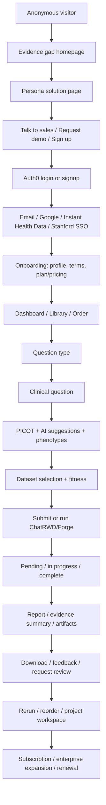
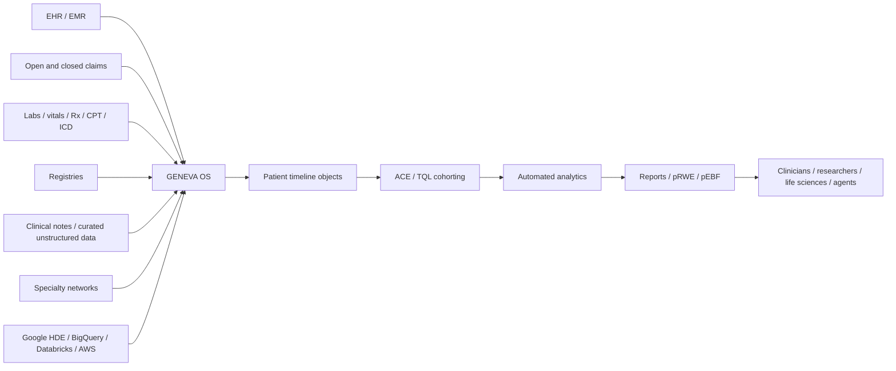
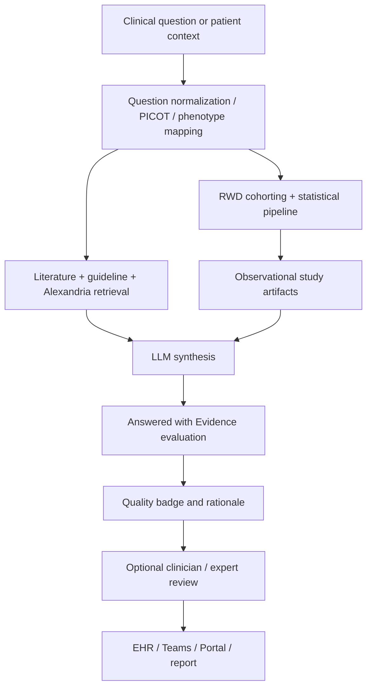
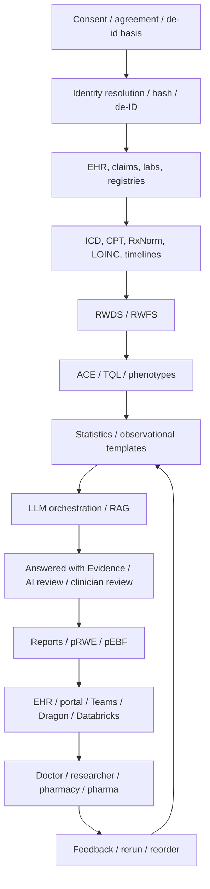
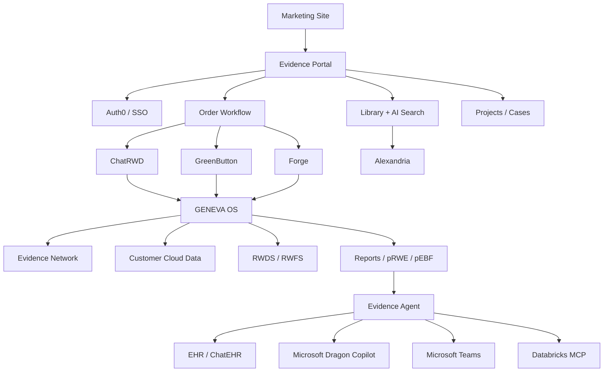

# Atropos Health Competitive Intelligence Report for Ovexis

**Date:** 2026-07-25  
**Target company:** Atropos Health  
**Category:** Real World Evidence AI Platform / Evidence Generation OS  
**Prepared for:** Ovexis board-level strategy discussion  

## Evidence Label Standard

- 🟢 **Confirmed** = directly stated in a public source or directly observed in a public web asset during this investigation.
- 🟡 **Strong Inference** = logically inferred from multiple public signals, but not explicitly confirmed by Atropos.
- 🔴 **Speculation** = plausible future or internal-strategy hypothesis, not verified.
- 🟢 **Scope rule:** This investigation used public websites, press releases, public patent pages, public job postings, public GitHub metadata, public portal/login pages, and passive inspection of public JavaScript assets only.
- 🟢 **Safety rule:** No unauthorised access, credential use, authenticated API probing, vulnerability testing, or data extraction was attempted.
- 🟢 **Screenshot limitation:** The available tools returned text/page evidence and image URLs, but did not provide a browser screenshot function; the evidence register therefore marks screenshot fields as “not captured; source URL/excerpt provided.”

---

# DELIVERABLE 1 — Executive Summary

## What are they building?

- 🟢 Atropos Health is building **GENEVA OS®**, described by Atropos as the “Generative Evidence Acceleration Operating System” and the first operating system for healthcare evidence generation. Source: https://www.atroposhealth.com/geneva-os/
- 🟢 Atropos Health’s public product stack includes **GENEVA OS®, Atropos Evidence™ Network, Data Quality Scoring, Green Button®, ChatRWD®, Forge®, Alexandria®, and Atropos Evidence™ Agent**. Source: https://www.atroposhealth.com/
- 🟢 Atropos states that it creates high-quality personalized Real-World Evidence “in minutes and at scale.” Source: https://www.atroposhealth.com/
- 🟡 Strategic interpretation: Atropos is not just an RWE analytics vendor; it is attempting to become the **evidence infrastructure layer** between clinical data, clinical decision-making, research workflows, life-sciences evidence needs, and clinical AI.

## Why does it exist?

- 🟢 Atropos frames its mission around “The Evidence Gap,” stating that only 14% of daily medical decisions are backed by high-quality evidence. Source: https://www.atroposhealth.com/
- 🟢 Atropos states that healthcare data is plentiful but siloed, and that converting data into high-quality evidence takes months and is resource-intensive. Source: https://www.atroposhealth.com/
- 🟢 Atropos’s launch release states that over 80% of patient care decisions lack clinical evidence and that many clinical studies exclude comorbid, complex, or demographically underrepresented patients. Source: https://www.prnewswire.com/news-releases/atropos-health-announces-launch-and-seed-funding-round-to-bring-real-world-data-driven-digital-evidence-to-the-point-of-care-301190311.html
- 🟡 Strategic interpretation: Atropos exists because **clinical decisions are frequent, evidence is incomplete, and traditional evidence production is too slow for care delivery or fast-moving life-sciences teams**.

## Customer, emotional, and operational problems

- 🟢 The health-system problem is the need to securely access insights from institutional data, Evidence Network data, and retrospective observational studies for quality, population health, value-based care, pharmacy, clinical education, research, and clinical practice. Source: https://www.atroposhealth.com/health-systems/
- 🟢 The life-sciences problem is the need to accelerate evidence generation with high-quality methodologies and reliable outputs across HEOR, medical affairs, R&D, precision medicine, and commercial analytics. Source: https://www.atroposhealth.com/life-sciences/
- 🟢 The pharmacy problem includes drug cost pressure, pharmacist burnout, inadequate time for patient care, and laborious manual chart review. Source: https://www.atroposhealth.com/pharmacy/
- 🟢 The VBC/quality problem includes analytics underuse due to lack of strategy, data expertise, resources, or training. Source: https://www.atroposhealth.com/value-based-care-quality/
- 🟡 The emotional problem for clinicians is **uncertainty under time pressure** when guidelines and RCTs do not reflect the complex patient in front of them.
- 🟡 The emotional problem for health-system executives is **fear of failing cost, quality, throughput, VBC, and safety targets** without credible evidence for intervention.
- 🟡 The emotional problem for pharma and HEOR teams is **credibility risk under deadline pressure** when evidence requests, payer questions, regulatory questions, and launch decisions require defensible support.

## Who is the customer and who is not?

- 🟢 Confirmed customer groups include health systems, life-sciences organizations, clinicians, researchers, pharmacy teams, VBC/quality teams, GME programs, data providers, and technology solution partners. Sources: https://www.atroposhealth.com/health-systems/ ; https://www.atroposhealth.com/life-sciences/ ; https://www.atroposhealth.com/atropos-evidence-network/
- 🟢 Atropos’s Terms state that Atropos is not a healthcare provider and does not provide medical advice, diagnosis, or treatment. Source: https://www.atroposhealth.com/terms-of-service/
- 🟡 The primary buyer is enterprise/institutional rather than mass-market consumer.
- 🟡 Atropos is not positioned as a consumer wellness app, direct-to-patient primary care app, or consumer lab-testing membership.

## Category creation and replacement

- 🟢 Atropos explicitly positions GENEVA OS as an operating system for healthcare evidence generation. Source: https://www.atroposhealth.com/geneva-os/
- 🟢 Atropos explicitly positions ChatRWD as the first generative AI application delivering full observational studies on healthcare data in minutes. Source: https://www.atroposhealth.com/chatrwd/
- 🟡 Category created: **Evidence Generation OS / AI-powered RWE operating layer / clinical evidence infrastructure**.
- 🟡 Categories replaced: manual chart review, slow HEOR studies, outsourced RWE analytics, ad hoc SQL analytics, literature-only clinical decision support, and static RWD data purchases.

## Jobs-To-Be-Done

- 🟢 **Clinician JTBD:** Generate evidence from patients like mine when published literature does not answer a patient-specific question quickly enough.
- 🟢 **Researcher JTBD:** Convert a hypothesis into a publication-grade retrospective observational study without months of data engineering.
- 🟢 **Pharmacy JTBD:** Replace manual chart review with comparative effectiveness and cost evidence for formulary decisions.
- 🟢 **Life-sciences JTBD:** Generate defensible evidence for HEOR, protocol feasibility, unmet need, label expansion, medical affairs, and commercial planning.
- 🟢 **Data-provider JTBD:** Activate, benchmark, and monetize a dataset without transferring raw patient-level data.
- 🟡 **AI-platform JTBD:** Ground clinical AI outputs in generated and retrieved evidence to reduce hallucination and improve trust.

## Core philosophy

- 🟢 Atropos’s stated mission is “to accelerate the generation of actionable evidence to improve healthcare outcomes for everyone.” Source: https://www.atroposhealth.com/about-us/
- 🟢 Atropos’s stated vision is “to be the leading generative platform and trusted source for novel evidence to inform healthcare decisions.” Source: https://www.atroposhealth.com/about-us/
- 🟡 Atropos’s core philosophy is: **learn from the care of prior patients, generate evidence with transparent methodology, review it clinically, and embed it in workflows where decisions happen**.

---

# DELIVERABLE 2 — Company Intelligence

## Timeline

- 🟢 **2011:** Atropos traces its origin to an EMR-era evidence-based medicine example involving rapid EHR assessment for anticoagulation. Source: https://www.atroposhealth.com/about-us/
- 🟢 **2014:** The “Green Button” concept was published as a way to use aggregate patient data at the point of care. Source: https://www.atroposhealth.com/about-us/
- 🟢 **2016:** ACE and TQL emerged from Stanford work on longitudinal patient record search. Source: https://www.atroposhealth.com/about-us/
- 🟢 **2018:** Stanford physicians operated the world’s first informatics consult pilot. Source: https://www.atroposhealth.com/about-us/
- 🟢 **2020:** Atropos Health launched and announced undisclosed seed funding. Source: https://www.prnewswire.com/news-releases/atropos-health-announces-launch-and-seed-funding-round-to-bring-real-world-data-driven-digital-evidence-to-the-point-of-care-301190311.html
- 🟢 **2021:** Stanford Health Care selected Atropos to support decision-making across 2,000+ affiliated physicians and license ACE. Source: https://www.atroposhealth.com/atropos-health-selected-by-stanford-health-care-to-provide-data-driven-consult-service-to-physicians/
- 🟢 **2021:** Atropos announced additions to its founding team: Neil Sanghavi, Sharath Reddy, Vladimir Polony, and Yen Low. Source: https://www.atroposhealth.com/atropos-health-announces-key-additions-to-its-founding-team/
- 🟢 **2022:** Atropos announced a $14M Series A led by Breyer Capital with Emerson Collective and Boston Millennia Partners. Source: https://www.atroposhealth.com/series-a/
- 🟢 **2022:** Mayo Clinic Platform partnered with Atropos to bring RWE to the bedside. Source: https://www.atroposhealth.com/mayo-partnership/
- 🟢 **2023:** Atropos announced Atropos Evidence Network, RWDS, and RWFS. Source: https://www.atroposhealth.com/pr-evidence-network-data-score/
- 🟢 **2023:** Atropos launched in AWS Marketplace and joined the AWS Partner Network. Source: https://www.atroposhealth.com/press-release-partner-amazon-atropos/
- 🟢 **2023:** Atropos announced strategic financing from Presidio Ventures, Samsung Next, Gaingels, Audere Capital, and others, with international focus on Japan and Brazil. Source: https://www.atroposhealth.com/pr-financing-global/
- 🟢 **2023:** Atropos launched GENEVA OS and ChatRWD. Source: https://www.atroposhealth.com/atropos-health-launches-new-geneva-os-and-chatrwd-application-for-rapid-real-world-evidence-with-generative-ai/
- 🟢 **2023:** Atropos partnered with SEQSTER for patient registries and clinical research. Source: https://www.atroposhealth.com/partnership-announcement-atropos-health-and-seqster/
- 🟢 **2024:** Arcadia joined the Atropos Evidence Network for VBC decision-making. Source: https://www.atroposhealth.com/atropos-health-partners-with-arcadia-to-accelerate-rwe-for-vbc/
- 🟢 **2024:** Atropos optimized GENEVA OS for Google Cloud Healthcare Data Engine APIs and BigQuery. Source: https://www.atroposhealth.com/atropos-health-leverages-google-cloud/
- 🟢 **2024:** Atropos raised a $33M Series B led by Valtruis, with participation from Cencora Ventures, McKesson Ventures, Merck GHI Fund, Breyer Capital, Emerson Collective, and Presidio Ventures. Source: https://www.atroposhealth.com/series-b/
- 🟢 **2025:** Atropos collaborated with Merck for rapid evidence generation. Source: https://www.atroposhealth.com/atropos-health-collaborates-with-merck-for-rapid-evidence-generation-to-accelerate-innovation-for-life-saving-treatments/
- 🟢 **2025:** Atropos announced RWD-trained AI models for identifying patients living with undiagnosed conditions. Source: https://www.atroposhealth.com/atropos-health-accelerates-precision-medicine-for-life-sciences-with-deployment-of-artificial-intelligence-ai-models-trained-on-real-world-data/
- 🟢 **2025:** Atropos and xCures partnered on source-verified AI decision-support tools. Source: https://www.atroposhealth.com/atropos-health-and-xcures-advance-artificial-intelligence-ai-to-improve-clinical-decision-making-and-patient-outcomes/
- 🟢 **2025:** Atropos partnered with Databricks to use Delta Sharing across the Evidence Network. Source: https://www.atroposhealth.com/atropos-health-partners-with-databricks-to-accelerate-evidence-generation-and-advance-precision-medicine-in-healthcare/
- 🟢 **2025:** Atropos launched Evidence Agent at Stanford Health Care and announced Microsoft collaboration. Source: https://www.atroposhealth.com/atropos-health-launches-the-atropos-evidence-agent-at-stanford-health-care-and-collaborates-with-microsoft-to-improve-evidence-based-personalized-medicine-at-the-point-of-care/
- 🟢 **2025:** Atropos Evidence Agent integrated with Microsoft Teams. Source: https://www.atroposhealth.com/the-atropos-evidence-agent-is-now-integrated-with-microsoft-teams/
- 🟢 **2026:** Atropos announced Sylvia Isler as CTO and Drew Turitz as CFO. Source: https://www.atroposhealth.com/atropos-health-announces-key-new-hires-to-scale-high-quality-evidence-utilization-in-the-healthcare-ecosystem/
- 🟢 **2026:** Atropos expanded Microsoft Dragon Copilot collaboration at Stanford Medicine. Source: https://www.atroposhealth.com/atropos-evidence-agent-collaboration-microsoft/
- 🟢 **2026:** Alexandria was announced as a library with 33M evidence artifacts and target scale of 2B studies by end of 2026. Source: https://www.atroposhealth.com/alexandria/
- 🟢 **2026:** Atropos launched Evidence Agent MCP on Databricks Marketplace. Source: https://www.atroposhealth.com/atropos-health-expands-partnership-with-databricks-with-the-launch-of-the-atropos-evidence-agent-mcp-on-databricks-marketplace/
- 🟢 **2026:** Atropos and Guidehouse launched a point-of-care CDS solution for life sciences. Source: https://www.atroposhealth.com/atropos-health-and-guidehouse-launch-point-of-care-clinical-decision-support-solution-for-life-sciences/

## Founders and leadership

- 🟢 Atropos publicly lists **Nigam Shah, Brigham Hyde, and Saurabh Gombar** as founders. Source: https://www.atroposhealth.com/about-us/
- 🟢 Brigham Hyde is CEO and co-founder. Source: https://www.atroposhealth.com/about-us/
- 🟢 Saurabh Gombar is CMO and co-founder. Source: https://www.atroposhealth.com/about-us/
- 🟢 Nigam Shah is co-founder and Chief Data Scientist at Stanford Health Care. Source: https://www.atroposhealth.com/about-us/
- 🟢 Public leadership includes Brigham Hyde, Saurabh Gombar, Cory Wiegert, Kevin Smith, Drew Turitz, Sylvia Isler, Neil Sanghavi, and Cecily Harris. Source: https://www.atroposhealth.com/about-us/
- 🟢 Public board members include Nigam Shah, Brigham Hyde, Matthew Bettonville, Mike Spadafore, and Michael Weintraub. Source: https://www.atroposhealth.com/about-us/

## Investors, funding, valuation, acquisitions

- 🟢 Seed funding was announced in 2020, but financial details were not disclosed. Source: https://www.prnewswire.com/news-releases/atropos-health-announces-launch-and-seed-funding-round-to-bring-real-world-data-driven-digital-evidence-to-the-point-of-care-301190311.html
- 🟢 Series A funding was $14M. Source: https://www.atroposhealth.com/series-a/
- 🟢 Series B funding was $33M. Source: https://www.atroposhealth.com/series-b/
- 🟢 Public investor names include Breyer Capital, Emerson Collective, Boston Millennia Partners, Presidio Ventures, Samsung Next, Gaingels, Audere Capital, Valtruis, Cencora Ventures, McKesson Ventures, and Merck Global Health Innovation Fund. Sources: https://www.atroposhealth.com/series-a/ ; https://www.atroposhealth.com/series-b/ ; https://www.atroposhealth.com/pr-financing-global/
- 🟢 No public source reviewed confirmed Atropos’s private valuation.
- 🟢 No public source reviewed confirmed acquisitions by Atropos or of Atropos.

## Patents, papers, open source

- 🟢 US20230153757A1 covers rapid informatics-based prognosis and treatment development through consult requests, study templates, cohort data, and consult outputs. Source: https://patents.google.com/patent/US20230153757A1/en
- 🟢 US20250078969A1 covers automated evidence generation from natural language questions using defined question formats, phenotype libraries, medical coding, patient record retrieval, statistical analysis, and literature summarization. Source: https://patents.google.com/patent/US20250078969A1/en
- 🟢 US20260080983A1 covers deidentified data processing using worker nodes, patient timeline vectors, hashes/unique identifiers, compressed tables, and relative dates. Source: https://patents.google.com/patent/US20260080983A1/en
- 🟢 Atropos’s public GitHub organization includes forks/repositories related to HELM, FAISS, security-policy templates, an R theming package, HealthBench, and PNH examples. Source: https://github.com/atroposhealth
- 🟢 Atropos’s research pages include publications or summaries on ACE, Green Button, LLM/RAG/agentic systems, high-throughput evidence generation, and many clinical RWE studies. Sources: https://www.atroposhealth.com/publications/ ; https://www.atroposhealth.com/high-throughput-observational-evidence-generation-using-linked-electronic-health-record-and-claims-data/ ; https://www.atroposhealth.com/answering-real-world-clinical-questions-using-large-language-model-retrieval-augmented-generation-and-agentic-systems/

---

# DELIVERABLE 3 — Founder Psychology

- 🟡 The founders appear to believe that medicine’s bottleneck is not only data access, but **evidence-generation latency**.
- 🟡 The founders appear to believe clinicians will trust AI only if outputs are tied to transparent statistics, real-world patient data, citations, clinical review, and refusal when evidence is insufficient.
- 🟡 The founders appear to view RWE as a bridge between care delivery, research, life-sciences commercialization, AI safety, and healthcare economics.
- 🟡 Brigham Hyde’s health-tech/RWD background suggests a bias toward enterprise distribution, strategic investors, data partnerships, and category-scale commercialization.
- 🟡 Nigam Shah’s Stanford informatics background suggests a product philosophy rooted in peer-reviewed methods, clinical informatics, and the learning health system.
- 🟡 Saurabh Gombar’s clinical positioning suggests the company intentionally makes the product feel like a consult or second opinion rather than a raw analytics dashboard.
- 🔴 The 10-year ambition is plausibly to become the default evidence substrate for clinical AI, life-sciences evidence, hospital analytics, and LLM grounding.
- 🔴 The likely internal strategy is to expand from “RWE on demand” to “evidence embedded everywhere decisions are made.”

---

# DELIVERABLE 4 — Product Reverse Engineering

## Product inventory

- 🟢 **GENEVA OS®** is the federated operating system installed in customer cloud environments, with no data movement, patient timeline objects, TQL, ACE, and automated analytics. Source: https://www.atroposhealth.com/geneva-os/
- 🟢 **Atropos Evidence™ Network** is a federated RWD network with 300M+ deidentified patient records, 100K unique conditions/medications, and 40+ clinical specialties. Source: https://www.atroposhealth.com/atropos-evidence-network/
- 🟢 **Data Quality Scoring** includes RWDS for dataset-level quality and RWFS for question-specific fit-for-purpose scoring. Source: https://www.atroposhealth.com/data-quality-scoring/
- 🟢 **Green Button®** is a Q&A-style evidence-generation service that returns clinician-QC’d publication-grade observational reports in under 48 hours. Source: https://www.atroposhealth.com/green-button/
- 🟢 **ChatRWD®** is a generative AI chat-to-database application that generates full observational studies in minutes. Source: https://www.atroposhealth.com/chatrwd/
- 🟢 **Forge®** is a low-code research platform for technical/power users to run counts, feasibility, cohort exploration, observational designs, and visual artifacts. Source: https://www.atroposhealth.com/forge/
- 🟢 **Alexandria®** is the evidence library with 33M pEBFs and a stated target of 2B pEBFs by end of 2026. Source: https://www.atroposhealth.com/alexandria/
- 🟢 **Atropos Evidence™ Agent** surfaces personalized evidence pre-visit, during visit via ambient/Dragon workflows, and post-visit via Teams/care-team collaboration. Source: https://www.atroposhealth.com/atropos-evidence-agent/
- 🟢 **Commercial Analytics** supports market sizing, segmentation, HCP/account targeting, patient journey, switching behavior, market share, omnichannel optimization, and launch tracking. Source: https://www.atroposhealth.com/commercial-analytics/

## Public portal passive reverse engineering

- 🟢 The public portal login redirects to Auth0 and displays email login, signup, Google, Instant Health Data, and Stanford SSO. Source: https://portal.atroposhealth.com/order
- 🟢 Passive inspection of the public portal JavaScript bundle showed routes for dashboard, library, order, question type, clinical question, profile, onboarding, plan/pricing, search, projects, cases, evidence summary, analytics, and rapid analytics. Source: https://portal.atroposhealth.com/assets/index-p4OrMq7T.js
- 🟢 Passive inspection showed API path categories for orders, order sessions, PDFs, feedback, request review, reorder, PICOT, AI suggestions, phenotypes, code sets, named entities, PubMed search, evidence summary, projects, users, notifications, and subscription checkout. Source: https://portal.atroposhealth.com/assets/index-p4OrMq7T.js
- 🟢 Passive inspection showed PHI upload warnings, a 25MB file-size constraint, and allowed file formats including docx, PDF, CSV, xlsx, and pptx. Source: https://portal.atroposhealth.com/assets/index-p4OrMq7T.js
- 🟢 Passive inspection showed free, standard, and enterprise subscription messaging and Stripe checkout-related functions. Source: https://portal.atroposhealth.com/assets/index-p4OrMq7T.js
- 🟢 No private data, authenticated workflow, or restricted API access was used.

## Retention and growth loops

- 🟡 **Question loop:** user asks a question, receives answer, learns, asks again.
- 🟡 **Rerun loop:** study templates and prior evidence can be rerun on local or network data.
- 🟡 **Review loop:** users can request clinician review or provide feedback, improving trust and outputs.
- 🟡 **Library loop:** each generated/evaluated artifact strengthens Alexandria and future answer coverage.
- 🟡 **Network loop:** more data partners improve answer coverage, which improves customer value, which attracts more data partners.
- 🟡 **Workflow loop:** EHR/Teams/Dragon integrations reduce friction, raising usage frequency and evidence library expansion.

---

# DELIVERABLE 5 — Complete User Journey

- 🟢 The website-to-demo path is visible through homepage and contact CTAs. Source: https://www.atroposhealth.com/
- 🟢 The login path is visible through the portal/Auth0 login page. Source: https://portal.atroposhealth.com/order
- 🟢 The order/search/project/evidence-summary paths are visible in the public portal bundle. Source: https://portal.atroposhealth.com/assets/index-p4OrMq7T.js
- 🟡 Consent and PHI handling appear to occur through Terms, Privacy Policy, enterprise agreements, and upload warnings rather than consumer-style patient consent screens.
- 🟡 Support and renewal are not fully visible, but support email, subscription states, and enterprise messaging indicate account-management workflows.

---

# DELIVERABLE 6 — UX Research

- 🟢 The marketing site uses trust signals including publications, media logos, testimonials, advisory boards, investor logos, partner logos, saved-dollar claims, and a SOC2 badge image. Sources: https://www.atroposhealth.com/ ; https://www.atroposhealth.com/about-us/
- 🟢 The navigation is persona-based across Health Systems, Pharmacy, Research Informatics, VBC/Quality, GME, Life Sciences, Precision Medicine, HEOR, R&D, and Commercial Analytics. Source: https://www.atroposhealth.com/
- 🟢 The site includes cookie consent categories for functional, preferences, statistics, and marketing. Source: https://www.atroposhealth.com/
- 🟢 Passive header inspection showed the marketing site served through Cloudflare and WP Engine.
- 🟡 The design system appears enterprise-healthcare oriented, using institutional trust, proof metrics, clinical language, professional imagery, and product-module cards.
- 🟡 Conversion optimization relies on credible proof rather than low-friction consumer self-serve.
- 🟢 Public evidence did not confirm dark mode.
- 🟡 Accessibility was not audited; cookie banners, carousels, embedded videos, and image-heavy sections may create accessibility risk if not implemented carefully.

---

# DELIVERABLE 7 — Healthcare Workflow

- 🟢 **Clinical workflow:** Green Button, ChatRWD, and Evidence Agent create or surface evidence for clinician review. Sources: https://www.atroposhealth.com/green-button/ ; https://www.atroposhealth.com/chatrwd/ ; https://www.atroposhealth.com/atropos-evidence-agent/
- 🟢 **Point-of-care workflow:** Stanford/Microsoft pilots embed personalized evidence into EHR and ambient workflows. Sources: https://www.atroposhealth.com/atropos-health-launches-the-atropos-evidence-agent-at-stanford-health-care-and-collaborates-with-microsoft-to-improve-evidence-based-personalized-medicine-at-the-point-of-care/ ; https://www.atroposhealth.com/atropos-evidence-agent-collaboration-microsoft/
- 🟢 **Care-team workflow:** Microsoft Teams integration enables evidence during multidisciplinary care-team collaborations such as tumor boards. Source: https://www.atroposhealth.com/the-atropos-evidence-agent-is-now-integrated-with-microsoft-teams/
- 🟢 **Pharmacy workflow:** Atropos supports formulary management, drug cost decisions, medication utilization, adverse events, and P&T decision support. Sources: https://www.atroposhealth.com/pharmacy/ ; https://www.atroposhealth.com/user-story-formulary-management/
- 🟢 **Hospital workflow:** Health-system workflows include quality, population health, VBC, pharmacy, education, clinical care, and publishing. Source: https://www.atroposhealth.com/health-systems/
- 🟢 **Life-sciences workflow:** Workflows include HEOR, medical affairs, RWE, R&D, precision medicine AI/ML, and commercial analytics. Source: https://www.atroposhealth.com/life-sciences/
- 🟡 **Insurance workflow:** Direct payer workflow is not deeply documented publicly, but VBC, cost-of-care, claims, and formulary economics imply payer relevance.
- 🟢 **Patient workflow:** Public materials do not show Atropos as a direct patient app.

---

# DELIVERABLE 8 — Healthcare Data Architecture

- 🟢 Evidence Network packages include open and closed claims, RxNorm, CPT, labs, registry data, EMR, vitals, ICD-9/10, inpatient, outpatient, pharmacy, payer, and lab-sourced data. Source: https://www.atroposhealth.com/atropos-evidence-network/
- 🟢 GENEVA OS converts medical data to an in-memory database storing patient timeline objects. Source: https://www.atroposhealth.com/geneva-os/
- 🟢 ACE structures patient records as longitudinal patient-oriented objects. Source: https://www.atroposhealth.com/geneva-os/
- 🟢 Federated Nodal Deidentification supports safe-harbor encoding, cross-node queries, and no required data transfer. Source: https://www.atroposhealth.com/atropos-health-announces-addition-of-federated-nodal-deidentification-to-geneva-os-platform-to-support-secure-privacy-preserving-longitudinal-patient-record-queries-for-atropos-evidence/
- 🟢 Atropos announced death linkage at query time for Evidence Network members. Source: https://www.atroposhealth.com/atropos-health-announces-addition-of-federated-nodal-deidentification-to-geneva-os-platform-to-support-secure-privacy-preserving-longitudinal-patient-record-queries-for-atropos-evidence/
- 🟢 The deidentified data patent describes worker nodes, primary nodes, patient timeline vectors, hash/unique identifiers, compressed data tables, and relative dates. Source: https://patents.google.com/patent/US20260080983A1/en
- 🟡 FHIR is not confirmed as a public Atropos API; Google Healthcare Data Engine API integration makes FHIR-adjacent interoperability plausible, but not proven.
- 🟢 Apple Health, Google Health Connect, consumer wearables, imaging, and genomics are not confirmed as direct Atropos integrations in public Atropos product docs reviewed.
- 🟢 SEQSTER’s partner description includes EHRs, genomic DNA, wearables, pharmacy, and social determinants data, but that does not prove Atropos directly ingests all of them. Source: https://www.atroposhealth.com/partnership-announcement-atropos-health-and-seqster/

---

# DELIVERABLE 9 — AI Reverse Engineering

- 🟢 Atropos says ChatRWD uses an LLM as an interface while evidence is generated by established statistical methods applied to deidentified medical records. Source: https://www.atroposhealth.com/atropos-health-launches-new-geneva-os-and-chatrwd-application-for-rapid-real-world-evidence-with-generative-ai/
- 🟢 Evidence Agent uses multiple LLMs and assesses responses for each query. Source: https://www.atroposhealth.com/atropos-evidence-agent/
- 🟢 Evidence Agent combines literature/guidelines and novel patient-specific RWE at the point of care. Source: https://www.atroposhealth.com/atropos-health-launches-the-atropos-evidence-agent-at-stanford-health-care-and-collaborates-with-microsoft-to-improve-evidence-based-personalized-medicine-at-the-point-of-care/
- 🟢 Atropos uses an “Answered with Evidence” evaluation framework with green/yellow/red scoring. Source: https://www.atroposhealth.com/the-impact-of-alexandrias-33m-pebfs-on-llm-performance-against-real-physician-questions/
- 🟢 Alexandria includes Answered with Evidence evaluation, AI review, optional expert clinician review, and independent third-party review. Sources: https://www.atroposhealth.com/alexandria/ ; https://www.atroposhealth.com/atropos-health-introduces-scientific-multi-layered-evidence-review-process-for-studies-in-alexandria-the-atropos-evidence-library/
- 🟢 A Digital Health manuscript summary states that general-purpose LLMs rarely produced relevant evidence-based answers and that ChatRWD was able to provide actionable answers when preexisting studies were lacking. Source: https://www.atroposhealth.com/answering-real-world-clinical-questions-using-large-language-model-retrieval-augmented-generation-and-agentic-systems/
- 🟢 Public sources reviewed do not confirm specific production LLM providers.
- 🟡 Atropos’s AI architecture is likely an orchestration architecture combining RAG, ontology/phenotype mapping, RWD study generation, LLM synthesis, evidence evaluation, and human review.

---

# DELIVERABLE 10 — Technical Reverse Engineering

- 🟢 Passive header inspection showed the marketing site served through Cloudflare and WP Engine.
- 🟢 Marketing pages expose WordPress/Divi-style assets, HubSpot forms/video assets, cookie-consent tooling, and Google Tag Manager patterns.
- 🟢 The public portal is a React/Vite single-page app based on public bundle naming and public bundle content. Source: https://portal.atroposhealth.com/assets/index-p4OrMq7T.js
- 🟢 The portal uses Auth0 login and visible SSO options. Source: https://portal.atroposhealth.com/order
- 🟢 The public portal bundle includes references to Mixpanel, Amplitude, Google Analytics, Sentry, Flagsmith, and Stripe. Source: https://portal.atroposhealth.com/assets/index-p4OrMq7T.js
- 🟢 Public docs confirm AWS Marketplace/APN, Google Cloud HDE/BigQuery, Databricks Delta Sharing/Marketplace, Microsoft Teams/Dragon Copilot, and cloud-independent federated installation. Sources: https://www.atroposhealth.com/press-release-partner-amazon-atropos/ ; https://www.atroposhealth.com/atropos-health-leverages-google-cloud/ ; https://www.atroposhealth.com/atropos-health-partners-with-databricks-to-accelerate-evidence-generation-and-advance-precision-medicine-in-healthcare/ ; https://www.atroposhealth.com/atropos-evidence-agent-collaboration-microsoft/
- 🟢 Public sources reviewed do not confirm backend language, primary database, cache, queue, CI/CD, monitoring stack beyond Sentry reference, or CDN beyond Cloudflare.
- 🟡 Engineering maturity is relatively high for a Series B company because the public stack shows identity, feature flags, analytics, subscriptions, structured workflow APIs, cloud marketplaces, and federated data architecture.

---

# DELIVERABLE 11 — API Investigation

- 🟢 Passive inspection of the public portal bundle indicates an API base under `https://portal.atroposhealth.com/api`. Source: https://portal.atroposhealth.com/assets/index-p4OrMq7T.js
- 🟢 Public bundle categories include orders, sessions, search, AI search jobs, PubMed search, PICOT, phenotypes, evidence summaries, projects, users, notifications, feedback, review requests, and subscription checkout. Source: https://portal.atroposhealth.com/assets/index-p4OrMq7T.js
- 🟢 No public OpenAPI specification, SDK documentation, FHIR developer guide, webhook documentation, or rate-limit documentation was found in this research pass.
- 🟢 No authenticated APIs were called.
- 🟡 Atropos appears to prioritize enterprise integrations and marketplace packaging over open developer self-service.
- 🟡 Ovexis can differentiate by publishing OpenAPI, SMART-on-FHIR, FHIR Bulk Data, OAuth, webhooks, sandbox docs, and sample apps from day one.

---

# DELIVERABLE 12 — Security Investigation

- 🟢 GENEVA OS installs behind the customer firewall and sensitive patient data stays where it is. Source: https://www.atroposhealth.com/geneva-os/
- 🟢 The Evidence Network is federated and deidentified data does not change hands. Source: https://www.atroposhealth.com/pr-evidence-network-data-score/
- 🟢 AWS and Google Cloud pages state secure access to RWE in compliance with HIPAA. Sources: https://www.atroposhealth.com/press-release-partner-amazon-atropos/ ; https://www.atroposhealth.com/atropos-health-leverages-google-cloud/
- 🟢 Atropos displays a SOC2 image badge in the site footer. Source: https://www.atroposhealth.com/
- 🟢 Privacy Policy warns users not to submit PHI unless an applicable agreement permits it. Source: https://www.atroposhealth.com/privacy-policy/
- 🟢 Terms prohibit attempting to identify individuals who are subjects of Deliverables or Platform data. Source: https://www.atroposhealth.com/terms-of-service/
- 🟢 Terms state that users must remove PII/PHI from User Content unless governed by an agreement. Source: https://www.atroposhealth.com/terms-of-service/
- 🟢 Public sources reviewed do not confirm encryption details, audit-log capabilities, BAA templates, SOC2 report availability, or pen-test summaries.
- 🟡 Security moat is medium-to-strong because the federated/no-data-movement design directly addresses hospital and life-sciences data governance objections.

---

# DELIVERABLE 13 — Business Model

- 🟢 Atropos sells to health systems and life-sciences organizations. Sources: https://www.atroposhealth.com/health-systems/ ; https://www.atroposhealth.com/life-sciences/
- 🟢 Atropos offers Evidence Network Silver, Gold, and Platinum packages. Source: https://www.atroposhealth.com/atropos-evidence-network/
- 🟢 Passive portal inspection shows free, standard, and enterprise subscription messaging plus Stripe checkout. Source: https://portal.atroposhealth.com/assets/index-p4OrMq7T.js
- 🟢 Public pages do not show transparent enterprise pricing.
- 🟡 Likely revenue streams include enterprise platform fees, evidence-generation services, life-sciences analytics contracts, data-network access, marketplace procurement, and possibly per-study/per-seat plans.
- 🟡 Margins likely improve as ChatRWD, Forge, Alexandria, and Evidence Agent reduce clinician/data-science labor per output.
- 🟡 Sales motion is consultative enterprise selling with strong sales engineering, not pure self-serve PLG.

## Business Model Canvas

| Block | Assessment |
|---|---|
| Customer Segments | 🟢 Health systems, life sciences, clinicians, researchers, pharmacy, VBC, GME, data partners. |
| Value Proposition | 🟢 Publication-grade RWE in minutes to 48h, from local or network data, with data fitness and clinical/evidence review. |
| Channels | 🟢 Direct sales, website/demo, AWS, Google Cloud, Microsoft Marketplace, Databricks Marketplace, strategic partnerships. |
| Customer Relationships | 🟡 Enterprise account management, clinical consults, advisory-board trust, implementation/support. |
| Revenue Streams | 🟡 Platform subscriptions, evidence-generation services, data-network access, life-sciences analytics, marketplace procurement. |
| Key Resources | 🟢 GENEVA OS, Evidence Network, Alexandria, patents, TQL/ACE, clinical team, partnerships, publications. |
| Key Activities | 🟢 Evidence generation, data onboarding/scoring, AI orchestration, clinical review, enterprise integration. |
| Key Partners | 🟢 Stanford, Mayo, Arcadia, Merck, Databricks, Microsoft, Google Cloud, AWS, SEQSTER, Every Cure, xCures, Guidehouse. |
| Cost Structure | 🟡 Engineering, clinical informatics, data science, compliance, cloud/integration, sales, partnerships. |

---

# DELIVERABLE 14 — Growth Strategy

- 🟢 Atropos uses press releases, partner announcements, awards, publications, customer stories, and blogs as a growth engine. Source: https://www.atroposhealth.com/resources/
- 🟢 Atropos uses strategic partnerships with cloud platforms, health systems, data platforms, Microsoft, Databricks, and life-sciences companies as distribution channels. Sources: https://www.atroposhealth.com/press-release/ ; https://www.atroposhealth.com/news-media/
- 🟢 Atropos has public recognition from CB Insights AI 100, TIME Best Inventions 2025, and Fierce 15 2026. Sources: https://www.atroposhealth.com/atropos-health-named-to-the-2025-cb-insights-list-of-the-100-most-innovative-artificial-intelligence-ai-startups/ ; https://www.atroposhealth.com/atropos-health-named-to-times-the-best-inventions-of-2025/ ; https://www.atroposhealth.com/fierce-15-2026/
- 🟡 Growth loop: more partners -> more data -> more evidence -> better answer coverage -> stronger AI trust -> more enterprise adoption -> more pEBFs -> more partners.
- 🟡 Founder branding and academic credibility are central because clinical AI buyers require trust beyond standard SaaS marketing.

---

# DELIVERABLE 15 — Hiring Intelligence

- 🟢 Atropos says it is fully remote and requires US work authorization for full-time employees. Source: https://www.atroposhealth.com/careers/
- 🟢 Observed open positions were Staff Sales Engineer (Life Sciences), Medical Innovation Associate, and Future Openings. Source: https://jobs.ashbyhq.com/AtroposHealth
- 🟢 Staff Sales Engineer compensation is listed at $150K–$170K plus commission, requiring RWE/precision medicine, EMR/claims data, SQL, startup experience, and life-sciences customer-facing work. Source: https://jobs.ashbyhq.com/AtroposHealth/9b866c49-29b9-4621-b571-fb9db31707da
- 🟢 Medical Innovation Associate compensation is listed at $95K–$110K and emphasizes generative AI, Python/R/SQL, ICD-10/CPT/SNOMED/LOINC/RxNorm/NDC, content pipelines, APIs, and output QA. Source: https://jobs.ashbyhq.com/AtroposHealth/c710992f-e5dc-4dbf-8cac-5a7d968d344c
- 🟡 Hiring signals indicate focus on life-sciences revenue, clinical content generation, ontology mapping, LLM-assisted production, APIs, and scalable evidence content.

---

# DELIVERABLE 16 — Customer Intelligence

- 🟢 Atropos public testimonials include clinical and pharmacy users praising quick time-to-value, weekly use, academic presentations, and formulary decisions. Source: https://www.atroposhealth.com/
- 🟢 Emory formulary user story says a pharmacy leader submitted 11 questions over two months and used Atropos for formulary and protocol decisions. Source: https://www.atroposhealth.com/user-story-formulary-management/
- 🟢 The life-sciences page includes anonymized R&D, epidemiology, TA, clinician, former FDA, and HEOR testimonials praising speed, rigor, and data access. Source: https://www.atroposhealth.com/life-sciences/
- 🟢 Targeted public searches in this research pass did not surface robust independent Reddit, Hacker News, G2, Capterra, or Product Hunt review corpora for Atropos Health.
- 🟡 The absence of independent public reviews likely reflects enterprise/private usage rather than absence of user friction.

---

# DELIVERABLE 17 — Decision Ledger

| Feature | Why it was built | Pain solved | KPI improved | Trade-off |
|---|---|---|---|---|
| GENEVA OS | 🟢 Create evidence-generation infrastructure. | 🟢 Data-to-evidence latency. | 🟡 Time-to-study, enterprise adoption. | 🟡 Integration burden. |
| Evidence Network | 🟢 Access multi-source deidentified data. | 🟢 Local data gaps. | 🟡 Answer coverage, data partner value. | 🟡 Governance complexity. |
| RWDS/RWFS | 🟢 Select fit-for-purpose datasets. | 🟢 Data trust uncertainty. | 🟡 Study quality, buyer confidence. | 🟡 Scoring opacity. |
| Green Button | 🟢 Consult-style evidence for nontechnical users. | 🟢 Manual research burden. | 🟡 Adoption, trust. | 🟡 Human labor. |
| ChatRWD | 🟢 Convert natural language into studies. | 🟢 Slow analyst workflows. | 🟡 Usage frequency, margin. | 🟡 AI-safety burden. |
| Forge | 🟢 Give power users direct controls. | 🟢 Data-science bottlenecks. | 🟡 Expansion into analytics teams. | 🟡 Training complexity. |
| Alexandria | 🟢 Reuse and scale generated evidence. | 🟢 Repeated evidence gaps. | 🟡 Answer coverage, AI moat. | 🟡 Review/freshness burden. |
| Evidence Agent | 🟢 Put evidence into clinical workflow. | 🟢 Context switching and workflow friction. | 🟡 Point-of-care usage. | 🟡 Alert fatigue/liability. |
| Federated de-ID | 🟢 Enable cross-node longitudinal query without data transfer. | 🟢 Privacy/data-possession risk. | 🟡 Data partner conversion. | 🟡 Identity-resolution complexity. |
| Marketplaces | 🟢 Meet buyers in procurement/workflow channels. | 🟢 Procurement friction. | 🟡 Pipeline and distribution. | 🟡 Platform dependency. |

---

# DELIVERABLE 18 — Feature Dependency Graph

---

# DELIVERABLE 19 — Engineering Backlog Reconstruction

- 🟡 **MVP:** Stanford Green Button consult, ACE/TQL cohorting, human informaticist workflow, Prognostogram report.
- 🟡 **V2:** Stanford Health Care rollout, platform licensing, resident access, early commercial consult service.
- 🟡 **V3:** Evidence Network, RWDS/RWFS, data partner marketplace, AWS Marketplace, international channels.
- 🟡 **V4:** GENEVA OS, ChatRWD, Google Cloud/HDE, Arcadia VBC, life-sciences expansion, Series B scaling.
- 🟡 **Current:** Alexandria, Evidence Agent, Microsoft Dragon/Teams, Databricks MCP, federated nodal deidentification, commercial analytics, precision medicine AI models.
- 🟡 **Future:** deeper EHR embedding, more marketplaces, more pEBFs, stronger AI evidence evaluation, more life-sciences CDS, more specialty networks, stronger governance/audit tooling.
- 🟡 **Technical debt risk:** TQL/ACE, ontology mapping, data fitness scoring, clinical QA, federated nodes, and AI evaluations across heterogeneous data sources are likely costly to maintain.

---

# DELIVERABLE 20 — Competitive Landscape

- 🟢 Atropos competes most directly with RWE platforms, HEOR analytics vendors, clinical evidence/CDS platforms, healthcare data platforms, and emerging clinical AI agents.
- 🟢 OpenEvidence is described as a clinical decision support and medical search engine for healthcare professionals with sourced answers from peer-reviewed literature and NPI verification. [1](https://apps.apple.com/us/app/openevidence/id6612007783)
- 🟢 Glass Health is described as a clinical decision-support app generating clinical-question answers, differential diagnoses, and treatment-plan drafts for licensed healthcare professionals. [2](https://play.google.com/store/apps/details?id=health.glass.client&hl=en)
- 🟢 Function Health’s App Store listing describes 160+ lab tests, protocols, Private AI Chat, wearables, record uploads, and $365/year membership. [2](https://apps.apple.com/us/app/function-health/id6471280307)
- 🟢 Superpower’s App Store listing describes advanced lab testing, AI insights, clinician-supported care, health-record upload, wearables, and private AI chat. [3](https://apps.apple.com/us/app/superpower/id6747997159)
- 🟢 Levels is described as pairing CGM sensors with an app for real-time metabolic insights. [2](https://www.levels.com/partner/wgm)
- 🟢 Apollo 24/7’s App Store listing describes online medicines, lab tests, and doctor consultations in India. [2](https://apps.apple.com/in/app/apollo-247-health-medicine/id1496740273)
- 🟢 Practo’s App Store listing describes online doctor consultations, appointments, medicine ordering, diagnostic tests, and health plans in India. [1](https://apps.apple.com/in/app/practo-consult-doctor-online/id953772015)
- 🟢 Tata 1mg is described as an online pharmacy and healthcare platform for medicines, doctor consultations, and lab tests. [1](https://webcatalog.io/en/apps/1mg)
- 🟢 Healthify’s App Store listing describes AI calorie tracking, photo/voice meal logging, AI insights, and AI Nutrition Coach Ria. [2](https://apps.apple.com/in/app/healthify-ai-calorie-tracker/id943712366)
- 🟡 Compared with consumer preventive platforms, Atropos has stronger clinical/RWE depth but weaker consumer longitudinal engagement.
- 🟡 Compared with OpenEvidence/Glass/UpToDate/AMBOSS, Atropos’s key differentiation is generating novel observational evidence from RWD rather than only retrieving/summarizing existing medical knowledge.
- 🟡 Compared with Apollo/Practo/Tata 1mg, Atropos is not a care marketplace; it is evidence infrastructure.
- 🟢 “Regacore” and “PreventiveHealth.ai” could not be verified with sufficient public evidence in this pass.

---

# DELIVERABLE 21 — Moat Analysis

| Moat | Rating | Assessment |
|---|---|---|
| Data moat | 🟢 Strong | 🟢 Evidence Network, 300M+ records, specialty packages, de-ID architecture. |
| AI moat | 🟡 Medium-Strong | 🟢 ChatRWD, Agent, Answered with Evidence, Alexandria; 🟡 model providers not confirmed. |
| Clinical moat | 🟢 Strong | 🟢 Stanford origin, publications, clinician review, advisory boards. |
| Brand moat | 🟡 Medium | 🟢 Awards and media; 🟡 still niche outside enterprise RWE. |
| Distribution moat | 🟡 Medium-Strong | 🟢 AWS, Google, Microsoft, Databricks, Arcadia, Stanford, Mayo, Merck. |
| Developer moat | 🟡 Medium | 🟢 Databricks MCP; 🟢 no open developer docs found. |
| Marketplace moat | 🟡 Medium | 🟢 Evidence Network and cloud marketplaces; 🟡 network effects still forming. |
| Regulatory moat | 🟡 Medium | 🟢 HIPAA posture, no-data-movement, disclaimers; 🟢 no FDA clearance found. |
| Network effects | 🟡 Future/Medium | 🟡 More data -> more evidence -> more pEBFs -> better answer coverage -> more partners. |
| Switching costs | 🟡 Medium | 🟡 Federated install, workflows, study libraries, and integrations create stickiness. |
| Trust moat | 🟢 Strong | 🟢 Peer-reviewed origin, clinical review, evidence badges, public benchmarks. |

---

# DELIVERABLE 22 — Failure Analysis

- 🟡 **Technical failure:** Ontology mapping, heterogeneous data quality, identity resolution, federated query performance, and LLM orchestration may fail at scale.
- 🟡 **Business failure:** Enterprise sales cycles and implementation complexity may slow growth.
- 🟡 **Clinical failure:** RWE outputs may be misunderstood as causal certainty for individual patients.
- 🟡 **Regulatory failure:** CDS/AI regulation may tighten around patient-specific recommendations.
- 🟡 **Operational failure:** Clinician review and QA may become bottlenecks as Alexandria scales.
- 🟡 **Distribution failure:** EHRs, Microsoft, Epic, Oracle, or cloud providers may commoditize workflow agents.
- 🟡 **AI failure:** Hallucination, poor grounding, benchmark disputes, or safety incidents could damage trust.
- 🟡 **Economic failure:** Hospitals may reduce innovation budgets or demand harder ROI proof.

---

# DELIVERABLE 23 — Competitive Attack Plan for Ovexis

- 🟡 Do not attack Atropos as another RWE report generator; attack from **longitudinal health intelligence**.
- 🟡 Build a patient-consented, FHIR-native longitudinal record layer spanning records, labs, medications, wearables, imaging metadata, genomics, SDoH, and patient-reported outcomes.
- 🟡 Make explainability visibly superior through data lineage, causal assumptions, confidence, dataset fit, and patient-level applicability.
- 🟡 Use India/ABDM and global-south representation as a wedge.
- 🟡 Offer developer-first OpenAPI/FHIR sandbox that Atropos does not publicly expose.
- 🟡 Create a dual-sided product: patient longitudinal intelligence plus clinician evidence workspace.
- 🟡 Price for clinics and smaller hospitals with modular subscriptions while reserving enterprise network pricing for large systems.
- 🟡 Partner with labs, imaging centers, clinics, insurers, and wearables to create longitudinal outcome loops.

---

# DELIVERABLE 24 — Future Prediction

- 🔴 **Next 12 months:** Atropos will likely push Alexandria toward the 2B pEBF target, expand Microsoft/Databricks workflows, and convert Evidence Agent pilots into enterprise deployments.
- 🔴 **Next 12 months:** Atropos will likely sell more life-sciences commercial analytics and point-of-care CDS partnerships.
- 🔴 **Next 3 years:** Atropos may become a default evidence layer inside enterprise healthcare data platforms and ambient/EHR workflows.
- 🔴 **Next 3 years:** Atropos may expand regulatory-grade evidence packages, audit workflows, and AI model evaluation tooling.
- 🔴 **Next 5 years:** Atropos may be acquired by a major healthcare data, cloud, EHR, or life-sciences technology company if it becomes strategically embedded.
- 🔴 **Likely acquisitions by Atropos:** specialty-data networks, clinical ontology tools, AI evaluation tooling, registry infrastructure, or consent infrastructure vendors.

---

# DELIVERABLE 25 — Ovexis Strategy Memo

## Top 50 ideas to copy

- 🟡 Copy: 1 evidence-gap narrative; 2 federated deployment; 3 question-to-study workflow; 4 clinician review; 5 published methods; 6 named evidence library; 7 data fitness score; 8 dataset quality score; 9 evidence badge; 10 refusal when evidence insufficient; 11 research-style outputs; 12 user stories; 13 clinical advisory board; 14 life-sciences advisory board; 15 ROI proof; 16 pharmacy package; 17 GME package; 18 VBC package; 19 commercial analytics; 20 low-code workbench; 21 power-user cohorting; 22 RAG plus RWE; 23 proactive EHR evidence; 24 ambient integration; 25 Teams workflow; 26 cloud marketplaces; 27 cloud alliances; 28 data-network tiers; 29 transactional data access; 30 rerunnable templates; 31 patient timelines; 32 temporal query concept; 33 PICOT standardization; 34 phenotype suggestions; 35 ontology normalization; 36 expert consults; 37 report download; 38 rerun loop; 39 project workspace; 40 publications as GTM; 41 academic credibility; 42 underrepresented-patient narrative; 43 source citations; 44 LLM benchmarks; 45 open eval forks; 46 testimonials; 47 SOC2/HIPAA trust; 48 no-medical-advice disclaimer; 49 remote-first hiring; 50 technical sales engineering.

## Top 50 ideas to improve

- 🟡 Improve: 1 patient consent; 2 FHIR APIs; 3 OpenAPI docs; 4 model cards; 5 dataset lineage; 6 bias diagnostics; 7 uncertainty UI; 8 causal assumptions; 9 reproducible notebooks; 10 audit packets; 11 prospective validation; 12 patient-owned records; 13 wearables; 14 home labs; 15 imaging metadata; 16 genomics; 17 consumer summaries; 18 multilingual evidence; 19 India datasets; 20 local guidelines; 21 payer policy; 22 clinician annotations; 23 consensus workflows; 24 trial matching; 25 actionability scoring; 26 outcome loop; 27 evidence updates; 28 data remediation; 29 synthetic-control wizard; 30 RWE-to-protocol builder; 31 API sandbox; 32 developer marketplace; 33 evidence graph; 34 contradiction detection; 35 patient similarity explanation; 36 counterfactual caveats; 37 alert-fatigue controls; 38 deployment safety; 39 admin governance; 40 institutional guardrails; 41 specialty UX; 42 mobile clinician UX; 43 shared patient-doctor view; 44 liability workflow; 45 IRB support; 46 consent revocation; 47 sovereign cloud; 48 integration test harness; 49 cost-impact explanation; 50 human-in-loop SLA.

## Top 50 ideas to ignore

- 🟡 Ignore: 1 diagnostic overclaiming; 2 generic chatbot wrapper; 3 enterprise-only dependency; 4 opaque data marketplace; 5 RWE-as-RCT replacement; 6 buried limitations; 7 manual data re-entry; 8 no audit trail; 9 weak identity; 10 weak de-ID review; 11 jargon copying; 12 single-cloud dependence; 13 single-LLM dependence; 14 black-box evidence badges; 15 weak provenance; 16 weak governance; 17 WordPress-like product UX; 18 every-specialty launch; 19 consumer self-interpretation of complex RWE; 20 unreviewed AI recommendations; 21 unlicensed content; 22 FDA CDS ignorance; 23 DPDP/ABDM ignorance; 24 FHIR semantic overconfidence; 25 premature marketplace; 26 raw-data-first monetization; 27 non-reproducible demos; 28 underbuilt clinical ops; 29 underpriced compliance; 30 vanity benchmarks; 31 ignoring negative evidence; 32 non-actionable reports; 33 PDF-only workflow; 34 workflow fatigue; 35 exposed hidden APIs without governance; 36 long onboarding; 37 ambiguous consent; 38 PHI in demos; 39 synthetic-data-only approach; 40 no human escalation; 41 treating datasets as equal; 42 weak phenotype validation; 43 payer economics neglect; 44 weak security posture; 45 no BAA path; 46 US-AMC-only product; 47 ignoring ROI; 48 conflating retrieval and generation; 49 copying feature flags; 50 sales without clinical trust.

## Top 50 ideas to reinvent

- 🔴 Reinvent: 1 evidence as longitudinal health layer; 2 patient-owned clinical twin; 3 consent-as-product; 4 data passport per answer; 5 explainable causal graph; 6 care-pathway simulation; 7 shared decision canvas; 8 FHIR-native ecosystem; 9 ABDM-native exchange; 10 continuous evidence monitoring; 11 RWE plus wearable physiology; 12 evidence-to-action closed loop; 13 governed provider-payer-pharma marketplace; 14 privacy-preserving federated learning; 15 patient cohort communities; 16 evidence quality standard; 17 trial-readiness twin; 18 adaptive protocols; 19 affordability intelligence; 20 local/global guideline reconciliation; 21 consumer risk language; 22 personal baseline; 23 uncertainty radar; 24 multimodal summaries; 25 specialty copilots; 26 outcome reinforcement loop; 27 safety board workflow; 28 contradiction map; 29 workflow marketplace; 30 referral intelligence; 31 lab-imaging-wearable timeline; 32 SDoH-sensitive recommendations; 33 pharmacy substitution intelligence; 34 care-team deliberation record; 35 AI-IRB assistant; 36 submission packet generator; 37 evidence timestamping; 38 dynamic consent/revenue share; 39 clinician contribution reputation; 40 synthetic-PHI sandbox; 41 open benchmark suite; 42 outcome-linked pricing; 43 RWE quality insurance; 44 registries in weeks; 45 India-first chronic evidence; 46 localized evidence; 47 rural voice UX; 48 offline clinician app; 49 evidence API for EMRs; 50 Ovexis longitudinal health graph.

## Top 50 market gaps

- 🟡 Gaps: 1 patient-facing RWE; 2 public FHIR developer docs; 3 consumer wearables as evidence; 4 genomics direct integration; 5 India longitudinal evidence; 6 ABDM-native evidence; 7 transparent causal assumptions; 8 open evidence quality standard; 9 SME clinic analytics; 10 rural workflows; 11 consent revocation; 12 evidence-linked care execution; 13 outcomes tracking; 14 multi-language evidence; 15 payer-aware recommendations; 16 ambient evidence maturity; 17 trust calibration UX; 18 AI safety evals; 19 data-provider monetization; 20 trial diversity tooling; 21 patient similarity explanation; 22 identity resolution; 23 sovereign data; 24 regulatory provenance; 25 direct-to-patient lab+RWE; 26 preventive platforms with clinical RWE; 27 evidence tools with biomarkers; 28 formulary tools with patient evidence; 29 medical education evidence training; 30 pricing transparency; 31 consumer record import; 32 claims+EHR+labs+wearables linkage; 33 local benchmarking; 34 evidence collaboration; 35 specialty workflows; 36 AI explainability; 37 small hospital deployment; 38 RWE agent benchmarks; 39 data cleaning; 40 health equity analytics; 41 mortality linkage; 42 rare disease signals; 43 precision medicine deployment; 44 pharma CDS commercialization; 45 privacy trust; 46 workflow fatigue; 47 subscription clarity; 48 public APIs; 49 procurement speed; 50 network effects.

## Top 20 blue-ocean opportunities

- 🔴 Blue ocean: 1 FHIR-native personal evidence wallet; 2 ABDM-first longitudinal evidence platform; 3 patient-consented RWE network; 4 doctor-patient shared evidence visits; 5 preventive intelligence from labs+wearables+records; 6 evidence quality standard/API; 7 clinical uncertainty assistant; 8 rare-disease pre-diagnosis network; 9 emerging-market formulary intelligence; 10 GME/research education marketplace; 11 consent-governed data cooperative; 12 provider AI safety audit layer; 13 RWE-to-trial-protocol generator; 14 VBC simulator; 15 local-language rural clinician copilot; 16 evidence provenance graph; 17 enterprise AI governance layer; 18 specialty registry-as-a-service; 19 clinical digital twin; 20 payer-coverage-aware evidence recommendations.

## Recommended Ovexis MVP, GTM, moat, AI, integrations, pricing, roadmap

- 🟡 **MVP:** Build Ovexis Longitudinal Health Graph with FHIR/ABDM ingestion, patient consent, labs, wearables, medications, diagnoses, procedures, notes, and PROs.
- 🟡 **MVP:** Add Evidence Copilot using literature RAG, patient record context, transparent applicability score, and clinician review.
- 🟡 **MVP:** Add clinician workspace with timeline, similar-patient evidence, uncertainty, care-plan hypotheses, and shareable patient view.
- 🟡 **GTM:** Start with premium preventive clinics, specialty clinics, employer clinics, and diagnostic networks before large hospitals.
- 🟡 **GTM:** Use India/ABDM as wedge for fragmented records and underserved longitudinal intelligence.
- 🟡 **Moat:** Build consented longitudinal data, outcome follow-up, trust/evaluation, and developer ecosystem moats.
- 🟡 **AI:** Use multi-agent orchestration for ingestion, normalization, retrieval, causal critique, safety, clinician-note generation, patient explanations, and evaluation.
- 🟡 **Integrations:** Prioritize FHIR R4/R5, SMART-on-FHIR, Epic, Oracle/Cerner, ABDM, labs, pharmacy claims, Apple Health, Google Health Connect, Oura, Whoop, Ultrahuman, imaging metadata, and genomics reports.
- 🟡 **Pricing:** Use freemium consumer vault, clinic per-provider subscriptions, per-active-patient monitoring, enterprise platform fee, and life-sciences evidence packages.
- 🟡 **Roadmap:** 0–6 months record vault/labs/wearables/consent; 6–12 months Evidence Copilot/API sandbox; 12–24 months outcomes loop/clinic network/ABDM launch; 24–36 months federated network/registry service/enterprise governance.

---

# FINAL OUTPUT — Diagrams and Strategy Artifacts

## Product Architecture Diagram

## SWOT

| Strengths | Weaknesses |
|---|---|
| 🟢 Stanford origin, publications, data network, clinical review, federated architecture, strategic investors. | 🟡 Enterprise integration complexity, opaque pricing, limited public developer docs, possible clinical-review bottleneck. |
| Opportunities | Threats |
| 🟡 AI agent workflow, life sciences, VBC, evidence library, LLM training/grounding. | 🟡 EHR/cloud incumbents, OpenEvidence-style literature AI, regulatory scrutiny, RWE validity disputes. |

## Porter’s Five Forces

- 🟡 **Rivalry:** High because RWE vendors, EHRs, cloud platforms, clinical AI search tools, and life-sciences analytics vendors converge.
- 🟡 **Supplier power:** High because data providers, health systems, and publishers control critical inputs.
- 🟡 **Buyer power:** High because enterprise health systems and pharma buyers have procurement leverage.
- 🟡 **Threat of substitutes:** High because teams can use internal analytics, CROs, literature AI, or EHR-native CDS.
- 🟡 **Threat of entrants:** Medium because AI lowers interface costs, but trust, data access, validation, and compliance remain barriers.

## Value Chain

- 🟢 Data acquisition -> deidentification -> normalization -> data fitness scoring -> cohorting -> analytics -> AI synthesis -> review -> workflow distribution -> feedback/rerun.

## Risk Register

| Risk | Severity | Likelihood | Mitigation |
|---|---|---|---|
| RWE misinterpretation | 🟢 High | 🟡 Medium | 🟡 Causal caveats, clinician review, education. |
| Data quality bias | 🟢 High | 🟡 High | 🟢 RWDS/RWFS, lineage, validation. |
| AI hallucination | 🟢 High | 🟡 Medium | 🟢 Answered with Evidence, refusal, human review. |
| Integration delay | 🟡 Medium | 🟡 High | 🟡 Marketplaces, deployment kits, standard APIs. |
| Regulatory tightening | 🟢 High | 🟡 Medium | 🟡 CDS disclaimers, audit trails, validation. |
| Data partner churn | 🟡 Medium | 🟡 Medium | 🟡 Monetization, quality feedback, no-data-movement design. |

## Deliverable files

- 🟢 **Master Feature Inventory Spreadsheet:** `atropos_master_feature_inventory.xlsx`.
- 🟢 **Evidence Register Spreadsheet:** `atropos_evidence_register.xlsx`.

---

# References

- 🟢 Atropos homepage: https://www.atroposhealth.com/
- 🟢 About: https://www.atroposhealth.com/about-us/
- 🟢 Launch/seed PR: https://www.prnewswire.com/news-releases/atropos-health-announces-launch-and-seed-funding-round-to-bring-real-world-data-driven-digital-evidence-to-the-point-of-care-301190311.html
- 🟢 Series A: https://www.atroposhealth.com/series-a/
- 🟢 Series B: https://www.atroposhealth.com/series-b/
- 🟢 GENEVA OS: https://www.atroposhealth.com/geneva-os/
- 🟢 Evidence Network: https://www.atroposhealth.com/atropos-evidence-network/
- 🟢 Data Quality Scoring: https://www.atroposhealth.com/data-quality-scoring/
- 🟢 Green Button: https://www.atroposhealth.com/green-button/
- 🟢 ChatRWD: https://www.atroposhealth.com/chatrwd/
- 🟢 Forge: https://www.atroposhealth.com/forge/
- 🟢 Alexandria: https://www.atroposhealth.com/alexandria/
- 🟢 Evidence Agent: https://www.atroposhealth.com/atropos-evidence-agent/
- 🟢 Health Systems: https://www.atroposhealth.com/health-systems/
- 🟢 Life Sciences: https://www.atroposhealth.com/life-sciences/
- 🟢 Pharmacy: https://www.atroposhealth.com/pharmacy/
- 🟢 VBC/Quality: https://www.atroposhealth.com/value-based-care-quality/
- 🟢 Research Informatics: https://www.atroposhealth.com/research-informatics/
- 🟢 GME: https://www.atroposhealth.com/gme/
- 🟢 Commercial Analytics: https://www.atroposhealth.com/commercial-analytics/
- 🟢 Stanford Health Care selection: https://www.atroposhealth.com/atropos-health-selected-by-stanford-health-care-to-provide-data-driven-consult-service-to-physicians/
- 🟢 Mayo partnership: https://www.atroposhealth.com/mayo-partnership/
- 🟢 Evidence Network/RWDS/RWFS PR: https://www.atroposhealth.com/pr-evidence-network-data-score/
- 🟢 AWS PR: https://www.atroposhealth.com/press-release-partner-amazon-atropos/
- 🟢 Google Cloud PR: https://www.atroposhealth.com/atropos-health-leverages-google-cloud/
- 🟢 Arcadia PR: https://www.atroposhealth.com/atropos-health-partners-with-arcadia-to-accelerate-rwe-for-vbc/
- 🟢 Strategic financing/international expansion: https://www.atroposhealth.com/pr-financing-global/
- 🟢 SEQSTER PR: https://www.atroposhealth.com/partnership-announcement-atropos-health-and-seqster/
- 🟢 Every Cure PR: https://www.atroposhealth.com/partnership-announcement-atropos-health-and-every-cure-2024/
- 🟢 Merck PR: https://www.atroposhealth.com/atropos-health-collaborates-with-merck-for-rapid-evidence-generation-to-accelerate-innovation-for-life-saving-treatments/
- 🟢 AI models PR: https://www.atroposhealth.com/atropos-health-accelerates-precision-medicine-for-life-sciences-with-deployment-of-artificial-intelligence-ai-models-trained-on-real-world-data/
- 🟢 xCures PR: https://www.atroposhealth.com/atropos-health-and-xcures-advance-artificial-intelligence-ai-to-improve-clinical-decision-making-and-patient-outcomes/
- 🟢 Databricks PR: https://www.atroposhealth.com/atropos-health-partners-with-databricks-to-accelerate-evidence-generation-and-advance-precision-medicine-in-healthcare/
- 🟢 Stanford/Microsoft Agent launch: https://www.atroposhealth.com/atropos-health-launches-the-atropos-evidence-agent-at-stanford-health-care-and-collaborates-with-microsoft-to-improve-evidence-based-personalized-medicine-at-the-point-of-care/
- 🟢 Microsoft Dragon collaboration: https://www.atroposhealth.com/atropos-evidence-agent-collaboration-microsoft/
- 🟢 Microsoft Teams integration: https://www.atroposhealth.com/the-atropos-evidence-agent-is-now-integrated-with-microsoft-teams/
- 🟢 Databricks MCP: https://www.atroposhealth.com/atropos-health-expands-partnership-with-databricks-with-the-launch-of-the-atropos-evidence-agent-mcp-on-databricks-marketplace/
- 🟢 Guidehouse PR: https://www.atroposhealth.com/atropos-health-and-guidehouse-launch-point-of-care-clinical-decision-support-solution-for-life-sciences/
- 🟢 Nodal deidentification: https://www.atroposhealth.com/atropos-health-announces-addition-of-federated-nodal-deidentification-to-geneva-os-platform-to-support-secure-privacy-preserving-longitudinal-patient-record-queries-for-atropos-evidence/
- 🟢 High-throughput evidence: https://www.atroposhealth.com/high-throughput-observational-evidence-generation-using-linked-electronic-health-record-and-claims-data/
- 🟢 LLM/RAG/agentic systems paper summary: https://www.atroposhealth.com/answering-real-world-clinical-questions-using-large-language-model-retrieval-augmented-generation-and-agentic-systems/
- 🟢 Alexandria review process: https://www.atroposhealth.com/atropos-health-introduces-scientific-multi-layered-evidence-review-process-for-studies-in-alexandria-the-atropos-evidence-library/
- 🟢 Alexandria benchmark: https://www.atroposhealth.com/the-impact-of-alexandrias-33m-pebfs-on-llm-performance-against-real-physician-questions/
- 🟢 Careers: https://www.atroposhealth.com/careers/
- 🟢 Jobs: https://jobs.ashbyhq.com/AtroposHealth
- 🟢 Staff Sales Engineer job: https://jobs.ashbyhq.com/AtroposHealth/9b866c49-29b9-4621-b571-fb9db31707da
- 🟢 Medical Innovation Associate job: https://jobs.ashbyhq.com/AtroposHealth/c710992f-e5dc-4dbf-8cac-5a7d968d344c
- 🟢 GitHub: https://github.com/atroposhealth
- 🟢 Portal bundle: https://portal.atroposhealth.com/assets/index-p4OrMq7T.js
- 🟢 Portal login/order: https://portal.atroposhealth.com/order
- 🟢 Privacy Policy: https://www.atroposhealth.com/privacy-policy/
- 🟢 Terms: https://www.atroposhealth.com/terms-of-service/
- 🟢 Patent US20230153757A1: https://patents.google.com/patent/US20230153757A1/en
- 🟢 Patent US20250078969A1: https://patents.google.com/patent/US20250078969A1/en
- 🟢 Patent US20260080983A1: https://patents.google.com/patent/US20260080983A1/en
