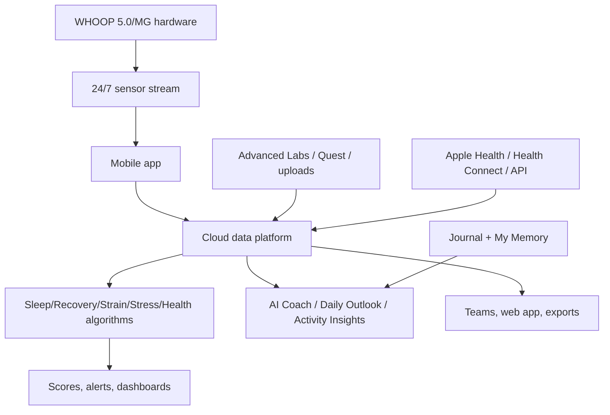
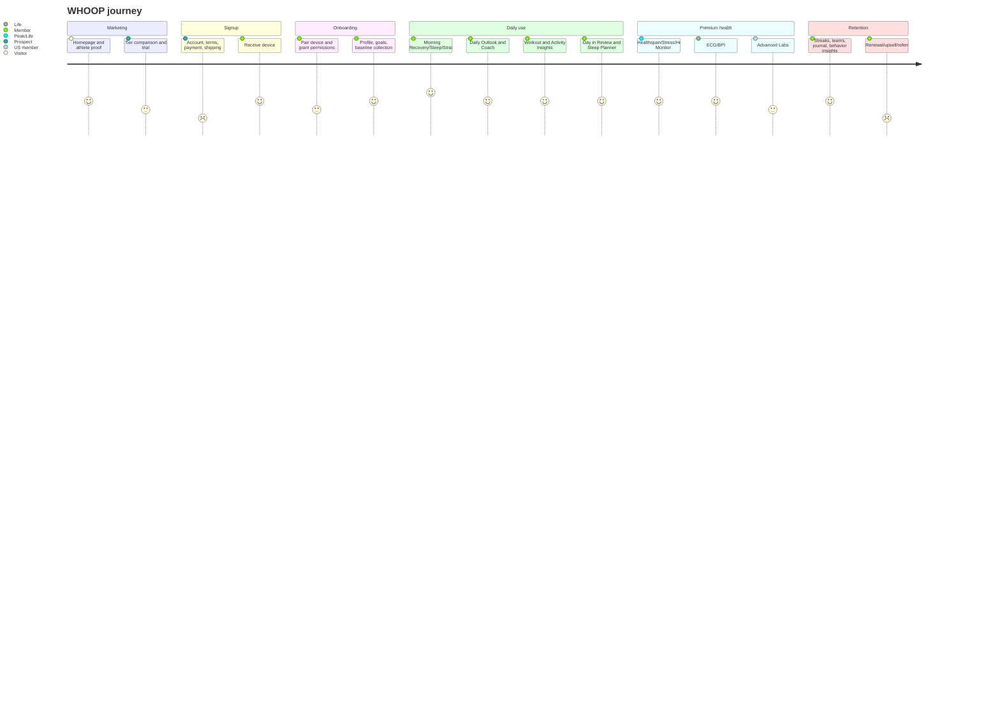
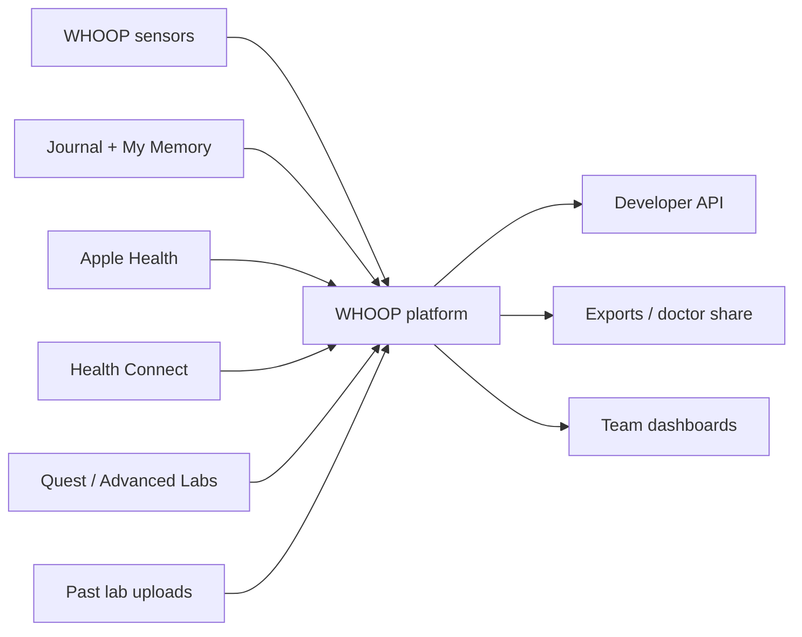
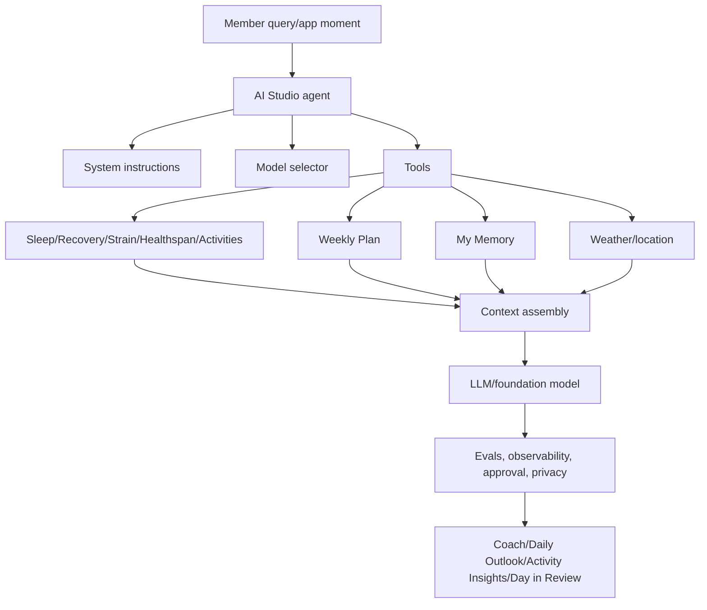
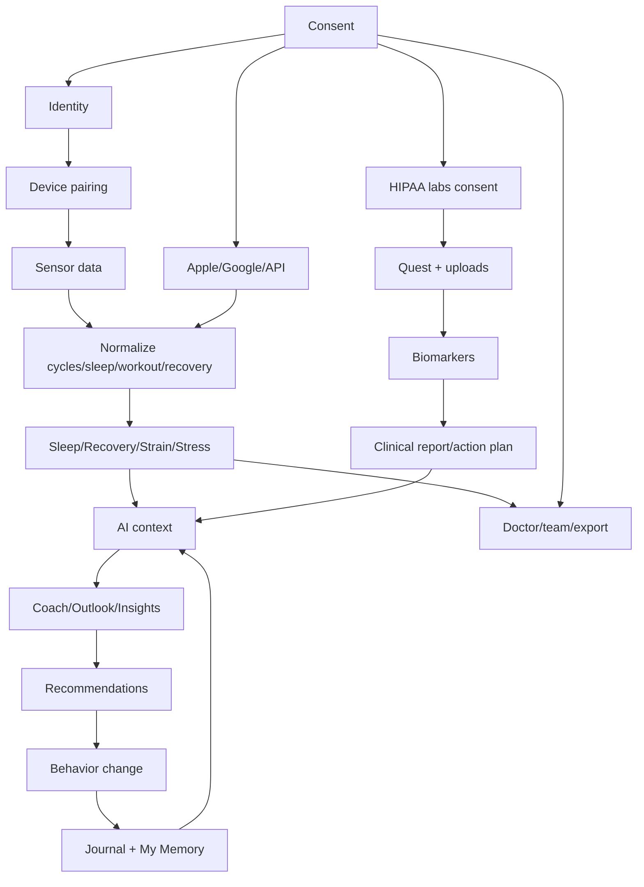

# WHOOP Competitive Intelligence Report for Ovexis

**Target:** WHOOP, Inc. (`whoop.com`)  
**Category:** Wearable Performance Intelligence / longitudinal healthspan coaching  
**Date:** 2026-07-25  
**Method:** Public information only. No logged-in access, scraping behind authentication, binary/app reverse engineering, packet interception, or ToS/robots circumvention.

## Evidence Labels
- 🟢 **Confirmed:** directly supported by public source.
- 🟡 **Strong Inference:** reasoned from multiple public signals; not explicitly confirmed.
- 🔴 **Speculation:** prediction/hypothesis for strategy only.

## Key Sources
S1 WHOOP homepage: https://www.whoop.com/us/en/  
S2 WHOOP 5.0/MG launch: https://www.whoop.com/us/en/press-center/whoop-unveils-5.0-MG/  
S3 Advanced Labs: https://www.whoop.com/us/en/advanced-labs/  
S4 Feature availability: https://www.whoop.com/us/en/feature-availability/  
S5 Privacy policy: https://www.whoop.com/us/en/full-privacy-policy/  
S6 Privacy principles: https://www.whoop.com/us/en/whoop-privacy-policies/  
S7 Terms of Use: https://www.whoop.com/us/en/whoop-terms-of-use/  
S8 Trial page: https://www.whoop.com/us/en/whoop-trials/  
S9 One/Peak/Life pages: `/one/`, `/peak/`, `/life/` on whoop.com  
S10 Support: calibration timeline, basics, app navigation, AI Coach, Health Connect  
S11 WHOOP Coach/OpenAI launch: https://www.whoop.com/us/en/press-center/whoop-unveils-the-new-whoop-coach-powered-by-openai/  
S12 Developer API/docs: https://developer.whoop.com/docs/introduction/ and https://developer.whoop.com/api/  
S13 OAuth/rate/webhooks docs: https://developer.whoop.com/docs/developing/oauth/ ; `/rate-limiting/` ; `/webhooks/`  
S14 Series G: https://www.whoop.com/us/en/press-center/whoop-announces-series-g-funding/  
S15 Will Ahmed Health OS essay: https://www.whoop.com/us/en/thelocker/what-is-the-health-operating-system/  
S16 Hiring surge: https://www.whoop.com/us/en/press-center/whoop-announces-2026-hiring-surge-adding-more-than-600-roles/  
S17 Careers/job postings: https://jobs.ashbyhq.com/whoop  
S18 AI Studio engineering blog: https://engineering.prod.whoop.com/ai-studio/  
S19 Funding 2020/2021: WHOOP Series E/F press releases  
S20 PUSH acquisition: https://www.whoop.com/us/en/press-center/acquires-push-velocity-based-training-solution/  
S21 Global expansion/executives: WHOOP 2024 expansion and Top Executives press releases  
S22 FDA ECG 510(k) K243236: https://www.accessdata.fda.gov/scripts/cdrh/cfdocs/cfpmn/pmn.cfm?ID=K243236  
S23 FDA Blood Pressure warning/closeout: FDA warning letters CMS 709755 dated 2025-07-14 and 2026-06-17  
S24 Research: PLOS ONE COVID respiratory rate paper; Sensors 2025 WHOOP wear-frequency study; WHOOP Sleep study press release  
S25 App Store and public reviews: Apple App Store, Reddit/community snippets, Trustpilot snippets. Directional only.

---

# 1. Executive Summary

## What WHOOP is building
- 🟢 WHOOP builds a screenless wearable membership that continuously captures physiological and behavioral data and turns it into coaching across sleep, recovery, strain, stress, fitness, heart health, Healthspan, labs, and AI guidance. Evidence: S1-S3, S10-S11.
- 🟢 Current hardware is WHOOP 5.0 and WHOOP MG. WHOOP MG powers the premium Life tier with ECG/Heart Screener capabilities. Evidence: S2, S9, S22.
- 🟢 Current U.S. membership tiers are One ($199/year), Peak ($239/year), and Life ($359/year). Evidence: S1-S2, S9.
- 🟢 Advanced Labs combines Quest-powered blood testing, past lab upload, clinician-reviewed reports, and action plans in the app. Evidence: S3, S7.
- 🟢 WHOOP Coach launched in 2023 powered by OpenAI/GPT-4 and now appears throughout the app as Daily Outlook, Activity Insights, Day in Review, and chat-based coaching. Evidence: S10-S11.
- 🟢 WHOOP’s public strategic ambition is a “personal health platform” and future “Health Operating System.” Evidence: S14-S15.

## Why it exists
- 🟢 WHOOP’s mission is to “unlock human performance and healthspan.” Evidence: S5, S14-S17.
- 🟢 WHOOP argues modern healthcare is episodic, reactive, institution-centered, and expensive, while continuous biometrics plus AI can guide prevention and behavior change. Evidence: S2, S14-S15.
- 🟡 WHOOP exists to translate hidden physiological state into daily decisions: train, rest, sleep, hydrate, reduce alcohol, manage stress, test biomarkers, or seek professional care when appropriate.

## Customer problem
- 🟢 WHOOP targets athletes, executives, military/frontline workers, teams, and health-conscious consumers who want better decisions about readiness, sleep, training, stress, and longevity. Evidence: S1, S11, S14, S20-S21.
- 🟢 WHOOP reports daily wear is linked to 91 more minutes of weekly activity, 2.3 more hours of sleep/week, and >10% higher HRV; a 2025 Sensors paper found higher wear frequency associated with lower RHR, higher HRV, longer/more consistent sleep, and more activity. Evidence: S1, S24.
- 🟡 The core problem is not “tracking”; it is uncertainty: “What can my body handle today, and what behaviors are helping or hurting me over time?”

## Emotional problem
- 🟢 WHOOP’s messaging says “lasting progress,” “extend your prime,” “Backed by PHDs, worn by MVPs,” and calls WHOOP a symbol of disciplined living. Evidence: S1, S14.
- 🟡 WHOOP monetizes performance anxiety and longevity aspiration: fear of under-recovery, missed signals, wasted potential, faster aging, or invisible health decline.

## Who is / is not the customer
- 🟢 Customer: performance-oriented individuals, athletes, teams, executives, military/frontline workers, and wellness/longevity consumers. Evidence: S11, S14, S20-S21.
- 🟢 Not the customer: people seeking a smartwatch, GPS watch, no-subscription tracker, primary-care replacement, emergency device, or medical advice outside regulated ECG use. Evidence: S7, S10.
- 🟢 Advanced Labs is U.S.-only, 18+, not for pregnant members; ECG is region-limited, 22+, and not for users with pacemakers/ICDs or known non-AFib arrhythmias. Evidence: S3-S4, S7, S9-S10.

## Category creation and replacement
- 🟢 WHOOP calls itself “the human performance company” and “personal health platform.” Evidence: S2, S14.
- 🟡 WHOOP is creating **continuous healthspan performance intelligence**: sensor data + behavior journaling + AI coaching + labs + medical-adjacent features.
- 🟡 WHOOP is replacing pieces of smartwatches, recovery apps, sleep trackers, athlete HR systems, corporate wellness, and concierge longevity checkups.
- 🔴 If WHOOP’s Health OS vision succeeds, it may compete with preventive primary-care touchpoints, employer wellness, and payer risk programs.

## Jobs-to-be-done
| JTBD | WHOOP answer | Ovexis lesson |
|---|---|---|
| Tell me if I should train today | Recovery, Strain Target, Daily Outlook | Action thresholds beat dashboards. |
| Explain why I feel tired | Coach + biometrics + Journal | Longitudinal memory and causal hypotheses matter. |
| Improve sleep | Sleep Score, Planner, haptic alarm, Day in Review | Sleep must be a core primitive. |
| Show habit impact | Journal + Behavior Insights + studies | Behavior-to-biomarker loops are a moat. |
| Connect labs to daily life | Advanced Labs + action plan | Labs must be interpreted against lived data. |
| Share with team/doctor | Teams, dashboard, ECG/lab exports | Consent/RBAC is product strategy. |

---

# 2. Company Intelligence

## Timeline
| Date | Event | Label/evidence |
|---|---|---|
| 2012 | WHOOP founded; official pages state founded in 2012. | 🟢 S14, S19, S21 |
| 2020-10 | $100M Series E at $1.2B valuation led by IVP. | 🟢 S19 |
| 2021-08 | $200M Series F at $3.6B valuation led by SoftBank Vision Fund 2. | 🟢 S19 |
| 2021-09 | Acquired PUSH, Toronto velocity-based training startup, in cash/stock transaction. | 🟢 S20 |
| 2023-01 | Hyperice partnership for recovery-activity integration via Apple Health and PGA TOUR study. | 🟢 captured WHOOP/Hyperice source |
| 2023-09 | WHOOP Coach launched powered by OpenAI/GPT-4. | 🟢 S11 |
| 2024-04 | Expanded shipping to 56 markets; added Italian and Latin American Spanish; appointed Ed Baker CGO, Michener Chandlee CFO, John Sullivan CMO. | 🟢 S21 |
| 2024-11 | Notre Dame Athletics partnership; Team Dashboard used by sports performance department. | 🟢 captured WHOOP/Notre Dame source |
| 2025-04 | FDA 510(k) K243236: WHOOP ECG Feature substantially equivalent. | 🟢 S22 |
| 2025-05 | WHOOP 5.0 and MG launched with Healthspan, ECG, BPI, 14+ day battery. | 🟢 S2 |
| 2025-07 | FDA warning letter for Blood Pressure Insights. | 🟢 S23 |
| 2026-03 | 600+ hiring surge and $575M Series G at $10.1B valuation. | 🟢 S14, S16 |
| 2026-06 | FDA closeout/non-enforcement letter for modified BPI labeling/product. | 🟢 S23 |

## Founders and leadership
- 🟢 Will Ahmed is Founder & CEO. Evidence: S2, S14-S16, S19, S21.
- 🟢 Public Harvard/HBS search evidence identifies Will Ahmed, John Capodilupo, and Aurelian Nicolae as Harvard co-founders; this triad was not located in captured official WHOOP pages, so use with source caveat.
- 🟢 Emily Capodilupo is SVP of Research, Algorithms, and Data and one of WHOOP’s earliest team members. Evidence: S21.
- 🟢 2024 C-suite additions/promotions: Ed Baker CGO, Michener Chandlee CFO, John Sullivan CMO. Evidence: S21.

## Funding and traction
- 🟢 WHOOP raised $575M Series G at $10.1B valuation led by Collaborative Fund with 2PointZero, QIA, Mubadala, Abbott, Mayo Clinic, Macquarie, Glade Brook, B-Flexion, IVP, Foundry, Accomplice, Affinity Partners, Promus, Bullhound, and celebrity/athlete investors. Evidence: S14.
- 🟢 WHOOP reported 2.5M+ members, 103% bookings growth in 2025, $1.1B bookings run rate, positive operating cash flow in 2025, and 24B+ hours of physiological data. Evidence: S14.

## Acquisitions and partnerships
- 🟢 PUSH acquisition aimed to deepen strength-training/functional-fitness insight. Evidence: S20.
- 🟢 AnyQuestion acquisition is inferred from WHOOP’s statement that Ed Baker joined following acquisition of Baker’s prior company. Evidence: S21.
- 🟢 Strategic partners/investors include OpenAI, Quest, SteadyMD, Buck Institute/Dr. Eric Verdin, Hyperice, Notre Dame Athletics, Abbott, and Mayo Clinic. Evidence: S2-S3, S7, S11, S14, S21-S23.

## Research and evidence
- 🟢 PLOS ONE COVID paper: WHOOP-derived respiratory-rate model identified 20% of COVID-positive validation individuals in the two days before symptom onset and 80% by third symptom day. Evidence: S24.
- 🟢 Sensors 2025: nearly one million days/nights from 11,914 WHOOP subscribers; higher wear frequency associated with healthier biometric/sleep/activity patterns. Evidence: S24.
- 🟢 WHOOP announced a peer-reviewed Sleep study in 38,838 adults showing circadian-supportive behaviors improved sleep consistency, RHR, HRV, and behavior persistence. Evidence: S24.
- 🟡 WHOOP’s research strategy doubles as trust-building and marketing: large-N user studies validate both product and behavior-change narrative.

## Geographic expansion
- 🟢 WHOOP ships to 56 markets and supports English, French, German, Italian, and Spanish; public channels include WHOOP.com, Amazon, Best Buy, Flipkart, and more. Evidence: S1-S2, S14, S21.
- 🟢 WHOOP expanded direct shipping to Qatar, Saudi Arabia, Kuwait, Bahrain, Hong Kong, Israel, Korea, and Taiwan in 2024. Evidence: S21.
- 🟡 India matters strategically because Flipkart is a listed channel and WHOOP had a Mumbai Manager, Marketplaces - India role. Evidence: S1, S17.

---

# 3. Founder Psychology

- 🟢 Will Ahmed’s explicit belief: modern healthcare is reactive and episodic, while AI + continuous biometrics can create a Health OS that predicts risk and guides behavior. Evidence: S15.
- 🟢 Will Ahmed’s earlier phrase “Feelings are overrated” frames WHOOP’s core thesis: people cannot reliably feel hidden physiological state. Evidence: S19.
- 🟢 WHOOP culture values mission, research/design/privacy, high intensity/high humility, best idea wins, bias for action, and member obsession. Evidence: S16.
- 🟡 Founder mental model: **elite-performance practices become mass health infrastructure**. WHOOP starts with athletes but aims at everyone’s healthspan.
- 🟡 Risk tolerance is high at the wellness/medical boundary, evidenced by BPI launch, FDA challenge, and continued investment in regulatory/clinical roles. Evidence: S17, S22-S23.
- 🔴 Likely 10-year ambition: IPO-ready Health OS with consumer, employer, sports, healthcare, and payer channels, powered by proprietary longitudinal data and foundation AI.

---

# 4. Product Reverse Engineering

## System architecture

## Hardware and membership
- 🟢 WHOOP 5.0/MG are 7% smaller than 4.0; sensors capture data 26 times/second; processor is described as 10x more power efficient. Evidence: S2.
- 🟢 WHOOP 5.0 dimensions: 34.7mm x 24mm x 10.6mm; 26.5g; no screen, microphone, external buttons, or magnets. Evidence: S10.
- 🟢 WHOOP 4.0 bands are not compatible with 5.0/MG. Evidence: S10.
- 🟢 Device is designed for wrist and validated WHOOP Body/Any-Wear locations. Evidence: S1, S10.
- 🟢 One includes WHOOP 5.0 + Basic Charger + CoreKnit; Peak includes 5.0 + Wireless PowerPack + SuperKnit; Life includes MG + Wireless PowerPack + SuperKnit Luxe. Evidence: S9.

## App IA and pages
- 🟢 Public support confirms bottom nav: Home, Health, Community, More; Coach is directly accessible and also floats on other screens. Evidence: S10.
- 🟢 Home: Strain, Recovery, Sleep dials, My Day, My Plan, My Dashboard, Streak, Action (+). Evidence: S10.
- 🟢 Health: Live HR, Hormonal Insights, Healthspan, Stress Monitor, Health Monitor, BPI, Heart Screener subject to tier/region/age. Evidence: S10.
- 🟢 Community: WHOOP Teams, team comparisons, public team discovery by activity/occupation/journal behaviors. Evidence: S10.
- 🟢 More: Shop, Settings, Privacy, Support, referrals, Digital Labs participation, profile. Evidence: S10.
- 🟢 Web app: daily Strain/Recovery/Sleep, comparisons, trends, settings, shop, support; support notes 6 months of data and steps not accessible on web. Evidence: S10.

## Core features
- 🟢 **Sleep:** duration, performance, latency, stages, sufficiency, consistency, high sleep stress, efficiency, Sleep Planner, haptic alarm. Evidence: S1, S10, S25.
- 🟢 **Recovery:** HRV, RHR, respiratory rate, sleep duration/quality, skin temp, SpO2, menstrual cycle phase. Evidence: S10.
- 🟢 **Strain:** 0–21 nonlinear score based on Borg-scale framing and elevated HR zones; supports steps, VO2 Max, HR zones, 145+ activities, Strength Trainer, Muscular Strain. Evidence: S2, S10.
- 🟢 **Health Monitor:** key vitals and deviation alerts; fully calibrated after 7 recoveries; Peak/Life only. Evidence: S9-S10.
- 🟢 **Stress Monitor:** real-time stress 0–3 and breathwork recommendations; Peak/Life only. Evidence: S9-S10, S25.
- 🟢 **Healthspan:** WHOOP Age and Pace of Aging, using nine metrics linked to long-term health, developed with Dr. Eric Verdin; wellness-only, 18+, Peak/Life. Evidence: S2, S9-S10.
- 🟢 **Heart Screener ECG:** FDA-cleared OTC ECG software for single-channel ECG and AFib/normal/low/high HR classification; Life/MG; region-limited. Evidence: S4, S9-S10, S22.
- 🟢 **BPI:** daily systolic/diastolic estimates/ranges; cuff calibration required; not a medical device; FDA warning/closeout history. Evidence: S2, S7, S9-S10, S23.
- 🟢 **Women’s Hormonal Insights:** menstruation, pregnancy, perimenopause education and personalized insights; not contraception/conception. Evidence: S2, S9-S10.
- 🟢 **Advanced Labs:** 122+ biomarkers, Quest scheduling, clinician review, action plan, upload past labs, export summaries; U.S.-only. Evidence: S3, S7.
- 🟢 **Teams / WHOOP Live / Hide Metrics:** public and support-documented community/share/privacy features. Evidence: S5, S10.

## Hidden workflows not publicly verified
- 🟢 Cannot verify every app button, notification copy, consent screen, ECG PDF, Advanced Labs purchase flow, clinician review workflow, support console, internal admin roles, prompts, or internal APIs without account/device/region/tier access.
- 🟡 Likely hidden flows include BLE pairing, onboarding questionnaire, HealthKit/Health Connect permissions, location/weather permissions, HIPAA authorization, Quest scheduling, clinician report release, AI support escalation, trial return, team consent, upgrade/downgrade proration.

---

# 5. User Journey

- 🟢 Visitor sees “The wearable designed for lasting progress,” HSA/FSA, Join Now, and free trial. Evidence: S1, S8.
- 🟢 Signup requires membership fees and account; Terms apply to free trials too. Evidence: S7.
- 🟢 Membership begins when device connects or after delivery windows. Evidence: S7.
- 🟢 Health Connect setup path is More → Account & Settings → Integrations → Health Connect → Set Up. Evidence: S10.
- 🟢 Calibration unlocks features over time: Recovery metrics after 1 recovery, skin temp/Health Monitor after 7, Behavior Insights after 10 with full calibration at 365, VO2 Max after 14 sleeps, Healthspan after 21 recoveries/31 days. Evidence: S10.
- 🟡 Retention is built around morning reveal, streaks, Journal correlations, Coach memory, teams, long baselines, annual renewal, and premium upsells.

---

# 6. UX Research

- 🟢 Public UX uses dark premium visual language, elite athlete photography, large high-contrast headlines, app UI overlays, feature cards, and tier comparisons. Evidence: S1-S3, S9.
- 🟢 App redesign centers Home, Health, Community, More, and Coach. Evidence: S10.
- 🟢 Trust signals include HSA/FSA, FDA-cleared ECG, Quest labs, clinician review, peer-reviewed studies, athlete ambassadors, privacy/data deletion, and employee access logs. Evidence: S1, S3, S6, S14, S22-S24.
- 🟡 WHOOP’s strongest microinteraction is the daily morning decision ritual: “How recovered am I, what should I do today?”
- 🟡 Main friction: annual subscription, tier complexity, feature calibration delays, region gating, lab consent/scheduling, cuff calibration, ECG setup, trial returns, cancellation and support. Evidence: S7-S10, S23-S25.
- 🟡 Accessibility risk: red/yellow/green scoring and dense biometric charts require strong color-blind and explanatory UX; full WCAG audit not performed.

---

# 7. Healthcare Workflow

- 🟢 WHOOP is not generally a healthcare provider and does not provide medical advice; Heart Screener is the regulated exception. Evidence: S7, S22.
- 🟢 Advanced Labs: member schedules Quest draw → lab result → licensed clinician review → Clinical Report/Insights → Action Plan in app → export/share/retest. Evidence: S3, S7.
- 🟢 Terms state Advanced Labs reports/insights are developed by independent third-party labs/providers including Quest Diagnostics and SteadyMD; WHOOP is not the lab/provider. Evidence: S7.
- 🟢 ECG can be taken on-demand and shared with a healthcare provider; user should not take clinical action without qualified healthcare professional. Evidence: S2, S22.
- 🟢 Advanced Labs purchases may not be submitted to third-party payors for reimbursement; memberships/labs are marketed HSA/FSA eligible. Evidence: S3, S7.
- 🟢 No public hospital/EHR integration, HL7 feed, provider portal, pharmacy fulfillment, or payer workflow was verified.
- 🟡 Current workflow is consumer-mediated, not provider-system-mediated. WHOOP may move toward healthcare GTM given open VP Healthcare GTM, SaMD, HEOR, Clinical Science, Clinical Operations roles. Evidence: S17.

---

# 8. Healthcare Data Architecture

- 🟢 Data collected includes contact/profile/payment data; wellness data such as HR, HRV, RHR, respiratory rate, skin temp, SpO2, acceleration, workouts, sleep, strain/recovery, birthday, gender identity, weight/height, fitness level, habits, diet, medications, female health; consumer health data including biomarkers, samples, lab results, clinical notes; device/geolocation/online activity data. Evidence: S5.
- 🟢 Health Connect import/export covers exercise, distance, calories, body measurements, sleep, RHR, respiratory rate, SpO2, steps; excludes Heart Screener, BPI, WHOOP Age/Pace, VO2 Max. Evidence: S10.
- 🟢 Developer API exposes profile, body measurements, cycles, recovery, sleep, workouts via OAuth scopes. Evidence: S12-S13.
- 🟢 Trusted Partner API includes lab requisition, service request, status update, and diagnostic report observations. Evidence: S12.
- 🟢 Public docs do not claim FHIR/HL7/CCDA/CCD support. 🟡 Partner object names resemble FHIR-like resources, but FHIR compliance is not confirmed.
- 🟢 Consent architecture includes OAuth scopes, lab/HIPAA authorization, managing entity/team consent, corporate wellness consent, privacy settings, data access/deletion, and Coach mode controls. Evidence: S5-S7, S10, S13.

---

# 9. AI Reverse Engineering

- 🟢 WHOOP Coach launched using OpenAI/GPT-4. Evidence: S11.
- 🟢 2026 privacy policy says WHOOP Coach and Membership Services AI use a third-party LLM partner; only de-identified WHOOP metrics are shared; partner has zero-retention/zero-training policy for WHOOP metrics. Evidence: S5.
- 🟢 AI Studio abstracts agent system instructions, model selection, and tools; includes visual builder, testing, evals, inline tools, diff/approval/deploy flow, PII guardrails. Evidence: S18.
- 🟢 WHOOP reported 2,500+ AI agent iterations, 235 production deployments, and 41 live agents. Evidence: S18.
- 🟢 My Memory lets users manage goals, lifestyle habits, current state, preferences, life events. Evidence: S10.
- 🟢 Foundation AI job postings say WHOOP is building multimodal foundation models integrating wearable sensors, language, biomarkers, clinical information, and self-reported inputs. Evidence: S17.
- 🟡 WHOOP appears to use a tool/RAG/agent hybrid: structured metric tools + science content + memory + prompts + model(s). Current providers beyond historical GPT-4/OpenAI are not verified.
- 🟢 Terms warn AI outputs can be inaccurate, hallucinated, biased, and are not a substitute for professional advice. Evidence: S7.

---

# 10. Technical Reverse Engineering

- 🟢 Public website headers showed `x-powered-by: Next.js`, `x-opennext: 1`, Contentful image assets, and Cloudflare. Evidence: public HTTP response observed during research.
- 🟢 CSP/header sources indicate use or allowance of Datadog, Sentry, Segment, OneTrust, Amplitude, Shopify, Okendo, TikTok, Attentive, Snapchat, ZoomInfo, Smarty, Pinterest, Spotify pixels, Reddit pixels, Pingdom, Google Ads/Analytics/Tag Manager, Facebook/Meta, Intercom, Cloudflare. Evidence: public HTTP response observed.
- 🟢 Frontend AI Platform job requires Next.js, React, Tailwind CSS, REST APIs, responsive mobile-first UI, accessibility/performance practices. Evidence: S17.
- 🟢 Android jobs mention Kotlin/Java, Coroutines, Jetpack, ViewModel, Flows, Navigation, Room, Retrofit/OkHttp, MVVM/MVI, Firebase release/testing. Evidence: S17.
- 🟢 iOS jobs mention Swift, SwiftUI, UIKit, AutoLayout, XCTest, MVVM/VIPER, Swift Concurrency/GCD, Xcode, Fastlane, SPM, CocoaPods, REST backend. Evidence: S17.
- 🟢 Backend roles mention Java, Kafka, AWS, PostgreSQL, REST APIs, observability, SQS, scalable systems. Evidence: S17.
- 🟢 Platform role mentions Kubernetes on AWS, Kafka, CI/CD, Terraform, IAM, VPC, EC2, S3, RDS, CloudTrail, Organizations, service mesh/network policies, multi-cluster Kubernetes. Evidence: S17.
- 🟢 Security roles mention cloud/identity/endpoint/app detection, account takeover, credential abuse, API misuse, data exfiltration, prompt injection, model misuse, ISO 42001, NIST AI RMF, EU AI Act, HIPAA/GDPR/PCI. Evidence: S17.
- 🟡 Production stack inference: AWS + Kubernetes + Kafka + Java services + PostgreSQL/RDS + native iOS/Android + Next/React web + strong observability/security tooling.

---

# 11. API Investigation

- 🟢 Public API is REST/OAuth with downloadable OpenAPI at `api.prod.whoop.com/developer/doc/openapi.json`. Evidence: S12.
- 🟢 OAuth authorization-code flow uses authorization URL `https://api.prod.whoop.com/oauth/oauth2/auth` and token URL `/oauth/oauth2/token`; `offline` scope returns refresh token. Evidence: S13.
- 🟢 Scopes: `read:recovery`, `read:cycles`, `read:workout`, `read:sleep`, `read:profile`, `read:body_measurement`. Evidence: S12-S13.
- 🟢 Endpoints include profile, body measurements, cycles, recovery, sleep, workouts, revoke access, v1-to-v2 activity mapping, and partner lab workflows. Evidence: S12.
- 🟢 Rate limits: 100 requests/minute and 10,000/day by default; `X-RateLimit-*` headers; 429 on limit. Evidence: S13.
- 🟢 Webhooks: workout/sleep/recovery update/delete; HMAC-SHA256 signature validation; retries five times over about one hour; event notifications require follow-up API fetch; reconciliation recommended. Evidence: S13.
- 🟡 Developer moat is useful but limited: mostly read access, no public raw sensor export, no public GraphQL, no confirmed FHIR endpoints.

---

# 12. Security / Compliance

- 🟢 WHOOP says it does not sell member personal data; members can access/delete data; employees access data only with business need; access logs are maintained and reviewed for anomalies. Evidence: S6.
- 🟢 Privacy policy references Europe/GDPR, U.S. state privacy laws, Brazil, India, Israel, Japan, Mexico, Qatar, Singapore, South Africa, South Korea, Taiwan. Evidence: S5.
- 🟢 Advanced Labs requires HIPAA authorization for Quest/SteadyMD to share PHI with WHOOP. Evidence: S7.
- 🟢 Product Security job explicitly owns HIPAA readiness across products and infrastructure; bonus includes SOC2→HIPAA or HIPAA→HITRUST transitions. Evidence: S17.
- 🟢 AI Risk role covers LLMs, AI agents, RAG workflows, prompt injection, data poisoning, data leakage, explainability gaps, ISO/IEC 42001, NIST AI RMF, EU AI Act, GDPR, PCI DSS. Evidence: S17.
- 🟢 Advanced Labs page says data is encrypted and private/secure; privacy policy says WHOOP uses physical, technical, organizational, administrative safeguards. Evidence: S3, S5.
- 🟡 Current public evidence does not confirm SOC 2/HITRUST certification; it confirms hiring/readiness language.

---

# 13. Business Model

- 🟢 Core revenue: annual memberships with hardware included. Evidence: S1, S7, S9.
- 🟢 Public U.S. pricing: One $199/year, Peak $239/year, Life $359/year. Evidence: S1-S2, S9.
- 🟢 Advanced Labs comprehensive panels: $199 for 1/year, $349 for 2/year, $599 for 4/year, $899 for 6/year. Evidence: S3.
- 🟢 Additional revenue: accessories/apparel, labs, enterprise/team programs, retail channels. Evidence: S1, S3, S10, S20-S21.
- 🟢 WHOOP reported positive operating cash flow in 2025, $1.1B bookings run rate, and 103% bookings growth. Evidence: S14.
- 🟡 Unit economics depend on hardware COGS, fulfillment, support, returns, warranty, athlete marketing, AI/cloud, lab partner fees, and retention. Actual CAC/LTV/gross margin not public.
- 🟡 Retention levers: annual billing, calibration, personalized baselines, data history, Coach memory, teams, Journal/Behavior Insights, Healthspan identity, and Advanced Labs retesting.

---

# 14. Growth Strategy

- 🟢 WHOOP uses DTC site, free trial, athlete/celebrity ambassadors, retail marketplaces, app stores, content, partnerships, teams, referrals, and international expansion. Evidence: S1, S8, S14-S16, S21.
- 🟢 Public brand proof includes Cristiano Ronaldo, Niall Horan, PSG, Ferrari, Sha’Carri Richardson, Patrick Mahomes, Diplo, Virgil van Dijk and others. Evidence: S1, S14.
- 🟢 Growth roles include performance marketing, DTC commercial planning, partnerships, affiliate marketing, Marketplaces India, wholesale strategy, UK/IE sales, healthcare GTM. Evidence: S17.
- 🟡 Growth engine: elite-status brand → trial/signup → calibration/data habit → insights/coach → subscription renewal → upsell to Peak/Life/labs/accessories → referrals/teams/social sharing.

---

# 15. Hiring Intelligence

| Public hiring signal | Label | Strategic implication |
|---|---:|---|
| 600+ roles in 2026 across software, R&D, hardware, product, marketing | 🟢 | Scaling toward pre-IPO platform. |
| Foundation AI roles for multimodal sensor/language/biomarker/clinical/self-report models | 🟢 | Proprietary health foundation models. |
| Staff Regulatory Affairs for SaMD, AI/ML, foundation models, adaptive algorithms | 🟢 | More regulated/medical AI features likely. |
| Director Clinical Science / Clinical Operations / HEOR | 🟢 | Clinical evidence, validation, payer/employer proof. |
| VP Healthcare GTM / Senior PM Healthcare / SaMD program manager | 🟢 | Healthcare channel and regulated-product roadmap. |
| Product Security with HIPAA readiness | 🟢 | PHI-bearing workflows expanding. |
| AI Risk & Compliance | 🟢 | AI governance is becoming core infrastructure. |
| Hardware NPI, battery, RF, reliability, compliance | 🟢 | Next-gen hardware pipeline. |
| India marketplace role | 🟢 | India marketplace growth. |

---

# 16. Customer Intelligence

## Praise
- 🟢 App Store listing: 4.8 rating from ~46K U.S. ratings at capture; app description emphasizes Sleep, Strain, Recovery, Stress, health insights, Journal, Teams, Apple Health, and Coach. Evidence: S25.
- 🟢 Public reviews/snippets praise sleep and recovery insight, screenless wear, battery life, behavior correlations, and app design. Evidence: S25.
- 🟡 WHOOP works best for users who consistently wear it, log behaviors, and want readiness/sleep guidance more than smartwatch functions.

## Complaints
- 🟢 Public App Store/review/community snippets complain about support delays, billing/cancellation/trial friction, upgrade policy, 4.0 accessory incompatibility, functional-fitness/strength-training HR/strain accuracy, app bugs, and discomfort. Evidence: S25.
- 🟡 Main reputational risk is trust, not feature count: users tolerate premium pricing if they believe the company acts fairly.

## Feature requests / churn causes
- 🟢 Public community snippets request better strength-training UX, activity pause/switch, timed custom exercises, more actionable AI, better support, and more data portability. Evidence: S25.
- 🟡 “Tell me what to do with the data” remains a competitive gap even after WHOOP Coach.

---

# 17. Decision Ledger

| Feature | Why built | Pain solved | KPI | Trade-off | Ovexis action |
|---|---|---|---|---|---|
| Screenless device | 24/7 wear/no distraction | Smartwatch fatigue | Wear time | No on-device view | Copy if hardware; otherwise leverage existing devices. |
| 14-day battery | Reduce charge friction | Data gaps | Continuity | COGS/size | Copy principle. |
| Recovery score | Simplify readiness | HRV/RHR complexity | Daily opens | Oversimplification | Reinvent with confidence/evidence. |
| Strain | Quantify load | Workout effort ambiguity | Workout engagement | HR dependence | Improve sport-specific load. |
| Sleep Planner | Actionable sleep | Generic advice | Sleep adherence | Trust in algorithm | Copy. |
| Journal | Behavior context | Why metrics changed | Data richness | Logging burden | Reinvent with passive capture. |
| Behavior Insights | Show impact | Habit uncertainty | Retention | Long calibration | Copy with n-of-1 stats. |
| Healthspan | Long-term motivation | Daily scores are short-term | Upsell/retention | Validity skepticism | Improve with risk trajectories. |
| Coach | Conversational interpretation | Data overload | Engagement/support | Hallucination | Reinvent with citations. |
| My Memory | Personalization | Generic advice | AI retention | Privacy | Copy as user-owned vault. |
| Advanced Labs | Internal biomarkers | Wearables miss chemistry | ARPU/health platform | Clinical ops | Copy early. |
| Clinician report | Trust/safety | Raw lab confusion | Conversion | Partner cost | Copy with transparent evidence. |
| ECG | Medical-grade trust | AFib concern | Life upsell | Regulation | Only with clear regulatory path. |
| BPI | High-value wellness metric | BP blind spot | Life upsell | FDA risk | Use cuff-first hybrid. |
| Teams | Accountability/enterprise | Solo tracking | Viral/enterprise | Privacy | Copy with strict RBAC. |
| Developer API | Ecosystem | Data portability | Dev adoption | Support/rate limits | Improve with FHIR/export. |
| Trial | Lower friction | Hardware uncertainty | CAC | Returns/billing risk | Use transparent terms. |
| Annual billing | ARR/LTV | Revenue predictability | LTV | Trust backlash | Avoid opaque lock-in. |
| AI Studio | Agent velocity | Slow AI iteration | Feature velocity | Governance | Build from day 1. |
| AI GRC | Reduce AI risk | Regulated AI | Enterprise trust | Slower release | Copy. |

---

# 18. Feature Dependency Graph

---

# 19. Engineering Backlog Reconstruction

- 🟡 MVP likely: HR/HRV/sleep wearable, recovery/strain scoring, mobile dashboards, athlete/team use.
- 🟢 WHOOP 3.0-era membership included free hardware and platform for sleep/recovery/strain. Evidence: S19.
- 🟢 WHOOP 4.0 added SpO2, skin temperature, Health Monitor, haptics, WHOOP Body/Any-Wear. Evidence: S10.
- 🟢 Current 5.0/MG adds 14+ day battery, smaller form, Healthspan, ECG, BPI, Labs, steps, VO2 Max, more AI. Evidence: S2-S3, S10.
- 🟡 Future backlog: broader Advanced Labs, international labs, more AI agents, clinical validation, regulated algorithms, AI governance, healthcare GTM, next-gen hardware, better support automation.
- 🟡 Technical debt: 4.0/5.0 compatibility, support/billing flows, global feature gating, legacy data models, model evaluation, high-motion HR accuracy, app feature sprawl.

---

# 20. Competitive Landscape

| Competitor | Category | Overlap | Differentiator vs WHOOP | WHOOP advantage | Ovexis implication |
|---|---|---|---|---|---|
| Oura | Smart ring | Sleep, readiness, stress, women’s health | Finger PPG, ring comfort, broad health metrics | Athletic strain/coach/teams/labs combination | Hardware-agnostic ingestion can beat either device. |
| Ultrahuman | Smart ring + metabolic | Sleep, HRV, recovery, temp, movement | Subscription-free, M1 glucose, circadian nudges, Bengaluru presence | AI Coach, labs, team/sports brand | India/no-subscription threat. |
| Function Health | Lab longevity | Biomarkers, action plans | 160+ labs, 2x/year, $365/year | Daily wearable engagement | Integrate labs deeply. |
| Superpower | Low-cost labs + AI | Labs, wearables, AI, care team | $199/year and wearable sync | WHOOP data continuity | Labs-only can undercut WHOOP Advanced Labs. |
| Levels | CGM/metabolic | Behavior feedback, labs | Food/glucose specificity | Broader recovery/sleep platform | Glucose is a key missing axis. |
| Apple | Watch + Health | HR, sleep, ECG, AFib, ecosystem | Massive platform, no WHOOP subscription | Screenless recovery identity, battery | Integrate Apple rather than compete. |
| Google/Fitbit | Health Connect + wearables | Sleep/activity/health | Android data hub | Premium coaching | Must integrate Health Connect. |
| Human API | Health data infra | Consent health data | EHR/labs/wearable aggregation | WHOOP owns device/engagement | Ovexis needs this layer. |
| OpenEvidence/UpToDate/AMBOSS | Clinical knowledge/AI | Health intelligence | Evidence for clinicians | Personal sensor data | Ovexis must cite evidence. |
| Atropos | Real-world evidence | Health data + AI | RWE on clinical datasets | Consumer data | Build evidence generation. |
| Apollo/Practo/1mg/Healthify | India care/wellness | Consumer health app | Doctors, pharmacy, labs, India distribution | Wearable data/brand | Partner or integrate locally. |

- 🟢 Oura, Ultrahuman, Function, Superpower, and Levels official pages show convergence around sleep/recovery/longevity/labs/glucose/wearable-AI. Evidence: competitor official pages captured.
- 🟡 WHOOP’s strongest unique bundle is screenless wrist/body wearable + strain/recovery/sleep + AI Coach + Advanced Labs + FDA-cleared ECG + BPI + Healthspan + Teams.
- 🟡 Blind spots: nutrition/CGM, EHR/FHIR, raw data portability, doctor workflow, transparent uncertainty, India care services, trust/billing.

---

# 21. Moat Analysis

| Moat | Rating | Evidence/logic |
|---|---|---|
| Data moat | Strong | 🟢 24B+ physiological hours, 2.5M+ members. Evidence: S14. |
| AI moat | Medium→Strong | 🟢 AI Studio + Foundation AI roles. Evidence: S17-S18. |
| Clinical moat | Medium | 🟢 FDA ECG, Advanced Labs, clinical/regulatory hiring; BPI risk. |
| Brand moat | Strong | 🟢 Elite athlete/culture flywheel. |
| Distribution moat | Medium | 🟢 DTC + retail + global markets; Apple/Amazon still stronger. |
| Developer moat | Weak→Medium | 🟢 API exists but limited read-only scope. |
| Regulatory moat | Emerging | 🟢 ECG clearance, FDA BPI learning curve. |
| Network effects | Medium | Teams + community + aggregated research. |
| Switching costs | Strong | Baselines, history, calibration, Journal, Coach memory, annual billing. |
| Trust moat | Medium | Strong privacy posture but customer backlash weakens it. |

---

# 22. Failure Analysis

- 🟡 **Technical:** HR in high-motion/strength contexts damages trust in Strain/Muscular Strain. Evidence: public reviews.
- 🟡 **AI:** generic, hallucinated, or unsafe coaching undermines the Health OS promise. Evidence: S7, S18.
- 🟢 **Regulatory:** FDA BPI warning proves boundary risk is real. Evidence: S23.
- 🟡 **Business:** annual billing, upgrade-policy backlash, accessory incompatibility, support delays can increase churn.
- 🟡 **Distribution:** Apple/Oura/Ultrahuman/Function/Superpower/Levels can copy slices and undercut price/friction.
- 🔴 **Economic:** pre-IPO pressure could incentivize aggressive upsells that damage trust.

---

# 23. Competitive Attack Plan for Ovexis

1. 🟡 Build hardware-agnostic longitudinal health intelligence first; do not start with proprietary hardware unless sensor gap is unique.
2. 🟡 Integrate Apple Health, Health Connect, Oura, WHOOP, Garmin, Fitbit, CGM, BP cuffs, labs, meds, symptoms, and uploaded records.
3. 🟡 Make trust the wedge: transparent pricing, easy cancellation, clear data export, no accessory lock-in.
4. 🟡 Make AI evidence-grounded: citations, confidence, uncertainty, “what this does/does not mean,” clinician escalation.
5. 🟡 Win India with ABDM/ABHA, diagnostics, pharmacy, teleconsult, family health, local language and diet context.
6. 🟡 Build FHIR-ready doctor summaries and a provider collaboration view.
7. 🟡 Attack WHOOP’s gaps: glucose/nutrition, EHR, meds, family/caregiver, mental/cognitive energy, clinical-grade exports.
8. 🟡 Build AI Studio/eval/guardrail infrastructure internally from day one.
9. 🔴 Offer optional hardware later after proving interpretation layer PMF.

---

# 24. Future Prediction

- 🟢 Next 12 months: WHOOP is hiring 600+ and scaling AI, clinical innovation, and international growth. Evidence: S16.
- 🟡 Next 12 months likely: more Coach surfaces, Advanced Labs expansion, BPI refinements, regulatory clearances, healthcare GTM pilots, HIPAA/security work.
- 🟡 Next 3 years likely: IPO readiness, proprietary health foundation models, broader labs, employer/payer/healthcare partnerships, expanded regulated features.
- 🔴 Next 5 years: WHOOP may attempt consumer preventive-health OS with labs, AI agents, insurance/employer incentives, and clinician escalation.
- 🔴 Possible acquisitions: CGM/nutrition analytics, EHR/FHIR connectivity, lab logistics, AI eval/safety, BP/hydration sensor IP, women’s health analytics.

---

# 25. Ovexis Strategy Memo

## Top 50 ideas to copy
1 longitudinal baselines; 2 morning readiness ritual; 3 sleep-first model; 4 behavior journal; 5 behavior correlations; 6 calibration transparency; 7 healthspan framing; 8 HSA/FSA; 9 privacy principles; 10 employee access logs; 11 OAuth API; 12 webhooks; 13 Apple/Google integrations; 14 team accountability; 15 role-based hiding; 16 reports; 17 lab scheduling; 18 lab upload; 19 clinician-reviewed reports; 20 action plans; 21 Coach memory; 22 coaching modes; 23 Daily Outlook; 24 Activity Insights; 25 Day in Review; 26 bedtime range; 27 stress/breathwork; 28 VO2 benchmark; 29 research publishing; 30 elite proof; 31 trial if hardware; 32 streaks; 33 calibration unlocks; 34 regional availability page; 35 AI agent platform; 36 eval approval flow; 37 de-identified LLM policy; 38 support AI; 39 not-medical-advice clarity; 40 clinician export; 41 web trends; 42 health reports; 43 teams; 44 referral; 45 app-first UX; 46 lab panels; 47 specialized panels; 48 Health Connect dedup lessons; 49 high-intensity culture; 50 category narrative.

## Top 50 ideas to improve
1 pricing clarity; 2 cancellation; 3 trial return; 4 compatibility guarantees; 5 data portability; 6 FHIR exports; 7 EHR integration; 8 confidence intervals; 9 recovery explainability; 10 sport HR zones; 11 strength UX; 12 pause/switch activities; 13 timed exercises; 14 AI specificity; 15 citations; 16 hallucination warnings; 17 clinician escalation; 18 abnormal lab safety; 19 med/supplement interactions; 20 CGM; 21 cognitive energy; 22 family roles; 23 India localization; 24 low-cost tier; 25 hardware-agnostic mode; 26 multi-wearable reconciliation; 27 data quality flags; 28 raw exports; 29 support SLAs; 30 fair refunds; 31 accessibility; 32 color-safe scoring; 33 youth safeguards; 34 women’s endocrine depth; 35 postpartum flows; 36 BP transparency; 37 claims discipline; 38 consent literacy; 39 moderation; 40 enterprise privacy; 41 fraud controls; 42 app bug response; 43 international labs; 44 offline sync; 45 on-device AI; 46 emergency disclaimers; 47 model cards; 48 validation registry; 49 comfort options; 50 sustainability.

## Top 50 ideas to ignore
1 celebrity-first if unaffordable; 2 opaque annual lock-in; 3 forced accessory churn; 4 overuse of medical-grade; 5 paywalling trust; 6 excessive upsells; 7 wrist PPG for everything; 8 opaque scores; 9 no EHR; 10 no export; 11 US-only labs; 12 aggressive trial conversion; 13 complex proration; 14 app ad clutter; 15 regulatory edge-pushing; 16 weak support; 17 too many tiers; 18 opaque calibration; 19 leaderboard anxiety; 20 generic AI; 21 uncited AI; 22 implied diagnosis; 23 single-device dependency; 24 no provider portal; 25 no family; 26 no meds; 27 no pharmacy; 28 no social determinants; 29 no payer strategy; 30 poor local workflows; 31 hard cancellation; 32 premium-only phone support; 33 Android gaps; 34 hard region gates; 35 unclear retention; 36 no model cards; 37 vanity age; 38 athlete over-indexing; 39 weak chronic workflows; 40 hidden uncertainty; 41 user-inferred causality; 42 isolated labs; 43 single lab partner; 44 high prices; 45 app-only explanations; 46 longevity overpromise; 47 closed data; 48 support bots without escalation; 49 ignoring reviews; 50 Health OS rhetoric without care network.

## Top 50 ideas to reinvent
1 readiness as evidence-graded recommendation; 2 healthspan as risk trajectories; 3 AI care navigator; 4 passive+active journal; 5 labs as causal engine; 6 bring-your-own-wearable; 7 consent cockpit; 8 living personal graph; 9 FHIR bundle exports; 10 physician workspace; 11 family graph; 12 cuff+wearable BP; 13 multi-system recovery; 14 sport-specific load; 15 sleep disorder risk; 16 stress with subjective context; 17 menstrual endocrine model; 18 pregnancy safety; 19 nutrition+CGM; 20 supplement interaction protocol; 21 clinician-guided prescriptions; 22 ABDM workflows; 23 first-class export; 24 user-owned AI memory; 25 public AI evals; 26 modular pricing; 27 optional hardware; 28 risk escalation levels; 29 preventive care calendar; 30 insurance summaries; 31 privacy-preserving employer wellness; 32 goal communities; 33 explainable anomalies; 34 structured symptoms; 35 imaging/genomics layer; 36 lab partner abstraction; 37 clinical trial matching; 38 public validation; 39 multilingual coaching; 40 concierge support; 41 billing as trust; 42 outcomes contracts; 43 data-quality score; 44 personal ontology; 45 n-of-1 experiments; 46 doctor mode; 47 coach mode; 48 patient mode; 49 research mode; 50 prevention marketplace.

## Top 50 market gaps
1 hardware-agnostic health intelligence; 2 FHIR-native consumer record; 3 India-first longitudinal platform; 4 controlled clinical sharing; 5 wearables+labs+meds+symptoms; 6 evidence AI; 7 clinician-reviewed AI; 8 confidence intervals; 9 multi-device dedup; 10 prevention without overreach; 11 family workflows; 12 women’s endocrine intelligence; 13 menopause; 14 pregnancy exclusions; 15 cognitive energy; 16 sleep disorder triage; 17 India pharmacy/lab/doctor integration; 18 affordable testing; 19 CGM personalization; 20 hypertension wellness+medical path; 21 PCP summary; 22 clinical timeline; 23 medication effects; 24 supplement safety; 25 insurance privacy; 26 employer privacy; 27 rural labs; 28 voice assistant; 29 multilingual health literacy; 30 clinical trials; 31 recovery after illness; 32 rehab adherence; 33 geriatrics; 34 teen athlete safety; 35 data donation governance; 36 open research APIs; 37 raw data escrow; 38 interpretable twin; 39 retesting recommendations; 40 imaging/genomics; 41 social determinants; 42 local nutrition; 43 affordable bundles; 44 care-team marketplace; 45 coaching QA; 46 model risk registry; 47 health data estate planning; 48 safety incident reporting; 49 wearable QA; 50 ROI measurement.

## Top 20 blue-ocean opportunities
1 hardware-agnostic Health OS; 2 AI longitudinal record; 3 labs+wearables+meds+symptoms twin; 4 clinician workspace; 5 evidence-graded health agent; 6 family intelligence; 7 privacy-preserving employer wellness; 8 multi-device reconciliation; 9 trial matching; 10 hypertension/metabolic pathway; 11 women’s endocrine intelligence; 12 sleep disorder triage; 13 post-illness recovery; 14 ABDM-connected Indian vault; 15 culture-specific nutrition; 16 medication response; 17 HEOR dashboard; 18 model-card platform; 19 care-plan adherence; 20 AI second-opinion organizer.

## Recommended Ovexis MVP
- 🟡 **MVP:** hardware-agnostic longitudinal health intelligence: Apple Health + Health Connect + Oura/WHOOP/Garmin/Fitbit + CGM/BP cuff + lab upload + symptoms + medications + AI coach with citations + doctor summary PDF/FHIR export.
- 🟡 **GTM:** start with health-conscious professionals and chronic-risk families in India/US; partner with diagnostics/clinics; promise “your longitudinal health brain,” not another tracker.
- 🟡 **Moat:** consented multimodal graph + evidence-grade AI + FHIR/ABDM interoperability + clinician workflows + localized protocols.
- 🟡 **Pricing:** free vault, low monthly AI insights, premium lab/clinician/family plans, employer/payer modules; no hidden lock-in.
- 🟡 **Roadmap:** V1 data+AI summary; V2 labs/CGM/BP/n-of-1 experiments; V3 clinician/family/med safety; V4 regulated modules; V5 digital twin/HEOR.

---

# 26. Master Feature Inventory
A separate spreadsheet `whoop_feature_inventory.xlsx` contains the requested columns: Feature, Purpose, Evidence, User Value, Business Value, Engineering Complexity, Clinical Complexity, Infrastructure Complexity, Regulatory Complexity, Estimated Team, Estimated Months, Priority, Category, Copy, Improve, Ignore, Reinvent, Moat, Confidence.

# 27. Evidence Register
A separate `whoop_evidence_register.csv` contains source, evidence, screenshot status, confidence, and observed/inferred classification. Screenshots were not captured because this investigation avoided logged-in or private workflows.

---

# Board-Level Synthesis

## Why WHOOP wins
- 🟢 It owns a unique combination of hardware wearability, behavioral loops, strong brand, 2.5M+ members, 24B+ data hours, labs, FDA-cleared ECG, AI Coach, and elite cultural distribution. Evidence: S1-S3, S11, S14, S18, S22.
- 🟡 WHOOP’s real moat is the compounding loop: continuous data → personalized baseline → daily ritual → behavior logging → AI interpretation → stronger data → more trust/retention.

## Where WHOOP is vulnerable
- 🟡 Trust: billing/support/upgrade/accessory backlash.
- 🟡 Clinical boundary: BPI/FDA shows marketing language can create regulatory exposure.
- 🟡 Interoperability: public API is useful but not a full longitudinal health record or FHIR-native data layer.
- 🟡 Nutrition/metabolism: Levels/Ultrahuman/Superpower/Function attack labs/glucose faster than WHOOP can own every modality.
- 🟡 Hardware dependency: Apple/Oura/Ultrahuman can improve sensors while Ovexis can be hardware-agnostic.

## What Ovexis should learn
- 🟡 Do not summarize health data; prescribe next best action with evidence and uncertainty.
- 🟡 Build trust mechanics as product: cancellation, consent, access logs, export, model cards, support SLAs.
- 🟡 Start with multimodal integration and longitudinal intelligence; avoid hardware COGS until a proprietary sensor is necessary.
- 🟡 Make clinician collaboration and FHIR/ABDM interoperability central from day one.

---

# References
See Source Register and attached Evidence Register. Every strategic claim is labelled 🟢/🟡/🔴. Claims that could not be verified are explicitly stated as not verified.
