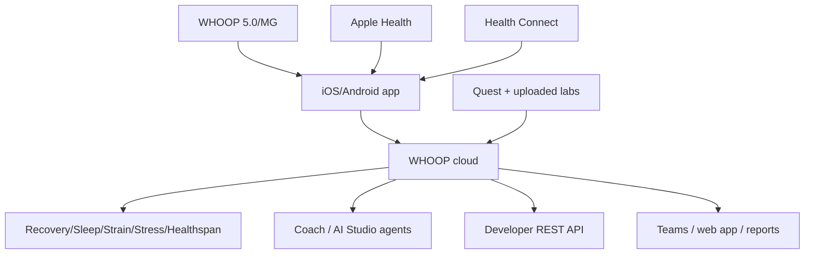

# Deliverable 4 — Product Reverse Engineering

## Publicly reconstructable product map

## Screen / workflow inventory
| Screen/workflow | Publicly known buttons/pages | Purpose | Evidence | Unverified limits |
| --- | --- | --- | --- | --- |
| Homepage | 🟢 Join Now, Try WHOOP free, tier cards, Advanced Labs CTA, athlete proof | 🟢 Public acquisition and education | S1,S8 | No logged-in personalization verified |
| Tier pages: One/Peak/Life | 🟢 Join with tier, compare lineup, start free trial, medical info anchors | 🟢 Subscription selection and upsell | S9 | Checkout screens not fully observed |
| Home tab | 🟢 Strain/Recovery/Sleep dials, My Day, My Plan, My Dashboard, Streak, Action +, Coach entry | 🟢 Daily command center | S10 | Exact visual hierarchy varies by account/tier |
| Health tab | 🟢 Live HR, Hormonal, Healthspan, Stress, Health Monitor, BPI, Heart Screener; greyed features by tier | 🟢 Health vitals/premium feature hub | S10 | Exact locked-state copy not verified |
| Community tab | 🟢 Teams, comparisons, Explore Teams by activity/occupation/journal behaviors | 🟢 Social/accountability loop | S10 | Team admin details not fully public |
| More tab | 🟢 Shop, Settings, Privacy, Support, referral, Digital Labs, profile | 🟢 Account/support/commercial hub | S10 | All subpages not observed |
| Device settings | 🟢 Connectivity, HR Broadcast, battery, device ID, firmware, pair/unpair, firmware check, reboot | 🟢 Hardware management | S10 | Firmware UX not observed |
| Coach screen | 🟢 Textbox/chat, lightbulb My Memory, conversation history/delete, coaching preferences | 🟢 AI interaction and personalization | S5,S10 | Prompts/internal routing not public |
| Daily Outlook | 🟢 Morning summary, strain/activity recommendations, weather/location, commit-to-activity | 🟢 Morning planning loop | S10 | Notification copy not verified |
| Activity Details / Activity Insights | 🟢 Coach icon, analysis of strain/HR zones/stress/patterns, follow-up questions | 🟢 Post-workout learning | S10 | Exact models not public |
| Day in Review | 🟢 End-of-day summary, bedtime range, behavior highlights, wind-down nudges | 🟢 Sleep habit loop | S10 | Exact nudges not public |
| Journal | 🟢 Behavior tracking; Behavior Insights require 5 yes/5 no in 90 days and full calibration at 365 recoveries | 🟢 Causal context/data moat | S10 | Full list of journal items not captured |
| Weekly Plan | 🟢 Unlocks after 7 recoveries | 🟢 Planning/goal loop | S10 | Full plan editor not public |
| Advanced Labs | 🟢 Get Started, schedule Quest test, results, clinician report, action plan, deeper panels, upload past labs, export | 🟢 Biomarker workflow | S3,S7 | In-app purchase screens not fully public |
| ECG / Heart Screener | 🟢 On-demand ECG; finger placement on conductive clasp; share report; region/age restrictions | 🟢 Regulated heart workflow | S2,S4,S9,S22 | Exact waveform PDF UI not captured |
| BPI | 🟢 Daily BP ranges/estimates; cuff calibration required; Life only | 🟢 BP wellness insight | S2,S9,S10,S23 | Modified post-FDA labeling UI not captured |
| Privacy settings | 🟢 Searchability, personalization settings, data access/deletion, Hide Metrics | 🟢 Consent/trust control | S5,S6,S10 | Full privacy center UI not captured |
| Health Connect setup | 🟢 More > Account & Settings > Integrations > Health Connect > Set Up; grant categories | 🟢 Android ecosystem flow | S10 | iOS HealthKit equivalent not fully captured |
| Developer Dashboard | 🟢 Create Team/App, select scopes, redirect URIs, client secret, webhooks, invite team | 🟢 Partner/developer integration | S12-S13 | Dashboard auth requires account; only docs observed |
| Membership/Billing | 🟢 Manage membership, renewal date, upgrade/downgrade, cancel; annual auto-renew | 🟢 Revenue and retention | S7,S10 | Exact cancellation funnel not captured |

## Feature inventory by layer
| Layer | Features | Label/evidence |
| --- | --- | --- |
| Hardware | 🟢 Screenless sensor, 14+ day battery, IP68 device, Basic Charger, Wireless PowerPack, 5.0/MG, ECG clasp on MG, wrist/body wear. | S1-S2,S9-S10 |
| Core physiology | 🟢 HR, HRV, RHR, respiratory rate, skin temp, SpO2, acceleration, sleep, strain, recovery. | S5,S10 |
| Fitness | 🟢 Strain, activity tracking, steps, VO2 Max, HR zones, Strength Trainer, Muscular Strain, 145+ activities. | S2,S10 |
| Sleep | 🟢 Sleep stages, sleep performance, efficiency, consistency, sleep need, haptic alarm, Day in Review. | S10,S25 |
| Health | 🟢 Health Monitor, Stress Monitor, Healthspan, ECG, IHRN, BPI, hormonal insights. | S2,S4,S9-S10,S22-S23 |
| Labs | 🟢 Advanced Labs, Quest scheduling, 122+ biomarkers, panels, clinician-reviewed report, action plan, past lab upload, export. | S3,S7 |
| AI | 🟢 WHOOP Coach, Daily Outlook, Activity Insights, Day in Review, My Memory, Coaching Mode, AI Studio agents. | S5,S10-S11,S18 |
| Community | 🟢 Teams, public team discovery, WHOOP Live, referral rewards. | S10 |
| Privacy/security | 🟢 Privacy Center, Hide Metrics, employee access logs, OAuth revocation, AI zero-retention partner policy. | S5-S6,S10,S13 |

## Hidden workflow status
- 🟢 Exact logged-in screens, prompts, notification wording, account-specific consent modals, ECG report layout, clinician console, support agent console, internal admin permissions, feature flag rules, and model prompts are not publicly verifiable without authorized account access.
- 🟡 Likely hidden workflows include BLE pairing, onboarding goal questionnaire, profile calibration, health permissions, Advanced Labs HIPAA authorization, Quest scheduling, lab result release, AI support escalation, upgrade/downgrade billing, trial return, and team consent.
