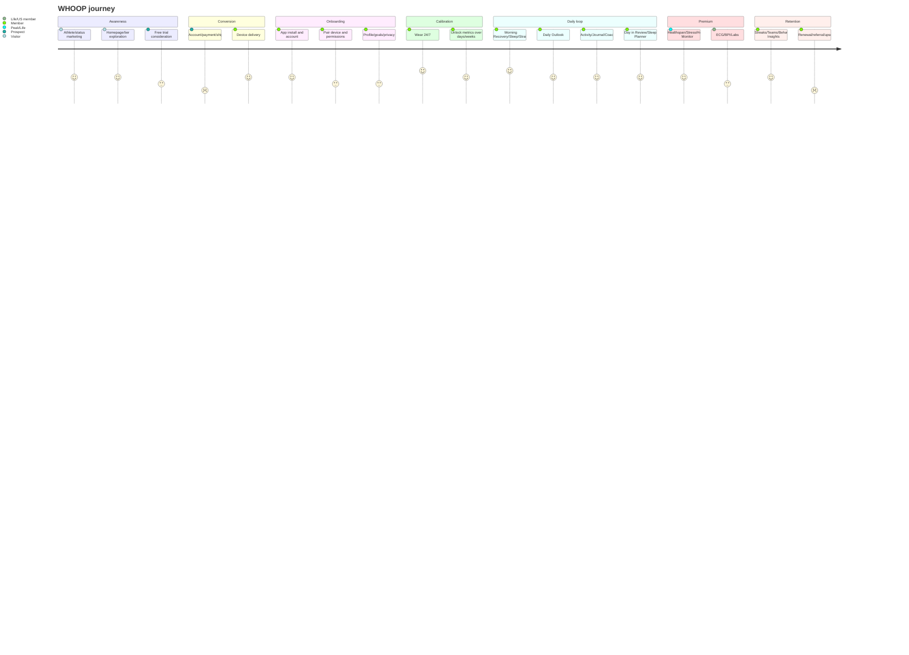

# Deliverables 5 and 6 — Complete User Journey + UX Research

## Journey diagram

## Step-by-step journey
| Stage | Confirmed public workflow | Pain/friction | Ovexis lesson |
| --- | --- | --- | --- |
| Anonymous visitor | 🟢 Homepage, athlete proof, HSA/FSA, tier cards, trial CTA. Evidence: S1,S8. | 🟡 Premium subscription requires trust before value is felt. | Show proof and let users connect existing data before paying. |
| Signup | 🟢 Terms require account and subscription/trial. Evidence: S7. | 🟡 Billing terms are a public complaint vector. | Use cancellation parity and visible billing timeline. |
| Device activation | 🟢 Membership starts on connection or after delivery window. Evidence: S7. | 🟡 Activation timing can surprise users. | State start date explicitly. |
| Permissions | 🟢 Device, internet, app, Health Connect permissions documented. Evidence: S7,S10. | 🟡 Permissions can feel invasive. | Explain data use at permission time. |
| Calibration | 🟢 Features unlock after recoveries/sleeps. Evidence: S10. | 🟡 Delayed gratification may frustrate new users. | Use progress checklist. |
| Daily use | 🟢 Home dials, Coach, My Day/Plan/Dashboard. Evidence: S10. | 🟡 Too many metrics without rationale can overwhelm. | Make next action primary. |
| Recommendations | 🟢 Daily Outlook, Activity Insights, Day in Review. Evidence: S10. | 🟡 AI may feel generic. | Evidence-grounded personalization. |
| Premium health | 🟢 Healthspan, ECG, BPI, Labs. Evidence: S2-S4,S9,S22-S23. | 🟡 Region/tier/regulatory restrictions. | Show eligibility before purchase. |
| Support/renewal | 🟢 Annual auto-renew and support routes documented. Evidence: S7,S10. | 🟡 Public complaints about support and cancellation. | Invest in support as product. |

## UX research analysis
- 🟢 WHOOP public UI/brand uses dark premium styling, large short headlines, athlete photography, app UI overlays, tier comparison cards, and trust badges like HSA/FSA/FDA/lab partners. Evidence: S1-S3,S9.
- 🟢 App IA is Home, Health, Community, More, with Coach integrated into navigation. Evidence: S10.
- 🟡 Visual hierarchy optimizes for status and performance, not clinical neutrality.
- 🟡 Accessibility risk areas: red/yellow/green Recovery semantics, dense charts, metric abbreviations, and score-heavy cognitive load.
- 🟢 Trust signals: FDA-cleared ECG, Quest/clinician labs, peer-reviewed research, privacy principles, no-sale promise, employee access logs. Evidence: S3,S6,S22-S24.
- 🟡 Friction: free trial return, annual billing, upgrade policy, accessory incompatibility, calibration, region-gated features, lab scheduling, cuff calibration, AI disclaimers.
- 🟡 Best microinteraction: daily morning reveal and suggested action.
