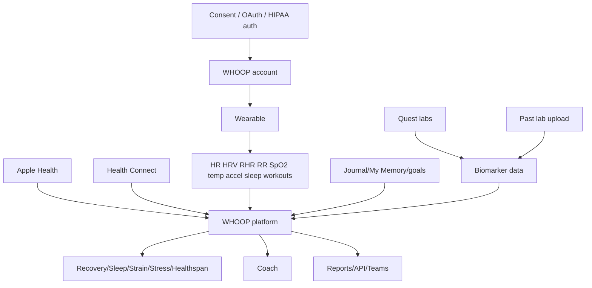

# Deliverables 7 and 8 — Healthcare Workflow + Healthcare Data Architecture

## Healthcare workflow matrix
| Workflow | WHOOP public state | Label/evidence | Ovexis opportunity |
| --- | --- | --- | --- |
| Clinical workflow | WHOOP is not generally a healthcare provider; regulated exception is Heart Screener/ECG. | 🟢 S7,S22 | Build explicit clinician collaboration without overclaiming. |
| Patient/member workflow | Advanced Labs: schedule Quest draw, results, clinician review, action plan; ECG shareable with doctor. | 🟢 S2-S3,S7,S22 | Make patient-controlled sharing structured. |
| Provider workflow | ECG/lab summaries can be shared/exported; no public provider portal verified. | 🟢 S2-S3; 🟢 no portal found | Create provider portal and FHIR exports. |
| Hospital workflow | No public hospital/EHR workflow verified. | 🟢 absence across S3,S12-S13 | Integrate EHR and care coordination. |
| Insurance workflow | Advanced Labs purchases may not be submitted to third-party payors; HSA/FSA eligible. | 🟢 S3,S7 | Offer payer-safe privacy-preserving programs. |
| Lab workflow | Quest powers testing; SteadyMD/Quest independent partners; partner API has requisition/service-request/results. | 🟢 S3,S7,S12 | Abstract multiple lab networks. |
| Pharmacy workflow | No direct pharmacy fulfillment verified; terms mention supplement information may be shown. | 🟢 S7 | Medication/supplement safety layer. |
| Referral workflow | Referral rewards visible in More menu; details not deeply public. | 🟢 S10 | Use clinical referrals and family invites. |
| Medical records | Past lab upload exists; no public EHR/CCDA/CCD ingestion verified. | 🟢 S3; 🟢 no EHR verified | Build longitudinal record ingestion. |
| Care coordination | Team Dashboards exist for sports/organizations, not clinical care coordination. | 🟢 S10,S21 | Build multi-role care team workspace. |

## Data architecture

## Data standards and integrations
- 🟢 Public Developer API is REST/OAuth/OpenAPI, not publicly FHIR. Evidence: S12-S13.
- 🟢 Partner API includes requisitions, service requests, diagnostic report observations. Evidence: S12.
- 🟡 These names resemble healthcare workflow objects, but FHIR compliance is not confirmed.
- 🟢 No public HL7 v2, CCDA, CCD, imaging, genomics, insurance claims, or pharmacy API integration was verified.
- 🟢 Apple Health and Health Connect integrations are public; Health Connect excludes ECG, BPI, WHOOP Age/Pace, VO2 Max. Evidence: S10.
- 🟢 WHOOP collects wellness data, consumer health data, device data, geolocation if permitted, Coach conversations, and lab data. Evidence: S5.
- 🟢 Consent includes OAuth scopes, lab HIPAA authorization, team/managing entity consent, privacy settings, data deletion/access, Coach data modes. Evidence: S5-S7,S10,S13.

## Longitudinal record inference
- 🟡 WHOOP has a longitudinal member record consisting of sensor data, derived scores, behavior logs, lab biomarkers, AI memory, integrations, membership/device history, and team-sharing state.
- 🟡 Ovexis should make this record explicit, portable, FHIR/ABDM-compatible, and clinician-friendly.
