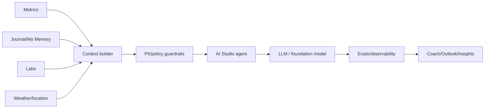

# Deliverables 9, 10, 11, 12 — AI, Technical, API, Security

## AI architecture
- 🟢 WHOOP Coach launched powered by OpenAI/GPT-4. Evidence: S11.
- 🟢 Privacy policy says third-party LLM partner has zero-retention/zero-training policy for WHOOP metrics and receives de-identified metrics only. Evidence: S5.
- 🟢 AI Studio abstracts agents into system instructions, model, and tools; includes visual builder, testing, evals, one-click tools, inline tools, approval/deploy, and PII guardrails. Evidence: S18.
- 🟢 Foundation AI roles explicitly build multimodal foundation models integrating wearable sensors, language, biomarkers, clinical information, and self-reported inputs. Evidence: S17.
- 🟡 Current production provider(s) beyond the 2023 OpenAI launch are not public; AI Studio model selection implies multi-model flexibility.

## Technical stack
| Layer | Confirmed public evidence | Inference |
| --- | --- | --- |
| Web | 🟢 Public headers show Next.js/OpenNext; frontend jobs require Next.js, React, Tailwind. | 🟡 Modern React/Next web stack. |
| Mobile iOS | 🟢 Swift, SwiftUI, UIKit, XCTest, Fastlane, SPM, CocoaPods, REST backend. | 🟡 Native iOS app. |
| Mobile Android | 🟢 Kotlin/Java, Coroutines, Jetpack, Room, Retrofit/OkHttp, MVVM/MVI, Firebase. | 🟡 Native Android app. |
| Backend | 🟢 Java, Kafka, AWS, PostgreSQL, REST APIs, SQS, observability. | 🟡 Microservice architecture. |
| Cloud/platform | 🟢 Kubernetes on AWS, Terraform, IAM, VPC, EC2, S3, RDS, CloudTrail, Organizations. | 🟡 AWS-primary platform. |
| AI/ML | 🟢 PyTorch/TensorFlow, transformers/state-space models, multi-GPU distributed training, SFT/DPO/RL, MLOps. | 🟡 Proprietary multimodal health models. |
| Monitoring/analytics | 🟢 CSP/header domains include Datadog, Sentry, Segment, Amplitude, Pingdom, Google/Meta/TikTok/Reddit pixels. | 🟡 Mature observability + growth attribution stack. |
| Commerce | 🟢 CSP references Shopify/commercetools-related domains; terms mention third-party processors. | 🟡 Mixed subscription/e-commerce stack. |

## Public API
- 🟢 REST/OpenAPI docs are public. Evidence: S12.
- 🟢 OAuth scopes: read recovery, cycles, workout, sleep, profile, body measurement; offline for refresh token. Evidence: S12-S13.
- 🟢 Endpoints: profile, body measurements, cycles, recovery, sleep, workouts, revoke, v1-v2 mapping, partner lab requisitions/service requests/results. Evidence: S12.
- 🟢 Rate limits: 100/minute and 10,000/day per client. Evidence: S13.
- 🟢 Webhooks: workout/sleep/recovery updated/deleted; HMAC-SHA256 validation; retries five times over about one hour; reconciliation recommended. Evidence: S13.
- 🟡 API limitation: no public raw sensor stream, no confirmed FHIR, no broad writeback.

## Security and compliance
- 🟢 WHOOP does not sell member personal data according to Privacy Principles. Evidence: S6.
- 🟢 WHOOP maintains employee access logs and reviews anomalies. Evidence: S6.
- 🟢 Advanced Labs requires HIPAA authorization for Quest/SteadyMD PHI sharing. Evidence: S7.
- 🟢 Product Security role owns HIPAA readiness; AI Risk role covers ISO 42001, NIST AI RMF, EU AI Act, GDPR, prompt injection, data poisoning, data leakage. Evidence: S17.
- 🟢 Terms warn AI hallucination/inaccuracy/bias and no medical-advice status. Evidence: S7.
- 🟡 SOC 2/HITRUST certification is not publicly confirmed in captured sources; job postings indicate readiness/scaling, not certification.
