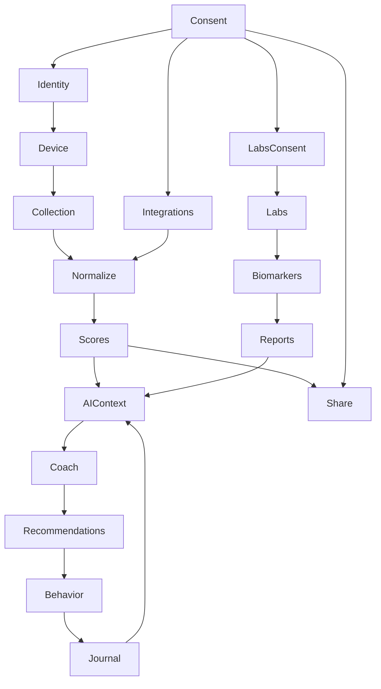

# Deliverables 17, 18, 19 — Decision Ledger, Dependencies, Engineering Backlog

## Decision ledger summary
| Feature/decision | Why built | Pain solved | KPI | Trade-off | Ovexis alternative |
| --- | --- | --- | --- | --- | --- |
| Consent | Required before identity/data/labs/sharing | Privacy and legal safety | Trust/compliance | Friction | Consent cockpit |
| Identity | Account anchors data/device/subscription | Personalization | Activation/retention | Account risk | User-owned identity |
| Device pairing | Connect wearable to app | Data capture | Activation | BLE friction | Bring-your-own devices |
| Data collection | 24/7 physiology | Hidden state | Data moat | Battery/privacy | Multi-device ingestion |
| Normalization | Convert raw to cycles/sleeps/workouts | Usable scores | Insight quality | Opaque transforms | Data quality labels |
| Recovery | Daily readiness | Train/rest | Daily opens | Oversimplification | Evidence-graded readiness |
| Sleep | Sleep health | Rest optimization | Retention | Sleep-stage limits | Sleep disorder triage |
| Strain | Load management | Training dose | Workout use | HR dependence | Sport-specific load |
| Journal | Behavior context | Why metrics changed | Data richness | Logging burden | Passive + active journal |
| Coach | Interpretation | What to do | Engagement | Hallucination | Cited AI |
| Labs | Internal biomarkers | Beyond wearables | ARPU | Clinical ops | Lab-network abstraction |
| Reports | Share results | Doctor/team collaboration | Trust | PDF-only limits | FHIR exports |
| Teams | Social/accountability | Coach overview | Enterprise | Privacy | RBAC firewall |
| Billing | Recurring revenue | Membership access | ARR | Trust backlash | Transparent subscription |

## Feature dependency graph

## Engineering backlog reconstruction
| Phase | Public/inferred scope | Label |
| --- | --- | --- |
| MVP | Wearable HR/HRV/sleep, recovery/strain scoring, mobile app, athletes/teams. | 🟡 |
| 3.0 era | Membership with free hardware and coaching platform for sleep/recovery/strain. | 🟢 S19 |
| 4.0 era | SpO2, skin temperature, Health Monitor, haptics, WHOOP Body/Any-Wear. | 🟢 S10 |
| 5.0/MG current | 14-day battery, smaller hardware, Healthspan, ECG, BPI, Labs, AI expansion, steps/VO2. | 🟢 S2-S3,S10 |
| Next 12 months | AI agents, labs, clinical evidence, regulatory clearances, healthcare GTM, security/HIPAA, international growth. | 🟡 S16-S18 |
| Future | Health OS, clinician/payer/employer workflows, proprietary foundation models, additional medical-adjacent features. | 🔴 |

## Technical debt candidates
- 🟡 Hardware generation compatibility and accessory obsolescence.
- 🟡 Support/billing workflows and AI support quality.
- 🟡 Global feature-gating complexity.
- 🟡 Accuracy perception in high-motion strength/HIIT.
- 🟡 AI evaluation, medical-disclaimer, and regulatory review burden.
- 🟡 Limited public interoperability vs future Health OS ambition.
