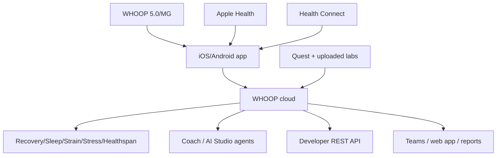
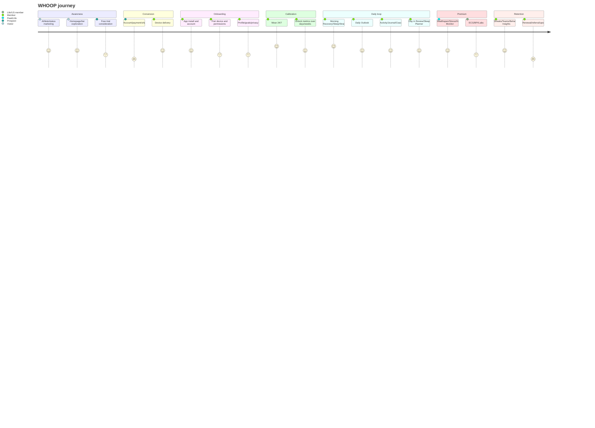
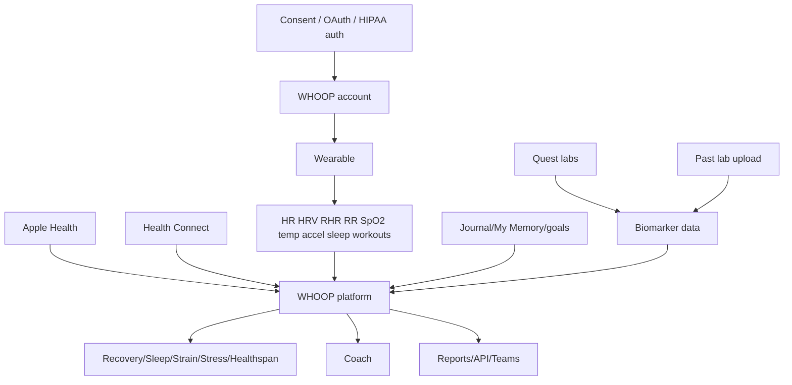
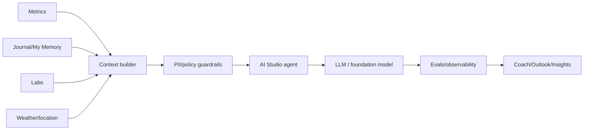
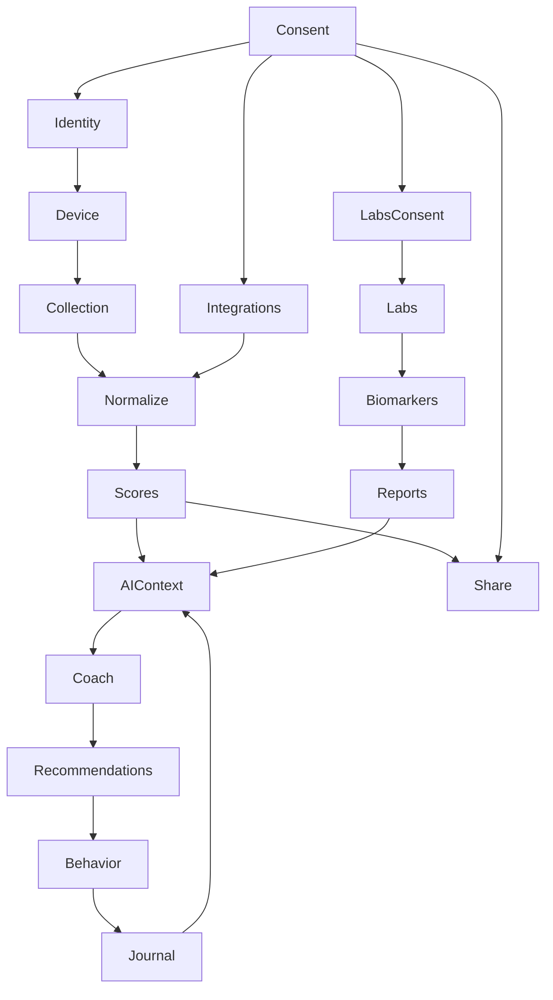

# Deliverable 1 — Executive Summary

## Board-level thesis

- 🟢 WHOOP is no longer merely a fitness tracker company; it publicly positions itself as a wearable membership and personal health platform spanning sleep, recovery, strain, stress, Healthspan, ECG, Blood Pressure Insights, Advanced Labs, and AI coaching. Evidence: S1-S3, S11, S14-S15.
- 🟢 WHOOP’s current public product model combines hardware, subscription, app, AI, labs, developer APIs, and partnerships. Evidence: S1-S3, S9-S13.
- 🟢 WHOOP reported more than 2.5M members, more than 24B hours of physiological data, 103% bookings growth in 2025, $1.1B bookings run rate, and positive operating cash flow in 2025. Evidence: S14.
- 🟡 WHOOP’s strategic moat is the compounding loop: continuous wear → personal baseline → daily readiness ritual → behavior logging → AI interpretation → more data → higher switching cost.
- 🟡 WHOOP’s major vulnerability is trust friction: premium subscriptions, billing/cancellation complaints, 5.0 accessory incompatibility/backlash, support delays, and wellness/medical boundary tension.

## What are they building?

- 🟢 A screenless, 24/7 wearable performance and healthspan intelligence membership. Evidence: S1-S2, S9-S10.
- 🟢 A longitudinal AI coaching system that uses member biometrics, goals, Journal behavior, weather/location, and My Memory context to deliver Daily Outlook, Activity Insights, Day in Review, and conversational Coach answers. Evidence: S10-S11, S18.
- 🟢 A lab-plus-wearable health platform through WHOOP Advanced Labs using Quest testing, clinician-reviewed reports, uploaded historical labs, and personalized action plans. Evidence: S3, S7.
- 🟢 A regulated/medical-adjacent feature set: FDA-cleared ECG Heart Screener and wellness-labelled Blood Pressure Insights. Evidence: S2, S9, S22-S23.
- 🔴 A future “Health OS” that could act as a preventive health agent connecting continuous data, labs, AI, clinician escalation, and potentially payer/employer programs. Evidence basis: S15 plus hiring signals S16-S17.

## Why does it exist?

- 🟢 WHOOP’s stated mission is to unlock human performance and healthspan. Evidence: S5, S14-S17.
- 🟢 Will Ahmed argues healthcare is reactive, episodic, and institution-centered, while continuous biometrics and AI can transform health into a proactive, always-on system. Evidence: S15.
- 🟢 WHOOP’s founder messaging states “Feelings are overrated,” meaning users cannot reliably feel hidden physiological state. Evidence: S19.
- 🟡 WHOOP exists to convert invisible physiological feedback into visible daily guidance and long-term identity-based habit change.

## Customer, emotional, and operational problems

| Problem type | Labelled analysis | WHOOP answer | Ovexis lesson |
| --- | --- | --- | --- |
| Customer problem | 🟢 Users do not know how recovered they are, how hard to train, how well they slept, or what behaviors are affecting physiology. Evidence: S1,S10-S11. | Recovery, Strain, Sleep, Journal, Behavior Insights, Coach. | Ovexis should prioritize next-best-action, not passive charts. |
| Emotional problem | 🟡 Users fear wasting potential, aging poorly, missing early signals, or making hidden health mistakes. | Healthspan, WHOOP Age, athlete proof, daily readiness. | Ovexis should solve anxiety through transparent confidence and action. |
| Operational problem | 🟢 Continuous data requires wear adherence, calibration, device sync, consent, permissions, lab logistics, and regulatory gates. Evidence: S3,S7,S10. | 14-day battery, calibration timeline, Quest workflow, privacy controls. | Ovexis should make data operations and consent visible UX. |
| Trust problem | 🟡 Public reviews show support, billing, upgrade, and accessory compatibility can damage loyalty. Evidence: S25. | Privacy principles and premium support, but also visible complaints. | Ovexis can win by making trust a product feature. |

## Customers and non-customers

- 🟢 WHOOP serves professional athletes, Fortune 500 CEOs, executives, fitness enthusiasts, military personnel, frontline workers, teams/organizations, and anyone seeking performance improvement. Evidence: S11, S14, S20-S21.
- 🟢 WHOOP One is for core fitness/sleep/recovery; Peak is for advanced health/longevity; Life is for medical-grade heart/BP-related features. Evidence: S9.
- 🟢 WHOOP is not a smartwatch, GPS watch, step-counter-only product, medical-advice service, or emergency device. Evidence: S7, S10.
- 🟡 WHOOP is a poor fit for users wanting no subscription, on-device display, built-in GPS, maximal raw data portability, or clinical care replacement.

## Jobs-to-be-done

| JTBD | Label | WHOOP feature | Ovexis implication |
| --- | --- | --- | --- |
| Tell me if I should train hard today | 🟢 | Recovery, Strain Target, Daily Outlook | Action thresholds and rationale must be core. |
| Tell me why I feel tired | 🟢 | Coach uses biometrics, goals, behaviors, performance science | Ovexis needs causal hypotheses and citations. |
| Improve sleep tonight | 🟢 | Sleep Planner, haptic alarm, Day in Review | Sleep should drive daily recommendations. |
| Show habit impact | 🟢 | Journal and Behavior Insights | Behavior experiments are a moat. |
| Connect labs to daily life | 🟢 | Advanced Labs + WHOOP data + action plan | Ovexis should integrate labs earlier and broader. |
| Share safely with coach/doctor | 🟢 | Teams, Hide Metrics, ECG/lab exports | Consent/RBAC must be first-class. |
| Feel like a high performer | 🟡 | Elite ambassadors, screenless discipline, Healthspan | Brand identity can be a retention loop. |
| Avoid surprise billing or opaque lock-in | 🟡 | WHOOP partially fails per public VOC | Ovexis can attack through transparency. |

## Value proposition and category

- 🟢 WHOOP value proposition: 24/7 monitoring plus personalized coaching across sleep, recovery, strain, fitness, stress, heart health, Healthspan, and labs. Evidence: S1-S3, S10-S11.
- 🟡 WHOOP is creating **continuous healthspan performance intelligence**.
- 🟡 WHOOP replaces fragments of smartwatches, sleep trackers, athlete load systems, recovery apps, biomarker/longevity tests, and wellness coaching.
- 🔴 WHOOP may eventually compete with preventive primary care, employer wellness, payer risk reduction, and personal health-record infrastructure.

---

# Deliverable 2 — Company Intelligence

## Timeline
| Date | Event | Label/evidence | Strategic meaning |
| --- | --- | --- | --- |
| 2012 | WHOOP founded; official pages state founded 2012. | 🟢 S14,S19,S21 | Origin as human-performance wearable company. |
| 2020-10 | Raised $100M Series E at $1.2B valuation led by IVP. | 🟢 S19 | Became unicorn and accelerated product/global/member services investment. |
| 2021-08 | Raised $200M Series F at $3.6B valuation led by SoftBank Vision Fund 2. | 🟢 S19 | Standalone wearables valuation breakout. |
| 2021-09 | Acquired PUSH in cash/stock transaction. | 🟢 S20 | Strength training and VBT capabilities. |
| 2023-01 | Hyperice integration/partnership. | 🟢 WHOOP/Hyperice public release | Recovery ecosystem and Apple Health-mediated integrations. |
| 2023-09 | WHOOP Coach powered by OpenAI/GPT-4 launched. | 🟢 S11 | AI becomes product layer. |
| 2024-04 | Expanded to 56 markets; added app languages; named Ed Baker CGO, Michener Chandlee CFO, John Sullivan CMO. | 🟢 S21 | Global growth and pre-IPO management depth. |
| 2024-11 | Notre Dame Athletics partnership with Team Dashboard. | 🟢 WHOOP/Notre Dame public release | Team/enterprise sports workflow. |
| 2025-04 | FDA 510(k) K243236 for WHOOP ECG Feature. | 🟢 S22 | Regulated feature credibility. |
| 2025-05 | WHOOP 5.0/MG launch. | 🟢 S2 | Battery/hardware refresh plus Healthspan/ECG/BPI. |
| 2025-07 | FDA warning letter for BPI. | 🟢 S23 | Regulatory boundary risk. |
| 2026-03 | 600+ role hiring surge. | 🟢 S16 | Scaling AI, clinical, hardware, product, international. |
| 2026-03 | Series G $575M at $10.1B valuation. | 🟢 S14 | Health platform / IPO trajectory. |
| 2026-06 | FDA closeout/non-enforcement for modified BPI. | 🟢 S23 | Regulatory win with modified product/labeling. |

## Founders and leaders

- 🟢 Will Ahmed is Founder & CEO. Evidence: S2,S14-S16,S19,S21.
- 🟢 Emily Capodilupo is SVP Research, Algorithms, and Data and one of WHOOP’s earliest team members. Evidence: S21.
- 🟢 2024 senior leadership: Ed Baker CGO, Michener Chandlee CFO, John Sullivan CMO. Evidence: S21.
- 🟢 Public Harvard/HBS search evidence identifies Will Ahmed, John Capodilupo, and Aurelian Nicolae as co-founders. This report treats that as public evidence but not from captured official WHOOP pages.
- 🟡 The leadership bench is being professionalized for healthcare, AI, regulated products, finance, and global growth.

## Funding and investors

| Round/date | Amount/valuation | Investors | Label |
| --- | --- | --- | --- |
| Series E / 2020 | 🟢 $100M at $1.2B | 🟢 IVP led; SoftBank, Accomplice, Two Sigma, Collaborative Fund, Thursday, NextView, Promus, Cavu, D20, LionTree; athletes including Kevin Durant, Patrick Mahomes, Eli Manning, Rory McIlroy. | 🟢 S19 |
| Series F / 2021 | 🟢 $200M at $3.6B | 🟢 SoftBank Vision Fund 2 led; IVP, Cavu, Thursday, GP Bullhound, Accomplice, NextView, Animal Capital. | 🟢 S19 |
| Series G / 2026 | 🟢 $575M at $10.1B | 🟢 Collaborative Fund led; 2PointZero, QIA, Mubadala, Abbott, Mayo Clinic, Macquarie, Glade Brook, B-Flexion, IVP, Foundry, Accomplice, Affinity, Promus, Bullhound; Ronaldo, LeBron, Rory McIlroy, etc. | 🟢 S14 |

## Acquisitions

- 🟢 PUSH acquisition: Toronto sports tech startup focused on velocity-based training, used by collegiate/pro/Olympic/military teams. Evidence: S20.
- 🟢 WHOOP said PUSH helps unlock deeper strength-training insight and comprehensive feedback on training and wellness. Evidence: S20.
- 🟢 WHOOP stated Ed Baker joined after acquisition of his prior company AnyQuestion. Evidence: S21.
- 🟡 PUSH likely informed Strength Trainer / Muscular Strain, but exact product integration is not fully public.

## Research papers and publications

| Research | Confirmed facts | Strategic use |
| --- | --- | --- |
| COVID respiratory-rate paper | 🟢 PLOS ONE 2020; 271 individuals; 20% pre-symptomatic two days before symptoms; 80% by third symptom day. Evidence: S24. | Early warning narrative and respiratory-rate validation. |
| Wear-frequency study | 🟢 Sensors 2025; 11,914 subscribers and nearly 1M days/nights; higher wear linked to lower RHR, higher HRV, longer/more consistent sleep, more activity. Evidence: S24. | Behavior-change proof for membership model. |
| Sleep/circadian study | 🟢 WHOOP announced Sleep publication in 38,838 adults; sunlight, time-restricted eating, Zone 2, breathwork improved sleep consistency/RHR/HRV. Evidence: S24. | Scientific basis for coaching content. |
| Alcohol studies | 🟢 WHOOP public article cites PLOS Digital Health and JMIR mHealth/uHealth studies on alcohol impact and drinking reductions. | Behavior-loop credibility. |
| ECG clinical trial | 🟢 FDA 510(k) references clinical trial NCT06622265. Evidence: S22. | Regulated cardiac feature evidence. |

## Patents / IP

- 🟢 Public patent databases list WHOOP inventions around automated exercise recommendations, recovery indicators from HR/HRV/sleep, continuous HR monitoring, reflected-light HR signal quality, wearable design, and continuous physiological monitoring.
- 🟢 WHOOP calls Blood Pressure Insights patent-pending. Evidence: S2.
- 🟡 IP moat centers on signal processing, recovery/strain scoring, wearable charging/wearability, and longitudinal recommendations.

## Geographic expansion and distribution

- 🟢 WHOOP ships to 56 markets and sells via WHOOP.com, Amazon, Best Buy, Dick’s, Flipkart, Virgin Megastore, and more. Evidence: S1-S2,S14,S21.
- 🟢 App languages include English, French, German, Italian, Spanish. Evidence: S1-S2,S21.
- 🟢 2024 direct markets included Qatar, Saudi Arabia, Kuwait, Bahrain, Hong Kong, Israel, Korea, Taiwan. Evidence: S21.
- 🟡 India is an expansion node because Flipkart is listed and a Mumbai marketplace role was open. Evidence: S1,S17.

## Regulatory filings / enforcement

- 🟢 FDA K243236: WHOOP ECG Feature, product code QDA, regulation 870.2345, decision 2025-04-04, substantially equivalent. Evidence: S22.
- 🟢 FDA BPI warning letter 2025-07-14 asserted BPI was marketed without clearance/approval and was inherently associated with diagnosis of hypo/hypertension. Evidence: S23.
- 🟢 FDA 2026-06-17 closeout/non-enforcement letter stated FDA does not intend to enforce device requirements for modified BPI product/labeling. Evidence: S23.

## Strategic partnerships

- 🟢 Quest/SteadyMD for Advanced Labs; WHOOP says it is not lab/provider. Evidence: S3,S7.
- 🟢 Buck Institute / Dr. Eric Verdin for Healthspan. Evidence: S2.
- 🟢 OpenAI/GPT-4 for WHOOP Coach launch. Evidence: S11.
- 🟢 Abbott and Mayo Clinic joined Series G as strategic investors. Evidence: S14.
- 🟢 Hyperice and Notre Dame partnerships support recovery/team use cases. Evidence: public WHOOP releases.

---

# Deliverable 3 — Founder Psychology Report

## Beliefs
- 🟢 Will Ahmed publicly believes modern healthcare is reactive, episodic, expensive, and institution-centered. Evidence: S15.
- 🟢 Will Ahmed publicly believes the Health OS will continuously monitor biology, use AI to predict risk, nudge behavior, and escalate care. Evidence: S15.
- 🟢 WHOOP’s founder messaging states “Feelings are overrated,” meaning physiology can change before subjective awareness. Evidence: S19.
- 🟡 Founder belief system: the highest performers already treat the body as an instrumented system; WHOOP’s job is to democratize this operating model.

## Product philosophy
- 🟢 Screenless hardware is intentional: WHOOP says it is not a smartwatch and has no distracting display. Evidence: S1,S10.
- 🟢 Personal baselines and calibration are central: features unlock after wear history. Evidence: S10.
- 🟢 WHOOP’s internal AI Studio shows a philosophy of rapid agent experimentation with production approvals and privacy guardrails. Evidence: S18.
- 🟡 WHOOP optimizes for repeated behavior loops, not one-off measurement.

## Decision framework
- 🟢 WHOOP culture values mission, research/design/privacy, high intensity with humility, best idea wins, bias for action, and member obsession. Evidence: S16.
- 🟡 Public product decisions suggest criteria: data continuity, personalization, premium tier value, scientific defensibility, regulatory boundary, brand consistency, and retention.

## Risk tolerance
- 🟢 WHOOP contested FDA’s initial BPI classification and later obtained a closeout/non-enforcement letter after modifications/labeling. Evidence: S23.
- 🟡 This indicates high but not reckless risk tolerance: WHOOP pushes category boundaries while building regulatory/clinical/security teams.

## Long-term ambition
- 🟢 WHOOP explicitly wants to build a personal health platform and Health OS. Evidence: S14-S15.
- 🔴 Over 10 years, WHOOP likely seeks public-market scale and a role in consumer preventive care, employer wellness, and possibly payer/provider ecosystems.

---

# Deliverable 4 — Product Reverse Engineering

## Publicly reconstructable product map

## Screen / workflow inventory
| Screen/workflow | Publicly known buttons/pages | Purpose | Evidence | Unverified limits |
| --- | --- | --- | --- | --- |
| Homepage | 🟢 Join Now, Try WHOOP free, tier cards, Advanced Labs CTA, athlete proof | 🟢 Public acquisition and education | S1,S8 | No logged-in personalization verified |
| Tier pages: One/Peak/Life | 🟢 Join with tier, compare lineup, start free trial, medical info anchors | 🟢 Subscription selection and upsell | S9 | Checkout screens not fully observed |
| Home tab | 🟢 Strain/Recovery/Sleep dials, My Day, My Plan, My Dashboard, Streak, Action +, Coach entry | 🟢 Daily command center | S10 | Exact visual hierarchy varies by account/tier |
| Health tab | 🟢 Live HR, Hormonal, Healthspan, Stress, Health Monitor, BPI, Heart Screener; greyed features by tier | 🟢 Health vitals/premium feature hub | S10 | Exact locked-state copy not verified |
| Community tab | 🟢 Teams, comparisons, Explore Teams by activity/occupation/journal behaviors | 🟢 Social/accountability loop | S10 | Team admin details not fully public |
| More tab | 🟢 Shop, Settings, Privacy, Support, referral, Digital Labs, profile | 🟢 Account/support/commercial hub | S10 | All subpages not observed |
| Device settings | 🟢 Connectivity, HR Broadcast, battery, device ID, firmware, pair/unpair, firmware check, reboot | 🟢 Hardware management | S10 | Firmware UX not observed |
| Coach screen | 🟢 Textbox/chat, lightbulb My Memory, conversation history/delete, coaching preferences | 🟢 AI interaction and personalization | S5,S10 | Prompts/internal routing not public |
| Daily Outlook | 🟢 Morning summary, strain/activity recommendations, weather/location, commit-to-activity | 🟢 Morning planning loop | S10 | Notification copy not verified |
| Activity Details / Activity Insights | 🟢 Coach icon, analysis of strain/HR zones/stress/patterns, follow-up questions | 🟢 Post-workout learning | S10 | Exact models not public |
| Day in Review | 🟢 End-of-day summary, bedtime range, behavior highlights, wind-down nudges | 🟢 Sleep habit loop | S10 | Exact nudges not public |
| Journal | 🟢 Behavior tracking; Behavior Insights require 5 yes/5 no in 90 days and full calibration at 365 recoveries | 🟢 Causal context/data moat | S10 | Full list of journal items not captured |
| Weekly Plan | 🟢 Unlocks after 7 recoveries | 🟢 Planning/goal loop | S10 | Full plan editor not public |
| Advanced Labs | 🟢 Get Started, schedule Quest test, results, clinician report, action plan, deeper panels, upload past labs, export | 🟢 Biomarker workflow | S3,S7 | In-app purchase screens not fully public |
| ECG / Heart Screener | 🟢 On-demand ECG; finger placement on conductive clasp; share report; region/age restrictions | 🟢 Regulated heart workflow | S2,S4,S9,S22 | Exact waveform PDF UI not captured |
| BPI | 🟢 Daily BP ranges/estimates; cuff calibration required; Life only | 🟢 BP wellness insight | S2,S9,S10,S23 | Modified post-FDA labeling UI not captured |
| Privacy settings | 🟢 Searchability, personalization settings, data access/deletion, Hide Metrics | 🟢 Consent/trust control | S5,S6,S10 | Full privacy center UI not captured |
| Health Connect setup | 🟢 More > Account & Settings > Integrations > Health Connect > Set Up; grant categories | 🟢 Android ecosystem flow | S10 | iOS HealthKit equivalent not fully captured |
| Developer Dashboard | 🟢 Create Team/App, select scopes, redirect URIs, client secret, webhooks, invite team | 🟢 Partner/developer integration | S12-S13 | Dashboard auth requires account; only docs observed |
| Membership/Billing | 🟢 Manage membership, renewal date, upgrade/downgrade, cancel; annual auto-renew | 🟢 Revenue and retention | S7,S10 | Exact cancellation funnel not captured |

## Feature inventory by layer
| Layer | Features | Label/evidence |
| --- | --- | --- |
| Hardware | 🟢 Screenless sensor, 14+ day battery, IP68 device, Basic Charger, Wireless PowerPack, 5.0/MG, ECG clasp on MG, wrist/body wear. | S1-S2,S9-S10 |
| Core physiology | 🟢 HR, HRV, RHR, respiratory rate, skin temp, SpO2, acceleration, sleep, strain, recovery. | S5,S10 |
| Fitness | 🟢 Strain, activity tracking, steps, VO2 Max, HR zones, Strength Trainer, Muscular Strain, 145+ activities. | S2,S10 |
| Sleep | 🟢 Sleep stages, sleep performance, efficiency, consistency, sleep need, haptic alarm, Day in Review. | S10,S25 |
| Health | 🟢 Health Monitor, Stress Monitor, Healthspan, ECG, IHRN, BPI, hormonal insights. | S2,S4,S9-S10,S22-S23 |
| Labs | 🟢 Advanced Labs, Quest scheduling, 122+ biomarkers, panels, clinician-reviewed report, action plan, past lab upload, export. | S3,S7 |
| AI | 🟢 WHOOP Coach, Daily Outlook, Activity Insights, Day in Review, My Memory, Coaching Mode, AI Studio agents. | S5,S10-S11,S18 |
| Community | 🟢 Teams, public team discovery, WHOOP Live, referral rewards. | S10 |
| Privacy/security | 🟢 Privacy Center, Hide Metrics, employee access logs, OAuth revocation, AI zero-retention partner policy. | S5-S6,S10,S13 |

## Hidden workflow status
- 🟢 Exact logged-in screens, prompts, notification wording, account-specific consent modals, ECG report layout, clinician console, support agent console, internal admin permissions, feature flag rules, and model prompts are not publicly verifiable without authorized account access.
- 🟡 Likely hidden workflows include BLE pairing, onboarding goal questionnaire, profile calibration, health permissions, Advanced Labs HIPAA authorization, Quest scheduling, lab result release, AI support escalation, upgrade/downgrade billing, trial return, and team consent.

---

# Deliverables 5 and 6 — Complete User Journey + UX Research

## Journey diagram

## Step-by-step journey
| Stage | Confirmed public workflow | Pain/friction | Ovexis lesson |
| --- | --- | --- | --- |
| Anonymous visitor | 🟢 Homepage, athlete proof, HSA/FSA, tier cards, trial CTA. Evidence: S1,S8. | 🟡 Premium subscription requires trust before value is felt. | Show proof and let users connect existing data before paying. |
| Signup | 🟢 Terms require account and subscription/trial. Evidence: S7. | 🟡 Billing terms are a public complaint vector. | Use cancellation parity and visible billing timeline. |
| Device activation | 🟢 Membership starts on connection or after delivery window. Evidence: S7. | 🟡 Activation timing can surprise users. | State start date explicitly. |
| Permissions | 🟢 Device, internet, app, Health Connect permissions documented. Evidence: S7,S10. | 🟡 Permissions can feel invasive. | Explain data use at permission time. |
| Calibration | 🟢 Features unlock after recoveries/sleeps. Evidence: S10. | 🟡 Delayed gratification may frustrate new users. | Use progress checklist. |
| Daily use | 🟢 Home dials, Coach, My Day/Plan/Dashboard. Evidence: S10. | 🟡 Too many metrics without rationale can overwhelm. | Make next action primary. |
| Recommendations | 🟢 Daily Outlook, Activity Insights, Day in Review. Evidence: S10. | 🟡 AI may feel generic. | Evidence-grounded personalization. |
| Premium health | 🟢 Healthspan, ECG, BPI, Labs. Evidence: S2-S4,S9,S22-S23. | 🟡 Region/tier/regulatory restrictions. | Show eligibility before purchase. |
| Support/renewal | 🟢 Annual auto-renew and support routes documented. Evidence: S7,S10. | 🟡 Public complaints about support and cancellation. | Invest in support as product. |

## UX research analysis
- 🟢 WHOOP public UI/brand uses dark premium styling, large short headlines, athlete photography, app UI overlays, tier comparison cards, and trust badges like HSA/FSA/FDA/lab partners. Evidence: S1-S3,S9.
- 🟢 App IA is Home, Health, Community, More, with Coach integrated into navigation. Evidence: S10.
- 🟡 Visual hierarchy optimizes for status and performance, not clinical neutrality.
- 🟡 Accessibility risk areas: red/yellow/green Recovery semantics, dense charts, metric abbreviations, and score-heavy cognitive load.
- 🟢 Trust signals: FDA-cleared ECG, Quest/clinician labs, peer-reviewed research, privacy principles, no-sale promise, employee access logs. Evidence: S3,S6,S22-S24.
- 🟡 Friction: free trial return, annual billing, upgrade policy, accessory incompatibility, calibration, region-gated features, lab scheduling, cuff calibration, AI disclaimers.
- 🟡 Best microinteraction: daily morning reveal and suggested action.

---

# Deliverables 7 and 8 — Healthcare Workflow + Healthcare Data Architecture

## Healthcare workflow matrix
| Workflow | WHOOP public state | Label/evidence | Ovexis opportunity |
| --- | --- | --- | --- |
| Clinical workflow | WHOOP is not generally a healthcare provider; regulated exception is Heart Screener/ECG. | 🟢 S7,S22 | Build explicit clinician collaboration without overclaiming. |
| Patient/member workflow | Advanced Labs: schedule Quest draw, results, clinician review, action plan; ECG shareable with doctor. | 🟢 S2-S3,S7,S22 | Make patient-controlled sharing structured. |
| Provider workflow | ECG/lab summaries can be shared/exported; no public provider portal verified. | 🟢 S2-S3; 🟢 no portal found | Create provider portal and FHIR exports. |
| Hospital workflow | No public hospital/EHR workflow verified. | 🟢 absence across S3,S12-S13 | Integrate EHR and care coordination. |
| Insurance workflow | Advanced Labs purchases may not be submitted to third-party payors; HSA/FSA eligible. | 🟢 S3,S7 | Offer payer-safe privacy-preserving programs. |
| Lab workflow | Quest powers testing; SteadyMD/Quest independent partners; partner API has requisition/service-request/results. | 🟢 S3,S7,S12 | Abstract multiple lab networks. |
| Pharmacy workflow | No direct pharmacy fulfillment verified; terms mention supplement information may be shown. | 🟢 S7 | Medication/supplement safety layer. |
| Referral workflow | Referral rewards visible in More menu; details not deeply public. | 🟢 S10 | Use clinical referrals and family invites. |
| Medical records | Past lab upload exists; no public EHR/CCDA/CCD ingestion verified. | 🟢 S3; 🟢 no EHR verified | Build longitudinal record ingestion. |
| Care coordination | Team Dashboards exist for sports/organizations, not clinical care coordination. | 🟢 S10,S21 | Build multi-role care team workspace. |

## Data architecture

## Data standards and integrations
- 🟢 Public Developer API is REST/OAuth/OpenAPI, not publicly FHIR. Evidence: S12-S13.
- 🟢 Partner API includes requisitions, service requests, diagnostic report observations. Evidence: S12.
- 🟡 These names resemble healthcare workflow objects, but FHIR compliance is not confirmed.
- 🟢 No public HL7 v2, CCDA, CCD, imaging, genomics, insurance claims, or pharmacy API integration was verified.
- 🟢 Apple Health and Health Connect integrations are public; Health Connect excludes ECG, BPI, WHOOP Age/Pace, VO2 Max. Evidence: S10.
- 🟢 WHOOP collects wellness data, consumer health data, device data, geolocation if permitted, Coach conversations, and lab data. Evidence: S5.
- 🟢 Consent includes OAuth scopes, lab HIPAA authorization, team/managing entity consent, privacy settings, data deletion/access, Coach data modes. Evidence: S5-S7,S10,S13.

## Longitudinal record inference
- 🟡 WHOOP has a longitudinal member record consisting of sensor data, derived scores, behavior logs, lab biomarkers, AI memory, integrations, membership/device history, and team-sharing state.
- 🟡 Ovexis should make this record explicit, portable, FHIR/ABDM-compatible, and clinician-friendly.

---

# Deliverables 9, 10, 11, 12 — AI, Technical, API, Security

## AI architecture
- 🟢 WHOOP Coach launched powered by OpenAI/GPT-4. Evidence: S11.
- 🟢 Privacy policy says third-party LLM partner has zero-retention/zero-training policy for WHOOP metrics and receives de-identified metrics only. Evidence: S5.
- 🟢 AI Studio abstracts agents into system instructions, model, and tools; includes visual builder, testing, evals, one-click tools, inline tools, approval/deploy, and PII guardrails. Evidence: S18.
- 🟢 Foundation AI roles explicitly build multimodal foundation models integrating wearable sensors, language, biomarkers, clinical information, and self-reported inputs. Evidence: S17.
- 🟡 Current production provider(s) beyond the 2023 OpenAI launch are not public; AI Studio model selection implies multi-model flexibility.

## Technical stack
| Layer | Confirmed public evidence | Inference |
| --- | --- | --- |
| Web | 🟢 Public headers show Next.js/OpenNext; frontend jobs require Next.js, React, Tailwind. | 🟡 Modern React/Next web stack. |
| Mobile iOS | 🟢 Swift, SwiftUI, UIKit, XCTest, Fastlane, SPM, CocoaPods, REST backend. | 🟡 Native iOS app. |
| Mobile Android | 🟢 Kotlin/Java, Coroutines, Jetpack, Room, Retrofit/OkHttp, MVVM/MVI, Firebase. | 🟡 Native Android app. |
| Backend | 🟢 Java, Kafka, AWS, PostgreSQL, REST APIs, SQS, observability. | 🟡 Microservice architecture. |
| Cloud/platform | 🟢 Kubernetes on AWS, Terraform, IAM, VPC, EC2, S3, RDS, CloudTrail, Organizations. | 🟡 AWS-primary platform. |
| AI/ML | 🟢 PyTorch/TensorFlow, transformers/state-space models, multi-GPU distributed training, SFT/DPO/RL, MLOps. | 🟡 Proprietary multimodal health models. |
| Monitoring/analytics | 🟢 CSP/header domains include Datadog, Sentry, Segment, Amplitude, Pingdom, Google/Meta/TikTok/Reddit pixels. | 🟡 Mature observability + growth attribution stack. |
| Commerce | 🟢 CSP references Shopify/commercetools-related domains; terms mention third-party processors. | 🟡 Mixed subscription/e-commerce stack. |

## Public API
- 🟢 REST/OpenAPI docs are public. Evidence: S12.
- 🟢 OAuth scopes: read recovery, cycles, workout, sleep, profile, body measurement; offline for refresh token. Evidence: S12-S13.
- 🟢 Endpoints: profile, body measurements, cycles, recovery, sleep, workouts, revoke, v1-v2 mapping, partner lab requisitions/service requests/results. Evidence: S12.
- 🟢 Rate limits: 100/minute and 10,000/day per client. Evidence: S13.
- 🟢 Webhooks: workout/sleep/recovery updated/deleted; HMAC-SHA256 validation; retries five times over about one hour; reconciliation recommended. Evidence: S13.
- 🟡 API limitation: no public raw sensor stream, no confirmed FHIR, no broad writeback.

## Security and compliance
- 🟢 WHOOP does not sell member personal data according to Privacy Principles. Evidence: S6.
- 🟢 WHOOP maintains employee access logs and reviews anomalies. Evidence: S6.
- 🟢 Advanced Labs requires HIPAA authorization for Quest/SteadyMD PHI sharing. Evidence: S7.
- 🟢 Product Security role owns HIPAA readiness; AI Risk role covers ISO 42001, NIST AI RMF, EU AI Act, GDPR, prompt injection, data poisoning, data leakage. Evidence: S17.
- 🟢 Terms warn AI hallucination/inaccuracy/bias and no medical-advice status. Evidence: S7.
- 🟡 SOC 2/HITRUST certification is not publicly confirmed in captured sources; job postings indicate readiness/scaling, not certification.

---

# Deliverables 13, 14, 15, 16 — Business Model, Growth, Hiring, Customer Intelligence

## Business model
- 🟢 Core revenue is annual membership with hardware included: One $199, Peak $239, Life $359 U.S. Evidence: S1-S2,S9.
- 🟢 Advanced Labs is separate add-on/subscription: $199-$899/year depending on tests/year. Evidence: S3.
- 🟢 Additional revenue likely includes accessories/apparel, enterprise/team programs, retail channels. Evidence: S1,S3,S10,S20-S21.
- 🟢 WHOOP reported positive operating cash flow and $1.1B bookings run rate in 2025. Evidence: S14.
- 🟡 Unit economics are hardware-subsidized subscription economics; retention must be high to recover device, support, fulfillment, marketing, warranty, cloud, and AI costs.

## Growth strategy
| Channel | Evidence | Strategic role |
| --- | --- | --- |
| DTC website/trial | 🟢 S1,S8 | Acquire consumers without upfront device purchase. |
| Retail/marketplaces | 🟢 Amazon, Best Buy, Dick’s, Flipkart, Virgin Megastore listed. S1-S2,S21 | Scale geographic distribution. |
| Athlete/celebrity proof | 🟢 Ronaldo, LeBron, Rory, Mahomes, PSG, Ferrari, etc. S1,S14 | Status and trust transfer. |
| Teams/organizations | 🟢 Notre Dame and Team Dashboard. S10,S21 | Enterprise and viral group adoption. |
| Content/SEO | 🟢 Locker articles and founder Health OS essay. S15 | Category creation and education. |
| Developer ecosystem | 🟢 Developer API/webhooks. S12-S13 | Partner integrations and portability. |
| Referrals/community | 🟢 Referral rewards and Teams in app. S10 | Member-driven growth. |
| Healthcare GTM | 🟢 VP Healthcare GTM open role. S17 | Future provider/payer/employer channel. |

## Hiring intelligence
- 🟢 WHOOP planned 600+ roles across Software, Research & Design, Hardware, Product, Marketing. Evidence: S16.
- 🟢 Open positions at capture included Software (35), Hardware (16), ML/Research (16), BI/Analytics (11), InfoSec (9), Product (7), Health & Medical (4), Foundation AI (2). Evidence: S17.
- 🟢 Healthcare/regulated roles: VP Healthcare GTM, Senior PM Healthcare, Senior Program Manager SaMD, Regulatory Affairs Digital Health & AI, Director Clinical Science, Director Clinical Operations, Director HEOR. Evidence: S17.
- 🟡 Roadmap inference: healthcare GTM, regulated digital health, clinical evidence, AI governance, proprietary foundation models, next-gen hardware, international expansion.

## Customer intelligence
| Theme | Public evidence | Interpretation |
| --- | --- | --- |
| Praise: sleep/recovery insights | 🟢 App Store and public review snippets praise data/insights. S25 | Core PMF is strong among consistent users. |
| Praise: screenless/battery | 🟢 Public product + reviews. S1,S25 | Differentiates from smartwatches. |
| Complaint: support/billing/cancel | 🟢 Trustpilot/App Store/Reddit snippets. S25 | Trust and lifecycle ops vulnerability. |
| Complaint: upgrade/accessories | 🟢 Public 5.0 backlash snippets. S25 | Compatibility and perceived promise-breaking risk. |
| Complaint: strength/HR accuracy | 🟢 App Store/community snippets. S25 | Algorithm trust risk in high-motion sports. |
| Feature request: more actionable AI | 🟢 Public community snippets. S25 | Users want specific next actions, not generic insight. |
| Unexpected use cases | 🟢 WHOOP founder essay cites PTSD, pregnancy, rehab, COVID, eating disorder, heart attack anecdotes. S19 | Platform becomes early-warning/personal accountability system. |

---

# Deliverables 17, 18, 19 — Decision Ledger, Dependencies, Engineering Backlog

## Decision ledger summary
| Feature/decision | Why built | Pain solved | KPI | Trade-off | Ovexis alternative |
| --- | --- | --- | --- | --- | --- |
| Consent | Required before identity/data/labs/sharing | Privacy and legal safety | Trust/compliance | Friction | Consent cockpit |
| Identity | Account anchors data/device/subscription | Personalization | Activation/retention | Account risk | User-owned identity |
| Device pairing | Connect wearable to app | Data capture | Activation | BLE friction | Bring-your-own devices |
| Data collection | 24/7 physiology | Hidden state | Data moat | Battery/privacy | Multi-device ingestion |
| Normalization | Convert raw to cycles/sleeps/workouts | Usable scores | Insight quality | Opaque transforms | Data quality labels |
| Recovery | Daily readiness | Train/rest | Daily opens | Oversimplification | Evidence-graded readiness |
| Sleep | Sleep health | Rest optimization | Retention | Sleep-stage limits | Sleep disorder triage |
| Strain | Load management | Training dose | Workout use | HR dependence | Sport-specific load |
| Journal | Behavior context | Why metrics changed | Data richness | Logging burden | Passive + active journal |
| Coach | Interpretation | What to do | Engagement | Hallucination | Cited AI |
| Labs | Internal biomarkers | Beyond wearables | ARPU | Clinical ops | Lab-network abstraction |
| Reports | Share results | Doctor/team collaboration | Trust | PDF-only limits | FHIR exports |
| Teams | Social/accountability | Coach overview | Enterprise | Privacy | RBAC firewall |
| Billing | Recurring revenue | Membership access | ARR | Trust backlash | Transparent subscription |

## Feature dependency graph

## Engineering backlog reconstruction
| Phase | Public/inferred scope | Label |
| --- | --- | --- |
| MVP | Wearable HR/HRV/sleep, recovery/strain scoring, mobile app, athletes/teams. | 🟡 |
| 3.0 era | Membership with free hardware and coaching platform for sleep/recovery/strain. | 🟢 S19 |
| 4.0 era | SpO2, skin temperature, Health Monitor, haptics, WHOOP Body/Any-Wear. | 🟢 S10 |
| 5.0/MG current | 14-day battery, smaller hardware, Healthspan, ECG, BPI, Labs, AI expansion, steps/VO2. | 🟢 S2-S3,S10 |
| Next 12 months | AI agents, labs, clinical evidence, regulatory clearances, healthcare GTM, security/HIPAA, international growth. | 🟡 S16-S18 |
| Future | Health OS, clinician/payer/employer workflows, proprietary foundation models, additional medical-adjacent features. | 🔴 |

## Technical debt candidates
- 🟡 Hardware generation compatibility and accessory obsolescence.
- 🟡 Support/billing workflows and AI support quality.
- 🟡 Global feature-gating complexity.
- 🟡 Accuracy perception in high-motion strength/HIIT.
- 🟡 AI evaluation, medical-disclaimer, and regulatory review burden.
- 🟡 Limited public interoperability vs future Health OS ambition.

---

# Deliverables 20-24 — Competitive Landscape, Moat, Failure, Attack Plan, Future Prediction

## Competitive landscape
| Competitor | Overlap | Differentiator vs WHOOP | WHOOP advantage | Ovexis implication |
| --- | --- | --- | --- | --- |
| Oura | 🟢 Sleep/readiness/stress/heart/women/longevity | 🟢 Finger ring, comfort, 50+ metrics | 🟡 Better athletic strain/team/labs bundle | Ingest both Oura and WHOOP. |
| Ultrahuman | 🟢 Sleep/HRV/recovery/temp/movement | 🟢 Subscription-free ring, M1 glucose, circadian nudges, India base | 🟡 Stronger AI/labs/team brand | India + glucose is strategic. |
| Function Health | 🟢 Biomarkers/action plans | 🟢 160+ labs, 2x/year, $365/year | 🟡 Daily wearable loop | Labs must be native to Ovexis. |
| Superpower | 🟢 Labs, AI, wearables, care team | 🟢 $199/year, 100+ biomarkers, wearable sync | 🟡 WHOOP owns daily engagement | Low-cost labs threaten Advanced Labs. |
| Levels | 🟢 Behavior feedback/labs/wearables | 🟢 CGM and food-specific metabolic feedback | 🟡 Broader recovery/sleep platform | Glucose is a gap to fill. |
| Apple | 🟢 HR/sleep/ECG/AFib/Health | 🟢 Massive ecosystem and device platform | 🟡 Screenless coaching identity/battery | Ovexis should leverage Apple data. |
| Google/Fitbit | 🟢 Sleep/activity/Health Connect | 🟢 Android health data hub | 🟡 Premium coaching/data brand | Integrate Health Connect first. |
| Human API | 🟢 Health data connectivity | 🟢 EHR/labs/wearable aggregation | 🟡 WHOOP owns hardware engagement | Build/partner for EHR layer. |
| OpenEvidence/UpToDate/AMBOSS | 🟢 Health AI/knowledge | 🟢 Evidence-grounded clinician answers | 🟡 WHOOP owns personal sensor data | Ovexis AI must cite evidence. |
| Atropos | 🟢 AI + real-world evidence | 🟢 RWE on clinical datasets | 🟡 WHOOP owns consumer longitudinal data | Evidence generation can be moat. |
| India platforms: Apollo/Practo/1mg/Healthify | 🟢 Digital health services/coaching/labs | 🟢 Distribution, doctors, pharmacy, India workflows | 🟡 WHOOP owns continuous physiology | Partner/integrate locally. |

## Moat analysis
| Moat | Rating | Labelled basis |
| --- | --- | --- |
| Data moat | Strong | 🟢 24B+ physiology hours and 2.5M+ members. S14 |
| AI moat | Medium→Strong | 🟢 AI Studio + Foundation AI roles. S17-S18 |
| Clinical moat | Medium | 🟢 ECG clearance + labs + clinical hires; BPI warning risk. S3,S17,S22-S23 |
| Brand moat | Strong | 🟢 Elite athletes/culture. S1,S14 |
| Distribution moat | Medium | 🟢 DTC, retail, 56 markets; Apple/Amazon stronger. S1,S21 |
| Developer moat | Weak→Medium | 🟢 API exists but limited. S12-S13 |
| Regulatory moat | Emerging | 🟢 ECG and BPI learning. S22-S23 |
| Network effects | Medium | 🟢 Teams/community/research loops. S10,S24 |
| Switching costs | Strong | 🟡 Baselines, history, Journal, Coach memory, teams, annual billing. |
| Trust moat | Medium | 🟢 privacy posture; 🟡 public backlash. |

## Failure analysis
- 🟡 Technical failure: HR/strength accuracy damages trust in derived metrics.
- 🟢 Regulatory failure: BPI warning proves claims can trigger FDA enforcement. Evidence: S23.
- 🟡 Business failure: subscription fatigue, billing friction, support delays, accessory incompatibility.
- 🟡 AI failure: hallucinated/generic coaching or privacy incident.
- 🟡 Distribution failure: Apple/Oura/Ultrahuman/lab platforms absorb features.
- 🔴 Economic failure: pre-IPO growth pressure drives excessive upsell and trust erosion.

## Attack plan for Ovexis
1. 🟡 Build hardware-agnostic intelligence layer first.
2. 🟡 Integrate wearables + labs + meds + symptoms + EHR/ABDM.
3. 🟡 Make evidence/citations/confidence the AI differentiator.
4. 🟡 Win through trust: transparent pricing, cancellation, export, support SLA.
5. 🟡 Localize for India: labs, pharmacy, teleconsult, diet, languages, family records.
6. 🟡 Build clinician portal and FHIR exports.
7. 🟡 Use CGM/nutrition and medication-response tracking as wedge.

## Future prediction
- 🟢 12 months: hiring, AI, clinical innovation, international growth. Evidence: S16.
- 🟡 3 years: IPO readiness, more labs, healthcare GTM, proprietary AI models, more regulated features.
- 🔴 5 years: WHOOP attempts to become preventive Health OS with employer/payer/provider connections.

---

# Deliverable 25 — Ovexis Strategy Memo

## Recommended positioning
- 🟡 Ovexis should not be “a better WHOOP.” Ovexis should be **hardware-agnostic longitudinal health intelligence**: the place where all wearable, lab, medication, symptom, clinical, and lifestyle data becomes an evidence-grounded plan.
- 🟡 WHOOP owns a wearable loop. Ovexis can own the health record/intelligence layer across devices and care providers.

## Top ideas to copy
🟡 Copy: daily readiness ritual; sleep-first design; longitudinal baselines; behavior journaling; behavior-impact analysis; calibration transparency; AI memory controls; coaching modes; Advanced Labs-style biomarker integration; clinician-reviewed reports; action plans; HSA/FSA positioning; privacy principles; access logs; OAuth APIs; webhooks; HealthKit/Health Connect; teams; role-based hiding; evidence publishing; founder category narrative; AI agent platform; evals/approvals.

## Top ideas to improve
🟡 Improve: cancellation/billing; raw data export; FHIR/ABDM; EHR ingestion; CGM/nutrition; medication/supplement safety; clinician portal; confidence intervals; AI citations; region/tier eligibility clarity; support SLAs; strength-training analytics; family/caregiver roles; India localization; multi-wearable deduplication; clinical escalation.

## Top ideas to ignore
🟡 Ignore: celebrity-first branding before PMF; forced hardware lock-in; opaque annual contracts; accessory incompatibility; overuse of “medical-grade”; AI without citations; single-device dependency; app ad clutter; paywalling trust; unstructured PDF-only sharing.

## Top ideas to reinvent
🟡 Reinvent readiness as evidence-graded recommendation; Healthspan as reversible risk trajectories; Journal as passive+active personal event memory; labs as causal engine; AI memory as user-owned vault; doctor sharing as collaborative workspace; consent as cockpit; reports as FHIR bundles; family health graph; cuff+wearable BP; CGM+food+sleep model; India ABDM-connected record.

## Market gaps
🟡 Gaps: hardware-agnostic longitudinal health OS; FHIR-native consumer record; India-first longitudinal health; clinician-reviewed AI; evidence-graded coaching; family/caregiver health; women’s endocrine intelligence; metabolic/CGM personalization; medication effect tracking; sleep disorder triage; privacy-preserving employer wellness; multi-device data reconciliation; public validation/model cards.

## MVP
- 🟡 **MVP:** connect Apple Health, Google Health Connect, Oura, WHOOP, Garmin/Fitbit where possible; upload labs; track meds/symptoms; generate longitudinal timeline; AI coach with citations; doctor-ready PDF and FHIR export.
- 🟡 **Do not build hardware first** unless Ovexis has a proprietary sensor advantage. Let existing devices supply data.

## GTM
- 🟡 Start with health-conscious professionals and chronic-risk families in India and global Indian diaspora.
- 🟡 Partner with diagnostic labs, teleconsult platforms, and pharmacies.
- 🟡 Message: “Your longitudinal health brain — all your data, one evidence-based plan.”

## Moat
- 🟡 Consent-based multimodal graph + evidence-grounded AI + FHIR/ABDM interoperability + clinician workflows + localized protocols + longitudinal outcome data.

## Roadmap
1. 🟡 V1: integrations, lab upload, longitudinal timeline, AI summary, doctor export.  
2. 🟡 V2: labs marketplace, CGM/BP cuffs, n-of-1 experiments.  
3. 🟡 V3: clinician portal, family/caregiver, medication/supplement safety.  
4. 🟡 V4: regulated modules for specific risk pathways.  
5. 🔴 V5: validated digital twin and HEOR/payer modules.

---

# Deliverable 27 — Evidence Register and References

| ID | Source | URL |
| --- | --- | --- |
| S1 | WHOOP homepage | https://www.whoop.com/us/en/ |
| S2 | WHOOP 5.0/MG launch | https://www.whoop.com/us/en/press-center/whoop-unveils-5.0-MG/ |
| S3 | Advanced Labs | https://www.whoop.com/us/en/advanced-labs/ |
| S4 | Feature availability | https://www.whoop.com/us/en/feature-availability/ |
| S5 | Privacy policy | https://www.whoop.com/us/en/full-privacy-policy/ |
| S6 | Privacy principles | https://www.whoop.com/us/en/whoop-privacy-policies/ |
| S7 | Terms of Use | https://www.whoop.com/us/en/whoop-terms-of-use/ |
| S8 | Trial page | https://www.whoop.com/us/en/whoop-trials/ |
| S9 | One/Peak/Life tier pages | https://www.whoop.com/us/en/one/ ; /peak/ ; /life/ |
| S10 | WHOOP support pages | https://support.whoop.com/s/article/Calibration-Timeline?language=en_US |
| S11 | WHOOP Coach/OpenAI press | https://www.whoop.com/us/en/press-center/whoop-unveils-the-new-whoop-coach-powered-by-openai/ |
| S12 | Developer API docs | https://developer.whoop.com/api/ |
| S13 | OAuth/rate-limit/webhook docs | https://developer.whoop.com/docs/developing/oauth/ |
| S14 | Series G announcement | https://www.whoop.com/us/en/press-center/whoop-announces-series-g-funding/ |
| S15 | Health OS essay | https://www.whoop.com/us/en/thelocker/what-is-the-health-operating-system/ |
| S16 | 2026 hiring surge | https://www.whoop.com/us/en/press-center/whoop-announces-2026-hiring-surge-adding-more-than-600-roles/ |
| S17 | WHOOP careers / Ashby jobs | https://jobs.ashbyhq.com/whoop |
| S18 | AI Studio engineering blog | https://engineering.prod.whoop.com/ai-studio/ |
| S19 | Funding releases 2020/2021 | https://www.whoop.com/us/en/press-center/200-million-financing-3-6-billion-valuation/ |
| S20 | PUSH acquisition | https://www.whoop.com/us/en/press-center/acquires-push-velocity-based-training-solution/ |
| S21 | Global expansion / leadership | https://www.whoop.com/us/en/press-center/whoop-announces-significant-global-expansion/ |
| S22 | FDA ECG K243236 | https://www.accessdata.fda.gov/scripts/cdrh/cfdocs/cfpmn/pmn.cfm?ID=K243236 |
| S23 | FDA BPI warning / closeout | https://www.fda.gov/inspections-compliance-enforcement-and-criminal-investigations/warning-letters/whoop-inc-709755-07142025 |
| S24 | Research papers / releases | PLOS ONE, Sensors 2025, WHOOP Sleep press release |
| S25 | Public reviews / VOC | Apple App Store, Reddit/community, Trustpilot snippets |

- 🟢 Evidence register CSV is included as `whoop_evidence_register_v2.csv`.
- 🟢 Screenshot column is marked not captured because this investigation did not log into WHOOP or collect private screenshots.
- 🟢 Public review sources are directional voice-of-customer evidence, not statistically representative market research.
