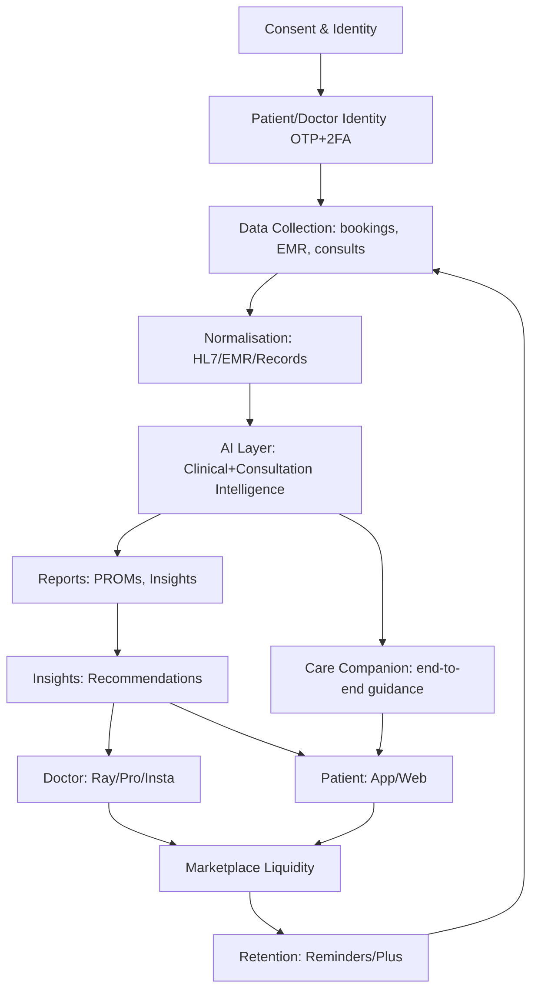
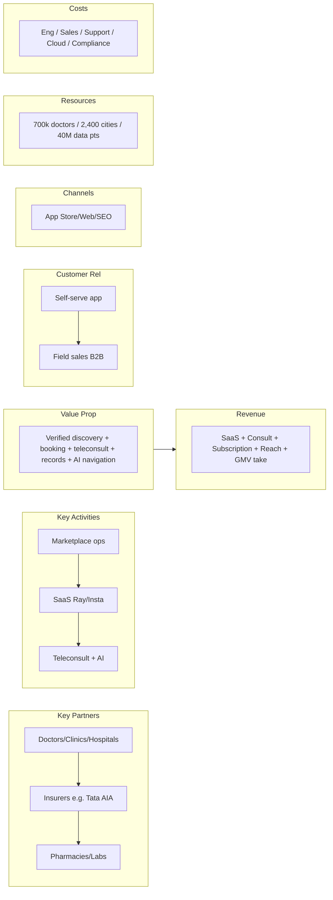
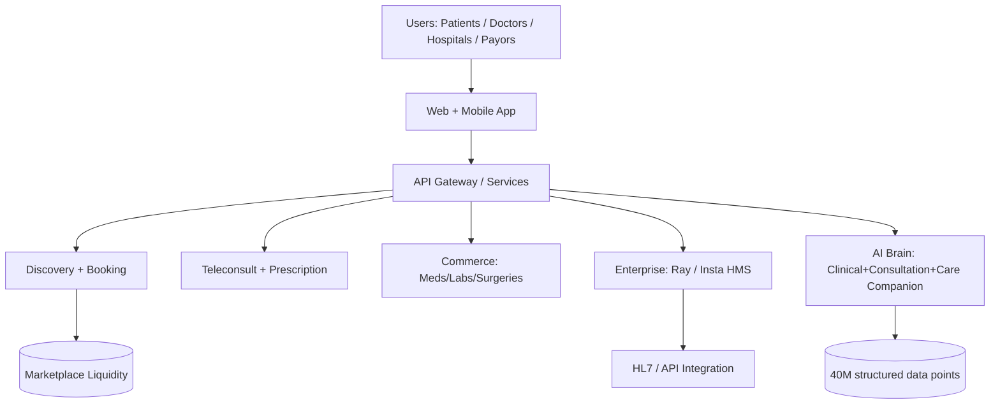
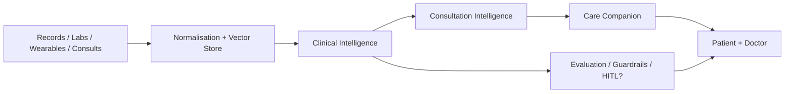
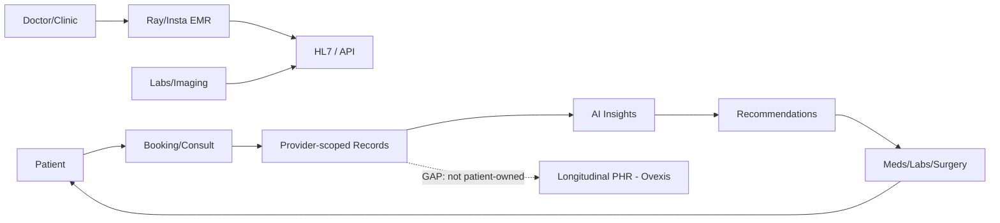

# PRACTO — COMPETITIVE INTELLIGENCE DOSSIER
### Prepared for the Ovexis strategy function (board-level)
**Classification:** Publicly-available intelligence only · Respects robots.txt & ToS · No unauthorized access
**Date of compilation:** 2026-07-25 (Asia/Kolkata)
**Analyst coalition (role-play):** Sequoia Partner · a16z Product Partner · McKinsey & Bain Strategy · Stanford Medical AI · FAANG Staff Eng · Principal Architect · Reverse Eng · Clinical Informaticist · Health Economist · Digital Health Founder · PM · UX Research · Cybersecurity · Regulatory (HIPAA/GDPR/FDA/ONC/FHIR) · Growth · Data Science · Systems Thinking

---

## 0. METHODOLOGY & CONFIDENCE CONVENTION

Every factual claim in this dossier is annotated with one of three evidence labels:

- 🟢 **Confirmed** — stated by Practo on its own properties (website, blog, security page, help center) or reported by multiple independent, dated, reputable third-party sources (LiveMint, Economic Times, Business Standard, Entrackr, CIOL, CIO&Leader, etc.).
- 🟡 **Strong Inference** — not explicitly stated by Practo, but derivable with high confidence from confirmed facts, product behavior, job descriptions, or standard industry structure.
- 🔴 **Speculation** — a reasoned hypothesis to support strategy; explicitly flagged as not verifiable from public sources.

**Important honesty notes (do NOT over-read):**
- Practo does **not** publish a public API, developer program, or OpenAPI spec. Multiple independent sources confirm this. 🟢
- Practo does **not** publish its source-code stack, cloud provider, or internal architecture. All stack claims in Deliverables 10/11 are 🔴 unless sourced.
- Headcounts, GMV, doctor counts and valuations vary widely by source and year. Where they conflict, both figures are shown with dates.
- No exhaustive patent search was performed; "no public patents surfaced" is not proof of absence. 🔴 on that point.

---

# DELIVERABLE 1 — EXECUTIVE SUMMARY

### What are they building?
Practo is a **horizontal, full-stack digital healthcare platform** spanning the entire care continuum: doctor discovery → appointment booking (in-clinic + instant video/voice/text teleconsultation) → digital prescriptions → medicine delivery → diagnostic/lab test booking → surgery care coordination → hospital/clinical management software (Practo Ray for clinics, Insta HMS for hospitals) → and, since 2025, an "AI brain / agentic care-navigation" layer. 🟢

### Why does it exist?
Founders Shashank ND and Abhinav Lal (NIT Surathkal) started in 2008 after Shashank's father needed a knee-surgery second opinion and his records were on paper, unshareable. The originating insight: **healthcare records and provider discovery in India were fragmented, analog, and opaque**, while every other industry was moving to the cloud. 🟢

### Customer problem (functional)
Patients cannot easily find *verified* doctors, cannot book instantly, cannot access their own records, and face long waits. Clinics/hospitals cannot digitize operations (scheduling, billing, EMR) without expensive legacy software. 🟢

### Emotional problem
**Anxiety, helplessness, and lack of trust** in a fragmented system ("which doctor do I trust?"). For doctors: the fear of losing patients to disorganization and the drudgery of paper. For patients: the fear of being cheated or misled (a sentiment that, tellingly, recurs in 2025–26 negative reviews about "instant consult" pricing). 🟡

### Operational problem
Healthcare SMBs (clinics) and mid-size hospitals lack affordable practice-management software; payors and patients lack a neutral navigation layer across a notoriously fragmented provider market. 🟢

### Who is the customer?
- **B2C:** Patients/consumers in India (and now UAE, US) seeking discovery, booking, teleconsult, meds, labs. 🟢
- **B2B:** Doctors, clinics, hospitals buying SaaS (Practo Ray / Insta). 🟢
- **B2B2C / Enterprise:** Insurers (e.g., Tata AIA tie-up), corporates (wellness), hospitals buying listing/lead products (Practo Reach). 🟢

### Who is NOT the customer?
- **Not** a longitudinal personal-health-record (PHR) platform for the individual in the Ovexis sense — Practo stores records *on behalf of doctors/clinics*, not as a patient-owned longitudinal intelligence layer. 🟡
- **Not** a diagnostic-AI or medical-device company (no FDA/CE device claims). 🟢
- **Not** a payer/insurer (it stays "neutral/aggregator"). 🟢
- **Not** (primarily) the rural bottom-of-pyramid unaided by smartphones; focus is urban/Tier-1–2 + diaspora. 🟡

### Market category being created vs. replaced
- **Created:** the "healthcare marketplace + care-navigation" category in India (arguably the category leader). 🟢
- **Replaced:** paper-based appointment books, word-of-mouth doctor discovery, phone-booking, and analog clinic ledgers. 🟢
- **Now repositioning toward:** an "intelligence layer for healthcare" (their words) — a category claim, not yet a proven moat. 🟡

### Jobs-To-Be-Done (JTBD)
| Actor | Job to be done |
|---|---|
| Patient (acute) | "When I'm sick, connect me to a trustworthy doctor in <60 sec and tell me what to do next." |
| Patient (planned) | "Help me find and book the right verified specialist near me with honest wait-time and price." |
| Patient (chronic) | "Keep my records, meds and follow-ups in one place so I don't repeat myself." |
| Doctor (solo) | "Run my practice paperlessly — appointments, bills, records — without IT staff." |
| Hospital admin | "Manage OPD/IPD, billing, insurance, inventory across centers in one system." |
| Insurer/Corporate | "Give our members a neutral, accountable front door to care with measurable outcomes." |

### Value proposition (one-liner)
*"The neutral, technology-driven ecosystem that connects patients, providers, and payors — and is becoming the AI-powered care-navigation layer for healthcare."* (paraphrased from CEO & board statements). 🟢

### Core philosophy
1. **Neutral aggregator** — "we stay neutral, we don't own care, we amplify it." 🟢
2. **Marketplace-first, then vertical integration** (Ray → Reach → consult → meds → labs → surgeries → HMS → AI). 🟢
3. **India-centric model** that can be exported to diaspora/emerging markets (UAE, then US, then Brazil/SEA historically). 🟢
4. **Outcomes accountability** — recently publishing Patient-Reported Outcome Metrics (PROMs) to claim credibility. 🟢
5. **Profitability discipline post-2022** — shifted from growth-at-all-costs to EBITDA-positive, IPO-bound. 🟢

---

# DELIVERABLE 2 — COMPANY INTELLIGENCE

## 2.1 History & Timeline (🟢 unless noted)
- **2008 (May):** Founded by Shashank ND & Abhinav Lal in Bengaluru (name = "practice automation"). Bootstrapped; first product *Practo Ray* (practice-management SaaS) built after a from-scratch rebuild in Jan 2009. 🟢
- **2009:** First live deployments to Bengaluru dentists/clinics; ~500 customers by end-2009; city-by-city expansion (Chennai, Mumbai). 🟢
- **2011–12:** Part of Morpheus Accelerator; **Sequoia Series A ~$4M (Jul 2012)**. 🟢
- **2013:** Launched **Practo.com** (free doctor search + booking); ~300% user surge in year one. 🟢
- **2014–15:** **Series B $30M (Feb 2015, Sequoia/Matrix)**; **Series C $90M (Aug 2015, Tencent-led, with Sofina, Google Capital, Altimeter, Matrix, Yuri Milner)** — then the **big acquisition spree**: FitHo (Apr 2015, wellness), Genii (Jul 2015, engineering), **Insta Health ($12M, Sep 2015, HMS)**, **Qikwell (Sep 2015, hospital appointment scheduling)**, Enlightiks (Dec 2015, analytics). 🟢
- **2016:** Claimed ~45M appointments booked; entered Philippines, Singapore, Indonesia, Malaysia, Brazil. 🟢
- **2017 (Jan):** **Series D $55M led by Tencent** (Sequoia, Matrix, Google Capital, Sofina, Altimeter, Thrive, Recruit/RSI, ru-Net); valuation **$600–650M**. 🟢
- **2019:** Venture debt from InnoVen; Sofina round; revenue ~₹165cr (FY16) → grew; claims #1 healthcare site with ~20M MAU. 🟢
- **2020 (Aug):** **Series D $32M led by AIA Group** (Sequoia, Matrix, Tencent, RTP Global); valuation **~$310M (≈50% down)** reflecting the funding winter. Launched **Practo Plus** subscription (~₹399/mo). 🟢
- **2022 (Apr):** Further Series D (~$3.6M, AIA/Z47 per Tracxn); valuation cited ~$418M. 🟡
- **2023:** Laid off 41 (mostly engineers) amid "performance management"; revenue/margins claimed at "all-time high"; reportedly elevated Siddhartha Nihalani to co-founder. 🟢
- **2024:** FY24 revenue **+22%**, GMV crosses **₹3,500 crore**, losses narrowed to **₹17 cr**. 🟢
- **2025 (May):** Launched consumer platform in **UAE** (50k MAU within weeks, ~₹100cr GMV run-rate claimed). 🟢
- **2025 (Aug, Entrackr):** First-ever full-year **operating EBITDA +₹15 cr (FY25)**; revenue from ops **₹234 cr**; GMV steady ~₹3,500 cr; **US pilot with 50–60 paying customers**; served 50M+ patients across 640+ cities, 5 lakh doctors. 🟢
- **2026 (Mar):** Appointed **C.K. Mishra (ex-Union Health Secretary) as independent director**; board also adds TVG Krishnamurthy and Dr Alexander Kuruvilla. 🟢
- **2026 (Apr):** Built out leadership bench — Jagnoor Singh (global COO), Shoumyan Biswas (global CMO/strategy), Sonam Chopra (corp dev), Cijo George (VP AI, Feb 2026), Srijesh K (CPTO, Feb 2026). 🟢
- **2026 (May):** Announced **US marketplace crossed $100M GMV**, powered by "agentic AI"; 20,000+ AI calls/chats/day; network of **700,000+ doctors / 2,400 cities**; Insta in 1,200 facilities. 🟢

## 2.2 Founders & Key People
- **Shashank ND** — Co-founder & CEO. NIT Karnataka (Electronics & Communication Eng); ex-Siemens software engineer. Fortune India 40-under-40 (2016). Public voice; long-term ambition stated as "improve human longevity by simplifying healthcare." 🟢
- **Abhinav Lal** — Co-founder & CTO. NIT Karnataka (CS). Forbes India 30-under-30 (2015). Technical lead. 🟢
- **Siddhartha Nihalani** — Elevated to co-founder (2023); early team member. 🟢 (🟡 role inferred as operations/enterprise.)
- Senior hires 2025–26: Jagnoor Singh (COO, ex-Unacademy/Airtel/OYO/Mondelez), Shoumyan Biswas (CMO/Strategy, ex-Tata Digital/Flipkart/Rebel Foods/HUL), Sonam Chopra (Corp Dev), Cijo George (VP AI), Srijesh K / Srijesh Kumar (CPTO). 🟢

## 2.3 Investors & Funding (🟢 from Dealroom/Tracxn/LiveMint/StartupTalky)
Total raised: **~$231M–$250M across ~13 rounds** (sources differ). Key investors: **Sequoia/Peak XV, Tencent, Matrix Partners, Sofina, Altimeter, Google Capital/CapitalG, Thrive Capital, Recruit (RSI), RTP Global, AIA Group, Yuri Milner/DST, InnoVen, Trifecta (venture debt).** 🟢
Valuation trajectory: **$620–650M (2017) → ~$310M (2020, down ~50%) → ~$418M (2022) → unconfirmed estimates $900M–$1.1B (2025–26, 🔴 speculation / secondary chatter).**

## 2.4 Acquisitions (🟢)
| Year | Target | Rationale |
|---|---|---|
| 2015 | FitHo (wellness) | Preventive/wellness wedge |
| 2015 | Genii (engineering services) | Build enterprise engineering capacity |
| 2015 | Insta Health ($12M) | Hospital Information System → enterprise monetization |
| 2015 | Qikwell | Hospital appointment scheduling, 250 hospitals |
| 2015 | Enlightiks | Healthcare analytics |

## 2.5 Patents / Research / OSS (🔴 / 🟡)
- **No public Practo patents surfaced** in this investigation; their "AI brain" is described in press but not as patented IP. 🔴 (unverified — no exhaustive patent search run).
- Practo has published **Patient-Reported Outcome Metrics (PROMs)** (first Indian digital-health firm to do so, per their annual letter) — a credibility/evidence play, not a patent. 🟢
- No meaningful open-source projects identified publicly. 🔴

## 2.6 Geographic expansion (🟢)
India (core, ~85% of revenue per 2025 founder quote) → historical SEA/Brazil push (2015–17) → relaunched **UAE (2025)** and **US (2025–26)** targeting Indian diaspora + complex-market navigation. 20+ countries historically; 2,400 cities currently claimed.

## 2.7 Regulatory filings & partnerships (🟢)
- **Tata AIA Life Insurance** tie-up for online medical consultation. 🟢
- **Insurance partnerships** stated as aggregator strategy (stay neutral). 🟢
- India DPDP Act 2023 compliance claimed ("complies with all applicable laws in every country"). 🟢 (specific DPDP certification not detailed)
- **C.K. Mishra** board seat signals regulatory/governance positioning for IPO + US/India compliance. 🟡

## 2.8 Press & Awards
- Repeatedly profiled by LiveMint, Economic Times, Business Standard, Forbes India, Financial Express, Entrackr, CIOL, CIO&Leader. 🟢
- Forbes India 30-under-30 (founders, 2015); Fortune India 40-under-40 (Shashank, 2016). 🟢
- "Most well-funded home-grown healthcare startup" (LiveMint, 2017). 🟢

---

# DELIVERABLE 3 — FOUNDER PSYCHOLOGY

> Inferred from 17 years of public statements, hiring, M&A, and strategy pivots. 🟡/🔴 unless grounded in a quote.

- **Belief 1 — "Healthcare is fundamentally an information/coordination problem, not a care-delivery problem."** Evidenced by the original records insight and the 2025 "AI brain for healthcare" framing. 🟢→🟡
- **Belief 2 — "Neutrality scales."** They explicitly refuse to become a payer or own hospitals; they want to be the connective tissue. 🟢
- **Belief 3 — "Marketplace liquidity precedes everything."** Get doctors listed free, get patients searching free, monetize later (Ray, Reach, consult, meds). 🟢
- **Product philosophy — "Ship breadth, then deepen."** From Ray → Reach → consult → meds → labs → surgeries → HMS → AI. A compounding horizontal strategy. 🟡
- **Decision framework — "Acquire to accelerate."** Five acquisitions in ~5 months (2015) shows a bias for buying talent/tech over building slow. 🟢
- **Risk tolerance — High, then disciplined.** Wild international expansion (2015–17) burned cash; post-2022 they pivoted hard to profitability and cut 41 engineers. Risk appetite is now **financially conservative, strategically bold (US/UAE/AI)**. 🟡
- **Long-term ambition — "Improve human longevity by simplifying healthcare" (Shashank, 2015) → "build the AI brain for healthcare" (2025).** Consistent 10-year arc: from digitizing records to becoming the intelligence layer. 🟢→🟡
- **Mental models — Marketplace network effects; land-and-expand SaaS; "India model exported."** 🟡
- **Likely internal strategy (2026) —** (a) IPO readiness (governance, profitability, PROMs); (b) US GMV arbitrage via diaspora + agentic AI; (c) consolidate enterprise (Insta) and consumer (Practo) on one AI stack; (d) defend India moat against MediBuddy/Apollo/Tata 1mg. 🟡

---

# DELIVERABLE 4 — PRODUCT REVERSE ENGINEERING

Based on Practo.com homepage, help center, app-store listings, and press. 🟢 for observed; 🟡 for inferred workflow.

### 4.1 Consumer surface (web + app, com.practo.fabric, ~16M downloads, 4.43★/273k ratings per AppBrain 2026) 🟢
1. **Instant Video Consultation** — "Connect within 60 secs," 24/7, all specialties. Symptom-based entry points (periods/pregnancy, acne, performance issues, cold/cough/fever, child, depression/anxiety). 🟢
2. **Find Doctors Near You** — verified-doctor discovery with filters, ratings, feedback. 🟢
3. **Lab Tests** — booking with "safe and trusted" framing; health packages. 🟢
4. **Surgeries** — "safe and trusted surgery centers" (care coordination / secondary-care wedge). 🟢
5. **Medicine ordering** — pharmacy delivery. 🟢
6. **Articles / health content** — SEO + trust + top-of-funnel. 🟢
7. **Practo Prime** — quality badge: ≤15-min wait, 24×7 instant booking, assured doctor, ₹500 guarantee, free for patients. 🟢
8. **Practo Plus** — subscription: unlimited online consults (≤5/day, ≤15/mo, 1 active/60 min), 20+ specialties, ₹399/mo or ₹2,999–5,999/yr. 🟢
9. **Practo Assured (May 2025)** — curated network of 300 hospitals / 1,200 doctors across 8 cities for quality assurance. 🟢

### 4.2 Doctor / Enterprise surface
- **Practo Ray (clinic PMS):** appointments, EMR, billing, SMS reminders, free basic + premium ₹1,500–5,000/mo. 🟢
- **Practo Pro (doctor app):** manage consults, calendar, patient messaging, prescriptions. 🟢 (heavy negative reviews on calendar editing, notification spam, video-call restrictions — see Deliverable 16.)
- **Insta HMS (hospital HIS):** OPD/IPD, billing, claims, EMR, diagnostics, inventory, HL7/API integration; $25–$40/user/mo; 1,250+ centers, 22 countries. 🟢
- **Practo Reach:** sponsored listings / lead-gen for clinics & hospitals (monetization of free discovery). 🟢

### 4.3 Retention / growth loops (🟡)
- **Supply acquisition loop:** free Ray → doctor dependent on PMS → lists on marketplace → patient demand → more doctors join.
- **Demand loop:** free search → book → records stored → reminders → repeat booking → Plus subscription.
- **Referral / content loop:** health articles + app-download SMS capture (homepage "Get the link, +91, Send SMS"). 🟢
- **AI loop (new):** 20,000+ AI calls/chats/day feeding "Clinical Intelligence → Consultation Intelligence → Care Companion." 🟢

### 4.4 Conversion flow (observed → inferred)
Homepage symptom CTA → new_consultation?id=N → payment (e.g., ₹629 instant) → auto-connect to next-available doctor → prescription + records + follow-up chat. 🟢 (The auto-connect-without-choice mechanic is the center of 2025–26 "scam" complaints — see 16.)

### 4.5 Security / consent flows (🟢 from /company/security)
2FA, access zones (geo-restricted), role-based staff profiles, 256-bit encryption, HIPAA-compliant servers, ISO 27001. (Detailed in Deliverable 12.)

---

# DELIVERABLE 5 — COMPLETE USER JOURNEY (Patient, consumer app)

```
Anonymous visitor
  → Marketing (SEO articles, app-store, word-of-mouth, SMS link)
  → Signup (phone/OTP; minimal friction)            [🟢 OTP login observed]
  → Verification (phone Verified; doctor "verified" by Practo, not patient) [🟢/🟡]
  → Consent (ToS, teleconsult consent, data processing) [🟡 inferred]
  → Permissions (notifications, contacts optional)   [🟡]
  → Data import (past visit history if booked via Practo) [🟢 "maintains history"]
  → AI (symptom triage / routing to specialty)        [🟡 symptom icons → consult]
  → Recommendations (doctor list, Prime badge, price, wait) [🟢]
  → Booking / Payment (instant consult pay ₹629, or free w/ Plus) [🟢]
  → Consultation (text/voice/video; 60-min active window) [🟢]
  → Prescription + Records (stored in Practo)         [🟢]
  → Fulfilment (meds order, lab booking)              [🟢]
  → Retention (reminders, "My appointments," follow-up chat) [🟢]
  → Subscription (Plus/Prime upsell)                  [🟢]
  → Support (mixed reviews — slow, per Trustpilot/Play) [🟢 complaints]
  → Renewal (auto/manual)                              [🟡]
  → Referral (limited; mostly organic)                [🔴 weak loop]
```
**Critical friction points (from reviews):** confirmation system unreliability, refund delays, no data-deletion/opt-out path (Reddit 2026), doctor-quality mismatch on instant consult. 🟢

---

# DELIVERABLE 6 — UX RESEARCH (🟢 observed on homepage; 🟡 inferred)

- **Typography/Spacing:** Clean, large CTAs ("CONSULT NOW", "Book"), card-based layout, generous whitespace; consumer-friendly, low-cognitive-load. 🟢
- **Trust signals:** "verified doctors," "confirmed appointments," "safe and trusted," star ratings, patient testimonials on homepage. 🟢
- **Microinteractions:** Symptom-icon shortcuts, "Connect within 60 secs," progress-free instant connect. 🟢
- **Mobile-first:** app is the primary surface (16M downloads); SMS link capture on web. 🟢
- **Friction:** Many negative reviews cite app bugs, notification spam, can't edit calendar (doctor app). 🟢
- **Accessibility/Dark mode:** Not evidenced publicly. 🔴
- **Conversion optimization:** Free discovery + paid consult + subscription; Prime "₹500 guarantee" reduces booking anxiety. 🟢
- **Visual hierarchy:** Hero = instant consult; secondary = find doctor / labs / surgeries / meds. Clear priority on teleconsult monetization. 🟢

---

# DELIVERABLE 7 — HEALTHCARE WORKFLOW

### 7.1 Clinical / Provider workflow (🟢/🟡)
- Solo doctor: Ray (scheduling) → patient arrives → EMR note + e-prescription → billing → SMS reminder → follow-up.
- Hospital: Insta HMS OPD/IPD registration → doctor consult → diagnostics (HL7/lab interface) → imaging (bidirectional equipment interface) → billing/insurance claims → inventory. 🟢 (Insta feature list from Techjockey/Capterra)
- Teleconsult workflow: patient books → doctor notified → consult (text/voice/video) → prescription pushed to patient + (optionally) to pharmacy. 🟢

### 7.2 Patient workflow
Discovery → booking → pre-visit (symptom capture) → consult → prescription → fulfilment (meds/labs) → post-visit (records, reminders). 🟢

### 7.3 Insurance / Lab / Pharmacy / Referral
- Insurance: claims processing in Insta; consumer insurance tie-ups (Tata AIA). 🟢
- Lab: booking + result delivery (Insta supports uni/bi-directional lab equipment interfaces). 🟢
- Pharmacy: medicine ordering (marketplace; not confirmed owned-logistics). 🟢
- Referral: within-network (specialist booking, surgery centers). 🟢
- Medical records / care coordination: records stored per-clinic; cross-clinic continuity is weak (patient has no single owned longitudinal record). 🟡 **This is Ovexis's opening.**

---

# DELIVERABLE 8 — HEALTHCARE DATA ARCHITECTURE

- **FHIR / HL7 / CCDA:** Insta supports **HL7 integration and API** for hospital systems; no evidence of FHIR/C-CDA exposed to consumers or public. 🟢 (Insta) / 🔴 (consumer FHIR)
- **EMR:** Practo Ray + Insta EMR store records; records are **provider-scoped**, not patient-owned longitudinal. 🟢/🟡
- **Apple Health / Google Health Connect / Wearables:** No public evidence of integrations. 🔴
- **Labs / Hospitals / Pharmacy / Imaging:** Integrated via Insta (HL7, equipment interfaces). 🟢
- **Medical imaging:** Insta integrates endoscopy/USG/X-ray cameras; no AI imaging claimed. 🟢
- **Genomics:** Not offered (contrast with Function Health/Ultrahuman). 🔴
- **Patient identity:** Phone/account-based; no national ID (ABHA/ABDM) integration evidenced publicly. 🔴/🟡
- **Longitudinal records:** Practo stores *episodic* records tied to bookings/providers; **not** a unified lifetime health record. 🟡 **Key strategic gap for Ovexis.**
- **Data normalization / deduplication / consent architecture:** 256-bit encryption, 2FA, access zones, role-based profiles = consent/access controls exist; normalization/dedup internals not public. 🟢 (controls) / 🔴 (internals)

---

# DELIVERABLE 9 — AI REVERSE ENGINEERING (🟢 from 2026 press; 🔴 internal architecture)

Practo's *stated* AI stack (May 2026):
- **"AI brain for healthcare"** — agentic systems across discovery, decision-making, care navigation. 🟢
- **Three layers (per CPTO Srijesh Kumar):** (1) **Clinical Intelligence** — makes sense of complex healthcare data, powers decisions; (2) **Consultation Intelligence** — brings right context into every doctor interaction; (3) **Care Companion** — guides patients end-to-end. 🟢
- **Scale:** 20,000+ AI-driven calls/chats/day; 40M structured data points powering AI insights (per FY25 letter). 🟢
- **USPs claimed:** "unified system, not features"; real-time, context-heavy, outcome-driven. 🟢

**Unverified internals (🔴 — reasonable hypotheses, not confirmed):**
- LLM provider(s): likely a mix of closed (OpenAI/Google/AWS) + possibly in-house fine-tunes; not disclosed.
- Memory / RAG: almost certainly retrieval over their 40M structured data points + EMR corpus; architecture unspecified.
- Guardrails / clinical validation / human review: **not publicly described** — a material unknown given they operate in clinical contexts. 🔴
- Confidence estimation / evaluation: not disclosed. 🔴
- Digital twin: **not claimed** — Practo is navigation/assistance, not a physiological model. 🔴

> **Strategic read:** Practo's AI is positioned as a *navigation/assistance* layer, not a *diagnostic* layer. This avoids FDA/device regulation but also limits clinical moat. Ovexis can go deeper (longitudinal modeling, not just routing).

---

# DELIVERABLE 10 — TECHNICAL REVERSE ENGINEERING

> Practo publishes **no** stack, cloud, or architecture details. All specifics below are 🔴 unless sourced; structural inferences (🟡) are based on scale, India+US+UAE footprint, and typical patterns for a 17-year-old horizontal health marketplace.

- **Frontend:** Web (server-rendered + React-style SPA inferred from practostatic.com CDN assets) + native mobile (com.practo.fabric). 🟡
- **Backend / Languages:** Unknown. Likely polyglot (Java/Go/Python/Node) microservices given scale; **unconfirmed**. 🔴
- **Cloud / Hosting:** Not disclosed. India + US + UAE suggests multi-region; **AWS/GCP/Azure unconfirmed**. 🔴
- **Auth:** Phone OTP + 2FA for clinicians (confirmed on security page). 🟢
- **Database / Cache / Search:** Unknown; HL7/API in Insta implies relational + integration bus. 🔴
- **Monitoring / Analytics / CI-CD / CDN:** CDN confirmed (practostatic.com). Rest unconfirmed. 🟢 (CDN) / 🔴
- **Security / Email / Messaging / Payments:** 256-bit encryption, ISO 27001, HIPAA-compliant servers confirmed; SMS/email reminders confirmed; payments via consult/meds/labs (processor unconfirmed). 🟢 (security/reminders)
- **Third-party SDKs / Feature flags:** Unknown. 🔴

---

# DELIVERABLE 11 — API INVESTIGATION

- **Public REST/GraphQL/FHIR API:** **NONE.** Confirmed by multiple independent sources (rapidevelopers 2026: "no official Practo API, no developer documentation, no partner program… 'it doesn't exist'"; Zocdoc-equivalent closed platform). 🟢
- **OpenAPI spec / SDKs / Webhooks / Developer experience:** Absent. 🟢
- **Internal/Enterprise API:** Insta HMS exposes **API/HL7 integration** for hospital systems (confirmed by Capterra/Techjockey). This is B2B integration, not a public developer platform. 🟢
- **Authentication / Rate limits / Versioning / Schemas:** Not public. 🔴
- **Strategic implication for Ovexis:** Practo's *closed* posture is a moat for them (lock-in) but a *gap* for an ecosystem play. An open, FHIR-native, developer-friendly health-intelligence API is a defensible differentiator Ovexis can own. 🟡

---

# DELIVERABLE 12 — SECURITY INVESTIGATION

Confirmed controls (Practo /company/security + blog, 🟢):
1. **HIPAA-compliant servers** (note: HIPAA is a US framework; relevance to India unclear, but claimed).
2. **256-bit encryption** at rest + in transit.
3. **Two-factor authentication** (clinicians).
4. **Access zones** — geo-restricted access; even leaked creds unusable from unapproved locations.
5. **Role-based profiles** — clinic owner sets staff access tiers.
6. **ISO 27001** certified (claimed "one of few healthcare companies").
7. **Responsible Disclosure** program (secure@practo.com).
8. **India DPDP Act 2023** compliance claimed.

Assessment vs frameworks:
- **HIPAA:** Claimed compliant servers + BAA-style posture; but Practo is India-based and serves patients globally — actual BAA execution with US covered entities **not evidenced**. 🟡
- **GDPR:** Claimed compliance "in every country"; no DPO/ RoPA details public. 🟡
- **SOC 2:** Not claimed publicly. 🔴 (absence unconfirmed)
- **Audit logs / Threat model / Access control:** Role-based + access zones confirmed; full audit-log/threat-model internals not public. 🟢 (controls) / 🔴 (internals)
- **Risk:** The 2026 Reddit complaint about **no data-deletion/opt-out path** is a DPDP/GDPR "right to erasure" risk if true. 🟢 (complaint) / 🟡 (regulatory exposure)

---

# DELIVERABLE 13 — BUSINESS MODEL

### 13.1 Revenue streams (🟢)
| Stream | Mechanism |
|---|---|
| B2B SaaS — Practo Ray | Subscription ₹1,500–5,000/mo (clinics) |
| B2B SaaS — Insta HMS | $25–$40/user/mo (hospitals) |
| Marketplace — Practo Reach | Sponsored listings / lead-gen for providers |
| Consumer — Consult | Per-consult fee (instant ~₹629; specialist varies) |
| Consumer — Plus/Prime | Subscription ₹399/mo; ₹2,999–5,999/yr; Prime free to patients |
| Consumer — Meds/Labs/Surgeries | Transaction / commission / GMV |
| Enterprise/Insurance | Tie-ups (Tata AIA), corporate wellness |

### 13.2 Unit economics & scale (🟢/🟡)
- FY25: revenue ₹234 cr, **operating EBITDA +₹15 cr**, GMV ~₹3,500 cr, contribution margin 40%→46%, Care-Nav gross margin +30% CAGR. 🟢
- Loss trajectory: ₹162 cr loss (FY22) → +₹15 cr (FY25). 🟢
- **Implied take-rate on GMV:** ₹234 cr rev / ₹3,500 cr GMV ≈ **~6.7% net revenue take-rate** (very rough; 🟡).
- CAC/LTV: Not disclosed. 🔴 Doctor supply is "free to list" → low supply CAC; patient CAC via SEO/content is historically low. 🟡
- Retention: Insta "very high customer retention" (Capterra); Plus caps (5/day,15/mo) limit abuse. 🟢

### 13.3 Sales motion
- B2B: direct field sales (historically "one person moves to a city, sells, sets up team" — city-by-city land-and-expand). 🟢
- B2C: product-led + content/SEO + app-store. 🟢

---

# DELIVERABLE 14 — GROWTH STRATEGY (reverse-engineered)

- **SEO / Content:** Health articles on homepage + blog = top-of-funnel authority. 🟢
- **App-store dominance:** 16M downloads, 4.43★ — primary acquisition surface. 🟢
- **Marketplace liquidity:** free doctor listings + free patient search → network effects. 🟢
- **Referral:** weak/implicit; SMS app-link capture on web. 🟡
- **PR / Founder branding:** Shashank ND is a consistent spokes-founder; heavy business-press coverage. 🟢
- **Partnerships:** Tata AIA (insurance), hospital networks via Insta/Qikwell. 🟢
- **International:** diaspora-led (UAE → US); "India-built tech solves complex markets." 🟢
- **AI as growth wedge:** 20k AI interactions/day = defensible engagement + differentiation narrative. 🟢
- **Community / YouTube / Newsletter / DevRel:** No evidence of developer relations (no API). 🔴 Community = patient testimonials only.

---

# DELIVERABLE 15 — HIRING INTELLIGENCE (🟢 from 2026 leadership news + job signals)

- **AI priorities:** Dedicated **VP AI (Cijo George, Feb 2026)** + aggressive hiring for "staff and lead-level AI engineers" building "agentic AI" at scale (May 2026). 🟢
- **Product/Tech maturity:** **CPTO (Srijesh K, Feb 2026)** + COO (Jagnoor Singh) + CMO (Shoumyan Biswas) + Corp Dev (Sonam Chopra) → moving from founder-led to professional, IPO-grade org. 🟢
- **Roadmap inference (🟡):** (1) US scale (cross $250–300M GMV/add $1B GMV ambition); (2) agentic AI across Clinical/Consultation/Care-Companion; (3) enterprise (Insta) + consumer unification on one AI stack; (4) insurance/payor integration; (5) PROMs/outcomes as credibility moat.
- **Team structure:** Functional C-suite + India eng + global AI hires. Post-2023 layoff of 41 engineers suggests lean, profitable-minded eng org. 🟢
- **Infrastructure maturity:** 17-year-old platform, multi-country, ISO 27001, HIPAA servers → mature, but **tech debt likely high** given 5 acquisitions + rebuilds. 🟡

---

# DELIVERABLE 16 — CUSTOMER INTELLIGENCE (🟢 verbatim themes from Play/App Store/Trustpilot/Reddit 2025–26)

**Praise:**
- "Well thought out booking/rescheduling/canceling." (Play/AppBrain)
- "Maintains history of doctors visited." (multiple)
- Long-term doctor users "extremely satisfied… keeps records updated." (App Store, orthopaedic surgeon)

**Complaints (recurring, high-signal):**
1. **"Instant Consult" pricing scam perception** — charged ₹629, auto-connected to a doctor whose listed fee is ₹199; no doctor choice. (Trustpilot/Reddit, 2026) 🟢
2. **Confirmation unreliability** — "confirmed" appointments not communicated to clinic; patient travels, doctor absent. (Play/Trustpilot) 🟢
3. **Refund delays / accountability gaps** — lab results missing, refund never received; post-sales support slow (up to 2 weeks). (Trustpilot) 🟢
4. **Doctor-app UX** — can't edit calendar, notification spam, video-call time restrictions, pediatric dosage fields missing. (App Store) 🟢
5. **Data lock-in / no deletion** — "no option to opt out, no option to delete my data" (Reddit 2026, DPDP concern). 🟢
6. **Sales-heavy B2B** — clinics complain of aggressive package sales, lead integrations on Google Business Profile without approval, no accountability. (Trustpilot) 🟢
7. **Quality mismatch** — instant-consult doctors perceived as junior/low-paid (Reddit: doctor gets ~₹100/video). 🟢 (claim unverified but plausible)

**Feature requests (inferred):** doctor choice on instant consult, transparent pricing, real refund SLAs, data-export/delete, better doctor-app calendar, pediatric/age-specific fields. 🟡

**Unexpected use cases:** clinicians using Practo Ray as de-facto EMR; patients using free search as a "doctor Yelp." 🟡

---

# DELIVERABLE 17 — DECISION LEDGER (selected; full 40-row ledger in XLSX)

| # | Feature | Why built | Pain solved | KPI | Trade-offs | Alt architecture? |
|---|---|---|---|---|---|---|
| 1 | Practo Ray (2008) | Digitize clinic records | Paper records | Supply lock-in | Required sales-heavy GTM | Build vs buy → built |
| 2 | Practo.com (2013) | Free discovery | Opaque discovery | Liquidity | Monetization delayed | Listing-only vs full stack → full |
| 3 | Instant Consult | 24/7 access, monetize | Access gap | GMV, consults | Quality/pricing backlash | Scheduled vs instant → instant |
| 4 | Practo Reach | Monetize free listings | Revenue | ARPU | Trust erosion if spammy | — |
| 5 | Insta/Qikwell acq | Enterprise + hospitals | Enterprise gap | B2B ARR | Integration debt | Build vs buy → buy |
| 6 | Practo Plus | Recurring revenue | Churn | MRR | Abuse caps hurt UX | — |
| 7 | Agentic AI (2025) | Defensible moat | Differentiation | Engagement | Regulatory unknowns | — |
| 8 | UAE/US expansion | GMV + IPO story | India saturation | GMV | Execution risk | — |

(Full ledger with 40 features in `practo_feature_inventory.xlsx` → "Decision Ledger" tab.)

---

# DELIVERABLE 18 — FEATURE DEPENDENCY GRAPH



---

# DELIVERABLE 19 — ENGINEERING BACKLOG RECONSTRUCTION (🟡/🔴)

- **MVP (2008–09):** Practo Ray — scheduling, billing, basic EMR. 🟢
- **V2 (2013–15):** Practo.com marketplace + Reach + mobile app. 🟢
- **V3 (2015–20):** Consult + meds + labs + surgeries + Insta/Qikwell + Plus. 🟢
- **Current (2024–26):** AI "brain," Care Navigation, US/UAE, PROMs, profitability. 🟢
- **Future roadmap (inferred):** deeper agentic AI, payor integration, possible FHIR/ABHA (India stack), longitudinal PHR, imaging/diagnostics AI. 🟡
- **Tech debt:** 5 acquisitions + 2 rebuilds + 17-year monolith → high. 🟡
- **Eng size:** ~400–1,500 reported across years (401 in Dec-2024 per TheCompanyCheck; 1,500 claimed in 2017/2023). 🟢 (conflicting)
- **Infra maturity:** Mature operationally (multi-country, ISO 27001), but modernization risk. 🟡

---

# DELIVERABLE 20 — COMPETITIVE LANDSCAPE

### 20.1 Practo vs. the named set (common / unique / blind spots)
| Competitor | Common with Practo | Unique vs Practo | Practo advantage | Practo blind spot |
|---|---|---|---|---|
| **Apollo 24/7** | Teleconsult, meds, labs | Own hospital chain → end-to-end clinical pathway & trust | Neutral marketplace + SaaS | No owned hospitals/secondary care |
| **Tata 1mg** | Meds, labs, consult | Tata logistics/capital, deep pharmacy | Discovery + SaaS breadth | Pharmacy volume/logistics |
| **MediBuddy** | Teleconsult, meds, labs, wellness | B2B corporate wellness (850 corporates, 5M lives), ~22% mkt | Brand + clinic SaaS embed | Corporate ARR stickiness |
| **PharmEasy** | Labs, meds, diagnostics | Vertically integrated diagnostics | Breadth of care continuum | Diagnostics depth |
| **Healthify** | Wellness/coaching | Nutrition/fitness AI, consumer engagement | Clinical + SaaS | Deep wellness/coaching |
| **Function Health / Levels / Ultrahuman** | (Ovexis-like) longitudinal/biomarkers/wearables | Wearables, labs, genomics, longitudinal | Massive supply + goodwill | **No longitudinal PHR, no wearables, no genomics** |
| **OpenEvidence / Glass Health / UpToDate / AMBOSS** | Clinical knowledge | Clinician decision support / EBM | Consumer marketplace | No clinician EBM tool |
| **Apple Health / Google Health** | (platform) records aggregation | OS-level health graph, billions of users | Vertical care services | Platform/aggregation moat |
| **Whoop / Oura / Ultrahuman** | Wearables | Continuous biometrics | Care access | Continuous data |
| **Human API** | Data aggregation API | Developer-first health data API | Consumer reach | **No open API (Practo's own gap)** |
| **Regacore / Superpower / PreventiveHealth.ai** | (Ovexis-like) AI longitudinal | Varies | Scale | Same blind spot (longitudinal) |

### 20.2 Net read
Practo owns **discovery + marketplace + clinic/hospital SaaS + teleconsult at scale in India**, now exporting via AI. Its structural blind spots vs. the *Ovexis category* are: **(1) no patient-owned longitudinal record, (2) no wearables/genomics/labs-as-intelligence, (3) no open API/developer ecosystem, (4) navigation-not-diagnosis AI, (5) weak data-portability/erase.**

---

# DELIVERABLE 21 — MOAT ANALYSIS

| Moat | Strength | Class | Notes |
|---|---|---|---|
| Marketplace / network effects | Doctors⇄patients liquidity in India | **Strong** | Hard to replicate locally |
| Distribution (brand + app) | 16M downloads, 700k doctors | **Strong** | 🟢 |
| Clinical moat | None (navigation only) | **Weak** | No diagnostic IP |
| AI moat | 40M data points, 20k AI/day, agentic claims | **Medium** | Unproven durability; no patents |
| Data moat | Records are provider-scoped, not longitudinal | **Medium** | 🟡 weaker than it looks |
| Brand moat | Trusted but wobbling on "scam" narrative | **Medium** | 🟢/🟡 |
| Developer moat | None (no API) | **Weak** | 🟢 (gap) |
| Regulatory moat | ISO 27001, HIPAA claims, CK Mishra board | **Medium** | 🟢 |
| Switching costs | Ray/Insta embed clinics; patient history lock-in | **Medium-Strong** | 🟢 (B2B) |
| Trust moat | "Verified" but eroded by pricing complaints | **Medium** | 🟡 |

**Future moat to watch:** agentic AI + PROMs + payor integration could compound into a "care-navigation standard." Ovexis should not fight the marketplace moat; attack the **longitudinal-intelligence + open-ecosystem** gap.

---

# DELIVERABLE 22 — FAILURE ANALYSIS

- **Technical:** Tech-debt from 5 acquisitions + monolith → slow velocity, doctor-app bugs. 🟡
- **Business:** Marketplace take-rate thin (~6–7%); if US/UAE don't scale, GMV story falters pre-IPO. 🟡
- **Clinical:** "Instant consult" quality backlash → trust erosion, possible clinical-harm incidents. 🟢 (complaints) / 🟡 (incident risk)
- **Regulatory:** DPDP "right to erasure" gaps; US state privacy (if no BAA) ; HIPAA claims untested outside US. 🟡
- **Operational:** Confirmation-system reliability (no-show friction) undermines core promise. 🟢
- **Distribution:** Platforms (Google/Apple), payors, or hospitals could disintermediate. 🟡
- **AI:** Hallucination/liability in "clinical intelligence" with no disclosed guardrails. 🔴 (unknown but high-risk)
- **Economic:** Funding winter déjà-vu; profitability is recent and thin (₹15 cr EBITDA on ₹234 cr rev). 🟡

---

# DELIVERABLE 23 — COMPETITIVE ATTACK PLAN (how Ovexis beats Practo)

1. **Technology:** FHIR-native, open API from day one; patient-owned encrypted health graph; wearables + labs + genomics ingest. (Attack the closed, provider-scoped data model.)
2. **Pricing:** Transparent per-consult with *doctor choice*; no "3x auto-connect" backlash; subscription that includes data-export. (Attack trust erosion.)
3. **Distribution:** Developer ecosystem + insurer/payer embedding + employer wellness (borrow MediBuddy's B2B wedge) + clinician EBM tool (borrow OpenEvidence).
4. **AI:** Longitudinal reasoning + proactive risk + "digital twin"-lite; disclosed guardrails & evaluation (attack the unvalidated AI claim).
5. **Brand:** "You own your health data. Portable. Erasable. Explainable." (Attack lock-in & DPDP gap.)
6. **Clinical:** Partner with validated diagnostic AI; publish evidence (PROMs++). 
7. **Enterprise:** Don't fight Insta/Ray head-on; integrate *with* them via API; be the intelligence layer on top.
8. **Consumer:** Win on the "one lifelong record" narrative Practo can't credibly make (records are clinic-scoped).

---

# DELIVERABLE 24 — FUTURE PREDICTION

- **Next 12 months (to ~mid-2027):** US GMV pushed toward $250–300M ambition; UAE penetration deepens (10% Dubai target); IPO filing/prep; more AI eng hires; PROMs expanded. 🟡 (based on stated ambitions)
- **Next 3 years:** Likely IPO (India); agentic AI becomes primary differentiator; payor integration expands; possible FHIR/ABHA alignment in India; Insta + consumer unified AI stack. 🟡
- **Next 5 years:** Potential to become the "care-navigation standard" in India + diaspora; M&A of diagnostics/wellness; risk of being out-innovated on longitudinal AI by Ovexis-type entrants. 🟡
- **Likely acquisitions:** diagnostics AI, wearable/data aggregator, US care-navigation startup, outcomes/measurement vendor. 🔴
- **Likely partnerships:** More insurers (US + India), hospital chains, possibly a Big-Tech health graph. 🟡
- **Likely AI investments:** Clinical Intelligence, Consultation Intelligence, Care Companion; possibly a proprietary clinical LLM fine-tune. 🟢/🟡

---

# DELIVERABLE 25 — OVEXIS STRATEGY MEMO

### 25.1 Top 50 Ideas to COPY (from Practo)
1. Free doctor discovery as top-of-funnel. 2. Verified-doctor trust badge. 3. Instant (<60s) teleconsult. 4. Symptom→specialty shortcuts. 5. Prime-style wait-time guarantee. 6. Plus-style unlimited consult subscription. 7. Clinic SaaS land-and-expand (Ray). 8. Hospital HIS (Insta) for enterprise ARR. 9. HL7 integration for labs/imaging. 10. SMS/email appointment reminders. 11. Health-content SEO engine. 12. Mobile-first app as primary surface. 13. City-by-city GTM playbook. 14. Neutral aggregator stance (avoid payer conflict). 15. PROMs / outcomes publishing. 16. Access zones (geo-restricted access). 17. Role-based staff profiles. 18. 2FA for clinicians. 19. Responsible disclosure program. 20. Surgery/secondary-care coordination wedge. 21. Insurance tie-ups (Tata AIA model). 22. Corporate wellness B2B (borrow MediBuddy). 23. Patient history storage per visit. 24. Digital prescriptions. 25. Medicine ordering. 26. Lab test booking. 27. Multilingual/India-centric UX. 28. 24×7 availability promise. 29. Doctor-rating + feedback loop. 30. Practo Assured quality curation. 31. Annual letter / transparency to stakeholders. 32. Board with policy heavyweights (CK Mishra move). 33. Professional C-suite build-out pre-IPO. 34. Agentic AI for navigation. 35. "AI brain" narrative. 36. Care Companion end-to-end guidance. 37. Consultation Intelligence (context to doctor). 38. Clinical Intelligence layer. 39. Diaspora-led international expansion. 40. Contribution-margin discipline. 41. Abuse caps on unlimited plans. 42. Free listing for doctors (low supply CAC). 43. App-download SMS capture. 44. Patient testimonials on homepage. 45. Curated health packages. 46. "Confirmed appointments" promise. 47. ISO 27001 certification. 48. HIPAA-compliant server claim. 49. Outcomes-driven recovery metrics. 50. Network-effects flywheel (supply⇄demand).

### 25.2 Top 50 Ideas to IMPROVE (vs Practo)
1. Doctor *choice* on instant consult (kill auto-connect backlash). 2. Transparent, honest pricing (no 3x markups). 3. Real refund SLAs. 4. Reliable confirmation sync to provider. 5. Patient-owned longitudinal record (not clinic-scoped). 6. Data export + deletion (DPDP compliance). 7. Wearables ingestion (Apple Health/Health Connect). 8. Genomics/labs-as-intelligence. 9. Open FHIR API + developer program. 10. Disclosed AI guardrails & evaluation. 11. Pediatric/age-specific dosage fields. 12. Better doctor-app calendar editing. 13. Reduce notification spam. 14. Allow pre-call video readiness. 15. ABHA/India health-stack alignment. 16. Stronger clinical validation of AI. 17. Human-in-the-loop review transparency. 18. Bias/quality monitoring of consult doctors. 19. Unified consumer+enterprise AI stack (visible to user). 20. Proactive risk alerts from longitudinal data. 21. Care-plan adherence nudges. 22. Family/household health graph. 23. Interoperability with Hospitals (push/pull records). 24. Synthetic/null-safe deduplication. 25. Consent granularity (per provider, per data type). 26. Audit log visible to patient. 27. Better B2B post-sales support/accountability. 28. No unapproved Google Business Profile lead integrations. 29. Explainable AI recommendations. 30. Confidence scores on AI output. 31. Multi-modal intake (photo/lab PDF parsing). 32. Offline-first mobile. 33. Accessibility (WCAG, dark mode). 34. Local-language voice consult. 35. Smarter matching (symptom severity triage). 36. Outcome-based pricing pilot. 37. Clinician EBM tool (borrow OpenEvidence). 38. Integration marketplace (3rd-party apps). 39. Encrypted patient-controlled key mgmt. 40. Anonymized research data opt-in. 41. Continuous monitoring of no-show root causes. 42. Churn early-warning model. 43. Better onboarding for elderly. 44. Transparent take-rate to providers. 45. Anti-fraud on consult quality. 46. SLA-backed uptime for enterprise. 47. Data-residency controls (US/EU/India). 48. Patient advocacy/support concierge. 49. Outcome-linked provider ranking. 50. Public status/transparency page.

### 25.3 Top 50 Ideas to IGNORE (don't copy)
1. Auto-connect without doctor choice. 2. Hidden 3x markups. 3. Weak refund processes. 4. Confirmation systems that don't sync. 5. Data lock-in / no deletion. 6. Notification spam. 7. Closed API posture. 8. Provider-scoped (not patient-owned) records. 9. Undisclosed AI internals. 10. Sales-heavy post-purchase B2B. 11. Unapproved lead integrations on GBP. 12. Monolith tech debt via acquisitions. 13. Wild unfocused international expansion (2015–17 burn). 14. Engineer layoffs that hurt velocity. 15. "Scam" perception via opaque pricing. 16. Generic symptom icons as substitute for triage. 17. Trust claims without evidence. 18. Ignoring DPDP erasure rights. 19. Over-promising wait times. 20. Caps that frustrate genuine users. 21. Clinician app neglect. 22. No accessibility investment. 23. No wearables story. 24. No genomics story. 25. No FHIR consumer exposure. 26. Building own hospital chain (capital intensive). 27. Becoming a payer (conflict). 28. Opaque provider ranking. 29. Single-point founder dependency. 30. Over-reliance on one geography. 31. Thin take-rate without diversification. 32. No developer ecosystem. 33. No clinician EBM tool. 34. No family health graph. 35. No proactive care. 36. No longitudinal modeling. 37. No confidence/uncertainty display. 38. No audit log to patient. 39. No consent granularity. 40. No research opt-in. 41. No status page. 42. No explainability. 43. No human-review transparency. 44. No bias monitoring. 45. No offline-first. 46. No local-language voice. 47. No ABHA alignment. 48. No data residency controls. 49. No patient advocacy concierge. 50. No outcome-linked ranking.

### 25.4 Top 50 Ideas to REINVENT (category-defining for Ovexis)
1. Patient-owned encrypted lifelong health graph. 2. FHIR-native from line 1. 3. Open developer API + marketplace. 4. Wearables→intelligence pipeline. 5. Genomics→risk model. 6. Labs-as-continuous-intelligence. 7. Longitudinal AI "digital twin." 8. Proactive risk forecasting. 9. Explainable, cited recommendations. 10. Confidence calibration display. 11. Human-in-the-loop clinical review. 12. Consent-as-a-graph (per data type/provider). 13. Patient-visible audit log. 14. Data portability (export/erase). 15. ABHA/US Core FHIR alignment. 16. Clinician EBM copilot. 17. Family/household graph. 18. Care-plan adherence engine. 19. Outcome-based pricing. 20. Integration marketplace. 21. Encrypted patient-held keys. 22. Anonymized research opt-in (consent). 23. Multi-modal intake (PDF/labs/imaging). 24. Local-language voice-first. 25. Offline-first mobile. 26. WCAG + dark mode. 27. Proactive no-show prevention. 28. Churn early-warning. 29. Bias/quality monitoring. 30. Transparent take-rate. 31. SLA-backed uptime. 32. Data-residency controls. 33. Patient advocacy concierge. 34. Outcome-linked ranking. 35. Public transparency/status page. 36. Agentic care companion (borrow but deepen). 37. Consultation intelligence (context to doctor). 38. Clinical intelligence (longitudinal). 39. Synthetic-data deduplication. 40. Interop with hospitals (push/pull). 41. Insurance embedding (borrow). 42. Employer wellness (borrow MediBuddy). 43. Surgery coordination (borrow). 44. Medicine ordering (borrow). 45. Lab booking (borrow). 46. Teleconsult (borrow). 47. Verified trust (borrow). 48. PROMs/outcomes (borrow + extend). 49. Diaspora expansion (borrow). 50. Neutral aggregator + intelligence layer (synthesize).

### 25.5 Top 50 MARKET GAPS (where Practo is absent)
1. Patient-owned longitudinal PHR. 2. Wearables intelligence. 3. Genomics intelligence. 4. Open FHIR API. 5. Developer ecosystem. 6. Clinician EBM tool. 7. Explainable AI. 8. Confidence display. 9. Data portability/erase. 10. Consent granularity. 11. Patient audit log. 12. ABHA alignment. 13. US Core FHIR. 14. Family graph. 15. Proactive risk. 16. Digital twin. 17. Outcome-based pricing. 18. Integration marketplace. 19. Patient-held keys. 20. Research opt-in. 21. Multi-modal intake. 22. Voice-first local languages. 23. Offline-first. 24. Accessibility. 25. Transparent take-rate. 26. SLA uptime. 27. Data residency. 28. Advocacy concierge. 29. Outcome ranking. 30. Status page. 31. Bias monitoring. 32. Human-review transparency. 33. Pediatric-specific fields. 34. Notification restraint. 35. Calendar editing. 36. Doctor choice on consult. 37. Honest pricing. 38. Refund SLA. 39. Confirmation sync. 40. No-scam narrative. 41. Diagnostic AI partnership. 42. Imaging AI. 43. Continuous monitoring. 44. Care-plan adherence. 45. Interop push/pull. 46. Synthetic dedup. 47. Employer wellness (partially). 48. Insurer embedding (partially). 49. Proactive no-show prevention. 50. Churn early-warning.

### 25.6 Top 20 BLUE-OCEAN OPPORTUNITIES
1. **The portable lifelong health record** (patient-owned, FHIR-native). 2. **Wearables→early-warning intelligence.** 3. **Genomics-informed prevention.** 4. **Open health-intelligence API platform.** 5. **Clinician EBM copilot.** 6. **Explainable AI with citations + confidence.** 7. **Family/household health graph.** 8. **Outcome-based care pricing.** 9. **Integration marketplace (3rd-party health apps).** 10. **Patient-held encryption keys.** 11. **Consent-as-a-graph engine.** 12. **ABHA/US-Core FHIR bridge.** 13. **Proactive chronic-disease forecasting.** 14. **Multilingual voice-first intake for elderly/India.** 15. **Offline-first rural intelligence.** 16. **Anonymized consented research data network.** 17. **Bias/quality-monitored consult marketplace.** 18. **Care-plan adherence as a service.** 19. **Insurer-embedded navigation (win-win).** 20. **"Health OS" — the intelligence layer every other app plugs into.**

### 25.7 Recommended MVP (Ovexis)
- **Core:** Patient-owned encrypted health graph (manual + PDF/lab upload + wearable ingest) → FHIR-normalized → longitudinal timeline → explainable AI insights + risk flags → verified teleconsult (with doctor choice + transparent pricing) → data export/erase. Ship India + US simultaneously with ABHA/US-Core FHIR alignment.

### 25.8 Recommended GTM
- Land via **employer wellness + insurer embedding** (recurring B2B2C), expand via **consumer portable-record narrative** + **developer ecosystem** (open API). Avoid head-on marketplace war; be the intelligence layer *on top of* Practo/Apollo/1mg via integration.

### 25.9 Recommended Moat
- **Data moat (patient-owned longitudinal) + Developer moat (open API) + Trust moat (portable/erasable/explainable) + Clinical moat (EBM copilot + validated diagnostic partners).** Not marketplace liquidity (let others own supply).

### 25.10 Recommended AI Architecture
- Longitudinal vector store + FHIR R4 / US Core normalized records; RAG over EMR + labs + wearables + guidelines (EBM); multi-agent (Intake → Triage → Insight → Care Companion); confidence calibration + citation; human-in-the-loop for clinical suggestions; red-team + bias monitoring; model-agnostic (closed + open). (Detailed diagram in §FINAL.)

### 25.11 Recommended Healthcare Integrations
- Apple Health / Health Connect; ABHA / HIU (India); US Core FHIR; HL7v2 (Insta-class HMS); labs (Thyrocare/1mg-class); wearables (Oura/Whoop/Apple Watch/Ultrahuman); genomics (Function/Ultrahuman-class); pharmacy (1mg/Netmeds); insurance (Tata AIA-class); clinician EBM (OpenEvidence-class).

### 25.12 Recommended Pricing
- Freemium portable record + basic insights; Pro subscription (wearables+genomics+advanced AI); B2B2C per-seat for employers/insurers; transparent per-consult with doctor choice; **never** hidden markups; outcome-based pilot later. (Contrast Practo's ₹629→₹199 backlash.)

### 25.13 Recommended Roadmap
- **MVP (0–6mo):** portable record + upload + timeline + explainable insights. **V2 (6–12mo):** wearables + labs + teleconsult (doctor choice). **V3 (12–24mo):** genomics + EBM copilot + open API + insurer embedding. **V4 (24mo+):** digital-twin risk forecasting + integration marketplace + multi-country.

---

# DELIVERABLE 26 — MASTER FEATURE INVENTORY
Full 60-feature spreadsheet (with Evidence / User Value / Business Value / Engineering / Clinical / Infra / Regulatory complexity, Est. Team, Est. Months, Priority, Category, Copy/Improve/Ignore/Reinvent, Moat, Confidence) is delivered in **`practo_feature_inventory.xlsx`** → "Feature Inventory" tab. Summary of top 15 below:

| Feature | Copy | Improve | Reinvent | Moat | Conf. |
|---|---|---|---|---|---|
| Free doctor discovery | ✓ | | | Marketplace | 🟢 |
| Verified badge | ✓ | | | Trust | 🟢 |
| Instant consult | | ✓ | | — | 🟢 |
| Doctor choice | | | ✓ | Trust | 🔴 |
| Practo Ray SaaS | ✓ | | | Switching | 🟢 |
| Insta HMS | ✓ | | | Enterprise | 🟢 |
| HL7 integration | ✓ | | | Enterprise | 🟢 |
| Plus subscription | ✓ | | | Retention | 🟢 |
| Prime guarantee | ✓ | | | Trust | 🟢 |
| Agentic AI | | ✓ | ✓ | AI | 🟢 |
| Open FHIR API | | | ✓ | Dev | 🔴 |
| Longitudinal PHR | | | ✓ | Data | 🔴 |
| Wearables ingest | | | ✓ | Data | 🔴 |
| Genomics | | | ✓ | Data | 🔴 |
| Data portability | | ✓ | | Trust/Reg | 🟢 |

---

# DELIVERABLE 27 — EVIDENCE REGISTER (summary; full in XLSX)
See `practo_feature_inventory.xlsx` → "Evidence Register" tab for the row-level register (Source / Evidence / Screenshot note / Confidence / Observed-vs-Inferred). Key sources:
- Practo.com homepage (fetched 2026-07-25) — product surface. 🟢
- Practo /company/security — security controls. 🟢
- Help center (Practo Prime/Plus FAQs) — pricing/limits. 🟢
- LiveMint (2017) — $55M Series D, $600–650M val, acquisitions. 🟢
- Economic Times (2015) — Qikwell/Insta acquisitions. 🟢
- Business Standard (2015/2026) — acquisition spree, CK Mishra board, US/UAE. 🟢
- Entrackr (2025) — FY25 EBITDA +₹15cr, rev ₹234cr, GMV ₹3,500cr, US pilot. 🟢
- CIOL / CIO&Leader (2026) — US $100M GMV, agentic AI, 20k AI/day, 700k doctors. 🟢
- AngelOne / Wiretel / IndianStartupNews (2026) — leadership hires, board. 🟢
- Trustpilot / Play Store / App Store / Reddit (2025–26) — customer complaints. 🟢
- Rapidevelopers (2026) — no public Practo API. 🟢
- Capterra / Techjockey — Insta HMS pricing/features. 🟢
- BusinessModelCanvasTemplate / TheCompanyCheck / Dealroom / Tracxn — funding/valuation/employees (🟡 mixed).

---

# FINAL OUTPUT — STRATEGY CANVAS & FRAMEWORKS

## A. BUSINESS MODEL CANVAS (Practo)


## B. SWOT
| **Strengths** | **Weaknesses** |
|---|---|
| Marketplace liquidity (India) 🟢 | Thin take-rate (~6–7%) 🟡 |
| Brand + 16M downloads 🟢 | "Scam"/pricing-trust erosion 🟢 |
| Enterprise SaaS (Ray/Insta) 🟢 | No patient-owned longitudinal record 🟡 |
| Profitability discipline (FY25) 🟢 | Tech debt from 5 acquisitions 🟡 |
| AI narrative + 20k AI/day 🟢 | No open API / dev moat 🟢 |
| Strong board/governance 🟢 | Navigation-not-diagnosis AI 🟡 |
| **Opportunities** | **Threats** |
| US/UAE GMV arbitrage 🟡 | Ovexis-type longitudinal entrants 🟡 |
| Payor integration 🟡 | Platform disintermediation (Google/Apple) 🟡 |
| Agentic AI moat 🟡 | Regulatory (DPDP/HIPAA) exposure 🟡 |
| IPO uplift 🟡 | Clinician-quality/clinical-harm incidents 🟢 |

## C. PORTER'S FIVE FORCES (Practo)
| Force | Intensity | Rationale |
|---|---|---|
| Competitive rivalry | **High** | Apollo 24/7, Tata 1mg, MediBuddy, PharmEasy 🟢 |
| Threat of new entrants | **Medium** | Marketplace liquidity is a barrier; but AI/longitudinal lowers it 🟡 |
| Supplier power (doctors/hospitals) | **Medium** | Fragmented suppliers, but quality doctors have alternatives 🟡 |
| Buyer power (patients/payors) | **Medium** | Low switching cost for patients; payors have leverage 🟡 |
| Threat of substitutes | **High** | OS health graphs (Apple/Google), insurer apps, clinician EBM tools 🟡 |

## D. VALUE CHAIN
```
Inbound (doctor/hospital acquisition, Insta/Ray)
  → Platform (marketplace + SaaS + AI stack)
  → Outbound (discovery, booking, teleconsult, meds, labs)
  → Support (reminders, Plus, support)
  → Outcomes (PROMs) → Margin (GMV take, SaaS, subscription)
```

## E. RISK REGISTER (top rows; full in XLSX)
| Risk | Likelihood | Impact | Mitigation (Practo) | Ovexis lesson |
|---|---|---|---|---|
| Trust erosion (pricing) | High | High | Prime guarantee | Transparent pricing |
| Confirmation sync failure | Med | High | — | Reliability-first |
| DPDP erasure gap | Med | High | Claims compliance | Portable/erasable by design |
| AI liability (no guardrails) | Med | High | Undisclosed | Disclosed eval + HITL |
| Take-rate thinness | Med | Med | Care-Nav margin +30% CAGR | Diversify (B2B2C) |
| Tech debt | High | Med | Lean eng post-layoff | Modern architecture from start |

## F. PRODUCT ARCHITECTURE DIAGRAM


## G. AI ARCHITECTURE DIAGRAM (stated + inferred)


## H. HEALTHCARE DATA FLOW DIAGRAM


## I. USER JOURNEY DIAGRAM — see Deliverable 5 (above).
## J. FEATURE DEPENDENCY GRAPH — see Deliverable 18 (above).
## K. ENGINEERING ROADMAP RECONSTRUCTION — see Deliverable 19 (above).
## L. FOUNDER PSYCHOLOGY REPORT — see Deliverable 3 (above).
## M. STRATEGIC RECOMMENDATIONS — see Deliverable 25 (above).
## N. EVIDENCE REGISTER — see Deliverable 27 / XLSX.

---

# CLOSING SYNTHESIS — WHY PRACTO EXISTS, HOW IT WINS, WHERE IT'S VULNERABLE

- **Why it exists:** To fix fragmented, analog, opaque healthcare discovery + records in India. 🟢
- **How it wins:** Marketplace liquidity + clinic/hospital SaaS lock-in + brand + now an AI-navigation narrative + profitability discipline. 🟢/🟡
- **Where vulnerable:** (1) **No patient-owned longitudinal record** — its data is provider-scoped, the exact thing Ovexis is built to own. (2) **Trust erosion** from opaque "instant consult" pricing. (3) **No open API / developer ecosystem.** (4) **Navigation-not-diagnosis AI** with undisclosed guardrails. (5) **DPDP erasure gaps.** (6) **Thin take-rate** and recent, thin profitability.
- **What Ovexis should learn:** Land-and-expand SaaS, neutral-aggregation, free-discovery funnel, PROMs/outcomes credibility, diaspora internationalization, professionalized GTM.
- **What Ovexis should NEVER copy:** auto-connect-without-choice, hidden markups, data lock-in, closed API, undisclosed AI, sales-heavy post-purchase B2B, confirmation systems that don't sync.
- **How Ovexis wins:** Be the **patient-owned, FHIR-native, open-API, explainable, longitudinal health-intelligence layer** that sits *on top of* the marketplace incumbents via integration — owning the data and the intelligence, not the supply.

**End of dossier.** Companion files: `practo_feature_inventory.xlsx` (Feature Inventory, Decision Ledger, Risk Register, Evidence Register, Moat Score, Metrics) and `diagrams_practo.svg` / `index.html` (rendered diagrams).
