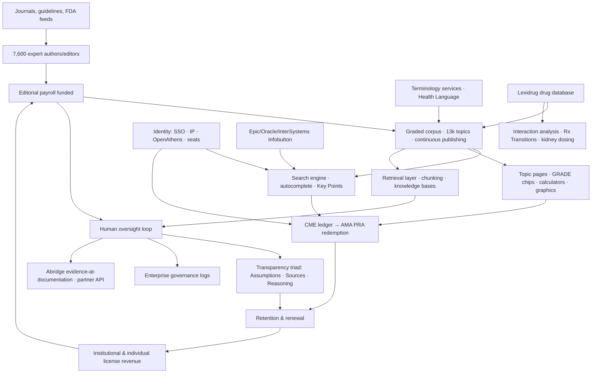
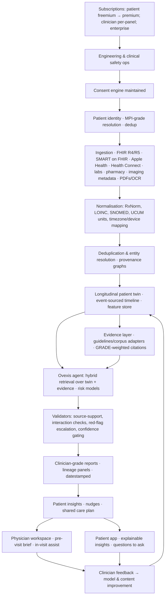

# DELIVERABLE 18 — Feature Dependency Graphs

Confidence legend: 🟢 Confirmed | 🟡 Strong Inference | 🔴 Speculation
Scripts in Mermaid. Confidence applies to the existence of dependencies; internal wiring is 🟡 where reconstructed.

---

## 18.1 UpToDate's actual dependency graph (reconstructed)

**Key dependency insight (🟢):** UpToDate's graph is a **star around CORPUS**: remove the corpus and every node dies. There is no upstream patient-data spine.

## 18.2 The architectural counter-graph Ovexis needs (consent → identity → data → AI → insights → clinician ↔ patient)

**Dependency-strategy notes:**
- 🟡 Consent must sit *below* identity below ingestion: inverting it (scrape first, ask later) is the industry's chronic HIPAA/GDPR failure mode.
- 🟡 The twin is the only node from which value compounds: every added data source raises insight density super-linearly — the opposite topology from UpToDate's flat corpus star.
- 🟢 This graph mirrors the exact sequence required by the brief (Consent↓Identity↓Data Collection↓Normalisation↓AI↓Reports↓Insights↓Doctor↓Patient) and adds the feedback loop that turns usage into better models (the network-effect seed).
