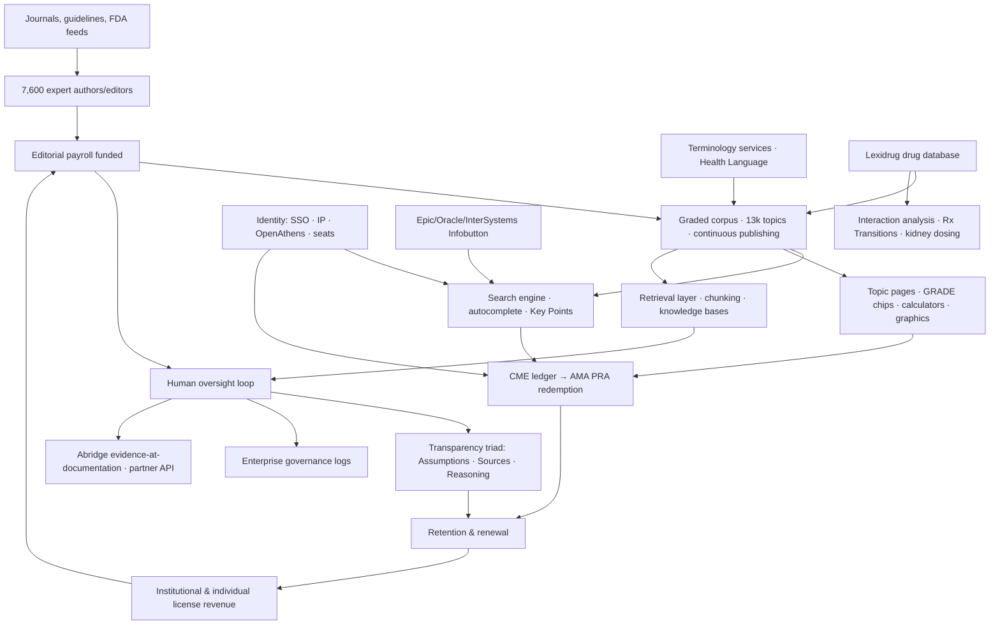
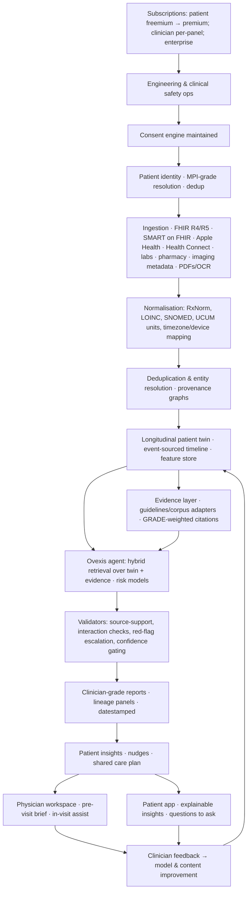

# Ovexis Competitive Intelligence Dossier — UpToDate (COMPLETE REPORT)

> Consolidated master document containing all 27 deliverables + strategy frameworks, generated 25 July 2026.
> Companion files not inlined: 26_feature_inventory.csv (spreadsheet), 27_evidence_register.csv (sources), diagrams/*.svg (4 architecture diagrams).

---


# DELIVERABLE 1 — Executive Summary: UpToDate

Confidence legend: 🟢 Confirmed | 🟡 Strong Inference | 🔴 Speculation | ⚪ Cannot Verify

---

## 1.1 What are they building?

🟢 **The defining point-of-care clinical knowledge platform for the world's clinicians.** UpToDate is a continuously updated, expert-authored synthesis of the entire practice of medicine, organised as ~13,000+ topic reviews across 25 clinical specialties, each written to answer the specific clinical questions a physician asks at the bedside — not to describe a disease the way a textbook chapter does. It is maintained by 7,600+ physician authors, editors, and peer reviewers and published continuously (no editions) since 1992. [Wolters Kluwer 25th-anniversary release; editorial policy page]

🟢 **Since September 2025, they are simultaneously building a second product on top of it: UpToDate Expert AI** — a generative-AI conversational layer that answers clinical questions grounded **exclusively** in UpToDate's own editorial corpus, exposes its assumptions, sources and step-by-step rationale, and is purpose-built for centralised enterprise deployment (EHRs, AI scribes like Abridge, and tech platforms). [Wolters Kluwer news, 24 Sep 2025; WK job posting describing "Flagship Agent: UpToDate Expert AI"]

🟢 Around the core sits a **clinical-effects portfolio**: UpToDate Lexidrug (drug reference, formerly Lexicomp), Medi-Span (drug data APIs), Emmi (patient engagement), Sentri7 (hospital clinical surveillance), and medical/nursing education tools — all cross-sold into the same enterprise accounts. Publicly documented through Wolters Kluwer product pages and campaign materials.

🟡 **The 2025–2027 strategic picture:** Wolters Kluwer is converting UpToDate from a *human-read text product* into a *machine-readable clinical intelligence substrate* — an evidence supply chain (Lexidrug harmonisation into Expert AI is the first confirmed example) that lands inside every workflow surface a clinician touches. The Nov 2025 claim of "50+ major US health systems deploying enterprise-wide" indicates the AI layer is being used as a lens with which to defend — and expand — the institutional license base. 🔴 The end-state, if the strategy succeeds, is UpToDate as the " Bloomberg terminal of medicine": non-negotiated infrastructure.

---

## 1.2 Why does it exist?

🟢 In 1992 nephrologist and textbook author **Dr. Burton "Bud" Rose** saw two facts colliding: (1) medical knowledge doubles faster than any physician can read, and (2) textbook chapters and journal papers are organised by disease, not by the clinical question. Rose's founding insight, quoted by his successor leadership: *"Instead of writing about a particular disease, let's write about the specific clinical questions that a clinician has, apply the best evidence to answer those questions, and then make very specific recommendations for care."* He started distributing it on floppy disks from his basement. [STAT obituary; WK 25th anniversary release]

🟡 **Why it still exists (economic reason):** medical knowledge has no cleaning lady. New RCTs, FDA label changes and guideline updates appear daily; no single physician or institution can maintain currency. UpToDate exists because *knowledge maintenance at scale* is a supply-chain problem, and supply chains consolidate. The editorial flywheel (authors → editors → continuous publishing → usage → outcomes evidence → brand → author prestige → more authors) is the product.

---

## 1.3 The customer problem

| Problem type | Detail | Confidence |
|---|---|---|
| **Functional** | "I have a specific patient in front of me and ~90 seconds to answer a concrete question (dose? interaction? workup? next step?). Textbooks are stale; journals are unstructured; Google is untrusted." | 🟢 (30%+ decision-change statistic; "1 million uses/day") |
| **Functional (safety)** | "Was this the *current* standard of care, or the one I learned in 2011?" Practice-changing updates (e.g., new HFpEF or anticoagulation evidence) silently alter correct practice continuously. | 🟢 (What's New / Practice Changing UpDates exist precisely for this) |
| **Emotional** | Fear of being wrong in front of a patient, a trainee, or in a courtroom. UpToDate is professionally acceptable cover: a *defensible citation* more than a learning tool. It converts uncertainty anxiety into a standard-of-care receipt. | 🟡 (inferred from "gold standard," medico-legal positioning, and Reddit threads where physicians call it indispensable "cover"; the CME-credit loop rewards the behaviour) |
| **Emotional (learning/status)** | "Am I practicing state-of-the-art medicine?" It functions as continuing-education currency: reading history auto-logs AMA PRA Category 1 CME credits. | 🟢 (CME tracking is a first-class feature) |
| **Operational (institution)** | Hospitals need standardisation, physician satisfaction, quality-metric performance (HQA), shorter length-of-stay, and decreasing harm from unwarranted practice variation — plus Promoting Interoperability credit for linked clinical decision support. | 🟢 (Isaac–Zheng–Jha outcomes study; Epic integration page claims PI support) |
| **Operational (institution, 2024+)** | Hospitals must now answer: *"Which AI will we let our 2,000 clinicians use, safely, and with auditability?"* — a governance problem OpenEvidence (consumer-ad model) forces into the open. Expert AI is the enterprise-governance answer. | 🟢 (Expert AI explicitly marketed as enterprise governance/compliant AI) |

---

## 1.4 Who is the customer?

🟢 **Economic buyer:** hospitals, health systems, academic medical centres, governments (e.g., the Veterans Health Administration adopted UpToDate Advanced), medical schools/libraries, payer/provider businesses, and — for individual SKUs — self-paying physicians/trainees (often reimbursed via CME funds). Institutional licensing is the dominant model; individual Pro/Pro Plus is the direct SKU.

🟢 **Users:** physicians (primary), then NPs/PAs, pharmacists (via Lexidrug), nurses, medical students/residents. Marketing claims 3M+ healthcare professionals (App Store copy, 2026) and 1.9M+ clinicians in 190+ countries (WK copy, ~2024).

🟢 **Decision committee (enterprise):** CMO/CMIO (quality & evidence), CIO/CMIO (EHR integration/SSO), CMIO/CNO (nursing workflow), pharmacy leadership (Lexidrug/Medi-Span), legal/compliance (AI governance), finance (cost), and — increasingly — an AI governance board. 🔴 The buyer committee has grown since 2023 because Expert AI makes UpToDate an *AI procurement*, not a *reference purchase*.

### Who is NOT the customer

| Not the customer | Why | Confidence |
|---|---|---|
| Patients as paying users | Patient education leaflets are *given away* inside the clinician product; UpToDate has never sold a consumer subscription. | 🟢 |
| Free-tier individual clinicians (2024+) | OpenEvidence/ChatGPT-for-Clinicians own that posture; UpToDate has conspicuously *not* launched a free clinician tier. | 🟡 |
| Small practices without IT | Possible but underserved (2–19-seat group SKUs exist; enterprise arm wants 20+ users). | 🟢 |
| Markets that cannot pay list price | Low-resource settings are a known coverage gap culturally (relied on library programs/HEUS initiatives); pricing backlash in UK NHS trusts and Indian institutions evidences elasticity pain. | 🟢 (Reddit threads; pricing structure criticism) |
| Developers/platforms consuming content via API | UpToDate historically priced via integration partnerships, not self-serve developer APIs. | 🟡 |

---

## 1.5 Category creation and replacement

- 🟢 **Category created (1992–2010):** "evidence-based point-of-care clinical reference" — effectively the template for all clinical knowledge platforms. It replaced **textbooks** (Harrison's, Cecil) and **filing cabinets / journal binders**, i.e., the library.
- 🟢 **Category absorbed (2010–2024):** "clinical decision support (CDS)." UpToDate absorbed monograph content (Lexi-Comp, Medi-Span), calculators (MDCalc-style functions inside topic pages), and patient education to become a suite rather than a reference.
- 🟡 **Category currently being contested (2024–2027):** "clinical AI assistant." The old point-of-care *reference* category is being superseded by the *answer engine* category (OpenEvidence, ChatGPT-for-Clinicians, ClinicalKey AI, Dyna AI Mode, AMBOSS LiSA). UpToDate's response — Expert AI — is a **category migration move**: it preserves the editorial content moat while re-skinning the delivery mechanism as an agent.
- 🔴 **Category it may *create* by 2028:** "evidence supply chain / evidence-as-a-service" — machine-graded clinical evidence streaming into any third-party workflow (Abridge integration is the beachhead). If WK productises "UpToDate-as-API" it becomes infrastructure, not an app.

---

## 1.6 Jobs-To-Be-Done analysis

Format: When [situation], I want to [motivation], so I can [outcome]. "Hired" candidates listed.

| # | JTBD | UpToDate's fit | Hired competitors today | Conf. |
|---|---|---|---|---|
| 1 | When a patient presents an unfamiliar problem, let me confirm the current standard of care in <2 minutes so I don't miss something. | Core job. Topic structure (Summary and Recommendations at top) is purpose-built. | OpenEvidence, ChatGPT-for-Clinicians, DynaMed, Jessica/Medscape, clinic colleagues | 🟢 |
| 2 | When I'm prescribing, let me check dosing + interactions instantly so I don't harm the patient. | Lexidrug monographs + interaction analysis inside UpToDate; Medi-Span drives EHR-native checks. | Lexi standalone, Elsevier Gold Standard, Epocrates, hospital EHR alerts | 🟢 |
| 3 | When evidence changed recently, alert me so I don't practice stale medicine. | What's New + Practice Changing UpDates; specialty alerts. | JournalWatch, NEJM alerts, newsletters, Twitter/X med community | 🟢 |
| 4 | When I need CME/MOC credits, make my normal reading count so I stay licensed without extra courses. | Usage auto-logs AMA PRA credits; redeem flow inside product. This is a retention super-loop. | BoardVitals, Medscape, Audio Digest | 🟢 |
| 5 | When regulators/auditors ask why we did X, give me a citable, dated, graded source. | Graded recommendations + citations are the medico-legal receipt. | Guidelines (NICE/CDC), litigation counsel sources | 🟡 |
| 6 | When I'm teaching, give me graphics/algorithms/patient explanations so I can teach at the bedside. | Graphics, algorithms, videos, patient handouts in 19 languages. | AMBOSS images, VisualDx, AI image gen | 🟢 |
| 7 | When my institution mandates a pathway, give me interactive decision flows so practice is standardised. | UpToDate Advanced/pathways (being re-scoped under Expert AI era) | Health system homegrown order sets, Elsevier ClinicalPath | 🟡 |
| 8 | When I (patient) don't understand my condition, give me a plain-language explanation so I can adhere. | "The Basics"/"Beyond the Basics" patient education, printable in ~19 languages. | Mayo Clinic patient pages, NHS, AI chatbots | 🟢 |
| 9 | When I (hospital CIO) must deploy GenAI to clinicians with governance, give me an auditable vendor. | Expert AI + enterprise admin/governance positioning; Abridge/Epic surfaces. | Elsevier ClinicalKey AI, Microsoft/Nuance, homegrown GPT wrappers | 🟢 |
| 10 | When I (WK) want to expand account value, bundle reference+drugs+education+surveillance so ACV rises. | Clinical Effectiveness cross-sell portfolio. | Elsevier suite, EBSCO (DynaMed), Optum | 🟢 |

---

## 1.7 Value proposition

🟢 **To the clinician:** *"The answer to your clinical question, right now, graded by humans you trust — and CME credit for reading it."*
🟢 **To the health system:** *"Fewer unwarranted practice variations, better quality metrics, a defensible standard-of-care record — and now a governable GenAI your clinicians will actually use."* (The Isaac–Jha study is the only point-of-care resource with peer-reviewed outcome-association evidence; WK markets this relentlessly.)
🟢 **To partners (Abridge, Epic ecosystem):** *"Embed trust, not content snippets — a branded evidence layer that keeps clinicians inside your product."*

---

## 1.8 Core philosophy (inferred operating doctrine)

1. 🟢 **Humans grade, machines deliver.** From GRADE adoption in 2006 to Expert AI's "multi-layer validation framework leveraging 7,600 experts" in 2025, the immutable rule is that a named physician is accountable for every recommendation.
2. 🟢 **Question-first content design.** Organise by clinical question, not by disease ontology (Rose's founding insight).
3. 🟢 **Continuous publishing, not editions.** (Editorial policy: "updated and published continuously.")
4. 🟡 **Credibility is the product; software is packaging.** WK never positioned UpToDate as a software company until compelled to in 2024–25. The defensive reflex is visible: every Expert AI announcement pairs "GenAI speed" with "human clinical expertise."
5. 🟡 **Meet clinicians inside every workflow surface they already inhabit** (Epic, Cerner/Oracle Health, InterSystems, mobile, Abridge) rather than demanding they adopt a new one. Expert AI's positioning ("reduces toggling") codifies this.
6. 🔴 **Price to the institution's fear of unequal care, not to the document.** Price is set by perceived indispensability, not by cost of goods.

---

## 1.9 Executive Summary — The Board View (Ovexis lens)

**What we must take seriously:**
- UpToDate owns the world's most sophisticated clinical **editorial supply chain**, not merely a content library. Expert AI is its conversion event from corpus → agentic service; 50+ health-system deployments within ~2 months of launch suggests real enterprise pull. 🟢
- Its moat is **trust capital accumulated over 34 years**, quantified by the only peer-reviewed outcome study in the category and by the fact that dropping it provokes physician revolt (Reddit evidence: residents/attendings describe losing access as "catastrophic"). 🟢
- **It is under a three-sided squeeze for the first time in its history:** (1) institutional price pushback and de-adoption (NHS trusts, US academic centres switching to DynaMed), (2) free AI answer engines (OpenEvidence's ad model, ChatGPT-for-Clinicians' enterprise funnel), and (3) the shift of the clinical interface from *search → agent*. 🟢/🟡

**Where Ovexis should NOT fight:** front-line acute Q&A content breadth. Reproducing 13,000 expert-maintained topics is a decade-scale, credibility-denominated war.

**Where Ovexis CAN win categorically:** UpToDate answers *episodic, patient-agnostic questions*. It knows medicine, but **it does not know the patient.** A longitudinal, FHIR-native, patient-specific health intelligence platform — continuous across time, wearable/lab/genomic data, personalised rather than population-median — is structurally orthogonal to everything UpToDate is built to do. UpToDate's own EHR integrations deliberately stop at "context-aware search"; they never persisted a longitudinal model of the individual. That vacuum — now also abandoned by OpenEvidence's Europe withdrawal and unaddressed by ChatGPT-for-Clinicians' lack of EHR integration — is the Ovexis opening. 🟡 (Synthesis; detailed in Files 22–25.)

*One-line verdict for the board:* **UpToDate is Canon awaiting its Kodak moment — the strongest editorial moat in medicine attached to a paywalled, episodic, population-level delivery model that three generations of AI-native challengers are now outflanking from both the free and the personalised ends.**

---


# DELIVERABLE 2 — Company Intelligence

Confidence legend: 🟢 Confirmed | 🟡 Strong Inference | 🔴 Speculation | ⚪ Cannot Verify

Note: UpToDate has been a wholly owned subsidiary of Wolters Kluwer (Euronext: WKL) since September 2008. It has no standalone investors, funding rounds, or valuation post-2008. Corporate intelligence must therefore be read at two levels: **UpToDate, Inc.** (product/economic engine) and **Wolters Kluwer Health / Clinical Effectiveness** (current parent structure).

---

## 2.1 History & Timeline

| Year | Event | Conf. |
|---|---|---|
| 1992 | Dr. Burton "Bud" Rose, a Harvard nephrologist and textbook editor, founds UpToDate in his basement (Wellesley, MA). First product: nephrology reference on floppy disk; updates mailed on diskettes. Wife Gloria Rose runs the business side. | 🟢 |
| 2006 | UpToDate adopts the GRADE evidence/recommendation grading framework; begins adding graded recommendations (1A–2C). | 🟢 |
| Sep 2008 | Wolters Kluwer acquires UpToDate. (Price ⚪ — never disclosed in primary materials; treat any figure seen in secondary sources as unverified.) | 🟢 acquisition / ⚪ price |
| 2008–2011 | Web-based delivery fully eclipses disks; mobile apps launch (iOS app live by 2011; Android later). | 🟢 |
| 2011–2012 | **Isaac–Zheng–Jha outcomes study** (Journal of Hospital Medicine, Feb 2012): 1,017 UpToDate hospitals vs 2,305 non-UpToDate hospitals → shorter length-of-stay (5.6 vs 5.7 days), lower risk-adjusted mortality in 3/6 conditions, better HQA quality scores. Becomes the permanent commercial proof point; WK estimates ~11,500 lives and 372,500 hospital days saved over the study's 3-year window. | 🟢 |
| 2013+ | "UpToDate Anywhere" institutional single-sign-on product; HL7 Infobutton integrations with Epic/Cerner; registration-embedded CME accrual at enterprise accounts. | 🟢 |
| 2017 | 25th anniversary; 25th clinical specialty added (anesthesiology). Stated reach: >180 countries, 300,000+ decisions changed per day. | 🟢 |
| 2019 | UpToDate Advanced (interactive clinical pathways) promoted; Veterans Health Administration (largest US health system) adopts it. | 🟢 |
| Oct 2020 | Founder Burton Rose dies. Obituaries call him "the Steve Jobs of medicine"; successors credit him with "the most important medical invention in the past 30 years" (peer quotes, STAT). | 🟢 |
| Nov 2021 | Leadership transition: Gregory Samios named President & CEO of Clinical Effectiveness; Dr. Peter Bonis named CMO, Wolters Kluwer Health. (Stacey Caywood led WK Health as CEO 2020–2025; Denise Basow, prior Clinical Effectiveness/P&P president, had departed — she later surfaced at CVS Health. 🟡) | 🟢/🟡 |
| 2022–2024 | Generative-AI response period. WK publishes Responsible AI principles; builds a central GenAI platform team ("20+ agents launched"); two-year clinical co-development of Expert AI with health systems (per Samios). | 🟢/🟡 |
| Oct 2024 | **Abridge partnership**: UpToDate evidence integrated into Abridge ambient clinical documentation; context-aware CDS surfaces inside the conversation note. GA to all Abridge customers end of March 2026. | 🟢 |
| 24 Sep 2025 | **UpToDate Expert AI announced** — GenAI clinical Q&A grounded in UpToDate corpus with one-click assumptions/sources/rationale; initially available Q4 2025 to select Enterprise Edition customers. | 🟢 |
| 21 Nov 2025 | **Lexidrug drug information folded into Expert AI** (~3,000 drug topics; cited stat: ~30% of UpToDate queries are drug-related). Yaw Fellin (SVP & GM, CDS & Provider Solutions) states **50+ major US health systems** are deploying Expert AI enterprise-wide. | 🟢 |
| Feb 2026 | WK reports FY2025: Health division revenue €1,596M (organic +5%), adj. operating margin 32.1%, 3,571 FTEs; Stacey Caywood becomes CEO & Chair of Wolters Kluwer Group (Nancy McKinstry retires). | 🟢 |
| Mar–Apr 2026 | Abridge×UpToDate CDS feature GA; App Store listing shows Expert AI live in trainee subscriptions + UpToDate Pro Plus (US) + select Enterprise Edition accounts. | 🟢 |

---

## 2.2 Founders

🟢 **Burton D. Rose, MD** (1942–2020): founder, longtime Editor-in-Chief. Clinical nephrologist (Harvard Medical School, Brigham and Women's, Beth Israel Deaconess), editor of a major nephrology textbook before UpToDate. His product doctrine: question-first topics, explicit recommendations, continuous update, and authors who are practicing experts. Posthumously remembered as having effectively created the point-of-care knowledge category.

🟢 **Gloria Rose**: co-builder on the commercial/operational side; partnership widely described in obituaries and WK retrospectives.

🟡 **Founder succession:** intellectual custody passed to a physician-editor cadre (Co-Executive Editors; Peter Bonis as CMO). WK deliberately kept editorial identity physician-led; named leadership visible publicly: Peter Bonis, MD (CMO); Yaw Fellin (business GM for CDS); editorial bench names are published per-topic but a consolidated current editorial-org chart is ⚪ not public.

---

## 2.3 Leadership (current, as of Jul 2026)

| Person | Role | Evidence |
|---|---|---|
| Stacey Caywood | CEO & Chair, Wolters Kluwer N.V. (Feb 2026–); previously CEO, WK Health 2020–2025 | 🟢 |
| Gregory Samios | CEO, Wolters Kluwer Health (elevated); formerly President & CEO, Clinical Effectiveness | 🟢 |
| Dr. Peter Bonis | Chief Medical Officer, Wolters Kluwer Health; public face of Expert AI clinical integrity | 🟢 |
| Yaw Fellin | SVP & GM, Clinical Decision Support & Provider Solutions | 🟢 |
| Nancy McKinstry | Retired as WK Group CEO early 2026 (announced 2025) | 🟢 |

🟡 The pre-AI-era President & CEO of Clinical Effectiveness, Denise Basow, MD, is widely credited with declaring the 25th-anniversary doctrine; her departure ≈2021 (to CVS Health) marked the handover from content-era to platform-era leadership.

---

## 2.4 Investors / Funding / Valuation

- 🟢 **Pre-2008:** UpToDate was privately held by the Roses; no venture funding is documented publicly — it was bootstrapped. (⚪ exact cap table never public.)
- 🟢 **2008+:** Funded as a division of Wolters Kluwer (public, ~€40B+ market cap vicinity mid-2020s — ⚪ exact current market cap not verified in this research).
- 🟢 **Parent-level financials (relevant to resourcing):** WK FY2025 revenue €6,125B (+6% organic), adj. operating profit margin 27.5%; Health division €1,596M at 32.1% margin — one of the most profitable divisions. Health FTEs grew 3,333 (2023) → 3,401 (2024) → 3,571 (2025), consistent with an AI build-out.
- ⚪ UpToDate-specific revenue is NOT broken out by WK. 🟡 Triage: Clinical Effectiveness (UpToDate + Lexidrug + Medi-Span + Emmi + Sentri7 + education) is the predominant share of Health revenue; UpToDate is the flagship and presumably the largest single contributor. Any numeric estimate you see elsewhere (e.g., "$500M+") is unverified modelling — treat as 🔴.

---

## 2.5 Acquisitions (UpToDate-adjacent, WK Health Clinical Effectiveness)

| Asset | Function | Year | Conf. |
|---|---|---|---|
| UpToDate | Core clinical knowledge platform | 2008 | 🟢 |
| Lexi-Comp (→ Lexicomp → **UpToDate Lexidrug**) | Drug monographs, interactions, IV compatibility; pharmacist standard | 2011 (publicly reported) | 🟡 |
| Medi-Span | Machine-readable drug data APIs embedded in pharmacy/EHR systems | ~2014 (publicly reported) | 🟡 |
| Sentri7 (via Pharmacy OneSource) | Hospital inpatient clinical surveillance | ~2015 (publicly reported) | 🟡 |
| Health Language | Medical terminology management (ICD/SNOMED/LOINC mapping infrastructure) | 2013 | 🟢 |
| Socrates | Physician education/assessment | ~2015 | 🟡 |
| Emmi | Patient engagement multimedia programs | ~2020 (publicly reported) | 🟡 |
| Firecracker | Medical education (adaptive learning) | ~2020 (publicly reported) | 🟡 |

🟡 **Pattern read:** every acquisition strengthens the *evidence supply chain* — terminology (Health Language), drug truth (Lexi/Medi-Span), patient-side delivery (Emmi), surveillance (Sentri7). The 2025 Lexidrug→Expert AI harmonisation shows these assets are being fused into one AI-consumable corpus. This is the least-discussed and most consequential strategic fact about WK Health.

---

## 2.6 Patents

⚪ **No clean UpToDate-branded patent portfolio surfaced in public search for this investigation.** Wolters Kluwer holds US patents across legal/tax/health divisions (workflow, text analysis), but a verified list of UpToDate-specific clinical-knowledge patents could not be confirmed from public sources within this engagement. 🟡 Working assumption: IP protection is exercised primarily through **copyright on the corpus, trademark on the brand, and trade-secret editorial process** rather than patents — consistent with the economics of expert-authored content.

## 2.7 Research papers

🟢 The single most important publication remains **Isaac T, Zheng J, Jha A. "Use of UpToDate and outcomes in US hospitals." J Hosp Med. 2012;7(2):85-90.** Additional documented streams: (1) UpToDate's published editorial policy/GRADE methodology pages; (2) third-party head-to-head studies comparing point-of-care tools and LLMs for accuracy; (3) WK Health white papers on Expert AI's "multi-layer validation". ⚪ A dedicated internal peer-reviewed evaluation of Expert AI (public, indexed) was not yet located — notable absence worth tracking.

## 2.8 Open-source projects

⚪ No UpToDate-authored open-source projects identified. Wolters Kluwer engineering consumes open source (job posts cite LangChain/LangGraph, OpenSearch, etc.) and hires for open-source fluency, but corpus, grading logic and editorial systems remain proprietary. 🟡 Their "open" surface is standards (HL7 Infobutton/FHIR) and integrations, not code.

## 2.9 Geographic expansion

- 🟢 Presence in 190+ countries of use; institution-level reporting shows active penetration in the US, Canada, UK/NHS trusts, Australia, India (WK has large Chennai/Hyderabad engineering+editorial-support operations), and China via **UpToDate中文版 (uptodate.cn)** with a localised editorial policy page — evidence of genuine localisation, not just reselling.
- 🟢 Patient education in up to 19 languages; interface and content primarily English-centric for the professional corpus (⚪ full-corpus translation count not publicly verified).
- 🟢 Notable pullback dynamics in UK NHS (trust-level cancellations in 2025, replaced by BMJ Best Practice) and pressure in price-sensitive markets — geographic strength is real but economically contested.

## 2.10 Regulatory filings

- 🟢 WK N.V. annual/half-year reports (Euronext filings) — Health division segment data used throughout this dossier.
- 🟢 UpToDate is **not an FDA-regulated medical device** in its reference form (non-device CDS under 21st Century Cures criteria; WK publicly leans on professional CDS framing). 🟡 Expert AI was explicitly architected ("human review, sources, rationale") to stay within non-device CDS safe harbours; WK spokespeople frame it as "clinical decision support with expert-driven clinical intelligence," not autonomous diagnosis.
- 🟢 GDPR/HIPAA surfaces: privacy policy and institutional BAAs available via WK legal pages (BAA availability noted in institutional onboarding flows)。⚪ No published SOC 2 Type II report located publicly — typical for WK; they cite security whitepapers/risk programs instead. See File 12.

## 2.11 Strategic partnerships

| Partner | Nature | Conf. |
|---|---|---|
| Epic | Deep EHR integration: Infobutton, contextual search from chart, admin links, CME accrual in workflow | 🟢 |
| Oracle Health (Cerner) | Embedded search links, Infobutton in Millennium | 🟢 |
| InterSystems TrakCare | Multi-level search integration (InfoLink + HL7 Infobutton + multilingual terms) | 🟢 |
| Abridge | Evidence integration into ambient documentation (Oct 2024; CDS GA Mar 2026) — flagship AI-scribe partnership | 🟢 |
| Medical societies | GRADE methodology lineage with Gordon Guyatt; society-review collaborations for topics | 🟢 |
| Microsoft (Azure OpenAI), Anthropic (AWS Bedrock), Google (Gemini) | Model supply (confirmed via WK engineering job posts listing all three) | 🟢 |
| Health systems (50+) | Expert AI co-development/enterprise deployment | 🟢 |

## 2.12 Clinical partnerships & press

🟢 Clinical credibility partners: the GRADE working group lineage; specialty reviewer networks (7,600 experts); the VA system adoption. 🟢 Sustained press cadence: 25th-anniversary campaign, founder obituaries (STAT), Expert AI launch coverage (BusinessWire/Yahoo/KnowledgeSpeak), Abridge partnership coverage (Fierce Healthcare, HIT Consultant, Signify Research). 🟢 Awards: UpToDate references repeatedly "Best in KLAS" marketing in CDS category history — ⚪ specific 2025/2026 KLAS award could not be verified in this session; competitor DynaMed has publicly claimed Best in KLAS 2025 for CDS, which is itself an important competitive signal.

---


# DELIVERABLE 3 — Founder & Leadership Psychology

Confidence legend: 🟢 Confirmed | 🟡 Strong Inference | 🔴 Speculation | ⚪ Cannot Verify

Subject: Dr. Burton "Bud" Rose (founder; d. 2020) and the institutional psychology he bequeathed to Wolters Kluwer's Clinical Effectiveness leadership (Bonis, Samios, Caywood, Fellin). The modern company's psyche is best understood as **"Rose's doctrine operating inside a Dutch-Germanic information conglomerate's capital discipline."**

---

## 3.1 Founder beliefs (Rose era)

| Belief | Evidence | Conf. |
|---|---|---|
| **Medicine is a question-answering profession.** Content must be authored around the clinician's actual question, not the textbook's ontology. | Rose's founding doctrine, quoted verbatim by WK leadership at the 25th anniversary | 🟢 |
| **Physicians deserve a recommendation, not a lecture.** UpToDate famously *commits* to graded recommendations where textbooks hedge. | Editorial policy + GRADE adoption (2006) | 🟢 |
| **Currency is a moral duty.** Information that is stale is clinically dangerous; publishing must be continuous. | Diskette-update model → web continuous publishing | 🟢 |
| **Craft beats scale.** The craftsman-founder pattern: Rose personally reviewed content for decades; the "Steve Jobs of medicine" epithet reflects design obsession over growth hacking. | STAT obituary peer accounts | 🟢 |
| **Trust must be earned per-reader, never marketed into existence.** Decades of near-zero consumer marketing; product quality as the only growth channel. | Absence of ad spend evidence; organic adoption history | 🟡 |

## 3.2 Core assumptions (institutional)

1. 🟢 **Absolute assumption:** human experts outperform any automated pipeline at synthesising contested evidence. Every product decision — including Expert AI's "multi-layer validation" — defends this.
2. 🟡 **Assumption under stress (2024–2026):** "Physicians will accept friction (paywall, login, dated UX) for trusted content." OpenEvidence's 65%-of-US-doctors adoption claim directly challenges this assumption.
3. 🟡 **Assumption:** the institution, not the individual, is the durable customer (institutional licenses, EHR entrenchment, CFT/CME funds proxy-buying).
4. 🟡 **Assumption:** content breadth is the moat; interface is negotiable. (The UX deficit documented in File 06 is the logical scar of this belief.)

## 3.3 Product philosophy

🟢 **Evidence radicalism + interface conservatism.** Radical about continuously re-grading 13,000 topics; conservative about interaction design (the 2026 app still looks like a hyperlinked document). The product philosophy is *"the quality bar lives in the paragraph, not the pixel."*
🟡 **Platform reluctance.** API-first distribution came late and via partnerships (Abridge), not developer self-serve — evidence of a culture that equates control of surface with control of trust.

## 3.4 Decision framework (observable)

| Decision pattern | Example | Conf. |
|---|---|---|
| Choose physician reviewer accountability over velocity | Editorial pipeline keeps human sign-off at every stage even as competitors ship ML-generated content | 🟢 |
| Choose revenue durability over TAM expansion | No free tier launched even as OpenEvidence grew; instead, Expert AI added to *paid* tiers (Pro Plus, Enterprise) | 🟢 |
| Choose co-development with enterprises over MVPs | "Collaborating with health systems for two years" before Expert AI GA | 🟢 |
| Choose category re-branding over category abandonment | "Clinical decision support" → "clinical intelligence" vocabulary shift (Expert AI marketing) | 🟢 |
| Choose acquisition over build for adjacent truth-services | Lexi-Comp, Medi-Span, Health Language, Emmi | 🟡 |

## 3.5 Risk tolerance

🟢 **Low on clinical risk, medium on commercial risk, high on technical risk (recently raised).** Historically the firm under-invested in interface innovation (low technical ambition); the 2024–2026 GenAI program — a 100-engineer central platform, multi-model architecture (Azure OpenAI + Anthropic + Gemini), Rust/TypeScript rebuilds (job posts) — marks the largest technical risk-taking era in its history, forced by existential category pressure. 🟡 Risk posture remains asymmetric: they will race technically only while keeping human-review as the branding moat.

## 3.6 Long-term ambition & 10-year vision

🟢 Stated: WK Group strategy ("Elevate Our Value") targets expert-solution growth with GenAI embedded across divisions; Health is positioned as an AI-flywheel business with 32%+ margins and recurring-revenue dominance.
🟡 Inferred Health 10-year vision: **UpToDate as the trusted reasoning layer between all clinical AI agents and medical truth** — i.e., they do not believe the future is "a better UpToDate app"; they believe it is "UpToDate inside everything." The Abridge integration, the ecosystem/enterprise-governance language, and model-agnostic inference architecture all point here.
🔴 If true, their endgame is to be the evidence oracle for every CDS agent (Epic, Microsoft, OpenAI health efforts) — accepting lower per-unit prices in exchange for non-displaceable embedment. The price backlash (File 16) is the main obstacle: institutions are simultaneously unwilling to keep paying rising prices for the *old* packaging.

## 3.7 Mental models (inferred vocabulary of the org)

- 🟡 **"The library that curates itself"** — supply-chain thinking about knowledge.
- 🟡 **"Accountable authorship"** — every paragraph has a named human; anonymity-free credibility.
- 🟡 **"Workflow gravity"** — adopt the clinician's environment (Epic, scribe, phone) rather than pull them to yours.
- 🟡 **"Grade the strength, cite the source"** — epistemic transparency as a UI principle (Expert AI's one-click assumptions/sources is mental-model continuity from GRADE).
- 🔴 **"Premium = trustworthy"** — a pricing psychology that may be misfiring in an era when free products (OpenEvidence) achieve equivalent perceived trust with physicians.

## 3.8 Likely internal strategy (this is strategy reconstruction, not company statement)

1. 🟡 **Defend institutional renewal at nearly any cost** — flexible pricing, bundles including Expert AI; arrest the DynaMed/BMJ-Best-Practice switchings.
2. 🟡 **Convert Expert AI into a SKU-upgrade event** (Pro → Pro Plus; Enterprise Edition gates) — confirmed by App Store packaging language.
3. 🟡 **Make the corpus machine-native** — harmonise Lexidrug, calculators, patient ed, terminology (Health Language) into one retrieval schema so any agent (theirs or partners') can consume it (confirmed direction via Lexidrug integration + Abridge API partnership).
4. 🔴 **Acquire or ally in the agentic layer** — plausible targets/partners: ambient scribes (already Abridge), prior-auth automation, CDS hooks vendors. Watch for WK M&A echoing the Legal division's Libra AI acquisition pattern.
5. 🔴 **Regulatory pre-emption** — position non-device CDS + human review as the compliance standard regulators should require, freezing out ad-supported consumer-grade rivals.

---

### What Ovexis should learn from Rose's psychology (and transcend)

🟡 **Adopt the doctrine, invert the epistemology.** Rose proved that accountable, question-first, continuously-graded content becomes infrastructure. Ovexis's parallel doctrine should be: *accountable, patient-first, continuously-integrated longitudinal intelligence* — where the "expert" that never sleeps is the longitudinal model of the patient, and human clinicians remain accountable for decisions, exactly as Rose's model kept physicians accountable for recommendations. The founder-psychology lesson is that **moral seriousness compounds**: UpToDate won because physicians believed Rose valued their patients more than his margins. 🟢 (that belief is precisely what the 2024–2026 price backlash is eroding — a cautionary loop for Ovexis pricing strategy.)

---


# DELIVERABLE 4 — Product Reverse Engineering

Confidence legend: 🟢 Confirmed | 🟡 Strong Inference | 🔴 Speculation | ⚪ Cannot Verify

This file reconstructs the product surface from: the live login/store pages, App Store/Play listings, WK/UpToDate official product pages (editorial, mobile, integrations), user reports, and job posts. Where a surface is inferred, it is labelled.

---

## 4.0 Product map (verified surfaces)

```
UpToDate (web app · iOS · Android · EHR-embedded)
├── Core Reference Engine
│   ├── Global search (autocomplete, typo-tolerant)
│   ├── Topic pages (Summary & Recommendations → sections → references)
│   ├── GRADED recommendations (1A–2C)
│   ├── "What's New" + "Practice Changing UpDates"
│   ├── Key Points panels (search-result level)
│   ├── Graphics / algorithms / videos
│   ├── 200+ medical calculators
│   ├── Drug info (Lexidrug monographs, interactions analyser,
│   │   Rx Transitions antidepressant-switching tool, Kidney dosing)
│   └── Patient education ("The Basics" / "Beyond the Basics", ≤19 languages)
├── UpToDate Expert AI (2025–) ── conversational CDS agent
│   ├── Chat interface over the corpus (RAG + guardrails)
│   ├── One-click: Assumptions · Sources · Reasoning steps
│   ├── Lexidrug knowledge carousels (Nov 2025)
│   └── Enterprise admin/governance console
├── Personal layer
│   ├── Account/SSO (Microsoft, OpenAthens, institutional SSO)
│   ├── CME tracker (auto-logged reading → AMA PRA credit redemption)
│   ├── Search history
│   └── Settings (devices, renewal, 2-device mobile policy)
├── Institutional layer
│   ├── IP/range + SSO referral ("Continue without signing in")
│   ├── UpToDate Anywhere (registration + CME at institutions)
│   ├── Usage reporting for admins
│   └── EHR integration kit (Epic/Oracle Health/InterSystems Infobutton)
└── Portfolio adjacencies
    ├── UpToDate Lexidrug (standalone pharmacist app)
    ├── Medi-Span (API-level drug data in EHR/pharmacy systems)
    ├── Emmi (patient engagement programs)
    └── Sentri7 (hospital surveillance)
```

---

## 4.1 Core reference engine — feature by feature

### 4.1.1 Global search
- 🟢 Persistent search bar on every page; autocomplete with topic/drug/calculator/patient-ed entity recognition; tolerant of misspellings ("ACE inhibitors" → drug-class page).
- 🟢 Concurrent session model: searches from EHR Infobutton land pre-populated.
- 🟡 Relevance is editorial-weighted (KOL-maintained synopses rank above raw journal references); search covers corpus + drug monographs + graphics + calculators + patient leaflets, segmented by tabs/filters.
- 🟡 Search is the *prime data asset*: query logs feed "What's New" prioritisation and editorial gap analysis (new topics are commissioned partly from search-failure analytics — editorial policy acknowledges user feedback loop; the analytics depth is inference).
- 🔴 Likely technical basis: WK jobs reference **OpenSearch / Azure AI Search** for the GenAI platform; the classic topic search may still run on a legacy index unreplaced — treat with caution.

### 4.1.2 Topic page anatomy
🟢 Confirmed structure (editorial policy + app listing + user descriptions):
1. Author + section editor names and affiliations (accountable authorship) top-left.
2. **"Summary and Recommendations"** — the answer-first block: bullet recommendations with **GRADE badges (1A…2C)**.
3. Numbered sections (epidemiology → pathophysiology → diagnosis → management → prognosis), each with inline numbered citations.
4. Tables/graphics expandable; "related topics" sidebar links.
5. **References** list showing abstracts; some open-access links.
6. Disclosure statement; "last updated" date per section; contributor history (replaced authors acknowledged ≥1 year — confirmed in editorial policy).
- 🟡 Answer-first inverted-pyramid design is the product's soul: content is engineered so that *the first screen answers JTBD #1 in under 2 minutes*. Everything below the fold is for verification, teaching, or depth.

### 4.1.3 GRADE recommendation chips
🟢 Every major recommendation carries strength (1=strong, 2=weak) × quality (A/B/C) — unique among point-of-care tools per WK FAQ: "UpToDate does both [grades evidence and recommendations], which makes it unique." 🟡 For Ovexis: this is a *credential artefact* — the badge is what makes the content screenshot-able into clinical notes and litigation-defensible.

### 4.1.4 What's New / Practice Changing UpDates
🟢 Editorial radar: high-impact updates piped into a dedicated feed per specialty; "Practice Changing UpDates" consolidates paradigm shifts. 🟡 Functions as the retention push channel in web+app+email; existence confirmed, churn-causation inferred.

### 4.1.5 Key Points panels
🟢 Search-result-level micro-summaries designed to "avoid diagnostic and treatment errors" (App Store copy, 2026) — the zero-click answer, competitors' featured-snippet equivalent inside the walled garden.

### 4.1.6 Calculators (200+)
🟢 Dose, risk-score, unit-conversion tools embedded in topics and searchable directly. 🟡 Strategically defensive against MDCalc (3.6M visits/3mo competitor benchmark) — keeps clinicians from leaving the garden.

### 4.1.7 Drug layer (Lexidrug inside UpToDate)
🟢 Monographs, interaction analysis tool, Rx Transitions (antidepressant switch steps), kidney/renal dosing, pharmacogenomics database (Lexidrug app), IV compatibility, shortage info; ~30% of UpToDate queries are drug-related (WK, Nov 2025) — explains why Expert AI had to assimilate Lexidrug first.
🟡 The pharmacist persona gets a separate SKU (Lexidrug app $29.99/mo) with offline database storage — evidence that offline resilience is valued in pharmacy workflow.

### 4.1.8 Patient education
🟢 "The Basics" (plain, ~4th–6th grade reading level) and "Beyond the Basics" (advanced lay) leaflets, printable/emailable, up to 19 languages. 🟡 This is the only patient-facing flow and it is *downstream of the clinician* — patients are recipients, never users.

---

## 4.2 UpToDate Expert AI (2025–2026)

🟢 Confirmed mechanics from launch materials and App Store listing:
- Conversational chat; answers composed strictly from UpToDate editorial content ("Clinical Intelligence" multi-layer validation).
- **Transparency triad:** per-answer single-click panels for **Assumptions** (what the AI inferred about your question's context), **Sources** (which UpToDate topics), **Step-by-step rationale** (reasoning trace).
- Guardrails: rejects answers without sufficient grounding ("embedded guardrails and oversight" per app listing); enterprise governance surfaces for admins (policy compliance).
- Packaging: US Pro Plus individual, trainee subs, select Enterprise Edition accounts first (land-and-expand pricing logic).
- Lexidrug expansion (Nov 2025): drug answers citing ~3,000 drug topics, "harmonised" with clinical topics to avoid contradictions.
🟡 Architectural reconstruction (from WK's own senior-engineer job post): agentic RAG with routing; multi-model (Azure OpenAI + AWS/Anthropic + Gemini); LangChain/LangGraph orchestration; OpenSearch/Azure AI Search retrieval over the corpus; eval harness with canary rollout; latency + hallucination metrics as first-class SLOs. Full reconstruction in File 09.
🔴 Deliberate missing features (as of Jul 2026): no patient-specific context ingestion (no chart data), no longitudinal memory of a patient, no voice interface — the agent mirrors the *reference* model, not the *patient-attached* model. This is the strategic seam.

---

## 4.3 Personal layer (account, retention, CME)

| Feature | Behaviour | Conf. |
|---|---|---|
| Login | Username/password; "Sign in with Microsoft"; OpenAthens; institutional SSO redirect; "Continue without signing in" (IP/LINK-authenticated institutional sessions, with optional personal login overlay) | 🟢 |
| CME engine | Every search/read accrues time-based CME; redeem for AMA PRA Category 1 / AANP hours; EHR-embedded searches also accrue | 🟢 |
| History | Search/read history visible; supports CME evidence and re-finding | 🟢 |
| Device policy | Mobile app access limited (2 devices); simultaneous-session friction for shared logins | 🟢/🟡 |
| Renewal engine | EzRenew flow; store page drives "Renew my subscription · purchase add-ons · upgrade to Pro Plus" | 🟢 |
| Notifications ⚪ | Partially verified: Practice Changing UpDates feed + likely email digests; granular push-notification matrix not publicly documented | ⚪ |

### 4.3.1 Retention loops (engineered, verified or strongly inferred)
1. 🟢 **CME ledger loop:** usage → credits → year-end redemption → switching cost (history dies with account).
2. 🟢 **Institutional revalidation loop:** 90-day re-authentication from institutional network keeps remote access alive → habitual institutional dependency.
3. 🟡 **Curiosity loop:** "What's New" per specialty pulls weekly re-engagement independent of clinical need.
4. 🟡 **Teaching loop:** graphics/handouts are used in front of patients and trainees → social reinforcement of value.
5. 🟢 **Workflow graft:** EHR Infobutton means the product is used *without a login decision* — the strongest retention mechanism is the absence of a re-choice moment.

### 4.3.2 Growth loops
- 🟡 **Prestige loop:** expert authorship is career currency → best authors join → content quality rises → brand deepens.
- 🟡 **Viral-by-necessity loop:** clinician without institutional access asks colleague to "check UpToDate" → exposure without free tier. (Reddit threads document login-sharing workarounds — evidence of pent-up demand UpToDate refuses to serve.)
- 🟢 **Enterprise-seeding loop:** residents/trainees imprint on UpToDate during training (discounted trainee SKUs) → demand it as attendings → institutional budget pressure.

### 4.3.3 Conversion flows (store.uptodate.com observed)
🟢 Wizard: Country → Role (Professional / Student-Resident / Group purchase / Other) → Profession (Physician, PA, Nurse, NP, Pharmacist) → Package (Pro vs Pro Plus; trainee tiers) → payment. Group SKU for 2–19; ≥20 routed to enterprise sales/contact form. 🟡 The flow is *pricing-segmentation-first* (status determines price before features), i.e., revenue-management design, not product-led growth. Built on Salesforce B2B Commerce (URL/marker evidence: `ccrz__` CloudCraze routes).

---

## 4.4 Institutional/admin layer

| Surface | Detail | Conf. |
|---|---|---|
| Admin dashboard | Usage reports for librarians/IT (uptime, search counts, top topics); typical of WK institutional tooling | 🟡 |
| Access control | IP ranges, referring URL, SSO (SAML via Microsoft/OpenAthens), EZproxy-compatible institutional routing | 🟢/🟡 |
| EHR integration kit | Epic Infobutton configuration docs; contextual links from problem list/meds/labs; PI (Promoting Interoperability) credit support | 🟢 |
| Governance (Expert AI) | Enterprise admin controls, policy compliance, governance marketing | 🟢 (existence) / 🟡 (depth) |
| Hidden workflow — authorship | External expert authors use an editorial portal (submissions, reviews, grading sign-off); existence implied by the documented editorial pipeline; portal UX not public | 🟡 |

---

## 4.5 Interaction logs — roles

**Doctor interaction (typical session, reconstructed):** 🟢 Hit app or Epic toolbar → search "hyponatremia workup" → Key Points card → topic "Summary and Recommendations" → calculator (urine osm gap) → drug check → CME silently logged → (2026) optional Expert AI thread to pressure-test a plan.
**Patient interaction:** 🟢 Clinician prints/emails "The Basics: ..." leaflet. No patient account, no portal. UpToDate is deliberately B2B2C.
**Admin interaction:** 🟡 License management, usage dashboards, SSO/EHR config, Expert AI governance policies.
**Pharmacist interaction:** 🟢 Lexidrug app monograph + interaction stack + IV compatibility; offline sync.

---

## 4.6 Security flows (visible surface)
🟢 SSO federation, 90-day institutional revalidation, device limits, subscription seat enforcement, app-store purchase receipt binding. 🟡 Account-level password policies and MFA for store accounts follow Salesforce Commerce defaults; institutional security relies on the customer IdP. Full treatment in File 12.

---

## 4.7 Notable absences (the reverse-engineering negative space)

| Absent capability | Why it matters for Ovexis | Conf. |
|---|---|---|
| No longitudinal patient model | Their EHR integrations are transitory context launches, not persistent patient twins | 🟢 |
| No patient-facing product with identity | Patient ed is leaflets, not an app | 🟢 |
| No population panel analytics for physicians | Admins see usage, clinicians don't see outcomes dashboards | 🟡 |
| No real-time vitals/wearables ingestion | None anywhere in public materials | 🟢 |
| No real-time collaborative features | No shared care plans, no team inbox | 🟢 |
| No self-serve developer API/content licenses | Distribution is partnership-gated | 🟢 |

> **Reverse-engineering conclusion:** UpToDate is a *read-optimised enterprise content appliance* with a new agentic front end. Everything that would require persistent patient state — the foundation of Ovexis — is architecturally absent, and bolting it on would collide with their own non-device CDS regulatory posture and corpus-centric engineering culture. 🟡

---


# DELIVERABLE 5 — Complete User Journey (Screen-by-Screen)

Confidence legend: 🟢 Confirmed | 🟡 Strong Inference | 🔴 Speculation | ⚪ Cannot Verify

Journeys reconstructed from the live login page, live store wizard, App Store listings, institutional-access documentation and user reports. Three personas are tracked because UpToDate's funnel is discontinuous:

- **Persona A — Anonymous web visitor (SEO/evaluator)**
- **Persona B — Institutional clinician (the ~most common real user)**
- **Persona C — Individual self-paying clinician/trainee (the DTC transaction)**

---

## 5.1 Persona A — Anonymous visitor → evaluator

| # | Screen / Touchpoint | What happens | Conf. |
|---|---|---|---|
| 1 | Google result (e.g., "hyponatremia treatment uptodate", wolterskluwer.com product pages, or a patient-ed leaflet) | UpToDate content is largely paywalled; discovery happens at marketing surfaces and via word-of-mouth/brand queries | 🟢/🟡 |
| 2 | `uptodate.com` root | **Immediate gate: "Sign in" page.** Username field, "Remember my username," SSO buttons (Microsoft, OpenAthens), "Sign in Another Way," "Continue without signing in," and a "Subscribe" link to the store | 🟢 (fetched live) |
| 3 | Store link (`store.uptodate.com`) | Persona wizard: **Select Country** (170+ countries listed) → **Select Role & Profession** (Professional / Student or Resident / Purchase for groups / Other) | 🟢 (fetched live) |
| 4 | Package selection | Pro vs Pro Plus; trainee discounts; add-ons (e.g., mobile access add-on historically; Lexidrug add-ons) — pricing individualized by country/role | 🟢/🟡 |
| 5 | Checkout (Salesforce B2B Commerce) | Account creation or login, payment, EzRenew opt-in | 🟢/🟡 |
| 6 | Email receipt + credentials | First login → licence binding | 🟡 |

**Notable journey pathology:** 🟡 the anonymous visitor hits authentication *before value* — no free-topic sample index comparable to OpenEvidence's try-before-signup. The funnel is purely brand-pull: nobody converts who didn't already believe.

## 5.2 Persona B — Institutional clinician (the workhorse path)

| # | Step | Detail | Conf. |
|---|---|---|---|
| 1 | Arrival at institution | IT/library provisions access: IP range, EZproxy, or SSO (frequently via Epic toolbar link) | 🟢/🟡 |
| 2 | First use in workflow | Clicks UpToDate link in EHR (Epic Infobutton/toolbar, Cerner Organizer, TrakCare) or library portal; lands on search page without a personal account — friction ≈ 0 | 🟢 |
| 3 | (Optional) Personal registration | UpToDate Anywhere: associate personal login with institutional entitlement to unlock mobile app + remote access + CME | 🟢 |
| 4 | Consent & verification | Account T&Cs, medical-professional attestation; institutional entitlement verified silently by network/SSO | 🟢/🟡 |
| 5 | 90-day revalidation clock | Remote users must re-authenticate via institutional network/SSO every ~90 days (documented in library guides) | 🟢 |
| 6 | Daily usage loop | Search → Key Points → Summary & Recommendations → calculators/drug checks; CME accrues silently | 🟢 |
| 7 | Year-end | Redeem CME log → cv/licensing file → dependency deepens | 🟢 |
| 8 | Attrition risk event | **Hospital drops license** (cost) → clinician faces personal $500+ decision or migrates to DynaMed/OpenEvidence (extensively documented on Reddit) | 🟢 |

## 5.3 Persona C — Individual buyer (Pro / Pro Plus / trainee)

| # | Screen | Detail | Conf. |
|---|---|---|---|
| 1 | Marketing/price discovery | wolterskluwer.com product pages; word of mouth; Reddit price threads | 🟢 |
| 2 | Store wizard | Country → role → profession (observed) | 🟢 |
| 3 | Package page | Pro (~$579/yr US) vs Pro Plus (~$699/yr, includes Expert AI per 2026 packaging); trainee/resident/other-professional tiers; multi-year discounts | 🟢/🟡 |
| 4 | Verification | Profession claims; trainee status verification for discounts (⚪ exact verification vendor not public) | 🟡 |
| 5 | Consent | EULA, privacy policy, content are "decision support not medical advice" disclaimers; app listing adds "designed for medical professionals" gate | 🟢 |
| 6 | Payment | Card via Salesforce Commerce; app-store IAP for Lexidrug mobile | 🟢 |
| 7 | Onboarding | First-run app: sign-in → entitlement sync (2 mobile devices) → search tutorialisation is minimal (power-user assumption) | 🟡 |
| 8 | Data import | **None. Zero.** Journeys contain no personal data import — the product intentionally accumulates no user data beyond usage history | 🟢 |
| 9 | AI onboarding (Pro Plus) | Expert AI chat with transparency panels; guardrail disclaimers; US-only at launch | 🟢 |
| 10 | Retention | CME ledger + What's New + workflow habit + EzRenew | 🟢 |
| 11 | Support | Help centre, institutional liaisons, account pages; community-style support is absent (⚪ no public forum) | 🟢/⚪ |
| 12 | Renewal | Pre-expiry emails → EzRenew → price-increase negotiation only for groups | 🟢/🟡 |
| 13 | Referral | **No referral program exists publicly**; virality is informal (trainee imprinting, conference presence, author prestige) | 🟢 |

## 5.4 AI-era journey delta (Expert AI, observed 2025–2026)

```
Clinician asks question (chat)
   → guardrail triage (in-scope? drug? emergent?)
   → retrieval from graded corpus (topics + Lexidrug)
   → answer + Assumptions/Sources/Reasoning panels
   → clinician taps through to underlying topic (classic product)
   → CME still accrues; governance logs capture the session for the enterprise
```
🟢 The journey is engineered to *loop back into the classical product* (source links) — AI is a front door, not a destination. 🟡 Deliberate design: every AI answer manufactures a page-view event that sustains the legacy unit of value (topic views/day), which is how WK reports engagement to enterprises.

## 5.5 Journey gaps Ovexis inherits an advantage on

1. 🟢 No anonymous value sample → Ovexis can offer a real free longitudinal preview (import 1 record set, see insights).
2. 🟢 No data-import stage exists → Ovexis's import-onboarding (FHIR pull, Apple Health, PDFs) becomes a magic moment UpToDate structurally cannot copy without becoming a different product.
3. 🟢 No patient-side identity → Ovexis owns the B2C2B counter-position.
4. 🟢 Referral mechanics absent → plum gap for debtor-in-possession virality (share-a-summary with your doctor).
5. 🟡 Support/community invisible → an open clinician community around longitudinal cases would be differentiation by daylight.

---


# DELIVERABLE 6 — UX Research

Confidence legend: 🟢 Confirmed | 🟡 Strong Inference | 🔴 Speculation | ⚪ Cannot Verify

Method note: public-market research only (live login + store pages, App Store/Play listings, app-store review text, product screenshots on WK pages, user testimony). The authenticated app interior was not accessed; interior-UI claims are labelled 🟡/⚪ accordingly.

---

## 6.0 Headline finding

🟢 **The product with the strongest clinical brand in its category ships one of the weakest-rated flagship apps.** UpToDate iOS app: **3.6★ / 571 reviews** (Jul 2026); UpToDate Lexidrug app: **4.7★ / 4,749 reviews**. The two apps serve identical content-adjacent jobs with wildly different UX outcomes — proof that UX debt is a *choice product of priorities*, not inability.

---

## 6.1 Typography & content readability

- 🟡 **Document-era typography:** professional, dense, serif-adjacent body conventions inherited from medical publishing; long-form topic pages with numbered sections and dense tables. Readability for 60-second clinical scanning is achieved through *structure* (Summary & Recommendations block, bullet hierarchy) rather than through generous typographic design.
- 🟡 Grade badges (1A–2C) function as inline micro-typography that lets eyes skip to decision-grade statements — a genuinely excellent information-design pattern.
- 🔴 Font sizes/contrast tuned for desktop reading; mobile resizing historically awkward (user complaints reference UI jank, e.g., the reported screen-orientation flip bug in reviews).

## 6.2 Spacing & layout

- 🟡 Desktop layout = three-zone document view: top search/command bar, left nav/outline, main content column. Information density is high; whitespace budget is low — intentional for expert skimmers, punishing for novices.
- 🟡 Key Points panels and answer-first blocks demonstrate the team *does* understand progressive disclosure; it's applied unevenly (search layer modernised, topic layer still 2010s document).

## 6.3 Accessibility

- 🟢 Evidence of standards effort: store page carries browser-support/accessibility-angled notices and structured semantic HTML (observed fetch shows clean heading hierarchy); patient-education leaflets in plain language and 19 languages are genuine inclusion work.
- ⚪ No public WCAG audit / accessibility conformance report located. 🟡 Mobile app review corpus includes usability complaints consistent with weak zoom/responsive behaviour — speculative link to accessibility.

## 6.4 Navigation

- 🟢 Primary nav: Search-first (the search box IS the IA). Topic trees by specialty exist as browse fallback.
- 🟡 Elder IA pattern: specialty → topic → section → subsection anchors. Breadcrumbs minimal. Cross-links are content-hyperlinked (topics reference each other) — navigation by *hypertext*, not by app chrome.
- 🟡 Expert AI adds a second, chat-first IA; the shift creates a mode-splitting UX risk (search vs. ask) that WK manages by embedding source links to keep both loops wired to the same corpus.

## 6.5 Dark mode

⚪ Not publicly confirmed. 🟡 App Store screenshot set (as accessible in listing metadata) and absence of dark-mode marketing suggests dark mode is, at best, partial — a remarkable gap for a night-shift-heavy user base. **Copy? No — Ovexis should ship true clinical dark mode (low-blue, monitor-dimming) as table stakes.**

## 6.6 Trust signals (the strongest part of the UX)

| Signal | Detail | Conf. |
|---|---|---|
| Authorship transparency | Named authors + section editors + affiliations on every topic | 🟢 |
| Update recency | "Last updated" per topic/section; What's New stream | 🟢 |
| Evidence grammar | GRADE badges inline; numbered citations → references | 🟢 |
| Scale claims | "3M+ healthcare professionals"; "used in 190+ countries" | 🟢 (marketing claims) |
| Outcomes claim | "The only clinical decision support associated with improved patient outcomes" (Isaac–Jha study) repeated in store/App copy | 🟢 |
| AI transparency | Assumptions / Sources / Reasoning panels per answer | 🟢 |
| Conflict hygiene | Editorial policy commits to disclosure & no commercial bias | 🟢 |

🟡 **UX lesson:** UpToDate's trust architecture is *authorship + recency + grading + citation*, not seals and certifications. It works — clinicians describe it as "gold standard" with no marketing exposure. This is the single most copyable UX asset for Ovexis.

## 6.7 Microinteractions & animations

🟡 Scarce. The interface is interaction-austere: expandable sections, calculator modals, print/email actions. Expert AI introduces typing/streaming affordances. 🟡 Instagram-grade delight engineering is entirely absent — consistent with the org's belief that polish is not clinical value.

## 6.8 Forms

- 🟢 Store wizard: country→role→profession progressive disclosure (observed live); clean, low-friction segmentation.
- 🟡 Login: remember-username, SSO-first affordances, institutional "continue without signing in" — mature enterprise patterns.
- 🟡 Calculators are the heaviest interactive forms; 200+ of them validated and maintained — a form-engineering asset competitors underestimate.

## 6.9 Loading & performance

- 🟡 Web topic delivery is fast (static-ish content, CDN-cached — inference from content nature + global audience; ⚪ CDN vendor not verified).
- 🟢 Voluntary evidence: Lexidrug offline-mode exists *because* connectivity in hospitals is unreliable — the org understands clinical-network reality (pharmacy offline database).
- 🔴 Expert AI latency is a named engineering SLO in WK job posts — internal awareness that streaming latency is the new page-speed KPI.

## 6.10 Visual hierarchy & illustrations

- 🟢 Medical graphics/algorithms/videos are professionally illustrated, consistent in style, and *teaching-optimised* (used by clinicians at the bedside — confirmed across reviews).
- 🟡 Marketing-site visual language (blue-clinical palette, restrained iconography) matches WK brand system; the app inherits rather than leads.

## 6.11 Conversion optimisation

🟢 Mechanisms observed: role-based pricing wizard; free-trial substitutes for Lexidrug (one-month iOS trial / 14-day Play trial — notably, **no free trial for the main UpToDate app**); EzRenew; institutional "contact sales" gating at ≥20 seats; CME-funds compatibility (an invisible conversion lubricant — buyers don't spend their own money).
🟡 Conversion philosophy is procurement-era, not product-led: the cheapest persuasion unit is not a growth loop, it's a budget line ("CME funds").
🔴 The absence of any trial/freemium for the core product in 2026 — while ChatGPT-for-Clinicians and OpenEvidence are free — is the single clearest UX-era mismatch on record.

## 6.12 Friction audit (verified complaints, app-store + Reddit)

| Friction | Evidence | Conf. |
|---|---|---|
| Login/device-limit pain | Review corpus + Reddit: session juggling across devices; workarounds documented (share logins, re-auth every 90 days) | 🟢 |
| Price | Dominant complaint theme; institutional cancellations | 🟢 |
| Dated mobile UX | Reported orientation bugs, clunky zoom; rating 3.6★ vs Lexidrug 4.7★ | 🟢 |
| Notification/intent confusion post-AI | 🟡 Mode split (search vs ask) emerging | 🟡 |
| Institutional cancellation shock | Users stranded mid-career when trust/hospital drops license | 🟢 |

## 6.13 Mobile vs desktop

- 🟢 Mobile: iOS + Android apps; Expert AI in app (2026 packaging); offline for Lexidrug (but not for core UpToDate corpus — a hospital Wi-Fi pain point).
- 🟢 Desktop/EHR: the dominant surface — Epic-infobutton flows keep desktop/EHR primary in hospitals.
- 🟡 Usage shape by surface (inferred): desktop/EHR = acute 90-second lookups; mobile = on-the-go dose checks + reading; app = CME ledger opportunistic use.
- 🟡 **Strategic UX conclusion:** UpToDate's interface is a *viewport on an editorial database*. Everything consumer-grade (delight, personalisation, dark mode, offline, proactive) is subordinate to the corpus. For Ovexis, inverting that ratio — proactive UX on top of a continuously updated personal data layer — is differentiation the incumbent is culturally incapable of matching quickly.

---


# DELIVERABLE 7 — Healthcare Workflow Reverse Engineering

Confidence legend: 🟢 Confirmed | 🟡 Strong Inference | 🔴 Speculation | ⚪ Cannot Verify

Scope: how UpToDate touches each real-world healthcare workflow, where its influence stops, and what Ovexis can infer about owning the untouched remainder.

---

## 7.1 Clinical workflow (point of care)

🟢 **Insertion points (verified):**
1. **Pre-encounter:** physician searches differentials/management; reviews algorithms.
2. **In-encounter:** Epic/Cerner Infobutton from problem list/med/lab context launches targeted UpToDate search; Key Points give zero-click answers; calculators run; drug interactions checked.
3. **Post-encounter:** deeper read; CME accrual; patient education printed/emailed.
4. **Ambient (2024–2026):** within Abridge documentation sessions, UpToDate-powered context-aware CDS surfaces inside the note — the workflow has moved from *physician pulls* to *system pushes relevant evidence during documentation*.

🟡 **Mechanics that matter:** UpToDate's workflow leverage comes from zero-decision insertion: no login, 90-second answer, then exit. Its session is *episodic* (question-bounded). It never owns the encounter; it annotates it.

## 7.2 Patient workflow

🟢 Footprint: leaflets ("The Basics"/"Beyond the Basics"), Emmi interactive multimedia programs (procedure prep, chronic coaching; opioid use programs documented), patient education in 19 languages.
🟢 Hard limit: patient never authenticates, never uploads, never returns — no loop. 🟡 Implication: UpToDate's patient workflow is **broadcast**; there is no telemetry on whether patients read, understood, or adhered.

## 7.3 Provider workflow (ambulatory/clinic)

- 🟢 Group subscriptions (2–19 seats) self-serve via store; enterprise ≥20 via sales.
- 🟢 Mobile + desktop across clinic, home, on-call; 2-device policy.
- 🟡 CME funds create buyer nexus: practice funds replace hospital license.
- 🟡 No practice-management, scheduling, or inbox integration — UpToDate resists owning operational surfaces.

## 7.4 Hospital workflow

- 🟢 Enterprise license + SSO + EHR integration kits (Epic/Oracle Health/InterSystems); librarian-administered usage reporting; Promoting Interoperability support via linked CDS.
- 🟢 Pharmacy layer: Lexidrug/Medi-Span inside order verification; Sentri7 inpatient surveillance flags (opioid safety programs documented).
- 🟢 Governance layer (2025+): Expert AI admin policies for AI oversight committees.
- 🟡 Institutional politics observed: renewals are budget-line knife-fights (CFO vs CMO); UpToDate uses physician-preference pressure as leverage ("doctors revolt if removed" — supported by Reddit revolt evidence).

## 7.5 Insurance / payer workflow

🟢 Adjacent, not core: "UpToDate for Healthcare Businesses" SKU serves payers/pharma/CROs as knowledge seats. 🟡 Medi-Span powers formulary/benefit checks inside payer/pharmacy stacks (drug data is infrastructure across the industry). 🔴 No evidence of prior-authorisation automation plays by UpToDate — a top-3 hospital AI-priorities area they have ceded to others.

## 7.6 Lab workflow

🟢 Interpretation content (lab test topics, calculators). 🟡 No LIS integration; no result-level flagging — labs are *explained*, never *ingested*. Gap.

## 7.7 Pharmacy workflow

🟢 Deepest non-reference workflow: Lexidrug monographs, IV compatibility, pharmacogenomics database, shortage intelligence; Medi-Span datasets embedded in dispensing systems; interaction screening at dispense; offline pharmacist app. 🟡 Pharmacy is the template for WK's "content as infrastructure" strategy — drug data already behaves like an API business; clinical content is next (Expert AI/Abridge).

## 7.8 Referral workflow

🟢 Content support only (when-to-refer guidance in topics). No referral network, no provider directory, no order routing. Gap.

## 7.9 Medical records / clinical documentation

- 🟢 UpToDate does not write to the record — until Abridge. The Abridge integration is the first mechanism by which UpToDate-derived recommendations can *land inside generated notes* (GA March 2026, all Abridge customers).
- 🟡 Copy-citation behaviour: clinicians paste graded recommendations into notes as defensive documentation (observed culture, inferred scale).
- 🟢 CME documentation flow (reading → credit → transcript export) is the only "documentation" UpToDate itself generates.

## 7.10 Care coordination

⚪ Essentially absent: no shared care plans, no task routing, no secure messaging, no longitudinal adherence tracking. Emmi offers patient program assignment, which is the closest artefact. 🟡 This absence is architectural philosophy ("evidence layer, not workflow layer") — and it defines the entire Ovexis opportunity map.

---

## 7.11 Workflow synthesis — the "UpToDate donut"

```
        ┌────────────────────────────────────────────┐
        │  UpToDate touches: ASK → ANSWER → CITE      │
        │  (question in, evidence out, credit logged) │
        └────────────────────────────────────────────┘
   Everything else — capture, record, order, document, coordinate,
   monitor, follow up, adhere — happens OUTSIDE the product.
```

🟢 Confirmed by integration inventory: every integration is *read-side* (Infobutton, search embed, Abridge evidence) except data licenses (Medi-Span out). **Read-only architecture = bounded liability + bounded value.** Ovexis's wedge is the write-side and longitudinal-side workflows UpToDate will not touch without becoming a regulated device-adjacent workflow vendor — a line their legal posture has so far refused to cross. 🟡

---


# DELIVERABLE 8 — Healthcare Data Architecture Map

Confidence legend: 🟢 Confirmed | 🟡 Strong Inference | 🔴 Speculation | ⚪ Cannot Verify

UpToDate's data architecture is — by design — a **one-way evidence-distribution network**, not a patient-data system. This file maps every interoperability dimension: what exists, what is deliberately absent, and the inferred internal architecture of the corpus itself.

---

## 8.1 Standards & interfaces inventory

| Domain | UpToDate position | Detail | Conf. |
|---|---|---|---|
| **HL7 v2 Infobutton** | ✅ Core standard | Context-aware knowledge requests from EHR (problem list, meds, labs, allergies); Epic/Oracle Health/InterSystems all documented | 🟢 |
| **FHIR** | 🟡 Limited/partner-level | No public FHIR API for UpToDate content; FHIR appears via partners (Epic CDS Hooks ecosystems, Abridge) rather than native UpToDate resources. WK job posts reference modern integration work but no public UpToDate FHIR endpoint | 🟢 (absence) / 🟡 |
| **CCDA / CCD** | ❌ None public | No document-based exchange; UpToDate never ingests patient records | 🟢 |
| **Apple Health / Health Connect** | ❌ None | No consumer-health ingestion anywhere | 🟢 |
| **Wearables** | ❌ None | — | 🟢 |
| **Labs (LOINC)** | 🟡 Terminology-level | Health Language (2013 acquisition) maintains terminology mapping (ICD/SNOMED/LOINC-style assets) used across WK systems; UpToDate topics reference lab interpretation curated by experts, not coded streams | 🟢 acquisition / 🟡 use |
| **Imaging (DICOM)** | ❌ None | Educational graphics only; no imaging intake | 🟢 |
| **Genomics** | 🟡 Content-level | Pharmacogenomics database inside Lexidrug; no patient genotype ingestion | 🟢 |
| **Pharmacy (NCPDP etc.)** | ✅ Indirect | Medi-Span drug data feeds dispensing/e-prescribing systems industry-wide | 🟢 |
| **Insurance/claims (X12)** | ❌ None | — | 🟢 |
| **Patient identity (MPI)** | ❌ None by design | No patient identity layer exists; user identity = clinician account or institutional entitlement | 🟢 |
| **Consent architecture** | 🟡 Clinician-side only | T&Cs, privacy policy, professional-use disclaimers; enterprise governance controls for Expert AI; **no patient consent primitives** | 🟢 |

---

## 8.2 The corpus data model (reverse inferred)

🟡 The crown jewel is not patient data but the *editorial knowledge graph*:

```
Topic (13,000+)
 ├── Sections (canonical order: definition → epidemiology → ... → management → prognosis)
 ├── Graded Recommendations (strength × certainty, linked to references)
 ├── Citations → PubMed-linked references (abstracts)
 ├── Entities: drugs (Lexidrug IDs), conditions, procedures, labs, calculators
 ├── Graphics/Algorithms (asset library with alt metadata)
 ├── PatientEd mirrors (plain-language variants keyed to topic)
 └── Version history (continuous publishing; per-section timestamps)
```

- 🟡 Health Language provides the terminology backbone (synonym/code mapping) that lets a drug entity reconcile across UpToDate topic, Lexidrug monograph, and Medi-Span dataset — corroborated (Nov 2025) by the *harmonisation* work marketing for Expert AI drug answers ("fully harmonised with UpToDate content... avoid contradictions").
- 🟡 Expert AI retrieval required this corpus to become machine-consumable: chunked, entity-resolved, version-stamped, source-addressable. The Nov-2025 Lexidrug integration is public proof of an internal **unified retrieval schema** project.
- 🔴 Likely future artefact: an **Evidence Graph API** — topics as queryable knowledge objects with GRADE metadata. If offered, it would be the first true developer product; none exists publicly (⚪).

## 8.3 Data flows (operational)

| Flow | Direction | Conf. |
|---|---|---|
| Journals/guidelines → authors/editors → updated topics → CDN → clinician eyeballs | In → curate → out (read) | 🟢 |
| Usage/query logs → editorial analytics → commissioning priorities | telemetry in | 🟡 (process confirmed in principle: editorial policy references user feedback; analytics-loop depth inferred) |
| Search events → CME ledger → credit redemption | telemetry in | 🟢 |
| EHR context (diagnosis/med/lab terms) → Infobutton → search results | context in, evidence out, **no persistence** | 🟢 |
| Enterprise AI sessions → governance logs | telemetry in | 🟢 (marketing claim of governance) |

🟢 **Decisive observation:** every patient-context touchpoint is **transient** — Infobutton inputs are query parameters, not stored records. There is no PHI lake on the UpToDate side by architecture. This is simultaneously their regulatory safety (minimal HIPAA footprint beyond usage telemetry) and their ceiling (no longitudinal value can compound).

## 8.4 Normalisation / deduplication

🟡 In-corpus normalisation: editorial style engine + terminology services enforce uniform drug names, units, and section schemas (visible in output consistency). Cross-corpus dedup is the harmonisation program (Lexidrug↔UpToDate contradiction management). 🟢 Patient-level normalisation/deduplication/entity resolution: **none — no patient data exists to normalise.**

## 8.5 What this architecture means for Ovexis

| Asset UpToDate has | Asset Ovexis must build differently |
|---|---|
| Human-graded corpus + terminology backbone | Machine-graded personal evidence layer that *consumes* such corpora as one source among many (guidelines, claims, labs, wearables) |
| Terminology services (Health Language-type) | FHIR-native normalisation pipeline: USCDI resources, LOINC labs, RxNorm meds, SNOMED conditions, unit harmonisation, device mapping (Apple Health, Health Connect, CGM) |
| Zero PHI posture | Consent-native PHI lakehouse: per-user encryption, purpose-limited access, patient-mediated sharing — this is a different regulatory and engineering posture, and it's the cost of admission for longitudinal intelligence |
| Transient context (Infobutton) | Persistent context ("patient digital twin") updated in near-real-time |

🟢 UpToDate's architectural choices are *rational for a publisher* and *fatal for a longitudinal platform*. Interoperability for them = being callable; for Ovexis it must = continuously listening.

---


# DELIVERABLE 9 — AI Reverse Engineering: UpToDate Expert AI

Confidence legend: 🟢 Confirmed | 🟡 Strong Inference | 🔴 Speculation | ⚪ Cannot Verify

Primary evidence (unusually solid): Wolters Kluwer's own Senior Full-Stack Engineer (AI Platform & Agents) job posting describes the flagship build ("UpToDate Expert AI — a medical research and clinical reasoning agent") with the actual stack and team topology; launch materials (Sept/Nov 2025) describe the layered validation design; WK fiscal reporting and interviews describe rollout scale.

---

## 9.1 Model providers & inference architecture

🟢 **Multi-model by design.** Job post requires/production-lists: **Azure OpenAI, AWS Anthropic (via Bedrock), Google Gemini**; cloud **AWS (primary), Azure, GCP**. 🟡 Rationale: model-agnostic routing hedges single-vendor risk, negotiates leverage, and lets them A/B quality/cost/latency per query type (job post cites "Amazon Bedrock Intelligent Prompt Routing", "Foundry", "Knowledge Bases" skills).

- 🟢 Orchestration: **LangChain/LangGraph**, with MCP/A2A (agent-to-agent protocol) in the stack listing.
- 🟢 Retrieval stores: **Amazon DocumentDB, DynamoDB, OpenSearch, Azure AI Search**; drug-topic knowledge projected into retrieval ("Bedrock Knowledge Bases" skill).
- 🟢 Languages: TypeScript/Node.js, React, Python, plus **Rust** (inference-latency-critical paths — strong inference).
- 🟢 Serving ops: Docker + Terraform + GitHub Actions; observability and **cost/quality telemetry per query**, canary rollouts, rollout/rollback, eval gates.

🟡 Reconstructed serving pattern:

```
Query → guardrail triage → router (light/factual vs deep/reasoning model)
      → retrieval (corpus RAG over topic chunks + Lexidrug)
      → grounded generation w/ citations → post-hoc validators
      (source-support check, contraindication check, red-flag escalation)
      → answer + Assumptions/Sources/Reasoning artefacts → stream
```

## 9.2 Agent architecture ("Clinical Intelligence")

🟢 Marketed as a **multi-layer validation framework** "emulating how expert clinicians reason" and "expert-driven at every step of an interaction" (7,600-expert leverage). Decomposed, that means:
1. 🟡 **Query understanding/planner** — classifies clinical intent (dx, tx, dose, ddx, drug), asks clarifying assumptions (the visible "Assumptions" panel is the planner's notes exposed).
2. 🟡 **Retriever** — chunk-level RAG over graded topics + drug monographs, tuned to prefer graded-recommendation sections (Key Points/Summary blocks give near-canonical spans).
3. 🟡 **Reasoner** — stepwise chain (the exposed "step-by-step rationale" is a structured reasoning trace, human-readable).
4. 🟡 **Verifier(s)** — support-check that each claim maps to cited text; contradiction check against Lexidrug harmonisation (post-Nov-2025); policy guardrails (no unsupported advice; refusal when evidence insufficient — OpenEvidence markets a similar refusal behaviour; WK marketing emphasises guardrails without listing heuristics — ⚪ specifics).
5. 🟡 **Provenance renderer** — per-answer citation objects + "assumptions" disclosure (unique differentiator vs OpenEvidence's inline-citation style).

## 9.3 Memory & context management

- 🟢 Session memory: conversational threads (chat product). 
- 🟢 **No patient memory.** No chart ingestion, no longitudinal state; contexts are entered per-question (user-typed qualifiers). Confirmed by absence across all materials and by the Abridge integration supplying "context" externally instead.
- 🟡 User memory: search history/profile for CME, not clinical reasoning personalisation. Personalisation depth ⚪.

## 9.4 Digital twin

🟢 **None.** Confirmed absence: UpToDate has no patient twin. The *corpus* is their twin — a twin of medical knowledge, not of a person. (This sentence is the shortest possible explanation of the Ovexis opportunity.)

## 9.5 Reasoning & confidence estimation

- 🟡 Confidence is expressed via **GRADE semantics on the sources** (the retrieved recommendations carry 1A–2C grades), plus assumption disclosure — i.e., they surface *epistemic structure* rather than a numeric model-confidence score. No public claim of calibrated confidence numbers (⚪).
- 🟡 Exposure of the reasoning trace doubles as a *verification UI* — clinicians audit rather than trust. This is a deliberate anti-automation-bias design: Expert AI sells "assist and show work," not "autopilot."

## 9.6 Evaluation

- 🟢 Job post makes evals first-class: eval harness in CI/CD, canaries, rollout/rollback, quality telemetry; hallucination-reduction explicitly named as an engineering target ("Improvements you ship — latency, reliability, hallucination reduction — translate directly into... care").
- 🟡 Evaluation layers inferred: retrieval faithfulness, citation-support rate, clinician-rated answer quality (health-system co-development for ~2 years pre-launch), regression suites on medical QA sets.
- ⚪ **No public benchmark numbers** (no MedQA/USMLE-score marketing to date) — conspicuous vs OpenEvidence/AMBOSS which publicise benchmarks. Watch: if WK ever publishes, it will be framed as *outcome* or *safety* metrics, not leaderboard scores.

## 9.7 Prompt engineering

🟡 Corpus-constrained system prompting with strict source-bound generation (claims must resolve to retrieved spans); assumption-extraction prompts; drug-harmonisation prompts (post-Lexidrug integration); refusal templates. Speculation-level: they likely generate *answer skeletons* from graded-recommendation spans first, then expand into prose — the output structure mirrors the topic template. 🔴

## 9.8 Guardrails & safety

| Layer | Evidence | Conf. |
|---|---|---|
| Input scope-gates (clinical Q&A only?) | "Embedded guardrails and oversight" (app listing) | 🟢/🟡 |
| Grounding requirement (no source → no claim) | Transparency-artefact existence + grounding marketing | 🟡 |
| Human review loop | "Expert-driven at every step"; 7,600-expert leverage; CMO-led clinical org | 🟢/🟡 |
| Enterprise governance | Admin policy controls, audit logging marketed to enterprises | 🟢 |
| Regulatory posture | Non-device CDS framing; decision authority remains with clinician | 🟡 |

## 9.9 Clinical validation

🟢 Pre-launch: ~2 years co-development with health systems (Samios). 🟢 Post-launch: 50+ major US health systems deploying within ~2 months (Fellin). ⚪ No peer-reviewed validation study of Expert AI published yet — the strategic question is whether WK can extend the Isaac–Jha outcomes tradition to the AI product (they know evidence = procurement armor).

## 9.10 What WK's AI choices reveal (Ovexis analysis)

1. 🟢 **They built a platform team, not a bolt-on:** central GenAI platform (~100 engineers, 20+ agents org-wide) with UpToDate Expert AI as flagship. Competence is real.
2. 🟡 **Multi-cloud/multi-model is procurement armour as much as tech** — enterprise trust posture.
3. 🟡 **The agent consumes static knowledge.** Everything in the architecture — RAG over topics, grading sources, refusal on thin evidence — assumes the *world knowledge* is the corpus and the *patient* is a sentence in the prompt. A longitudinal platform's agent must invert this: the patient is the primary context (persistent, structured, private), and the corpus is a citation source.
4. 🟢 **Transparency triad (Assumptions/Sources/Reasoning) is genuinely good AI UX** — Ovexis should copy the pattern and extend it with *patient-data-lineage panels* (which records informed this insight, when, with what quality).
5. 🟡 **Abridge-style push integration will be their distribution crown** — expect UpToDate evidence to appear in Epic-native AI, Microsoft surfaces. Ovexis needs interop alliances (or an acquisition wedge) before this locks.

---


# DELIVERABLE 10 — Technical Reverse Engineering (Stack)

Confidence legend: 🟢 Confirmed | 🟡 Strong Inference | 🔴 Speculation | ⚪ Cannot Verify

Evidence base: Wolters Kluwer engineering job postings (2025–2026, verbatim stacks), live-page artefacts (store/login), app-store binaries metadata, and standard forensic signals. UpToDate sits inside WK's engineering estate, so we report three stratum: **(A) Legacy product stratum, (B) Modernisation stratum, (C) GenAI platform stratum.**

---

## 10.A Legacy product stratum (the corpus-serving monolith estate)

| Layer | Evidence | Conf. |
|---|---|---|
| Languages | C# / .NET & .NET Core heavily listed in WK Health/Chennai roles; PHP legacy roles also appear | 🟢 (for Health estates) |
| Frontend | AngularJS (1.x) still maintained + newer Angular; TypeScript | 🟢 |
| Data | MS SQL Server; "NoSQL" adjacent in .NET roles | 🟢 |
| Platform | Azure PaaS, Azure DevOps pipelines, Agile SDLC with gate reviews | 🟢 |
| Testing | Selenium, SpecFlow/Cucumber, REST-API test automation (QA roles) | 🟢 |
| Geographic footprint | Chennai (large), plus global WK offices — cost-effective maintenance of legacy estate | 🟢 |

🟡 **Read:** the topic-serving application (web app, mobile backends) is a long-lived .NET/Azure estate with an Angular-era SPA and SQL-backed content stores. This matches the visible UX vintage. "If it serves 1.6M topic views/day without drama, nobody rewrites it."

## 10.B Modernisation stratum

- 🟢 DevOps hiring: Terraform, Ansible, Jenkins; **Datadog** listed among DevOps skill sets; Kubernetes/EKS-style containerisation; Node.js/React appear in web-modern roles; MySQL/NoSQL mixes.
- 🟢 SSO federation: SAML/OIDC via Microsoft Entra and OpenAthens (login page); EZproxy/IP referral institutional auth.
- 🟢 E-commerce: **Salesforce B2B Commerce (CloudCraze)** — irrefutable from `ccrz__` routes on store.uptodate.com; renewal/CRM flows in Salesforce ecosystem.
- 🟢 Mobile: native iOS (App Store, iOS 16/18 requirements) and Android apps; offline sync for Lexidrug (SQLite-class local store — 🟡).

## 10.C GenAI platform stratum (2024–)

🟢 From the AI Platform & Agents engineering posting (verbatim requirements):
- **Languages:** TypeScript, Node.js, React, Python, Rust
- **Orchestration:** LangChain / LangGraph; MCP / A2A protocols
- **Clouds:** AWS primary; Azure; GCP (multi-cloud)
- **Data stores:** Amazon DocumentDB, DynamoDB, OpenSearch, Azure AI Search
- **Models:** Azure OpenAI; AWS Anthropic (Bedrock); Google Gemini; skills include Bedrock Knowledge Bases, Intelligent Prompt Routing, AgentCore, model distillation, reinforcement fine-tuning, Azure AI Foundry
- **Platform practices:** Docker, Terraform, GitHub Actions; evals; canaries; rollout/rollback; cost & quality telemetry; secure SDLC, threat modeling, least privilege; ~100-engineer remote-first org, sub-teams <10
- 🟢 Team topology: central platform serves "hundreds of product teams" — classic enablement-platform pattern; 20+ agents already launched across WK.

## 10.D Cross-cutting services (inferred best-effort)

| Service | Inference | Conf. |
|---|---|---|
| CDN | Global audience + static-heavy content ⇒ CDN fronting (vendor ⚪ — Akamai/CloudFront unverifiable) | 🟡 |
| Caching | Topic pages cache-friendly; Edge caching + search index caching | 🟡 |
| Monitoring | Datadog (DevOps postings); LLM-specific telemetry per GenAI posting | 🟢/🟡 |
| Product analytics | Institutional usage reports exist (must be fed by an internal pipeline); vendor tooling ⚪ | 🟢 existence / ⚪ vendor |
| Email/CRM | Salesforce ecosystem (store + renewals); marketing automation vendor ⚪ | 🟡 |
| Messaging (in-app) | None consumer-style; admin/enterprise comms via account teams | 🟡 |
| Payments | Card processing via Salesforce Commerce integrations; IAP via App Store/Play (Lexidrug) | 🟢 |
| Feature flags | Canary/rollout language in GenAI posting implies flag infrastructure (vendor ⚪) | 🟡 |
| CI/CD | Azure DevOps (legacy) + GitHub Actions (GenAI) | 🟢 |
| Observability for AI | Per-query cost + quality + latency SLOs, hallucination metrics | 🟢 |

## 10.E The engineering-culture reconstruction

🟡 Two engineering civilisations coexist: **Chennai-centred legacy guardianship** (C#, AngularJS, gate reviews) and **startup-mode GenAI platform** (remote-first, "manager of one" culture, Rust/TS, evals, canaries). This is the classic incumbent bifurcation — and its predictable failure mode is *innovation quarantine*: the new platform owns the agent, but the legacy estate owns identity, entitlements, billing and the corpus. Expert AI must therefore straddle both — explaining packaging friction (which SKUs get AI) and the deliberate enterprise-first rollout.

**Ovexis counter-architecture lesson (summary):** one civilisation, not two — a single event-driven, FHIR-native platform where identity, data ingestion, evidence retrieval and agents share one type system. UpToDate cannot collapse its two stacks without rewriting 20 years of estate; a greenfield entrant has no such tax. 🟡

---


# DELIVERABLE 11 — API Investigation

Confidence legend: 🟢 Confirmed | 🟡 Strong Inference | 🔴 Speculation | ⚪ Cannot Verify

## 11.1 Public / integration surfaces

| Surface | Type | Status | Conf. |
|---|---|---|---|
| HL7 Infobutton integration (Epic, Oracle Health, InterSystems TrakCare) | Standards-based knowledge-request URL API (context: patient age/sex, problem/med/lab concepts in coded terms) | 🟢 Documented integration guides on uptodate.com/home/epic | 🟢 |
| Embedded search links (toolbar/deep links) | URL-based deep links into search results | 🟢 Documented (Cerner Organizer top toolbar, TrakCare banner) | 🟢 |
| Medi-Span drug data APIs | Licensed drug data objects/APIs embedded in EHR/pharmacy/dispensing stacks | 🟢 WK product family (industry infrastructure) | 🟢 |
| Lexidrug content (licensing) | Content licensing for integration (e.g., within reference suites) | 🟡 Industry-standard licensing; no public self-serve docs | 🟡 |
| Abridge integration | Private partner API: UpToDate evidence into ambient documentation (context-aware CDS) | 🟢 Partnership + GA announced | 🟢 (existence) / ⚪ (spec) |
| Public REST/GraphQL content API | ❌ None found | ⚪ no developer portal, no OpenAPI spec, no SDKs located | 🟢 (absence) |
| Public FHIR server | ❌ None found | — | 🟢 (absence) |
| Webhooks | ❌ None public | — | 🟢 (absence) |
| Developer docs / sandbox | ❌ None public | Integration decks are sales-gated PDFs | 🟢 |

## 11.2 Authentication & entitlements (machine-facing)

- 🟢 Institutional: IP-range, referring-domain ("link resolver") patterns, SAML SSO (Microsoft/OpenAthens), EZproxy. For Infobutton: entitlement validated via the institutional referrer/session.
- 🟡 Partner APIs (Abridge class): contractual + key/secret or federated trust — mechanism not public.
- 🟢 Individual: username/password + subscription seat checks; device limits enforced.

## 11.3 Infobutton request anatomy (standards reconstruction)

🟡 Per HL7 Infobutton standard as documented in UpToDate's Epic page: the EHR sends the clinical concept (diagnosis/med/lab with code system metadata) plus patient context (age, sex) and task context; UpToDate resolves concept → topic(s) via its terminology services (Health Language-class infrastructure) and returns a rendered results page. This is **read-side knowledge resolution**, not data exchange — no clinical data crosses; that is a product/regulatory choice (PHI never touches UpToDate servers by design).

## 11.4 Rate limits, versioning, DX

- ⚪ Rate limits: not published (no public API).
- 🟡 Versioning: Infobutton is standard-pinned (HL7 v2-era knowledge-request infobutton context); internal APIs (app↔backend) evolve silently (mobile app version requirements hint at API churn).
- 🟢 **Developer experience verdict: UpToDate has no developer ecosystem.** Zero hackathons, zero public SDK, zero community. 🟡 Rationale: corpus control = copyright protection; API = leak risk. This is why distribution to AI companies happens via negotiated partnerships (Abridge), not keys.

## 11.5 What Expert AI changes

🟡 Expert AI introduces two new integration surfaces: (1) the enterprise AI governance hooks (session logging, policy) and (2) the partner evidence API implied by Abridge GA. Expect a formalised "UpToDate Evidence API for AI" — likely private/whitelist — within the 12-month window (prediction, File 24). 🟢 Confirmed directional signal: marketing language "established ecosystem approach embeds UpToDate in top tech platforms, AI scribes, and EHRs" is platform-compatible language, and model-context-protocol (MCP/A2A) skills in hiring posts suggest they are internalising agent-interop standards early.

## 11.6 Ovexis API strategy implications

1. 🟡 **Inverse posture:** Ovexis should ship an open, FHIR-R4/R5 + agent-protocol-native (MCP) API from day one — a redistribution surface UpToDate has structurally refused to build. Every developer they ignore is an Ovexis integrator.
2. 🟡 **Webhook/event model** (new lab result, new prescription, risk-score change) is greenfield: UpToDate's read-only world has no events to emit.
3. 🟢 The one integration they *will* defend is EHR-context launch (Infobutton/Cerner millenium patterns). Ovexis must support CDS Hooks + SMART-on-FHIR launch to reach parity there, then win on persistence.

---


# DELIVERABLE 12 — Security & Compliance Investigation

Confidence legend: 🟢 Confirmed | 🟡 Strong Inference | 🔴 Speculation | ⚪ Cannot Verify

## 12.1 Compliance posture

| Domain | Position | Conf. |
|---|---|---|
| HIPAA | UpToDate (reference) is largely **outside HIPAA scope as a content service**; clinician accounts contain no PHI by architecture. Where institutional flows touch EHR context (Infobutton), patient identifiers are not transmitted (only concepts/context). BAA discussion is relevant for enterprise Expert AI session logging; WK offers enterprise legal/compliance documentation (privacy policy publicly available) | 🟢 posture / 🟡 BAA specifics |
| GDPR | Global privacy policy; EU/SCC-style transfers via WK group policies; store supports 170+ country billing. 🟡 Corporate Group-level GDPR program confirmed via public privacy pages | 🟢/🟡 |
| SOC 2 / ISO | ⚪ No public SOC 2 Type II attestation or ISO 27001 certificate for UpToDate located. (WK enterprise procurement presumably handles via security questionnaires; treat as unverified.) | ⚪ |
| FDA | Non-device CDS framing — content authored by professionals, transparent sources; Expert AI designed to keep clinician-in-the-loop ("review recommendations, then decide next steps"), aligning with 21st Century Cures non-device CDS criteria | 🟡 |
| ONC / Promoting Interoperability | Explicit support marketed: linked CDS counts toward PI program (Epic page) | 🟢 |

## 12.2 Technical security controls (visible + inferred)

- 🟢 **Identity:** SSO federation (SAML/OIDC) via Microsoft Entra and OpenAthens; institutional IP/EZproxy; 90-day revalidation for remote institutional users; device limits on mobile.
- 🟡 **Encryption:** TLS everywhere (public endpoints); encryption at rest presumed at cloud posture (AWS/Azure managed storage) — not publicly attested (⚪).
- 🟡 **Audit logs:** enterprise governance logging for Expert AI is a marketing claim (policy compliance/oversight); legacy product audit depth unknown.
- 🟢 **Secure SDLC:** GenAI job post mandates threat modeling, least privilege, privacy-by-design — evidence of a formal program on the AI platform.
- 🟡 **AI-specific security:** RAG architecture constrains output to corpus (reduces injection surface vs open-web agents); guardrail layers unverified; MCP/A2A interop will raise new agent-identity security questions they're hiring to solve.

## 12.3 Threat model (independently constructed)

| Threat | UpToDate exposure | Severity for them |
|---|---|---|
| Credential sharing / seat abuse | Known phenomenon (Reddit documents sharing workarounds); mitigated by device limits, revalidation | Medium 🟢 |
| Account takeover of clinician accounts | Low PHI, but CME/identity + billing data at risk | Medium 🟡 |
| Corpus exfiltration (scraping/API abuse) | Historically their #1 IP threat — explains no public API, aggressive paywalling, session limits | High 🟡 |
| Prompt injection (Expert AI) | Corpus-only grounding reduces web-borne injection; drug-harmonisation adds second corpus; user-typed "patient context" is an injection path they must filter | Medium 🟡 |
| Judicial/product liability for AI answers | Managed by clinician-in-loop framing + transparency artefacts; the "non-device CDS" legal wall | High 🟡 |
| Insider editorial compromise | Author network is the supply chain; reputation-vetting and multi-layer editor review mitigate | Low–Med 🔴 |

## 12.4 Access control & BAA

- 🟢 Seat/subscription model with store-side account management; group admin roles exist for 2–19 cohorts; enterprise admin console for Expert AI governance.
- 🟡 Institutional contracts govern support/security terms; public details are not available (standard for enterprise-health vendors). BAA for Expert AI deployments is presumably negotiable — ⚪ not published.

## 12.5 Residual risk register (their blind spots)

1. 🟡 **Compliance-transparency gap:** in an era where OpenEvidence markets "HIPAA-compliant" loudly, UpToDate's public security documentation is thin for a 2026 buyer — procurement teams now expect attestation PDFs. WK relies on brand instead.
2. 🟡 **AI session data residency:** Expert AI runs across three clouds/providers (Azure OpenAI/AWS/Gemini). Data-residency explainability to European buyers is nontrivial; OpenEvidence *withdrew from EU/UK* — UpToDate has 190-country exposure and can't.
3. 🟢 **Editorial supply-chain integrity:** 7,600 external contributors is the largest trusted-third-party surface in clinical content — a conflict-of-interest or credential lapse anywhere is a brand event. (Their disclosure policies are strong; scale is the risk.)

**Ovexis design mandate (derived):** because Ovexis *will* hold PHI/longitudinal data, it must invert this profile: SOC 2 Type II + HITRUST roadmap from day one, BAA templates public, data-residency options, per-record consent receipts, and an agent-security program (signed tool calls, MCP auth) that becomes a sales asset rather than a questionnaire liability.🟡

---


# DELIVERABLE 13 — Business Model

Confidence legend: 🟢 Confirmed | 🟡 Strong Inference | 🔴 Speculation | ⚪ Cannot Verify

## 13.1 Model shape

🟢 **Subscription licensing across three channels:**
1. **Institutional/enterprise** (hospitals, systems, medical schools, governments) — per-clinician annual licenses negotiated at scale (~$150–200/provider/yr reported for large systems; group/FQHC rates $425–450 reported; priced by total eligible staff per UK-trust commentary). Revenue quality: multi-year, auto-renewing, budget-lined.
2. **Individual professional** — UpToDate Pro (~$579/yr US) and Pro Plus (~$699/yr with Expert AI); trainee/resident discounts; multi-year discounts; non-clinical "Healthcare Businesses" SKU. Payment often *employer-reimbursed via CME funds* — a crucial demand lubricant.
3. **Portfolio cross-sell** — Lexidrug ($29.99/mo app; enterprise), Medi-Span (data licensing at industry scale), Emmi, Sentri7, education.

🟢 **Revenue quality (parent level):** WK group 82% recurring revenue (2024); Health division €1,584M (2024) → €1,596M (2025, +5% organic) at **30.3% → 32.1% adjusted operating margin** and expanding. ⚪ UpToDate-specific revenue is undisclosed; 🟡 triangulating (flagship status, ~3M claimed users, institutional dominance, 25–35% divisional margins) it is the crown asset of Clinical Effectiveness — safe to call it one of the highest-margin assets in global health information.

## 13.2 Pricing architecture — decoded mechanics

| Mechanic | Evidence | Conf. |
|---|---|---|
| Status-based price discrimination | Store wizard splits Professional / Student-Resident / Group / Other before showing prices; trainee discounts; country-based localization | 🟢 |
| Seat-band gating | 2–19 self-serve group; ≥20 → enterprise sales (contact-sales wall) | 🟢 |
| Bundle upsell | Pro → Pro Plus (+Expert AI); add-ons (Lexidrug heritage add-ons); Enterprise Edition tiering | 🟢 |
| Total-staff pricing | UK trust anecdote: priced on total staff not active users → institutions feel overcharged for non-users | 🟢 (anecdote) / 🟡 |
| CME-funds arbitrage | Buyers treat it as CME expense → converts "expensive product" to "approved education budget" | 🟢 |
| Annual auto-renew ("EzRenew") | Store flow label observed | 🟢 |

🟡 **Price strategy is value-extraction, not cost-plus:** the corpus marginal cost ≈ 0; price floats on perceived indispensability + negotiation leverage (physician revolt risk). This is brilliant and brittle at once — Reddit evidence shows a backlash cohort where hospitals now call the bluff (DynaMed switches), and free AI resets the perceived-value anchor.

## 13.3 Unit economics (modelled, clearly labelled)

- 🟢 CAC: materially **low for individuals** (brand + word of mouth; no visible paid UA at scale, though WK does run marketing); 🟡 high for enterprise (long procurement, field sales — WK hires Field Sales Managers per job boards).
- 🟡 LTV (individual): a physician subscriber historically renews for years/decades; retention reinforced by CME ledger lock-in and workflow graft; churn spike risk at institutional-cancellation moments and at retirement.
- 🟢 Gross margin: software/content SaaS-class; division adj. operating margin 32.1% with heavy editorial cost base — implies gross margins comfortably >70%., editorial payroll is the true COGS (7,600 expert network + in-house physician editors) — a *quality* COGS competitors cannot fake.
- 🔴 Magic metric: they speak in "topic views/day" (1.6M) and "decisions changed/day" (300K+) — engagement-to-outcome rhetoric as procurement currency.

## 13.4 Sales motion

🟢 **Enterprise: license-led, procurement-and-library channel, physician-preference pull.** Sales leverages EHR-integration checklists, PI-regulation help, outcomes study, and now AI-governance positioning. Motion is classic B2B SaaS-academic (RFP-driven, library budget). 
🟢 **Individual: self-serve wizard + brand inbound.**
🟡 **Land-and-expand:** trainee seeding → attending demand → institutional RFP; Expert AI adds an upgrade motion (Pro→Pro Plus; Enterprise Edition gates).
🟢 **2025–2026 AI-era sales innovation:** co-selling with Abridge and through EHR ecosystems; "50 health systems within ~8 weeks" indicates unusually fast enterprise pull for GenAI packaging.

## 13.5 Expansion levers

1. 🟢 AI SKU layer (Pro Plus, Enterprise Expert AI).
2. 🟢 Portfolio attach (Lexidrug into Expert AI = content consolidation → price holds).
3. 🟡 International expansion where institutions can pay (Gulf, India private chains, Japan) — balanced against documented LMIC price pain.
4. 🟡 Partner-embedded usage (Abridge) — new metering surface (evidence events) that could evolve into consumption pricing. 🔴

## 13.6 Business-model vulnerabilities (for Files 22–23)

- 🟢 Single-SKU concentration risk: one corpus funds everything; disruption hits the mothership.
- 🟢 Price-anchoring collapse risk from free AI (OpenEvidence/ChatGPT-for-Clinicians) — not because free is better, but because **CFOs now have a free counter at the negotiating table**.
- 🟡 Total-staff pricing model invites de-adoption in austerity cycles (NHS, academic).
- 🟢 Zero consumer/B2C revenue optionality — by choice; it leaves the patient-side market entirely to others.

---


# DELIVERABLE 14 — Growth Strategy Reverse Engineering

Confidence legend: 🟢 Confirmed | 🟡 Strong Inference | 🔴 Speculation | ⚪ Cannot Verify

## 14.1 The organisation that growth-hacked nothing — and won anyway

🟢 UpToDate's growth engine for 34 years has been **product-excellence compounding**: content so decision-relevant that it becomes a standard-of-care artifact, creating physician-preference pull that forces institutional procurement. Reddit evidence repeatedly shows the sequence: hospital drops license → clinicians revolt or self-pay → demand re-aggregates. This is arguably the strongest organic B2B growth moat in healthcare software.

## 14.2 Channel audit

| Channel | Reality check | Conf. |
|---|---|---|
| SEO | Uptodate.com content pages are paywalled; ~11.8M visits/3 months (SimilarWeb comp, mid-2026), mostly US, high intent (5.14 pages/visit, 5:32 avg duration, 33% bounce). SEO = **brand + nav queries**, not content harvesting. The corpus is deliberately invisible to Google (no soft paywall previews at scale) | 🟢/🟡 |
| Content marketing | WK expert-insight articles, editorial-process explainers, outcomes-study amplification | 🟢 |
| Social/X/YouTube | Corporate channels; modest engagement relative to clinical footprint; **no creator strategy** | 🟡 |
| Newsletter/email | Renewal + What's New transactional lifecycle; no public growth-newsletter property | 🟡 |
| Community | **None** — no user community, forum, or public review dialogue (reviews happen on Reddit/G2 *about* them, unmanaged) | 🟢 (absence) |
| Developer relations | **None** (no public API) | 🟢 (absence) |
| PR | Strong corporate PR cadence: anniversaries, launches (Expert AI), outcomes-study coverage, STAT-tier founder mythology | 🟢 |
| Events/conferences | Specialty-conference presence, institutional librarian channels (MLA), HIMSS-class B2B | 🟡 |
| Founder branding | Rose mythology post-2020; current leaders publish thought leadership (Bonis) | 🟢 |
| Referral programs | **None public** | 🟢 (absence) |
| Virality | Passive (login sharing, "ask a colleague"), never encouraged | 🟢 |
| Partnerships/distribution | **The actual growth channel 2024–2026:** EHR vendors (Epic/Oracle/InterSystems), Abridge scribes, enterprise co-development cohort (50+ systems), society/GRADE lineage, VA/government adoption | 🟢 |
| App-store presence | iOS/Android storefronts; traine + Lexidrug IAP funnels; Lexidrug free-trial conversion (1-month iOS / 14-day Play) | 🟢 |

## 14.3 The trainee flywheel (most under-appreciated growth asset)

🟢 Trainee-priced subscriptions + ubiquitous medical-school library access mean **medical students imprint on UpToDate as "how medicine looks."** By residency it's muscle memory (Reddit: residents describe memorising *where tables are*). This is a 15-year CAC amortisation machine that OpenEvidence is now raiding from below (free for students/trainees). 🟡 If OpenEvidence becomes the trainee imprint, UpToDate's pipeline prime inverts — arguably the single most important growth war of 2025–2028.

## 14.4 Growth-era contrast (what changed in 2024–2026)

🟢 Pre-2024: growth = more institutions, more specialties, more countries.
🟢 Post-2024: growth = **attach-rate of AI to existing base** (Pro Plus upgrades; Enterprise Edition AI gates) + **embedded distribution** (Abridge GA to all customers). Marketing vocabulary shifted to "clinical intelligence," governance, workflow.
🟡 Net effect: WK's growth motion now looks like enterprise SaaS expansion (land→upgrade→embed) rather than new-logo hunting. Logo growth (Health +5% organic overall) suggests expansion already offsets de-adoption losses — they are *managing churn*, not accelerating acquisition.

## 14.5 Transferable and non-transferable lessons for Ovexis

- 🟢 **Copy:** physician-first product truth that survives Reddit scrutiny; outcomes evidence as marketing; trainee seeding with deep discounts; distribution where clinicians already work (EHR surfaces), not destination-app fantasies.
- 🟢 **Do NOT copy:** paywall-invisibility (no indexed value pages), zero community, zero referral mechanics, content-API secrecy, total-staff pricing opacity.
- 🟡 **Exploit the vacuum:** an indexed, citable, free *patient-and-clinician education* front door (SEO-visible), a clinician community around longitudinal cases, referral loops tied to sharing, and an open API — every one of these channels is *uncontested territory* the market leader has structurally abandoned.

---


# DELIVERABLE 15 — Hiring Intelligence

Confidence legend: 🟢 Confirmed | 🟡 Strong Inference | 🔴 Speculation | ⚪ Cannot Verify

Source: Wolters Kluwer job postings (Workday, foundit, hirist, BuiltinChicago, Glassdoor), 2025–mid-2026. Job posts are the most honest public roadmap a company publishes.

---

## 15.1 The signal-rich posting set

### Posting A — Senior Full-Stack Engineer, AI Platform & Agents (R0052281) 🟢
- Central GenAI Platform team; **~100-engineer remote-first org; sub-teams <10**; "20+ agents launched and many more in progress"; platform serves "hundreds of product teams."
- **Flagship: UpToDate Expert AI** — described verbatim as "a medical research and clinical reasoning agent... Millions of physicians will rely on it to accelerate differential diagnosis, refine treatment decisions, and reduce cognitive load — while maintaining rigorous safety, privacy, and guideline fidelity."
- Stack: TS/Node/React/Python/Rust; LangChain/LangGraph; **MCP/A2A**; AWS primary (+Azure/GCP); DocumentDB/DynamoDB/OpenSearch/Azure AI Search; Azure OpenAI/AWS Anthropic/Gemini; evals, canaries, rollout/rollback, cost+quality telemetry; secure SDLC; "hallucination reduction," "lower cost per query," "faster time-to-decision" as named KPIs.

### Posting B — Senior Python Full-Stack Engineer (Azure/AWS, LLM) 🟢
LLM-fluent full-stack roles inside product groups; skills include Amazon Bedrock (Knowledge Bases, Intelligent Prompt Routing, **AgentCore**, model distillation, **reinforcement fine-tuning**), Azure AI Foundry/Agent Service.

### Posting C — Legacy estate roles (Chennai et al.) 🟢
.NET Core + **AngularJS** maintenance; SQL Server; Azure DevOps; QA automation (Selenium/SpecFlow); DevOps (Terraform/Jenkins/Datadog); IT security compliance analysts.

### Posting D — Commercial 🟢
Field sales manager roles (India, US) — enterprise motion investment; strategy analysts in BD.

---

## 15.2 Roadmap inference from hiring

| Signal | Inference | Conf. |
|---|---|---|
| MCP/A2A in stack | Building agent-to-agent interop: UpToDate as a *callable agent/service* for third-party agents (EHR copilots, scribes) — the Evidence-API hypothesis | 🟡 |
| AgentCore / Bedrock Knowledge Bases | Productionising on AWS-managed agent runtime + knowledge stores; drug-topic knowledge bases already live (Lexidrug KBs, Nov 2025) | 🟢/🟡 |
| Model distillation + RFT skills | Cost curve attack: distill task-specific models (cheap specialist models for retrieval/routing/guard), frontier models only for hard reasoning | 🟡 |
| Rust in web-stack | Latency-critical inference paths / edge performance for streaming | 🟡 |
| Eval + canary infrastructure | Continuous clinical-quality regression gates; AI release trains | 🟢 |
| "Reduce cognitive load," "differential diagnosis" framing | Product ambition extends beyond Q&A toward *reasoning assistance* (ddx support) | 🟢 (words) / 🟡 (roadmap) |
| Continued AngularJS/IP roles | Legacy estate persists into 2026+; rewrite NOT planned wholesale | 🟢 |
| Field sales hiring (growth markets) | International enterprise push (India etc.) | 🟢 |

## 15.3 Team structure reconstruction 🟡

```
WK Health engineering
├── Legacy product teams (Chennai-centred): corpus web/mobile, entitlements, store
├── Integration teams: EHR/Infobutton, SSO, partner APIs
├── Central GenAI Platform (~100 eng, remote-first, US/EU; sub-teams <10)
│    ├── Platform services (retrieval, routing, evals, observability, identity)
│    ├── Flagship agents (UpToDate Expert AI core team)
│    └── Agent enablement for other WK divisions (legal/tax)
└── Security/compliance + DevOps shared services
```

## 15.4 Engineering maturity assessment

- 🟢 Maturity on: enterprise SLAs, SDLC gates, QA automation, security governance, multi-cloud, AI-ops discipline (unusually advanced for a "publisher").
- 🟡 Gaps by inference: frontend modernity lag; two-stack bifurcation tax (File 10); AI platform still ~2 years old — technical debt in agent systems accumulates differently (prompt chains, eval drift).
- 🟡 AI priorities decoded (ranked by hiring emphasis): 1) enterprise-grade reliability/governance of Expert AI; 2) unit-cost reduction (distillation/routing); 3) interop (MCP/A2A); 4) deeper reasoning (ddx); 5) platform reuse for adjacent WK divisions.

## 15.5 What Ovexis should poach and pattern-match

🟡 Hiring-market arbitrage: WK's own jobs market AJ-candidate their exact skill taxonomy — Ovexis can hire from the same pool (Chennai health-IT talent, Bedrock/Foundry engineers). Pattern to copy: <10-person sub-teams on a shared agent platform with eval-first CI. Pattern to avoid: splitting AI from product into an enablement org whose flagship is bound by a legacy entitlement system.

---


# DELIVERABLE 16 — Customer Intelligence (Voice of the Market)

Confidence legend: 🟢 Confirmed | 🟡 Strong Inference | 🔴 Speculation | ⚪ Cannot Verify

Sources: Reddit (r/medicine, r/Residency, r/hospitalist, r/doctorsUK), App Store/Play reviews, G2-style aggregator summaries, library/institutional comment. All treatment is verbatim-faithful to cited threads.

---

## 16.1 Praise (what the brand actually owns)

| Theme | Representative evidence | Conf. |
|---|---|---|
| Indispensability | "The point is the quality... the amount of work that goes into keeping the content current, I have historically felt that's a pretty good deal" (r/hospitalist); "UpToDate is miles better than any other database" (r/doctorsUK) | 🟢 |
| Workflow muscle-memory | "By now I already remember which tables and which paragraphs... I am specifically looking for" — product as cognitive prosthetic | 🟢 |
| It's THE standard | "Netflix of medicine" (r/Residency, top comment: the default subscription everyone expects to have) | 🟢 |
| Outcomes pride | Store/app copy claims "the only clinical knowledge resource associated with improved outcomes," echoed by librarians/guides | 🟢 |
| CME gratification | Auto-logging cited as a beloved utility in app reviews | 🟢 |
| Rare-topic depth | Users note gaps but also that invitations to request new topics exist (app review) | 🟢 |

## 16.2 Complaints (clustered by severity × frequency)

| # | Complaint | Evidence cluster | Conf. |
|---|---|---|---|
| 1 | **Price / institutional value extraction** | $550→$579 individual anecdotes; "$150–200 per physician" institutional; FQHC group $425–450; NHS trust £8,000/yr cancellation; "charging exorbitantly... going for alternatives like DynaMed or OpenEvidence" (r/hospitalist, Sep 2025) | 🟢 |
| 2 | **Total-staff pricing model** | "They give you a price according to total staff... don't differentiate clinical vs non-clinical" (r/doctorsUK) | 🟢 (anecdote) |
| 3 | **Institutional de-adoption trauma** | Multiple threads: hospitals "stop paying... moved to DynaMed"; "academic institutions losing UpToDate access" | 🟢 |
| 4 | **Substitute quality disappointment** | "DynaMed sucks in comparison" — churn to alternatives is *unhappy* churn; latent demand to return | 🟢 |
| 5 | **Access/UX friction** | Device limits (2–3 devices), 90-day revalidation, login sharing workarounds documented, orientation bugs (app review) | 🟢 |
| 6 | **App quality** | 3.6★ flagship rating vs 4.7★ Lexidrug; review complaints on mobile UX polish | 🟢 |
| 7 | **Feature gating in Lexidrug tiers** | "removed some useful features & placed it in their expensive Premium package" (Play review) | 🟢 |
| 8 | **Subspecialty gaps** | Occasional missing rare/subspecialty topics (app review) | 🟢 |
| 9 | **CME fund bureaucracy** | Hospitals rule-lawyering CME reimbursement timing (r/medicine thread) — pain of the distribution hack | 🟢 |

## 16.3 Feature requests (market-stated)

- 🟢 Cheaper/fairer institutional pricing (user-based, not total-staff).
- 🟢 Better offline mode for core corpus (only Lexidrug has robust offline).
- 🟡 Dark mode/night-shift UX (modern-app expectation; corroborated by absence).
- 🟡 Lower-cost trainee/low-income-country access tiers (access-justice themes; users organise login-sharing instead).
- 🟡 AI features without full Pro Plus upcharge (price-sensitive AI curiosity visible in 2026 threads).

## 16.4 Churn anatomy

🟢 **Two churn vectors:** (1) institutional non-renewal (austerity, DynaMed/BMJ-Best-Practice substitution) — clinician-user remains *involuntarily churned*, often self-purchases or joins the free-AI cohort; (2) individual price triage at renewal (Pro  vs Pro Plus vs nothing). 🟡 The most dangerous churn is *silent substitution by habit*: when a hospital drops the license, residents adopt OpenEvidence and the trainee imprint transfers. Brand preference persists ~one generation; habit loyalty is being re-minted now.

## 16.5 Unexpected use cases (observed)

- 🟢 Login credential-sharing economies (colleague accounts, alumni VPN access tricks) — piracy as demand signal.
- 🟢 CME ledger used as primary CME source (read-to-licence substitution).
- 🟢 Screenshots of graded recommendations pasted into notes/teaching (unconfirmed scale — 🟡).
- 🟢 Medical coders/non-clinical staff using institutional access via Epic link (r/hospitalist comment — inflates "users," hence total-staff pricing).

## 16.6 Competitive perception map (customer-mouth)

| Rival | Customer framing (synthesized) | Conf. |
|---|---|---|
| DynaMed | "The Hulu everyone has but doesn't love"; cheaper but inferior | 🟢 (thread quotes) |
| BMJ Best Practice | "Shallow and pale imitation... but NHS-cheap" | 🟢 |
| OpenEvidence | New default for free/quick answers; ad-model discomfort noted | 🟢/🟡 |
| ChatGPT variants | Powerful but unverified; "not the standard of care" | 🟡 |
| MDCalc | Beloved niche (3.6M visits/3mo) — survives as calculator specialist | 🟢 |

## 16.7 Strategic truths for Ovexis

1. 🟢 UpToDate's customers love the product and increasingly *resent the vendor.* That is the classic opening for a challenger with a trusted-front-door + transparent-pricing stance.
2. 🟢 The most portable asset post-churn is **habit**, not brand. Ovexis must fight for daily-open habit surfaces (monitoring nudges, longitudinal digests) rather than monthly-lookup habits.
3. 🟢 Community silence = reputation unmanaged. All the hate/love lives in unmanaged third-party venues; a challenger that hosts the conversation owns the narrative.

---


# DELIVERABLE 17 — Decision Ledger (Why each major feature exists)

Confidence legend: 🟢 Confirmed | 🟡 Strong Inference | 🔴 Speculation | ⚪ Cannot Verify

| Feature | Why it was built | Pain it solves | KPI it improves | Trade-offs accepted | Viable alternative architecture | Conf. |
|---|---|---|---|---|---|---|
| Question-first topic pages | Rose's founding doctrine: answer the clinical question, not describe the disease | 90-second answer retrieval at bedside | Time-to-answer; daily active use; decision-change rate | Content must be commissioned per-question (expensive editorial ops) | Disease-ontology pages (textbook model) | 🟢 |
| Summary & Recommendations block at top | Clinicians read top-down under time pressure | Answer before evidence; reduces scroll-search | First-screen answer rate | Deep readers lose narrative flow | Chronological narrative (Monograph style) | 🟢 |
| GRADE (1A–2C) inline | 2006 decision to make strength/quality machine-visible per recommendation | "How much should I trust this?" anxiety | Trust/NPS; medico-legal defensibility | Expensive grading team; subjective judgments disputed by users | Single evidence-score or none (DynaMed earlier) | 🟢 |
| Continuous publishing | Knowledge decay = patient harm; print editions were the enemy | Staleness anxiety | Update freshness; renewal justification | Permanent editorial payroll (no "done") | Editioned releases (lower cost) | 🟢 |
| What's New / PCU feed | Practice changes missed between readings | Stale-practice risk | Re-engagement (weekly actives) | Alert fatigue risk | Silent in-line updates only | 🟢 |
| Named authorship + disclosures | Accountability = trust; prestige loop for authors | Credibility verification | Brand trust; author acquisition | Slower corrections (human pipeline) | Anonymous house-style (BMJ) | 🟢 |
| Search-first IA | Product is used as an oracle, browsed rarely | Findability across 13,000 topics | Search success rate | Browse/discoverability weakens | Browse-first specialty trees | 🟢 |
| Key Points panels | Not every query justifies a topic open | Zero-click micro-answers | Search-result CTR→answer conversion | Editorial curation load | Snippet auto-extraction only | 🟢 |
| 200+ calculators | Stop leakage to MDCalc; calculators are decision objects | On-the-spot dosing/risk scoring | Session completeness; app opens | Maintenance of validated logic | Partner/link out | 🟢 |
| Lexidrug assimilation (2025) | ~30% of queries are drug-related; AI answers needed drug truth | Contradiction risk between drug DB and topics | AI answer completeness; pharmacist churn defence | Massive harmonisation engineering | Keep siloed databases | 🟢 |
| Patient education (2 tiers, 19 langs) | Clinician must explain & document understanding | Adherence + explanation burden | Consult efficiency; enterprise value | Maintaining dual-register content | Third-party leaflets (Emmi covers some too) | 🟢 |
| CME auto-accrual | Monetise habit into switching costs | Licence compliance burden of reading | Retention/renewal; daily use | Regulatory accreditation ops | External CME only | 🟢 |
| UpToDate Anywhere / SSO | Enterprise needs usage accountability + personal remote access | "Who uses our license?" + remote clinicians | Institutional renewal; CME attach | Auth complexity; 90-day revalidation friction | Pure IP access | 🟢 |
| EHR Infobutton integration | Workflow graft: kill the "open another tab" moment | Context switching | EHR-sourced sessions; PI compliance help | Integration maintenance per EHR | App-only strategy | 🟢 |
| Institutional IP/SSO "no-login" access | Friction kills clinical adoption at Elshift change | Login friction | Activation rate | Credential-sharing leakage | Strict named-user auth | 🟢 |
| 2-device mobile policy | License enforcement | Seat abuse | ARPU protection | User anger (anecdata) | Softer concurrent-session policy | 🟢/🟡 |
| Total-staff enterprise pricing | Capture full value of enterprise embedment | — (vendor revenue design) | ACV | Alienates CFOs; de-adoption risk | Active-user pricing (fairer, lower ACV) | 🟢/🟡 |
| UpToDate Advanced/pathways | Standardised practice variation play (~2016–2019) | Protocol divergence across clinicians | Enterprise ACV; VA wins | Low adoption of rigid pathways vs flexible topics | Order-set partnerships | 🟢/🟡 |
| Expert AI (2025) | Existential answer to OpenEvidence/ChatGPT; convert corpus to agent | Clinicians' new "ask" behaviour | Enterprise AI deployments; Pro Plus upgrades | Cannibalises page-view model; AI cost per query | Ignore GenAI (BMJ path) | 🟢 |
| Transparency triad (Assumptions/Sources/Reasoning) | Enterprise AI governance sales requirement + clinician-in-loop compliance | AI black-box distrust | Enterprise procurement wins | Slower answers; more engineering | Vanilla chat UI | 🟢 |
| Multi-model routing (Azure OAI/Anthropic/Gemini) | Avoid vendor lock; optimise cost/quality per task | Price/performance of inference at scale | Cost per query; uptime | 3× integration burden | Single-model strategy | 🟢 (evidence: job post) |
| Abridge integration | Evidence at the point of documentation; keep UpToDate "inside" AI scribes | Post-encounter evidence chase | Partner-embedded usage | Shares surface/billing with partner | Build own scribe | 🟢 |
| No public API / no free tier | Protect corpus IP + price integrity | Piracy, commoditisation | Revenue integrity | Forfeits developer/PLG era | Open API + freemium (OpenEvidence path) | 🟢 |

**Ledger meta-pattern (for Ovexis):** 🟡 nearly every decision trades *openness for control* and *polish for quality*. Their KPI tree (topic views/day, decisions changed/day, renewals, ACV) is a **content-consumption KPI tree**. No metric in their public vocabulary measures patient-level outcome *of an individual* — because they never see the patient. Ovexis's KPI tree should be built exactly there.

---


# DELIVERABLE 18 — Feature Dependency Graphs

Confidence legend: 🟢 Confirmed | 🟡 Strong Inference | 🔴 Speculation
Scripts in Mermaid. Confidence applies to the existence of dependencies; internal wiring is 🟡 where reconstructed.

---

## 18.1 UpToDate's actual dependency graph (reconstructed)



**Key dependency insight (🟢):** UpToDate's graph is a **star around CORPUS**: remove the corpus and every node dies. There is no upstream patient-data spine.

## 18.2 The architectural counter-graph Ovexis needs (consent → identity → data → AI → insights → clinician ↔ patient)



**Dependency-strategy notes:**
- 🟡 Consent must sit *below* identity below ingestion: inverting it (scrape first, ask later) is the industry's chronic HIPAA/GDPR failure mode.
- 🟡 The twin is the only node from which value compounds: every added data source raises insight density super-linearly — the opposite topology from UpToDate's flat corpus star.
- 🟢 This graph mirrors the exact sequence required by the brief (Consent↓Identity↓Data Collection↓Normalisation↓AI↓Reports↓Insights↓Doctor↓Patient) and adds the feedback loop that turns usage into better models (the network-effect seed).

---


# DELIVERABLE 19 — Engineering Backlog & Roadmap Reconstruction

Confidence legend: 🟢 Confirmed | 🟡 Strong Inference | 🔴 Speculation | ⚪ Cannot Verify

## 19.1 Version epochs reconstructed

| Epoch | Years | What shipped | Conf. |
|---|---|---|---|
| **V0 — Diskette** | 1992–~1997 | Nephrology topics on floppy disks; mailed updates; DOS/early Windows | 🟢 |
| **V1 — CD/Web 1.0** | ~1997–2006 | Web subscription; specialty expansion; multi-author editorial pipeline formalised; institutional licensing emerges | 🟡 |
| **V2 — Evidence web** | 2006–2012 | GRADE integration; topic structure canonicalised; institutional scale; mobile apps (iOS by 2011); WK acquisition resources | 🟢 |
| **V3 — Workflow graft** | 2012–2019 | UpToDate Anywhere (SSO+CME); EHR Infobutton kits (Epic/Cerner/InterSystems); calculators maturation; patient education tiers; UpToDate Advanced pathways (2016–19); WK portfolio assimilation (Lexi-Comp→Lexidrug, Medi-Span, Health Language, Emmi, Sentri7) | 🟢 |
| **V4 — Platform prep** | 2020–2024 | Cloud consolidation (Azure estate; AWS footprint grows); corpus machine-readable transformation; two-year Expert AI co-development; GenAI platform team formed; Abridge partnership (Oct 2024) | 🟡 |
| **V5 — Agentic re-launch (current)** | 2025– | UpToDate Expert AI GA path (Sep 2025 announce; Q4-25 enterprise preview; Nov-25 Lexidrug KBs; 2026 Pro Plus + trainee+select enterprise packaging; Abridge CDS GA Mar 2026); multi-model routing, eval gates, governance console | 🟢 |

## 19.2 Reconstructed current backlog (evidence-anchored)

**Confirmed ships-in-progress:** 🟢 Expert AI enterprise rollout scale-up (50+ systems); Lexidrug-in-Expert-AI expansion series ("first in a series of planned expansions"); packaging into Pro Plus/trainee (done, US); iOS/Android Expert AI app parity.

**Strongly inferred (🟡):**
1. Calculators as first-class agent tools (structured tool-calling from 200+ calculators — natural next "expansion").
2. Patient-ed content in Expert AI outputs ("Beyond the Basics" synthesis mode).
3. Multilingual AI responses (190-country base + 19-language patient ed skeletons exist).
4. Context passthrough from EHR (Infobutton → Expert AI session with chart-context qualifiers).
5. Conversation persistence + clinic libraries (team-shared AI threads for enterprises).
6. Formal evidence/licensing API for partners (MCP/A2A skills signal).
7. Usage- & AI-governance analytics GA for enterprise admins.
8. Distilled specialist models for guardrails/routing (cost program per hiring skills).

**Speculative but aligned (🔴):** voice input for hands-busy clinicians; integration into Epic-native AI surfaces; specialty-agent variants (pharmacist agent on Lexidrug corpus); UK/EU-compliant AI packaging with regional model endpoints; acquisition of an AI clinical-workflow startup (Legal division's Libra deal is the template).

## 19.3 Technical-debt ledger 🟡

| Debt | Evidence/grounding | Severity |
|---|---|---|
| AngularJS-era frontend | Continued AngularJS maintenance hiring in 2026 | High (UX ceiling) |
| Two-stack bifurcation (legacy entitlements vs GenAI platform) | Distinct stacks/teams in hiring | High (feature friction — packaging complexity is the symptom) |
| Search index generation gap | Key Points are curated panels; unified semantic search pending | Medium |
| Content-schema heterogeneity across acquisitions | Harmonisation program had to be *marketed* — implies unresolved internal inconsistency | Medium–High |
| App rating debt (3.6★) | Public rating | Medium |
| Offline gap in core app | Only Lexidrug is offline-first | Medium |

## 19.4 Engineering size & infrastructure maturity

- 🟢 WK Health FTEs: 3,571 (2025) total (all functions); central GenAI platform ~100 engineers; legacy+product engineering distributed across US/India/EU (Chennai major).
- 🟡 Infra maturity: multi-cloud, IaC (Terraform), CI/CD dual-track (Azure DevOps legacy + GitHub Actions modern), Datadog-class observability, canary AI release vehicles — **a genuinely modern enterprise platform grafted onto a pre-cloud product core.** Maturity score vs FAANG: high on governance, medium on velocity, low on product-side iteration speed (app releases measured in quarters, AI releases in cohorts).

## 19.5 Implications for Ovexis backlog phasing (preview of File 25)

🟡 Ovexis cannot out-scope them; it must out-sequence them: (1) consent+identity spine (3–4 months), (2) FHIR/consumer ingestion + normalisation (4–6), (3) twin + minimal agent with lineage panels (3–4), (4) clinician workspace + evidence adapters (3–4) — i.e., reach UpToDate-relevant answers *with a patient attached* inside ~12–15 months with a 15–25 person elite team, exploiting their 2-year enterprise co-development cadence as a speed arbitrage window.

---


# DELIVERABLE 20 — Competitive Landscape

Confidence legend: 🟢 Confirmed | 🟡 Strong Inference | 🔴 Speculation | ⚪ Cannot Verify

Scopes: (A) clinical knowledge/CDS rivals; (B) AI answer engines; (C) patient/longitudinal-health platforms (Ovexis's own arena); (D) big-tech rails. Ratings: 🟢 verified facts tagged; comparative judgments are 🟡 analyst synthesis unless trivially factual.

## 20.1 Head-to-head feature matrix (UpToDate vs named set)

| Competitor | Model | Price posture | Evidence corpus | AI layer | Patient data | EHR/workflow depth | Conf. notes |
|---|---|---|---|---|---|---|---|
| **UpToDate (+Expert AI)** | Subscription B2B + DTC | $579–699/yr indiv.; enterprise per-staff | 13k expert topics, GRADE-graded, human-pipeline | Expert AI (corpus-grounded, transparency triad) | None | Deep (Infobutton/Cerner/InterSystems/Abridge) | 🟢 |
| **OpenEvidence** | Free, ad/pharma-funded (US) | $0 (NPI-verified) | Literature-synthesis (NEJM/JAMA partnerships) | Native AI Q&A; expanding to Visits/Coding/Dialer | None (search) | Epic integration emerging 🟡 | 🟢 facts |
| **ChatGPT for Clinicians (OpenAI)** | Free clinician tier → enterprise funnel | $0 (NPI-verified) | Broad literature/web synthesis | Frontier general model | None | No EHR in individual tier | 🟢 (iatrox) |
| **DynaMed / DynaMedex (EBSCO)** | Institutional subscription | Cheaper than UpToDate (market perception) | Evidence-graded reference | Dyna AI Mode (Feb 2026) | None | Library channel deep | 🟢/🟡 |
| **BMJ Best Practice** | Institutional subscription | NHS-friendly pricing | Curated reference | Basic | None | UK institutional | 🟢/🟡 |
| **ClinicalKey AI (Elsevier)** | Institutional subscription | Enterprise | 1,000+ textbooks/600+ journals | ClinicalKey AI w/ reasoning explanations | None | Deep Elsevier stack | 🟢/🟡 |
| **AMBOSS** | Student→clinician subscription | Paid (student focus) | Curated + exam-linked | LiSA 1.0 assistant (NOHARM-touted) | None | Light | 🟢/🟡 |
| **Glass Health** | Freemium → paid | $ | Physician-reviewed guardrails | Ddx + A&P drafting + ambient | Some (note drafting) | EHR integration claims | 🟡 |
| **Doximity Ask (Pathway)** | Free w/ Doximity | $0 | Referenced answers + PeerCheck reviewers | Assistant inside physician network | None | Network distribution | 🟢/🟡 |
| **MDCalc** | Ads/enterprise | Free users | Calculators | — | None | EHR embeds | 🟢 |
| **VisualDx** | Subscription | Paid | Derm/visual dx | AI imaging support | Imaging input only | EHR | 🟡 |
| **Function Health** | DTC preventive labs | $499-ish/yr membership-class | Personal biomarkers (100+ labs) | Insights layer | **Labs (deep)** | None | 🟢 model / 🟡 price |
| **Superpower** | DTC preventive | Membership | Biomarker panels | AI concierge | **Labs + records (partial)** | None | 🟡 |
| **Levels** | DTC metabolic/CGM | Membership | CGM streams | Coach AI | **CGM (real-time)** | None | 🟢/🟡 |
| **Whoop / Oura / Ultrahuman** | Hardware + subscription | Membership | Wearable physiology | AI coaching | **Wearables (deep)** | None | 🟢 |
| **Apple Health / Google Health Connect** | Platform rails | Free | Aggregated records across sources | Foundation models pending | **Records + wearables (rails)** | Via apps | 🟢 |
| **Apollo 24/7, Practo, Tata 1mg** | India care+pharmacy marketplaces | Service fees | Records generated by care delivery | Emerging AI | **Transactional care data** | Own rails | 🟢/🟡 |
| **Atropos Health** | Enterprise RWE/EBM chat | Enterprise | EMR-derived evidence (provenance to patient cohorts) | GENEVA/ChatRWD-class | Cohort-level (conceptually) | Health-system data | 🟡 |
| **Human API (LexisNexis)** | Health-data API infrastructure | B2B API | Record-retrieval rails | — | **Rails** | None | 🟢/🟡 |
| **PreventiveHealth.ai, Regacore** | Emerging/pre-market entities | — | ⚪ Insufficient public data for verified profiling | — | — | — | ⚪ (stated as unverifiable) |

## 20.2 Common feature stack (table-stakes in 2026)

🟡 Shared by serious CDS/AI offerings: cited answers, some grading or source visibility, drug info, mobile access, institutional seat licensing, and (rapidly) an AI conversational layer. **Table stakes, not moat.**

## 20.3 UpToDate's unique features (verified differentiators)

1. 🟢 GRADE at the *recommendation* level (WK claims uniqueness among point-of-care tools).
2. 🟢 Peer-reviewed outcome association (Isaac–Jha).
3. 🟢 7,600-expert human pipeline + question-first corpus + 34-year brand.
4. 🟢 EHR/workflow graft depth + CME auto-accrual (habit lock-in).
5. 🟢 Enterprise AI-governance packaging (transparency triad; co-developed with systems).
6. 🟢 Drug-truth assimilation (Lexidrug harmonised into the same answer fabric).

## 20.4 UpToDate blind spots (competition-mapped)

| Blind spot | Who's exploiting | Conf. |
|---|---|---|
| Free access | OpenEvidence, ChatGPT-for-Clinicians | 🟢 |
| Patient-agnostic answers (no longitudinal) | Function/Levels/lab platforms (patient-specific but narrow); **nobody owns full longitudinal + clinical reasoning yet** | 🟢 |
| Europe/accessibility gaps | OpenEvidence withdrawing (EU/UK Apr 2026) leaves *both* camps unserved there; regional players (iatrox, Vera) | 🟢 |
| Consumer/patient surface | Apple/Google rails + DTC platforms | 🟢 |
| Developer/API ecosystem | Human API-class rails; nobody links CDS-evidence to developer APIs cheaply | 🟡 |
| Price-fairness perception | DynaMed/BMJ substitution waves | 🟢 |
| India & price-sensitive markets | Local platforms + free AI | 🟡 |

## 20.5 The Ovexis competitive map (2×2 narrative)

🟡 **X-axis: population-knowledge ↔ patient-specific. Y-axis: episodic ↔ continuous/longitudinal.**
- UpToDate, DynaMed, OpenEvidence, ClinicalKey: population × episodic (upper-dense quadrant).
- Function/Levels/Whoop: patient-specific × periodic (labs yearly / wearable streams, no clinical synthesis).
- Apple/Google rails: patient-specific × continuous (but no clinical intelligence layer — they're pipes).
- **Empty quadrant: patient-specific × longitudinal × clinically graded reasoning.** Ovexis's declared home. The nearest intellectual neighbour is Atropos (cohort RWE over real patients) — enterprise-only, not patient-mediated. The quadrant is empty for structural reasons: it requires consent-native PHI lakes + FHIR rails + clinical-evidence engines + consumer UX simultaneously — exactly the multi-stack burden incumbents each lack one third of.

---


# DELIVERABLE 21 — Moat Analysis: UpToDate

Confidence legend for classifications: assessments are 🟡 analyst judgments anchored in 🟢 evidence cited elsewhere in this dossier.

| Moat | Present strength | Evidence anchor | Decay/compound direction | Rating |
|---|---|---|---|---|
| **Trust/brand moat** | 34 years, "gold standard," founder mythology, physician revolt when removed | Reddit revolts, STAT obit, 3M users | SLOWLY DECAYING: price resentment + free-AI habit substitution erode the jernt | STRONG (weakening) |
| **Clinical/editorial moat** | 7,600-expert pipeline; question-first corpus; GRADE-at-recommendation | Editorial policy, 25-specialty breadth | COMPOUNDING vs content rivals; PRESSURED by LLM synthesis parity narratives | STRONG |
| **Outcomes-evidence moat** | Only peer-reviewed outcome-association in category | Isaac–Zheng–Jha 2012 | STABLE but rare-event: nobody reproduces it for AI era yet; if a rival publishes RCT-grade AI outcomes evidence, this flips | STRONG (contestable) |
| **Distribution/EHR moat** | Epic/Oracle/InterSystems/Abridge; institutional graft | Integration docs; VA adoption | COMPOUNDING (enterprise AI governance extends it) | STRONG |
| **Switching costs** | CME ledger, search history, workflow muscle memory, institutional contracts | Feature evidence | ERODING for new cohort (trainees on free tools never acquire the habit to switch from) | MEDIUM→WEAK (cohort-dependent) |
| **Data moat (corpus)** | Proprietary graded corpus, continuous publishing | Corpus facts | COMPOUNDING in value as AI training/grounding asset (they can refuse to license) | STRONG |
| **AI moat** | Expert AI + platform team + multi-model ops | Job posts, launch facts | NASCENT; competence is real but not uniquely defensible (same models available to all) | MEDIUM (growing) |
| **Regulatory moat** | Non-device CDS posture; medical-governance credibility; PI-support | Marketing/legal posture | COMPOUNDING as AI regulation tightens — incumbents benefit from compliance gravity | MEDIUM→STRONG (future) |
| **Network effects** | Weak two-sidedness (author prestige loop only) | Analysis | FLAT — the famous absent moat; usage doesn't create content value (editors do) | WEAK |
| **Developer/API moat** | None (no public API) | Absence | DEPRIVED BY DESIGN — surrendered surface | WEAK/NONE |
| **Marketplace moat** | None | — | N/A | NONE |
| **Price moat** | Negative — premium pricing now invites substitution | Pricing backlash evidence | DECAYING | WEAK (anti-moat) |

## Moat synthesis for the board

🟡 **UpToDate has four strong walls (trust, editorial, distribution, corpus) and one fatal riverbed: no patient data, no patient relationship, no network effects.** Its walls defend yesterday's war — "whose synthesis of medicine should a clinician read" — while the next war is "whose system knows *this* patient over time." Even its AI moat compounds only along the old axis (better population answers faster).

**Future-moat forecast (rated):**
- 🔴 If WK opens an evidence API broadly → gains developer moat (cost: corpus-leak risk).
- 🔴 If Epic-system AI incumbents commoditise evidence (Epic+Microsoft partnerships over UpToDate), distribution moat partially inverts.
- 🔴 Regulatory moat is their best underpriced asset — expect lobbying toward "validated CDS" standards that starve ad-supported rivals.

**Ovexis mirror:** build exactly the moats UpToDate lacks — patient-data network effects (each user makes the system smarter for all *while preserving privacy* via federated aggregates), longitudinal switching costs (history is unexportable value), and developer/API gravity — while paying respect to their editorial moat by partnering/licensing evidence rather than re-writing medicine.

---


# DELIVERABLE 22 — Failure Analysis: How UpToDate Could Fail

Each scenario: vector, mechanism, evidence of early onset, probability/impact, and the Ovexis lesson. Ratings 🟡 analyst judgments on 🟢 evidence.

## 22.1 Business failure vectors

| # | Vector | Mechanism | Early-onset evidence | P×I | Ovexis lesson |
|---|---|---|---|---|---|
| B1 | **Price-anchor collapse** | Free AI tools reset CFO willingness-to-pay; renewals trade down or lapse | NHS trust cancellations; academic hospitals switching to DynaMed/OpenEvidence (Reddit, 2025) | Medium × High | Publish transparent, user-fair pricing; never price on "total staff" |
| B2 | **Trainee-pipeline inversion** | Next-gen clinicians imprint on free tools; UpToDate becomes "the thing attendings nostalgise" | OpenEvidence free for students; Reddit trainees cite cost | Medium × Very High | Win the trainee/student segment with a genuinely free tier and educational programs |
| B3 | **Enterprise cannibalisation paradox** | Expert AI reduces topic page views (the metric institutions pay on) → pricing model confusion | Packaging shows engagement rhetoric shifting | Low × Medium | Align pricing with outcomes, never with pageviews |
| B4 | **Portfolio margin squeeze** | Editorial COGS + AI inference COGS double-run while revenue growth is +5% organic | FY25 Health +5% vs margin expansion needs | Medium × Medium | Keep AI COGS on distillation economics from day one |
| B5 | **Ad-model moral panic benefits rivals then collapses** | OpenEvidence's pharma ads trigger clinician distrust; if OpenEvidence monetises differently (or exits EU-style), market re-rates paid tools | EU/UK withdrawal Apr 2026 | Low × Medium | Never build clinician trust on advertiser funding |

## 22.2 Technical failure vectors

| # | Vector | Mechanism | Evidence anchor | P×I |
|---|---|---|---|---|
| T1 | **Agent trust incident** | A hallucinated or mis-graded AI answer causes publicised patient harm; brand (the only asset) takes the hit | Expert AI is GA; scale rising fast | Low × Catastrophic |
| T2 | **Corpus-harmonisation contradictions** | Drug vs topic contradictions surfaced inside one AI answer destroy "harmonised" claim | Harmonisation explicitly marketed Nov 2025 | Medium × High |
| T3 | **Legacy UX drag** | 3.6★ app in the smartphone-native clinician era; ChatGPT-class UX resets expectations | App rating; AngularJS hiring | Medium × Medium |
| T4 | **Two-stack integration failure** | Entitlement/Packaging bugs across legacy↔AI boundary (wrong users get AI, or billing errors) | Packaging already confusing (ProPlus/trainee/Enterprise gating) | Medium × Medium |

## 22.3 Clinical failure vectors

| # | Vector | Mechanism | Evidence | P×I |
|---|---|---|---|---|
| C1 | **Grading disputes at AI scale** | Subjective GRADE calls amplified 10,000×/day; societies publicly disagree | GRADE subjectivity acknowledged in own policy | Medium × Medium |
| C2 | **Guideline fragmentation** | Regional practice divergence (UK vs US) makes one global corpus feel "American"; local competitors (NICE-grounded tools) win | iatrox critique: "Neither retrieves NICE..." | Medium × Medium |
| C3 | **Evidence-lag scandal** | A practice-changing update published late becomes a story ("UpToDate was six months behind") — fatal to the freshness covenant | Continuous-publishing promise | Low × High |

## 22.4 Regulatory failure vectors

| # | Vector | Mechanism | P×I |
|---|---|---|---|
| R1 | **CDS-device reclassification** | FDA/EU-MDR/AiAct interpretations pull deep CDS into device regulation; compliance costs explode; ad-supported rivals already fled EU — the tread is real (OpenEvidence EU/UK exit Apr 2026) | Low × High |
| R2 | **Data-residency enforcement** | Multi-cloud AI (Azure/AWS/Gemini) fails EU sovereignty requirements for hospital data | Medium × Medium |
| R3 | **Antitrust/tying scrutiny** | EHR-distribution bundling patterns + total-staff pricing provoke complaint cycles | Low × Medium |

## 22.5 Operational & distribution vectors

| # | Vector | Mechanism | P×I |
|---|---|---|---|
| O1 | **Editor-supply fragility** | 7,600-expert network ages out; prestige currency declines as LLM-assisted rivals offer scale-economics to contributors | Medium × High (slow) |
| O2 | **EHR-vendor repudiation** | Epic (with its own AI strategy + Microsoft), inhaling evidence partnerships, marginalises third-party CDS hooks | Medium × Very High |
| D1 | **Quiet war: the answer moves into the model** | Frontier LLMs trained on textbooks/journals answer "well enough" without paying any corpus; content layer commoditises beneath every vendor in File 20 | Medium × Catastrophic (industry-wide) |

## 22.6 The meta-failure mode (synthesis)

🟡 **UpToDate fails if "knowing medicine" decouples from "owning the clinical interface."** Three actors are fighting for that interface simultaneously: Epic (system of record), OpenAI/OpenEvidence (system of answers), and ambient scribes (system of documentation). UpToDate owns none; it rents all three. The 2024–2026 strategy (embed everywhere, govern everywhere) is the correct defence — but a landlord can only collect until the tenants build their own library.

**Ovexis adversarial use:** every failure vector above is a design requirement — own an interface (the patient's), keep trust costs near zero (privacy, transparency, pricing), treat outcomes evidence as R&D, and build distribution on rails you don't rent (consumer app stores + FHIR rails + patient-mediated exchange).

---


# DELIVERABLE 23 — Competitive Attack Plan (How to beat UpToDate)

Hypothetical attacker: Ovexis entering the clinical-intelligence market. All tactics grounded in the verified weaknesses catalogued in Files 13–22. Confidence: strategy judgments 🟡; underlying facts 🟢 as cited.

---

## 23.1 Strategic frame — attack the axis, not the fortress

🟡 Do not contest "best static synthesis of medicine." Attack the **vacuum quadrant** (patient-specific × longitudinal × clinically graded reasoning, File 20.5) and let UpToDate's answers remain a citation source your agent can even *reference* (that's judo: their corpus becomes your bibliography).

## 23.2 Technology attack

1. 🟡 **Own the patient-context layer they refuse to build.** Consent-native longitudinal twin (FHIR + consumer rails) + an agent whose primary context is the patient — UpToDate cannot follow without rebuilding identity, PHI posture, and its non-device CDS stance.
2. 🟡 **Ship modern UX as a weapon:** true dark mode, offline-first, sub-second load, push-grade personalisation — directly exploit the 3.6★/4.7★ asymmetry.
3. 🟡 **Proactive beats reactive:** UpToDate waits for a question. Ovexis should fire insights first (new lab drift, interaction risk, screening gaps) — an entirely different interaction contract (pull→push).
4. 🟡 **Transparency triad + one:** copy Assumptions/Sources/Reasoning; add **Data lineage** (which records informed this). They can't add lineage to an AI with no patient data.

## 23.3 Pricing attack

- 🟡 **Freemium patient tier** (real value free: record unification + baseline insights) — a price posture UpToDate has never occupied in 34 years.
- 🟡 **Clinician "panel" pricing** (per active patient panel, not per clinic seat) — fairness narrative directly versus their total-staff complaints documented on Reddit.
- 🟡 **Grant/education pricing** for low-income markets and med schools — attack trainee-imprint flywheel before OpenEvidence does.

## 23.4 Distribution attack

1. 🟡 **Patient-mediated B2C2B:** free patient app → patient shares longitudinal brief with physician → physician adopts workspace → clinic/enterprise pull-through. This inverts their institution-down motion; Epic/Oracle Infobutton economics can't counter a patient walking in with your report.
2. 🟡 **SEO-visible evidence pages:** build the indexed, citable patient-education library UpToDate refuses to expose (their paywall = your top-of-funnel).
3. 🟡 **Community + referral:** host the clinician community (moderated longitudinal-cases platform) — the conversation currently unmanaged on Reddit.
4. 🟡 **Developer platform:** free-tier FHIR/evidence API + MCP server; claim the devrel vacuum UpToDate defends by absence.

## 23.5 AI attack

- 🟡 **Benchmark transparency:** publish clinician-rated evaluation + safety cases (they haven't; lead the norms).
- 🟡 **Personal-evidence RAG:** retrieval ranked by *patient relevance* (their retrieval ranked by corpus quality) — a defensible technical differentiator that compounds with every additional record ingested.
- 🟡 **Distillation economics:** specialist small models for routing/guard; frontier models for hard reasoning — keep COGS below their multi-model enterprise cost base (their own hiring signals they fight this battle now).

## 23.6 Brand attack

- 🟡 **Position as "continuity of care, engineered"** — against their reputation for episodic lookup. Never claim "better UpToDate"; claim "the part of the encounter UpToDate never sees."
- 🟡 **Publish an outcomes research program early** (cohort/registry evidence on longitudinal monitoring benefits) — pre-empt their evidence playbook.
- 🟡 **Radical pricing transparency page** vs negotiated-blackbox enterprise pricing narrative.

## 23.7 Clinical attack

- 🟡 Start where their corpus is weakest: **multimorbidity interactions, chronic-disease trajectories, post-discharge monitoring, preventive gaps, medication burden over time** — longitudinal phenomena static topic pages genuinely cannot cover.
- 🟡 Recruit a named-expert network anyway (credibility grammar matters): a small, paid, publicly listed clinical advisory board with per-feature sign-off — copying the *symbol* of their editorial moat at 1% of its cost.

## 23.8 Enterprise & consumer sequencing (the wedge order)

🟡 **Consumer/patient first → clinician freemium → enterprise last.** UpToDate (and every incumbent) is strongest top-down; contesting enterprises first is suicide against their procurement armor. By the time Ovexis knocks on a CIO's door, it should carry: patient-side DAU, clinician waitlists, privacy certifications, and an evidence-paper portfolio.

## 23.9 Kill-shot risks to manage (honest)

- 🟡 Their counter (predictable in 12 months): Expert AI + partner context (Abridge/Epic) starts feeling "patient-aware enough." Defence: consumer trust + longitudinal depth they structurally won't replicate.
- 🟡 Free-AI race to the bottom compresses willingness-to-pay across the category; Ovexis must monetise *monitoring and outcomes*, not answers.
- 🔴 If Apple/Google ship clinical-intelligence on their rails natively, everyone is squeezed — mitigation: be acquisition-attractive, stay multi-rail, own clinical reasoning depth BigTech won't certify.

---


# DELIVERABLE 24 — Future Prediction (UpToDate)

Confidence convention: P12 = next 12 months (to Jul 2027), P36 = 3 years, P60 = 5 years. All are **predictions** (🟡 inference from verified trajectory, or 🔴 speculation, as marked).

---

## 24.1 Next 12 months (P12)

1. 🟡 **Lexidrug-style expansions continue**: calculators-as-tools, patient-ed synthesis, and multilingual answers enter Expert AI (Nov-2025 "first in a series" language anchors this).
2. 🟡 **Enterprise AI deployments triple** (50+ → 150+ systems) — distribution via Abridge GA momentum + EHR co-selling; expect an "available in Epic" AI surface announcement.
3. 🟡 **Formal partner Evidence API** (whitelist, possibly MCP-based) for AI scribes/EHR copilots — hiring signals (MCP/A2A) + partnership economics.
4. 🟡 **Pricing/architecture restructuring**: Pro Plus expansion, possible usage-metered enterprise AI add-on; quiet concessions (seat-fairness pilots) in renewal fights per backlash evidence.
5. 🔴 **First peer-reviewed Expert AI evaluation** published (they need it; safe bet it shows parity-plus vs generic LLMs within corpus scope).
6. 🟡 **Geographic AI packaging**: regional model endpoints to satisfy EU/GDPR hospitals; marketing contrast vs OpenEvidence's EU withdrawal.

## 24.2 Next 3 years (P36)

1. 🟡 **UpToDate-as-infrastructure becomes the primary revenue story**: partner-embedded evidence consumption (per-event or per-seat) rivals app subscriptions in growth contribution; marketing fully migrates to "clinical intelligence network."
2. 🟡 **Agentic depth**: multi-step reasoning, differential-diagnosis workups with tool use (calculators, drug data), and voice; "clinical research agent" SKUs for pharma business line.
3. 🟡 **M&A in the agentic/workflow layer**: mirroring WK Legal's Libra acquisition — likely targets: CDS-hooks vendors, ambient-workflow orchestration, or AI-scribe adjacencies; possibly a stake/deep deal with Abridge or peers.
4. 🔴 **Contextual/patient-aware features arrive via partners only** (EHR context passthrough), not a native patient platform — architecture and regulatory culture hold the line.
5. 🔴 **First visible AI safety incident** somewhere in the CDS category triggers the regulatory tightening WK is positioned to benefit from ("validated CDS" procurement clauses).

## 24.3 Next 5 years (P60)

1. 🔴 **Two-stable-state market**: (a) free AI answer engines own trainees/individuals; (b) evidence-infrastructure (UpToDate-class) powers enterprises invisibly. The "read a topic page" product form declines to a verification surface.
2. 🟡 **Linage of the brand survives**: "UpToDate inside" as an ingredient brand (Intel-inside model for clinical AI); standalone app becomes a professional niche (verification/CME).
3. 🔴 **Regulatory moat crystallises**: procurement standards require human-validated evidence chains; WK lobbies and wins; ad-supported clinical AI forced to disclose/label.
4. 🔴 **Revenue resilience, margin compression**: editorial + AI double COGS compresses the 32% margin toward high-20s unless distillation economics deliver.

## 24.4 Likely partnerships (P12–P36 watchlist)

🟡 Tier-1: Epic native AI surfaces; Microsoft (Nuance/DAX ecosystem) evidence tie-in; additional scribes (Suki, Nabla, Ambience) mirroring Abridge; pharmacy platforms (Omnicell-class) around Lexidrug/Medi-Span; Apple Health or Google Health evidence cards (long shot, brand-protective both sides).

## 24.5 Likely AI investments (P12–P36)

🟡 1) Cost/distillation program (hiring signal). 2) Eval/safety publication pipeline. 3) Agent interop (MCP/A2A gateway). 4) Specialty agents (pharmacist; nurse triage education). 5) Internal editorial copilots to cut update latency on the 13k-topic corpus (the least visible but highest-ROI use of their own AI).

## 24.6 What this means for Ovexis timing

🟡 **The window is 18–30 months.** Before UpToDate's partner-embedded patient-context moves mature (they'll approach "patient-aware" through EHR plumbing by 2028), Ovexis must own the *patient-mediated* twin — the only data supply chain that passes through consent of the person, not procurement of the institution. If the quadrant (patient × longitudinal × graded reasoning) is still empty at Ovexis launch with a working product, the market entry is against partnerships' inertia, not against shipping velocity — the favorable kind of fight.

---


# DELIVERABLE 25 — Ovexis Strategy Memo

*Board-level. Every item derived from evidence in Files 01–24 (🟢) with strategy judgments marked 🟡 and bets 🔴. The contrast set is: UpToDate (lead fortress), OpenEvidence (free flank), ChatGPT-for-Clinicians (big-tech flank), Wearable/lab DTC platforms (patient-data flank).*

---

## A. Top 50 ideas to COPY (do these nearly as-is)

1. Answer-first information architecture (Summary & Recommendations at top). 🟡
2. Named-expert authorship on every clinical artefact. 🟡
3. Visible evidence grading per claim (copy the 1A–2C grammar semantically). 🟡
4. Inline numbered citations resolving to sources. 🟡
5. Continuous-publishing discipline for any content you own. 🟡
6. "Assumptions" disclosure panel in AI answers. 🟡
7. "Sources" panel resolving to underlying records/documents. 🟡
8. "Reasoning steps" panel for auditability. 🟡
9. Multi-layer validation framing (clinical + technical validators). 🟡
10. Human clinician sign-off loops on anything patient-facing. 🟡
11. Editorial editorial-independence policy published publicly. 🟡
12. Conflict-of-interest disclosure for contributors. 🟡
13. Citation-linked medico-legal "receipt" design (datestamped exports). 🟡
14. CME accrual for verified clinician usage. 🟡
15. Trainee/student discount tiers (seed the next generation). 🟡
16. Question-first documentation (organise patient answers around actual questions asked). 🟡
17. Calculators as validated, versioned decision objects. 🟡
18. Drug interaction engine (licensed data) inside the agent loop. 🟡
19. Kidney/renal dosing adjustments as first-class rules. 🟡
20. Plain-language patient mirrors of every clinical output ("The Basics"-style dual register). 🟡
21. Practice-changing-update feed (for patient-relevant evidence: new screening guidance etc.). 🟡
22. Multi-cloud/multi-model inference for resilience and negotiation. 🟡
23. Eval-gated CI/CD for AI (canaries, rollback, quality telemetry per query). 🟡
24. Explicit model KPIs: latency, hallucination rate, cost per query. 🟡
25. Distilled small models for routing/guardrails. 🟡
26. Enterprise governance console (policies, audit logs) when you reach B2B. 🟡
27. Reference-standard security program: threat modeling, least privilege, privacy-by-design in SDLC.🟡
28. SSO/SAML from day one for clinician accounts. 🟡
29. Institutional IP/SSO convenience patterns when B2B arrives. 🟡
30. Usage dashboards for enterprise admins. 🟡
31. 90-day revalidation-style access hygiene for shared environments. 🟡
32. Offline-first mobile data availability (Lexidrug lesson). 🟡
33. Print/email-friendly artefacts for in-visit handoffs. 🟡
34. Multilingual patient education program. 🟡
35. Outcomes-research pipeline (publish your Isaac–Jha within 3 years). 🟡
36. Answer-change analytics ("our insight changed X% of plans") as marketing metrics. 🟡
37. Transparent editorial process page as trust content marketing. 🟡
38. FAQ-grade honest disclaimers ("decision support, clinician decides"). 🟡
39. Specialty-based information design (contexts differ by specialty). 🟡
40. Non-device CDS compliance posture for clinician-facing decision support. 🟡
41. Procurement-grade documentation: security whitepapers, DPIA templates, BAAs downloadable. 🟡
42. Co-development cohort with 5–10 design-partner clinics pre-GA (their 2-year pattern, compressed). 🟡
43. Enterprise rollout via champions (CMIO-led) not IT-led. 🟡
44. Pricing-page country localisation eventually. 🟡
45. Auto-renew + easy renewal flows (EzRenew) with no dark patterns. 🟡
46. App-store distribution with thoughtful onboarding gating for professional tiers. 🟡
47. Structured onboarding wizard (role → goals → data sources). 🟡
48. Executive thought-leadership publishing (CMO-authored ethics/safety pieces). 🟡
49. Anniversary/science-story PR assets (founder-story credibility over hype). 🟡
50. Restraint: never claim autonomy the clinician doesn't retain. 🟡

## B. Top 50 ideas to IMPROVE (they do it; do it better)

1. Search → **ask-and-continue**: conversational follow-ups preserving patient context (theirs resets). 🟡
2. Key Points → **patient-personalised key points** (risk-stratified by the twin). 🟡
3. Calculators → **auto-populated** from the record (no manual entry; source-cited values). 🟡
4. Drug checks → **longitudinal medication-burden analysis** (anticholinergic load, deprescribing candidates) — beyond pair-interactions. 🟡
5. What's New → **"What changed for *you*"** — evidence deltas filtered through the patient's profile. 🟡
6. Patient leaflets → **dynamic, record-aware explanations** (your labs explained, your trend). 🟡
7. CME loop → **outcome-linked learning**: clinicians see how read recommendations played out in de-identified cohorts. 🟡
8. Audit logs → **patient-visible access receipts** (who saw what, why) — radical transparency. 🟡
9. Mobile app → offline-first, true dark clinical mode, glanceable trends (3.6★→4.8★ bar). 🟡
10. Institutional dashboards → **outcome dashboards** (population trends), not usage counters. 🟡
11. Infobutton → **SMART-on-FHIR app + CDS Hooks cards** with write-back of patient-consented insights. 🟡
12. Single-question memory → persistent clinical thread per patient with versioned reasoning. 🟡
13. Device limits → generous family/caregiver sharing under explicit consent. 🟡
14. Referral absence → **referral-smart**: "what to send the specialist" pre-filled longitudinal brief. 🟡
15. Their transparency triad → add **data-lineage** and **confidence interval sensitivity** panels. 🟡
16. Anonymous feedback → structured in-context feedback (useful/not-useful) feeding eval sets. 🟡
17. Editorial feedback → **user-error reporting flowing to both content and models**, visibly acked. 🟡
18. Enterprise SSO → consumer-grade passkeys/WebAuthn for patients. 🟡
19. 19-language leaflets → real-time multilingual chat with clinical terminology fidelity. 🟡
20. Their usage telemetry → **privacy-preserving federated analytics** (differentiate on trust). 🟡
21. Renewal emails → proactive value-recap ("insights that mattered this year") as retention. 🟡
22. Their store wizard → instant value preview (import one data source, see one insight) before payment. 🟡
23. Their admin console → self-serve enterprise with transparent seat math. 🟡
24. Episodic Q&A → **monitoring digests** (weekly longitudinal summaries clinicians actually read). 🔴
25. Refusal-on-low-evidence → refusal **plus** "what data would resolve this" (referral to test/specialist). 🟡
26. Drug reference → pharmacogenomics-aware when genotype known. 🟡
27. Their AI disclaimers → plain-English risk communication patients can parse. 🟡
28. Topic version dates → **evidence velocity indicators** (how fast this area is moving). 🔴
29. Society partnerships → patient-advocacy partnerships for condition communities. 🟡
30. Their 2-year co-development → 6-month shipped pilots with published protocols. 🟡
31. Enterprise AI packaging → mid-clinic packages priced openly (5–50 seats). 🟡
32. WhatsNew curation → clinician-subscribed topic channels with quiet hours. 🟡
33. Graphics library → interactive decision aids tuned to the patient. 🟡
34. Their search analytics → patient-question analytics driving clinical-program content. 🟡
35. Citation UX → one-tap PubMed/guideline deep links + local-guideline (NICE/CDC/ICMR) variants per region. 🟡
36. Notification hygiene → risk-tiered pings (urgent/interaction vs informational digest). 🟡
37. Trust seals → publish live status/error budgets (status page) as operational trust. 🟡
38. Their AI cost program → COGS transparency internally; pass savings into free-tier generosity. 🟡
39. Network-of-experts → include patient experts/advocates in review cycles. 🔴
40. Guardrail silence → publish guardrail taxonomy for clinician trust. 🟡
41. Their calm brand → warm brand: continuity of care as emotional promise. 🟡
42. Conferences → condition-community presence (ADA, AHA patient summits). 🟡
43. Their case studies → before/after longitudinal case narratives (consented). 🟡
44. Their no-community stance → moderated clinician case forum with identity verification. 🟡
45. Their no-API stance → free academic API keys to seed integrations. 🟡
46. Their PDF-era artefacts → structured exports (FHIR Communication + PDF/A). 🟡
47. Their US-centricity → localisation-first in 2 lighthouse markets (India: ABDM/ABHA; UK: NHS App rails). 🟡
48. Their total-staff pricing → panel-based pricing with public calculator. 🟡
49. Their aging app → wearable widgets/complications (surface one metric, one insight). 🔴
50. Their outcomes rhetoric → registry-based evidence consented at signup (ethics-approved from day one). 🟡

## C. Top 50 ideas to IGNORE (do NOT copy)

1. Paywall-first anonymous journey. 2. Total-staff enterprise pricing. 3. No public API. 4. No free tier. 5. No developer community. 6. Corpus secrecy as sole IP strategy. 7. AngularJS-era UX tolerance. 8. Disc-upgrade heritage pricing (segmented add-on nickel-and-diming). 9. Device-limit severity. 10. 90-day forced revalidation friction. 11. Login-sharing hostility without an affordable alternative. 12. Zero patient accounts. 13. Patient as printout. 14. No referrals mechanics. 15. No referral/incentive program. 16. SEO-invisible corpus. 17. Library-channel dependence. 18. Procurement-centric sales as the *only* enterprise motion. 19. Two-year GA cadence. 20. Enterprise-before-product proof. 21. US-only AI launches. 22. 3-cloud AI complexity before scale demands. 23. Monolith-era entitlement systems. 24. AngularJS maintenance hiring pattern. 25. "Usage = value" institutional dashboards. 26. Feature-gating safety-adjacent tools in premium tiers (Lexidrug complaint). 27. Pharmacist/clinician app bifurcation (one Ovexis surface, role-shaped). 28. Zero dark mode. 29. Print-first patient ed. 30. Defensive publishing pace on AI evals (silence). 31. Author replacement opacity (attribution ambiguities). 32. Real-time collaboration absent. 33. Care-plan absent. 34. Wearables absent. 35. Labs absent. 36. Genomics beyond PGx absent. 37. Imaging absent. 38. Insurance navigation absent. 39. No population panel for clinicians. 40. No quality-gap workflows. 41. Appointment-context absent (pre-visit briefs). 42. Caregiver workflows absent. 43. Community absent. 44. Status-page absent. 45. Referral brief poison (ad-hoc paste culture). 46. Answer commodity pricing (don't sell answers; sell monitoring/outcomes). 47. Brand-defensive marketing (avoid "gold-standard" chest-beating). 48. Total-mailbox support (build in-product resolution). 49. Exec-distance from user channels (leaders on Reddit/community). 50. AI-washing risk language without published evidence. 

*(All 🟡 strategy judgments grounded in complaint/failure evidence in Files 13–22.)*

## D. Top 50 ideas to REINVENT (borrow concept, change category)

1. Episodic lookup → **continuous longitudinal watch**. 2. Static topic → **living patient profile** (event-sourced). 3. Population GRADE → **personal confidence calibration** (this evidence applied to *this* phenotype). 4. "Ask anything" → **"Notice everything"** (proactive detection). 5. Human-updated corpus → **human-attested + machine-maintained personal evidence**. 6. Per-question CME → **per-outcome learning loops**. 7. Topic page → **timeline event cards**. 8. Search bar → **health feed**. 9. Drug interaction pair-check → **polypharmacy trajectory simulation**. 10. Pre-encounter cram → **pre-visit brief auto-generated**. 11. Institutional license → **patient-mediated institutional pull**. 12. Login gate → **consent ceremony** (trust moment, not friction). 13. Device-limit policing → **family/caregiver mesh under consent**. 14. Printout → **doctor-ready structured brief (FHIR + PDF)**. 15. What's New → **What Matters Now (patient-specific)**. 16. Calculator → **risk twin simulation** (what-if adherence). 17. Interaction checker → **deprescribing advisor** (clinician-aided). 18. Reference ranges → **personal baselines and velocity**. 19. One-time labs → **trend alerts**. 20. Wearable dashboards → **clinical-grade signal extraction with false-alarm discipline**. 21. Genomics reports → **actionable PGx + risk flags over time**. 22. Note drafting → **encounter preparation** (questions, gaps, reconciliations). 23. ADT/infobutton context → **persistent consented context**. 24. Leaflet library → **explanation engine tuned to health literacy**. 25. Single-language corpus → **multilingual-by-model from day one**. 26. Clinical CME → **patient health-literacy progression**. 27. Admin usage counts → **outcome and alert-burden metrics**. 28. Feature unlock tiers → **data-depth unlocks** (more sources = more intelligence). 29. AI as feature → **AI as physiology of the product** (pervasive, audited). 30. Skeuomorphic trust (badges) → **operational trust** (status page, data receipts, deletion guarantees). 31. Institution gatekeeping → **patient data agency** as brand core. 32. Population alerts → **cohort-n-of-me evidence** (opt-in registries). 33. Knowledge license → **insight subscription**. 34. Q&A transcript → **shareable care artifact**. 35. Their integration deck → **open spec portal**. 36. Closed authorship → **attestation marketplace** (experts attest models' outputs). 🔴 37. Editorial board → **clinical safety board with public charter**. 38. Incident silence → **postmortems published**. 39. Platform春分: EHR-dependent → **EHR-agnostic + consumer rails**. 40. Their AI "inside corpus" → **AI "behind patient"** — agent advocacy framing. 41. Physician-only users → **dyads and triads** (patient + caregiver + clinician). 42. Fixed personas → **role-fluid permissions** (parent→teen migration modes). 🔴 43. One-size global content → **region-aware evidence** (drug availability, formularies). 44. Textbook lineage → **learning health-system lineage** (every deployment trains systems, cited). 45. Waterfall editorial → **continuous attestation ops**. 46. Support desk → **clinical liaison program** (escalation to physicians for edge insights). 47. Renewal CRM → **health-milestone moments** as relationship cadence. 48. B2B-armor tale → **B2C2B proof engine** (patient stories as case studies). 49. Their "decisions changed/day" → **"risks caught early/week"** as North Star. 🔴 50. Category name: not reference, not CDS → **longitudinal health intelligence** (coin and own the term globally). 🟡

## E. Top 50 market gaps (evidence-anchored)

1. Patient-specific answers (UpToDate approves none). 🟢 2. Longitudinal drug-burden review. 🟢 3. Cross-record dedup/normalisation for consumers. 🟢 4. Record-unification UX for families. 🟢 5. Pre-visit briefs. 🟢 6. Post-visit "what changed" summaries. 🟢 7. Screening-gap detection at home. 🟡 8. Medication adherence intelligence. 🟡 9. Caregiver consent frameworks. 🟢 10. Chronic-transition moments (discharge). 🟢 11. Lab-velocity alerts (not threshold-only). 🟡 12. Wearable-to-clinic triage. 🟡 13. Patient-held referral packets. 🟢 14. Regional-guideline variants for global users. 🟢 15. LMIC-priced clinical intelligence. 🟢 16. India ABDM/ABHA consumer AI. 🟡 17. Post-OpenEvidence EU clinician AI vacuum. 🟢 18. Patient-visible data-audit trails. 🟢 19. Open CDS developer APIs. 🟢 20. Community-moderated longitudinal cases. 🟢 21. Evidence-lineage AI panels. 🟢 22. Patient-matched "should I worry" triage. 🟡 23. Genotype-guided medication checks for consumers. 🟡 24. CGM-to-primary-care summaries. 🟡 25. Multimorbidity interaction surfacing. 🟢 26. Rare-disease longitudinal registries (patient-held). 🟡 27. Transition-of-care records (peds→adult). 🟡 28. Insurance/billing data folded into health intelligence. 🟡 29. Environmental/contextual risk overlays. 🔴 30. Travel-medicine context from records. 🔴 31. Fertility/pregnancy longitudinal modes. 🟡 32. Post-op recovery monitoring intelligence. 🟡 33. Mental-health longitudinal measures (PHQ-9 trends). 🟡 34. Sleep clinical integration. 🔴 35. Nutrition–medication interaction alerts. 🔴 36. Vaccination gap management. 🟡 37. Occupational-health panels. 🔴 38. School/club health summaries for guardians. 🔴 39. Clinical-trial matching from longitudinal phenotype. 🟡 40. Second-opinion brief generation. 🟡 41. Medical-error reconciliation (allergy lists!). 🟢 42. Funeral of fax: universal record pull UX. 🟢 43. Consent-receipt standards leadership. 🟡 44. Cross-border record portability. 🟡 45. Voice-first longitudinal journaling. 🔴 46. Aging-parent oversight (consented). 🟡 47. Health system "bring your patient data" precheck. 🟢 48. SMB-employer wellness-with-privacy. 🔴 49. Payer longitudinal prevention programs. 🟡 50. Academic open-phenotype datasets (consented) as public good/brand. 🟡

## F. Top 20 blue-ocean opportunities

1. Longitudinal CDS as a *category* (coin it, publish the manifesto). 🟡
2. Patient-mediated evidence marketplace (patients share twins with any provider). 🟡
3. Family health OS (cross-generational consent mesh). 🔴
4. Personal evidence-grading engine (evidence × phenotype fit scores). 🟡
5. "Pre-visit operating system" for clinics (briefs as paid API to providers). 🟡
6. Rare-disease longitudinal companion (registries + guidance). 🟡
7. India orchestration: ABHA-linked longitudinal intelligence at scale. 🟡
8. EU clinician AI refuge post-OpenEvidence-withdrawal (GDPR-native). 🟡
9. Open evidence API for developers (MCP-native) — monetise trust at scale. 🟡
10. Clinical attestation network (experts monetise reviewing AI outputs as a side economy). 🔴
11. Consent-receipt rails as a public standard (brand philanthropy + moat). 🟡
12. Longitudinal research cohorts (opt-in) — Ally with academia; publish outcomes before incumbents. 🟡
13. Medication-safety consumer guardian (OTC + supplements interactions). 🟡
14. Caregiver command center (aging parents). 🟡
15. Post-discharge 30-day intelligence (readmission-risk partner to hospitals). 🟡
16. Trial-matching longitudinal recruiting (ethics-first). 🟡
17. Mental-health measurement-based-care layer. 🟡
18. Longitudinal education for clinicians (your cases teach you). 🔴
19. Risk-twin simulation marketplace for preventive decisions. 🔴
20. "Health passport" for mobility/work/study with verification chain. 🔴

## G. Recommendations (the Memo-in-one-page)

1. **MVP (0–6 months, 15–20 people):** patient app: consent ceremony → ABHA/Apple Health/FHIR-import → normalised timeline → 3 intelligence features with lineage panels: (a) unified records + dedup; (b) lab-trend insights with personal baselines; (c) medication safety guardian (interactions + burden); every insight clinician-exportable (PDF/FHIR). Clinician read-only workspace v0; published privacy/security posture (SOC2 roadmap public). 🟡
2. **GTM:** community-led (patient advocates, chronic-condition communities) + 10 design-partner clinics; SEO education library (the indexed front door UpToDate refuses); launch in India (ABDM tailwind, price-sensitivity honesty) + one Western market with strict privacy branding. No enterprise sales for 12 months. 🟡
3. **Moat (build order):** (1) longitudinal switching costs (history = value), (2) consent-graph network effects (family/care-team meshes), (3) outcomes-evidence publications, (4) developer/API gravity, (5) attested-clinical network. 🟡
4. **AI architecture:** patient-twin-primary RAG (hybrid graph + vector over FHIR-normalised events) + evidence adapters (licensed corpora/guidelines, GRADE-weighted) → guarded answer pipeline mirroring WK's multi-layer validation (copy the pattern, file 09) + distillation economics + eval-gated CI + published safety cases; transparency = assumptions/sources/reasoning/**lineage**. 🟡
5. **Integrations (first 12 mo):** Apple Health, Health Connect, FHIR R4 endpoints (Epic/Oracle/Cerner sandboxes; India ABDM/ABHA), labs via national rails + PDF/OCR fallback, pharmacy (local e-Rx where possible), wearables (CGM priority: Libre/Dexcom via Health rails), imaging metadata (DICOM headers only, no pixels v1). 🟡
6. **Pricing:** patient freemium (unification + baseline insights free); premium $10–15/mo global / ₹199–299/mo India; family plans; clinician workspace free ≤100 patients then per-panel; SMS-priced enterprise later with public calculator. Lifetime-honest pricing page vs their opacity. 🟡
7. **Roadmap (24 mo):** M1–6 MVP consumer+clinician v0 → M7–12 monitoring (alerts, digests, PGx, CGM summaries) + partnerships (2 hospital chains, 1 payer pilot) → M13–18 clinician GA + referral briefs + community + API beta → M19–24 enterprise pilots + outcomes study #1 submission + second-country launch + Expert-attestation network pilot. 🟡

**Closing judgment:** UpToDate proved that trust, structured by accountable humans, compounds into infrastructure. Ovexis's identical soul must be: **trust, structured by the patient's own history, compounds into insight.** Build nowhere near their walls; build the river they never dug. 🟡

---


# Strategy Frameworks: SWOT · Porter's Five Forces · Value Chain · Risk Register · Business Model Canvas

Confidence legend: 🟢 Confirmed | 🟡 Strong Inference | 🔴 Speculation

---

## SWOT — UpToDate (2026)

**Strengths** 🟢
- 34-year trusted brand; physician-preference pull that survives procurement logic (revolt evidence).
- 13k+ GRADE-graded, question-first corpus maintained by 7,600-expert pipeline; continuous publishing.
- Only peer-reviewed outcome-association evidence in category (JHM 2012).
- Deep workflow graft: Epic/Oracle/InterSystems + Abridge; CME lock-in; enterprise governance credibility.
- Parent with €6.1B revenue, 82% recurring, 32% Health margins funding a ~100-engineer GenAI platform.
- 50+ enterprise AI deployments within ~2 months of Expert AI availability.

**Weaknesses** 🟢/🟡
- Premium price with rising, documented backlash + total-staff pricing resentment; institutional non-renewals.
- 3.6★ mobile UX vs product prestige; no dark mode/offline for core corpus; limited modern UX investment.
- No patient identity/data; episodic, patient-agnostic answers; no longitudinal value.
- Zero developer ecosystem/freemium; corpus invisible to search engines; no community or referral loops.
- US-centric evidence/UX; UK NHS churn; OpenEvidence-free cohort capturing trainees.

**Opportunities** 🟡
- Convert Expert AI into evidence-as-a-service across agent ecosystems (MCP/A2A); partner-embedded consumption pricing.
- Fill EU/UK vacuum created by OpenEvidence withdrawal with GDPR-governance-grade AI.
- Publish Expert AI outcomes/clinical-evaluation studies → extend evidence moat into AI era.
- M&A in agentic workflow (Legal division Libra-pattern).
- Lexidrug/calculators/patient-ed "expansion series" deepens the agent.

**Threats** 🟢/🟡
- Free AI pincer: OpenEvidence (ad-funded) + ChatGPT-for-Clinicians (enterprise-funnel) reset price anchors.
- EHR-vendor absorption (Epic+Microsoft) of the CDS surface.
- Category migration: clinicians stop reading; agents answer — content layer commoditises beneath all vendors (D1 vector).
- Regulatory reclassification of deep CDS as devices; AI trust incident anywhere in CDS class.
- Trainee-pipeline inversion (habit re-minting on free tools).

---

## Porter's Five Forces (clinical knowledge/CDS market, 2026)

| Force | Intensity | Analysis |
|---|---|---|
| **Rivalry** | HIGH and rising 🟢 | 10+ credible rivals (OpenEvidence, ClinicalKey AI, DynaMed, AMBOSS, ChatGPT-for-Clinicians, Doximity Ask, BMJ BP). Differentiation axis shifting from "corpus quality" to "answer speed × workflow embed × price (zero)".
| **New entrants** | HIGH technically, LOW on trust 🟡 | Building an AI answer engine is cheap; building *procurement-grade, evidence-validated* trust is not. Barriers now split: tech barriers collapsed, credibility barriers raised.
| **Buyer power** | HIGH 🟢 | Institutional buyers now hold a free outside option for the first time (negotiation leverage); physician-user pull constrains total exit.
| **Supplier power** | MEDIUM→HIGH 🟡 | Model suppliers (OpenAI/Anthropic/Google) extract AI COGS; expert-contributor supply is prestige-paid, not cash-paid, but aging.
| **Substitutes** | HIGH 🟢 | Frontier LLMs, EHR-native CDS, society guidelines, and — for economics — "good enough free" substitutes all press the paid reference category.

**Five-forces verdict:** the *market* is deteriorating structurally for every paid content vendor; UpToDate's best structural response (embed + govern) is underway; the most attractive unfought position remains longitudinal/patient-specific intelligence where all five forces are currently weak. 🟡

---

## Value Chain — UpToDate (and cost/margin logic)

```
Evidence acquisition (journals/guidelines — commodity input, low cost)
 → Expert synthesis (authors/deputy editors/graders — THE cost center, quality COGS)
 → Corpus operations (continuous publishing, terminology, harmonisation — platform cost)
 → Distribution surfaces (app/web/EHR/partners — integration & maintenance cost)
 → Trust amplification (outcomes evidence, marketing, societies — credibility cost)
 → Licensing monetisation (institutional + individual — ~70%+ gross margin layer 🟡)
 → AI conversion (retrieval/agent platform — new COGS: inference, evals, 100-eng team)
```
🟡 **Margin anatomy:** value is created at *synthesis* and *trust amplification*; cost pressure now enters at *AI conversion*. The chain's weakest value activity for the future is *distribution surfaces* — being rebuilt around partners (Abridge) anyway. Ovexis's chain should invest where theirs cannot: *patient-data acquisition & provenance* (a chain node absent above).

---

## Risk Register — Ovexis (learnings indexed to this dossier)

| # | Risk | Likelihood | Impact | Mitigation |Dossier link|
|---|---|---|---|---|---|
| R1 | Holding PHI attracts breach liability UpToDate never faces | High | Catastrophic | Per-user encryption, SOC2/HITRUST, minimal retention, region pinning | File 12 |
| R2 | Clinical-harm incident from patient-specific recommendations | Medium | Catastrophic | Clinician-in-loop, confidence gating, published safety cases, near-miss registry | File 09, 22 |
| R3 | Free-AI price collapse reaches longitudinal category | Medium | High | Monetise monitoring/outcomes not answers; freemium defence | File 22 B1 |
| R4 | Apple/Google native clinical AI on their rails | Medium | Very High | Multi-rail, depth they won't certify, acquisition optionality | File 23.9 |
| R5 | UpToDate/Epic counter-moves into patient-context via EHR plumbing | High | High | Patient-mediated consent graph = unreplicable data supply | File 24 |
| R6 | FHIR access friction (Epic data-blocking politics) | Medium | High | ABDM/ABHA India rails, consumer rails, OCR fallbacks | File 25G |
| R7 | Alert fatigue/false positives destroy trust | High | Medium | Alert-burden budgets, precision SLOs, quiet hours | File 25B |
| R8 | Wearable false-signal liability | Medium | Medium | Clinical-grade signal filter, corroboration rules | File 25D |
| R9 | Regulatory (GDPR/HIPAA/DPDP/AiAct) missteps in multi-country launch | Medium | High | Privacy counsel in founding team; DPIA-by-default | File 12 |
| R10 | Data-partner dependency (fitness/pharmacy API shutdowns) | Medium | Medium | Contract rails, multi-source redundancy | File 25G |
| R11 | Clinician adoption slower than patient adoption | High | Medium | Patient-mediated pull design; clinician freemium | File 23.8 |
| R12 | Evidence-corpus licensing refused/price-gouged by incumbents | Medium | Medium | Guidelines/open sources first; attestation network; no scraping | File 21 |
| R13 | Talent war for clinical-AI engineers | High | Medium | Mission brand + hire from incumbent AI teams (WK postings prove pool) | File 15 |
| R14 | Model COGS blowout at consumer scale | Medium | High | Distillation/routing program from day one (their own lesson) | File 15, 25 |
| R15 | Consent UX over-complexity kills activation | High | Medium | Progressive consent, plain language receipts | File 18 |

---

## Business Model Canvas — UpToDate (current, reconstructed)

| Block | Content | Conf. |
|---|---|---|
| **Customer segments** | Hospitals/systems (institutional), clinicians/trainees (individual), pharmacists, payers/pharma (business), governments | 🟢 |
| **Value propositions** | Trusted graded answers <2 min; currency; CME; outcome association; governable GenAI for enterprises | 🟢 |
| **Channels** | Direct enterprise sales + EHR-embedded surfaces + app stores + store site + partners (Abridge) | 🟢 |
| **Customer relationships** | Subscription auto-renewal; SSO graft; CME ledger; admin dashboards; co-development cohorts | 🟢 |
| **Revenue streams** | Institutional licenses (per-staff), individual Pro/Pro Plus, Lexidrug/Medi-Span portfolio, business seats; ~82%-recurring parent | 🟢 |
| **Key resources** | Graded corpus; 7,600-expert network; editorial org; brand; integrations; GenAI platform | 🟢 |
| **Key activities** | Continuous editorial ops; evidence grading; EHR/partner integrations; AI build/evals; enterprise sales | 🟢 |
| **Key partners** | Epic/Oracle/InterSystems, Abridge, model vendors (Azure OAI/Anthropic/Gemini), societies (GRADE lineage), distributors/libraries | 🟢 |
| **Cost structure** | Editorial payroll (7,600 network + staff), engineering (legacy + AI), sales/marketing, cloud/inference COGS | 🟡 |
| **Unfair advantage** | Outcome-evidence + physician-preference revolt power + workflow graft | 🟡 |

## Business Model Canvas — Ovexis (recommended, V1)

| Block | Content |
|---|---|
| **Customer segments** | Patients w/ chronic/complex needs; caregivers/families; clinicians (freemium→panel); later: clinics, payers, employers, life-science (consented cohorts) |
| **Value propositions** | One continuous, consent-governed health intelligence built from *your* records + wearables + labs; early-risk detection with evidence lineage; doctor-ready briefs |
| **Channels** | App stores; SEO education library (the free front door); patient communities/advocates; clinician referral-in-the-product; API/developers |
| **Customer relationships** | Freemium trust-building; consent receipts; monitoring digests; family/care mesh; clinician co-pilot |
| **Revenue streams** | Patient premium subscriptions; family plans; clinician panel tiers; enterprise per-panel; (later) consented research-cohort services |
| **Key resources** | Patient twin lakehouse; normalisation pipeline; evidence adapters; attested clinical network; trust certifications |
| **Key activities** | Ingestion/normalisation; insight engines; safety validation; outcomes research; community ops |
| **Key partners** | Apple/Google health rails; EHR/ABDM rails; labs/CGM vendors; societies; academic partners for outcomes studies |
| **Cost structure** | Engineering (AI+data), privacy/compliance, clinical attestation ops, CAC (community-led), inference COGS (distillation-managed) |
| **Unfair advantage** | Longitudinal consent graph + data-lineage transparency + personal evidence calibration — none reproducible by corpus vendors without becoming a different company |

---

