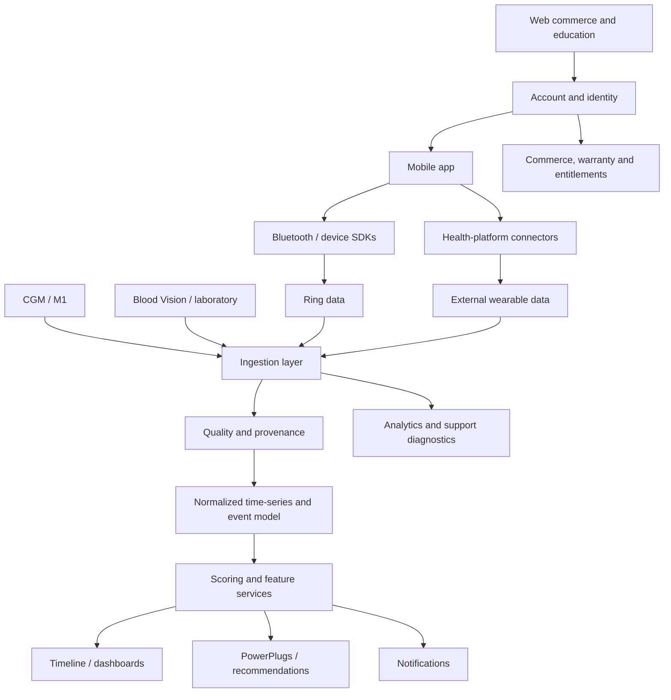
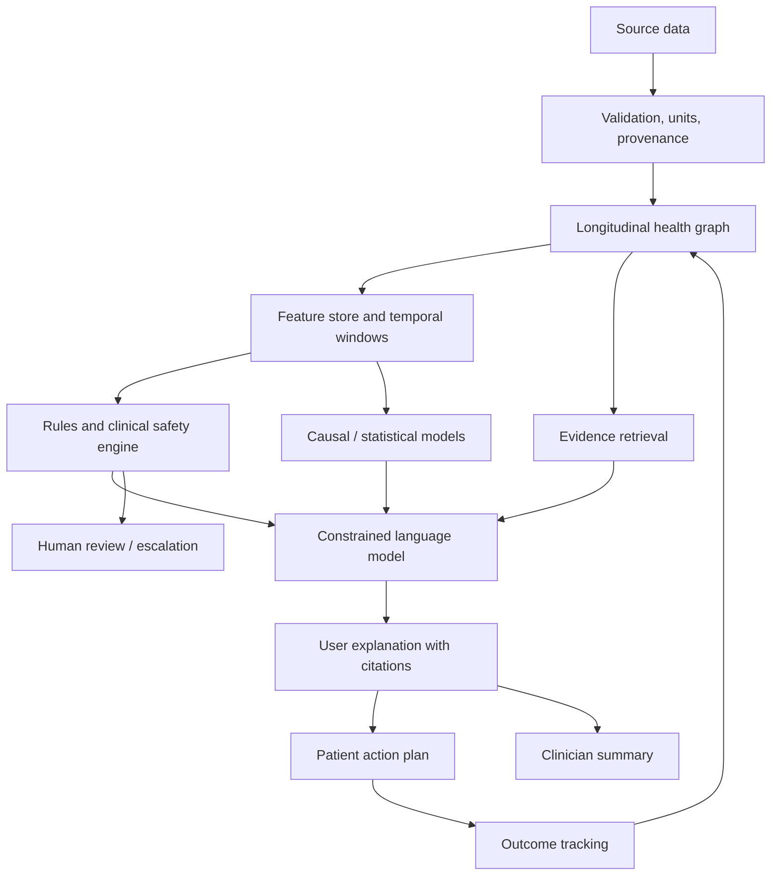
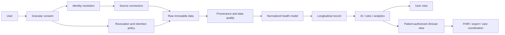
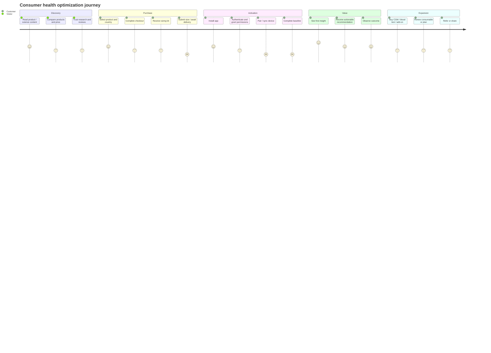

# Ultrahuman Additional Board Reports for Ovexis

**Date:** 25 July 2026  
**Evidence rule:** 🟢 Confirmed = directly supported by a public source. 🟡 Strong Inference = reasoned interpretation. 🔴 Speculation = hypothesis requiring validation.

---

# Report A — Executive Board Brief

## 1. Investment thesis

- **🟢 Confirmed.** Ultrahuman is a Bengaluru-founded consumer health hardware/software company founded by Mohit Kumar and Vatsal Singhal in 2019. It sells Ring AIR, M1/M1 Live, Blood Vision, Cycle & Ovulation products and Ultrahuman Home-related products. [R1](https://www.livemint.com/companies/healthtech-startup-ultrahuman-raises-35mn-in-series-b-11710931224373.html) [R2](https://www.ultrahuman.com/global/ring/)
- **🟢 Confirmed.** It has raised a publicly reported $35m equity/debt round and was reported at a $125m post-money valuation in March 2024. [R1](https://www.livemint.com/companies/healthtech-startup-ultrahuman-raises-35mn-in-series-b-11710931224373.html)
- **🟡 Strong Inference.** The company’s strategic ambition is to own the consumer health data loop: capture signals, create proprietary scores, deliver behaviour change, sell additional modalities, and compound longitudinal data.
- **🟡 Strong Inference.** The principal competitive risk is not that Ultrahuman lacks features. It is that breadth may create reliability, support, clinical interpretation, app complexity, and regulatory liabilities faster than the company can operationalize them.

## 2. What Ovexis should learn

- **🟢 Confirmed.** Ultrahuman combines wearable, glucose, blood and cycle-related data in its public product/science narrative. [R2](https://www.ultrahuman.com/global/ring/) [R3](https://www.nature.com/articles/s41598-024-56933-2) [R4](https://www.ultrahuman.com/blood-vision/buy/us/)
- **🟡 Strong Inference.** Multimodal data is valuable only when identity, timestamps, units, provenance, missingness and uncertainty are handled correctly.
- **🟡 Strong Inference.** Ovexis should copy the integrated insight loop, but improve it with device neutrality, clinical handoff, evidence citations, consent receipts, explicit abstention, and robust data-quality controls.

## 3. What Ovexis should not copy

- **🟡 Strong Inference.** Do not begin with proprietary hardware unless it creates a unique signal that cannot be acquired through existing devices.
- **🟡 Strong Inference.** Do not make a score more prominent than the evidence behind it.
- **🟡 Strong Inference.** Do not rely on a disclaimer to manage a product experience that feels diagnostic.
- **🟡 Strong Inference.** Do not create a multi-product app whose primary navigation becomes an upsell surface.

## 4. Board decisions recommended

1. **🟡 Strong Inference.** Approve a device-agnostic longitudinal data platform as Ovexis MVP.
2. **🟡 Strong Inference.** Make provenance, confidence, correction and deletion core product primitives.
3. **🟡 Strong Inference.** Treat FHIR export and clinician summaries as early differentiation, not late enterprise plumbing.
4. **🟡 Strong Inference.** Build an evidence-aware health copilot only after the typed data model and guardrails exist.
5. **🟡 Strong Inference.** Measure trust, data continuity, action completion and clinical usefulness—not only DAU and conversation count.

---

# Report B — SWOT

## Strengths

- **🟢 Confirmed.** Broad product portfolio across ring, CGM, blood testing, reproductive health and home-health positioning. [R2](https://www.ultrahuman.com/global/ring/) [R4](https://www.ultrahuman.com/blood-vision/buy/us/) [R5](https://science.ultrahuman.com/)
- **🟢 Confirmed.** Public research output includes Nature-group M1 research and multiple company science studies. [R3](https://www.nature.com/articles/s41598-024-56933-2) [R5](https://science.ultrahuman.com/)
- **🟢 Confirmed.** Premium industrial-design positioning and reported retail expansion. [R1](https://www.livemint.com/companies/healthtech-startup-ultrahuman-raises-35mn-in-series-b-11710931224373.html)
- **🟢 Confirmed.** Subscription-free core Ring AIR positioning. [R2](https://www.ultrahuman.com/global/ring/)
- **🟡 Strong Inference.** Strong founder-market fit for high-agency health optimization and consumer hardware.

## Weaknesses

- **🟢 Confirmed.** Public user reports describe battery, connectivity, sync, missed sleep, notifications, app clutter and support problems. [R6](https://www.reddit.com/r/Ultrahuman/comments/1l8ltnz/ultrahuman_ring_air_first_impression/) [R7](https://www.reddit.com/r/Ultrahuman/comments/1jomkxa/ultrahuman_ring_air_support_megathread)
- **🟢 Confirmed / not publicly verified.** Official API documentation, FHIR capability, hospital workflow and provider tooling were not found in this review.
- **🟡 Strong Inference.** Hardware continuity creates a single point of failure for the entire insight proposition.
- **🟡 Strong Inference.** A broad ecosystem can create app clutter and cross-sell fatigue.
- **🟡 Strong Inference.** Public evidence does not demonstrate a uniquely defensible AI moat.

## Opportunities

- **🟢 Confirmed.** Public reporting indicates intended expansion into manufacturing, new wearable form factors, and fertility/cardiovascular research. [R8](https://economictimes.indiatimes.com/tech/funding/ultrahuman-in-talks-with-westbridge-to-raise-100-120-million-after-softbank-deal-falls-through/articleshow/120691700.cms)
- **🟡 Strong Inference.** Clinical partnerships, provider handoff, payer outcomes and developer APIs are logical adjacencies.
- **🟡 Strong Inference.** Device-neutral longitudinal intelligence is a large gap between consumer wearables and clinical systems.

## Threats

- **🟢 Confirmed.** Oura and Ultrahuman have engaged in public patent litigation. [R9](https://blog.ultrahuman.com/blog/ultrahuman-files-patent-infringement-suit-against-oura/) [R10](https://blog.ultrahuman.com/blog/ultrahuman-is-here-for-long/)
- **🟡 Strong Inference.** Apple, Google, Samsung, Oura and WHOOP can apply stronger distribution, platform or subscription economics.
- **🟡 Strong Inference.** Clinical, fertility, glucose and blood-testing claims can raise jurisdiction-specific regulatory risk.
- **🟡 Strong Inference.** Consumer novelty may decline if users do not observe actionable outcomes after the first few months.

---

# Report C — Porter’s Five Forces

## 1. Rivalry among existing competitors — High

- **🟢 Confirmed.** Ultrahuman operates across smart rings, CGM coaching, blood testing, health optimization and wearable analytics, markets with multiple established competitors. [R2](https://www.ultrahuman.com/global/ring/) [R3](https://www.nature.com/articles/s41598-024-56933-2)
- **🟡 Strong Inference.** Rivalry is high because sensor features are increasingly imitable, while brand, distribution, algorithms, subscriptions and ecosystem breadth compete simultaneously.
- **Ovexis response — 🟡 Strong Inference.** Compete on trust, interoperability, clinical utility and data provenance rather than another isolated score.

## 2. Threat of new entrants — Medium

- **🟢 Confirmed.** Software health products can be launched without manufacturing a ring; third-party APIs and phone health platforms lower some entry barriers. [R11](https://openwearables.io/integrations)
- **🟡 Strong Inference.** Hardware, regulatory, supply-chain, clinical validation and support create meaningful barriers for full-stack entrants.
- **🟡 Strong Inference.** AI lowers the barrier for coaching interfaces but does not solve reliable sensing, identity, clinical safety or longitudinal data quality.

## 3. Supplier power — Medium to High

- **🟡 Strong Inference.** Specialized sensor, battery, semiconductor, lab and CGM suppliers can constrain quality, cost, capacity and launch timelines.
- **🟢 Confirmed.** Ultrahuman has publicly emphasized manufacturing-capacity expansion, indicating manufacturing is strategically material. [R1](https://www.livemint.com/companies/healthtech-startup-ultrahuman-raises-35mn-in-series-b-11710931224373.html)
- **Ovexis response — 🟡 Strong Inference.** Keep hardware optional and use multiple data-source connectors.

## 4. Buyer power — Medium

- **🟡 Strong Inference.** Consumer buyers can switch among rings, watches, apps and health services, but accumulated longitudinal history and habit create moderate switching costs.
- **🟢 Confirmed.** Ring AIR’s no-recurring-core-fee position reduces price friction but leaves hardware purchase and reliability expectations high. [R2](https://www.ultrahuman.com/global/ring/)
- **Ovexis response — 🟡 Strong Inference.** Give users portable data and earn retention through intelligence, not lock-in.

## 5. Threat of substitutes — High

- **🟢 Confirmed.** Phone and wearable ecosystems already capture many health and activity metrics; public sources document Apple/Android compatibility and health-data integrations. [R2](https://www.ultrahuman.com/global/ring/) [R11](https://openwearables.io/integrations)
- **🟡 Strong Inference.** The substitute is not only another ring; it is “do nothing,” annual lab testing, a primary-care visit, a smartwatch, a spreadsheet, or a general AI assistant.
- **Ovexis response — 🟡 Strong Inference.** Aggregate existing sources and show a value that no single substitute can provide.

---

# Report D — Value Chain

```mermaid
flowchart LR
 A[Sensor / lab suppliers] --> B[Hardware and data acquisition]
 B --> C[Connectivity and ingestion]
 C --> D[Normalization and identity]
 D --> E[Algorithms and research]
 E --> F[Scores and interpretation]
 F --> G[Behaviour-change product]
 G --> H[Support, commerce and renewals]
 H --> I[Community, referrals and data flywheel]
```

## Ultrahuman value-chain assessment

- **🟢 Confirmed.** Ultrahuman participates in acquisition through ring/CGM/lab products, interpretation through scores and reports, and monetization through hardware, plans and add-ons. [R2](https://www.ultrahuman.com/global/ring/) [R4](https://www.ultrahuman.com/blood-vision/buy/us/)
- **🟡 Strong Inference.** The most defensible links are proprietary signal acquisition, cross-modal normalization, longitudinal personalization, brand and distribution.
- **🟡 Strong Inference.** The most failure-sensitive links are hardware quality, connectivity, missing-data handling, interpretation and support.
- **Ovexis strategy — 🟡 Strong Inference.** Own normalization, identity, provenance, evidence retrieval, action tracking and clinical handoff; partner for most sensors and labs.

---

# Report E — Product Architecture Diagram

- **🟢 Confirmed.** Ring, CGM, blood and optional product surfaces are publicly described. [R2](https://www.ultrahuman.com/global/ring/) [R3](https://www.nature.com/articles/s41598-024-56933-2) [R4](https://www.ultrahuman.com/blood-vision/buy/us/)
- **🟡 Strong Inference.** The internal services in the diagram are required by the product behaviour but are not an official Ultrahuman architecture disclosure.
- **🔴 Speculation.** Exact language, framework, deployment topology, queues, databases and model vendors are unknown.

---

# Report F — AI Architecture Diagram for Ovexis

- **🟡 Strong Inference.** This architecture is recommended for Ovexis because it separates measurement, inference, evidence, language generation and safety.
- **🟡 Strong Inference.** LLMs should not directly calculate medical metrics, fabricate missing values, make unreviewed diagnoses or change medications.
- **🟡 Strong Inference.** Required evaluation metrics include factuality, citation correctness, temporal reasoning, calibration, subgroup performance, abstention quality, harmful-advice rate and action outcomes.
- **🟢 Confirmed / not publicly verified.** Ultrahuman’s specific LLMs, RAG, agent design, prompts and evaluation system are not publicly disclosed in the reviewed sources.

---

# Report G — Healthcare Data Flow and Consent Architecture

## Required controls

- **🟡 Strong Inference.** Consent must be purpose-specific: personalization, research, clinician sharing, employer reporting, and model improvement should not be one bundled checkbox.
- **🟡 Strong Inference.** Every derived insight should retain source observations, algorithm version, timestamp and confidence.
- **🟡 Strong Inference.** Revocation should stop future processing and trigger a documented downstream deletion or de-identification process where legally permitted.
- **🟢 Confirmed.** Ultrahuman’s public policy states that data is encrypted at rest and in transit and discusses cross-border processing and GDPR. [R12](https://www.ultrahuman.com/us/privacyPolicy/)
- **🟢 Confirmed / not publicly verified.** Ultrahuman’s full FHIR/HL7/CCDA, hospital, payer, pharmacy and imaging architecture was not publicly verified.

---

# Report H — User Journey Diagram and Conversion Analysis

- **🟢 Confirmed.** Sizing kits, app pairing, compatibility, core metrics and optional add-ons are publicly described. [R2](https://www.ultrahuman.com/global/ring/) [R4](https://www.ultrahuman.com/blood-vision/buy/us/)
- **🟡 Strong Inference.** The activation bottleneck is likely first trusted insight, not signup.
- **🟡 Strong Inference.** The conversion bottleneck is likely confidence that the data is continuous and actionable, not lack of product breadth.
- **🟢 Confirmed.** Public user reports identify pairing, syncing, battery and notification friction. [R6](https://www.reddit.com/r/Ultrahuman/comments/1l8ltnz/ultrahuman_ring_air_first_impression/) [R7](https://www.reddit.com/r/Ultrahuman/comments/1jomkxa/ultrahuman_ring_air_support_megathread)

---

# Report I — Risk Register

| ID | Risk | Status | Likelihood | Impact | Early indicator | Mitigation |
|---|---|---|---|---|---|---|
| R-01 | Hardware battery/connectivity failure | 🟢 Public anecdotes exist; prevalence unknown | Medium | High | Sync gaps, replacements, support tickets | Device redundancy, gap-aware scoring, QA telemetry |
| R-02 | Misleading health recommendations | 🟡 Strong inference from wellness/medical boundary | Medium | Very High | Complaints, clinician escalations | Typed tools, clinical rules, abstention, review |
| R-03 | Patent / freedom-to-operate conflict | 🟢 Confirmed public Oura litigation | Medium | High | Injunctions, import restrictions | Patent counsel, design-around, licensing |
| R-04 | Data breach | 🟡 General sector risk; no breach asserted | Medium | Very High | Anomalous access, vendor incident | Encryption, least privilege, immutable audit, IR plan |
| R-05 | Cross-border privacy non-compliance | 🟢 Cross-border processing described in policy | Medium | High | DPA complaints, regulator queries | Regional controls, DPA, consent and deletion workflows |
| R-06 | App notification fatigue | 🟢 Public complaints exist | Medium | Medium | Disablement, churn, low open rate | Notification budget and user controls |
| R-07 | Integration instability | 🟢 Public Strava complaints exist | Medium | High | OAuth failures and stale data | Health dashboard, retries, connector SLAs |
| R-08 | Consumable/lab logistics | 🟡 Strong inference from Blood Vision/CGM model | Medium | High | Delays, refunds, regional restrictions | Multiple lab partners, inventory and local fulfilment |
| R-09 | AI commoditization | 🟡 Strong inference | High | Medium | Similar assistants proliferate | Own data graph, outcomes and clinical trust |
| R-10 | Low long-term retention | 🔴 Not publicly verifiable | Medium | High | Cohort drop after baseline | Outcome loops, experiments, clinician pathways |
| R-11 | Regulatory classification change | 🟡 Strong inference | Medium | Very High | Claims scrutiny, product notices | Regulatory counsel and claim governance |
| R-12 | Support scaling failure | 🟢 Anecdotal reports are mixed | Medium | High | SLA degradation, repeat replacements | Automated diagnostics, regional support and repair analytics |

---

# Report J — Engineering Roadmap Reconstruction

## Phase 0 — Foundation, 0–3 months

- **🟡 Strong Inference.** Identity, consent ledger, raw observation store, provenance, normalized metric model, audit logging and deletion workflow.
- **🟡 Strong Inference.** HealthKit/Health Connect and at least two wearable connectors.
- **🟡 Strong Inference.** Timeline, data-quality dashboard, confidence labels and manual correction.

## Phase 1 — MVP, 3–6 months

- **🟡 Strong Inference.** Sleep, movement, HR/HRV, glucose and lab timeline.
- **🟡 Strong Inference.** Weekly evidence-backed brief, not an unrestricted chatbot.
- **🟡 Strong Inference.** Patient-shareable report and PDF/CSV export.

## Phase 2 — Clinical bridge, 6–12 months

- **🟡 Strong Inference.** FHIR R4 export, provider portal, clinician summary, medication capture, red-flag escalation and care-plan tracking.
- **🟡 Strong Inference.** Research consent and de-identified cohort export.

## Phase 3 — Intelligence moat, 12–24 months

- **🟡 Strong Inference.** Causal self-experiments, intervention ledger, personalized baseline model, evidence graph and calibrated digital-twin components.
- **🔴 Speculation.** Predictive models for specific diseases should not be assumed until clinical validation and regulatory strategy are complete.

## Technical debt to avoid

- **🟡 Strong Inference.** Do not store only aggregated scores.
- **🟡 Strong Inference.** Do not let an LLM become the system of record.
- **🟡 Strong Inference.** Do not make source-specific schemas leak into product logic.
- **🟡 Strong Inference.** Do not hide data gaps behind interpolated charts.
- **🟡 Strong Inference.** Do not postpone consent, audit and deletion architecture.

---

# Report K — Founder Psychology

- **🟡 Strong Inference.** Mohit Kumar and Vatsal Singhal appear to favour ambitious, vertically integrated consumer products rather than narrow software. This is inferred from the move from metabolic software/CGM into ring hardware, blood testing, fertility, home health and manufacturing. [R1](https://www.livemint.com/companies/healthtech-startup-ultrahuman-raises-35mn-in-series-b-11710931224373.html) [R8](https://economictimes.indiatimes.com/tech/funding/ultrahuman-in-talks-with-westbridge-to-raise-100-120-million-after-softbank-deal-falls-through/articleshow/120691700.cms)
- **🟡 Strong Inference.** They likely view health as a feedback-control problem: measure physiology, surface a signal, change behaviour, measure again.
- **🟡 Strong Inference.** They likely believe consumer delight and aesthetic desirability can accelerate adoption of serious health instrumentation.
- **🟡 Strong Inference.** Their risk posture appears expansionary: multiple modalities, international manufacturing, acquisitions and public IP litigation.
- **🔴 Speculation.** Their private 10-year vision, board dynamics, internal disagreement and exact decision framework cannot be known from public materials.
- **Ovexis counter-position — 🟡 Strong Inference.** Be more conservative in clinical claims and more aggressive in openness, interoperability and epistemic transparency.

---

# Report L — Strategic Recommendations

## Priority 0 — Build now

1. **🟡 Strong Inference.** Unified consent and identity layer.
2. **🟡 Strong Inference.** Multi-source health timeline.
3. **🟡 Strong Inference.** Provenance and data-quality controls.
4. **🟡 Strong Inference.** Evidence-backed weekly health brief.
5. **🟡 Strong Inference.** Clinician-ready report.
6. **🟡 Strong Inference.** Safe conversational explanation over typed tools.
7. **🟡 Strong Inference.** Device failure and missing-data resilience.

## Priority 1 — Build after product/market fit

1. **🟡 Strong Inference.** FHIR export and provider portal.
2. **🟡 Strong Inference.** Medication/pharmacy context.
3. **🟡 Strong Inference.** Causal self-experiments.
4. **🟡 Strong Inference.** Research consent exchange.
5. **🟡 Strong Inference.** Enterprise tenant and regional residency.

## Priority 2 — Partner before building

- **🟡 Strong Inference.** Ring/CGM hardware.
- **🟡 Strong Inference.** Blood-testing logistics.
- **🟡 Strong Inference.** Hospital/EHR connectivity.
- **🟡 Strong Inference.** Pharmacy and insurer data.

## The one-sentence strategy

- **🟡 Strong Inference.** “Ovexis should become the trusted, device-neutral longitudinal health intelligence layer that explains what is changing in a person’s body, why the system believes it, what action is reasonable, and when a clinician should be involved.”

---

# Report M — References

[R1] Mint, “Healthtech startup Ultrahuman raises $35mn in Series B,” 2024. https://www.livemint.com/companies/healthtech-startup-ultrahuman-raises-35mn-in-series-b-11710931224373.html  
[R2] Ultrahuman, Ring AIR product page. https://www.ultrahuman.com/global/ring/  
[R3] Scientific Reports, “Metabolic health tracking using Ultrahuman M1 continuous glucose monitoring platform…” https://www.nature.com/articles/s41598-024-56933-2  
[R4] Ultrahuman, Blood Vision pricing/product page. https://www.ultrahuman.com/blood-vision/buy/us/  
[R5] Ultrahuman Science. https://science.ultrahuman.com/  
[R6] Reddit, Ultrahuman Ring AIR first impression. https://www.reddit.com/r/Ultrahuman/comments/1l8ltnz/ultrahuman_ring_air_first_impression/  
[R7] Reddit, Ultrahuman Ring AIR support megathread. https://www.reddit.com/r/Ultrahuman/comments/1jomkxa/ultrahuman_ring_air_support_megathread/  
[R8] Economic Times, Ultrahuman funding talks and expansion report. https://economictimes.indiatimes.com/tech/funding/ultrahuman-in-talks-with-westbridge-to-raise-100-120-million-after-softbank-deal-falls-through/articleshow/120691700.cms  
[R9] Ultrahuman, patent infringement suit against Oura. https://blog.ultrahuman.com/blog/ultrahuman-files-patent-infringement-suit-against-oura/  
[R10] Ultrahuman, “Ultrahuman is here for long.” https://blog.ultrahuman.com/blog/ultrahuman-is-here-for-long/  
[R11] Open Wearables integrations. https://openwearables.io/integrations  
[R12] Ultrahuman privacy policy. https://www.ultrahuman.com/us/privacyPolicy/
