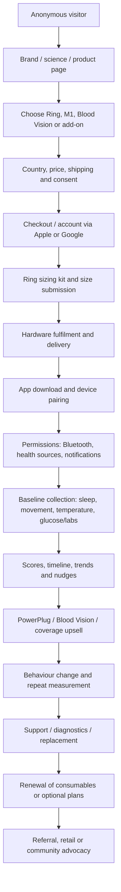
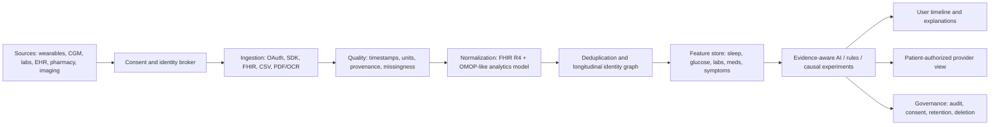
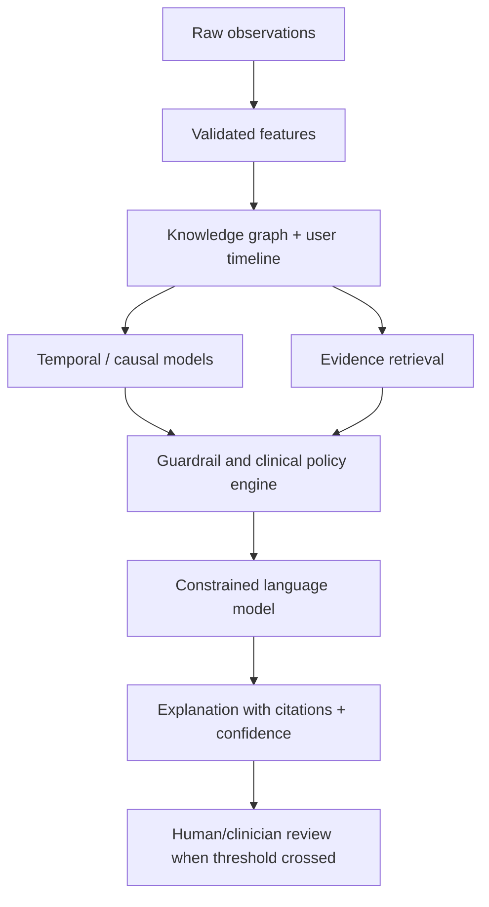
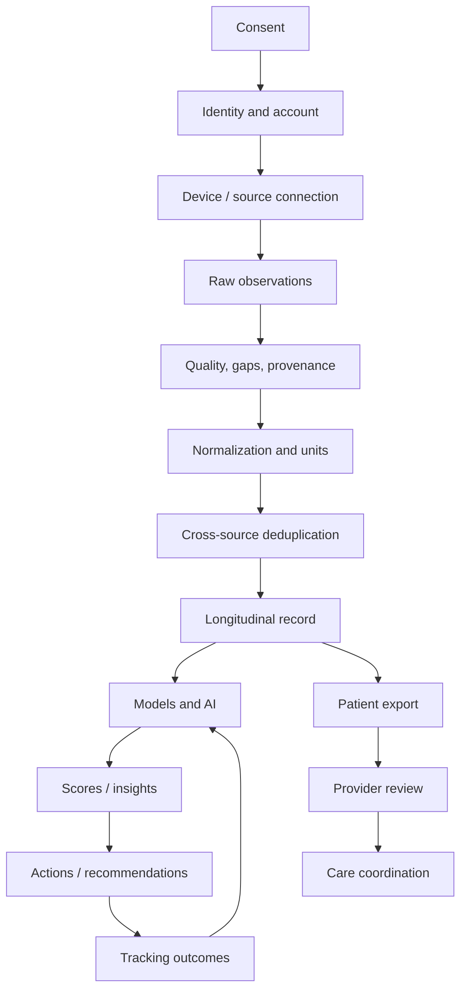

# Ultrahuman — Competitive Intelligence Report for Ovexis

**Prepared:** 25 July 2026 (Asia/Calcutta)  
**Scope:** Publicly available web evidence only; no authenticated product access, source-code access, traffic interception, or unauthorised testing.  
**Evidence discipline:** Every substantive claim is prefixed with **🟢 Confirmed**, **🟡 Strong Inference**, or **🔴 Speculation**. “Not publicly verified” is used where evidence was not found. Product behaviour can change by region, app version, or date.

> **Board warning.** This is a high-confidence strategic reconstruction, not a forensic audit. Public information is strongest on product positioning, funding, scientific publications, public policy, and community experience. It is weak on private APIs, internal cloud topology, true cohort retention, CAC/LTV, SOC 2 status, clinical workflow, and current headcount. Those gaps are themselves strategic findings.

---

## 1. Executive Summary

### What Ultrahuman is building

- **🟢 Confirmed.** Ultrahuman sells an integrated consumer health-optimization ecosystem spanning the Ring AIR wearable, M1 continuous-glucose-monitoring platform, Blood Vision preventive blood testing, and Ultrahuman Home; its privacy policy describes the company as building a metabolic-health and fitness ecosystem. [S1](https://www.ultrahuman.com/global/ring/) [S2](https://www.ultrahuman.com/us/privacyPolicy/) [S3](https://www.livemint.com/companies/healthtech-startup-ultrahuman-raises-35mn-in-series-b-11710931224373.html)
- **🟢 Confirmed.** Ring AIR combines temperature, PPG, and motion sensors and presents sleep, movement, recovery, HR, HRV, SpO2, body-temperature, and related insights; the company states that Ring AIR and M1 data can be combined for metabolic and sleep insights. [S1](https://www.ultrahuman.com/global/ring/)
- **🟡 Strong Inference.** The strategic product is not the ring alone; it is a longitudinal “body operating system” in which high-frequency wearable streams are combined with intermittent glucose, blood, cycle, and environmental data to produce actionable behaviour change.
- **🔴 Speculation.** “Digital twin” is a useful description of the direction, but Ultrahuman has not publicly disclosed a formal digital-twin architecture or a clinically validated individual physiological simulator.

### Why it exists / problem definition

- **🟢 Confirmed.** Ultrahuman’s public framing is health optimization, metabolic intelligence, prevention, and actionable guidance rather than treatment; its policy states that it does not provide medical care or advice and is not a HIPAA covered entity. [S2](https://www.ultrahuman.com/us/privacyPolicy/)
- **🟡 Strong Inference.** The functional problem is fragmented feedback: consumers have sleep/activity data in one place, glucose in another, lab results in a PDF, and no reliable causal explanation of what to do next.
- **🟡 Strong Inference.** The emotional problem is uncertainty and loss of agency: “Am I healthy?”, “Why do I feel bad?”, and “Which intervention is working?” Ultrahuman converts invisible physiology into scores, windows, nudges, and progress.
- **🟡 Strong Inference.** The operational problem is data acquisition, sensor reliability, normalization, behavioural interpretation, support, and global hardware logistics—particularly hard when a product is sold as a continuous signal rather than a one-off gadget.

### Customer / non-customer

- **🟢 Confirmed.** Public positioning and products target athletes, fitness-oriented users, biohackers, health optimizers, and people interested in sleep, recovery, metabolism, and preventive biomarkers. [S2](https://www.ultrahuman.com/us/privacyPolicy/) [S10](https://science.ultrahuman.com/)
- **🟡 Strong Inference.** The best customer is a high-agency, affluent, data-literate early adopter willing to wear hardware, tolerate imperfect measurements, and act on recommendations.
- **🟡 Strong Inference.** The poor-fit customer is a patient seeking diagnosis, a clinician requiring validated medical records, a user unwilling to share data with cloud services, or a person needing zero-friction, multi-year hardware reliability.

### Category creation and replacement

- **🟡 Strong Inference.** Ultrahuman is creating “consumer metabolic intelligence / preventive health optimization” by combining wearable sensing, CGM, labs, and coaching; it is adjacent to smart rings, quantified-self apps, CGM coaching, wellness testing, and longevity services.
- **🟡 Strong Inference.** It seeks to replace fragmented trackers, generic wellness content, episodic annual blood tests, and the subscription-heavy smart-ring model with an integrated, action-oriented ecosystem.
- **🟢 Confirmed.** Ring AIR is marketed with a one-time purchase and lifelong access to ring data, rather than a recurring fee for core ring access; optional products and coverage plans are separately monetized. [S1](https://www.ultrahuman.com/global/ring/)

### Jobs to Be Done

| Job | Evidence status | Interpretation for Ovexis |
|---|---|---|
| “Tell me how I slept and recovered.” | 🟢 Confirmed — Ring AIR features [S1](https://www.ultrahuman.com/global/ring/) | Make the explanation and uncertainty more transparent than a score. |
| “Show me which food or behaviour changes my glucose.” | 🟢 Confirmed — M1/Ring integration claim [S1](https://www.ultrahuman.com/global/ring/) | Add causal experiments, not just correlations. |
| “Turn lab results into a plan.” | 🟢 Confirmed — Blood Vision includes biomarker interpretation and reports [S4](https://www.ultrahuman.com/blood-vision/buy/us/) | Make clinician handoff and medical provenance first-class. |
| “Help me act today.” | 🟡 Strong Inference — nudges and windows are central to public product language | Use low-noise, preference-aware intervention delivery. |
| “Help me know when to seek care.” | 🔴 Speculation as an Ultrahuman job; public disclaimers point away from medical care | Ovexis can differentiate with safe escalation and clinical integration. |

### Core philosophy

- **🟢 Confirmed.** Ultrahuman emphasizes research, proprietary algorithms, manufacturing, and a community of health optimizers; its 2024 funding announcement explicitly linked capital to manufacturing capacity and deeper health-tracking research. [S3](https://www.livemint.com/companies/healthtech-startup-ultrahuman-raises-35mn-in-series-b-11710931224373.html)
- **🟡 Strong Inference.** The philosophy is “measure more of the body, correlate signals, translate them into action, and reduce dependence on recurring software subscriptions.”
- **🟡 Strong Inference.** The central strategic bet is that the more modalities Ultrahuman owns, the more useful its recommendations become and the harder it is for a single-device competitor to copy the whole experience.

### Board-level thesis

- **🟢 Confirmed.** Ultrahuman has achieved meaningful product breadth, scientific-publication activity, public retail expansion, and substantial financing; public reports put the March 2024 financing at $35m and a $125m post-money valuation. [S3](https://www.livemint.com/companies/healthtech-startup-ultrahuman-raises-35mn-in-series-b-11710931224373.html) [S5](https://economictimes.indiatimes.com/tech/funding/health-device-maker-ultrahuman-raises-35-million-led-by-steadview-nexus/articleshow/108646994.cms)
- **🟡 Strong Inference.** Its strongest current moat is the combination of brand, distribution, product breadth, manufacturing ambition, and proprietary longitudinal data—not demonstrably superior AI.
- **🟡 Strong Inference.** Its most visible vulnerability is execution at the hardware/data-quality/support boundary: community reports repeatedly mention battery, connectivity, missed sleep, sync, notification, and support problems, although these are anecdotal and selection-biased. [S6](https://www.reddit.com/r/Ultrahuman/comments/1l8ltnz/ultrahuman_ring_air_first_impression/) [S7](https://www.reddit.com/r/Ultrahuman/comments/1jomkxa/ultrahuman_ring_air_support_megathread)
- **🟡 Strong Inference.** Ovexis should not simply build another ring. It should build a trusted longitudinal health intelligence layer that is device-agnostic, clinically legible, consent-native, and explicit about evidence and uncertainty.

---

## 2. Company Intelligence

### Timeline

- **🟢 Confirmed.** Ultrahuman was founded in 2019 by Mohit Kumar and Vatsal Singhal, according to company databases and press coverage. [S3](https://www.livemint.com/companies/healthtech-startup-ultrahuman-raises-35mn-in-series-b-11710931224373.html) [S8](https://tracxn.com/d/companies/ultrahuman/__RSGzV5aJJQdyE6IBruBLiGXE7STOO3AfA1qtqw5Z4zo)
- **🟢 Confirmed.** Public reporting places the app launch at CES in January 2021 and M1 launch in June 2021; these dates are reported in a secondary timeline and should be independently revalidated before board citation. [S9](https://en.wikipedia.org/wiki/Ultrahuman)
- **🟢 Confirmed.** Public timeline sources report acquisition of LazyCo in April 2022, Ring AIR recognition in 2023, Cycle & Ovulation PowerPlug in December 2024, and acquisition of viO HealthTech in August 2025. [S9](https://en.wikipedia.org/wiki/Ultrahuman)
- **🟢 Confirmed.** Ultrahuman published a Nature-group paper in March 2024 on M1 metabolic-health tracking in non-diabetic and pre-diabetic Indians. [S10](https://www.nature.com/articles/s41598-024-56933-2)
- **🟢 Confirmed.** It announced a $35m equity/debt financing in March 2024; reporting says $25m equity and the balance debt, with Blume, Steadview, Nexus, Alpha Wave, and Deepinder Goyal participating. [S3](https://www.livemint.com/companies/healthtech-startup-ultrahuman-raises-35mn-in-series-b-11710931224373.html) [S5](https://economictimes.indiatimes.com/tech/funding/health-device-maker-ultrahuman-raises-35-million-led-by-steadview-nexus/articleshow/108646994.cms)
- **🟢 Confirmed.** Ultrahuman publicly announced an Indian patent-infringement action against Oura in November 2025. [S11](https://blog.ultrahuman.com/blog/ultrahuman-files-patent-infringement-suit-against-oura/)
- **🟢 Confirmed.** A company blog reported in October 2025 that the U.S. ITC issued a final determination affecting Ultrahuman Ring AIR sales in the U.S., while existing U.S. owners would continue to receive support; exact legal outcome and current status require counsel review. [S12](https://blog.ultrahuman.com/blog/ultrahuman-is-here-for-long/)
- **🟡 Strong Inference.** The sequence shows a deliberate expansion from software/coaching into proprietary sensing, manufacturing, lab testing, fertility, and home/environmental health.

### Founders and leadership

- **🟢 Confirmed.** Mohit Kumar is publicly described as co-founder and CEO; Vatsal Singhal is co-founder. [S3](https://www.livemint.com/companies/healthtech-startup-ultrahuman-raises-35mn-in-series-b-11710931224373.html)
- **🟢 Confirmed.** Public reporting identifies the founders as former Roadrunnr founders and says Roadrunnr was sold to Zomato. [S5](https://economictimes.indiatimes.com/tech/funding/health-device-maker-ultrahuman-raises-35-million-led-by-steadview-nexus/articleshow/108646994.cms)
- **🟢 Confirmed.** Public company profiles list additional leaders/roles, but current org chart and reporting lines are not publicly verified. [S8](https://tracxn.com/d/companies/ultrahuman/__RSGzV5aJJQdyE6IBruBLiGXE7STOO3AfA1qtqw5Z4zo)
- **🔴 Speculation.** The founders’ logistics background likely informs a bias toward operational control, fast iteration, and vertically integrated fulfilment; this is a hypothesis, not an observed internal decision rule.

### Funding, valuation, and economics

- **🟢 Confirmed.** Public reports state the March 2024 round valued the company at $125m post-money and that founders collectively held about 29% at that time. [S5](https://economictimes.indiatimes.com/tech/funding/health-device-maker-ultrahuman-raises-35-million-led-by-steadview-nexus/articleshow/108646994.cms)
- **🟢 Confirmed.** 2025 reports described discussions with WestBridge for $100–120m at a possible $500–550m valuation, after SoftBank discussions reportedly fell through; these were reported talks, not a confirmed completed financing. [S13](https://economictimes.indiatimes.com/tech/funding/ultrahuman-in-talks-with-westbridge-to-raise-100-120-million-after-softbank-deal-falls-through/articleshow/120691700.cms)
- **🟢 Confirmed.** The same report attributed approximately $80m 2024 revenue and a $150–160m annualized run rate to sources; these figures are not audited in the public source. [S13](https://economictimes.indiatimes.com/tech/funding/ultrahuman-in-talks-with-westbridge-to-raise-100-120-million-after-softbank-deal-falls-through/articleshow/120691700.cms)
- **🟢 Confirmed.** Public funding databases disagree on total funding, rounds, headcount, and 2025/2026 financing; therefore no single database figure should be treated as authoritative. [S8](https://tracxn.com/d/companies/ultrahuman/__RSGzV5aJJQdyE6IBruBLiGXE7STOO3AfA1qtqw5Z4zo) [S14](https://inc42.com/company/ultrahuman/funding/)
- **🟡 Strong Inference.** The business likely combines high-margin software/insights and consumable or service revenue with lower-margin hardware, creating a strategic tension between “no ring subscription” acquisition and recurring ecosystem monetization.
- **🔴 Speculation.** CAC, gross margin, cohort retention, payback, and contribution margin cannot be responsibly estimated from public evidence.

### Acquisitions, research, patents, partnerships

- **🟢 Confirmed.** Public sources report LazyCo and viO HealthTech acquisitions; the viO transaction is linked to Cycle & Ovulation Pro and OvuSense algorithm/sensor capabilities. [S9](https://en.wikipedia.org/wiki/Ultrahuman) [S15](https://science.ultrahuman.com/studies/cycle-tracking-pro-accuracy)
- **🟢 Confirmed.** Ultrahuman publishes a science library with papers/white papers covering M1, sleep heart-rate sensing, temperature sensing, athlete recovery, cycle tracking, and biomarker integration. [S10](https://science.ultrahuman.com/)
- **🟢 Confirmed.** A published case-series report describes combining Ring AIR and Blood Vision data and says UltraTrace recommendations are powered by Examine. [S16](https://cyborg.ultrahuman.com/studies/biomarkers-blood-vision-v1)
- **🟢 Confirmed.** Ultrahuman publicly asserts an Indian patent relating to Ring AIR sensor integration, construction, and onboard processing, and has publicly discussed the Oura litigation. [S11](https://blog.ultrahuman.com/blog/ultrahuman-files-patent-infringement-suit-against-oura/)
- **🟡 Strong Inference.** The company uses research publication as both scientific validation and brand/distribution collateral; publication does not by itself establish clinical utility or regulatory clearance.
- **🟢 Confirmed.** No public, authoritative evidence was found in this investigation for a public Ultrahuman open-source software project, public OpenAPI specification, FHIR server, or broad hospital/insurer integration catalogue. **Not publicly verified.**

---

## 3. Founder Psychology and Internal Strategy Hypotheses

> This section is explicitly inferential. It should be used as a hypothesis set for competitive planning, not as a claim about private beliefs.

- **🟡 Strong Inference.** Belief 1: health behaviour improves when physiological feedback is immediate, personalized, and continuous.
- **🟡 Strong Inference.** Belief 2: a consumer product can create more behaviour change than a clinic if it is beautiful, always-on, and frictionless.
- **🟡 Strong Inference.** Belief 3: owning hardware and data capture is strategically preferable to being an app layer dependent on Apple, Google, Oura, or CGM vendors.
- **🟡 Strong Inference.** Belief 4: breadth of biomarkers increases perceived intelligence and cross-sell potential.
- **🟡 Strong Inference.** Belief 5: research and proprietary IP are required to defend a hardware category against incumbents.
- **🟡 Strong Inference.** Decision framework likely prioritizes: signal acquisition → visible user insight → distribution/brand → manufacturing scale → science/IP → adjacent modality.
- **🟡 Strong Inference.** Risk tolerance appears high: the company has entered hardware, CGM, blood testing, reproductive health, home health, global retail, and patent litigation rather than remaining a narrow software product.
- **🔴 Speculation.** Ten-year ambition may be a global preventive-health operating system with multiple form factors and a large longitudinal biomarker graph; public materials support the direction but not a formal 10-year plan.
- **Ovexis counter-model — 🟡 Strong Inference.** Build the trust and longitudinal intelligence layer first; integrate commodity and incumbent sensors; earn the right to manufacture only where sensing or adherence creates defensible value.

---

## 4. Product Reverse Engineering (Public Surface)

### Product inventory

| Product / surface | Publicly observed | Confidence |
|---|---|---|
| Ring AIR | Sleep, movement, recovery, HR, HRV, SpO2, temperature, sleep stages; iOS/Android; sizing kit; 4–6 day stated battery; no recurring core data fee | 🟢 Confirmed [S1](https://www.ultrahuman.com/global/ring/) |
| M1 / M1 Live | CGM-based metabolic tracking and Metabolic Score / glucose variability workflows | 🟢 Confirmed [S10](https://www.nature.com/articles/s41598-024-56933-2) |
| Blood Vision | 60+ biomarker Essentials at $99 every six months and $499 annual plan with 100+ biomarkers and follow-up test in the public U.S. page | 🟢 Confirmed [S4](https://www.ultrahuman.com/blood-vision/buy/us/) |
| Cycle & Ovulation | PowerPlug and paid Pro; Ring AIR temperature plus OvuSense algorithm claims | 🟢 Confirmed [S15](https://science.ultrahuman.com/studies/cycle-tracking-pro-accuracy) |
| Ultrahuman Home | Home/environmental health product described in press and company materials; full current feature set not publicly verified | 🟢/🟡 [S3](https://www.livemint.com/companies/healthtech-startup-ultrahuman-raises-35mn-in-series-b-11710931224373.html) |
| UltrahumanX | Optional protection/support plan; public FAQ describes accidental damage, loss/theft and weight-loss resizing benefits for certain plans | 🟢 Confirmed [S1](https://www.ultrahuman.com/global/ring/) |
| App | Timeline, ring section, scores, power plugs, notifications, integrations, profiles/settings are referenced in public help/community material; full screen map unavailable without product access | 🟡 Strong Inference |

### Publicly inferable workflows

1. **🟢 Confirmed.** Marketing → product selection → optional sizing kit → order → size submission → shipment → app pairing is described in the Ring FAQ. [S1](https://www.ultrahuman.com/global/ring/)
2. **🟢 Confirmed.** The ring requires iOS/Android compatibility and account/authentication; public privacy analysis reports Apple/Google authentication and cloud sync. [S1](https://www.ultrahuman.com/global/ring/) [S17](https://www.mozillafoundation.org/en/nothing-personal/ultrahuman-ring-privacy-review/)
3. **🟢 Confirmed.** Users can connect Strava from Profile → Settings → Connect with other apps, according to a public support reply; community reports indicate the integration has been unstable and often read-only. [S18](https://www.reddit.com/r/Ultrahuman/comments/1ef3axq/connect_to_strava/) [S19](https://www.reddit.com/r/Ultrahuman/comments/1d6db46/where_is_the_strava_integration/)
4. **🟢 Confirmed.** App recommendations include real-time insights/nudges and sleep/metabolic correlations in public product copy. [S1](https://www.ultrahuman.com/global/ring/)
5. **🟡 Strong Inference.** A likely retention loop is: wear → receive score/nudge → change behaviour → observe next-day signal → compare trend → buy another modality or PowerPlug.
6. **🟡 Strong Inference.** A likely growth loop is: striking hardware/brand → public score and lifestyle content → social proof → purchase → shareable transformation/research narrative.

### What is not publicly visible

- **🟢 Confirmed / not found.** Exact button inventory, screen-by-screen navigation, role/permission pages, private API schemas, webhooks, rate limits, backend jobs, prompt templates, model providers, feature flags, incident tooling, internal admin console, and clinical-provider workflow were not publicly verified.
- **🟢 Confirmed.** It would violate the evidence standard to invent those details. Ovexis should treat this as a competitive opportunity: a transparent public architecture and developer surface can be a differentiator.

---

## 5. Complete User Journey (Reconstructed)

- **🟢 Confirmed.** Sizing-kit, ordering, delivery, app compatibility, ring metrics, and optional plans are publicly described. [S1](https://www.ultrahuman.com/global/ring/)
- **🟡 Strong Inference.** Verification and consent are likely account-level rather than clinical-patient registration because the product is positioned as a consumer service; exact consent screens are not public.
- **🟡 Strong Inference.** The most important activation event is not account creation; it is the first complete, trusted baseline and first actionable insight.
- **🟡 Strong Inference.** The largest friction points are size/fit, delivery, pairing, battery continuity, noisy notifications, and interpretation of scores.
- **🟢 Confirmed.** Community reports include battery drain, Bluetooth/sync failures, missed sleep, duplicated health data, notification dissatisfaction, and inconsistent support experiences. [S6](https://www.reddit.com/r/Ultrahuman/comments/1l8ltnz/ultrahuman_ring_air_first_impression/) [S7](https://www.reddit.com/r/Ultrahuman/comments/1jomkxa/ultrahuman_ring_air_support_megathread) [S20](https://www.reddit.com/r/SmartRings/comments/1pvnrbf/my_experience_with_the_ultra_human_air/)
- **🟢 Confirmed.** Blood Vision publicly exposes paid plan conversion points and clinician/supplement reports. [S4](https://www.ultrahuman.com/blood-vision/buy/us/)

---

## 6. UX Research

- **🟢 Confirmed.** Product messaging emphasizes scores, insights, nudges, windows, and an ecosystem rather than raw sensor values. [S1](https://www.ultrahuman.com/global/ring/)
- **🟢 Confirmed.** One public reviewer described the ring as light and attractive, while criticizing app readability, notification volume, battery, duplicate Apple Health data, and inconsistent auto-detection. [S6](https://www.reddit.com/r/Ultrahuman/comments/1l8ltnz/ultrahuman_ring_air_first_impression/)
- **🟢 Confirmed.** Another public reviewer criticized app clutter, aggressive upsell, battery alerts, notification control, and sleep-data trust. [S20](https://www.reddit.com/r/SmartRings/comments/1pvnrbf/my_experience_with_the_ultra_human_air/)
- **🟡 Strong Inference.** The UX tension is “premium calm health companion” versus “multi-product commerce surface”; every upsell can increase ARPU but decrease trust and perceived focus.
- **🟡 Strong Inference.** Ovexis should use a low-noise hierarchy: today’s state → why it changed → recommended action → expected effect → evidence/confidence → clinician handoff.
- **🟢 Confirmed / not publicly verified.** Typography, design tokens, accessibility conformance, dark-mode implementation, animation system, and exact responsive breakpoints were not verified from public sources.

### UX scorecard for Ovexis

| Dimension | Ultrahuman public signal | Ovexis recommendation |
|---|---|---|
| Trust | Research pages, disclaimers, product evidence | Show provenance and uncertainty beside every insight |
| Friction | Sizing, pairing, battery, sync reports | Device-agnostic import, offline queue, repair state machine |
| Accessibility | Not publicly verified | WCAG 2.2 AA, large type, screen-reader semantic charts |
| Notifications | Users report excessive/irrelevant nudges | User-defined quiet hours, goal-based notification budget |
| Conversion | Hardware and add-on ecosystem | Sell outcomes and care pathways, not feature inventory |

---

## 7. Healthcare Workflow Assessment

- **🟢 Confirmed.** Ultrahuman publicly positions itself as a consumer health optimization platform and says it does not provide medical care/advice. [S2](https://www.ultrahuman.com/us/privacyPolicy/)
- **🟢 Confirmed / not found.** No public evidence was found of a provider portal, hospital workflow, insurance claims workflow, pharmacy workflow, clinical documentation module, FHIR-based medical-record writeback, or payer reimbursement model.
- **🟡 Strong Inference.** Current workflow is consumer-led: user buys, wears, imports or generates data, receives wellness interpretation, and may share reports manually with a clinician.
- **🟡 Strong Inference.** This is an intentional scope boundary that reduces regulatory and workflow complexity but limits clinical defensibility and reimbursability.
- **Ovexis opportunity — 🟡 Strong Inference.** Add a separate clinical mode with patient-authorized data sharing, provenance, trend summaries, clinician review queues, FHIR export, and explicit “wellness vs clinical” boundaries.

---

## 8. Healthcare Data Architecture

### Publicly evidenced sources

- **🟢 Confirmed.** Ring AIR provides physiological sensor data; M1 provides glucose data; Blood Vision provides biomarker data; cycle product uses temperature and OvuSense-related algorithms. [S1](https://www.ultrahuman.com/global/ring/) [S4](https://www.ultrahuman.com/blood-vision/buy/us/) [S15](https://science.ultrahuman.com/studies/cycle-tracking-pro-accuracy)
- **🟢 Confirmed.** A public API integrator states Ultrahuman has a native OAuth/API route requiring developer access; this is third-party evidence, not official API documentation. [S21](https://openwearables.io/integrations/ultrahuman)
- **🟢 Confirmed.** Strava connection is publicly referenced; community evidence describes import/read-only behaviour and instability. [S18](https://www.reddit.com/r/Ultrahuman/comments/1ef3axq/connect_to_strava/) [S19](https://www.reddit.com/r/Ultrahuman/comments/1d6db46/where_is_the-strava-integration/)
- **🟢 Confirmed / not found.** Apple Health, Google Health Connect, HL7, FHIR, CCDA/CCD, labs, hospitals, insurance, pharmacy, imaging, genomics, and patient-identity architecture were not publicly verified as Ultrahuman-native capabilities.

### Ovexis canonical model

- **🟡 Strong Inference.** Ovexis should preserve raw observations, source timestamps, device metadata, unit conversions, algorithm version, and confidence; derived scores must never overwrite source data.
- **🟡 Strong Inference.** Consent should be purpose-, source-, recipient-, and time-bounded, with revocation and downstream deletion propagation.
- **🟡 Strong Inference.** Identity resolution is a larger moat than a chatbot: duplicate people, devices, lab panels, medications, and time zones can silently corrupt longitudinal conclusions.

---

## 9. AI Reverse Engineering

- **🟢 Confirmed / not publicly verified.** Ultrahuman publicly uses algorithmic scoring and insights and publishes research, but has not publicly disclosed LLM providers, agent orchestration, RAG, prompt engineering, memory design, model evaluation, or confidence calibration. [S10](https://science.ultrahuman.com/) [S2](https://www.ultrahuman.com/us/privacyPolicy/)
- **🟡 Strong Inference.** Core Ring/M1 insights likely rely substantially on deterministic signal-processing and supervised algorithms, not solely an LLM, because physiological sensing requires low-latency, repeatable calculations.
- **🟡 Strong Inference.** Any natural-language coaching layer likely sits above metric computation, using user context, trends, and product rules to create explanations and nudges.
- **🔴 Speculation.** A fully autonomous health agent or formal digital twin is not evidenced.
- **Ovexis recommended architecture — 🟡 Strong Inference.** Use a typed health knowledge graph + feature store + deterministic clinical rules + retrieval over versioned evidence + constrained LLM explanation layer. Never allow the LLM to invent measurements, diagnoses, medication changes, or emergency guidance.
- **Ovexis evaluation:** 🟡 Strong Inference — measure factuality, temporal reasoning, calibration, harmful advice rate, citation correctness, subgroup performance, abstention, and user action outcomes; publish a model card for each major capability.

---

## 10. Technical Reverse Engineering

- **🟢 Confirmed.** Ultrahuman’s public privacy policy names encryption at rest/in transit, Google/Apple authentication, and several subprocessors; Mozilla’s public review names Snowflake, MongoDB Atlas, InfluxDB, AWS, Mixpanel, and CleverTap based on the policy. [S2](https://www.ultrahuman.com/us/privacyPolicy/) [S17](https://www.mozillafoundation.org/en/nothing-personal/ultrahuman-ring-privacy-review/)
- **🟢 Confirmed / not publicly verified.** Frontend languages, mobile framework, backend languages, exact cloud deployment, database topology, cache, monitoring, CI/CD, CDN, feature flags, payment processor, email provider, and third-party SDK inventory were not independently verified.
- **🟡 Strong Inference.** A ring ecosystem requires mobile Bluetooth/firmware update infrastructure, time-series storage, event ingestion, background sync, identity/account services, scoring services, notification delivery, commerce/fulfilment, and support diagnostics.
- **🟡 Strong Inference.** The named time-series and analytics vendors indicate a hybrid transactional + time-series + product-analytics architecture, but this should not be presented as a confirmed system diagram.
- **Ovexis principle — 🟡 Strong Inference.** Design for provider portability, tenant isolation, regional data residency, replayable pipelines, and algorithm-version backfills from day one.

---

## 11. API Investigation

- **🟢 Confirmed.** A third-party integration vendor says a native Ultrahuman API exists and requires applying through a developer portal; this is not an official schema reference. [S21](https://openwearables.io/integrations/ultrahuman)
- **🟢 Confirmed / not publicly verified.** REST vs GraphQL, official SDKs, webhooks, scopes, rate limits, OpenAPI, versioning, and developer support quality were not verified from official public documentation.
- **🟡 Strong Inference.** Consumer-device APIs commonly need OAuth, user-level consent, sleep/recovery/activity resources, historical backfill, incremental sync, and token refresh; these are requirements Ovexis should support, not claims about Ultrahuman’s implementation.
- **Ovexis attack — 🟡 Strong Inference.** Offer a public, versioned, self-serve API with FHIR export, normalized multi-device schemas, webhook delivery, sandbox data, deletion endpoints, and transparent rate limits.

---

## 12. Security and Regulatory Investigation

- **🟢 Confirmed.** Ultrahuman’s policy says data is encrypted at rest and in transit, Google/Apple auth is used, it strives to comply with HIPAA requirements for U.S. customer health data, and it is not a HIPAA covered entity because it does not provide medical care/advice. [S2](https://www.ultrahuman.com/us/privacyPolicy/)
- **🟢 Confirmed.** The policy says it complies with data-protection laws in jurisdictions where present, including UK/EU GDPR. [S2](https://www.ultrahuman.com/us/privacyPolicy/)
- **🟢 Confirmed / not found.** No public evidence was found in this review for a SOC 2 attestation, BAA availability, formal HIPAA business-associate status, public penetration-test report, vulnerability disclosure programme, detailed audit-log policy, or public threat model.
- **🟡 Strong Inference.** Consumer-wellness positioning reduces HIPAA exposure but increases trust risk because users may interpret health scores as medical truth; product disclaimers cannot substitute for safe UX.
- **Ovexis minimum controls — 🟡 Strong Inference.** AES-256-equivalent encryption at rest, TLS 1.2+, KMS/HSM separation, least privilege, tenant isolation, immutable audit logs, phishing-resistant MFA, device key rotation, signed firmware, consent ledger, data-retention controls, breach playbook, DPA/BAA templates, and independent SOC 2 Type II / ISO 27001 pathway.

---

## 13. Business Model

- **🟢 Confirmed.** Ring AIR is marketed as one-time purchase with no recurring core data fee. [S1](https://www.ultrahuman.com/global/ring/)
- **🟢 Confirmed.** Blood Vision exposes recurring/annual paid plans; public U.S. pricing shows $99 every six months for Essentials and $499 annually for the annual plan. [S4](https://www.ultrahuman.com/blood-vision/buy/us/)
- **🟢 Confirmed.** UltrahumanX is an optional paid protection/support product with damage, theft/loss and resizing benefits described in the FAQ. [S1](https://www.ultrahuman.com/global/ring/)
- **🟡 Strong Inference.** Monetization is a land-and-expand ecosystem: hardware acquisition → recurring consumables/testing/add-ons → protection → additional form factors.
- **🟡 Strong Inference.** Consumer direct-to-consumer plus retail is the dominant public motion; enterprise, payer, developer, and hospital revenue are not publicly evidenced.
- **🔴 Speculation.** LTV/CAC, churn, attach rate, and gross margin are unknown; do not use fabricated benchmark assumptions in a board model.

### Business Model Canvas

| Block | Ultrahuman evidence-based reading |
|---|---|
| Customer segments | 🟢 Consumer health optimizers, athletes, biohackers; clinical/payer segment not publicly verified. |
| Value proposition | 🟢/🟡 Integrated physiological signals converted into actionable health optimization. |
| Channels | 🟢 Website, retail footprint, product science/content, community, press. [S3](https://www.livemint.com/companies/healthtech-startup-ultrahuman-raises-35mn-in-series-b-11710931224373.html) |
| Relationships | 🟢 App, support, optional coverage, community; quality varies in public anecdotes. |
| Revenue | 🟢 Hardware, Blood Vision, add-ons/power plugs, coverage. |
| Key resources | 🟡 Brand, data, algorithms, manufacturing, research, IP, distribution. |
| Key activities | 🟢/🟡 Sensing, software, research, manufacturing, fulfilment, support. |
| Partners | 🟢 Investors, lab/algorithm partners and reported acquisitions; full list not public. |
| Costs | 🟡 Hardware R&D/manufacturing, cloud, research, support, retail, compliance, logistics. |

---

## 14. Growth Strategy

- **🟢 Confirmed.** Public evidence shows retail expansion into more than 150 outlets by March 2024, global market expansion, public science content, and product-led cross-sell. [S3](https://www.livemint.com/companies/healthtech-startup-ultrahuman-raises-35mn-in-series-b-11710931224373.html)
- **🟢 Confirmed.** Science pages and published papers are a visible acquisition/trust channel. [S10](https://science.ultrahuman.com/)
- **🟡 Strong Inference.** Growth combines founder/company narrative, athlete and biohacker identity, premium hardware aesthetics, research-led credibility, retail availability, and referral/community effects.
- **🟢 Confirmed / not publicly verified.** SEO scale, paid CAC, YouTube conversion, email funnel, newsletter performance, referral coefficient, event ROI, and creator economics were not publicly verified.
- **Ovexis recommendation — 🟡 Strong Inference.** Own the “explainable longitudinal health record” category through clinician-grade public evidence, interoperability, and shareable evidence cards—not just lifestyle aspiration.

---

## 15. Hiring Intelligence

- **🟢 Confirmed.** Public job aggregators describe Bengaluru as a major location and show data/software/AI/product/design roles at different times; current official requisition inventory was not reliably retrievable in this investigation. [S22](https://www.hirist.tech/ultrahuman-careers) [S23](https://www.uplers.com/company/ultrahuman-4870)
- **🟢 Confirmed / not verified.** Current engineering headcount, team topology, open requisitions, hiring plan, and internal roadmap cannot be established from aggregators with confidence.
- **🟡 Strong Inference.** Public product breadth implies ongoing needs in embedded hardware, mobile, cloud data engineering, applied science, clinical research, supply chain, regulatory, support, and international operations.
- **Ovexis hiring signal — 🟡 Strong Inference.** Early team should overweight data platform, clinical informatics, security/privacy, UX research, and evaluation over a large generic LLM team.

---

## 16. Customer Intelligence

### Praise observed

- **🟢 Confirmed.** Public users praise light/comfortable design, aesthetics, fast shipping in some cases, no core subscription, and sometimes responsive support. [S6](https://www.reddit.com/r/Ultrahuman/comments/1l8ltnz/ultrahuman_ring_air_first_impression/) [S24](https://www.reddit.com/r/Ultrahuman/comments/1fph22k/ultrahuman_ring_defective_product_and_inexcusable/)

### Complaints observed

- **🟢 Confirmed.** Public anecdotes report battery drain/short battery life, Bluetooth/connectivity failure, missed or duplicated sleep/activity, weak or unstable integrations, excessive notifications, upsell clutter, sensor trust issues, and variable customer support. [S6](https://www.reddit.com/r/Ultrahuman/comments/1l8ltnz/ultrahuman_ring_air_first_impression/) [S7](https://www.reddit.com/r/Ultrahuman/comments/1jomkxa/ultrahuman-ring-air-support-megathread) [S19](https://www.reddit.com/r/Ultrahuman/comments/1d6db46/where_is-the-strava-integration/) [S20](https://www.reddit.com/r/SmartRings/comments/1pvnrbf/my_experience_with_the_ultra_human_air/)
- **🟢 Confirmed.** Public review evidence is anecdotal, non-random, and may overrepresent extreme experiences; it cannot establish defect rates or average satisfaction.
- **🟡 Strong Inference.** The gap between “high-quality health instrument” expectations and consumer-hardware reliability creates disproportionate trust damage.
- **Customer insight for Ovexis — 🟡 Strong Inference.** When data is missing, the system should say “no reliable conclusion” rather than silently impute a score; this is a high-value trust differentiator.

---

## 17. Decision Ledger (Publicly evidenced or strategic reconstruction)

| Feature/decision | Why / pain | KPI likely improved | Trade-off | Alternative | Status |
|---|---|---|---|---|---|
| Ring AIR | 🟡 Continuous, passive signals | Activation, daily engagement, hardware revenue | Battery, fit, failure, returns | Watch/phone/software-only | 🟢 product confirmed |
| No core ring subscription | 🟢 Remove recurring-fee objection | Conversion, brand differentiation | Less predictable recurring revenue | Subscription | 🟢 confirmed [S1](https://www.ultrahuman.com/global/ring/) |
| M1 CGM | 🟢 Make metabolism visible/actionable | Attach rate, insight depth | Consumable/regulatory/logistics burden | Lab-only or app-only | 🟢 confirmed [S10](https://www.nature.com/articles/s41598-024-56933-2) |
| Blood Vision | 🟢 Add episodic biomarkers | ARPU, cross-modal value | Lab operations, interpretation risk | Partner-only lab import | 🟢 confirmed [S4](https://www.ultrahuman.com/blood-vision/buy/us/) |
| Cycle/Ovulation | 🟢 Address hormonal/cycle use case | New segment, paid add-on | Sensitive data and clinical claims | Generic cycle tracking | 🟢 confirmed [S15](https://science.ultrahuman.com/studies/cycle-tracking-pro-accuracy) |
| Research publication | 🟢 Trust and algorithm validation | Conversion, credibility, IP | Time, scrutiny, external validity | Proprietary-only claims | 🟢 confirmed [S10](https://science.ultrahuman.com/) |
| Retail distribution | 🟢 Reduce DTC trust/fit friction | Reach, conversion | Margin and inventory complexity | DTC only | 🟢 confirmed [S3](https://www.livemint.com/companies/healthtech-startup-ultrahuman-raises-35mn-in-series-b-11710931224373.html) |
| Multi-product ecosystem | 🟡 Increase data density and LTV | Attach, retention | App clutter and cognitive load | Single wedge | 🟡 inference |
| Public patent litigation | 🟢 Defend IP/market access | Freedom to operate | Legal cost, distraction | Licensing/design-around | 🟢 confirmed [S11](https://blog.ultrahuman.com/blog/ultrahuman-files-patent-infringement-suit-against-oura/) |

---

## 18. Feature Dependency Graph

- **🟡 Strong Inference.** The critical dependency is not “AI”; it is trusted identity, data quality, provenance, and longitudinal continuity.
- **🟡 Strong Inference.** A missing-data state must propagate into insight confidence; otherwise the system creates false precision.
- **🟡 Strong Inference.** Ovexis should expose this graph internally and to users in simplified form, enabling “why did I get this insight?” explanations.

---

## 19. Engineering Backlog Reconstruction

| Stage | Likely capability | Confidence |
|---|---|---|
| MVP | Ring/app data capture, account, sleep/recovery/movement insights, basic commerce/support | 🟡 Strong Inference |
| V2 | M1/CGM integration, richer scoring, integrations, add-ons, manufacturing scale | 🟢/🟡 [S3](https://www.livemint.com/companies/healthtech-startup-ultrahuman-raises-35mn-in-series-b-11710931224373.html) |
| V3 | Blood Vision, cycle/ovulation, Home, research and multi-modal correlation | 🟢 Confirmed as product direction [S3](https://www.livemint.com/companies/healthtech-startup-ultrahuman-raises-35mn-in-series-b-11710931224373.html) |
| Current | Ecosystem, global distribution, optional coverage, clinical/science content, legal/IP activity | 🟢 Confirmed in public sources |
| Future likely | Additional form factors, cardiovascular/fertility trials, U.S. manufacturing, broader preventive-health portfolio | 🟢/🟡 reported or company-stated [S13](https://economictimes.indiatimes.com/tech/funding/ultrahuman-in-talks-with-westbridge-to-raise-100-120-million-after-softbank-deal-falls-through/articleshow/120691700.cms) |
| Technical debt risk | Sync reliability, battery, app clutter, integration consistency, support scaling, algorithm explainability | 🟢 signals in community evidence; extent unknown |

- **🔴 Speculation.** Team size, infrastructure maturity, and debt magnitude cannot be estimated reliably from public sources.

---

## 20. Competitive Landscape

| Competitor | Observable overlap | Strategic implication for Ovexis |
|---|---|---|
| Oura | Smart ring, sleep/recovery, subscription ecosystem, patent conflict | Beat on openness, interoperability, evidence transparency. |
| WHOOP | Recovery/strain/sleep, coaching, subscription | Beat on ownership of data and clinical longitudinal record. |
| Levels | CGM/metabolic coaching | Beat on multi-modal longitudinal context and clinician handoff. |
| Function Health | Preventive lab testing and interpretation | Beat on continuous context and device neutrality. |
| Apple Health / Google Health | Aggregation and OS distribution | Partner rather than fight; own reasoning and consent. |
| Human API / Terra | Health-data connectivity | Use or compete on normalized clinical intelligence. |
| OpenEvidence / Glass Health / AMBOSS / UpToDate | Clinical knowledge and clinician workflow | Do not copy; integrate evidence retrieval with patient data safely. |
| Practo / Tata 1mg / Apollo 24/7 / Healthify | Indian consumer health/commerce/care distribution | Potential channel or integration partners; clinical scope differs. |
| Regacore / Superpower / PreventiveHealth.ai / Atropos | Publicly comparable positioning varies; no full verified feature audit completed | Require source-by-source diligence before decisions. |

- **🟢 Confirmed.** Ultrahuman publicly overlaps directly with smart rings, CGM, blood biomarkers and health optimization. [S1](https://www.ultrahuman.com/global/ring/) [S4](https://www.ultrahuman.com/blood-vision/buy/us/) [S10](https://www.nature.com/articles/s41598-024-56933-2)
- **🟡 Strong Inference.** The market is converging on a stack: sensing → aggregation → interpretation → action → care. Ultrahuman is strongest in sensing plus consumer interpretation; Ovexis should target the interpretation-to-care bridge.
- **🟢 Confirmed / not verified.** A claim-by-claim competitor feature comparison for every named company requires separate primary-source research and is not asserted here.

---

## 21. Moat Analysis

| Moat | Current classification | Evidence / rationale |
|---|---|---|
| Brand | **Medium** | 🟢 Visible premium product and biohacker positioning; global press/community. |
| Data | **Medium / Future Strong** | 🟡 Multi-modal data can compound, but data quality and proprietary scale are not public. |
| AI | **Weak / Future** | 🟢 No public evidence of a uniquely defensible foundation model or agent. |
| Clinical | **Medium** | 🟢 Publications and studies; not equivalent to broad clinical validation. |
| Hardware | **Medium** | 🟢 Sensor/product/manufacturing/IP investment; reliability risk visible in anecdotes. |
| Distribution | **Medium** | 🟢 Retail and global expansion. |
| Developer | **Weak** | 🟢 Public API/developer surface appears limited/not fully documented. |
| Regulatory | **Weak / Future** | 🟢 Consumer positioning avoids some obligations but is not a clinical regulatory moat. |
| Network effects | **Weak / Future** | 🟡 Community and data scale may help; direct network effect not demonstrated. |
| Switching costs | **Medium** | 🟡 Longitudinal history, device habit, and ecosystem attachments; no hard lock-in if data export exists. |
| Trust | **Medium** | 🟢 Research and privacy statements; hardware/support anecdotes create counterpressure. |

---

## 22. Failure Analysis

- **🟡 Strong Inference — Technical:** persistent battery, connectivity, sensor accuracy, or sync problems break the continuity proposition.
- **🟡 Strong Inference — Business:** hardware inventory, returns, warranty, consumable logistics, and international regulatory costs can compress margin.
- **🟡 Strong Inference — Clinical:** users may overinterpret wellness scores; an adverse recommendation or misleading biomarker interpretation can damage credibility.
- **🟡 Strong Inference — Regulatory:** fertility, glucose, blood testing, and medical claims may trigger jurisdiction-specific scrutiny.
- **🟡 Strong Inference — Distribution:** Oura, Apple, Samsung, Google, and large retailers can outspend a challenger or constrain access.
- **🟡 Strong Inference — AI:** generic coaching becomes commoditized; proprietary signal quality and trusted data provenance matter more than fluent text.
- **🟡 Strong Inference — Economic:** users may resist paying for multiple products and consumables after initial enthusiasm.
- **🟢 Confirmed.** The U.S. patent/ITC conflict demonstrates that freedom-to-operate and market access are material strategic risks, not abstract legal issues. [S12](https://blog.ultrahuman.com/blog/ultrahuman-is-here-for-long/) [S11](https://blog.ultrahuman.com/blog/ultrahuman-files-patent-infringement-suit-against-oura/)

---

## 23. Competitive Attack Plan for Ovexis

1. **🟡 Strong Inference.** Be device-agnostic: ingest Ultrahuman, Oura, Apple, Garmin, WHOOP, Health Connect, labs, EHR, medications and symptoms.
2. **🟡 Strong Inference.** Make provenance and uncertainty visible on every metric.
3. **🟡 Strong Inference.** Replace notification volume with a measurable intervention budget.
4. **🟡 Strong Inference.** Build clinician-authorized sharing and FHIR export before adding another sensor.
5. **🟡 Strong Inference.** Sell a longitudinal record and annual health review, not a ring.
6. **🟡 Strong Inference.** Use open APIs, data portability, and regional deployment as a developer/enterprise wedge.
7. **🟡 Strong Inference.** Offer a free aggregation tier, paid intelligence tier, and clinician/enterprise tier; hardware should be optional.
8. **🟡 Strong Inference.** Win trust with abstention, clear limits, source citations, and correction workflows.
9. **🟡 Strong Inference.** Use causal self-experiments: baseline → intervention → control window → outcome, with confounder warnings.
10. **🟡 Strong Inference.** Partner with labs, pharmacies, hospitals, employers and insurers only after consent and governance are production-grade.

---

## 24. Future Prediction

### Next 12 months

- **🟡 Strong Inference.** Continued expansion of the integrated ecosystem, additional wearables/form factors, more clinical evidence around fertility/cardiovascular health, and manufacturing/geographic expansion are likely because they are consistent with public strategy statements. [S13](https://economictimes.indiatimes.com/tech/funding/ultrahuman-in-talks-with-westbridge-to-raise-100-120-million-after-softbank-deal-falls-through/articleshow/120691700.cms)
- **🔴 Speculation.** Exact launch dates, acquisitions, model providers, and markets cannot be predicted responsibly.

### Next 3–5 years

- **🟡 Strong Inference.** Category pressure will shift from “who has the best score?” to “who owns the most trusted longitudinal health graph and action loop?”
- **🟡 Strong Inference.** Platform winners will combine passive sensing, labs, medication/context data, evidence retrieval, and human/clinical escalation.
- **🔴 Speculation.** Ultrahuman may pursue further sensor, lab, fertility, cardiovascular, home-health, or regional manufacturing acquisitions; no specific target is evidenced.

---

## 25. Ovexis Strategy Memo

### Recommended MVP

- **🟡 Strong Inference.** Consent-native health data vault.
- **🟡 Strong Inference.** Integrations: Apple Health/HealthKit, Google Health Connect, Ultrahuman/Oura/WHOOP/Garmin where legally available, CSV/PDF labs, medication and symptom capture.
- **🟡 Strong Inference.** Canonical longitudinal timeline with source provenance, duplicate resolution, missing-data state, and correction tools.
- **🟡 Strong Inference.** Sleep–activity–glucose–lab correlation cards with citations, confidence, and “what would change my mind?”
- **🟡 Strong Inference.** Safe conversational interface limited by typed tools and evidence retrieval.
- **🟡 Strong Inference.** Patient-shareable report plus clinician portal/export.

### Recommended GTM

- **🟡 Strong Inference.** Start with high-intent health optimizers who already own multiple devices and experience fragmentation.
- **🟡 Strong Inference.** Then target preventive clinics, executive health, metabolic programs, and employers with consent-based longitudinal summaries.
- **🟡 Strong Inference.** Distribution wedge: “Connect your existing devices in 10 minutes; receive one evidence-backed weekly health brief.”

### Recommended moat

- **🟡 Strong Inference.** The moat should be a high-integrity longitudinal graph: identity resolution, provenance, temporal normalization, intervention/outcome history, calibrated models, and clinician trust.

### Recommended pricing

- **🔴 Speculation / proposal.** Free aggregation; ₹499–999/month or $9–19/month intelligence; ₹2,000–5,000/month clinician-reviewed plan; enterprise priced by active member and integration complexity. Validate via willingness-to-pay tests rather than copying Ultrahuman.

### 50 ideas to copy (principles, not protected implementation)

1. Passive wearable wedge; 2. score-to-action loop; 3. research content; 4. premium onboarding; 5. sizing/fit education; 6. baseline period; 7. trend views; 8. circadian windows; 9. recovery context; 10. metabolic experiments; 11. cross-modal correlations; 12. add-on modules; 13. preventive lab interpretation; 14. transparent pricing; 15. retail/demo strategy; 16. global localization; 17. user community; 18. science library; 19. clinician summary; 20. support diagnostics; 21. device battery state; 22. data export; 23. app timeline; 24. quiet-hour controls; 25. personalized nudges; 26. consent prompts; 27. source attribution; 28. firmware/update messaging; 29. warranty/protection option; 30. multi-product identity; 31. cycle-aware context; 32. environmental context; 33. premium industrial design; 34. one-time core hardware fee; 35. annual preventive plan; 36. acquisition through content; 37. athlete proof; 38. public research partnerships; 39. research-to-product loop; 40. global retail; 41. data portability; 42. account recovery; 43. integration settings; 44. user goal selection; 45. intervention reminders; 46. progress feedback; 47. report sharing; 48. founder-led narrative; 49. IP investment; 50. ecosystem coherence.

### 50 ideas to improve

1. Device neutrality; 2. source confidence; 3. missing-data honesty; 4. explicit causal limits; 5. notification budget; 6. clinician review; 7. FHIR export; 8. patient identity; 9. lab OCR verification; 10. medication reconciliation; 11. multilingual support; 12. offline resilience; 13. battery-agnostic continuity; 14. open API; 15. webhook reliability; 16. audit log; 17. granular consent; 18. revocation propagation; 19. regional storage; 20. accessibility; 21. transparent model cards; 22. bias evaluation; 23. confidence calibration; 24. intervention outcomes; 25. human escalation; 26. support SLA; 27. repair analytics; 28. integration health dashboard; 29. user correction loop; 30. clinical terminology; 31. provenance cards; 32. evidence citation; 33. risk stratification guardrails; 34. emergency abstention; 35. export portability; 36. no dark patterns; 37. no forced upsell; 38. data deletion; 39. family/caregiver permissions; 40. teen safeguards; 41. research consent; 42. IRB-ready data exports; 43. payer-ready outcomes; 44. pharmacy integration; 45. lab network; 46. provider workflow; 47. enterprise tenant isolation; 48. cost transparency; 49. predictable release notes; 50. public status page.

### 50 ideas to ignore

1. Unvalidated “biological age” certainty; 2. score worship; 3. opaque proprietary recommendations; 4. notification spam; 5. forced ecosystem lock-in; 6. unsupported clinical claims; 7. generic LLM wellness prose; 8. copying competitor UI; 9. vanity metrics; 10. hardware-first expansion without reliability; 11. unbounded data collection; 12. default ad tracking; 13. fear-based conversion; 14. one-size-fits-all nudges; 15. pretending correlation is causation; 16. hidden subscription traps; 17. excessive upsell; 18. raw data overload; 19. unsupported supplement prescriptions; 20. replacing clinicians; 21. opaque AI confidence; 22. public API as marketing only; 23. fragile integrations; 24. data deletion friction; 25. market-by-market legal shortcuts; 26. premature hospital sales; 27. broad hardware SKU sprawl; 28. acquiring science without integration; 29. trend chasing; 30. growth before security; 31. black-box identity matching; 32. no correction pathway; 33. silent imputation; 34. app clutter; 35. reward loops that cause anxiety; 36. unsupported fertility promises; 37. unnecessary gamification; 38. cohort claims without denominator; 39. cherry-picked case studies; 40. claims based on device agreement alone; 41. assuming all users are biohackers; 42. assuming all data is accurate; 43. ignoring cultural diet context; 44. U.S.-only care assumptions; 45. no localization; 46. no human support; 47. “AI” without evaluation; 48. vendor lock-in; 49. legal escalation as strategy; 50. copying category language instead of solving outcomes.

### 50 ideas to reinvent

1. Longitudinal health graph; 2. evidence cards; 3. personal baseline; 4. causal self-experiments; 5. uncertainty UX; 6. clinician-patient shared canvas; 7. consent receipts; 8. time-bounded data access; 9. federated/edge inference; 10. private local vault; 11. algorithm version diff; 12. health-data debugger; 13. gap-aware scores; 14. intervention ledger; 15. outcome attribution; 16. symptom-lab-sensor fusion; 17. medication-context engine; 18. care navigation; 19. family graph; 20. caregiver safety; 21. life-stage models; 22. menstrual health privacy; 23. regional nutrition knowledge; 24. Indian health-system integration; 25. ABHA/FHIR-compatible export; 26. lab normalization; 27. imaging summaries with radiologist evidence; 28. genomics consent; 29. personal health digital twin with guardrails; 30. simulation “what if”; 31. provider marketplace; 32. pharmacy adherence; 33. preventive care reminders; 34. insurance outcome APIs; 35. trusted research exchange; 36. consented cohort discovery; 37. uncertainty-aware alerts; 38. multimodal anomaly review; 39. transparent model registry; 40. public benchmark dataset; 41. patient-reported outcomes; 42. explainable care pathways; 43. multilingual voice; 44. low-connectivity mode; 45. data inheritance/export; 46. health passport; 47. longitudinal second opinion; 48. privacy-preserving collaboration; 49. universal device adapter; 50. “no conclusion” as a first-class product state.

### 50 market gaps

1. Device-neutral intelligence; 2. affordable India-first longitudinal record; 3. lab PDF normalization; 4. medication + wearable fusion; 5. clinician-ready wearable summaries; 6. missing-data detection; 7. trustworthy supplement evidence; 8. care escalation; 9. patient consent infrastructure; 10. family health graph; 11. women’s health privacy; 12. metabolic health for non-biohackers; 13. elderly monitoring with consent; 14. post-discharge recovery; 15. chronic disease self-management; 16. employer preventive health with privacy; 17. insurer outcomes; 18. pharmacy adherence; 19. hospital remote monitoring bridge; 20. public API; 21. regional lab interoperability; 22. FHIR consumer vault; 23. ABHA-connected personal record; 24. multi-country data residency; 25. evidence citation; 26. model calibration; 27. causal experiments; 28. baseline personalization; 29. affordable clinician review; 30. rural/low-bandwidth workflows; 31. multilingual health coaching; 32. family/caregiver permissions; 33. research consent ledger; 34. longitudinal genomics; 35. imaging + wearable fusion; 36. digital twin safety; 37. health-data portability; 38. algorithm auditability; 39. device failure continuity; 40. repair/replacement intelligence; 41. behavior-change outcome measurement; 42. nutrition context; 43. mental/physical context fusion; 44. sleep-disorder referral; 45. cardiovascular prevention; 46. fertility evidence; 47. care-plan adherence; 48. medical record gap detection; 49. second-opinion preparation; 50. trusted health-data marketplace.

### 20 blue-ocean opportunities

1. Personal longitudinal health graph API; 2. evidence-backed digital twin; 3. consumer-to-clinician health passport; 4. India FHIR/ABHA intelligence layer; 5. lab-plus-wearable causal experiments; 6. privacy-preserving family graph; 7. health-data reliability score; 8. AI health-data debugger; 9. consent receipts marketplace; 10. cross-device baseline engine; 11. post-discharge home recovery intelligence; 12. preventive-care gap navigator; 13. wearable-derived clinical trial recruitment; 14. outcome-based employer prevention; 15. pharmacy–sensor adherence loop; 16. regional-language clinician summaries; 17. low-bandwidth longitudinal health app; 18. algorithm audit and model registry; 19. independent health score adjudicator; 20. “bring your own devices” clinical service.

---

## 26. Master Feature Inventory

A machine-readable spreadsheet is delivered separately as `ultrahuman_feature_inventory.xlsx`. It contains the requested columns: feature, purpose, evidence, user/business value, engineering/clinical/infrastructure/regulatory complexity, estimated team/months, priority, category, copy/improve/ignore/reinvent, moat, and confidence. Estimates for Ovexis are proposals, not claims about Ultrahuman’s internal effort.

---

## 27. Evidence Register

| ID | Source | Evidence captured | Observed vs inferred | Confidence |
|---|---|---|---|---|
| S1 | Ultrahuman Ring page | Sensors, metrics, battery, compatibility, sizing, no recurring core fee, M1 relationship, UltrahumanX | Observed public product copy | High |
| S2 | Ultrahuman privacy policy | Encryption, auth, GDPR, HIPAA non-covered-entity statement, ecosystem description | Observed policy text | High |
| S3 | Mint funding report | $35m round, investors, products, retail footprint, $125m valuation claim, manufacturing | Reported by press | Medium-high |
| S4 | Ultrahuman Blood Vision purchase page | Biomarker plans, prices, reports, ratings/schema | Observed public commerce page | High |
| S5 | Economic Times 2024 funding report | $35m equity/debt, $25m equity, investors, founders, production/revenue targets | Reported by press | Medium-high |
| S6 | Reddit first impression | Praise and complaints: shipping, design, battery, UI, notifications, duplicate data | User anecdote | Medium for existence of sentiment; low for prevalence |
| S7 | Reddit support megathread | Pairing, sleep, battery, support complaints and official replies | User anecdotes + moderator replies | Medium-low for prevalence |
| S8 | Tracxn profile | Founder, address, database funding/headcount | Aggregated database | Low-medium; conflicts with other sources |
| S9 | Wikipedia timeline | Reported app/M1 launches, LazyCo, Cycle, viO milestones | Secondary timeline | Medium-low; verify against primary records |
| S10 | Ultrahuman Science / Nature | Published studies and M1 paper | Observed publication pages | High for publication; not proof of all claims |
| S11 | Ultrahuman patent lawsuit post | Indian patent assertion and Oura suit | Company statement | High for statement; legal merits unresolved |
| S12 | Ultrahuman “here for long” post | U.S. ITC update, support/retail statement, products | Company statement | High for statement; legal status requires counsel |
| S13 | Economic Times 2025 funding report | Reported WestBridge/SoftBank talks, possible valuation, revenue and expansion | Reported by sources | Medium; not confirmed transaction |
| S14 | Inc42 funding page | Aggregated rounds/investors | Aggregated database | Low-medium; conflicts exist |
| S15 | Ultrahuman Cycle study | OvuSense relationship, algorithm and disclaimer, accuracy claims | Company science page | Medium-high for published claims; independent validation not established |
| S16 | Ultrahuman case-series report | Ring + Blood Vision integration, UltraTrace/Examine mention | Company-published report | Medium; case-series limits generalization |
| S17 | Mozilla privacy review | Public policy subprocessors, cloud flow, export, Facebook analytics concern | Independent review | Medium-high for observed policy/review; test scope limited |
| S18 | Reddit Strava connection | Settings path and official community reply | User + official community reply | Medium |
| S19 | Reddit Strava complaints | Import/read-only and instability reports | User anecdotes | Medium-low prevalence |
| S20 | Reddit SmartRings review | Upsell, app clutter, battery, notification, data-trust complaints | User anecdote | Medium-low prevalence |
| S21 | Open Wearables Ultrahuman integration | Third-party claim of native API/developer portal/OAuth | Third-party documentation | Medium-low until official docs corroborate |
| S22 | Hirist career page | Historic/aggregated hiring categories/location | Aggregated job page | Low-medium |
| S23 | Uplers career page | Historic/aggregated data engineering job | Aggregated job page | Low-medium |
| S24 | Reddit defective product thread | Mixed support experiences and hardware complaints | User anecdotes + official reply | Medium-low prevalence |

### Research gaps requiring primary diligence

- **🟢 Confirmed.** Public evidence is insufficient to verify current private API schemas, model providers, cloud architecture, SOC 2, BAAs, true defect rates, retention, CAC/LTV, exact current product catalogue by country, or current legal status.
- **🟡 Strong Inference.** These are the highest-value next diligence actions: obtain a ring/M1/Blood Vision user account; conduct a permitted mobile UX study; request official developer docs; purchase and test under warranty; review regional terms and privacy notices; interview clinicians and customers; commission patent counsel; and build a quantified review corpus.
- **🟢 Confirmed.** This report intentionally does not claim to have completed any of those actions.

---

## Final Strategic Conclusion

- **🟢 Confirmed.** Ultrahuman is a serious, funded, research-active consumer health hardware/software company with a broadening ecosystem and meaningful public ambition. [S3](https://www.livemint.com/companies/healthtech-startup-ultrahuman-raises-35mn-in-series-b-11710931224373.html) [S10](https://science.ultrahuman.com/)
- **🟡 Strong Inference.** Its winning formula is breadth + brand + data capture + actionability + manufacturing ambition.
- **🟡 Strong Inference.** Its attack surface is reliability, data trust, clinical boundary ambiguity, closed/under-documented integrations, app noise, and the absence of a clearly demonstrated clinical intelligence moat.
- **🟡 Strong Inference.** Ovexis should build categorically better by being the neutral, evidence-aware, clinically legible intelligence layer across devices and care contexts. The winning product is not “a smarter ring”; it is “the most trustworthy explanation of a person’s health trajectory, with every conclusion traceable to data, evidence, uncertainty, consent, and action.”
