# Report D — Value Chain

```mermaid
flowchart LR
 A[Sensor / lab suppliers] --> B[Hardware and data acquisition]
 B --> C[Connectivity and ingestion]
 C --> D[Normalization and identity]
 D --> E[Algorithms and research]
 E --> F[Scores and interpretation]
 F --> G[Behaviour-change product]
 G --> H[Support, commerce and renewals]
 H --> I[Community, referrals and data flywheel]
```

## Ultrahuman value-chain assessment

- **🟢 Confirmed.** Ultrahuman participates in acquisition through ring/CGM/lab products, interpretation through scores and reports, and monetization through hardware, plans and add-ons. [R2](https://www.ultrahuman.com/global/ring/) [R4](https://www.ultrahuman.com/blood-vision/buy/us/)
- **🟡 Strong Inference.** The most defensible links are proprietary signal acquisition, cross-modal normalization, longitudinal personalization, brand and distribution.
- **🟡 Strong Inference.** The most failure-sensitive links are hardware quality, connectivity, missing-data handling, interpretation and support.
- **Ovexis strategy — 🟡 Strong Inference.** Own normalization, identity, provenance, evidence retrieval, action tracking and clinical handoff; partner for most sensors and labs.

---
