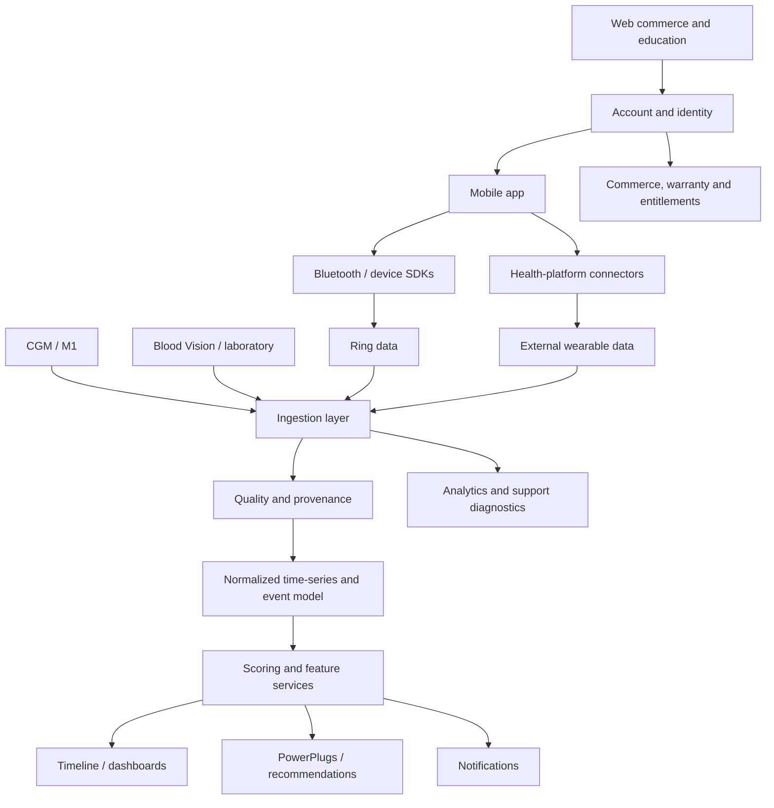

# Report E — Product Architecture Diagram

- **🟢 Confirmed.** Ring, CGM, blood and optional product surfaces are publicly described. [R2](https://www.ultrahuman.com/global/ring/) [R3](https://www.nature.com/articles/s41598-024-56933-2) [R4](https://www.ultrahuman.com/blood-vision/buy/us/)
- **🟡 Strong Inference.** The internal services in the diagram are required by the product behaviour but are not an official Ultrahuman architecture disclosure.
- **🔴 Speculation.** Exact language, framework, deployment topology, queues, databases and model vendors are unknown.

---
