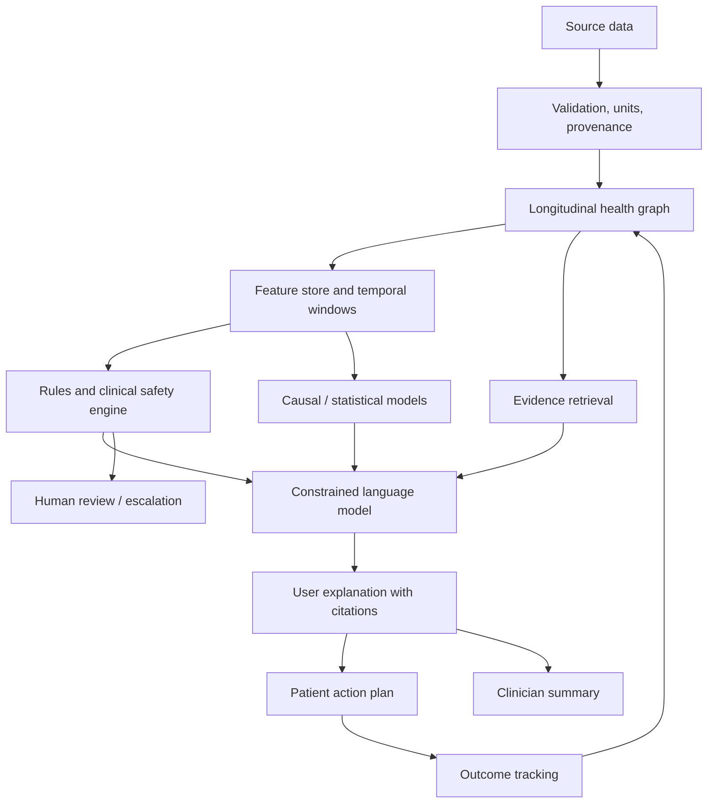

# Report F — AI Architecture Diagram for Ovexis

- **🟡 Strong Inference.** This architecture is recommended for Ovexis because it separates measurement, inference, evidence, language generation and safety.
- **🟡 Strong Inference.** LLMs should not directly calculate medical metrics, fabricate missing values, make unreviewed diagnoses or change medications.
- **🟡 Strong Inference.** Required evaluation metrics include factuality, citation correctness, temporal reasoning, calibration, subgroup performance, abstention quality, harmful-advice rate and action outcomes.
- **🟢 Confirmed / not publicly verified.** Ultrahuman’s specific LLMs, RAG, agent design, prompts and evaluation system are not publicly disclosed in the reviewed sources.

---
