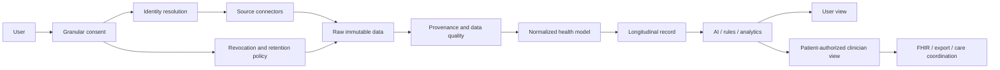

# Report G — Healthcare Data Flow and Consent Architecture

## Required controls

- **🟡 Strong Inference.** Consent must be purpose-specific: personalization, research, clinician sharing, employer reporting, and model improvement should not be one bundled checkbox.
- **🟡 Strong Inference.** Every derived insight should retain source observations, algorithm version, timestamp and confidence.
- **🟡 Strong Inference.** Revocation should stop future processing and trigger a documented downstream deletion or de-identification process where legally permitted.
- **🟢 Confirmed.** Ultrahuman’s public policy states that data is encrypted at rest and in transit and discusses cross-border processing and GDPR. [R12](https://www.ultrahuman.com/us/privacyPolicy/)
- **🟢 Confirmed / not publicly verified.** Ultrahuman’s full FHIR/HL7/CCDA, hospital, payer, pharmacy and imaging architecture was not publicly verified.

---
