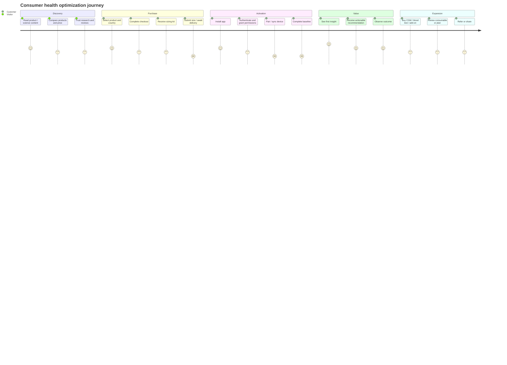

# Report H — User Journey Diagram and Conversion Analysis

- **🟢 Confirmed.** Sizing kits, app pairing, compatibility, core metrics and optional add-ons are publicly described. [R2](https://www.ultrahuman.com/global/ring/) [R4](https://www.ultrahuman.com/blood-vision/buy/us/)
- **🟡 Strong Inference.** The activation bottleneck is likely first trusted insight, not signup.
- **🟡 Strong Inference.** The conversion bottleneck is likely confidence that the data is continuous and actionable, not lack of product breadth.
- **🟢 Confirmed.** Public user reports identify pairing, syncing, battery and notification friction. [R6](https://www.reddit.com/r/Ultrahuman/comments/1l8ltnz/ultrahuman_ring_air_first_impression/) [R7](https://www.reddit.com/r/Ultrahuman/comments/1jomkxa/ultrahuman_ring_air_support_megathread)

---
