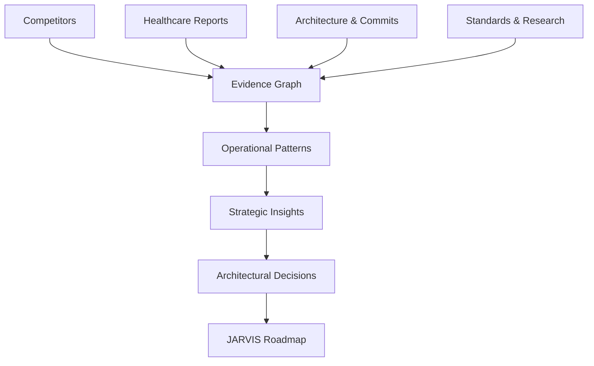

# JARVIS Strategic Decision Engine (JSDE)
*(Formerly Dissection / Ovexis Intelligence Synthesis Engine)*

This repository serves as the **Research Operating System** and **Decision Engine** for JARVIS. It converts diverse evidence—competitors, healthcare operations, engineering history, architecture, standards, research, and market evolution—into strategic intelligence and actionable engineering decisions for JARVIS.

## Why this exists

### Phase 1: Competitive Intelligence
Initially, this project focused on analyzing competitors (e.g., Mem0, Graphiti) to understand features, pricing, and UX. This resulted in dozens of isolated 200-page dossiers. Every new competitor required a mental comparison with the past ones. It did not scale.

### Phase 2 & 3: The Knowledge Operating System (Phase 1 to R Extensions)
To prevent disconnected PDFs, we evolved the system to store **knowledge, not just companies**. 
Instead of stopping at an isolated analysis, the flow became:

`New Dossier → Harvest → Knowledge Registry → Existing Knowledge Updated → Contradictions Detected → Research Priorities Change → Roadmap Recommendations Evolve`

This created specific registries for capabilities, failures, moats, decisions, and principles, creating a substrate where the system actually gets smarter with every new input.

### Phase 4: The Strategic Decision Engine
The goal shifted from understanding competitors to a single question:
> **Given all verified evidence, what should JARVIS build next, what should it explicitly refuse to build, and why?**

Competitors, commits, and healthcare reports are now just **evidence**. The ultimate output of this intelligence pipeline is the **JARVIS Engineering Roadmap**.

## The Current Pipeline

## Repository Structure & Key Components

*   **`jarvis-model`**: Agents must read this to understand the core model and purpose of JARVIS.
*   **`Dossaire/reports/`**: The crown jewel of this repo. Contains reports on the critical pain points of the healthcare operations that JARVIS is being built to solve. (If agents cannot read all reports, they must fall back to reading `All research reports analyzed/reconnaissance/`).
*   **`All research reports/`**: Contains competitor company dissection logs used to directly influence how JARVIS is architected.
*   **`jarvis-p2/`**: A snapshot of how the original project currently looks, serving as the basis for the research conducted. 

*(Note: Keep the separation clear. Dissection is the Research Operating System. JARVIS is the product. These registries belong in Dissection, not in the JARVIS codebase. Ovexis and JARVIS are two separate products, hence the renaming to JARVIS Strategic Decision Engine.)*

---

## JARVIS Engineering Roadmap
*Generated by `tools/route.py` from the registry substrate. Not hand-written. Regenerates on every `evolve.py` run.*

**Current stage 0 · 7 blocking exit criteria open**

*Stage discipline is enforced mechanically: no stage-N recommendation is emitted while stage-(N-1) blocking prerequisites remain open. Parked items are preserved with unpark triggers, never discarded.*

| Pri | Score | Route | Stage | Subsystem | Recommendation | Cost | Conf |
|---|---|---|---|---|---|---|---|
| P0 | 10.00 | adr | 0 | audit-trail | Clinical audit trail must be architected in, not retrofitted | m | HIGH |
| P0 | 6.49 | issue | 0 | rag-retrieval | Knowledge retrieval: replace HTML scraping with API tiers + failover | m | HIGH |
| P0 | 6.43 | issue | 0 | llm-engine | Wire generate_stream() — dark capability, largest latency win | xs | HIGH |
| P0 | 6.19 | milestone | 0 | opd-queue | Build OPD queue — Stage 0 centerpiece and first clinical workflow | l | HIGH |
| P1 | 5.10 | issue | 0 | stt | Replace external-URL STT with local speech recognition | m | HIGH |
| P2 | 3.42 | milestone | 0 | level6 | Freeze further L9 self-coding investment until Stage 0.5 ships | xs | HIGH |
| P2 | 3.08 | rfc | 0 | memory-store | Unbounded memory growth will degrade retrieval | m | MEDIUM |
| P2 | 2.83 | research | 0 | memory-store | Probe: is persistent memory the wrong architecture for clinical work? | s | LOW |
| P2 | 2.61 | adr | 0 | memory-store | Memory architecture: vector-first vs temporal-graph-native | xl | MEDIUM |
| P3 | 2.44 | research | 0 | memory-store | Memory consolidation — research before committing storage architecture | l | MEDIUM |
| P3 | 2.24 | milestone | 0 | audit-trail | Clinical compliance posture is the highest-leverage moat | l | HIGH |
| P3 | 1.19 | parked | 1 | adapter-sdk | MCP conformance for the adapter layer | m | HIGH |
| P3 | 1.01 | parked | 1 | adapter-sdk | Adopt pluggable-backends pattern for the adapter framework | m | MEDIUM |
| P4 | 0.29 | parked | 2 | — | Pricing: keep the differentiator inside the evaluation tier | xs | HIGH |
| P4 | 0.00 | ignore | 0 | memory-store | Vector retrieval — integrate, never build | xs | HIGH |

### P0 — Blocks Stage Exit

*   **R-001 · Clinical audit trail must be architected in, not retrofitted**
    *   *Stage 0 · Subsystem audit-trail · Route adr*
    *   *Cost: m · Maintenance: low · Confidence: HIGH*
    *   *User value: 2/5 · Strategic value: 5/5*
    *   *Dependencies:* S0-E8 | *Review trigger:* first clinical write path implemented
    *   *Source:* FAIL-005
    *   *Retrofit cost grows with every adapter. Mem0 demonstrates the endgame: zero compliance posture closed regulated verticals entirely.*

*   **R-007 · Knowledge retrieval: replace HTML scraping with API tiers + failover**
    *   *Stage 0 · Subsystem rag-retrieval · Route issue*
    *   *Cost: m · Maintenance: low · Confidence: HIGH*
    *   *User value: 3/5 · Strategic value: 3/5*
    *   *Dependencies:* S0-E1, S0-E2 | *Review trigger:* any silent retrieval failure in production
    *   *Source:* subsystem:rag-retrieval
    *   *Live fragility on an already-reachable capability. ToS exposure. Already scoped in the blueprint; correctly queued.*

*   **R-008 · Wire generate_stream() — dark capability, largest latency win**
    *   *Stage 0 · Subsystem llm-engine · Route issue*
    *   *Cost: xs · Maintenance: none · Confidence: HIGH*
    *   *User value: 4/5 · Strategic value: 2/5*
    *   *Dependencies:* none | *Review trigger:* none — do it
    *   *Source:* subsystem:llm-engine
    *   *Exists at `llm_engine.py:161`, called by nothing. Speech starts at token 1 instead of token 150. Hours of work. Dark capability is inventory, not output.*

*   **R-005 · Build OPD queue — Stage 0 centerpiece and first clinical workflow**
    *   *Stage 0 · Subsystem opd-queue · Route milestone*
    *   *Cost: l · Maintenance: medium · Confidence: HIGH*
    *   *User value: 5/5 · Strategic value: 5/5*
    *   *Dependencies:* S0-E1, S0-E2 | *Review trigger:* first physician session completed
    *   *Source:* subsystem:opd-queue
    *   *Blueprint's own words: the one thing that makes JARVIS a hospital tool rather than a generic automation tool. Uses only existing machinery. Puts a clinician in front of the system before Stage 1 compounds three stages of assumptions.*

### Parked — Future-stage, Preserved
*   **R-011** MCP conformance for the adapter layer — *stage 1, unpark: Stage 0 exit criteria complete*
*   **R-009** Adopt pluggable-backends pattern for the adapter framework — *stage 1, unpark: stage prerequisites complete*
*   **R-010** Pricing: keep the differentiator inside the evaluation tier — *stage 2, unpark: first paid customer conversation*
